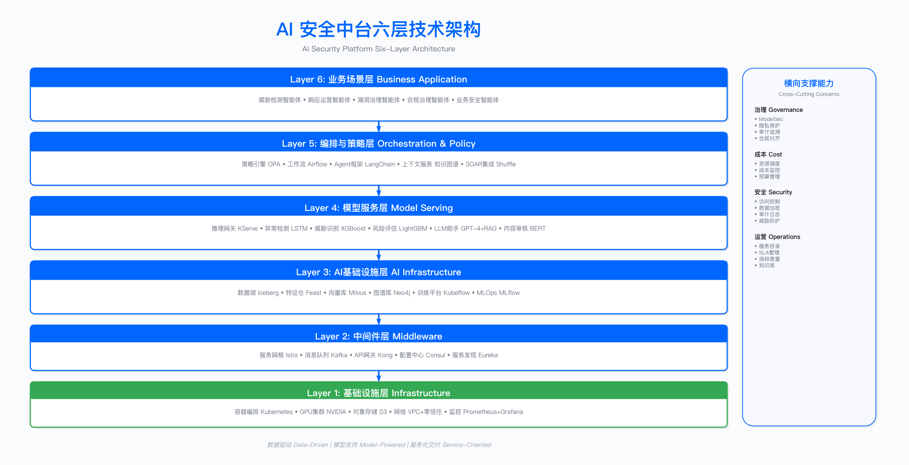

# Part 5: AI-Driven Security Innovation | AI 驱动的安全创新

> **构建 AI 赋能的安全能力体系**

**[← 上一部分：Part 4](../part_04_security_operations_defense_capabilities/)** | **[返回章节导航](../)** | **[→ 下一部分：Part 6](../part_06_security_leadership_organizational_excellence/)**

---

## 部分定位

本部分系统化阐述 AISecOps (AI-Security-Operations) 方法论框架，涵盖"AI for Cybersecurity"（用 AI 做安全）与"Security for AI"（保护 AI 系统安全）两个维度。将分散的 AI 安全实践整合为完整的方法论框架，从战略规划到工程落地提供全链路实践指南。

适用读者：安全架构师、SOC 负责人、AI/ML 工程师、安全运营工程师、CISO/安全负责人。

前置要求：建议先完成 Part 4（安全运营）的阅读，理解 SOC 运营基础与威胁检测机制；若涉及 Security for AI 场景，需结合 Part 2（技术架构）的应用安全与供应链安全内容。

**与其他部分的关系**：

- 承接 Part 1 的架构框架，将 AI 能力嵌入企业安全架构
- 承接 Part 2 的技术架构，AI 赋能云安全、应用安全、供应链安全
- 承接 Part 3 的数据安全，AI 赋能数据分类、DLP、隐私合规
- 承接 Part 4 的安全运营，AI 赋能 SOC、红队、业务安全
- 在 Part 6 中延伸为 AI 安全团队建设与能力培养

预计页数：约 110-150 页

---

## AISecOps 方法论概述

### 定义与范围

AISecOps (AI-Security-Operations) 是一种将 AI 技术融入安全工程全生命周期的方法论。该方法论涵盖安全战略规划、架构设计、威胁检测、事件响应到持续优化的完整闭环，旨在构建企业级 AI 安全能力体系。

与局部工具应用（如仅在 SOC 中使用 AI 工具）或单一技术领域（如 MLSecOps 专注于机器学习模型安全运营）不同，AISecOps 强调系统性整合，将 AI 能力平台化、服务化，类似于 DevSecOps 在软件开发中的作用。

### 适用边界

AISecOps 适用于以下场景：

- 已建立基础安全能力、需要提升检测与响应效率的组织
- 安全数据规模大、人工分析难以覆盖的环境
- 需要从规则驱动向行为驱动转型的安全运营团队

AISecOps 不适用于以下场景：

- 安全基础设施尚未建立或数据采集能力不完善的组织
- 缺乏基本安全运营流程的团队（需先建立流程再考虑智能化）

### 关键约束

数据质量依赖：AI 模型效果高度依赖训练数据质量，标注不准确或数据分布偏斜将直接影响检测效果。

组织能力要求：需要同时具备安全领域知识和 AI/ML 工程能力的复合型人才，单纯的安全团队或数据科学团队难以独立推进。

可解释性约束：安全场景对决策可解释性要求高，纯黑盒模型难以满足审计与合规需求。

成本约束：模型训练与推理需要计算资源投入，需权衡效果提升与基础设施成本。

---

## AISecOps 与相关概念的区别

为避免概念混淆，下表明确 AISecOps 与业界其他相似概念的区别：

| 概念                               | 定义                              | 范围                       | 与 AISecOps 的关系                    |
| ---------------------------------- | --------------------------------- | -------------------------- | ------------------------------------- |
| **AISecOps**                 | AI 驱动的全生命周期安全方法论框架 | 战略、架构、运营、创新全域 | 本书阐述的统领性方法论                |
| **AI for SOC**               | AI 赋能安全运营中心               | 仅聚焦 SOC 威胁检测与响应  | AISecOps 运营层的一个应用场景（子集）  |
| **MLSecOps/Security for AI** | 机器学习模型的安全运营            | 聚焦 ML 模型生命周期安全   | 对应 AISecOps 中 Security for AI 部分 |
| **SecOps+AI**                | 在传统 SecOps 中局部使用 AI 工具  | 工具级应用，未形成体系     | AISecOps 的初级阶段                   |

核心区别：AISecOps 不是"AI for SOC"的缩写。它将碎片化的 AI 安全能力（AI for SOC、Security for AI、AI 代码审查等）整合为企业级方法论体系，类似于 DevSecOps 将安全嵌入开发流程的系统性变革。

---

## 方法论演进对比

下表对比传统安全、DevSecOps 与 AISecOps 三种方法论的特征差异：

| 维度               | 传统安全            | DevSecOps                | AISecOps               |
| ------------------ | ------------------- | ------------------------ | ---------------------- |
| **核心理念** | 安全作为独立职能    | 安全左移，全生命周期内建 | 数据驱动，模型赋能     |
| **运作方式** | 人工审查，规则驱动  | 自动化流水线，策略即代码 | AI 模型驱动，持续学习  |
| **关键转变** | 事后补救            | 事前预防                 | 行为预测               |
| **效率特征** | 线性增长（增加人力） | 自动化提效               | 算力扩展               |
| **人的角色** | 执行者              | 策略制定者               | 模型训练者与决策监督者 |

三种方法论并非替代关系，而是演进叠加。AISecOps 的成功依赖于前两者建立的基础能力。

---

## AISecOps 的架构体系

**图注**：AI 安全平台六层技术栈参考架构，展示从基础设施（Layer 1）到业务应用（Layer 6）的完整技术栈。该架构为技术选型与基础设施规划提供全景视图，在此基础上可进一步抽象出面向安全能力建设的 AISC 四层能力中台架构（详见 14.2 节）。

AISecOps 方法论由四个层次构成，各层职责明确但相互依赖：

**战略层 (Strategic Layer)**

- AI 安全战略与治理框架制定
- 投资组合与优先级排序
- 成熟度模型与演进路线图
- 组织能力建设规划

**架构层 (Architecture Layer)**

- AI 安全中台架构设计
- 数据湖与特征平台构建
- MLOps 与模型服务能力
- Security for AI 控制框架

**运营层 (Operations Layer)**

- AI 威胁检测与响应（UEBA/XDR）
- 智能漏洞治理与优先级排序
- 自动化编排（SOAR+AI）
- 业务安全场景（反欺诈、内容审核）

**创新层 (Innovation Layer)**

- 大语言模型应用（LLM for Security）
- 对抗性 AI 防御
- 持续学习与模型优化
- Security for AI 实践

四层架构需要共同的支撑能力：数据治理与质量管理、AI 人才培养与文化变革、工具链与平台生态、度量体系与持续优化。

---

## SABSA 四层架构映射

本 Part 按照 SABSA 四层架构框架组织内容，从业务需求到运营服务形成完整闭环。下表展示 Chapter 14（AI for Cybersecurity）与 Chapter 15（Security for AI）如何映射到 SABSA 四层架构：

| SABSA 层级           | Chapter 14 (AI for Cybersecurity)                                 | Chapter 15 (Security for AI)                                           |
| -------------------- | ----------------------------------------------------------------- | ---------------------------------------------------------------------- |
| **业务需求层** | 14.1 战略框架：AI 赋能安全的价值定位、成熟度模型、ROI 评估        | 15.0-15.1 治理框架：AI 安全的业务驱动、合规压力、组织设计              |
| **架构逻辑层** | 14.2 中台架构：数据湖、MLOps、上下文服务、模型服务设计            | 15.4 安全架构：分阶段落地方法论、最小可行防御、架构演进                |
| **工程技术层** | 14.3-14.7 风险域实践：SecOps/AppSec/GRC/DataSec/BizSec 的 AI 赋能 | 15.2-15.3、15.5 防护技术：OWASP LLM Top 10、对抗攻击防御、数据隐私技术 |
| **运营服务层** | 14.8-14.9 实施路径：分阶段实施、运行指标、案例研究                | 15.6-15.7 合规运营：AI 治理合规落地、实战案例                          |

> 关于 SABSA 四层架构框架的详细说明，参见 [1.4.6 SABSA 四层架构框架](../part_01_foundation_strategic_governance/chapter_01_enterprise_architecture_foundation/1.4_security_architecture_landscape.md#146-sabsa-四层架构框架)

---

## D.A.T.A.S. 原则

本书提出 AISecOps 的五项核心原则，构成方法论的实践支柱：

### 原则 1：Data-Driven（数据驱动）

从经验驱动转向数据驱动决策。

实践要求：

- 建立统一数据湖，汇聚安全全域数据
- 数据质量优先，建立标注质量评估机制
- 建立度量体系，安全价值可量化
- 运营数据回流，形成反馈闭环

常见误区：

- 依赖直觉和经验做决策，数据仅用于事后验证
- 数据分散在多个系统中，缺乏统一治理
- 无法量化安全投入与业务价值的关系

### 原则 2：AI-First（AI 优先）

将 AI 作为核心能力而非辅助工具。

实践要求：

- 安全策略设计优先考虑 AI 能力边界
- 重复性工作优先探索 AI 自动化
- 新场景优先评估 AI 解决方案可行性
- 投资优先分配给 AI 平台建设

常见误区：

- AI 仅用于演示或概念验证，未进入生产环境
- 关键场景仍完全依赖人工，AI 仅处理边缘任务
- AI 预算占安全总预算比例过低

### 原则 3：Trustworthy（可信可控）

AI 系统自身必须安全可信。

实践要求：

- Security for AI 与 AI for Security 并重
- 建立 AI 治理框架（参考 NIST AI RMF、ISO 42001）
- 模型决策可解释，审计轨迹完整
- 对抗测试常态化，红队演练覆盖 AI 组件

常见误区：

- 黑盒模型直接上线，无法解释决策依据
- 模型未经充分测试直接部署
- 忽视 AI 特有风险（对抗样本、数据投毒、模型窃取）

### 原则 4：Adaptive（自适应）

持续学习，动态优化。

实践要求：

- 模型持续训练，适应威胁演进
- A/B 测试驱动迭代优化
- 反馈闭环完整，运营数据回流，用于训练
- 自动化模型更新流水线

常见误区：

- 一次训练长期使用，模型效果逐渐退化
- 无模型监控机制，漂移问题未被发现
- 缺乏运营反馈机制，误报无法改进

### 原则 5：Scalable（规模化）

从点状工具到平台化能力。

实践要求：

- 构建 AI 安全中台，实现能力复用
- 场景服务化、API 化
- 跨团队、跨业务线推广机制
- 知识沉淀与共享

常见误区：

- 每个场景重复开发，缺乏复用
- 能力无法跨团队迁移
- 烟囱式架构，系统间难以集成

---

## 成熟度演进路径

AISecOps 成熟度分为五个级别，各级别代表不同的能力状态：

### Level 1：初始级（Initial）

特征：开始探索 AI 在安全领域的应用，试用个别商业 AI 工具或开源方案。无统一战略，各团队独立尝试。缺乏专职 AI 安全人员，数据分散且未标注。

典型场景：试用 UEBA 工具、尝试 ML 钓鱼邮件识别、探索 AI 代码审查工具。

关键挑战：高层支持不足、预算有限、缺乏数据基础、团队技能不足。

演进关键：在一个高价值场景完成概念验证，量化展示效果，获得管理层支持。

### Level 2：可管理级（Managed）

特征：初步成功后扩展到多个关键场景，建立可复用流程。制定初步 AI 安全路线图，组建专职小组。

典型场景：UEBA 威胁检测、AI 驱动的漏洞优先级排序、智能告警聚合与降噪。

关键挑战：数据标注成本高、模型维护压力大、跨场景能力复用困难。

演进关键：建立 AI 安全平台的技术蓝图，证明投资回报，获得平台建设预算。

### Level 3：定义级（Defined）

特征：构建企业级 AI 安全平台，实现能力工业化、服务化。AI 安全战略嵌入企业安全架构，建立卓越中心（COE）。

典型场景：覆盖运营层（UEBA/XDR/SOAR）、开发层（AI 代码审查）、业务层（反欺诈/内容审核）。

关键挑战：平台建设复杂度高、数据治理要求高、Security for AI 能力需同步构建。

演进关键：AI 安全平台稳定运行，数据闭环建立，完整度量体系就位。

### Level 4：量化管理级（Quantified）

特征：全域数据驱动，AI 成为安全运营的核心能力。模型工厂化运作，具备预测性防御能力。

典型场景：威胁预测、自动化响应与自愈、LLM 安全助手、对抗样本防御。

关键挑战：数据规模持续增长、模型复杂度提升、可解释性要求提高。

演进关键：自适应能力初步实现，全域覆盖，具备行业影响力。

### Level 5：优化级（Optimizing）

特征：完全智能化、自适应的安全体系。目前尚无企业完整达到，代表未来演进方向。

典型设想：自适应威胁狩猎、基于行为的动态信任评分、安全数字孪生、多模态 AI 融合分析。

关键挑战：AI 自主决策的安全风险、监管合规复杂性、伦理问题。

---

## 验证方法与运行指标

### 成熟度自评

组织可通过以下维度评估当前成熟度：

- 是否建立统一数据湖并具备数据质量管理机制
- 是否有完整的度量体系支撑决策
- 新场景是否优先评估 AI 方案可行性
- 是否建立 AI 治理框架并具备可解释性要求
- 模型是否持续训练并监控漂移
- 是否构建平台化能力且可跨场景复用

### 运行指标体系

上线后应关注的核心指标：

运营效率指标：

- 告警降噪率：AI 介入后误报减少比例
- MTTD（平均检测时间）：从威胁发生到检测的时间
- MTTR（平均响应时间）：从检测到处置完成的时间

模型质量指标：

- Precision/Recall/F1：分类任务的准确性评估
- 模型漂移告警：特征分布变化监控
- 推理延迟：实时场景的响应时间

业务价值指标：

- 损失避免金额：通过 AI 检测阻止的潜在损失
- 事件处置数量变化：人均处置能力提升
- ROI：AI 安全投入与价值产出比

---

## 实践闭环

AISecOps 是持续优化的循环过程，包含六个阶段：

**规划（Plan）**：场景优先级评估、数据可用性评估、ROI 预测、资源与预算规划。

**构建（Build）**：数据采集与标注、特征工程、模型训练与调优、A/B 测试。

**部署（Deploy）**：模型版本管理、灰度发布、系统集成（SIEM/SOAR）、上线审批。

**运营（Operate）**：威胁检测/响应/漏洞治理、人机协同、SLA 监控、用户反馈收集。

**监控（Monitor）**：模型性能（精度/召回/F1）、业务指标（MTTD/MTTR）、模型漂移检测、成本监控。

**学习（Learn）**：误报/漏报分析、模型迭代优化、实践沉淀、知识库更新。

学习阶段的输出必须反馈到规划阶段，形成完整闭环。

---

## 章节概览

| 章节                                               | 主题                 | 核心内容                                      |
| -------------------------------------------------- | -------------------- | --------------------------------------------- |
| **[Chapter 14](./chapter_14_ai_for_security/)** | AI for Cybersecurity | AI 赋能威胁检测、响应运营、漏洞治理、安全左移 |
| **[Chapter 15](./chapter_15_security_for_ai/)** | Security for AI      | OWASP LLM Top 10、对抗攻击防御、AI 治理合规   |

Chapter 14 核心内容：

- 14.1 AI for Cybersecurity 战略框架
- 14.2 AI 安全平台架构
- 14.3 AI 赋能威胁检测（UEBA、异常检测、恶意软件识别）
- 14.4 AI 赋能响应运营（SOAR 智能编排、AI 助手）
- 14.5 AI 赋能漏洞治理（优先级排序、自动化修复）
- 14.6 AI 赋能安全左移（代码审查、威胁建模）
- 14.7 AI 赋能业务安全场景（反欺诈、内容审核等）
- 14.8 实施路径
- 14.9 案例研究

Chapter 15 核心内容：

- 15.0 执行摘要
- 15.1 Security for AI 治理框架
- 15.2 OWASP LLM Top 10 2025：从漏洞清单到威胁优先级决策
- 15.3 对抗性攻击与防御
- 15.4 AI 安全架构：分阶段落地方法论
- 15.5 AI 数据安全与隐私
- 15.6 AI 治理与合规落地
- 15.7 AI 安全实战案例

---

## 工具与技术栈参考

### AI for Cybersecurity 工具

- 威胁检测：Elastic Security ML、Splunk MLTK、Microsoft Sentinel
- SOAR：Palo Alto XSOAR、Splunk SOAR
- 代码审查：GitHub Copilot for Security、Snyk Code
- 威胁狩猎：MITRE Caldera、Jupyter Notebook

### Security for AI 工具

- 对抗防护：Adversarial Robustness Toolbox（IBM）、CleverHans
- LLM 安全：NeMo Guardrails（NVIDIA）、Microsoft Prompt Shield
- 模型扫描：ModelScan、Garak

---

## 实施检查清单

### 阶段 1：评估与规划

- AI 安全现状评估与成熟度分析
- 业务场景优先级排序（价值与可行性评估）
- 数据基础检查（日志覆盖、标注能力、隐私合规）
- AI 治理框架初步设计

### 阶段 2：快速验证

- 选择高价值场景进行概念验证
- 数据准备与特征工程
- 模型训练与效果评估
- ROI 初步验证

### 阶段 3：平台建设

- 构建 AI 安全平台（数据湖、特征平台、MLOps）
- 将验证场景产品化
- 扩展到多个关键场景
- Security for AI 能力同步落地

### 阶段 4：规模化推广

- 覆盖主要业务场景
- AI 能力嵌入各安全域
- 建立 AI 安全卓越中心
- 通过 AI 治理审计

---

## 与其他 Part 的关系

| Part             | 关系     | 连接点                              |
| ---------------- | -------- | ----------------------------------- |
| **Part 1** | 架构对齐 | AI 能力嵌入企业架构框架             |
| **Part 2** | 技术赋能 | AI 赋能云安全、应用安全、供应链安全 |
| **Part 3** | 数据协同 | AI 赋能数据分类、DLP、隐私合规      |
| **Part 4** | 运营增强 | AI 赋能 SOC、红队、业务安全         |
| **Part 6** | 组织支撑 | AI 安全团队建设与能力培养           |

---

## 参考资源

### 标准与框架

- NIST AI Risk Management Framework
- ISO/IEC 42001（AI 管理体系）
- OWASP LLM Top 10
- MITRE ATLAS（AI 对抗战术）

---

## 术语表 Glossary

| 术语                 | 英文                         | 定义                                                                    |
| -------------------- | ---------------------------- | ----------------------------------------------------------------------- |
| AISecOps             | AI-Security-Operations       | 本书提出的方法论框架，将 AI 技术融入安全工程全生命周期                  |
| AI for Cybersecurity | -                            | 用 AI 赋能安全能力，如威胁检测、漏洞治理、响应自动化                    |
| Security for AI      | -                            | 保护 AI 系统安全，如对抗攻击防御、模型安全、数据隐私                    |
| LLM                  | Large Language Model         | 大语言模型，如 GPT、Claude 等生成式 AI 模型                             |
| MLOps                | Machine Learning Operations  | 机器学习运营，管理模型训练、部署、监控的工程实践                        |
| OWASP LLM Top 10     | -                            | OWASP 发布的大语言模型十大安全风险清单                                  |
| Prompt Injection     | 提示词注入                   | 通过恶意输入操纵 LLM 行为的攻击技术                                     |
| 对抗样本             | Adversarial Example          | 通过微小扰动使 ML 模型产生错误输出的输入样本                            |
| 模型漂移             | Model Drift                  | 模型性能随时间或数据分布变化而下降的现象                                |
| 特征工程             | Feature Engineering          | 从原始数据构建模型输入特征的过程                                        |
| D.A.T.A.S.           | -                            | AISecOps 五原则：Data-Driven、AI-First、Trustworthy、Adaptive、Scalable |
| AI 安全中台          | AI Security Platform         | 企业级 AI 安全能力平台，实现模型与服务的复用                            |
| NIST AI RMF          | AI Risk Management Framework | NIST 发布的 AI 风险管理框架                                             |
| ISO 42001            | -                            | AI 管理体系国际标准                                                     |
| MITRE ATLAS          | -                            | AI 系统对抗战术与技术知识库                                             |

---

### 导航

**[← 上一部分：Part 4 - Security Operations](../part_04_security_operations_defense_capabilities/)** | **[返回章节导航](../)** | **[→ 下一部分：Part 6 - Security Leadership](../part_06_security_leadership_organizational_excellence/)**

### 本 Part 章节

- **[第 14 章：AI for Cybersecurity](./chapter_14_ai_for_security/)**
- **[第 15 章：Security for AI](./chapter_15_security_for_ai/)**
---

**© 2025 AI-ESA Project. Licensed under CC BY-NC-SA 4.0**
