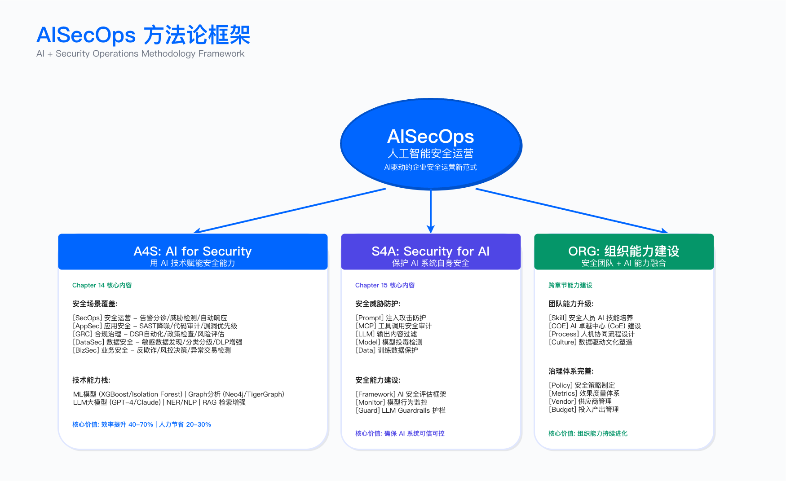
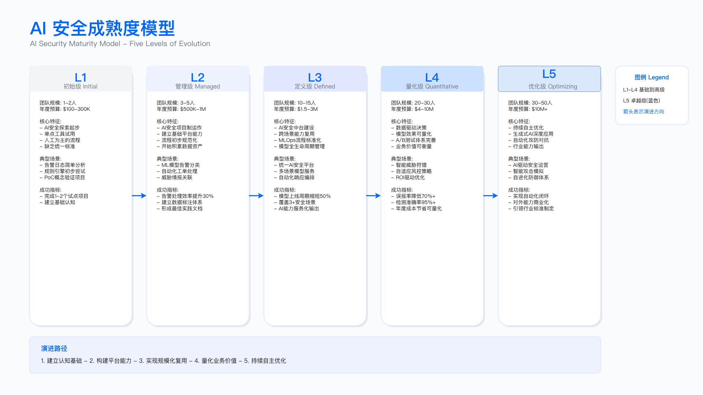

# 14.1 AI for Cybersecurity 战略框架

> **所属层次**：战略层（Strategic Layer）
> **章节定位**：AISecOps 方法论战略层的具体展开，定义 AI 安全愿景、成熟度路径与组织设计
> **预计页数**：18-22 页
> **目标读者**：CISO、安全负责人、架构师、AI 产品经理

---

## 14.1.1 AI for Cybersecurity 的定义与价值

### 核心定义

AI for Cybersecurity 是指将机器学习、深度学习、自然语言处理等人工智能技术应用于网络安全领域，实现从"人工主导"到"机器辅助决策"的转变。其核心特征在于：通过算法处理大规模安全数据，自动识别异常模式，为安全分析师提供经过筛选的高优先级事件，从而提升威胁检测效率与响应速度。

与传统基于规则的安全检测相比，AI 驱动的安全具备三项关键能力：

1. 行为基线学习：通过统计建模建立正常行为基线，检测偏离基线的异常（无需预定义规则）
2. 全量数据处理：算力允许处理 TB 级日志，覆盖率从抽样（5-10%）提升至近乎全量（>95%）
3. 模式自适应：模型可定期重训练，适应攻击手法演进（传统规则库更新周期通常以周 / 月计）

### 与 AISecOps 的关系

AISecOps 是完整方法论体系，AI for Cybersecurity 是其中"用 AI 做安全"的技术实施部分。二者关系如下：

```
AISecOps 方法论
├─ AI for Cybersecurity（本章重点）
│  └─ 用 AI 解决安全问题：威胁检测/响应/漏洞/合规
│
├─ Security for AI（Chapter 15）
│  └─ 保护 AI 系统安全：模型安全/数据安全/治理
│
└─ 组织文化变革
   └─ 从"安全团队独立作战"到"安全+AI 团队融合"
```

AISecOps 的成功依赖 AI for Cybersecurity 产生可量化业务价值，同时要求 Security for AI 确保 AI 系统本身可信。本章聚焦前者，第 15 章聚焦后者，两者构成完整闭环。



**图注**：AISecOps 方法论框架展示了 AI for Security（A4S）与 Security for AI（S4A）的双向关系，以及战略层、能力层、运营层的完整体系结构。

### 适用边界与约束条件

适用场景：

- 日志量 >100 GB / 天，人工分析已无法覆盖
- 需要检测未知威胁或内部异常行为
- 重复性安全操作占分析师工作量 >40%
- 存在历史安全事件数据可用于模型训练（至少 3-6 个月）

不适用场景：

- 日志采集不完整或数据质量差（缺失字段 >20%）
- 无历史标注数据且无法投入标注成本
- 安全团队规模 <3 人，无余力运维 AI 系统
- 合规要求明确禁止自动化决策（如某些金融监管环境）

关键约束：

- 数据依赖：模型效果上限受限于训练数据质量，垃圾数据产生垃圾模型（GIGO 原则）
- 冷启动周期：无监督异常检测需 3-6 个月建立基线，监督学习需足够标注样本（通常 >1000 条）
- 误报权衡：降低漏报率通常以提升误报率为代价，需根据业务容忍度调整阈值
- 可解释性：复杂模型（如深度学习）的决策过程难以解释，在强监管行业（金融、医疗）需谨慎使用


**图注**：AI 安全平台六层技术栈参考架构，展示了从基础设施（Layer 1）到业务应用（Layer 6）的完整技术栈。该架构为技术选型与基础设施规划提供全景视图。14.2 节将在此技术栈基础上，进一步抽象出面向安全能力建设的 AISC 四层能力中台架构。

### 与传统安全方法的对比

下表对比传统安全与 AI 驱动安全在四个核心维度的差异：

| 维度     | 传统安全                 | AI 驱动安全                 | 实施前提                     |
| -------- | ------------------------ | --------------------------- | ---------------------------- |
| 检测机制 | 基于预定义规则/签名      | 基于行为基线与异常统计      | 需 3-6 个月数据建立基线      |
| 数据覆盖 | 人工抽样（5-10%）        | 全量自动化处理（>95%）      | 需足够算力（GPU/分布式计算） |
| 响应速度 | 小时级（人工分析）       | 分钟级（自动触发 playbook） | 需预先配置响应编排规则       |
| 未知威胁 | 无法检测（依赖已知特征） | 可检测（统计偏离）          | 误报率可能升高 20-40%        |

核心权衡：AI 能检测未知威胁，但初期误报率显著高于成熟的规则引擎。典型实施路径是先在非关键业务试点，在误报率降至可接受水平（通常 <15%）后再推广至核心系统。

### 价值量化与验证方法

AI for Cybersecurity 的价值需通过可观测指标量化，避免"技术先进性"的空洞宣传。以下是四类核心指标：

效率类指标：

- 告警降噪率 = （AI 过滤告警数 / 原始告警总数）× 100%，目标 >70%
- 分析师平均处理时间（MTTP），目标较传统方法缩短 >40%

准确性指标：

- 精确率（Precision）= 真阳性 / （真阳性 + 假阳性），目标 >80%
- 召回率（Recall）= 真阳性 / （真阳性 + 假阴性），目标 >75%
- F1 分数 = 2 × （Precision × Recall） / （Precision + Recall），综合评估指标

响应速度指标：

- 平均检测时间（MTTD），从攻击发生到告警触发，目标 <1 小时
- 平均响应时间（MTTR），从告警到遏制措施生效，目标 <4 小时

业务影响指标：

- 阻止的攻击事件数（需与历史基线对比）
- 减少的数据泄露风险（通过渗透测试或红队演练验证）
- 节省的人力成本（分析师工时 × 平均薪资）

验证方法：

- 每季度进行红队演练，验证 AI 系统对模拟攻击的检出率
- 对比启用 AI 前后 6 个月的关键指标（MTTD、MTTR、告警量）
- 使用 A/B 测试：部分流量走 AI 检测，部分走传统规则，对比检出率与误报率

常见误区：

1. 仅关注准确率，忽视召回率，导致漏报严重威胁
2. 未建立基线就宣称"效率提升 XX%"，缺乏对比依据
3. 混淆"检测到威胁"与"阻止威胁"，前者仅是发现，后者需配合响应流程

---

## 14.1.2 AI 安全成熟度模型：五级演进路径

### 成熟度模型设计原则

本模型参考 CMMI（能力成熟度模型集成）框架，针对 AI 安全能力构建五级演进路径。每一级定义了明确的能力特征、组织要求、技术基础设施与典型挑战，企业可据此评估当前状态并规划跃迁路径。



**图注**：AI 安全成熟度五级演进模型，展示从 L1 初始级到 L5 优化级的能力跃迁路径，包含各级别的核心特征、投资规模与组织要求。

五级概览：

| 级别 | 名称       | 核心特征                   | 典型场景数 | 团队规模     | 投资规模参考（年）* |
| ---- | ---------- | -------------------------- | ---------- | ------------ | ------------------- |
| L1   | 初始级     | 零散试点，无统一规划       | 1-2        | 1-2 人兼职   | $100K-300K          |
| L2   | 可管理级   | 局部场景落地，初步数据治理 | 3-5        | 3-5 人小组   | $500K-1M            |
| L3   | 定义级     | 平台化能力，AI 安全中台    | 10-15      | 10-15 人 COE | $1.5M-3M            |
| L4   | 量化管理级 | 数据驱动决策，完整度量体系 | 20+        | 20-30 人     | $4M-10M             |
| L5   | 优化级     | 持续创新，行业引领         | 全域覆盖   | 30-50 人     | $10M+               |

> **注**：投资规模为典型参考值，实际成本受企业规模、技术栈、人力成本地区差异等因素影响，仅供规划参考。

### Level 1: 初始级 - 探索与实验

能力特征：

- 购买 1-2 个 AI 安全产品（如 UEBA、AI 代码审查）或试用开源工具
- 无统一数据治理，日志采集分散在各系统
- PoC（概念验证）项目多，但生产环境应用 <30%
- 缺乏 AI/ML 专业人才，依赖供应商支持

典型失败场景：
某制造企业采购 SIEM 厂商的 AI 告警分析模块（年费 $50 万），部署后发现 AI 模块要求至少 3 个月历史数据建立基线，但现有日志留存策略仅 30 天（为节省存储成本）。结果 AI 模块无法工作，项目停滞 9 个月。

关键约束：

- 数据基础薄弱：日志采集覆盖率 <60%，格式不统一，缺失关键字段
- 无标注数据：历史告警未做真假阳性标注，无法训练监督学习模型
- 预算有限：年度 AI 安全预算 <总安全预算的 10%

验证要点：

- 检查日志留存策略是否满足 AI 模块要求（通常需 ≥3 个月）
- 评估数据质量：抽样 1000 条日志，统计缺失字段比例，若 >20% 则需先整改
- 确认是否有至少 1 名团队成员具备机器学习基础知识

L1→L2 跃迁关键：

- 完成 1-2 个场景的 PoC 并产生可量化价值（如告警降噪 >50%）
- 向高层汇报成果，获得 L2 阶段投资预算（$500K-1M / 年）
- 建立数据治理流程：统一日志格式（推荐 JSON、CEF），延长留存至 ≥6 个月
- 招聘或培养 1-2 名具备 AI、ML 能力的安全工程师

### Level 2: 可管理级 - 局部应用

能力特征：

- 2-3 个场景成功落地并产品化（如告警降噪、漏洞优先级排序）
- 建立数据治理流程：统一 schema、质量监控、标注机制
- AI 工具与 SIEM/SOAR 初步集成，形成闭环
- 有专门小团队（3-5 人）负责 AI 模型运维

适用边界：

- 适合已有成熟 SIEM/SOAR 基础设施的企业
- 日志量 >100GB / 天，人工分析已成瓶颈
- 安全团队规模 ≥10 人，可抽调 3-5 人专职做 AI

关键挑战：

1. 技术债 vs 业务 KPI：技术团队希望花 6 个月重构数据平台为后续场景打基础，业务团队要求立即上线新场景。多数企业选择后者，导致技术债累积，每个新场景都需重复造轮子。
2. 数据科学家流失：招到的 2-3 名数据科学家调优模型 3-6 个月后离职（被高薪挖走或觉得企业安全场景缺乏技术挑战），模型训练知识未沉淀，新人需重新摸索。
3. ROI 量化困境：CFO 要求量化 AI 投资价值。"告警降噪 80%"的价值如何换算成金额？分析师工时节省了，但企业并未裁员，成本未真正下降。这需要建立更复杂的价值评估模型。

约束条件：

- 需要稳定的数据科学家团队（至少 2 人），流失率 <20% / 年
- 需要 MLOps 基础设施（模型版本管理、监控），否则模型维护成本极高
- 需要安全分析师配合标注数据（每周投入 ≥4 小时）

验证方法：

- 每月发布 AI 系统运行报告，包含精确率、召回率、误报率趋势
- 每季度进行模型 A/B 测试，验证新版本模型是否优于旧版本
- 建立 ROI 评估模型：价值 = 节省工时 × 平均薪资 + 避免损失期望值 - 系统成本

L2→L3 跃迁关键：

- 向 CEO、CFO 展示平台化建设的长期价值（避免重复造轮子，降低边际成本）
- 获得平台建设投资预算（$1.5M-3M，12-18 个月周期）
- 建立 AI 安全 COE（卓越中心），10-15 人编制，混合安全专家与数据科学家
- 设计 AI 安全中台架构（详见 14.2 节），确保可支撑未来 10+ 场景

常见误区：

- 误区 1：以为 L2 已足够好，停止投资，导致场景无法扩展，技术债爆发
- 误区 2：跳过平台建设，直接堆砌工具，最终形成新的烟囱系统
- 误区 3：未建立数据科学家留存机制（如技术成长路径、薪酬激励），人才流失率 >50%

### Level 3: 定义级 - 平台化能力

能力特征：

- 构建 AI 安全中台：统一数据湖、特征平台、MLOps 服务、模型市场
- 覆盖 10+ 业务场景，形成服务目录（如威胁检测、响应编排、漏洞治理、合规审计）
- 建立 Security for AI 控制框架（模型安全、数据治理、对抗攻击防御）
- AI 能力嵌入各安全域（SOC、AppSec、GRC、Business Security）

适用边界：

- 企业安全团队规模 ≥30 人
- 年度安全预算 ≥$5M
- 高层明确将 AI 安全作为战略优先级（通常需经历重大安全事件驱动）

关键约束：

- 平台建设周期长（12-18 个月），期间新场景上线速度减缓，需承受业务压力
- 投资金额大（$1.5M-3M/年），需 CEO 级别批准
- 组织变革难度高，需打破部门墙，建立跨职能 AI 安全 COE

验证要点：

- 平台 SLA：数据接入延迟 <5 分钟，模型推理延迟 <1 秒，可用性 >99.5%
- 场景复用率：新场景开发周期 <4 周（L2 阶段通常需 3-6 个月）
- 成本治理：GPU 利用率 >70%，避免资源闲置浪费

L3→L4 跃迁关键：

- 建立完整度量体系：业务指标（MTTD、MTTR）、技术指标（精确率、召回率）、成本指标（TCO、ROI）
- 数据闭环：运营数据自动反馈到模型训练，实现持续优化
- ROI >200%：能向 CFO 证明 AI 投资的商业价值（节省成本 + 避免损失 > 投入成本 × 2）

### Level 4: 量化管理级 - 数据驱动

能力特征：

- 建立完整 AI 安全指标体系（20+ 指标实时监控）
- 数据驱动决策：A/B 测试驱动模型迭代，每月更新模型版本
- AI 能力成为业务竞争力（如反欺诈 ROI >300%）
- Security for AI 通过审计认证（NIST AI RMF / ISO 42001）

适用边界：

- 适用于 AI 安全已是核心能力的企业（如金融、电商、云服务商）
- 年度 AI 安全投资 ≥$4M

关键指标：

| 指标类别 | 核心指标         | 目标值   | 计算方法                       |
| -------- | ---------------- | -------- | ------------------------------ |
| 威胁检测 | 告警准确率       | >85%     | 真阳性 / （真阳性 + 假阳性）     |
| 事件响应 | MTTR             | <30 分钟 | 从告警到遏制措施生效的平均时间 |
| 漏洞治理 | 高危漏洞修复周期 | <7 天    | 从漏洞发现到补丁部署的时间     |
| 业务安全 | 欺诈拦截率       | >95%     | 拦截欺诈交易数 / 总欺诈交易数  |
| 投资回报 | ROI              | >200%    | （价值 - 成本） / 成本 × 100%   |

验证方法：

- 每月 A/B 测试：新模型 vs 旧模型，若新模型 F1 分数提升 >5%，则上线
- 每季度红队演练：验证 AI 系统对模拟攻击的检出率，目标 >90%
- 每年进行第三方审计：Security for AI 合规性审计（NIST AI RMF、ISO 42001）

L4→L5 跃迁关键：

- 自适应能力：模型可根据威胁演进自动调整，无需人工干预
- 行业影响力：发表论文、申请专利、参与开源项目或国际标准制定
- 对外赋能：将 AI 能力产品化，对外输出（SaaS 服务或咨询）

### Level 5: 优化级 - 持续创新

能力特征：

- 主动防御与自适应安全：AI 自动调整防御策略，无需人工配置规则
- AI 能力成为产品与服务输出：对外提供 SaaS 服务或行业解决方案
- 引领行业创新与标准制定：参与 NIST、ISO 标准工作组，发表顶会论文
- 形成安全 + AI 的生态系统：开源社区贡献、行业联盟、产学研合作

适用边界：

- 全球仅 <5% 企业达到 L5
- 代表企业：Google（Chronicle Security AI）、Microsoft（Security Copilot）、大型云服务商

关键约束：

- 需持续研发投入（年度 >$10M）
- 需顶尖 AI 人才（通常从学术界或大厂挖角）
- 商业模式需支持长期研发（短期 ROI 压力会抑制创新）

验证要点：

- 发表顶会论文（如 USENIX Security、CCS、NDSS）或申请专利
- 参与国际标准制定（如 NIST AI RMF、ISO 42001 工作组）
- AI 能力对外输出，产生外部收入（如 SaaS 订阅、咨询服务）

**注**：多数企业无需追求 L5，L4 已能满足业务需求。L5 更适合将 AI 安全作为核心产品的企业（如安全厂商、云服务商）。

---

## 14.1.3 AI 技术路线选择

### 场景优先级评估方法

选择首个 AI 安全场景需权衡三个维度：业务价值（impact）、技术可行性（confidence）、实施难度（ease）。但传统 ICE 评分模型在实践中存在主观性问题，本节提供更可操作的决策框架。

简化决策框架：

1. 高层痛点可感知性：该场景的问题是否让 CEO、CFO 感受到？（例：告警疲劳导致分析师离职、欺诈损失直接影响财报）

   - 是 → 高优先级
   - 否 → 低优先级
2. 数据立即可用性：数据现在就能获取，无需额外采集或标注？

   - 是 → 高优先级
   - 否 → 延后（先解决数据问题）
3. 业务团队支持度：有业务团队愿意作为首个试点？

   - 是 → 高优先级
   - 否 → 延后（先建立信任）

**推荐首个场景**：告警降噪

理由：

- 痛点明确：每个 SOC 分析师都在抱怨"告警太多看不过来"
- 数据现成：SIEM 日志已有，无需额外采集
- 效果可见：降噪 70-80%，分析师立即感受到工作量下降
- 技术成熟：无监督异常检测（如 Isolation Forest）无需标注数据

**不推荐首个场景**（前 18 个月避免）：

- UEBA 内部威胁检测：需 3-6 个月基线，冷启动慢，初期误报率高
- AI 代码审查：需大量标注样本，初期误报率 >20%，会被开发团队抵制
- 零日漏洞预测：数据不足，准确率低，商业价值难量化

### 18 个月技术路线

#### 阶段 1：Quick Wins（0-6 个月）

目标：快速证明 AI 价值，获得后续投资

场景 1：告警降噪（优先级最高）

- 技术：Isolation Forest（无监督异常检测）+ 规则增强
- 数据需求：SIEM 日志（至少 3 个月历史）
- 预期成果：降噪 70-80%，MTTR 缩短 40%
- 投入：2 个月（1 名数据科学家 + 1 名安全分析师）

场景 2：漏洞优先级排序

- 技术：XGBoost + CVSS + EPSS（Exploit Prediction Scoring System）
- 数据需求：漏洞扫描结果 + CMDB + 业务权重（哪些系统最重要）
- 预期成果：高危漏洞修复周期从 30 天降到 10 天
- 投入：1 个月

场景 3：恶意域名、IP 检测（可选）

- 技术：Random Forest + 威胁情报
- 数据需求：DNS、网络日志 + 威胁情报 IOC
- 预期成果：拦截率提升 30%
- 投入：1 个月

阶段 1 交付物：

- 3 个可用的 AI 场景
- 第一批训练数据与标注机制
- 向 CEO、CFO 的成果汇报，包含 ROI 初步评估

#### 阶段 2：Platform Building（6-12 个月）

目标：建设 AI 安全中台，避免每个场景重复造轮子

核心任务：

- 构建统一数据湖（采集、存储、治理）
- 构建特征平台（复用特征工程）
- 构建 MLOps 服务（训练、推理、监控）
- 集成 SOAR 平台（自动化响应）
- 建立 Security for AI 框架（模型安全、数据治理）

投入：

- 时间：6-9 个月
- 人力：10-15 人（平台工程师 + 数据科学家 + 安全运营）
- 成本：$800K-1.5M（平台建设 + 云资源 + 人力）

关键风险：技术团队闭门造车，做出"技术完美但业务用不上"的平台

风险缓解：

- 每 2 周与 SOC/AppSec/GRC 团队开需求评审会
- 平台每个模块都要有业务场景验证（不能只是 demo）
- 先做 MVP（最小可行平台），3 个月出一版，别追求完美

#### 阶段 3：Scale & Optimize（12-18 个月）

目标：覆盖 10+ 场景，ROI >200%

高优先级场景：

- UEBA 内部威胁检测
- AI 代码审查（SAST 增强）
- 自动化事件响应（AI 助手）
- 反欺诈风控模型
- 供应链风险评估（SBOM 分析）

中优先级场景：

- 威胁情报自动化（NLP 处理情报）
- 隐私合规自动化（PII 自动发现）
- 内容审核（UGC 审核）

验证方法：

- 每个场景上线前需通过红队测试，检出率 >80%
- 每季度进行 ROI 评估，确保 ROI >200%
- 每月监控模型漂移，精确率、召回率下降 >10% 则触发重训练

### 技术选型约束

机器学习算法选择：

| 场景         | 推荐算法         | 优势             | 劣势         | 数据需求           |
| ------------ | ---------------- | ---------------- | ------------ | ------------------ |
| 告警降噪     | Isolation Forest | 无需标注数据     | 难以解释     | 3 个月日志         |
| 漏洞优先级   | XGBoost          | 准确率高，可解释 | 需标注数据   | >1000 条标注样本   |
| 恶意软件检测 | Random Forest    | 快速，准确       | 易被对抗攻击 | >10000 条样本      |
| UEBA         | LSTM（深度学习） | 捕捉时序模式     | 黑盒，难解释 | 6 个月用户行为日志 |

工具选型原则：

1. 优先选择云服务商开箱即用方案（AWS GuardDuty ML、Azure Sentinel），降低运维成本
2. 若自建，优先选择成熟开源框架（Scikit-learn、XGBoost），避免从零开发
3. 强监管行业（金融、医疗）需选择可解释性算法（决策树、逻辑回归），避免黑盒模型

常见误区：

- 误区 1：盲目追求深度学习，忽视简单算法（如决策树）在某些场景已足够好
- 误区 2：选择过于前沿的技术（如强化学习），缺乏生产级工具支持，实施风险高
- 误区 3：未考虑可解释性需求，在强监管行业使用黑盒模型，导致合规问题

---

## 14.1.4 AI 安全组织设计

### 常见失败组织模式

**常见误区 1**：AI 团队向 CISO 单线汇报

问题：CISO 通常不具备 AI、ML 技术背景，无法判断：

- 模型准确率 70% 是数据问题还是算法问题？
- 训练一个模型需 3 个月是正常周期还是团队能力不足？
- 采购 50 个 GPU 是真需求还是过度采购？

结果：CISO 无法有效管理 AI 团队，AI 团队觉得 CISO 不懂技术，互相不信任。

**常见误区 2**：AI 团队向 CTO 单线汇报

问题：CTO 关心技术完美度，不关心业务价值：

- CTO 要求模型准确率达到 95% 才能上线
- 安全团队认为 85% 准确率已足够，剩下 15% 人工兜底，重要的是快速上线

结果：AI 团队追求技术完美，安全业务场景迟迟上不了线。

**常见误区 3**：AI 团队独立运作，无明确汇报线

问题：AI 团队成为孤岛，不知道 SOC、AppSec、GRC 真正需要什么，做出的模型业务团队不会用，又回到人工处理。

结果：AI 团队变成成本中心，CFO 第一个砍预算。

### 推荐组织模式：双线汇报 + 嵌入式

```
AI Security COE (Center of Excellence)
├─ 战略层：向 CISO 汇报（业务价值、战略对齐）
├─ 技术层：向 CTO、CDO 汇报（平台建设、技术治理）
└─ 运营层：嵌入各安全域（SOC、AppSec、GRC、Business Security）
```

关键设计：

1. AI 安全负责人（Head of AI Security）

   - 双线汇报：实线向 CISO（业务 KPI），虚线向 CTO（技术 KPI）
   - 职责：确保 AI 能力与安全业务深度绑定，而非为技术而技术
   - 能力要求：10 年以上安全架构经验 + 3 年以上 AI、ML 项目经验
2. AI 安全平台团队（5-10 人）

   - 向 CTO、CDO 汇报，负责平台建设
   - 提供服务目录：数据接入、模型训练、推理服务、监控
   - KPI：平台稳定性（SLA >99.5%）、服务响应速度（<1 秒）、成本优化（GPU 利用率 >70%）
3. 嵌入式 AI 安全工程师（10-15 人）

   - 分散嵌入到 SOC、AppSec、GRC、Business Security 各团队
   - 角色：不是"支持角色"，而是"融合角色"（既懂安全又懂 AI）
   - KPI：所在业务域的 AI 场景落地数量、ROI

责任矩阵（RACI）：

| 活动     | AI 安全负责人    | 平台团队       | 嵌入式工程师  | SOC、AppSec |
| -------- | ---------------- | -------------- | ------------- | ----------- |
| 战略规划 | R（Responsible） | C（Consulted） | I（Informed） | C           |
| 平台建设 | A（Accountable） | R              | C             | I           |
| 场景开发 | A                | C              | R             | C           |
| 运营维护 | I                | C              | A             | R           |

### 关键岗位能力要求

**岗位 1**：AI 安全架构师（必须有，团队首位招聘）

技能要求：

- 10 年以上安全架构经验（理解 SOC、AppSec、GRC 各域痛点）
- 3 年以上 AI、ML 项目经验（知道哪些技术适合哪些场景）
- 业务理解能力（能把技术方案翻译成 CEO、CFO 听得懂的商业价值）

职责：

- 设计 18-24 个月的 AI 安全技术路线
- 评估供应商产品（避免被 PPT 忽悠）
- 向 CISO 汇报进展与风险

招聘建议：优先从有大厂 AI 安全项目经验的架构师中招聘，薪资预期 $100K-150K / 年（一线城市）。

**岗位 2**：资深数据科学家（必须有，团队第二位招聘）

技能要求：

- 5 年以上机器学习经验（熟悉监督、无监督、深度学习）
- 有安全场景经验（做过威胁检测、反欺诈、恶意软件检测）
- 工程能力强（能把模型部署到生产环境，不是只会写 Jupyter Notebook）

职责：

- 带领模型训练与调优
- 建立特征工程与模型评估标准
- 培养 junior 数据科学家

招聘建议：优先从有安全领域经验的数据科学家中招聘，避免招"纯学术派"（只会发论文，不懂工程）。薪资预期 $80K-120K / 年。

**岗位 3**：AI 安全产品经理（容易被忽视，但很重要）

技能要求：

- 5 年以上安全产品经验（理解 SOC、AppSec、GRC 的业务流程）
- 懂 AI 技术（不需要会写代码，但要理解 AI 能做什么、不能做什么）
- 需求管理能力（能把业务痛点转化成 AI 场景需求）

职责：

- 维护 AI 安全场景优先级列表
- 协调 AI 团队与业务团队的需求
- 定义 AI 服务的 SLA（准确率、响应时间、可用性）

招聘建议：优先从有安全产品经验的 PM 中招聘，再培养 AI 技术理解。薪资预期 $60K-80K / 年。

### 能力建设策略

现实约束：市场上"既懂安全又懂 AI"的人才极度稀缺（中国不到 500 人），无法全靠招聘解决。

混合策略：Buy + Build + Borrow

**Buy**（外部招聘）：

- 前 3 个关键岗位（架构师、数据科学家、产品经理）必须外部招聘
- 其他岗位可内部培养

**Build**（内部培养）：

培养路径示例：

- 从现有 SOC 团队挑选 3 名分析师，送去参加 3 个月 AI、ML 培训营（Coursera + 企业定制课程）
- 培训结束后，这 3 人成为"AI 安全混血儿"：懂 SOC 业务流程 + 懂 AI 技术 + 能当"翻译"（在数据科学家和 SOC 团队之间传话）
- 成本：$10K-15K / 人（培训费 + 脱产工资）

**Borrow**（外部合作）：

阶段 1 阶段（0-6 个月），可聘请咨询公司、专家团队：

- 快速验证技术路线（避免走弯路）
- 加速 PoC 落地（3 个月搞定第一个场景）
- 培养内部团队（边做边学）
- 成本：$50K-100K（3-6 个月咨询）

**关键约束**：必须让内部团队全程参与，避免咨询公司"做完就走"，知识未留存。

### 组织成熟度检查清单

| 检查项                       | L1 | L2           | L3             | L4             |
| ---------------------------- | -- | ------------ | -------------- | -------------- |
| 是否有明确的 AI 安全负责人？ | ☐ | ✓           | ✓             | ✓             |
| 是否有专职 AI 安全团队？     | ☐ | ✓（3-5 人） | ✓（10-15 人） | ✓（20-30 人） |
| 是否有双线汇报机制？         | ☐ | ☐           | ✓             | ✓             |
| 是否有嵌入式 AI 工程师？     | ☐ | ☐           | ✓             | ✓             |
| 数据科学家流失率 <20% / 年？   | ☐ | ☐           | ✓             | ✓             |
| 是否有内部 AI 培训计划？     | ☐ | ☐           | ✓             | ✓             |

---

## 本章小结：战略决策框架

完成本节阅读后，CISO、安全负责人需回答以下三个战略问题：

### 1. 我的组织当前在哪一级？目标是哪一级？

自评方法：

- 对照 14.1.2 节的五级成熟度特征，评估当前级别
- 确认当前级别的验证要点是否满足
- 识别跃迁到下一级的关键约束

决策要点：

- L1→L2：关键是打好数据基础，时间 6 个月，投资 $200K-300K
- L2→L3：关键是建设 AI 安全中台，时间 12-18 个月，投资 $1M-1.5M
- L3→L4：关键是 ROI 量化，时间 12-24 个月，持续优化
- 多数企业无需追求 L5（L4 已足够好）

### 2. 我该从哪个场景开始？

推荐顺序：

阶段 1（0-6 个月）：

1. 告警降噪（必做，quick win）
2. 漏洞优先级排序（必做，可量化 ROI）
3. 恶意域名、IP 检测（可选）

阶段 2（6-12 个月）：

- 建设 AI 安全中台（详见 14.2 节）

阶段 3（12-18 个月）：

- 根据业务痛点和数据成熟度选择 4-10 个场景

**避免的陷阱**：

- 不要贪多，阶段 1 只做 1-2 个场景
- 不要跳过平台建设，直接堆砌工具
- 不要选择数据不足或技术不成熟的场景（如零日漏洞预测）

### 3. 我该如何组建团队？

最小可行团队（L1→L2）：

- 1 名 AI 安全架构师
- 2 名数据科学家
- 1 名 AI 安全产品经理
- 3 名"混血儿"（从现有安全团队培养）
- 成本：$500K-700K / 年（人力 + 平台 + 云资源）

扩展团队（L2→L3）：

- +5-8 名平台工程师
- +3-5 名数据科学家
- +5-8 名嵌入式 AI 安全工程师
- 成本：$1.5M-2M / 年

**组织设计原则**：

- 采用双线汇报模式（CISO + CTO）
- 嵌入式工程师分散到各安全域
- 建立数据科学家留存机制（技术成长路径 + 薪酬激励）

---

## 下一节预告

[14.2 AI 安全中台架构设计与实施](./14.2_ai_security_platform_architecture.md) 将详细阐述：

- 为什么需要中台（避免重复造轮子，降低边际成本）
- AISC 四层能力中台架构（基础设施层、能力中台层、场景应用层、服务接入层）
- 六层技术栈与四层能力架构的映射关系
- 如何避免建成"空中楼阁"（平台设计陷阱与缓解措施）
- 实施路线图（四阶段，12-18 个月）
- 成本治理（GPU 资源优化，降低 TCO 40%）

关键关注点：14.2 节将回答"为什么很多企业的 AI 安全中台建了 2 年还没用起来"这个致命问题，并提供可验收的平台设计原则。

---

## 导航

**[← 上一节：14.0 执行摘要](./14.0_executive_summary.md)** | **[返回章节目录](./README.md)** | **[下一节：14.2 AI 安全平台架构 →](./14.2_ai_security_platform_architecture.md)**

---

**© 2025 AI-ESA Project. Licensed under CC BY-NC-SA 4.0**
