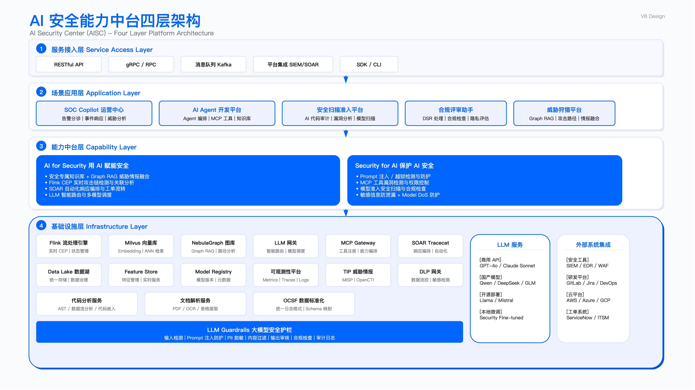
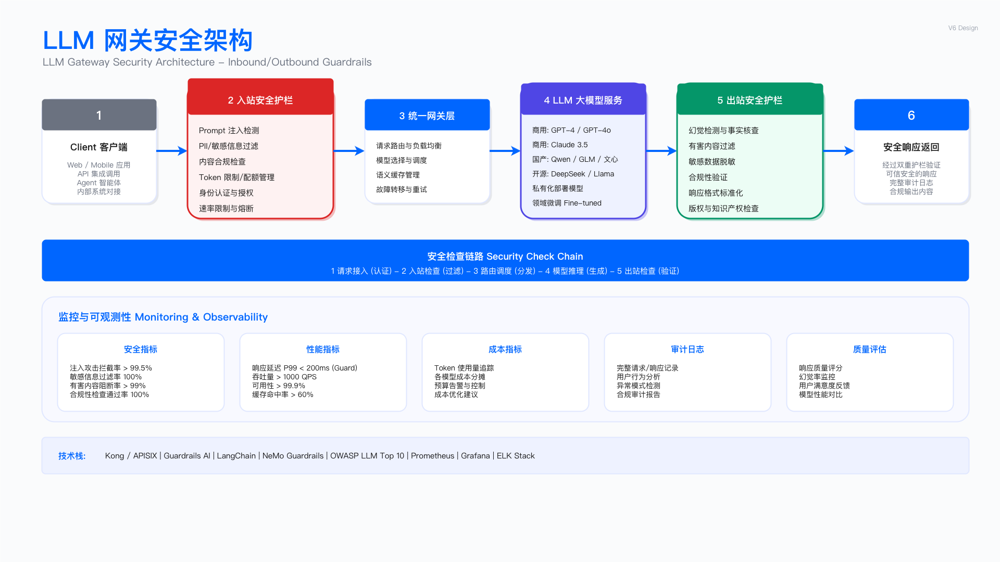

# 14.2 AI 安全中台架构设计

## 一、业务需求层：从业务目标出发梳理安全需求

### 1.1 中台定位与业务驱动

AI 安全中台（AI Security Center, AISC）是企业安全能力与治理中枢，将通用 AI 安全能力、策略数据与模型治理能力沉淀为可编排、可复用、可观测的平台式服务。中台的核心使命在于解决 Agentic AI 时代的上下文工程问题——如何在 Agent 执行任务的每一步，为其组装出适当的上下文组合，使任务能够可靠、高效地完成。

上下文工程（Context Engineering）涉及设计与维护一个动态系统，该系统根据任务阶段、数据敏感度与业务场景，智能调度知识库检索、实时数据流与模型推理能力。这一工程问题的解决质量直接决定了 AI 安全应用的实际效果。

从技术实现视角，中台承担三重职责：**数据汇聚**——将分散在 SIEM、EDR、云平台、ITSM 等系统的安全数据通过统一采集器接入，经 OCSF 标准化后写入数据湖与流处理引擎；**能力编排**——将检测模型、知识图谱、向量检索、LLM 推理等原子能力封装为可组合的服务，支撑上层应用按需调用；**治理管控**——对模型版本、数据血缘、访问权限、审计日志进行全生命周期管理，确保 AI 能力的可控与可追溯。

这种中台化设计的核心价值在于**复用与解耦**：下游应用（SOC Copilot、威胁狩猎平台、合规评审助手）无需关心底层向量库的索引策略或 LLM 的路由逻辑，只需调用标准化 API 即可获得上下文增强的推理结果。这与传统"烟囱式"安全工具建设形成鲜明对比——后者导致数据孤岛、能力重复建设、运维成本线性增长。

**业务驱动因素**

| 驱动类型 | 具体痛点 | 业务影响 |
|---------|---------|---------|
| 技术演进压力 | 大模型与多模态技术快速迭代，AI Agent 从对话工具升级为生产力工具 | 各团队独立构建 RAG 管道，重复投入且质量参差 |
| 运营效率瓶颈 | 安全运营依赖人工驱动，告警处理、事件响应、合规审查效率受限于人力规模 | 存在 SLA 违约风险，难以应对突发事件 |
| 数据碎片化 | 安全数据分布于 SIEM、EDR、云平台、工单系统等多个系统，缺乏统一采集与标准化 | 跨源关联分析困难，威胁检测能力受限 |
| 知识未结构化 | 安全专家经验与决策逻辑未进行结构化加工，AI 难以有效利用 | 知识传承依赖人员，模型训练缺乏高质量语料 |

### 1.2 核心业务场景需求

AISC 中台覆盖四大核心业务域。以下需求矩阵中的目标值为**内部规划口径**，实际效果需经生产验证后确认。

场景选择遵循"高频高价值优先"原则：SOC 运营是安全团队日常工作的核心，告警处理量大且重复性高，AI 介入的边际收益最为显著；GRC 场景涉及大量文档处理与合规判断，LLM 的自然语言理解能力可直接转化为效率提升；AppSec 场景的安全评审与代码审计依赖专家经验，知识库 + RAG 能够实现经验复用；数据安全与业务安全场景则需要实时决策能力，Flink CEP 与在线特征服务是关键支撑。

**场景一：SOC 智能运营（核心场景）**

安全运营中心面临告警疲劳、响应延迟、狩猎效率低下等问题。行业普遍反映，L1 分析师大量时间消耗在低价值告警的筛选与分派上，而真正需要深度分析的高危事件反而因资源不足而延迟处理。AI 赋能的切入点在于告警降噪、攻击链检测与自动化响应——通过语义相似度模型将重复告警折叠，利用 Graph RAG 进行跨日志源的攻击链关联，借助 SOAR 实现低风险事件的自动处置。

| 需求维度 | 当前痛点 | 目标状态 | 验收方法 |
|---------|---------|---------|---------|
| 告警处理 | 日均大量告警需人工筛选，有效告警占比低 | 实时关联 + AI 降噪，提升有效告警占比 | 对比优化前后有效告警率变化 |
| 威胁检测 | 规则驱动为主，难以发现未知攻击模式 | Graph RAG 攻击链检测 + 行为基线 | 红队模拟验证检出率 |
| 事件响应 | 手工编排，响应周期长 | SOAR 自动化 + 人工决策点 | 对比 MTTR 变化 |
| 威胁狩猎 | 依赖专家经验，覆盖面有限 | 语义检索 + 知识图谱驱动 | 狩猎发现率统计 |

**场景二：隐私邮箱智能运营（GRC）**

数据主体权利请求（DSR）处理涉及邮件分类、工单生成、合规审查等环节，人工处理效率低且追溯困难。

| 需求维度 | 当前痛点 | 目标状态 | 验收方法 |
|---------|---------|---------|---------|
| 邮件处理 | 人工分类与路由，处理周期长 | AI 分类 + 自动化工单生成 | 人工介入比例统计 |
| 响应时效 | 周级处理周期 | 智能分诊自动路由 | 平均响应时间统计 |
| 可追溯性 | 依赖人工记录，审计困难 | 全链路审计留痕 | 审计覆盖率验证 |

**场景三：AI 安全需求识别（AppSec）**

安全需求评审依赖专家经验，覆盖率低、周期长，知识难以复用。

| 需求维度 | 当前痛点 | 目标状态 | 验收方法 |
|---------|---------|---------|---------|
| 识别准确率 | 依赖人工经验，覆盖不全 | RAG 增强 + 策略即代码 | 人工复核准确率评估 |
| 评审周期 | 专家资源有限，排队等待 | 自动化评审建议生成 | 评审覆盖率变化 |
| 知识复用 | 各团队独立积累，无法共享 | 统一知识库 + 上下文增强 | 知识库调用频次 |

**场景四：数据安全与业务安全**

| 需求维度 | 当前痛点 | 目标状态 | 验收方法 |
|---------|---------|---------|---------|
| 敏感数据发现 | 人工标注覆盖率低 | AI 驱动的自动分类分级 | 覆盖率抽样验证 |
| 异常访问检测 | 规则驱动误报率高 | UEBA + 上下文风险评分 | 误报率统计 |
| 业务风控 | 规则滞后于黑产演变 | AI 模型 + 实时决策引擎 | 决策延迟与拦截率 |

### 1.3 平台能力需求矩阵

基于业务场景抽象，中台需提供两类核心上下文增强能力。这两类能力的设计体现了中台的核心技术路线：将 RAG（Retrieval-Augmented Generation）作为 AI 安全应用的基础范式，而非简单依赖大模型的原生能力。这一选择基于安全领域的特殊性——安全知识具有高度专业性、时效性与组织特异性，通用大模型无法涵盖最新的威胁情报、内部 SOP、历史事件上下文等关键信息。

**能力一：RAG 检索代理**

提供安全域专属知识库检索服务，接收知识库标识、查询内容、检索模式、返回数量、重排策略等参数，返回检索到的相关内容、置信度评分与来源元数据。

**能力二：自动检索注入**

设计兼容 OpenAI API 的接口，在请求提交给推理模型之前对用户请求进行语义识别，自动从安全知识库补全相关上下文信息，对上游调用方透明。

**能力需求优先级**

优先级划分遵循"价值密度"原则：P0 能力直接支撑核心业务场景，缺失将导致中台无法交付基本价值；P1 能力提供增量价值，可在 P0 能力稳定后逐步建设。实现复杂度评估综合考虑技术难度、团队能力匹配度与生态成熟度。

| 能力项 | 覆盖场景 | 优先级 | 实现复杂度 |
|-------|---------|-------|-----------|
| 安全专属嵌入模型与向量库 | 告警降噪、狩猎检索、报告生成、需求评审 | P0 | 中 |
| 实时流处理与 CEP 引擎 | 告警关联、攻击链检测、异常行为识别 | P0 | 高 |
| 日志/云/容器/工单连接器 | 全场景数据采集 | P0 | 中 |
| 语义相似度与重排模型 | 告警折叠、噪声判别、意图分类 | P0 | 中 |
| 安全图谱本体与 Graph RAG | 威胁狩猎、攻击路径、情报融合 | P0 | 高 |
| SOAR 编排与自动化响应 | 事件响应、工单流转、自动修复 | P0 | 中 |
| 规则 DSL 与 规则库 | 云/K8s 基线、IaC 检测、恶意内容识别 | P1 | 中 |

### 1.4 边界与约束条件

明确边界与约束是技术决策的关键前置条件。中台建设是一项重资产投入，需要评估组织的技术基础、人才储备与投资周期承受能力。过度建设导致资源浪费，建设不足则难以形成规模效应。

**适用边界**

中台建设适用于满足以下条件的组织：

- **业务规模**：安全日志量超过 5 TB/天，或员工数超过 5000 人，或管理的云资产超过 1 万实例
- **场景验证**：已在至少 3 个高价值场景中验证 AI 的实际效果，且稳定运行至少 6 个月
- **组织能力**：拥有专职团队（建议 6-10 人），包含安全领域专家、AI/ML 工程师、数据工程师
- **投资周期**：认可 18-24 个月的建设周期，以及首年难以实现正 ROI 的现实

**不适用场景**

小规模组织（日志量 < 1 TB/天，员工 < 2000 人）更适合采购商业 AI 安全产品并通过 API 集成，而非自建中台。商业产品选型可参考：Splunk MLTK、Microsoft Sentinel、Exabeam UEBA 等。

**关键约束**

| 约束类型 | 具体内容 | 应对策略 |
|---------|---------|---------|
| 数据质量 | 模型效果依赖标注质量与数据完整性 | 建立数据质量门控，优先治理高价值数据源 |
| 计算资源 | 流处理与模型推理需要持续的计算投入 | 分阶段建设，按场景优先级分配资源 |
| 人才储备 | 需要安全 + AI 复合型人才 | 内部培养与外部引进结合 |
| 合规约束 | 敏感数据需本地处理 | 建立数据分级与模型路由策略 |

---

## 二、架构逻辑层：设计应用安全框架与防御策略

架构逻辑层是 SABSA 方法论中连接业务需求与技术实现的关键桥梁。本层的核心任务是将业务场景需求转化为可落地的技术架构，定义组件边界、交互协议与数据流转规则。架构设计需要在灵活性与可控性之间取得平衡——过度抽象导致实现复杂度膨胀，过度具象则限制了场景扩展能力。

### 2.1 四层能力中台架构设计

#### 2.1.1 架构视角说明：六层技术栈 vs 四层能力中台

在 14.1 节中，我们介绍了 AI 安全平台的**六层技术栈参考架构**（见下图），该架构从技术实现视角展示了从基础设施到业务应用的完整技术栈，适用于技术选型与基础设施规划。

本节将在六层技术栈基础上，进一步抽象出面向安全能力建设的**四层能力中台架构**。两种架构视角的定位与映射关系如下：

| 视角 | 六层技术栈架构 | 四层能力中台架构 |
|-----|--------------|----------------|
| **定位** | 技术选型与基础设施规划 | 安全能力建设与场景落地 |
| **侧重点** | 底层技术组件细分 | 安全能力抽象与编排 |
| **适用对象** | 平台工程师、架构师 | 安全团队、业务方 |

**架构映射关系**：

| 六层技术栈 | 四层能力中台 |
|-----------|------------|
| Layer 6: 业务场景层 | ① 服务接入层 + ② 场景应用层 |
| Layer 5: 编排与策略层 | ② 场景应用层（编排部分） |
| Layer 4: 模型服务层 | ③ 能力中台层（模型服务） |
| Layer 3: AI 基础设施层 | ③ 能力中台层 + ④ 基础设施层 |
| Layer 2: 中间件层 | ④ 基础设施层 |
| Layer 1: 基础设施层 | ④ 基础设施层 |

四层能力中台架构将六层技术栈中的底层三层（基础设施、中间件、AI 基础设施）合并为统一的基础设施层，同时将安全能力抽象为独立的能力中台层，更清晰地体现 **AI for Security**（用 AI 增强安全能力）与 **Security for AI**（保护 AI 系统安全）的双向能力建设目标。

#### 2.1.2 四层架构详解

AISC 安全能力中台采用四层架构设计，自下而上分别为基础设施层、能力中台层、场景应用层与服务接入层。这一分层遵循"关注点分离"原则：基础设施层提供通用技术组件，屏蔽底层实现细节；能力中台层封装安全领域逻辑，提供可复用的原子能力；场景应用层组合原子能力，构建面向具体场景的解决方案；服务接入层统一对外暴露接口，实现访问控制与流量治理。

```
┌─────────────────────────────────────────────────────────────────────────────────────┐
│                            服务接入层 (Service Access Layer)                          │
│  ┌─────────────┐  ┌─────────────┐  ┌─────────────┐  ┌─────────────┐                 │
│  │ RESTful API │  │    RPC      │  │  消息队列   │  │  平台集成   │                 │
│  └─────────────┘  └─────────────┘  └─────────────┘  └─────────────┘                 │
├─────────────────────────────────────────────────────────────────────────────────────┤
│                               应用层 (Application Layer)                              │
│  ┌───────────┐  ┌───────────┐  ┌───────────┐  ┌───────────┐  ┌───────────┐         │
│  │SOC Copilot│  │AI Agent   │  │安全扫描   │  │合规评审   │  │威胁狩猎   │         │
│  │ 运营中心  │  │开发平台   │  │准入平台   │  │ 助手     │  │ 平台     │         │
│  └───────────┘  └───────────┘  └───────────┘  └───────────┘  └───────────┘         │
├─────────────────────────────────────────────────────────────────────────────────────┤
│                               能力层 (Capability Layer)                               │
│  ┌──────────────────────────────────┐  ┌──────────────────────────────────────┐    │
│  │      AI for Security             │  │      Security for AI                 │    │
│  │  • 安全专属知识库 + Graph RAG    │  │  • Prompt 注入/越狱检测             │    │
│  │  • Flink CEP 攻击链检测          │  │  • MCP 工具漏洞检测                 │    │
│  │  • SOAR 自动化响应               │  │  • 模型准入安全扫描                 │    │
│  │  • LLM 智能路由                  │  │  • 敏感信息防泄漏 + Model DoS 防护  │    │
│  └──────────────────────────────────┘  └──────────────────────────────────────┘    │
├─────────────────────────────────────────────────────────────────────────────────────┤
│                          基础设施层 (Infrastructure Layer)                            │
│  ┌─────────┐ ┌─────────┐ ┌─────────┐ ┌─────────┐ ┌─────────┐ ┌─────────┐          │
│  │Flink流  │ │Milvus   │ │Nebula   │ │LLM网关  │ │MCP网关  │ │ SOAR    │          │
│  │处理引擎 │ │向量库   │ │Graph图库│ │智能路由 │ │Gateway  │ │Tracecat │          │
│  └─────────┘ └─────────┘ └─────────┘ └─────────┘ └─────────┘ └─────────┘          │
│  ┌─────────┐ ┌─────────┐ ┌─────────┐ ┌─────────┐ ┌─────────┐ ┌─────────┐          │
│  │Data Lake│ │Feature  │ │Model    │ │可观测性 │ │   TIP   │ │DLP网关  │          │
│  │数据湖   │ │Store    │ │Registry │ │平台     │ │威胁情报 │ │数据流控 │          │
│  └─────────┘ └─────────┘ └─────────┘ └─────────┘ └─────────┘ └─────────┘          │
│  ┌─────────────────────┐ ┌─────────────────────┐ ┌───────────────────────────┐    │
│  │ 代码分析服务        │ │ 文档解析服务        │ │   LLM Guardrails          │    │
│  │ AST/数据流/代码嵌入 │ │ PDF/OCR/表格提取    │ │   (大模型栅栏)            │    │
│  └─────────────────────┘ └─────────────────────┘ └───────────────────────────┘    │
└─────────────────────────────────────────────────────────────────────────────────────┘
```



**图注**：AISC 四层能力中台架构设计，展示服务接入层、场景应用层、能力中台层与基础设施层的组成及核心组件。该架构基于六层技术栈进行安全能力抽象，聚焦 AI for Security 与 Security for AI 双向能力建设。

### 2.2 基础设施层组件设计

基础设施层依托企业现有技术能力，提供中台运行的基础支撑。组件选型遵循"优先复用、按需自建"原则——优先利用企业已有的数据平台、消息队列、存储系统，避免重复建设；对于安全领域特有需求（如向量库、图数据库），则需评估自建与采购的成本效益比。

以下按功能域分组说明各组件的设计要求与验收标准。每个组件不仅描述其功能定位，还明确其适用边界与常见误区，帮助架构师在实际选型中规避陷阱。

#### 2.2.1 统一流处理引擎（Apache Flink）

流处理引擎承担实时数据处理、复杂事件处理（CEP）与状态管理职责。选择 Flink 的依据在于其统一的流批处理能力、原生 CEP 支持与成熟的状态管理机制。

| 功能维度 | 设计要求 | 验收方法 |
|---------|---------|---------|
| 实时处理 | 支持毫秒级事件处理 | 端到端延迟压测 |
| CEP 规则 | 支持攻击链模式匹配 | 模式匹配功能验证 |
| 状态管理 | 支持大规模状态存储与恢复 | Checkpoint 恢复测试 |
| 精确一次 | 保证 Exactly-Once 语义 | 故障恢复后数据一致性验证 |

**适用边界**：适用于需要实时关联分析的场景，如告警聚合、攻击链检测、异常行为识别。不适用于纯批处理或对延迟不敏感的离线分析场景。

**常见误区**：

- 将 Flink 仅用作数据管道而忽视其 CEP 能力，未能发挥攻击链检测价值
- 状态规模设计不足，生产环境 Checkpoint 失败导致数据丢失

**攻击链检测模式设计**

基于 MITRE ATT&CK 战术阶段定义攻击链模式，典型模式为：侦察 → 初始访问 → 横向移动 → 数据外泄。时间窗口设定参考 APT 攻击生命周期特征。

| 攻击阶段 | ATT&CK 战术 | 时间窗口 | 说明 |
|---------|------------|---------|------|
| 侦察 | Reconnaissance | 起始点 | 端口扫描、服务探测 |
| 初始访问 | Initial Access | ≤30 分钟 | 漏洞利用、钓鱼成功 |
| 横向移动 | Lateral Movement | ≤2 小时 | 凭据窃取、内网渗透 |
| 数据外泄 | Exfiltration | ≤24 小时 | 数据打包、外传 |

> 时间窗口为经验值，需根据组织威胁情报与红队模拟结果调整。

**长周期攻击链检测**

APT 攻击通常具有长驻留时间（参见 [Mandiant M-Trends 2024](https://cloud.google.com/security/resources/m-trends) 报告），短窗口 CEP 难以捕获。需引入长周期检测机制：

| 检测场景 | 时间窗口 | 检测策略 | 技术实现 |
|---------|---------|---------|---------|
| C2 低频信标 | 7 天滑动窗口 | 周期性外联模式检测（固定间隔±抖动） | Flink Session Window + 频谱分析 |
| 慢速数据外泄 | 30 天滑动窗口 | 累计外传量异常 + 目的地信誉评估 | ClickHouse 聚合 + 阈值告警 |
| 凭据异常使用 | 14 天基线窗口 | 偏离历史行为基线的认证模式 | UEBA 基线模型 + 图谱关联 |
| 横向移动扩散 | 7 天滑动窗口 | 新增主机访问关系图扩张速度 | NebulaGraph 增量分析 |
| 持久化后门 | 30 天回溯窗口 | 计划任务/服务/注册表变更关联 | 批处理关联 + 威胁情报匹配 |

**长短窗口协同机制**：

```
┌─────────────────────────────────────────────────────────────────────────────┐
│                          双层检测架构                                        │
├─────────────────────────────────────────────────────────────────────────────┤
│                                                                             │
│  ┌─────────────────────────────────────────────────────────────────────┐   │
│  │                    实时层（Flink CEP）                               │   │
│  │  • 短窗口模式匹配（分钟~小时级）                                      │   │
│  │  • 高置信度告警立即触发                                               │   │
│  │  • 低置信度事件写入持久化存储等待长周期关联                            │   │
│  └────────────────────────────────┬────────────────────────────────────┘   │
│                                   │                                         │
│                                   ▼                                         │
│  ┌─────────────────────────────────────────────────────────────────────┐   │
│  │                    批处理层（Spark/ClickHouse）                      │   │
│  │  • 长窗口聚合分析（天~月级）                                          │   │
│  │  • 低频模式识别（C2 信标、慢速外泄）                                   │   │
│  │  • 历史回溯狩猎（IOC 追溯匹配）                                        │   │
│  └────────────────────────────────┬────────────────────────────────────┘   │
│                                   │                                         │
│                                   ▼                                         │
│  ┌─────────────────────────────────────────────────────────────────────┐   │
│  │                    图分析层（NebulaGraph）                            │   │
│  │  • 长周期关系演化分析                                                 │   │
│  │  • 跨时间窗口路径拼接                                                 │   │
│  │  • Campaign 归因与聚类                                                │   │
│  └─────────────────────────────────────────────────────────────────────┘   │
│                                                                             │
└─────────────────────────────────────────────────────────────────────────────┘
```

**C2 信标检测模式**：

| 检测维度 | 特征描述 | 检测方法 |
|---------|---------|---------|
| 时间规律性 | 固定间隔回连（±抖动） | 傅里叶变换/自相关分析 |
| 数据量一致性 | 心跳包大小相近 | 标准差分析 |
| 目的地稳定性 | 同一 C2 基础设施 | DNS/IP 聚类 |
| 协议伪装 | HTTP(S)/DNS 隧道 | 协议行为异常检测 |

> APT 长周期检测资源消耗较高，建议采用分层存储策略：热数据（7 天）使用 Flink 状态，温数据（30 天）使用 ClickHouse，冷数据（>30 天）使用对象存储。

**运行指标**：

- CEP 模式匹配延迟：监控 P99 延迟，告警阈值需根据场景设定
- Checkpoint 成功率：监控连续失败次数，超过阈值触发告警
- 状态大小：监控状态增长趋势，预防存储溢出

#### 2.2.2 数据标准化（OCSF）

采用 OCSF（Open Cybersecurity Schema Framework）作为统一日志格式标准，解决多源日志格式异构问题。OCSF 是由 AWS、Splunk 等厂商共同制定的开放标准，具备良好的互操作性。

**适用范围与约束**：OCSF 适用于结构化安全日志（SIEM、EDR、网络流量），对于非结构化数据（文档、邮件正文）需先进行实体抽取后再映射。当前 OCSF v1.1 对云原生场景（K8s Audit、云 API 日志）的覆盖仍在演进中，可能需要自定义扩展字段。

| Schema 字段 | 数据类型 | OCSF 类别 | 说明 |
|------------|---------|----------|------|
| class_uid | int | Event Class | 事件类别唯一标识 |
| category_uid | int | Category | OCSF 事件类别 |
| severity_id | int | 0-6 | 严重级别 |
| time | datetime | RFC 3339 | 事件时间戳 |
| actor | object | Actor | 执行者信息 |
| src_endpoint | object | Network Endpoint | 源端点 |
| dst_endpoint | object | Network Endpoint | 目标端点 |
| observables | array | Observable | 可观测对象 |
| unmapped | object | Unmapped | 原始未映射数据 |

**验证方法**：

- Schema 合规率验证：抽样检查转换后数据是否符合 OCSF 规范
- 字段完整性验证：必填字段缺失率监控
- 转换延迟监控：从原始日志到标准化输出的时间差

**常见陷阱**：

- 过度映射：强行将所有字段映射到 OCSF 标准字段，导致语义失真。建议保留原始数据在 unmapped 字段
- 时区处理：不同日志源时区不一致，转换为 UTC 时需处理夏令时边界情况
- 版本锁定：OCSF 版本升级时需评估兼容性影响，建议在 metadata 中记录 schema 版本

**运营指标**：

| 指标 | 计算方法 | 告警阈值建议 |
|-----|---------|-------------|
| Schema 合规率 | 合规事件数 / 总事件数 | < 99% |
| 必填字段缺失率 | 缺失事件数 / 总事件数 | > 1% |
| 转换延迟 P99 | 原始时间戳 - 标准化时间戳 | > 500ms |

#### 2.2.3 向量数据库（Milvus）

向量数据库用于存储安全知识库的嵌入向量，支撑语义检索能力。选择 Milvus 的依据在于其云原生架构与规模化能力。

| 功能模块 | 具体能力 | 资源需求参考 |
|---------|---------|-------------|
| 向量存储 | 亿级向量存储，支持多索引类型 | 取决于向量维度与数量 |
| ANN 检索 | 近似最近邻检索，支持混合检索 | GPU 加速需 NVIDIA 显卡 |
| 分区管理 | 按租户/场景分区 | 分区数影响查询性能 |

**常见误区**：

- 索引类型选择不当：HNSW 适合召回精度要求高的场景，IVF_FLAT 适合大规模低延迟场景
- 忽视分区策略：未按租户分区导致数据隔离问题

**Milvus Collection 设计要点**

| 字段设计 | 说明 | 配置建议 |
|---------|------|---------|
| 主键（id） | 向量唯一标识 | VARCHAR(64)，业务 ID 格式 |
| 嵌入向量（embedding） | 文本嵌入结果 | FLOAT_VECTOR，维度与模型匹配 |
| 内容（content） | 原始文本 | VARCHAR，按需设置长度上限 |
| 类别（category） | 知识分类 | 用于过滤检索 |
| 租户（tenant_id） | 多租户隔离 | 配合分区策略使用 |

| 索引类型 | 适用场景 | 配置参数 |
|---------|---------|---------|
| HNSW | 高召回精度 | M=16, efConstruction=256 |
| IVF_FLAT | 大规模低延迟 | nlist=1024, nprobe=16 |

**Embedding 模型选型与安全领域微调**

通用 Embedding 模型在安全领域存在语义理解偏差：无法区分"lateral movement"（横向移动攻击）与"lateral thinking"（横向思维），难以理解 CVE 编号、ATT&CK 技术 ID 等专业术语。需针对安全领域进行选型优化或微调。

**模型选型评估矩阵**

| 模型类别 | 代表模型 | 维度 | 中文能力 | 安全适配度 | 部署方式 |
|---------|---------|-----|---------|-----------|---------|
| 通用多语言 | BGE-M3 | 1024 | 优 | 中 | 本地/API |
| 通用多语言 | E5-Mistral-7B | 4096 | 良 | 中 | 本地 |
| 代码专用 | CodeBERT | 768 | 差 | 代码场景高 | 本地 |
| 安全微调 | SecBERT（需自建） | 768 | 按语料 | 高 | 本地 |
| 商业 API | OpenAI text-embedding-3-large | 3072 | 良 | 中 | API |
| 商业 API | Cohere embed-v3 | 1024 | 良 | 中 | API |

**安全领域微调策略**

> 效果预期为行业经验估算区间，实际效果受数据质量、基座模型、任务复杂度等因素影响，需通过 A/B 测试验证。

| 微调方法 | 适用场景 | 训练数据要求 | 效果预期（经验区间） |
|---------|---------|-------------|---------|
| 对比学习微调 | 提升安全术语理解 | 正负样本对 10K+ | 领域召回率 +15-25% |
| 领域预训练 | 全面提升安全语义 | 无标注语料 1M+ tokens | 通用提升 |
| 任务特定微调 | 特定任务优化 | 任务标注数据 5K+ | 任务指标 +10-20% |

**安全领域训练数据来源**

| 数据类型 | 来源 | 用途 | 质量要求 |
|---------|------|------|---------|
| 威胁情报报告 | MITRE、Mandiant、CrowdStrike 公开报告 | 攻击技术语义 | 结构化标注 |
| CVE 描述 | NVD、CNVD | 漏洞语义理解 | 原文 + 中文翻译 |
| 安全知识库 | 内部 Wiki、SOP、Playbook | 组织特定术语 | 专家审核 |
| 告警日志 | 历史已确认告警 | 告警语义理解 | 带分类标签 |
| ATT&CK 框架 | MITRE ATT&CK | 战术技术语义 | 原文 + 示例 |

**对比学习样本构建示例**

| 样本类型 | 锚点文本 | 正样本 | 负样本 |
|---------|---------|-------|-------|
| 术语相似 | "lateral movement detected" | "横向移动攻击发现" | "横向思维方法" |
| 技术关联 | "T1566.001 Spearphishing Attachment" | "钓鱼邮件附件攻击" | "正常邮件附件" |
| CVE 语义 | "CVE-2024-1234 RCE vulnerability" | "远程代码执行漏洞" | "本地权限提升" |
| 告警相似 | "Suspicious PowerShell execution" | "可疑 PowerShell 行为" | "正常脚本执行" |

**多模型协同策略**

针对不同场景使用专用 Embedding，避免单一模型覆盖所有需求：

| 场景 | 推荐模型 | 理由 |
|-----|---------|------|
| 威胁情报检索 | 安全微调 BGE-M3 | 专业术语理解 |
| 代码安全审计 | CodeBERT + BGE-M3 混合 | 代码语义 + 自然语言 |
| 告警相似度 | 安全微调模型 | 告警模式匹配 |
| 通用文档检索 | BGE-M3 / E5 | 通用语义能力 |

**模型评估基准**

| 评估任务 | 评估数据集 | 评估指标 | 基线要求 |
|---------|-----------|---------|---------|
| 安全术语相似度 | 自建安全同义词集 | Spearman 相关系数 | >0.75 |
| 告警聚类 | 历史告警 + 人工分类 | NMI / ARI | >0.70 |
| 威胁情报检索 | 情报问答对 | Recall@10 | >0.85 |
| 跨语言对齐 | 中英安全术语对 | 双向检索准确率 | >0.80 |

> 安全领域 Embedding 微调是提升 RAG 效果的关键环节。建议从对比学习微调起步，积累 10K+ 高质量样本对后可获得显著效果提升。

#### 2.2.4 图数据库（NebulaGraph）

图数据库用于存储安全领域的实体关系，支撑 Graph RAG 与攻击路径分析。选择 NebulaGraph 的依据在于其分布式架构与 Graph RAG 原生支持。

| 功能模块 | 具体能力 | 适用场景 |
|---------|---------|---------|
| 图存储 | 属性图模型，支持水平扩展 | 资产关系、威胁情报 |
| 图遍历 | 多跳遍历、最短路径、子图匹配 | 攻击路径分析 |
| Graph RAG | 实体-关系语义检索 | 威胁狩猎、关联分析 |

**NebulaGraph Schema 设计示例**

```ngql
-- 图空间创建
CREATE SPACE IF NOT EXISTS security_graph (
    partition_num = 100,
    replica_factor = 3,
    vid_type = FIXED_STRING(64)
);

USE security_graph;

-- ========== 核心实体定义 ==========

-- 资产实体
CREATE TAG IF NOT EXISTS asset (
    name string,
    type string,           -- server, endpoint, cloud_instance
    criticality int,       -- 1-5 业务关键性
    owner string
);

-- 用户实体（支撑 UEBA 与权限分析）
CREATE TAG IF NOT EXISTS user (
    username string,
    email string,
    department string,
    role string,           -- admin, developer, analyst
    risk_score float,      -- 0-100 风险评分
    last_activity datetime
);

-- 进程实体（支撑 EDR 关联分析）
CREATE TAG IF NOT EXISTS process (
    name string,
    pid int,
    hash_sha256 string,
    command_line string,
    parent_pid int,
    is_suspicious bool
);

-- 网络会话实体（支撑 NDR 关联分析）
CREATE TAG IF NOT EXISTS network_session (
    session_id string,
    protocol string,       -- tcp, udp, http, dns
    src_port int,
    dst_port int,
    bytes_in int,
    bytes_out int,
    duration_ms int
);

-- 威胁情报实体
CREATE TAG IF NOT EXISTS threat_actor (
    name string,
    sophistication string, -- nation-state, organized-crime, script-kiddie
    motivation string,     -- financial, espionage, hacktivism
    first_seen datetime
);

CREATE TAG IF NOT EXISTS campaign (
    name string,
    description string,
    start_date datetime,
    end_date datetime,
    status string          -- active, inactive
);

CREATE TAG IF NOT EXISTS malware (
    name string,
    family string,
    type string,           -- ransomware, trojan, backdoor
    hash_sha256 string
);

-- ATT&CK 技术实体
CREATE TAG IF NOT EXISTS attack_technique (
    mitre_id string,       -- T1566.001
    name string,
    tactic string          -- initial-access, execution, persistence
);

-- 漏洞实体
CREATE TAG IF NOT EXISTS vulnerability (
    cve_id string,
    cvss_score float,
    epss_score float,
    exploited_in_wild bool,
    patch_available bool
);

-- IOC 实体
CREATE TAG IF NOT EXISTS ioc (
    type string,           -- ip, domain, hash, url
    value string,
    confidence float,
    tlp string,            -- white, green, amber, red
    first_seen datetime,
    last_seen datetime
);

-- ========== 关系定义 ==========

-- 资产关系
CREATE EDGE IF NOT EXISTS has_vulnerability (
    discovered datetime,
    remediated datetime,
    priority string
);

CREATE EDGE IF NOT EXISTS runs_process (
    start_time datetime,
    end_time datetime
);

CREATE EDGE IF NOT EXISTS has_session (
    timestamp datetime
);

-- 用户关系
CREATE EDGE IF NOT EXISTS logged_into (
    timestamp datetime,
    auth_method string,
    success bool
);

CREATE EDGE IF NOT EXISTS executed (
    timestamp datetime,
    terminal string
);

CREATE EDGE IF NOT EXISTS accessed (
    timestamp datetime,
    action string,         -- read, write, delete
    result string
);

-- 进程关系
CREATE EDGE IF NOT EXISTS spawned (
    timestamp datetime
);

CREATE EDGE IF NOT EXISTS connected_to (
    timestamp datetime,
    direction string       -- inbound, outbound
);

-- 威胁情报关系
CREATE EDGE IF NOT EXISTS uses_technique (
    confidence float,
    evidence string
);

CREATE EDGE IF NOT EXISTS targets (
    first_seen datetime,
    campaign string
);

CREATE EDGE IF NOT EXISTS attributed_to (
    confidence float,
    source string
);

CREATE EDGE IF NOT EXISTS uses_malware (
    first_seen datetime
);

CREATE EDGE IF NOT EXISTS matches_ioc (
    match_time datetime,
    context string
);
```

**适用范围与约束**：NebulaGraph 适用于需要多跳遍历与路径分析的场景（攻击链、权限依赖）。对于简单的键值查询或全文检索，图库并非最优选择。单次查询的跳数建议控制在 3-5 跳以内，深度遍历会导致性能急剧下降。

**常见陷阱**：

- 超级节点问题：高连接度实体（如公共 DNS、CDN IP）会导致遍历爆炸，需在建模时拆分或标记
- Schema 演进：属性图 Schema 变更需评估对历史数据的兼容性影响
- 分区策略：vid 分布不均会导致热点分区，建议使用 hash 分区策略

**验证方法**：

- 图遍历性能测试：典型查询（3 跳路径）延迟 < 100ms
- 数据一致性验证：边与节点引用完整性检查
- 高可用验证：单节点故障时服务可用性测试

**运营指标**：

| 指标 | 计算方法 | 告警阈值建议 |
|-----|---------|-------------|
| 查询延迟 P99 | 慢查询日志统计 | > 500ms |
| 存储空间使用率 | 已用空间 / 总空间 | > 80% |
| 分区热点比例 | 最热分区 QPS / 平均 QPS | > 5x |

#### 2.2.5 LLM 网关与智能路由

LLM 网关统一管理多模型调用，提供流量治理、计量计费与安全钩子能力。智能路由基于数据敏感度、任务复杂度与延迟要求动态选择模型。

| 功能模块 | 具体能力 | 技术实现 |
|---------|---------|---------|
| 多模型对接 | 统一对接本地与云端模型 | OpenAI Compatible API |
| 智能路由 | 基于敏感度与场景的动态路由 | 策略引擎 |
| 流量治理 | 限流、熔断、重试、降级 | 基于配额的动态控制 |
| 计量计费 | Token 计量与账务 | 精确计量 |
| 安全钩子 | 入站/出站安全检测 | Guardrails 集成 |



**图注**：LLM 网关架构设计，展示多模型对接、流量治理、安全钩子的处理流程。

**LLM 路由决策矩阵**

路由策略基于数据敏感度、任务类型与上下文长度三个维度，遵循"敏感数据不出域"原则。

| 场景类型 | 数据敏感度 | 推荐模型 | 路由理由 |
|---------|-----------|---------|---------|
| 告警分析 | Internal | Qwen3-72B（本地） | 实时性要求高，数据不出域 |
| 代码安全审计 | Public | Claude 4.5 Sonnet | 代码理解能力强，200K 上下文 |
| 威胁情报分析 | Public | Claude 4.5 Sonnet | 长上下文推理，支持复杂关联 |
| 攻击链溯源 | Confidential | Qwen3-72B（本地） | 敏感数据必须本地处理 |
| 隐私合规评审 | Restricted | Qwen3-72B（本地） | 最高敏感度，禁止出域 |
| 报告生成 | Internal | Qwen3-72B（本地） | 批处理场景，本地成本更优 |

**本地与云端模型能力边界对比**

在安全运营场景中，本地模型与云端模型各有优势与局限。以下对比基于主流模型在安全任务上的实际表现，供路由策略设计参考。

| 能力维度 | 本地模型（Qwen3-72B） | 云端模型（Claude 4.5 Sonnet） | 场景适用建议 |
|---------|----------------------|----------------------------|-------------|
| **上下文长度** | 32K tokens（标准配置）/ 128K（长上下文版本，需确认部署版本） | 200K tokens | 长日志分析、大型代码审计选云端 |
| **代码理解** | 中等（通用训练） | 优秀（代码专项优化） | 代码审计、漏洞分析优先云端 |
| **中文能力** | 优秀（中文语料占比高） | 良好 | 中文告警分析、中文报告生成优先本地 |
| **推理延迟** | 首 Token 延迟 <500ms | 首 Token 延迟 1-3s | 实时告警分诊优先本地 |
| **吞吐成本** | GPU 固定成本（A100 约 $2/小时），边际成本趋近于零 | 约 $3/百万输入 Token + $15/百万输出 Token | 日均调用 >10K 次时本地更经济 |
| **复杂推理** | 中等（单步推理较强） | 优秀（多步推理、CoT 能力强） | 攻击链归因、根因分析可选云端 |
| **结构化输出** | 良好（需 Prompt 引导） | 优秀（原生 JSON 模式） | API 集成场景云端更稳定 |
| **工具调用** | 中等（Function Calling 支持有限） | 优秀（原生工具使用能力） | Agent 自动化场景优先云端 |
| **安全合规** | 数据不出域，完全可控 | 数据经云端处理 | 敏感数据处理必须本地 |
| **可用性** | 依赖本地 GPU 资源 | 99.9%+ SLA | 关键业务需考虑双路径冗余 |

**场景与模型匹配矩阵**

| 安全场景 | 推荐模型 | 备选模型 | 选型理由 |
|---------|---------|---------|---------|
| 告警分诊（实时） | Qwen3-72B（本地） | - | 延迟敏感、高频调用、数据内部 |
| 告警分诊（批量复盘） | Qwen3-72B（本地） | Claude 4.5 Haiku | 成本敏感、数据量大 |
| 代码安全审计 | Claude 4.5 Sonnet | GPT-4o | 长上下文、代码理解能力；**注意**：仅限开源/公开代码，内部核心业务代码应使用本地模型 |
| 威胁情报分析 | Claude 4.5 Sonnet | Qwen3-72B | 复杂推理、长报告理解、公开情报 |
| 攻击链溯源 | Qwen3-72B（本地） | - | 敏感数据、需结合内部日志 |
| 合规评审 | Qwen3-72B（本地） | - | 最高敏感度、禁止出域 |
| 安全报告生成 | Qwen3-72B（本地） | Claude 4.5 Sonnet | 批处理、中文输出、成本优化 |
| Playbook 生成 | Claude 4.5 Sonnet | Qwen3-72B | 结构化输出、逻辑完整性 |
| 用户问答（内部知识库） | Qwen3-72B（本地） | - | 内部知识、数据安全 |
| 用户问答（公开知识） | Claude 4.5 Sonnet | Qwen3-72B | 知识广度、推理质量 |

**代码审计场景的数据安全边界**

> **重要提示**：代码安全审计场景需特别注意数据分级：
> - **可用云端**：开源依赖库、第三方 SDK、公开框架代码
> - **必须本地**：核心业务逻辑、认证授权模块、加密算法实现、包含硬编码凭据的代码
> - **禁止审计**：包含生产密钥、客户数据的代码片段（应先脱敏）
>
> 建议在代码提交至 LLM 前，通过预处理流水线自动检测并脱敏敏感内容（API Key、数据库连接串等）。

**模型能力演进趋势**

> 本地开源模型与云端商业模型的能力差距正在快速缩小。Qwen3、Llama 4 等开源模型在通用任务上已接近 GPT-4 水平。建议：
> 1. 每季度评估主流开源模型在安全任务上的表现
> 2. 建立内部评估基准（Benchmark），涵盖告警分诊、代码审计、报告生成等核心场景
> 3. 根据评估结果动态调整路由策略，逐步将更多场景迁移至本地模型

**路由规则优先级**：

1. **合规优先**：Confidential/Restricted 数据强制路由至本地模型
2. **能力匹配**：代码审计选择代码理解能力强的模型，长上下文选择支持大窗口的模型
3. **延迟优先**：实时场景优先本地模型，减少网络延迟
4. **成本兜底**：无特殊要求时使用本地模型，降低 API 调用成本

**降级策略**：云端模型不可用时，自动降级至本地模型；本地模型无降级路径，需触发告警

**适用范围与约束**：LLM 网关适用于需要多模型统一管理的场景。对于单一模型部署或延迟极敏感场景（< 50ms），网关引入的额外延迟需评估。当前设计假设本地模型与云端模型的 API 兼容性，实际部署需验证各模型的接口差异。

**常见陷阱**：

- 路由抖动：敏感度判断逻辑不稳定导致同一请求在多次调用中路由至不同模型，影响结果一致性
- 成本失控：未设置调用配额时，突发流量可能导致云端 API 费用激增
- 降级雪崩：云端模型故障时大量请求降级至本地模型，超出本地容量导致整体不可用

**验证方法**：

- 路由准确性测试：敏感度标注数据集的路由决策正确率验证
- 降级演练：模拟云端模型故障，验证降级流程与告警触发
- 性能基准：不同路由路径的端到端延迟对比

**运营指标**：

| 指标 | 计算方法 | 告警阈值建议 |
|-----|---------|-------------|
| 路由成功率 | 成功请求数 / 总请求数 | < 99.9% |
| 云端 API 日成本 | 按 Token 计费汇总 | > 预算阈值 |
| 降级触发率 | 降级请求数 / 总请求数 | > 5% |
| 路由延迟 P99 | 路由决策耗时 | > 10ms |

**LLM Gateway 产品选型矩阵**

企业在选择 LLM Gateway 时，需综合考虑功能完备性、部署模式、生态兼容性与成本因素。以下矩阵基于 2025 年主流产品的公开信息整理，供选型参考。

| 产品 | 部署模式 | 多模型路由 | 安全能力 | 可观测性 | 开源/商业 | 适用场景 |
|------|----------|-----------|----------|----------|-----------|----------|
| **LiteLLM** | 自托管 | ✅ 100+ 模型适配 | 基础（需集成 Guardrails） | Prometheus/OpenTelemetry | 开源（MIT） | 快速起步、多云混合 |
| **Portkey AI** | SaaS / 自托管 | ✅ 主流模型 | ✅ 内置内容审核 | 丰富仪表盘 | 商业 | 企业级管控、成本优化 |
| **Kong AI Gateway** | 自托管 / K8s | ✅ 插件扩展 | ✅ 与 Kong 安全生态集成 | Kong 原生监控 | 开源 + 企业版 | 已有 Kong 基础设施 |
| **AWS Bedrock Gateway** | AWS 托管 | ✅ Bedrock 生态 | ✅ Guardrails for Bedrock | CloudWatch | 商业（AWS） | AWS 原生、合规要求高 |
| **Azure AI Gateway** | Azure 托管 | ✅ Azure OpenAI + 开源 | ✅ Content Safety | Azure Monitor | 商业（Azure） | Azure 生态、企业 SSO |
| **MLflow AI Gateway** | 自托管 | ✅ MLflow 集成 | 基础 | MLflow 原生 | 开源（Apache 2.0） | MLOps 一体化 |
| **OpenRouter** | SaaS | ✅ 广泛模型覆盖 | 中等 | API 统计 | 商业 | 快速接入、模型探索 |
| **Semantic Router** | 库/自托管 | ✅ 语义路由 | 需自行实现 | 需自行实现 | 开源（MIT） | 语义路由、轻量集成 |

**选型决策树**：

```
                        ┌─────────────────────┐
                        │ 是否有数据主权要求？ │
                        └──────────┬──────────┘
                                   │
                    ┌──────────────┴──────────────┐
                    ▼                             ▼
               是（必须自托管）              否（可用 SaaS）
                    │                             │
        ┌───────────┴───────────┐     ┌──────────┴──────────┐
        ▼                       ▼     ▼                     ▼
   已有 Kong 基础？        无偏好    云厂商绑定可接受？    多云策略
        │                   │             │                  │
        ▼                   ▼             ▼                  ▼
  Kong AI Gateway      LiteLLM      AWS/Azure Gateway   Portkey / OpenRouter
                       (推荐起步)
```

**关键选型维度说明**：

| 维度 | 评估要点 | 权重建议 |
|------|----------|----------|
| **安全能力** | 内置 Guardrails、PII 检测、Prompt 注入防护 | 高（安全场景核心） |
| **多模型兼容** | 本地模型（vLLM/Ollama）+ 云端模型支持 | 高（混合部署需求） |
| **智能路由** | 基于规则/语义的动态路由、A/B 测试、降级策略 | 高 |
| **可观测性** | Token 计量、延迟监控、调用链追踪 | 中高 |
| **成本管理** | 预算配额、计费报表、成本优化建议 | 中 |
| **部署灵活性** | 容器化、K8s Operator、Helm Chart | 中 |
| **生态集成** | 与 LangChain/LlamaIndex/MLflow 集成 | 中 |
| **SLA 保障** | 商业支持、故障响应时间 | 视业务关键程度 |

**安全场景推荐组合**：

| 企业规模 | 推荐方案 | 理由 |
|----------|----------|------|
| **初创/中小** | LiteLLM + 自研 Guardrails | 成本低、快速落地 |
| **中大型（多云）** | Portkey AI（自托管） | 功能完备、成本管控 |
| **大型（AWS 主导）** | AWS Bedrock Gateway + Guardrails for Bedrock | 原生集成、合规 |
| **大型（Azure 主导）** | Azure AI Gateway + Content Safety | 企业级管控 |
| **已有 Kong 生态** | Kong AI Gateway + 自定义插件 | 复用现有投资 |

**自建 vs 采购决策**：

| 因素 | 倾向自建（LiteLLM 等） | 倾向采购（商业产品） |
|------|----------------------|---------------------|
| 团队能力 | 有 AI 平台工程能力 | 侧重安全运营而非平台 |
| 定制需求 | 需要深度定制路由逻辑 | 标准功能满足需求 |
| 上线时间 | 可接受 3-6 月建设期 | 需快速上线 |
| 运维成本 | 可承担自运维 | 偏好托管服务 |
| 合规审计 | 可自行满足审计要求 | 需厂商提供合规证明 |

#### 2.2.6 MCP 网关

MCP（Model Context Protocol）网关统一管理 Agent 与工具的调用通道，提供权限控制、数据保护与审计追溯能力。

| 功能模块 | 具体能力 | 安全约束 |
|---------|---------|---------|
| 通道管理 | 隔离工具运行环境与外部资源访问 | 环境隔离 |
| 权限控制 | 工具级权限最小化，出网白名单 | 最小权限原则 |
| 数据保护 | 工具输入/输出脱敏与审计 | PII 识别 |
| 审计追溯 | 调用轨迹落库 | 完整留痕 |

**常见陷阱**：工具权限过宽导致越权访问；出网白名单维护滞后导致合法调用被阻断；审计日志量过大需设计采样与归档策略。

#### 2.2.7 SOAR 编排引擎

SOAR（Security Orchestration, Automation and Response）引擎提供可视化 Playbook 编排与自动化响应能力。组件选型建议采用轻量级开源方案（如 Tracecat）或商业产品（如 Palo Alto XSOAR）。

| 功能模块 | 具体能力 | 验收方法 |
|---------|---------|---------|
| 工作流编排 | 可视化 Playbook 设计 | 编排延迟测试 |
| 动作库 | 预置安全动作（隔离、封禁、通知） | 动作覆盖率统计 |
| 人工审批 | Human-in-the-Loop 决策点 | 审批流程验证 |
| 审计回放 | 完整执行轨迹记录 | 回放功能验证 |

**Playbook 示例**

以下 YAML 展示高危告警自动响应流程的编排逻辑。

```yaml
name: high_severity_alert_response
description: 高危告警自动化响应流程

triggers:
  - type: webhook
    path: /api/v1/alerts/high-severity

actions:
  # Step 1: 告警富化
  - id: enrich_alert
    type: http
    config:
      method: POST
      url: "{{ env.ENRICHMENT_API }}/enrich"
      body:
        alert_id: "{{ inputs.alert.id }}"

  # Step 2: Graph RAG 关联分析
  - id: graph_analysis
    type: http
    config:
      method: POST
      url: "{{ env.GRAPH_RAG_API }}/analyze"
      body:
        query: "分析与此告警相关的攻击链"
        context:
          alert: "{{ outputs.enriched_alert }}"

  # Step 3: LLM 风险评估
  - id: risk_assessment
    type: llm
    config:
      model: "{{ env.LOCAL_LLM }}"
      prompt: |
        基于以下信息评估风险等级：
        告警详情：{{ outputs.enriched_alert | json }}
        攻击上下文：{{ outputs.attack_context | json }}

  # Step 4: 决策分支
  - id: decision_gate
    type: condition
    config:
      conditions:
        - if: "{{ outputs.risk_result.requires_human_confirmation }}"
          goto: human_approval
        - if: "{{ outputs.risk_result.risk_level == 'Critical' }}"
          goto: auto_containment
        - else:
          goto: create_ticket

  # Step 5a: 人工审批
  - id: human_approval
    type: human_task
    config:
      title: "高危告警需人工确认"
      assignee_group: "soc_analysts"
      timeout: 300  # 5 分钟超时
```

**常见陷阱**：Playbook 逻辑过于复杂导致调试困难；自动化动作缺乏充分测试导致误操作；人工审批环节超时处理逻辑未覆盖。

**运营指标**：Playbook 执行成功率、平均执行耗时、人工审批响应时间、自动化覆盖率（自动处置告警数/总告警数）。

#### 2.2.8 认证与授权管理

| 功能模块 | 具体能力 | 技术实现 |
|---------|---------|---------|
| 身份管理 | 统一身份源与联合登录 | OIDC/OAuth2/SAML |
| 细粒度授权 | RBAC/ABAC 策略即代码 | OPA/Rego |
| 动态授权 | 短期凭证与 JIT 授权 | 时效凭证 |
| 审计 | 全量操作审计 | 审计日志 |

#### 2.2.9 LLM 栅栏

| 防护类型 | 具体能力 | 处置动作 |
|---------|---------|---------|
| 入站保护 | Prompt 注入检测、敏感信息最小化 | 阻断/重写 |
| 出站合规 | 内容安全、事实核验 | 过滤/降级 |
| 策略链 | 策略版本化与回滚 | 灰度发布 |
| 对抗防护 | 越狱样本库、自动化红队 | 回归测试 |

#### 2.2.10 数据分级流动控制（DLP Gateway）

中台处理的数据涵盖多种敏感级别，需在数据流动路径上建立技术控制点，确保"敏感数据不出域、不越级"。

**数据敏感度分级定义**

| 级别 | 标识 | 典型数据 | 允许处理位置 | 允许外传 |
|-----|------|---------|-------------|---------|
| L4 | Restricted | 密钥、凭据、PII 原文 | 本地隔离环境 | 禁止 |
| L3 | Confidential | 内部告警详情、资产信息 | 本地模型 | 禁止 |
| L2 | Internal | 脱敏后的安全事件 | 本地优先 | 审批后可 |
| L1 | Public | 公开威胁情报、通用知识 | 无限制 | 允许 |

**DLP Gateway 架构**

```
┌─────────────────────────────────────────────────────────────────────────────┐
│                          DLP Gateway 处理流程                                 │
├─────────────────────────────────────────────────────────────────────────────┤
│                                                                             │
│  请求入站                                                                    │
│      │                                                                      │
│      ▼                                                                      │
│  ┌─────────────┐    ┌─────────────┐    ┌─────────────┐                     │
│  │ 数据分级识别 │───▶│ 策略匹配    │───▶│ 处置执行    │                     │
│  │             │    │             │    │             │                     │
│  │ • PII 检测  │    │ • 级别校验  │    │ • 放行      │                     │
│  │ • 密钥识别  │    │ • 路由约束  │    │ • 脱敏      │                     │
│  │ • 资产标记  │    │ • 场景适配  │    │ • 阻断      │                     │
│  └─────────────┘    └─────────────┘    └─────────────┘                     │
│                            │                  │                             │
│                            ▼                  ▼                             │
│                     ┌─────────────┐    ┌─────────────┐                     │
│                     │ 审计日志    │    │ 告警通知    │                     │
│                     └─────────────┘    └─────────────┘                     │
│                                                                             │
└─────────────────────────────────────────────────────────────────────────────┘
```

**敏感数据识别能力**

| 识别类型 | 识别方法 | 识别对象 | 准确率要求 |
|---------|---------|---------|-----------|
| PII 识别 | 规则 + NER 模型 | 姓名、身份证、手机、邮箱、地址 | >0.95 |
| 中文 PII 识别 | 专用 NER + 规则增强 | 中文姓名、身份证、手机、地址 | >0.92（见下文优化） |
| 密钥识别 | 正则 + 熵值分析 | API Key、Token、密码、证书 | >0.99 |
| 资产标记 | CMDB 关联 | IP、主机名、资产编号 | 依赖 CMDB 完整性 |
| 代码识别 | 语言检测模型 | 源代码片段 | >0.90 |
| 业务数据 | 业务规则 | 订单、交易、客户信息 | 依赖规则覆盖 |

**中文 PII 识别优化**

通用 NER 模型在中文 PII 识别场景存在系统性误识别问题，需针对性优化。以下总结常见问题与解决方案。

| 识别难点 | 问题描述 | 误识别示例 | 优化方案 |
|---------|---------|-----------|---------|
| 中文姓名 | 二字/三字姓名与普通词汇重叠 | "张伟"被识别为动词短语；"王者荣耀"被误识为姓名 | 姓氏词典 + 上下文窗口 + 命名实体边界检测 |
| 复姓识别 | 通用模型对复姓覆盖不足 | "欧阳修"仅识别"阳修" | 复姓词典显式匹配 |
| 身份证号 | 18 位纯数字易与其他长数字混淆 | 银行卡号、订单号误报 | 校验位验证（ISO 7064 MOD 11-2）+ 区域码校验 + 出生日期合理性检查 |
| 手机号码 | 11 位数字在日志中常见 | 端口号、时间戳误报 | 运营商号段前缀匹配 + 上下文关键词（"联系方式""电话"）增强 |
| 中文地址 | 地址格式多样，省市区边界模糊 | "北京朝阳区"与"朝阳区北京路"混淆 | 行政区划词典 + 层级结构解析 + 门牌号模式匹配 |
| 银行卡号 | 16-19 位纯数字 | 与其他长数字序列混淆 | Luhn 校验 + BIN 码验证 |
| 港澳台证件 | 格式多样，与大陆规则差异大 | 回乡证、台胞证格式混淆 | 专用规则库 + 证件类型前置分类 |
| 护照号 | 字母+数字组合 | 与订单号、编码混淆 | 国家代码前缀 + 格式校验 |

**中文 PII 模型选型建议**

| 模型方案 | 优势 | 劣势 | 适用场景 |
|---------|------|------|---------|
| 规则引擎（正则 + 词典） | 精确控制、可解释、无推理延迟 | 覆盖不全、维护成本高 | 高精度要求的结构化 PII（身份证、手机号） |
| 通用 NER（BERT-NER） | 覆盖广、上下文理解能力强 | 中文专项准确率不足、需微调 | 非结构化文本中的实体识别 |
| 中文专用 NER（ERNIE、RoBERTa-wwm） | 中文语义理解更优 | 需标注数据微调 | 中文姓名、地址等复杂实体 |
| 混合方案（规则 + NER 级联） | 兼顾精度与召回 | 系统复杂度增加 | **推荐方案**：生产环境首选 |

**混合识别流程**

```
┌─────────────────────────────────────────────────────────────────────────────┐
│                          中文 PII 混合识别流程                               │
├─────────────────────────────────────────────────────────────────────────────┤
│                                                                             │
│  输入文本                                                                    │
│      │                                                                      │
│      ▼                                                                      │
│  ┌─────────────────────────────────────────────────────────────────────┐   │
│  │  第一层：规则引擎（高置信度）                                          │   │
│  │  • 身份证：18位 + 校验位验证                                          │   │
│  │  • 手机号：11位 + 号段匹配                                            │   │
│  │  • 银行卡：Luhn 校验 + BIN 验证                                       │   │
│  └────────────────────────────────┬────────────────────────────────────┘   │
│                                   │                                         │
│                    ┌──────────────┴──────────────┐                         │
│                    │                             │                         │
│                    ▼                             ▼                         │
│             已识别 PII                    未匹配文本                        │
│             （直接标记）                        │                           │
│                                                 ▼                           │
│  ┌─────────────────────────────────────────────────────────────────────┐   │
│  │  第二层：NER 模型（上下文理解）                                        │   │
│  │  • 中文姓名：上下文 + 姓氏词典交叉验证                                  │   │
│  │  • 中文地址：行政区划 + 结构解析                                       │   │
│  └────────────────────────────────┬────────────────────────────────────┘   │
│                                   │                                         │
│                                   ▼                                         │
│  ┌─────────────────────────────────────────────────────────────────────┐   │
│  │  第三层：置信度融合                                                    │   │
│  │  • 规则命中：置信度 = 1.0                                             │   │
│  │  • NER 单独命中：置信度 = 模型分数                                     │   │
│  │  • 规则 + NER 交叉验证：置信度 = max(规则, NER) × 1.1                  │   │
│  └─────────────────────────────────────────────────────────────────────┘   │
│                                                                             │
└─────────────────────────────────────────────────────────────────────────────┘
```

**中文 PII 验证数据集建设**

| 数据类型 | 样本量建议 | 数据来源 | 标注要求 |
|---------|-----------|---------|---------|
| 正样本（真实 PII） | 10K+ | 脱敏历史工单、模拟数据生成 | 精确边界标注 + 类型标签 |
| 负样本（易混淆） | 5K+ | 订单号、时间戳、端口号等 | 明确标注为非 PII |
| 边界样本 | 2K+ | 姓名词组、部分地址 | 专家评审确认 |

> **关键提示**：中文 PII 识别的误报主要来自模型对中文语境的理解不足。建议积累内部标注数据后进行模型微调，定期评估误识别率并针对性优化规则库。生产环境建议采用混合方案，规则引擎处理结构化 PII（准确率 >99%），NER 模型处理非结构化文本中的姓名、地址（准确率 >92%）。

**跨级别流动控制策略**

| 流动场景 | 源级别 | 目标 | 控制策略 |
|---------|-------|------|---------|
| LLM 推理 | L3/L4 | 云端模型 | **阻断**，强制路由至本地模型 |
| LLM 推理 | L2 | 云端模型 | 脱敏后放行，保留原文审计 |
| 向量检索 | L3/L4 | Milvus | 允许（本地） |
| 图谱查询 | L3 | NebulaGraph | 允许（本地），结果脱敏 |
| 报告导出 | L2/L3 | 外部系统 | 脱敏 + 审批 |
| 日志存储 | L3/L4 | 数据湖 | 加密存储 + 访问控制 |

**脱敏策略配置**

| 数据类型 | 脱敏方法 | 脱敏示例 | 可逆性 |
|---------|---------|---------|-------|
| IP 地址 | 末段掩码 | 192.168.1.100 → 192.168.1.*** | 不可逆 |
| 主机名 | 哈希替换 | srv-prod-01 → host_a3b2c1 | 可逆（需密钥） |
| 用户名 | 伪匿名 | admin → user_12345 | 可逆（需映射表） |
| 邮箱 | 部分隐藏 | user@company.com → u***@company.com | 不可逆 |
| 密钥 | 完全替换 | sk-abc123... → [REDACTED] | 不可逆 |

**DLP 策略执行点**

| 执行点 | 位置 | 检查内容 | 处置能力 |
|-------|------|---------|---------|
| LLM 网关入站 | 请求接收时 | Prompt 内容敏感度 | 脱敏/阻断/路由 |
| LLM 网关出站 | 响应返回前 | Response 泄露检测 | 过滤/告警 |
| RAG 检索 | 上下文注入前 | 检索结果敏感度 | 过滤高敏内容 |
| MCP 工具调用 | 工具输入时 | 参数敏感信息 | 脱敏/阻断 |
| 报告导出 | 导出接口 | 完整内容扫描 | 脱敏/审批 |

**DLP 运营指标**

| 指标 | 计算方法 | 告警阈值 |
|-----|---------|---------|
| 拦截率 | 拦截请求 / 总请求 | 突增 50% 需排查 |
| 误拦截率 | 误拦截 / 总拦截 | >5% 需优化规则 |
| 脱敏覆盖率 | 已脱敏字段 / 应脱敏字段 | <95% 需补充规则 |
| 策略命中率 | 命中策略请求 / 含敏感数据请求 | <90% 需完善策略 |

> DLP Gateway 是数据安全的最后一道防线。建议与 LLM 路由策略联动：L3/L4 数据自动路由至本地模型，无需经过 DLP 复杂处理；L1/L2 数据经 DLP 审查后可路由至云端模型。

#### 2.2.11 密钥管理系统

| 功能模块 | 具体能力 | 安全要求 |
|---------|---------|---------|
| 密钥生命周期 | 生成、轮换、吊销 | 自动轮换 |
| 硬件信任 | HSM/TEE 根信任 | 硬件保护 |
| 机密托管 | API Key、凭据安全托管 | 加密存储 |
| 动态凭证 | 短期凭证与分级访问 | 时效控制 |

#### 2.2.12 数据湖（Data Lake）

安全数据湖用于长期存储与离线分析，支撑历史数据回溯、模型训练与合规审计。

| 功能模块 | 具体能力 | 技术选型参考 |
|---------|---------|-------------|
| 数据存储 | 海量日志长期存储 | S3/OSS + Parquet |
| 数据目录 | 元数据管理与血缘追踪 | Apache Iceberg/Delta Lake |
| 查询引擎 | 交互式历史数据查询 | Trino/Spark SQL |
| 数据治理 | 数据质量、生命周期管理 | 保留策略、自动归档 |

#### 2.2.13 可观测性平台（Observability）

为中台组件提供统一的监控、日志与追踪能力，支撑 SLA 保障与故障排查。

| 功能模块 | 具体能力 | 技术选型参考 |
|---------|---------|-------------|
| 指标监控 | 组件性能与业务指标 | Prometheus + Grafana |
| 日志聚合 | 统一日志采集与检索 | Loki/Elasticsearch |
| 分布式追踪 | 请求链路追踪 | Jaeger/Tempo |
| 告警管理 | 异常检测与告警路由 | Alertmanager |

#### 2.2.14 特征存储（Feature Store）

为安全检测模型提供统一的特征管理能力，支撑离线训练与在线推理的特征一致性。

| 功能模块 | 具体能力 | 应用场景 |
|---------|---------|---------|
| 特征定义 | 统一特征 Schema 管理 | 用户行为、设备指纹、网络流量 |
| 离线特征 | 批量特征计算与存储 | 模型训练、回测 |
| 在线特征 | 低延迟特征服务 | 实时检测、风控决策 |
| 特征共享 | 跨场景特征复用 | 减少重复计算 |

#### 2.2.15 模型注册中心（Model Registry）

统一管理中台所有机器学习模型的生命周期，支撑模型版本控制、审计与灰度发布。

| 功能模块 | 具体能力 | 治理要求 |
|---------|---------|---------|
| 版本管理 | 模型版本追踪与回滚 | Git-style 版本控制 |
| 元数据管理 | 训练参数、性能指标、数据血缘 | 可追溯性 |
| 准入审批 | 模型上线前安全扫描 | Security for AI 集成 |
| 灰度发布 | A/B 测试、金丝雀发布 | 风险可控 |
| 漂移检测 | 模型效果持续监控与告警 | 自动化回归测试 |

#### 2.2.16 威胁情报平台（TIP）

威胁情报平台为攻击链检测与威胁狩猎提供外部情报支撑，解决纯内部检测的情报盲区问题。

| 功能模块 | 具体能力 | 技术选型参考 |
|---------|---------|-------------|
| 情报采集 | 多源 Feed 聚合（商业/开源/行业共享） | MISP + OpenCTI |
| 情报标准化 | 统一转换为 STIX 2.1 格式 | TAXII 服务 |
| IOC 实时匹配 | 流式日志与 IOC 实时碰撞 | Flink + Redis Bloom Filter |
| 情报评分 | 可信度、时效性、相关性评估 | TLP 标记 + 来源权重 |
| 图谱融合 | 威胁情报实体（Actor、Campaign、Malware）入图 | NebulaGraph 增量更新 |

**情报驱动检测流程**

1. **情报入库**：采集器拉取多源 Feed，标准化后写入情报库
2. **实时匹配**：Flink 作业将日志流与 IOC 库实时碰撞
3. **关联增强**：匹配成功后，从图谱补充威胁上下文（攻击者画像、历史 Campaign）
4. **告警富化**：将情报上下文注入告警，提升分析效率

**常见陷阱**：情报源质量参差不齐导致误报；IOC 库膨胀导致匹配性能下降（建议使用 Bloom Filter 预过滤）；过期情报未及时清理导致虚假命中。

**运营指标**：情报命中率、误报率、情报时效性（从发布到入库延迟）、IOC 库规模与查询延迟。

#### 2.2.17 中台自身安全（Self-Protection）

中台作为安全基础设施，自身也是攻击目标。需建立纵深防护机制，防止中台能力被滥用或破坏。

| 攻击向量 | 威胁场景 | 防护措施 |
|---------|---------|---------|
| 知识库污染 | 向量库/图谱注入恶意数据 | 写入审计 + 异常向量检测 + 来源校验 |
| Playbook 劫持 | 恶意编排导致误操作 | Playbook 签名校验 + 沙箱预执行 + 变更审批 |
| 间接 Prompt 注入 | 通过工具返回值注入恶意指令 | 调用链追踪 + 工具输出净化 + 上下文隔离 |
| 模型窃取 | 通过 API 逆向推理模型参数 | API 限流 + 输出扰动 + 异常调用检测 |
| 图谱遍历滥用 | 恶意查询导致敏感关系泄露 | 查询权限控制 + 结果脱敏 + 审计日志 |

**运行时监控能力**

| 监控维度 | 监控对象 | 异常指标 |
|---------|---------|---------|
| Agent 行为 | MCP 工具调用链 | 调用频率异常、敏感工具越权调用 |
| 知识库访问 | 向量检索/图遍历请求 | 批量检索、深度遍历、跨租户访问 |
| LLM 调用 | Prompt/Response 内容 | 注入模式匹配、敏感信息泄露 |
| Playbook 执行 | 动作序列与影响范围 | 高危动作频率、异常执行路径 |

**常见陷阱**：安全监控本身成为性能瓶颈；异常检测规则过于严格导致正常业务受阻；审计日志未加密存储导致二次泄露。

#### 2.2.18 代码分析服务（Code Analysis Service）

为 AppSec 场景提供代码理解基础能力，支撑 SAST 告警降噪、代码级修复建议、逻辑漏洞检测等场景。

| 功能模块 | 具体能力 | 技术选型参考 |
|---------|---------|-------------|
| AST 解析 | 多语言抽象语法树解析（Java/Python/Go/JS 等） | Tree-sitter / ANTLR |
| 代码嵌入 | 代码片段向量化表示，支持语义相似度检索 | CodeBERT / UniXcoder / StarCoder |
| 数据流分析 | 污点追踪、可达性分析、调用链还原 | Joern / CodeQL / Semgrep |
| 代码检索 | 相似代码片段检索、漏洞模式匹配 | Milvus + 代码嵌入向量 |

**核心能力支撑场景**

| 场景 | 代码分析服务能力 | 输出 |
|-----|-----------------|------|
| SAST 告警降噪（SDL-05） | 数据流可达性验证 + AST 上下文分析 | 告警真实性评分、误报标记 |
| 代码修复建议（SDL-11） | AST 解析 + 安全模式库匹配 | 修复代码片段、差异对比 |
| 逻辑漏洞检测（SDL-06/07） | 数据流分析 + 业务逻辑模式匹配 | 可疑逻辑路径、漏洞证据链 |
| POC/规则生成（SDL-10） | 代码嵌入 + 漏洞模式匹配 | PoC 代码、检测规则模板 |

#### 2.2.19 文档解析服务（Document Parsing Service）

为 GRC 场景提供非结构化文档理解能力，支撑供应商安全评估、合同条款审查、合规证据提取等场景。

| 功能模块 | 具体能力 | 技术选型参考 |
|---------|---------|-------------|
| 文档转换 | PDF/Word/PPT 转文本/Markdown，保留结构 | Apache Tika / PyMuPDF / Unstructured |
| 表格提取 | 复杂表格结构化提取，支持跨页表格 | Camelot / TableTransformer |
| OCR 识别 | 扫描件/图片文字识别，支持中英文混排 | PaddleOCR / Tesseract / Azure Form Recognizer |
| 版式分析 | 文档结构识别（标题/段落/列表/页眉页脚） | LayoutLM / DocLayout-YOLO |

**核心能力支撑场景**

| 场景 | 文档解析服务能力 | 输出 |
|-----|-----------------|------|
| 供应商安全评估（GRC-03） | PDF 问卷解析 + 表格提取 + 条款匹配 | 结构化评估数据、风险条款标注 |
| 合规差距分析（GRC-04） | 多文档解析 + 条款比对 | 合规差距矩阵、整改建议 |
| 证据自动收集（GRC-05） | 截图 OCR + 文档关键信息提取 | 结构化证据数据、元数据标签 |
| 合同条款审查（GRC-10） | 版式分析 + 关键条款定位 + 风险识别 | 风险条款列表、建议修改 |

#### 2.2.20 AISC 中台技术栈组合推荐

不同组织规模与投资能力决定了差异化的建设路线。以下按预算与团队规模提供三种典型技术栈组合，供选型参考。

**组合一：轻量型（年预算 <500 万，团队 3-5 人）**

```
┌─────────────────────────────────────────────────────────────────┐
│                    轻量型 AISC 技术栈                             │
├─────────────────────────────────────────────────────────────────┤
│  应用层：单一 Copilot 场景（告警辅助分析）                         │
├─────────────────────────────────────────────────────────────────┤
│  能力层：基础 RAG 检索 + 云端 LLM                                 │
├─────────────────────────────────────────────────────────────────┤
│  基础设施层：                                                     │
│  • 向量库：Chroma / Milvus Lite（单机）                          │
│  • LLM：云端 API（OpenAI / Claude / 通义千问）                   │
│  • 流处理：延后建设（Kafka Streams 备选）                         │
│  • 图数据库：延后建设（PostgreSQL + 简单关联查询）                 │
│  • SOAR：n8n / Tines Free Tier                                  │
└─────────────────────────────────────────────────────────────────┘

TCO 估算框架（3年）：
• 云 API 成本：约 50-150 万/年
• 硬件/云资源：约 30-80 万（轻量服务器、向量库托管）
• 人力成本：团队 3-5 人 × 3 年（可兼职，非全职投入）
适用场景：AI 安全场景价值验证、快速原型、中小企业起步
核心约束：数据需脱敏后调用云端 API，敏感场景受限
```

**组合二：标准型（年预算 500-1500 万，团队 8-15 人）**

```
┌─────────────────────────────────────────────────────────────────┐
│                    标准型 AISC 技术栈                             │
├─────────────────────────────────────────────────────────────────┤
│  应用层：SOC Copilot + 威胁狩猎 + 合规评审                        │
├─────────────────────────────────────────────────────────────────┤
│  能力层：Graph RAG + 本地/云端混合 LLM + 基础 Security for AI    │
├─────────────────────────────────────────────────────────────────┤
│  基础设施层：                                                     │
│  • 向量库：Milvus 集群（3 节点）                                  │
│  • 图数据库：NebulaGraph 集群（3 节点）                           │
│  • LLM：本地 Qwen3-72B + 云端 Claude/GPT-4o（按敏感度路由）       │
│  • 流处理：Apache Flink（基础 CEP）                               │
│  • SOAR：Tracecat / Shuffle + TheHive                           │
│  • 存储：Elasticsearch + ClickHouse + 对象存储                   │
└─────────────────────────────────────────────────────────────────┘

TCO 估算框架（3年）：
• 硬件/云资源：300-600 万（含 GPU 服务器 2-4 台）
• 软件授权：100-300 万（商业组件按需）
• 人力成本：团队 10 人 × 3 年
适用场景：中大型企业、有一定技术积累、需覆盖核心安全场景
核心约束：需 2-3 名具备 AI/数据工程能力的工程师
```

**组合三：完整型（年预算 >1500 万，团队 15+ 人）**

```
┌─────────────────────────────────────────────────────────────────┐
│                    完整型 AISC 技术栈                             │
├─────────────────────────────────────────────────────────────────┤
│  应用层：全场景覆盖 + AI Agent 开发平台 + Security for AI         │
├─────────────────────────────────────────────────────────────────┤
│  能力层：完整 AI for Security + Security for AI 双向能力          │
├─────────────────────────────────────────────────────────────────┤
│  基础设施层：                                                     │
│  • 向量库：Milvus 分布式集群（GPU 加速）                          │
│  • 图数据库：NebulaGraph 企业版 / TuGraph                        │
│  • LLM：本地多模型集群 + LLM Gateway 智能路由                     │
│  • 流处理：Apache Flink（完整 CEP + ML Pipeline）                │
│  • SOAR：Cortex XSOAR / Splunk SOAR + 自建编排                   │
│  • 数据湖：Apache Iceberg + Trino + 对象存储                     │
│  • Security for AI：完整 Guardrails + MCP 安全网关               │
│  • 可观测性：Prometheus + Grafana + Jaeger 全链路追踪             │
└─────────────────────────────────────────────────────────────────┘

TCO 估算框架（3年）：
• 硬件/云资源：1000-2000 万（含 GPU 集群、高可用存储）
• 软件授权：300-800 万（商业 SOAR、企业版组件）
• 人力成本：团队 20 人 × 3 年
适用场景：大型企业、金融/运营商、有强研发团队
核心约束：需专职平台工程团队，建设周期 18-24 个月
```

**技术栈组合选型决策要点**

| 决策维度 | 轻量型 | 标准型 | 完整型 |
|---------|-------|-------|-------|
| 日志量 | <1 TB/天 | 1-10 TB/天 | >10 TB/天 |
| 安全团队规模 | <5 人 | 5-15 人 | >15 人 |
| AI/数据工程能力 | 外部支持 | 2-3 人专职 | 5+ 人专职 |
| 敏感数据处理 | 云端脱敏 | 混合路由 | 全本地化 |
| 信创合规要求 | 不强制 | 部分要求 | 强制要求 |
| 建设周期 | 3-6 个月 | 6-12 个月 | 12-24 个月 |

#### 2.2.21 AISC 组件必要性评估

AISC 中台涉及多类技术组件，并非所有组件都需要在建设初期完整部署。以下评估各组件的必要性与建设优先级。

| 组件类别 | 核心场景 | 无此组件的影响 | 建设优先级 | 替代方案 |
|---------|---------|--------------|-----------|---------|
| **向量数据库** | RAG 检索、告警相似度、知识库 | 无法实现语义检索，AI 能力严重受限 | **P0（必建）** | PostgreSQL + pgvector（临时） |
| **LLM 服务** | 所有 AI 推理场景 | 中台核心价值无法交付 | **P0（必建）** | 云端 API 起步 |
| **LLM 网关** | 多模型路由、成本管控、安全钩子 | 多模型管理混乱、成本失控 | **P0（必建）** | 单模型时可简化 |
| **图数据库** | 攻击链分析、关系推理 | 无法进行多跳关联，Graph RAG 受限 | **P1（有规模后建）** | 关系型数据库 + 应用层关联 |
| **Flink CEP** | 实时攻击链检测、流式处理 | 检测延迟增加，批处理替代 | **P1（有规模后建）** | Kafka Streams / Spark Streaming |
| **SOAR 引擎** | 自动化响应、Playbook 编排 | 人工响应，效率受限 | **P1（场景验证后）** | n8n / 简单脚本 |
| **特征存储** | 在线特征服务、模型训练 | 特征重复计算，一致性难保障 | **P2（成熟后建）** | Redis + 应用层管理 |
| **Security for AI** | Prompt 注入检测、模型安全 | AI 系统自身暴露风险 | **P1（生产上线时必备）** | 规则引擎 + 人工审核 |

**分阶段建设建议**

```
Phase 1（0-3月）：向量库 + LLM 服务 + LLM 网关 + 基础 RAG
         ↓
Phase 2（3-9月）：Flink CEP + SOAR + 告警语义聚合
         ↓
Phase 3（9-18月）：图数据库 + Graph RAG + Security for AI
         ↓
Phase 4（18-36月）：AI Agent 框架 + 特征存储 + 持续优化
```

> 注：Phase 时间线与 2.7 节成熟度演进路径对齐，确保组件建设与能力成熟度同步推进。

#### 2.2.22 AISC 架构层面常见误区

在 2.2.1-2.2.19 各组件节中已描述组件级的"常见陷阱"，本节汇总架构层面的典型误区。

| 误区 | 错误做法 | 正确做法 | 风险后果 |
|-----|---------|---------|---------|
| **过早追求完整架构** | 首期就建设全套组件（向量库+图库+Flink+SOAR+...） | 分阶段建设，先验证核心场景价值 | 资源浪费、建设周期过长、团队能力跟不上 |
| **忽视数据质量** | 急于上线 AI 能力，忽视日志标准化与知识库治理 | 先完成 OCSF 标准化，建立知识库质量门控 | "Garbage In, Garbage Out"，AI 效果差 |
| **盲目追求本地化** | 敏感度不高的场景也坚持本地 LLM | 按数据敏感度制定路由策略，公开数据可用云端 | 本地模型能力受限，成本过高 |
| **低估运维复杂度** | 认为开源组件"免费" | 评估 3 年 TCO（含人力、运维、调优） | 隐性成本远超预期，无人能维护 |
| **Security for AI 滞后** | 先上线功能，再考虑安全 | AI 能力与安全防护同步建设 | 生产环境暴露 Prompt 注入等风险 |
| **组件孤岛** | 各组件独立部署，缺乏统一策略管理 | 建立策略控制面，实现跨组件策略一致性 | 策略冲突、审计断裂、运维混乱 |
| **忽视评估闭环** | 上线后缺乏持续评估机制 | 建立 RAG 评估框架，持续监控效果指标 | 效果下降无感知，幻觉问题累积 |

#### 2.2.23 AISC 中台国产化/信创替代参考

对于有信创合规要求的组织，以下提供 AISC 核心组件的国产替代方案参考。

| 组件类型 | 国际方案 | 国产替代 | 信创说明 |
|---------|---------|---------|---------|
| **向量数据库** | Pinecone、Weaviate | **Milvus**（原生国产）、OceanBase 向量版 | Milvus 由 Zilliz（国内团队）开源，已广泛应用 |
| **图数据库** | Neo4j、Amazon Neptune | **NebulaGraph**（原生国产）、**TuGraph**（蚂蚁开源） | 均为国内团队研发，支持信创环境 |
| **流处理** | AWS Kinesis、Confluent | Apache Flink（开源）、华为 FusionInsight | Flink 为开源项目，可部署于信创环境 |
| **本地 LLM** | Llama、Mistral | **Qwen**（阿里）、**DeepSeek**、**ChatGLM**（智谱）、**Baichuan** | 国产大模型，支持本地部署 |
| **SOAR** | Palo Alto XSOAR、Splunk SOAR | 奇安信 SOAR、绿盟 ISOP 编排模块、**Tracecat**（开源） | 国产商业方案成熟度待提升，开源方案可控 |
| **SIEM/日志** | Splunk、Elastic Cloud | Elasticsearch OSS、ClickHouse、奇安信 NGSOC、深信服 SIP | ES/CK 开源可控，国产 SIEM 合规友好 |
| **数据湖** | Databricks、Snowflake | Apache Iceberg + Trino（开源）、阿里云 MaxCompute、华为 FusionInsight | 开源方案可部署于信创环境 |
| **消息队列** | AWS MSK、Confluent Cloud | Apache Kafka（开源）、Apache Pulsar、华为 DMS | 开源方案成熟可控 |
| **对象存储** | AWS S3、Azure Blob | MinIO（开源）、阿里云 OSS、华为 OBS | MinIO 开源可部署，云厂商方案合规 |
| **Security for AI** | Lakera Guard、Rebuff、NVIDIA NeMo Guardrails | 自建规则引擎 + 国产 LLM 审核、百度内容安全 API | 该领域国产成熟方案较少，建议基于开源框架自建 |

**信创环境适配要点**

1. **操作系统兼容**：确认组件对麒麟、统信 UOS 的支持情况，重点关注 GPU 驱动兼容性（影响本地 LLM）
2. **CPU 架构适配**：飞腾、鲲鹏、龙芯等国产 CPU 的支持情况，部分组件需单独编译
3. **数据不出境**：所有 LLM 推理、数据存储均需本地化，禁止调用境外云服务
4. **模型来源审查**：本地部署的 LLM 需审查训练数据来源，确保无合规风险
5. **供应链安全**：开源组件需建立 SBOM，监控依赖漏洞

**AISC 信创技术栈组合参考**

```
┌─────────────────────────────────────────────────────────────────┐
│                    信创环境 AISC 技术栈                          │
├─────────────────────────────────────────────────────────────────┤
│  操作系统：麒麟 / 统信 UOS                                        │
├─────────────────────────────────────────────────────────────────┤
│  向量库：Milvus（原生国产）                                       │
│  图数据库：NebulaGraph / TuGraph                                 │
│  LLM：Qwen3 / DeepSeek / ChatGLM（本地部署）                     │
│  流处理：Apache Flink                                            │
│  SIEM：奇安信 NGSOC / 深信服 SIP / Elasticsearch OSS             │
│  SOAR：绿盟 ISOP / Tracecat                                      │
│  存储：ClickHouse + MinIO + 国产云存储                           │
│  消息队列：Apache Kafka / Pulsar                                 │
├─────────────────────────────────────────────────────────────────┤
│  注意：GPU 服务器需确认国产 GPU（如昇腾）或进口 GPU 的合规性       │
└─────────────────────────────────────────────────────────────────┘
```

### 2.3 能力层设计

能力层建立在基础设施层之上，提供可复用的业务逻辑，围绕 AI for Security 和 Security for AI 两大方向展开。这一分层设计的核心价值在于**能力原子化与可组合性**：每个能力模块独立封装特定的安全逻辑，上层应用可按需组合这些原子能力，快速构建场景化解决方案。

AI for Security 与 Security for AI 的二元结构反映了 AI 安全中台的双重使命：前者利用 AI 技术增强安全检测与响应能力，后者保障 AI 系统自身的安全性。两者相互依存——AI 增强的检测能力需要可信的 AI 系统作为基础，而 AI 系统的安全防护又依赖传统安全能力的支撑。

**2.3.1 AI for Security 能力矩阵**

| 能力类别 | 场景覆盖 | 关键技术 | 可复用资产 |
|---------|---------|---------|-----------|
| 智能告警降噪 | SOC Copilot | Flink CEP + 语义聚合 + Graph RAG | 告警相似度模型、CEP 规则库 |
| 攻击链检测 | 威胁狩猎 | Flink CEP 模式匹配 + 图路径分析 | 攻击模式库、ATT&CK 映射 |
| UEBA 行为检测 | 账号/终端异常 | 用户基线、序列异常检测 | 行为特征库、标注样本 |
| 威胁狩猎检索 | 跨日志语义检索 | Graph RAG + 混合检索 | 安全文档嵌入库、查询模板 |
| 自动化响应 | SOAR 编排 | Playbook + Human-in-the-Loop | Playbook 库、决策边界 |
| 漏洞优先级 | 修复排序 | 图关联 + EPSS + 资产画像 | 修复建议模板 |

**SOC 分层能力适配**

中台能力需适配不同层级 SOC 分析师的工作模式，实现分层赋能：

| SOC 层级 | 角色定位 | AI 赋能重点 | 自动化程度 |
|---------|---------|------------|-----------|
| L1 Triage | 告警初筛、工单分派 | 告警折叠、自动富化、初步分类、相似告警聚合 | 90% 自动 |
| L2 Analysis | 深度分析、事件确认 | Graph RAG 关联分析、攻击链检测、上下文增强 | 70% 自动 + 人工确认 |
| L3 Hunting | 主动狩猎、高级溯源 | 假设驱动狩猎、跨源关联、威胁情报融合 | 人工主导 + AI 辅助 |

**L1 自动化流程**

```
告警入站 → 语义去重 → 自动富化 → 风险评分 → 分派路由
    ↓           ↓          ↓          ↓          ↓
  OCSF标准化  相似度>0.9   TIP/CMDB   ML模型    规则引擎
              自动折叠     上下文注入  置信度    L1/L2/升级
```

| 自动化能力 | 触发条件 | 处理逻辑 |
|-----------|---------|---------|
| 告警折叠 | 语义相似度 > 0.9 | 聚合为单条，保留计数 |
| 自动关闭 | 已知误报模式匹配 | 标记关闭，记录原因 |
| 自动富化 | 所有告警 | 注入资产/用户/情报上下文 |
| 自动分派 | 风险评分完成 | 按规则路由至对应分析师 |

**L2 分析增强**

| 增强能力 | 输入 | 输出 |
|---------|------|------|
| 攻击链还原 | 单条告警 | 关联事件时间线、ATT&CK 阶段标注 |
| 影响评估 | 受影响资产 | 业务影响范围、关键资产识别 |
| 根因分析 | 事件上下文 | 可能根因列表、置信度排序 |
| 处置建议 | 分析结果 | 推荐响应动作、历史案例参考 |

**L3 狩猎支撑**

| 狩猎模式 | AI 支撑能力 | 工具 |
|---------|------------|------|
| 假设驱动 | 假设解析、查询生成、多源并行检索 | Graph RAG + 自然语言查询 |
| IOC 驱动 | 情报匹配、关联扩展、时间线构建 | TIP + 图遍历 |
| 行为驱动 | 基线偏离检测、异常模式识别 | UEBA + 统计分析 |
| 情报驱动 | 战役关联、TTP 匹配、受影响评估 | 情报图谱 + ATT&CK 映射 |

**Graph RAG 服务能力设计**

| 功能模块 | 输入参数 | 处理逻辑 | 输出结果 |
|---------|---------|---------|---------|
| 攻击链查询 | 告警 ID、图遍历深度、时间窗口 | 图遍历 → 向量检索 → LLM 分析 | 攻击链上下文、关联事件、分析报告 |
| 威胁狩猎 | 假设描述、数据源列表 | 假设解析 → 查询生成 → 并行执行 → 结果关联 | 狩猎结果、证据链、IOC 列表 |
| 情报关联 | 威胁情报、资产范围 | 情报解析 → 图匹配 → 影响评估 | 受影响资产、攻击路径、处置建议 |

**Graph RAG 执行流程**

1. **图遍历**：从告警实体出发，在 NebulaGraph 中多跳遍历获取关联实体
2. **向量检索**：在 Milvus 中检索语义相似的历史事件
3. **上下文拼装**：融合图结构与向量检索结果，构建完整上下文
4. **LLM 分析**：基于上下文调用 LLM 生成分析报告

**业务安全场景辅助能力**

> **架构定位说明**：业务安全领域（反欺诈、账号安全、营销反作弊等）通常已有成熟的风控引擎体系，包括规则引擎、设备指纹、行为埋点等核心组件。AISC 中台对业务安全场景的定位是辅助增强而非替代，保持与业务风控系统的解耦。

中台为业务安全场景提供以下辅助能力：

| 辅助能力 | 中台组件 | 增强场景 | 输出 |
|---------|---------|---------|------|
| 图关联分析 | Graph RAG + NebulaGraph | 团伙识别、关系网络分析 | 关联实体、团伙画像、风险传播路径 |
| 深度语义分析 | LLM Gateway + RAG | 复杂欺诈模式识别、话术分析 | 风险解释、案例相似度、处置建议 |
| 实时特征服务 | Flink + Feature Store | 跨场景特征共享 | 标准化特征向量、实时特征更新 |
| 威胁情报融合 | TIP 平台 | 黑产情报、恶意 IP/设备库 | 情报匹配结果、风险标签 |

**业务安全系统协作模式**

```
┌─────────────────────────────────────────────────────────────┐
│                    业务风控系统（业务方自建/采购）              │
│  ┌─────────────┐ ┌─────────────┐ ┌─────────────┐           │
│  │  规则引擎   │ │ 设备指纹SDK │ │  行为埋点   │           │
│  └──────┬──────┘ └──────┬──────┘ └──────┬──────┘           │
│         │              │              │                    │
│         └──────────────┼──────────────┘                    │
│                        ↓                                   │
│              ┌─────────────────┐                           │
│              │   风控决策中心   │                           │
│              └────────┬────────┘                           │
└───────────────────────┼─────────────────────────────────────┘
                        │ API 调用（可选增强）
                        ↓
┌───────────────────────────────────────────────────────────────┐
│                     AISC 中台（辅助能力）                       │
│  ┌─────────────┐ ┌─────────────┐ ┌─────────────┐ ┌──────────┐│
│  │ Graph RAG   │ │  LLM 分析   │ │ 特征服务    │ │   TIP    ││
│  │ 图关联分析   │ │  深度语义    │ │ 跨场景共享  │ │ 黑产情报  ││
│  └─────────────┘ └─────────────┘ └─────────────┘ └──────────┘│
└───────────────────────────────────────────────────────────────┘
```

**2.3.2 Security for AI 能力矩阵**

AISC 中台在为安全运营提供 AI 能力的同时，自身也面临 AI 特有的安全风险。本节从**架构视角**定义 Security for AI 在中台中的防护能力定位，具体威胁分析与防护实践详见第 15 章《Security for AI》。

> **与第 15 章的关系说明**：
> - 第 15 章：完整的 Security for AI 治理体系，涵盖威胁建模（OWASP LLM Top 10）、防护技术、合规要求、实施案例
> - 本节：聚焦 AISC 中台架构中的防护能力分层与组件落点，回答"在中台架构中如何布防"
>
> 读者应先阅读第 15 章建立完整的威胁认知，再参考本节理解中台层面的架构实现。

**防护能力分层实现**

| 防护层 | 能力 | 实现方式 |
|-------|------|---------|
| 入站防护 | Prompt 注入检测、请求限流 | LLM 栅栏 + 网关限流 |
| 处理防护 | Token 预算、超时控制、沙箱隔离 | 运行时控制 |
| 出站防护 | 输出过滤、PII 脱敏、内容安全 | LLM 栅栏 + DLP |
| 持久化防护 | 数据溯源、模型签名、访问控制 | 治理平台 |

### 2.4 应用层设计

应用层依托能力层提供的基础服务，支撑具体业务应用开发。

| 应用类型 | 功能描述 | 依赖能力 |
|---------|---------|---------|
| SOC Copilot | 告警分析、攻击链检测、自动化响应 | Flink CEP, Graph RAG, SOAR |
| AI Agent 开发平台 | 场景化 Agent 快速开发与部署 | RAG、LLM 接口、工具组件 |
| 威胁狩猎平台 | 假设驱动的主动狩猎 | Graph RAG、语义检索 |
| 安全扫描准入平台 | 模型/工具安全准入 | Security for AI 能力 |
| 合规评审助手 | 隐私合规、安全需求识别 | RAG、知识库、工作流 |

### 2.5 服务接入层设计

| 接入方式 | 适用场景 | 特点 |
|---------|---------|------|
| RESTful API | 通用 HTTP 接入 | 标准化、跨平台 |
| gRPC/RPC | 高性能内部调用 | 低延迟、强类型 |
| 消息队列 | 异步事件驱动 | 解耦、削峰 |
| SDK 集成 | 深度平台集成 | 易用性、封装 |

### 2.6 策略治理与控制面设计

在分布式中台架构中，策略分散于多个组件是常见问题：数据分级策略在 DLP Gateway、模型路由策略在 LLM Gateway、权限策略在 OPA、RAG 策略在检索服务、工具权限在 MCP Gateway。这种分散导致策略不一致、变更难以协同、审计链路断裂。本节提出"**策略即一等公民**"的设计理念，通过统一控制面实现策略的集中管理与分布执行。

#### 2.6.1 控制面/数据面/执行面三层分离

借鉴云原生架构的控制面与数据面分离模式，AISC 中台采用三层分离架构：

```
┌─────────────────────────────────────────────────────────────────────────────────────┐
│                              策略控制面 (Policy Control Plane)                        │
│                                                                                     │
│  ┌─────────────┐ ┌─────────────┐ ┌─────────────┐ ┌─────────────┐ ┌─────────────┐   │
│  │ 数据分级策略 │ │ 模型路由策略 │ │  权限策略   │ │  RAG 策略   │ │ 变更发布策略 │   │
│  │ L1-L4 定义  │ │ 敏感度/场景 │ │ RBAC/ABAC  │ │ 索引/重排   │ │ 灰度/回滚   │   │
│  └──────┬──────┘ └──────┬──────┘ └──────┬──────┘ └──────┬──────┘ └──────┬──────┘   │
│         │              │              │              │              │            │
│         └──────────────┴──────────────┴──────────────┴──────────────┘            │
│                                       │                                           │
│                              策略分发与同步                                         │
│                                       ↓                                           │
├─────────────────────────────────────────────────────────────────────────────────────┤
│                              策略执行面 (Policy Enforcement Plane)                   │
│                                                                                     │
│  ┌─────────────┐ ┌─────────────┐ ┌─────────────┐ ┌─────────────┐ ┌─────────────┐   │
│  │ DLP Gateway │ │ LLM Gateway │ │  MCP 网关   │ │  RAG 服务   │ │ SOAR 引擎   │   │
│  │ 策略执行点  │ │ 策略执行点   │ │ 策略执行点  │ │ 策略执行点  │ │ 策略执行点  │   │
│  └──────┬──────┘ └──────┬──────┘ └──────┬──────┘ └──────┬──────┘ └──────┬──────┘   │
│         │              │              │              │              │            │
│         └──────────────┴──────────────┴──────────────┴──────────────┘            │
│                                       │                                           │
│                              策略决策与执行                                         │
│                                       ↓                                           │
├─────────────────────────────────────────────────────────────────────────────────────┤
│                              数据流动面 (Data Plane)                                 │
│                                                                                     │
│  ┌─────────────┐ ┌─────────────┐ ┌─────────────┐ ┌─────────────┐ ┌─────────────┐   │
│  │ 原始日志流  │ │ 告警事件流  │ │ LLM 请求流  │ │ 工具调用流  │ │ 知识检索流  │   │
│  └─────────────┘ └─────────────┘ └─────────────┘ └─────────────┘ └─────────────┘   │
│                                                                                     │
└─────────────────────────────────────────────────────────────────────────────────────┘
```

**三层职责划分**

| 层级 | 职责 | 核心组件 | 更新频率 |
|-----|------|---------|---------|
| 控制面 | 策略定义、版本管理、变更审批、一致性保障 | Policy Server、Git 仓库、审批工作流 | 低频（人工触发） |
| 执行面 | 策略解析、决策执行、结果上报 | OPA Sidecar、各网关策略引擎 | 中频（策略同步） |
| 数据面 | 业务数据流转、推理请求处理 | Flink、LLM、RAG、SOAR | 高频（实时） |

#### 2.6.2 统一策略控制面架构

**策略控制面核心组件**

```
┌─────────────────────────────────────────────────────────────────────────────┐
│                         统一策略控制面架构                                     │
├─────────────────────────────────────────────────────────────────────────────┤
│                                                                             │
│  ┌─────────────────────────────────────────────────────────────────────┐   │
│  │                    策略仓库 (Policy Repository)                       │   │
│  │  • Git 版本管理（策略即代码）                                          │   │
│  │  • 分支策略：main（生产）/ staging（预发）/ feature（开发）            │   │
│  │  • 变更审批：PR + 自动化测试 + 人工审核                                │   │
│  └──────────────────────────────┬──────────────────────────────────────┘   │
│                                 │                                          │
│                                 ▼                                          │
│  ┌─────────────────────────────────────────────────────────────────────┐   │
│  │                    策略编译器 (Policy Compiler)                       │   │
│  │  • 策略语法校验（Rego/CEL/自定义 DSL）                                 │   │
│  │  • 策略冲突检测（跨域策略矛盾识别）                                     │   │
│  │  • 策略影响分析（变更影响范围评估）                                     │   │
│  └──────────────────────────────┬──────────────────────────────────────┘   │
│                                 │                                          │
│                                 ▼                                          │
│  ┌─────────────────────────────────────────────────────────────────────┐   │
│  │                    策略分发器 (Policy Distributor)                     │   │
│  │  • 增量同步（仅推送变更部分）                                          │   │
│  │  • 灰度发布（按租户/场景/流量比例）                                     │   │
│  │  • 回滚机制（秒级切换至上一版本）                                       │   │
│  └──────────────────────────────┬──────────────────────────────────────┘   │
│                                 │                                          │
│          ┌──────────────────────┼──────────────────────┐                  │
│          ▼                      ▼                      ▼                  │
│   ┌─────────────┐        ┌─────────────┐        ┌─────────────┐          │
│   │  OPA 集群   │        │ LLM Gateway │        │  其他执行点  │          │
│   │ (权限策略)  │        │ (路由策略)  │        │ (DLP/MCP等)  │          │
│   └─────────────┘        └─────────────┘        └─────────────┘          │
│                                                                             │
└─────────────────────────────────────────────────────────────────────────────┘
```

**六大核心策略域**

| 策略域 | 策略内容 | 执行点 | 策略格式 |
|-------|---------|-------|---------|
| **数据分级** | L1-L4 级别定义、字段级标注规则、血缘关系 | DLP Gateway、数据湖 | JSON Schema + 标注规则 |
| **模型路由** | 敏感度→模型映射、任务类型→模型映射、预算约束、fallback 链 | LLM Gateway | Rego/CEL |
| **RAG 策略** | 索引版本、chunk 策略、重排模型、TopK、引用格式、知识库权限 | RAG Service | YAML 配置 |
| **权限策略** | 用户/应用/Agent/工具的 RBAC/ABAC、临时权限、JIT 授权 | OPA、MCP Gateway | Rego |
| **变更发布** | 规则/模型/索引/Playbook 的灰度比例、回滚条件、发布窗口 | CI/CD Pipeline | YAML + 审批流 |
| **审计关联** | 跨组件 Trace ID 格式、日志采样率、敏感操作标记 | 全组件 | OpenTelemetry 规范 |

#### 2.6.3 策略即代码（Policy as Code）实践

**策略文件结构示例**

```yaml
# policies/data-classification/classification-rules.yaml
apiVersion: aisc.security/v1
kind: DataClassificationPolicy
metadata:
  name: pii-detection-rules
  version: "2.1.0"
  lastModified: "2025-01-15"
  owner: security-team

spec:
  # 数据分级定义
  levels:
    L4-Restricted:
      description: "最高敏感度，禁止外传"
      patterns:
        - type: regex
          name: api_key
          pattern: "(sk-[a-zA-Z0-9]{48}|AKIA[A-Z0-9]{16})"
        - type: regex
          name: private_key
          pattern: "-----BEGIN (RSA |EC )?PRIVATE KEY-----"
      actions:
        - block_external_transmission
        - encrypt_at_rest
        - audit_all_access

    L3-Confidential:
      description: "内部敏感，仅限本地模型处理"
      patterns:
        - type: ner
          name: chinese_pii
          model: "pii-detection-zh-v2"
          entities: ["PERSON", "ID_CARD", "PHONE", "ADDRESS"]
      actions:
        - route_to_local_llm
        - mask_in_logs

  # 路由约束
  routing_constraints:
    L4: [local_model_only, no_external_api]
    L3: [local_model_preferred, external_with_approval]
    L2: [any_model, audit_required]
    L1: [any_model, no_restriction]
```

```rego
# policies/llm-routing/routing.rego
package aisc.llm.routing

import future.keywords.if
import future.keywords.in

# 默认路由至本地模型
default route_to = "local_qwen3_72b"

# L4 数据强制本地
route_to = "local_qwen3_72b" if {
    input.data_classification == "L4-Restricted"
}

# L3 数据优先本地
route_to = "local_qwen3_72b" if {
    input.data_classification == "L3-Confidential"
}

# 代码审计场景路由逻辑
route_to = "cloud_claude_sonnet" if {
    input.task_type == "code_audit"
    input.data_classification in ["L1-Public", "L2-Internal"]
    input.code_source == "open_source"
}

# 长上下文场景
route_to = "cloud_claude_sonnet" if {
    input.context_length > 32000
    input.data_classification in ["L1-Public", "L2-Internal"]
}

# 降级策略
fallback_chain = ["local_qwen3_72b", "local_qwen3_14b", "reject"] if {
    input.data_classification in ["L3-Confidential", "L4-Restricted"]
}

fallback_chain = ["cloud_claude_sonnet", "cloud_gpt4o", "local_qwen3_72b"] if {
    input.data_classification in ["L1-Public", "L2-Internal"]
}
```

#### 2.6.4 策略变更与发布流程

**变更审批工作流**

```
┌─────────────────────────────────────────────────────────────────────────────┐
│                          策略变更发布流程                                     │
├─────────────────────────────────────────────────────────────────────────────┤
│                                                                             │
│  ┌─────────┐   ┌─────────┐   ┌─────────┐   ┌─────────┐   ┌─────────┐       │
│  │ 策略变更 │──▶│ 自动测试 │──▶│ 影响分析 │──▶│ 人工审批 │──▶│ 灰度发布 │       │
│  │  提交   │   │         │   │         │   │         │   │         │       │
│  └─────────┘   └─────────┘   └─────────┘   └─────────┘   └─────────┘       │
│       │             │             │             │             │             │
│       ▼             ▼             ▼             ▼             ▼             │
│  • Git PR        • 语法校验     • 受影响组件  • 安全团队    • 5% 流量        │
│  • 变更说明      • 冲突检测     • 受影响租户  • 架构审核    • 监控指标        │
│  • 回滚计划      • 单元测试     • 风险评估    • 合规审查    • 自动回滚        │
│                  • 集成测试                                                  │
│                                                                             │
│                           │ 全量发布门禁条件                                 │
│                           ▼                                                 │
│  ┌─────────────────────────────────────────────────────────────────────┐   │
│  │  • 灰度期间无 P0/P1 告警                                             │   │
│  │  • 核心指标无显著下降（误报率、延迟、可用性）                          │   │
│  │  • 灰度时长 ≥ 24 小时                                                │   │
│  │  • 审批人确认                                                        │   │
│  └─────────────────────────────────────────────────────────────────────┘   │
│                           │                                                 │
│                           ▼                                                 │
│                    ┌─────────────┐                                         │
│                    │  全量发布   │                                         │
│                    └─────────────┘                                         │
│                                                                             │
└─────────────────────────────────────────────────────────────────────────────┘
```

**策略版本管理**

| 版本类型 | 触发条件 | 审批要求 | 灰度策略 |
|---------|---------|---------|---------|
| Patch（x.x.1） | 规则参数微调 | 策略 Owner | 直接发布 |
| Minor（x.1.0） | 新增规则/场景 | 安全团队 | 5% → 20% → 50% → 100% |
| Major（1.0.0） | 架构级变更 | 安全负责人 + 架构委员会 | 沙箱验证 → 5% → 逐步扩大 |

#### 2.6.5 跨组件审计与追溯

**统一 Trace ID 机制**

所有跨组件调用必须携带统一的 Trace ID，确保审计链路可追溯：

```
┌─────────────────────────────────────────────────────────────────────────────┐
│                          跨组件审计链路示例                                   │
├─────────────────────────────────────────────────────────────────────────────┤
│                                                                             │
│  用户请求                                                                    │
│  trace_id: "aisc-20250115-a1b2c3d4"                                        │
│      │                                                                      │
│      ▼                                                                      │
│  ┌─────────────┐ ──────────────────────────────────────────────────────┐   │
│  │ LLM Gateway │  log: {trace_id, route_decision: "local", reason: "L3"}│   │
│  └──────┬──────┘ ──────────────────────────────────────────────────────┘   │
│         │                                                                   │
│         ▼                                                                   │
│  ┌─────────────┐ ──────────────────────────────────────────────────────┐   │
│  │ DLP Gateway │  log: {trace_id, pii_detected: true, action: "mask"}  │   │
│  └──────┬──────┘ ──────────────────────────────────────────────────────┘   │
│         │                                                                   │
│         ▼                                                                   │
│  ┌─────────────┐ ──────────────────────────────────────────────────────┐   │
│  │ RAG Service │  log: {trace_id, kb_id: "soc-kb", chunks: 5}          │   │
│  └──────┬──────┘ ──────────────────────────────────────────────────────┘   │
│         │                                                                   │
│         ▼                                                                   │
│  ┌─────────────┐ ──────────────────────────────────────────────────────┐   │
│  │ Local LLM   │  log: {trace_id, model: "qwen3-72b", tokens: 2048}    │   │
│  └─────────────┘ ──────────────────────────────────────────────────────┘   │
│                                                                             │
│  审计查询：通过 trace_id 可还原完整调用链、策略决策、数据流转路径              │
│                                                                             │
└─────────────────────────────────────────────────────────────────────────────┘
```

**审计日志标准格式**

| 字段 | 类型 | 说明 | 必填 |
|-----|------|------|------|
| trace_id | string | 全局追踪标识 | 是 |
| span_id | string | 当前组件标识 | 是 |
| parent_span_id | string | 父组件标识 | 否 |
| timestamp | datetime | ISO 8601 格式 | 是 |
| component | string | 组件名称 | 是 |
| action | string | 执行动作 | 是 |
| policy_version | string | 策略版本号 | 是 |
| decision | string | 决策结果 | 是 |
| reason | string | 决策原因 | 是 |
| data_classification | string | 数据分级 | 否 |
| user_id | string | 操作用户（脱敏） | 否 |

#### 2.6.6 策略治理运营指标

| 指标类别 | 指标名称 | 计算方法 | 告警阈值 |
|---------|---------|---------|---------|
| **一致性** | 策略同步延迟 | 控制面变更 → 执行点生效时间 | > 60s |
| | 策略版本一致率 | 执行点版本一致数 / 执行点总数 | < 99% |
| **变更管理** | 策略变更频率 | 月度变更次数 | 趋势监控 |
| | 变更回滚率 | 回滚次数 / 发布次数 | > 10% |
| **审计完整性** | Trace 完整率 | 完整链路数 / 总请求数 | < 99.9% |
| | 审计日志延迟 | 事件发生 → 日志可查询时间 | > 5min |

> **关键提示**：策略控制面是中台治理的核心。建议优先实现数据分级策略与模型路由策略的统一管理，再逐步扩展至其他策略域。策略即代码的实践需要配套的 CI/CD 流程与自动化测试能力。

### 2.7 AISC 中台成熟度演进路径

AI 安全中台的建设是一个渐进过程，不同阶段的能力重点、技术复杂度与组织要求存在显著差异。本节借鉴 SOC 成熟度模型的设计理念，结合 AISC 中台的 AI 能力特性，提出四阶段成熟度演进框架，帮助组织根据自身现状规划演进路径。

#### 2.7.1 四阶段成熟度模型

```
┌─────────────────────────────────────────────────────────────────────────────────────┐
│                        AISC 中台成熟度演进路径                                        │
├─────────────────────────────────────────────────────────────────────────────────────┤
│                                                                                     │
│  阶段一                阶段二                阶段三                阶段四              │
│  基础 RAG              能力扩展              深度整合              智能自治            │
│  ──────               ──────               ──────               ──────             │
│                                                                                     │
│  ┌─────────┐         ┌─────────┐         ┌─────────┐         ┌─────────┐          │
│  │         │         │  SOAR   │         │  图分析  │         │ AI Agent│          │
│  │   RAG   │    →    │ +Flink  │    →    │+Security│    →    │  自动化 │          │
│  │  基础能力 │         │  CEP    │         │ for AI  │         │  闭环   │          │
│  │         │         │         │         │         │         │         │          │
│  └─────────┘         └─────────┘         └─────────┘         └─────────┘          │
│                                                                                     │
│  AI 介入度: 10%       AI 介入度: 30%       AI 介入度: 60%       AI 介入度: 85%        │
│  人工主导             人工主导+AI辅助       人机协同              AI主导+人工监督       │
│                                                                                     │
│  建设周期: 2-3月      建设周期: 3-6月      建设周期: 6-12月     建设周期: 12-18月     │
│                                                                                     │
└─────────────────────────────────────────────────────────────────────────────────────┘
```

#### 2.7.2 各阶段能力矩阵

| 成熟度阶段 | 核心能力 | 技术组件 | 典型应用场景 | 关键里程碑 |
|-----------|---------|---------|-------------|-----------|
| **阶段一：基础 RAG** | 知识检索、文档问答、上下文增强 | 向量数据库 + LLM Gateway + 基础 RAG 管道 | 安全知识库问答、策略文档查询、漏洞信息检索 | RAG 准确率 ≥70%、知识库覆盖核心文档 |
| **阶段二：能力扩展** | 实时检测、自动化响应、告警富化 | + Flink CEP + SOAR + 特征存储 | 告警降噪、自动化 Playbook、实时威胁检测 | 告警降噪率 ≥60%、Playbook 覆盖 Top 10 场景 |
| **阶段三：深度整合** | 攻击链分析、图关联、AI 安全防护 | + 图数据库 + Graph RAG + Security for AI | 威胁狩猎、攻击链还原、LLM 应用安全防护 | ATT&CK 映射覆盖率 ≥60%、AI 应用纳管率 100% |
| **阶段四：智能自治** | AI Agent 自动化、预测性安全、自适应防御 | + Agent 框架 + 预测模型 + 自愈能力 | 自动化事件响应、威胁预测、自适应策略调整 | 自动化处置率 ≥70%、MTTD/MTTR 显著下降 |

#### 2.7.3 阶段演进详解

**阶段一：基础 RAG（0-3 个月）**

建设重点是构建 AI 安全中台的基础能力，以 RAG 为核心实现安全知识的智能化检索与问答。

| 建设内容 | 具体要求 | 验收标准 |
|---------|---------|---------|
| 向量数据库部署 | Milvus 集群化部署，支持高可用 | 99.9% 可用性，P99 延迟 < 100ms |
| 知识库构建 | 安全策略、漏洞库、应急预案文档向量化 | 核心文档覆盖率 100%，定期更新机制建立 |
| LLM Gateway | 统一 LLM 访问入口，支持多模型路由 | 请求成功率 > 99%，敏感词过滤生效 |
| 基础 RAG 管道 | 检索 → 重排 → 生成的标准流程 | Recall@10 ≥ 0.8，用户满意度调研 |

**阶段一关键风险与应对**

| 风险 | 影响 | 应对措施 |
|-----|------|---------|
| 知识库质量差 | RAG 回答不准确、幻觉严重 | 建立知识库准入标准，定期审核更新 |
| LLM 选型不当 | 成本过高或能力不足 | 先用开源模型验证场景，按需升级 |
| 嵌入模型不匹配 | 检索效果差 | 针对安全领域微调或选用专业模型 |

**阶段二：能力扩展（3-9 个月）**

在基础 RAG 之上扩展实时处理与自动化响应能力，提升安全运营效率。

| 建设内容 | 具体要求 | 验收标准 |
|---------|---------|---------|
| Flink CEP 部署 | 实时流处理，支持复杂事件模式匹配 | 事件延迟 < 5s，规则覆盖 ATT&CK 常见 TTP |
| SOAR 集成 | Playbook 编排与执行，Human-in-the-Loop | Top 10 告警场景自动化 Playbook |
| 告警语义聚合 | 基于向量相似度的告警去重与聚合 | 告警降噪率 ≥ 60%，误报率 ≤ 30% |
| 上下文自动富化 | CMDB、TIP、用户目录集成 | 告警富化覆盖率 100%，延迟 < 10s |

**阶段三：深度整合（9-18 个月）**

引入图分析能力实现攻击链级别的威胁检测，同时建立 AI 系统自身的安全防护体系。

| 建设内容 | 具体要求 | 验收标准 |
|---------|---------|---------|
| 图数据库部署 | NebulaGraph/TuGraph 集群，安全知识图谱构建 | 实体关系覆盖资产、用户、告警、漏洞 |
| Graph RAG | 图遍历 + 向量检索混合查询 | 攻击链还原准确率 ≥ 70% |
| ATT&CK 映射 | 检测规则与 ATT&CK TTP 对应 | 覆盖率 ≥ 60%，定期更新 |
| Security for AI | LLM 栅栏、Prompt 注入检测、输出过滤 | AI 应用纳管率 100%，防护规则覆盖 OWASP LLM Top 10 |

**阶段四：智能自治（18-36 个月）**

实现 AI Agent 驱动的自动化安全运营，向预测性安全与自适应防御演进。

| 建设内容 | 具体要求 | 验收标准 |
|---------|---------|---------|
| AI Agent 框架 | 支持多 Agent 协作，工具调用，记忆管理 | Agent 成功执行率 ≥ 90% |
| 自动化响应 | 低风险事件全自动处置，高风险人工确认 | 自动化处置率 ≥ 70%，误处置率 < 1% |
| 威胁预测 | 基于历史数据的风险预测模型 | 提前预警准确率有统计意义 |
| 自适应策略 | 基于反馈的策略自动调优 | 策略优化建议采纳率 ≥ 50% |

> **风险提示**：阶段四为远景规划，目标指标（AI 介入度 >70%、自动化处置率 ≥70%）代表行业领先水平，需结合组织风险偏好审慎推进。在 AI 决策可解释性、误操作回滚机制、人工监督闭环未充分验证前，不建议激进追求高自动化率。建议设置"熔断机制"——当误处置率超过阈值时自动降级为人工确认模式。

#### 2.7.4 成熟度评估指标体系

| 评估维度 | 阶段一 | 阶段二 | 阶段三 | 阶段四 |
|---------|-------|-------|-------|-------|
| **AI 介入度** | < 20% | 20-40% | 40-70% | > 70% |
| **告警降噪率** | - | ≥ 60% | ≥ 75% | ≥ 85% |
| **自动化处置率** | - | ≥ 20% | ≥ 50% | ≥ 70% |
| **MTTD（检测时间）** | 基线 | 下降 20% | 下降 40% | 下降 60% |
| **MTTR（响应时间）** | 基线 | 下降 30% | 下降 50% | 下降 70% |
| **知识库覆盖率** | 核心文档 | 全面覆盖 | 图谱化 | 自动更新 |
| **ATT&CK 覆盖率** | - | ≥ 30% | ≥ 60% | ≥ 80% |
| **AI 应用纳管率** | - | - | 100% | 100% + 自动发现 |

#### 2.7.5 演进路径决策建议

| 组织类型 | 建议起点 | 演进节奏 | 重点关注 |
|---------|---------|---------|---------|
| **安全运营初建** | 阶段一 | 稳步推进，每阶段充分验证 | 基础能力夯实，避免跳跃式发展 |
| **有成熟 SOC** | 阶段二 | 可并行推进阶段一、二 | 与现有 SIEM/SOAR 集成，避免重复建设 |
| **AI 能力领先** | 阶段三 | 加速推进，重点在安全融合 | Security for AI 不可跳过，防止 AI 风险引入 |
| **行业标杆追求** | 阶段四 | 全面规划，分步实施 | 组织变革配套，人员能力培养 |

> **演进原则**：
> 1. **不可跳跃**：每个阶段的能力是下一阶段的基础，跳过会导致能力空心化
> 2. **价值导向**：每阶段结束需验证业务价值，避免技术自嗨
> 3. **Security for AI 不可延后**：阶段三的 AI 安全防护是硬性要求，不能因追求自动化而忽视
> 4. **组织配套**：阶段三后需配套组织变革，建立 AI 安全运营团队

---

## 三、工程技术层：以技术工具将架构方案落地

工程技术层是 SABSA 方法论的落地执行层，负责将架构设计转化为可运行的技术系统。本层关注的核心问题是"如何构建"：数据如何流转、服务如何编排、模型如何部署、质量如何保障。工程实现的质量直接决定了中台的可靠性、可维护性与可扩展性。

在 AI 安全中台的工程实践中，数据流架构与 RAG 检索增强是两个最具挑战性的技术领域。前者决定了系统的实时性与吞吐能力，后者决定了 AI 推理的准确性与可解释性。本节将深入这两个领域，提供工程级的设计指导与实现参考。

### 3.1 数据流架构设计

AISC 中台采用统一的实时数据流架构，以 Apache Flink 为核心流处理引擎，实现从数据采集到存储分析的完整管道。这一架构的设计目标是实现"数据一次采集、多路分发、统一处理"——原始日志经采集器接入后，通过 Kafka 分发至不同处理管道，由 Flink 进行标准化、关联分析与异常检测，最终写入多类型存储引擎供上层应用消费。

```
┌─────────────────────────────────────────────────────────────────────────────────────────┐
│                                 AISC 数据流架构                                          │
├─────────────────────────────────────────────────────────────────────────────────────────┤
│                                                                                         │
│  ┌─────────────────────────────────────────────────────────────────────────────────┐   │
│  │                              数据采集层 (Collection)                              │   │
│  │  ┌─────────┐  ┌─────────┐  ┌─────────┐  ┌─────────┐  ┌─────────┐              │   │
│  │  │ Vector  │  │ Wazuh   │  │Suricata │  │  Zeek   │  │ 云审计  │              │   │
│  │  │ Agent   │  │ Agent   │  │  IDS    │  │  NTA    │  │  日志   │              │   │
│  │  └────┬────┘  └────┬────┘  └────┬────┘  └────┬────┘  └────┬────┘              │   │
│  └───────┼────────────┼────────────┼────────────┼────────────┼───────────────────┘   │
│          │            │            │            │            │                        │
│          └────────────┴────────────┴────────────┴────────────┘                        │
│                                    │                                                   │
│                                    ▼                                                   │
│  ┌─────────────────────────────────────────────────────────────────────────────────┐   │
│  │                              消息队列 (Kafka)                                     │   │
│  │  ┌─────────────────┐  ┌─────────────────┐  ┌─────────────────┐                  │   │
│  │  │ raw-logs        │  │ ocsf-events     │  │ enriched-alerts │                  │   │
│  │  └────────┬────────┘  └────────┬────────┘  └────────┬────────┘                  │   │
│  └───────────┼────────────────────┼────────────────────┼────────────────────────────┘   │
│              │                    │                    │                               │
│              ▼                    ▼                    ▼                               │
│  ┌─────────────────────────────────────────────────────────────────────────────────┐   │
│  │                           Apache Flink (统一流处理)                               │   │
│  │  ┌─────────────────┐  ┌─────────────────┐  ┌─────────────────┐                  │   │
│  │  │ OCSF Transform  │  │   CEP Engine    │  │  ML Pipeline    │                  │   │
│  │  │ (格式标准化)     │  │ (攻击链检测)    │  │ (异常检测)       │                  │   │
│  │  └────────┬────────┘  └────────┬────────┘  └────────┬────────┘                  │   │
│  └───────────┼────────────────────┼────────────────────┼────────────────────────────┘   │
│              │                    │                    │                               │
│              ▼                    ▼                    ▼                               │
│  ┌─────────────────────────────────────────────────────────────────────────────────┐   │
│  │                              存储层 (Storage)                                     │   │
│  │  ┌───────────┐  ┌───────────┐  ┌───────────┐  ┌───────────┐  ┌───────────┐     │   │
│  │  │  Milvus   │  │NebulaGraph│  │Elasticsearch│ │ ClickHouse│  │   S3/OSS  │     │   │
│  │  │ (向量库)  │  │  (图库)   │  │ (全文检索) │  │ (时序分析)│  │ (冷存储)  │     │   │
│  │  └───────────┘  └───────────┘  └───────────┘  └───────────┘  └───────────┘     │   │
│  └─────────────────────────────────────────────────────────────────────────────────┘   │
│                                                                                         │
└─────────────────────────────────────────────────────────────────────────────────────────┘
```

**3.1.1 采集层组件选型**

| 组件 | 用途 | 数据类型 | 输出格式 |
|-----|------|---------|---------|
| Vector | 统一日志采集与转换 | 系统日志、应用日志 | OCSF |
| Wazuh | 主机安全检测 | EDR 告警、合规检测 | OCSF |
| Suricata | 网络入侵检测 | IDS/IPS 告警 | OCSF |
| Zeek | 网络流量分析 | 连接日志、协议解析 | OCSF |

**3.1.2 Flink 处理管道设计**

Flink 处理管道包含两个核心处理函数：OCSF 格式转换与攻击链 CEP 检测。

**OCSF 转换逻辑**

| 转换步骤 | 输入字段 | 输出字段（OCSF） | 说明 |
|---------|---------|-----------------|------|
| 类别映射 | source_type | class_uid, category_uid | 根据日志源类型映射 OCSF 类别 |
| 严重度映射 | severity | severity_id | 统一转换为 0-6 级别 |
| 时间标准化 | timestamp | time | 转换为 RFC 3339 格式 |
| 端点提取 | src_*, dst_* | src_endpoint, dst_endpoint | 提取网络端点信息 |
| 可观测对象 | ip, domain, hash | observables | 提取 IOC 指标 |
| 元数据封装 | source_product | metadata.product | 保留数据源信息 |
| 原始保留 | 全部 | unmapped.raw | 保留原始数据便于溯源 |

**攻击链检测逻辑**

| 处理步骤 | 说明 |
|---------|------|
| 阶段识别 | 根据 mitre_tactic 字段识别攻击阶段 |
| 状态更新 | 维护会话级攻击链状态 |
| 链路检测 | 检查是否形成完整攻击链（侦察→初始访问→横向移动→外泄） |
| 告警生成 | 匹配成功后生成攻击链告警 |

**Flink CEP 检测能力验证方法**

借鉴 SOC 检测工程的验证方法论，Flink CEP 检测规则需通过以下验证确保有效性：

| 验证类型 | 验证方法 | 目标指标 | 验证周期 |
|---------|---------|---------|---------|
| **覆盖度验证** | 使用 MITRE ATT&CK Evaluation 测试用例 | 技术覆盖率 ≥60%（优先覆盖 T1059/T1055/T1003 等高频技术） | 规则上线前 |
| **检出率验证** | Atomic Red Team 模拟攻击 | 攻击执行到告警生成时间 ≤5 分钟，检出率 ≥70% | 规则上线前 |
| **误报率评估** | 统计 1 周生产告警数据 | 误报率 ≤30%（高于此值触发规则调优） | 上线后 1 周 |
| **性能验证** | 目标日志量 1.5 倍压力测试 | P95 延迟 <5s，无背压积压 | 上线前 |
| **回归测试** | 已知攻击场景重放 | 历史告警复现率 100% | 规则变更后 |

**验证用例示例**

> **安全提示**：以下验证命令仅限在隔离测试环境中执行。在生产环境执行前需获得书面授权、评估业务影响，并确保具备回滚能力。建议使用专用的 Purple Team 测试环境。

| 攻击技术 | 测试用例 | 预期检测 | 验证命令 |
|---------|---------|---------|---------|
| T1059.001 PowerShell | 执行编码命令 | 匹配 CEP 规则，生成告警 | `powershell -enc <base64>` |
| T1003.001 LSASS Dump | Mimikatz 凭据提取 | 检测进程访问 LSASS | Atomic Red Team T1003.001 |
| T1055 Process Injection | DLL 注入 | 检测异常进程关系 | Atomic Red Team T1055 |
| 横向移动链 | 侦察→提权→横移 | 攻击链告警触发 | 多步骤组合测试 |

**持续优化机制**

| 优化触发条件 | 优化动作 | 负责角色 |
|-------------|---------|---------|
| 单规则误报率 >20% | 调整阈值或增加排除条件 | 检测工程师 |
| 新 ATT&CK 技术发布 | 评估并补充检测规则 | 威胁情报团队 |
| Red Team 绕过 | 分析绕过原因，增强检测 | 检测工程师 |
| 性能下降 | 优化规则复杂度或分流处理 | 平台工程师 |

### 3.2 RAG 检索增强设计

RAG（Retrieval-Augmented Generation）是 AI 安全中台的核心技术范式。在安全领域，LLM 的"幻觉"问题尤为致命——错误的 CVE 编号、虚构的攻击技术、不存在的修复建议都可能导致严重的安全决策失误。RAG 通过将检索与生成解耦，确保 LLM 的输出有据可查、有源可溯，是提升 AI 安全应用可信度的有效方法。

本节将从混合检索架构、上下文增强设计与评估框架三个维度展开，覆盖 RAG 系统从设计到运营的完整生命周期。

**3.2.1 混合检索架构**

```
┌─────────────────────────────────────────────────────────────────────────────┐
│                           混合检索流程                                        │
├─────────────────────────────────────────────────────────────────────────────┤
│                                                                             │
│  用户查询 ──▶ 查询解析 ──▶ 查询重写 ──┬──▶ Milvus 向量检索 ──┐              │
│                                      │                      │              │
│                                      ├──▶ ES 关键词检索 ────┼──▶ RRF 融合  │
│                                      │                      │       │      │
│                                      └──▶ NebulaGraph 图检索─┘       ▼      │
│                                                                 重排序器    │
│                                                                    │        │
│                                                                    ▼        │
│                                                               Top-K 结果    │
│                                                                             │
└─────────────────────────────────────────────────────────────────────────────┘
```

**检索策略配置**

| 检索模式 | 适用场景 | 召回策略 | 排序方式 |
|---------|---------|---------|---------|
| 语义检索 | 知识问答、文档理解 | Milvus ANN | 余弦相似度 |
| 精确检索 | 规范查询、关键词匹配 | ES BM25 | 词频评分 |
| 混合检索 | 通用场景 | Milvus + ES | RRF 融合 |
| 图检索 | 攻击溯源、关联分析 | NebulaGraph 遍历 | 路径权重 |
| Graph RAG | 复杂推理 | NebulaGraph + LLM | 语义相关度 |

**3.2.2 上下文增强设计**

```
┌─────────────────────────────────────────────────────────────────────────────┐
│                           Graph RAG 架构                                      │
├─────────────────────────────────────────────────────────────────────────────┤
│                                                                             │
│  工作会话创建 ──▶ 任务上下文加载 ──▶ 实体-关系图初始化                        │
│        │                                     │                              │
│        ▼                                     ▼                              │
│  ┌─────────────┐                      ┌─────────────┐                      │
│  │ Milvus      │                      │ NebulaGraph │                      │
│  │ 向量知识库   │◀─────────────────────▶│ 安全知识图谱 │                      │
│  └─────────────┘                      └─────────────┘                      │
│        │                                     │                              │
│        └──────────────┬──────────────────────┘                              │
│                       ▼                                                     │
│               ┌─────────────┐                                              │
│               │ 上下文拼装   │                                              │
│               │ + LLM 路由   │                                              │
│               └─────────────┘                                              │
│                       │                                                     │
│                       ▼                                                     │
│               ┌─────────────┐                                              │
│               │ LLM 推理    │ ◀── 根据路由策略选择模型                       │
│               └─────────────┘                                              │
│                       │                                                     │
│                       ▼                                                     │
│               ┌─────────────┐                                              │
│               │ 知识图谱更新 │──▶ NebulaGraph 实时更新                       │
│               └─────────────┘                                              │
│                                                                             │
└─────────────────────────────────────────────────────────────────────────────┘
```

**Contextualizer 组件设计**

| 功能模块 | 具体能力 | 配置参数 |
|---------|---------|---------|
| 分片拼装 | 多段上下文组合 | max_chunks: 10 |
| 窗口预算 | Token 预算管理 | max_tokens: 4096 |
| 引用注释 | 来源标记与追溯 | citation_format: markdown |
| LLM 路由 | 智能模型选择 | routing_policy: context-aware |

**动态上下文窗口分配策略**

安全场景对上下文工程有特殊要求：告警分析需要资产上下文、用户行为与威胁情报；攻击链检测需要跨时间窗口事件序列；威胁狩猎需要历史相似案例。静态窗口分配无法满足多样化需求。

```
┌─────────────────────────────────────────────────────────────────────────────┐
│                        动态窗口分配架构                                       │
├─────────────────────────────────────────────────────────────────────────────┤
│                                                                             │
│  ┌─────────────────────────────────────────────────────────────────────┐   │
│  │                    上下文预算管理器（Context Budget Manager）         │   │
│  │                                                                     │   │
│  │   总窗口预算（如 200K tokens）→ 动态分配至各上下文层                   │   │
│  └─────────────────────────────────────────────────────────────────────┘   │
│                                   │                                         │
│          ┌────────────────────────┼────────────────────────┐               │
│          ▼                        ▼                        ▼               │
│  ┌──────────────┐        ┌──────────────┐        ┌──────────────┐         │
│  │ 系统层（固定） │        │ 会话层（弹性） │        │ 任务层（动态） │         │
│  │   ~5K tokens │        │  10K-50K     │        │  剩余预算     │         │
│  └──────────────┘        └──────────────┘        └──────────────┘         │
│         │                        │                        │                │
│         ▼                        ▼                        ▼                │
│  • System Prompt          • 会话历史摘要          • 当前告警详情           │
│  • 安全策略约束            • 用户偏好              • 图谱查询结果           │
│  • 工具定义               • 历史分析结论          • 向量检索结果           │
│  • 角色定义               • 待办任务列表          • 威胁情报上下文         │
│                                                                             │
└─────────────────────────────────────────────────────────────────────────────┘
```

**分层上下文策略**

| 上下文层 | Token 预算 | 内容特征 | 更新频率 |
|---------|-----------|---------|---------|
| 系统层 | 固定 5K | 不变的系统指令与策略 | 每次部署 |
| 会话层 | 弹性 10K-50K | 会话历史与中间状态 | 每轮对话 |
| 任务层 | 动态分配 | 当前任务所需上下文 | 每个任务 |
| 检索层 | 按需分配 | RAG 检索结果 | 每次检索 |

**任务类型与上下文配置矩阵**

| 任务类型 | 图谱权重 | 向量权重 | 情报权重 | 历史权重 | 典型窗口 |
|---------|---------|---------|---------|---------|---------|
| 告警分类 | 20% | 40% | 20% | 20% | 8K |
| 攻击链分析 | 50% | 20% | 20% | 10% | 32K |
| 威胁狩猎 | 30% | 25% | 25% | 20% | 64K |
| 事件响应 | 35% | 25% | 20% | 20% | 48K |
| 合规审计 | 15% | 50% | 10% | 25% | 24K |

**上下文压缩与摘要策略**

当原始上下文超出预算时，需采用压缩策略：

| 压缩策略 | 适用场景 | 压缩比 | 信息保留度 |
|---------|---------|-------|-----------|
| 截断（Truncation） | 时序日志 | 可变 | 低（丢失早期信息） |
| 摘要（Summarization） | 历史对话 | 5:1-10:1 | 中（保留关键结论） |
| 实体抽取 | 长文档 | 10:1-20:1 | 中（保留结构化信息） |
| 聚类采样 | 相似告警 | 可变 | 高（代表性样本） |
| 增量更新 | 图谱上下文 | N/A | 高（仅更新变化部分） |

**上下文质量评估指标**

| 评估维度 | 指标 | 计算方法 | 目标值 |
|---------|-----|---------|-------|
| 相关性 | Context Relevance Score | 检索结果与查询的语义相似度 | >0.75 |
| 覆盖度 | Information Coverage | 答案所需信息在上下文中的占比 | >0.85 |
| 冗余度 | Redundancy Ratio | 重复信息占比 | <0.15 |
| 新鲜度 | Freshness Score | 上下文信息的时效性权重 | 场景相关 |
| 效率 | Token Efficiency | 有效信息 / 总 Token | >0.60 |

**多轮对话上下文演进**

```
┌─────────────────────────────────────────────────────────────────────────────┐
│                      多轮对话上下文演进示例                                   │
├─────────────────────────────────────────────────────────────────────────────┤
│                                                                             │
│  Round 1: "分析这个告警"                                                    │
│  ├─ 上下文: 告警详情 + 资产信息 + 基础威胁情报                                │
│  └─ 输出: 初步分类 + 风险评估                                                │
│                                                                             │
│  Round 2: "检查相关的横向移动迹象"                                           │
│  ├─ 继承: Round 1 分析结论（摘要压缩）                                       │
│  ├─ 新增: 图谱横向移动路径 + 认证日志                                        │
│  └─ 输出: 横向移动时间线 + 受影响主机列表                                     │
│                                                                             │
│  Round 3: "生成事件报告"                                                    │
│  ├─ 继承: Round 1-2 关键结论（进一步压缩）                                   │
│  ├─ 新增: 报告模板 + 合规要求                                                │
│  └─ 输出: 结构化事件报告                                                     │
│                                                                             │
└─────────────────────────────────────────────────────────────────────────────┘
```

> 上下文工程的核心挑战在于平衡信息完整性与窗口效率。过度压缩导致关键信息丢失，冗余过多则浪费模型推理能力。建议持续监控上下文质量指标，基于实际效果迭代优化。

**3.2.3 RAG 评估框架**

安全场景对 RAG 系统有更高的准确性要求：误报导致告警疲劳，漏报导致安全事件。需建立端到端的评估框架，覆盖检索质量、生成质量与安全特有指标。

**评估指标体系**

| 指标类别 | 指标名称 | 计算方法 | 安全场景目标 |
|---------|---------|---------|-------------|
| **检索质量** | Retrieval Recall@K | 相关文档在 Top-K 中的召回比例 | >0.90（K=10） |
| | Retrieval Precision@K | Top-K 中相关文档的占比 | >0.70（K=10） |
| | MRR（Mean Reciprocal Rank） | 第一个相关结果的排名倒数均值 | >0.80 |
| **生成质量** | Answer Faithfulness | 答案是否仅基于检索内容生成 | >0.95 |
| | Answer Relevance | 答案与问题的相关程度 | >0.85 |
| | Answer Completeness | 答案覆盖问题所需信息的完整度 | >0.80 |
| **安全特有** | Hallucination Rate | 生成内容包含虚构信息的比例 | <0.05 |
| | IOC Accuracy | IOC 提取的准确率（IP/Domain/Hash） | >0.98 |
| | ATT&CK Mapping Accuracy | 技术映射的准确率 | >0.90 |
| | Citation Accuracy | 引用来源的正确率 | >0.95 |

**安全领域幻觉检测**

安全场景的幻觉风险尤为严重：虚构的 CVE 编号可能导致错误的漏洞处置，虚构的 IOC 可能触发误封禁。需建立多层核验机制：

| 核验层 | 核验对象 | 核验方法 | 处置策略 |
|-------|---------|---------|---------|
| 结构化实体 | CVE-ID、IP、Domain、Hash | 正则匹配 + 外部数据库校验 | 校验失败标记为"待确认" |
| ATT&CK 映射 | 技术 ID（T1xxx） | ATT&CK 知识库匹配 | 无匹配则移除映射 |
| 时间线一致性 | 事件时间序列 | 逻辑一致性检查 | 矛盾时触发人工复核 |
| 来源可追溯 | 引用声明 | 检索结果反向匹配 | 无来源则标注"推断" |

**评估数据集构建**

| 数据集类型 | 用途 | 构建方法 | 规模建议 |
|-----------|------|---------|---------|
| 告警分析集 | 评估告警解读能力 | 历史已确认告警 + 专家标注 | 500+ 样本 |
| 攻击链集 | 评估多步推理能力 | 红队演练日志 + ATT&CK 标注 | 100+ 链路 |
| 威胁情报集 | 评估情报关联能力 | 公开威胁报告 + 结构化标注 | 200+ 报告 |
| 对抗测试集 | 评估鲁棒性 | 注入/误导样本 | 100+ 样本 |

**评估流程自动化**

```
┌─────────────────────────────────────────────────────────────────────────────┐
│                          RAG 评估流水线                                       │
├─────────────────────────────────────────────────────────────────────────────┤
│                                                                             │
│  ┌─────────────┐    ┌─────────────┐    ┌─────────────┐    ┌─────────────┐  │
│  │ 评估数据集   │───▶│ RAG 系统    │───▶│ 指标计算    │───▶│ 报告生成    │  │
│  │ (Query+GT)  │    │ 推理执行    │    │ + 幻觉检测  │    │ + 告警     │  │
│  └─────────────┘    └─────────────┘    └─────────────┘    └─────────────┘  │
│         │                                     │                   │        │
│         │                                     ▼                   ▼        │
│         │                            ┌─────────────┐      ┌─────────────┐  │
│         └───────────────────────────▶│ 基线对比    │      │ 回归测试    │  │
│                                      │ 趋势分析    │      │ 阈值告警    │  │
│                                      └─────────────┘      └─────────────┘  │
│                                                                             │
└─────────────────────────────────────────────────────────────────────────────┘
```

**评估频率与触发条件**

| 触发条件 | 评估范围 | 自动化程度 |
|---------|---------|-----------|
| 模型版本更新 | 全量评估 | 自动触发 |
| 知识库更新 | 检索质量评估 | 自动触发 |
| Prompt 模板变更 | 生成质量评估 | 自动触发 |
| 每周定期 | 核心指标抽样 | 定时任务 |
| 异常告警 | 针对性评估 | 人工触发 |

> RAG 评估应作为模型上线的门禁条件。建议设置硬性阈值：Hallucination Rate > 0.10 或 IOC Accuracy < 0.95 时阻断上线。

### 3.3 安全检测能力实现

安全检测能力是中台为 AI 系统提供的"免疫系统"。随着 AI Agent 在安全运营中承担越来越多的任务，其自身也成为攻击目标。Prompt 注入、工具滥用、间接注入等新型攻击向量需要专门的检测能力。本节描述中台在 Security for AI 方向的核心检测能力实现。

**3.3.1 Prompt 注入检测**

| 检测模型 | 用途 | 说明 |
|---------|------|------|
| protectai/deberta-v3-base-prompt-injection | Prompt 注入识别 | 开源模型 |
| philomath-1209/programming-language-identification | 代码片段识别 | 开源模型 |
| 本地 LLM | 语义分析 | 作为补充检测层 |

**检测性能参考（示例环境：AWS g5.xlarge GPU + ONNX 优化）**

以下数据为特定测试环境下的参考值，实际性能因硬件配置、模型版本与负载情况而异。

| 指标 | 测试值 |
|-----|-------|
| 平均延迟 | 约 8ms |
| P99 延迟 | 约 15ms |
| 吞吐量 | 约 50K QPS |

**3.3.2 MCP 工具安全扫描**

| 扫描项 | 检测内容 | 风险等级 |
|-------|---------|---------|
| 工具定义审计 | 权限声明、能力边界 | 高 |
| 参数安全检测 | 注入风险、类型校验 | 高 |
| URL/端点审计 | SSRF 风险、出网控制 | 高 |
| 命令执行检测 | 危险命令识别 | 严重 |
| 数据访问审计 | 敏感数据访问 | 高 |

### 3.4 技术选型指南

技术选型是架构落地的关键决策点。选型错误的代价往往是数月甚至数年的重构成本。本节提供核心组件的选型建议，包括推荐选型、备选方案与选型依据。需要强调的是，技术选型应优先考虑与组织现有技术栈的兼容性——如果企业已有成熟的 Kafka 集群，则无需引入 Pulsar；如果团队对 Neo4j 更熟悉，则可优先考虑 Neo4j 而非 NebulaGraph。

**核心组件技术选型**

| 组件类别 | 推荐选型 | 备选方案 | 选型依据 |
|---------|---------|---------|---------|
| 流处理引擎 | Apache Flink | Kafka Streams | 统一流批、CEP、状态管理 |
| 向量数据库 | Milvus | pgvector/Weaviate | 规模化、云原生、GPU 加速 |
| 图数据库 | NebulaGraph | Neo4j/Memgraph | Graph RAG 支持、分布式 |
| 全文检索 | Elasticsearch | OpenSearch | 生态成熟 |
| 消息队列 | Kafka | Pulsar | 高吞吐 |
| 数据采集 | Vector | Fluentd | OCSF 转换、轻量级 |
| IDS/IPS | Suricata | Snort | 高性能、规则丰富 |
| NTA | Zeek | - | 协议解析完备 |
| EDR | Wazuh | OSSEC | 开源、合规检测 |
| SOAR | Tracecat | TheHive+Cortex | 轻量级、AI 友好 |
| 威胁情报 | MISP + OpenCTI | - | 开源生态、STIX 支持 |
| LLM（本地） | 根据组织选型 | - | 中文能力、安全推理 |
| 缓存 | Redis Cluster | KeyDB | 低延迟 |
| 元数据存储 | PostgreSQL | MySQL | ACID 事务 |

### 3.5 Human-in-the-Loop 决策边界

AI 自动化与人工决策的边界划分是安全运营中最敏感的设计问题。过度自动化可能导致误操作造成业务中断，过度依赖人工则无法释放 AI 的效率价值。本节提供基于风险等级的决策边界设计，确保高风险操作必须经过人工确认，同时最大化低风险场景的自动化程度。

决策边界的核心原则是"风险可控"：对于可逆的、影响范围小的操作（如告警标记、工单创建），可完全自动化；对于不可逆的、影响范围大的操作（如主机隔离、账号禁用），必须经过人工确认。

**决策边界定义**

| 风险等级 | 自动化程度 | 人工介入点 | 超时处理 |
|---------|-----------|-----------|---------|
| Critical | 仅建议 | 所有动作需审批 | 升级至管理层 |
| High | 遏制自动 | 修复动作需审批 | 超时后人工介入 |
| Medium | 大部分自动 | 高影响动作需审批 | 超时后自动执行 |
| Low | 完全自动 | 异常时人工复核 | 自动处理 |

**决策边界服务设计**

| 组件 | 功能 | 配置要点 |
|-----|------|---------|
| 自动审批规则 | 根据风险等级定义可自动执行的动作 | Low 允许全部动作，Critical 禁止自动执行 |
| 置信度门槛 | 模型输出置信度低于门槛时强制人工审批 | Critical: 0.99, High: 0.95, Medium: 0.85, Low: 0.70 |
| 升级路径 | 定义不同风险等级的审批人员序列 | Critical→CISO, High→SOC Manager, Medium→L3, Low→L1 |

**决策评估流程**

1. 检查动作类型是否在该风险等级的自动审批列表中
2. 检查模型置信度是否达到该风险等级的门槛
3. 两个条件同时满足则自动执行，否则进入人工审批流程
4. 人工审批超时后根据预设策略处理（升级或降级执行）

### 3.6 质量门禁与闭环治理

文章前述章节定义了多项能力指标与目标值，但指标的价值在于驱动改进，而非静态展示。本节构建从**基线采集→持续评估→门禁拦截→自动回滚**的完整闭环机制，确保中台能力的持续可控。

> **与 3.2.3 节的关系**：3.2.3 节 RAG 评估框架定义了"评估什么"（指标体系与评估方法），本节定义"如何用评估结果驱动质量治理"（闭环机制与门禁流程）。两者相互配合，共同构成中台的质量保障体系。

#### 3.6.1 基线定义与采集

**基线的核心价值**：没有基线，就没有"好"与"坏"的判断标准。基线是能力效果的参照系，所有评估、告警、回滚决策都以基线为锚点。

**基线类型定义**

| 基线类型 | 定义 | 采集周期 | 更新策略 |
|---------|------|---------|---------|
| **冷启动基线** | 系统上线前的初始评估值 | 上线前一次性 | 作为历史记录保留 |
| **滑动基线** | 过去 N 天/周的移动平均值 | 实时采集 | 每日更新 |
| **版本基线** | 特定模型/规则版本的评估值 | 版本发布时 | 随版本更新 |
| **红队基线** | 红队演练的检出率记录 | 季度/半年 | 演练后更新 |

**核心能力基线指标**

```
┌─────────────────────────────────────────────────────────────────────────────────────┐
│                              基线指标采集体系                                          │
├─────────────────────────────────────────────────────────────────────────────────────┤
│                                                                                     │
│  ┌─────────────────────────────────────────────────────────────────────────────┐   │
│  │                         RAG 系统基线                                         │   │
│  │  • Retrieval Recall@10：冷启动 0.85，滑动目标 ≥0.90                          │   │
│  │  • Answer Faithfulness：冷启动 0.92，滑动目标 ≥0.95                          │   │
│  │  • Hallucination Rate：冷启动 0.08，滑动目标 ≤0.05                           │   │
│  │  • IOC Accuracy：冷启动 0.96，滑动目标 ≥0.98                                 │   │
│  └─────────────────────────────────────────────────────────────────────────────┘   │
│                                                                                     │
│  ┌─────────────────────────────────────────────────────────────────────────────┐   │
│  │                         检测能力基线                                         │   │
│  │  • CEP 攻击链检出率：红队基线 75%，目标 ≥85%                                  │   │
│  │  • 告警有效率：冷启动 15%，滑动目标 ≥25%                                      │   │
│  │  • UEBA 误报率：冷启动 40%，滑动目标 ≤20%                                     │   │
│  └─────────────────────────────────────────────────────────────────────────────┘   │
│                                                                                     │
│  ┌─────────────────────────────────────────────────────────────────────────────┐   │
│  │                         响应能力基线                                         │   │
│  │  • Playbook 执行成功率：冷启动 90%，滑动目标 ≥98%                             │   │
│  │  • 自动响应覆盖率：冷启动 30%，滑动目标 ≥60%                                  │   │
│  │  • 人工审批响应时间（P95）：冷启动 15min，滑动目标 ≤5min                       │   │
│  └─────────────────────────────────────────────────────────────────────────────┘   │
│                                                                                     │
│  ┌─────────────────────────────────────────────────────────────────────────────┐   │
│  │                         Security for AI 基线                                │   │
│  │  • Prompt 注入检出率：冷启动 92%，滑动目标 ≥98%                               │   │
│  │  • DLP 拦截准确率：冷启动 95%，滑动目标 ≥99%                                  │   │
│  │  • 工具越权调用率：冷启动 0.5%，滑动目标 ≤0.1%                                │   │
│  └─────────────────────────────────────────────────────────────────────────────┘   │
│                                                                                     │
└─────────────────────────────────────────────────────────────────────────────────────┘
```

**基线采集实现**

| 采集对象 | 采集方式 | 存储位置 | 采集频率 |
|---------|---------|---------|---------|
| RAG 评估指标 | 评估流水线自动执行 | Prometheus + ClickHouse | 每日 + 变更触发 |
| 检测效果指标 | Flink 实时聚合 | ClickHouse 时序表 | 实时 + 小时聚合 |
| Playbook 执行 | SOAR 平台日志 | Elasticsearch | 实时 |
| 安全防护指标 | 各网关日志聚合 | Prometheus | 实时 |

#### 3.6.2 持续评估机制

**评估触发条件矩阵**

| 触发类型 | 触发条件 | 评估范围 | 优先级 |
|---------|---------|---------|-------|
| **变更触发** | 模型版本更新 | 全量评估 | P0 |
| | 知识库更新（>5% 内容变更） | 检索质量评估 | P1 |
| | Prompt 模板变更 | 生成质量评估 | P1 |
| | CEP 规则变更 | 检测效果评估 | P0 |
| | Playbook 变更 | 执行效果评估 | P1 |
| **定时触发** | 每日凌晨 | 核心指标抽样（10%） | P2 |
| | 每周日 | 全量回归测试 | P1 |
| | 每月末 | 综合评估报告 | P2 |
| **异常触发** | 指标偏离基线 >10% | 针对性深度评估 | P0 |
| | 用户反馈负面率上升 | 问题定位评估 | P1 |

**评估流水线架构**

```
┌─────────────────────────────────────────────────────────────────────────────────────┐
│                              持续评估流水线                                           │
├─────────────────────────────────────────────────────────────────────────────────────┤
│                                                                                     │
│  ┌─────────────┐    ┌─────────────┐    ┌─────────────┐    ┌─────────────┐          │
│  │ 评估数据集   │───▶│ 系统推理    │───▶│ 自动评分    │───▶│ 基线对比    │          │
│  │ (Golden Set)│    │ (待评估版本) │    │ (多维度)    │    │ (偏离计算)  │          │
│  └─────────────┘    └─────────────┘    └─────────────┘    └──────┬──────┘          │
│                                                                   │                 │
│                          ┌────────────────────────────────────────┘                 │
│                          │                                                          │
│                          ▼                                                          │
│  ┌─────────────────────────────────────────────────────────────────────────────┐   │
│  │                          评估结果路由                                         │   │
│  │                                                                             │   │
│  │    偏离 < 5%           5% ≤ 偏离 < 10%          偏离 ≥ 10%                   │   │
│  │        │                     │                      │                       │   │
│  │        ▼                     ▼                      ▼                       │   │
│  │   ┌─────────┐          ┌─────────┐            ┌─────────┐                  │   │
│  │   │  通过   │          │ 预警    │            │ 阻断    │                  │   │
│  │   │ 记录日志 │          │ 通知Owner│            │ 触发回滚 │                  │   │
│  │   └─────────┘          └─────────┘            └─────────┘                  │   │
│  │                                                                             │   │
│  └─────────────────────────────────────────────────────────────────────────────┘   │
│                                                                                     │
└─────────────────────────────────────────────────────────────────────────────────────┘
```

#### 3.6.3 门禁阈值矩阵

**能力上线门禁（硬性阈值）**

以下阈值为发布阻断条件，未达标则禁止上线。门禁阈值与 3.2.3 节 RAG 评估框架的关系说明：3.2.3 定义的是**持续运营目标**（如 Hallucination Rate < 0.05），本节定义的是**发布阻断红线**（如 > 0.10 时阻断）。两者形成"目标-底线"的分层设计——日常运营追求目标值，发布门禁守住底线。

| 能力类型 | 指标 | 阻断阈值 | 降级阈值 | 说明 |
|---------|------|---------|---------|------|
| **RAG 系统** | Hallucination Rate | > 0.10 | > 0.07 | 运营目标 <0.05，阻断红线 >0.10 |
| | IOC Accuracy | < 0.95 | < 0.97 | IOC 错误可能导致误封 |
| | Retrieval Recall@10 | < 0.80 | < 0.85 | 召回不足影响分析质量 |
| **检测规则** | 误报率（首周） | > 50% | > 30% | 新规则需观察期 |
| | 红队检出率 | < 60% | < 75% | 检测能力不足 |
| **Playbook** | 沙箱执行成功率 | < 90% | < 95% | 执行稳定性不足 |
| | 动作回滚成功率 | < 99% | - | 回滚能力是安全底线 |
| **安全防护** | Prompt 注入检出率 | < 90% | < 95% | 安全防护基本要求 |
| | DLP 敏感数据泄露 | 任意一次 | - | 零容忍 |

**门禁检查流程**

```yaml
# 发布门禁检查配置示例
apiVersion: aisc.quality/v1
kind: QualityGate
metadata:
  name: rag-release-gate

spec:
  # 评估数据集
  evaluationDataset:
    name: "rag-golden-set-v2"
    minSampleSize: 500

  # 硬性门禁（任一不通过则阻断）
  hardGates:
    - metric: hallucination_rate
      operator: lessThan
      threshold: 0.10
      description: "幻觉率必须低于 10%"

    - metric: ioc_accuracy
      operator: greaterThan
      threshold: 0.95
      description: "IOC 准确率必须高于 95%"

    - metric: retrieval_recall_at_10
      operator: greaterThan
      threshold: 0.80
      description: "检索召回率必须高于 80%"

  # 软性门禁（不通过时预警，需人工确认）
  softGates:
    - metric: answer_faithfulness
      operator: greaterThan
      threshold: 0.90
      description: "答案忠实度建议高于 90%"

    - metric: latency_p99
      operator: lessThan
      threshold: 5000  # ms
      description: "P99 延迟建议低于 5 秒"

  # 对比基线
  baselineComparison:
    baselineType: sliding  # 使用滑动基线
    maxRegression: 0.05    # 最大允许回退 5%

  # 门禁结果处理
  actions:
    onPass:
      - notify: ["release-team"]
      - proceed: true
    onSoftFail:
      - notify: ["release-team", "quality-owner"]
      - requireApproval: ["quality-owner"]
    onHardFail:
      - notify: ["release-team", "quality-owner", "security-team"]
      - proceed: false
      - createIncident: true
```

#### 3.6.4 自动回滚机制

**回滚触发条件**

| 触发类型 | 条件 | 回滚范围 | 回滚速度 |
|---------|------|---------|---------|
| **指标恶化** | 核心指标偏离基线 >15% 且持续 >30min | 回滚至上一版本 | 自动，<5min |
| **异常激增** | 错误率 >5% 或 P99 延迟 >2x 基线 | 回滚至上一版本 | 自动，<2min |
| **安全事件** | 检测到数据泄露或安全绕过 | 紧急回滚 + 服务降级 | 自动，<1min |
| **人工触发** | 运维人员判断需要回滚 | 指定版本 | 人工确认后 <5min |

**回滚架构设计**

```
┌─────────────────────────────────────────────────────────────────────────────────────┐
│                              自动回滚架构                                            │
├─────────────────────────────────────────────────────────────────────────────────────┤
│                                                                                     │
│  ┌─────────────────────────────────────────────────────────────────────────────┐   │
│  │                         监控层（持续采集）                                    │   │
│  │  Prometheus + Grafana + Alertmanager                                        │   │
│  └──────────────────────────────────┬──────────────────────────────────────────┘   │
│                                     │ 告警触发                                      │
│                                     ▼                                               │
│  ┌─────────────────────────────────────────────────────────────────────────────┐   │
│  │                         回滚决策引擎                                          │   │
│  │                                                                             │   │
│  │   ┌─────────────┐   ┌─────────────┐   ┌─────────────┐                      │   │
│  │   │ 规则匹配    │──▶│ 影响评估    │──▶│ 回滚决策    │                      │   │
│  │   │ (触发条件)  │   │ (爆炸半径)  │   │ (自动/人工) │                      │   │
│  │   └─────────────┘   └─────────────┘   └──────┬──────┘                      │   │
│  │                                              │                              │   │
│  └──────────────────────────────────────────────┼──────────────────────────────┘   │
│                                                 │                                   │
│                    ┌────────────────────────────┼────────────────────────────┐     │
│                    │                            │                            │     │
│                    ▼                            ▼                            ▼     │
│            ┌─────────────┐              ┌─────────────┐              ┌───────────┐ │
│            │ 模型回滚    │              │ 规则回滚    │              │ 配置回滚  │ │
│            │             │              │             │              │           │ │
│            │ • Model     │              │ • CEP 规则  │              │ • 策略    │ │
│            │   Registry  │              │ • Playbook  │              │ • 参数    │ │
│            │ • 版本切换  │              │ • 版本控制  │              │ • 灰度    │ │
│            └─────────────┘              └─────────────┘              └───────────┘ │
│                    │                            │                            │     │
│                    └────────────────────────────┼────────────────────────────┘     │
│                                                 │                                   │
│                                                 ▼                                   │
│  ┌─────────────────────────────────────────────────────────────────────────────┐   │
│  │                         回滚验证                                              │   │
│  │  • 健康检查通过                                                               │   │
│  │  • 核心指标恢复至基线范围                                                      │   │
│  │  • 无新增告警                                                                 │   │
│  └─────────────────────────────────────────────────────────────────────────────┘   │
│                                                                                     │
└─────────────────────────────────────────────────────────────────────────────────────┘
```

**版本管理与回滚点**

| 组件 | 版本管理方式 | 保留策略 | 回滚点 |
|-----|------------|---------|-------|
| LLM 模型 | Model Registry + Git LFS | 最近 5 个版本 | 模型文件 + 配置 |
| RAG 知识库 | 向量库快照 + 增量日志 | 最近 7 天快照 | 索引 + 元数据 |
| CEP 规则 | Git 版本控制 | 全量历史 | 规则文件 + 部署配置 |
| Playbook | Git 版本控制 | 全量历史 | YAML 定义 |
| Embedding 模型 | Model Registry | 最近 3 个版本 | 模型权重 + tokenizer |

#### 3.6.5 闭环治理运营

**治理闭环全景**

```
┌─────────────────────────────────────────────────────────────────────────────────────┐
│                              质量治理闭环                                            │
├─────────────────────────────────────────────────────────────────────────────────────┤
│                                                                                     │
│       ①基线采集              ②持续评估              ③门禁拦截                       │
│      ┌─────────┐           ┌─────────┐           ┌─────────┐                       │
│      │ 定义基线 │──────────▶│ 评估流水线│──────────▶│ 阈值判断 │                       │
│      │ 采集数据 │           │ 指标计算 │           │ 发布决策 │                       │
│      └─────────┘           └─────────┘           └────┬────┘                       │
│           ▲                                           │                             │
│           │                                           │ 通过/阻断                   │
│           │                                           ▼                             │
│           │                                    ┌─────────────┐                      │
│           │                                    │  生产环境   │                      │
│           │                                    └──────┬──────┘                      │
│           │                                           │                             │
│           │                     ④运行监控              │                             │
│           │                    ┌─────────┐            │                             │
│           │                    │ 指标采集 │◀───────────┘                             │
│           │                    │ 异常检测 │                                          │
│           │                    └────┬────┘                                          │
│           │                         │                                               │
│           │         ┌───────────────┼───────────────┐                               │
│           │         │               │               │                               │
│           │         ▼               ▼               ▼                               │
│           │   ⑤自动回滚        ⑥问题分析        ⑦基线更新                           │
│           │  ┌─────────┐     ┌─────────┐     ┌─────────┐                           │
│           │  │ 版本切换 │     │ 根因定位 │     │ 滑动更新 │                           │
│           │  │ 验证恢复 │     │ 改进方案 │     │ 阈值调整 │                           │
│           │  └─────────┘     └────┬────┘     └────┬────┘                           │
│           │                       │               │                                 │
│           └───────────────────────┴───────────────┘                                 │
│                                                                                     │
└─────────────────────────────────────────────────────────────────────────────────────┘
```

**治理运营指标**

| 指标 | 计算方法 | 目标值 | 说明 |
|-----|---------|-------|------|
| 门禁拦截率 | 被阻断发布数 / 总发布数 | <10% | 过高说明开发质量问题 |
| 回滚频率 | 月回滚次数 | <2 次 | 过高说明门禁不够严格 |
| 回滚恢复时间 | 触发回滚 → 服务恢复 | <5min | SLA 要求 |
| 基线漂移率 | 基线变化幅度 / 月 | <5% | 过大说明系统不稳定 |
| 评估覆盖率 | 有评估的变更 / 总变更 | >95% | 评估流程完整性 |

> **关键提示**：闭环治理的核心是"可观测 + 可回滚"。任何无法观测效果的能力都不应上线，任何无法回滚的变更都应谨慎执行。建议将门禁检查集成到 CI/CD 流水线，实现自动化拦截。

### 3.7 自动化动作风险模型

3.5 节定义了 Human-in-the-Loop 的决策边界原则（基于 Critical/High/Medium/Low 四级风险），本节进一步细化动作级别的风险评估模型与工程实现机制，解决"什么操作算高危"、"如何安全执行"等具体问题。

> **风险等级映射**：本节采用 Level 1-5 的五级分类以支持更细粒度的动作控制，与 3.5 节的映射关系为：Level 1-2 ≈ Low，Level 3 ≈ Medium，Level 4 ≈ High，Level 5 ≈ Critical。

#### 3.7.1 动作风险分级标准

**风险评估维度**

| 维度 | 权重 | 评估因素 | 示例 |
|-----|------|---------|------|
| **可逆性** | 30% | 操作是否可撤销，恢复难度 | 删除 vs 隔离 |
| **影响范围** | 25% | 受影响资产/用户/业务的规模 | 单台主机 vs 整个网段 |
| **业务影响** | 25% | 对核心业务的中断程度 | 测试环境 vs 生产核心 |
| **时效性** | 10% | 延迟执行的风险增量 | 活跃攻击 vs 历史事件 |
| **误操作成本** | 10% | 错误执行的损失估算 | 可恢复 vs 不可恢复 |

**动作风险分级矩阵**

```
┌─────────────────────────────────────────────────────────────────────────────────────┐
│                              动作风险分级矩阵                                         │
├─────────────────────────────────────────────────────────────────────────────────────┤
│                                                                                     │
│  ┌─────────────────────────────────────────────────────────────────────────────┐   │
│  │  Level 1 - 信息类（完全自动化）                                               │   │
│  │  • 告警标记/分类                    风险分: 0-20                              │   │
│  │  • 工单创建                         自动化: 100%                             │   │
│  │  • 上下文富化                       审批: 无需                                │   │
│  │  • 通知发送                         回滚: N/A                                 │   │
│  └─────────────────────────────────────────────────────────────────────────────┘   │
│                                                                                     │
│  ┌─────────────────────────────────────────────────────────────────────────────┐   │
│  │  Level 2 - 遏制类（自动执行，事后审计）                                        │   │
│  │  • 单个 IP/域名封禁                 风险分: 21-40                             │   │
│  │  • 单用户会话终止                   自动化: 90%                               │   │
│  │  • 单文件隔离                       审批: 事后复核                             │   │
│  │  • 临时权限收回                     回滚: 自动化                               │   │
│  └─────────────────────────────────────────────────────────────────────────────┘   │
│                                                                                     │
│  ┌─────────────────────────────────────────────────────────────────────────────┐   │
│  │  Level 3 - 响应类（需人工确认）                                               │   │
│  │  • 主机网络隔离                     风险分: 41-60                             │   │
│  │  • 用户账号禁用                     自动化: 建议+等待                         │   │
│  │  • 服务重启/停止                    审批: L2 分析师                            │   │
│  │  • 批量 IP 封禁（>10）              回滚: 人工触发                             │   │
│  └─────────────────────────────────────────────────────────────────────────────┘   │
│                                                                                     │
│  ┌─────────────────────────────────────────────────────────────────────────────┐   │
│  │  Level 4 - 修复类（需高级审批）                                               │   │
│  │  • 系统补丁推送                     风险分: 61-80                             │   │
│  │  • 配置批量变更                     自动化: 仅建议                            │   │
│  │  • 数据恢复/删除                    审批: SOC Manager                         │   │
│  │  • 证书吊销                         回滚: 复杂，需预案                         │   │
│  └─────────────────────────────────────────────────────────────────────────────┘   │
│                                                                                     │
│  ┌─────────────────────────────────────────────────────────────────────────────┐   │
│  │  Level 5 - 战略类（需管理层审批）                                             │   │
│  │  • 全网隔离/断网                    风险分: 81-100                            │   │
│  │  • 业务系统下线                     自动化: 禁止                              │   │
│  │  • 数据销毁                         审批: CISO / CTO                          │   │
│  │  • 外部通报（监管/媒体）            回滚: 不可逆或极高成本                      │   │
│  └─────────────────────────────────────────────────────────────────────────────┘   │
│                                                                                     │
└─────────────────────────────────────────────────────────────────────────────────────┘
```

**动作风险评分计算**

```python
def calculate_action_risk(action: dict) -> int:
    """计算动作风险分数（0-100），映射至 Level 1-5"""
    # 权重配置
    WEIGHTS = {
        "reversibility": {"fully": 5, "easy": 10, "effort": 20, "difficult": 25, "irreversible": 30},
        "scope": {"single": 5, "group": 10, "subnet": 15, "dc": 20, "enterprise": 25},
        "business": {"none": 0, "test": 5, "non_critical": 10, "critical": 20, "revenue": 25},
        "error_cost": {"negligible": 0, "low": 3, "medium": 5, "high": 8, "catastrophic": 10}
    }

    score = (WEIGHTS["reversibility"].get(action.get("reversibility"), 15) +
             WEIGHTS["scope"].get(action.get("scope"), 5) +
             WEIGHTS["business"].get(action.get("business"), 10) +
             WEIGHTS["error_cost"].get(action.get("error_cost"), 5))

    # 时效性调整：活跃攻击 -5（加速响应），历史事件 +5（更谨慎）
    score += (-5 if action.get("active_attack") else 0) + (5 if action.get("historical") else 0)

    return min(100, max(0, score))

# 分数→等级映射：0-20=L1, 21-40=L2, 41-60=L3, 61-80=L4, 81-100=L5
```

#### 3.7.2 沙箱预执行机制

**沙箱架构设计**

对于 Level 3 及以上的高风险动作，在实际执行前需通过沙箱预执行验证：

```
┌─────────────────────────────────────────────────────────────────────────────────────┐
│                              沙箱预执行架构                                          │
├─────────────────────────────────────────────────────────────────────────────────────┤
│                                                                                     │
│  ┌─────────────┐                                                                   │
│  │ Playbook    │                                                                   │
│  │ 执行请求    │                                                                   │
│  └──────┬──────┘                                                                   │
│         │                                                                           │
│         ▼                                                                           │
│  ┌─────────────────────────────────────────────────────────────────────────────┐   │
│  │                         风险评估引擎                                          │   │
│  │  ┌─────────────┐   ┌─────────────┐   ┌─────────────┐                        │   │
│  │  │ 动作分类    │──▶│ 风险评分    │──▶│ 执行路径    │                        │   │
│  │  └─────────────┘   └─────────────┘   └──────┬──────┘                        │   │
│  └─────────────────────────────────────────────┼────────────────────────────────┘   │
│                                                │                                    │
│              ┌─────────────────────────────────┼─────────────────────────────────┐ │
│              │                                 │                                 │ │
│              ▼                                 ▼                                 ▼ │
│       Level 1-2                          Level 3-4                          Level 5│
│    ┌─────────────┐                    ┌─────────────┐                  ┌───────────┐│
│    │ 直接执行    │                    │ 沙箱预执行  │                  │ 人工仿真  ││
│    │             │                    │             │                  │           ││
│    │ • 无需验证  │                    │ • 克隆环境  │                  │ • 桌面推演││
│    │ • 事后审计  │                    │ • 模拟执行  │                  │ • 审批链  ││
│    │             │                    │ • 影响验证  │                  │ • 应急预案││
│    └─────────────┘                    └──────┬──────┘                  └───────────┘│
│                                              │                                      │
│                                              ▼                                      │
│                                       ┌─────────────┐                              │
│                                       │ 沙箱环境    │                              │
│                                       │             │                              │
│                                       │ • 隔离网络  │                              │
│                                       │ • 克隆资产  │                              │
│                                       │ • 模拟服务  │                              │
│                                       └──────┬──────┘                              │
│                                              │                                      │
│                                              ▼                                      │
│                                       ┌─────────────┐                              │
│                                       │ 预执行验证  │                              │
│                                       │             │                              │
│                                       │ • 语法检查  │                              │
│                                       │ • 依赖验证  │                              │
│                                       │ • 影响评估  │                              │
│                                       │ • 回滚测试  │                              │
│                                       └──────┬──────┘                              │
│                                              │                                      │
│                         ┌────────────────────┼────────────────────┐                │
│                         │                    │                    │                │
│                         ▼                    ▼                    ▼                │
│                   验证通过              验证失败              超时                  │
│                ┌─────────────┐      ┌─────────────┐      ┌─────────────┐          │
│                │ 生成执行令牌 │      │ 阻断+告警   │      │ 升级审批    │          │
│                │ 提交审批    │      │ 问题报告    │      │             │          │
│                └─────────────┘      └─────────────┘      └─────────────┘          │
│                                                                                     │
└─────────────────────────────────────────────────────────────────────────────────────┘
```

**沙箱预执行检查项**

| 检查类型 | 检查内容 | 阻断条件 |
|---------|---------|---------|
| **语法验证** | Playbook YAML 语法、动作参数格式 | 任意语法错误 |
| **权限验证** | 执行账号是否有目标资产操作权限 | 权限不足 |
| **依赖验证** | 目标服务可达性、API 可用性 | 关键依赖不可用 |
| **冲突检测** | 是否与其他进行中的操作冲突 | 存在资源锁定 |
| **影响模拟** | 预估受影响的资产、服务、用户 | 影响超出预期范围 |
| **回滚验证** | 回滚脚本可执行性、数据备份完整性 | 回滚能力不足 |

#### 3.7.3 变更审批工作流

**审批矩阵**

| 动作级别 | 审批人 | 审批时限 | 超时处理 |
|---------|-------|---------|---------|
| Level 1 | 无需 | - | 自动执行 |
| Level 2 | 无需（事后审计） | - | 自动执行 + 24h 内复核 |
| Level 3 | L2 分析师 / 值班经理 | 15 分钟 | 升级至 L3 |
| Level 4 | SOC Manager | 30 分钟 | 升级至 CISO |
| Level 5 | CISO + CTO | 无限制 | 仅人工决策 |

**审批工作流实现**

```yaml
# 审批工作流配置示例
apiVersion: aisc.workflow/v1
kind: ApprovalWorkflow
metadata:
  name: action-approval-workflow

spec:
  # Level 3 审批流程
  level3:
    name: "高风险动作审批"
    steps:
      - name: "沙箱预执行"
        type: automated
        action: sandbox_execution
        timeout: 5m
        onFailure: reject

      - name: "风险报告生成"
        type: automated
        action: generate_risk_report
        includes:
          - affected_assets
          - business_impact
          - rollback_plan

      - name: "审批人通知"
        type: notification
        channels: [slack, sms, email]
        escalation:
          after: 5m
          to: backup_approvers

      - name: "人工审批"
        type: approval
        approvers:
          primary: ["soc_l2_oncall"]
          backup: ["soc_manager"]
        timeout: 15m
        onTimeout: escalate

      - name: "执行确认"
        type: confirmation
        requires:
          - sandbox_passed: true
          - approval_granted: true

    outputs:
      onApprove:
        - generate_execution_token
        - log_approval_decision
        - execute_action
      onReject:
        - log_rejection_reason
        - notify_requester
        - create_review_ticket

  # Level 4 审批流程
  level4:
    name: "关键动作审批"
    steps:
      - name: "沙箱预执行"
        type: automated
        action: sandbox_execution
        timeout: 10m

      - name: "业务影响评估"
        type: manual
        assignee: business_owner
        timeout: 1h

      - name: "双人审批"
        type: multi_approval
        approvers:
          required: 2
          pool: ["soc_manager", "security_architect", "it_ops_manager"]
        timeout: 30m

      - name: "执行窗口确认"
        type: scheduling
        constraints:
          - maintenance_window_only: true
          - no_peak_hours: true
```

#### 3.7.4 执行审计与追溯

**动作执行日志标准**

| 字段 | 说明 | 必填 |
|-----|------|------|
| action_id | 动作唯一标识 | 是 |
| trace_id | 关联的调查链路 ID | 是 |
| action_type | 动作类型（isolate/block/disable 等） | 是 |
| risk_level | 动作风险等级（1-5） | 是 |
| risk_score | 风险评分（0-100） | 是 |
| target | 动作目标（资产/用户/IP） | 是 |
| executor | 执行者（人员/系统） | 是 |
| approval_chain | 审批链路记录 | Level 3+ 必填 |
| sandbox_result | 沙箱预执行结果 | Level 3+ 必填 |
| execution_result | 执行结果（success/failed/partial） | 是 |
| rollback_available | 是否可回滚 | 是 |
| rollback_executed | 是否已回滚 | 否 |

**审计报表**

| 报表类型 | 内容 | 频率 | 受众 |
|---------|------|------|------|
| 动作执行日报 | 按级别统计执行数量、成功率、平均审批时间 | 每日 | SOC 团队 |
| 高风险动作周报 | Level 3+ 动作详情、审批决策分析 | 每周 | SOC Manager |
| 回滚事件分析 | 回滚原因分析、改进建议 | 按需 | 安全架构师 |
| 合规审计报告 | 审批流程合规性、权限使用情况 | 每月/季度 | 合规团队 |

> **关键提示**：动作风险模型需要持续校准。建议每季度回顾误报/漏报案例，调整风险评分权重与阈值。同时，沙箱环境需与生产环境保持配置同步，避免预执行结果与实际执行产生偏差。

---

## 四、运营服务层：运营工具平台，提供安全能力与服务

运营服务层是 SABSA 方法论的最终落地层，关注"如何持续运营"：团队如何协作、服务如何保障、效果如何度量。技术系统的价值需要通过持续的运营活动释放——模型需要持续优化、规则需要持续调优、效果需要持续验证。

本层的设计理念是将中台作为"产品"而非"项目"运营：设定明确的服务承诺（SLA）、建立可量化的效果指标、定义清晰的组织协同机制。只有当中台能够稳定、可预期地交付价值时，才能获得业务方的持续信任与投入。

### 4.1 服务运营模式设计

**4.1.1 平台团队与场景团队协同**

中台运营采用"平台+场景"的双轨模式：平台团队负责基础能力的建设与运维，场景团队负责具体业务场景的落地与优化。这一模式的核心价值在于复用与专业化——平台团队提供标准化的能力组件，场景团队在此基础上快速构建场景化解决方案，避免重复建设。

| 团队类型 | 职责范围 | 建议配置 | 协同机制 |
|---------|---------|---------|---------|
| 平台团队 | 中台基础能力建设与运维 | 6-10 人 | 提供技术支持、制定规范 |
| 场景团队 | 具体场景的需求分析与模型开发 | 每场景 3-5 人 | 提交 Playbook 与模型评审 |

**平台团队职责**：

- 维护中台基础设施（Flink、Milvus、NebulaGraph、SOAR、LLM 网关）
- 确保服务 SLA 达标
- 提供技术支持，帮助场景团队解决问题
- 制定技术规范，审核场景团队提交的 Playbook 与模型
- 推动技术演进，引入新技术并验证可行性

**场景团队职责**：

- 分析业务需求，定义场景目标与评估指标
- 开发检测规则、Playbook 与模型
- 与业务方协同，收集反馈并优化
- 验证效果，确保业务指标达标

**4.1.2 团队角色与技能矩阵**

中台建设需要跨领域复合型团队，核心角色与技能要求如下：

| 角色 | 职责 | 核心技能要求 | 建议配置 |
|-----|------|-------------|---------|
| 平台架构师 | 整体架构设计、技术选型、架构演进规划 | 分布式系统、安全架构、AI/ML 系统设计 | 1-2 人 |
| 数据工程师 | 数据管道开发、OCSF 转换、Flink 作业开发 | Flink/Spark、Kafka、数据建模 | 2-3 人 |
| AI/ML 工程师 | 模型训练、RAG 系统开发、Embedding 微调 | PyTorch/TensorFlow、LLM 应用开发、向量数据库 | 2-3 人 |
| 安全领域专家 | 检测规则设计、Playbook 编写、威胁建模 | ATT&CK、威胁情报、安全运营经验 | 1-2 人 |
| SRE/DevOps | 平台运维、监控告警、容量规划 | Kubernetes、Prometheus、故障排查 | 1-2 人 |
| 产品经理 | 需求管理、场景规划、效果验收 | 安全产品经验、数据分析 | 1 人 |

**技能雷达图参考**

```
                    分布式系统
                        ★★★★☆
                          │
        安全领域 ★★★★★ ──┼── ★★★★☆ AI/ML
                          │
                    数据工程
                        ★★★★☆
```

**团队成长路径**

| 阶段 | 团队规模 | 能力重心 | 外部依赖 |
|-----|---------|---------|---------|
| 启动期（M1-M2） | 4-6 人 | 基础设施搭建、数据接入 | 可引入外部顾问协助架构设计 |
| 建设期（M3-M4） | 6-10 人 | 检测能力开发、模型训练 | 减少外部依赖，内部能力积累 |
| 运营期（M5-M6） | 8-12 人 | 持续优化、场景扩展 | 完全自主运营 |

### 4.2 SLA 服务承诺

SLA（Service Level Agreement）是中台向业务方做出的服务质量承诺。明确的 SLA 有助于建立业务方对中台的信任，也为平台团队提供了明确的运维目标。

以下 SLA 为**规划目标**，需根据实际资源投入与系统成熟度调整。SLA 的设定应遵循"可达成、可度量、可报告"原则：过高的 SLA 目标将导致频繁违约，损害团队信誉；过低的 SLA 目标则无法驱动改进。

**4.2.1 可用性 SLA**

| 服务组件 | 可用性目标 | 监控方式 |
|---------|-----------|---------|
| Flink 流处理 | 99.9% | Checkpoint 监控 |
| LLM 推理服务 | 99.9% | 多实例部署 + 健康检查 |
| Graph RAG | 99.9% | NebulaGraph 集群监控 |
| SOAR 编排 | 99.5% | 健康检查 |
| 向量检索 | 99.9% | Milvus 集群监控 |
| API 网关 | 99.95% | 负载均衡 + 熔断 |

**4.2.2 性能 SLA**

| 服务组件 | 性能指标 | 目标值 | 监控方式 |
|---------|---------|-------|---------|
| Flink 处理延迟 | P99 | 按场景设定 | Flink 指标 |
| LLM 推理延迟 | P99 | 按场景设定 | Prometheus |
| 向量检索 | P95 | 按场景设定 | Milvus 指标 |
| 图检索 | P95 | 按场景设定 | NebulaGraph |

### 4.3 运营指标体系

运营指标体系是中台价值度量的基础。指标设计需要覆盖三个层次：平台健康度指标反映系统运行状态、SOC 运营效果指标反映检测与响应能力、业务价值指标反映对安全目标的贡献。

指标体系的设计应遵循 SMART 原则：Specific（具体）、Measurable（可度量）、Achievable（可达成）、Relevant（相关）、Time-bound（有时限）。避免设置无法客观度量或与业务目标脱节的指标。

**4.3.1 平台健康度指标**

| 指标类别 | 指标名称 | 监控频率 |
|---------|---------|---------|
| 数据质量 | OCSF 转换成功率 | 实时 |
| 数据质量 | 数据完整性 | 每小时 |
| 流处理 | Flink Checkpoint 成功率 | 实时 |
| 能力复用 | Playbook 复用率 | 每周 |
| 交付效率 | 检测规则上线周期 | 每迭代 |
| 服务稳定 | 可用性 | 实时 |

**4.3.2 SOC 运营效果指标**

| 指标类别 | 指标名称 | 计算方式 |
|---------|---------|---------|
| 告警质量 | 有效告警率 | 确认数/总数 |
| 告警质量 | 告警降噪率 | 折叠统计 |
| 检测能力 | 攻击链检出率 | 红队模拟验证 |
| 响应速度 | MTTA | 事件系统统计 |
| 响应速度 | MTTR | 事件系统统计 |
| 自动化 | Playbook 覆盖率 | 场景统计 |
| 自动化 | 自动响应率 | SOAR 统计 |

**4.3.3 业务价值指标**

| 指标类别 | 指标名称 | 验证方式 |
|---------|---------|---------|
| 效率提升 | 告警处理效率变化 | 工作日志对比 |
| 响应速度 | MTTR 变化 | 事件系统对比 |
| 成本节约 | 人员效率变化 | 产出统计对比 |
| 风险降低 | 漏检率变化 | 红队验证对比 |

### 4.4 实施路线图

中台建设是一项系统工程，需要分阶段推进。急于求成往往导致基础不稳、后期返工；过于保守则错失业务窗口期。本节提供里程碑规划参考，帮助组织制定符合自身节奏的实施计划。

以下里程碑为**示例规划**，实际时间需根据组织资源与优先级调整。每个里程碑都设定了明确的交付物与验收标准，确保阶段性成果可验证、可回溯。

**4.4.1 里程碑规划**

| 里程碑 | 阶段 | 交付物 | 验收标准 |
|-------|------|-------|---------|
| M1 | 基础设施 | Flink/Kafka/Milvus/NebulaGraph 部署 | 基础设施可用 |
| M2 | 数据接入 | 采集器接入、OCSF 标准化 | 数据采集正常 |
| M3 | 检测能力 | CEP 攻击链检测、Graph RAG | 检测功能验证通过 |
| M4 | 响应能力 | SOAR Playbook、Human-in-the-Loop | 响应流程打通 |
| M5 | 生产上线 | 全量接入、SLA 监控 | 运营指标达标 |
| M6 | 持续优化 | 模型优化、规则调优 | 业务价值验证 |

**4.4.2 里程碑详细规划**

每个里程碑的关键活动、前置依赖与风险点如下：

**M1：基础设施就绪（建议周期：4-6 周）**

| 维度 | 内容 |
|-----|------|
| 关键活动 | Kubernetes 集群部署、Kafka 集群搭建、Flink 环境配置、Milvus/NebulaGraph 安装、网络与存储规划 |
| 前置依赖 | 云资源审批、网络策略确认、存储容量规划完成 |
| 交付物 | 基础设施部署文档、环境验证报告、监控 Dashboard |
| 风险点 | 资源审批延迟、网络策略冲突、存储性能不达预期 |
| 缓解措施 | 提前启动资源申请、预留 buffer 时间、准备备选存储方案 |

**M2：数据接入与标准化（建议周期：4-6 周）**

| 维度 | 内容 |
|-----|------|
| 关键活动 | 日志源梳理、采集器部署（Vector/Wazuh）、OCSF 转换规则开发、数据质量监控 |
| 前置依赖 | M1 完成、日志源权限获取、OCSF Schema 定义 |
| 交付物 | 数据源清单、OCSF 转换规则库、数据质量报告 |
| 风险点 | 日志格式复杂度超预期、数据量超出 Flink 处理能力 |
| 缓解措施 | 优先接入标准化程度高的日志源、预留 Flink 扩容空间 |

**M3：检测能力构建（建议周期：6-8 周）**

| 维度 | 内容 |
|-----|------|
| 关键活动 | CEP 攻击链规则开发、Graph RAG 系统搭建、Embedding 模型选型/微调、知识库初始化 |
| 前置依赖 | M2 完成、安全专家参与规则设计、历史告警数据准备 |
| 交付物 | 攻击链检测规则库、Graph RAG 服务、向量知识库、检测效果评估报告 |
| 风险点 | 检测规则误报率高、RAG 召回率不达预期 |
| 缓解措施 | 引入红队验证、迭代优化规则、扩充训练语料 |

**M4：响应能力构建（建议周期：4-6 周）**

| 维度 | 内容 |
|-----|------|
| 关键活动 | SOAR 平台部署、Playbook 开发、Human-in-the-Loop 流程设计、与 ITSM 系统对接 |
| 前置依赖 | M3 完成、响应流程 SOP 文档化、审批人员确定 |
| 交付物 | Playbook 库、审批流程配置、ITSM 集成、响应演练报告 |
| 风险点 | Playbook 覆盖场景不全、审批流程效率低 |
| 缓解措施 | 从高频场景起步、设置合理超时机制 |

**M5：生产上线（建议周期：4 周）**

| 维度 | 内容 |
|-----|------|
| 关键活动 | 全量数据接入、SLA 监控部署、压测与调优、灰度发布、运维交接 |
| 前置依赖 | M4 完成、运维团队培训完成、应急预案就绪 |
| 交付物 | 上线 Checklist、SLA 监控 Dashboard、运维手册、应急预案 |
| 风险点 | 生产环境性能问题、告警风暴、误操作 |
| 缓解措施 | 分批次灰度、设置熔断机制、7x24 值班支持 |

**M6：持续优化（持续进行）**

| 维度 | 内容 |
|-----|------|
| 关键活动 | 模型效果监控与迭代、规则调优、新场景扩展、成本优化 |
| 前置依赖 | M5 完成、运营数据积累、用户反馈收集 |
| 交付物 | 月度运营报告、模型版本迭代记录、成本分析报告 |
| 风险点 | 模型漂移、场景需求膨胀、成本失控 |
| 缓解措施 | 建立模型监控告警、需求优先级管理、定期成本审计 |

**里程碑依赖关系图**

```
M1 ──────► M2 ──────► M3 ──────► M4 ──────► M5 ──────► M6
基础设施    数据接入    检测能力    响应能力    生产上线    持续优化
   │          │          │          │          │
   │          │          │          │          └── 运营数据反馈
   │          │          │          └── ITSM/审批系统
   │          │          └── 安全专家、历史数据
   │          └── 日志源权限、OCSF Schema
   └── 云资源、网络策略
```

**4.4.3 部署架构与资源规划**

AISC 中台采用 Kubernetes 云原生部署架构，支持多云与混合云环境。

**部署架构拓扑**

```
┌─────────────────────────────────────────────────────────────────────────────────────┐
│                              Kubernetes 集群部署架构                                   │
├─────────────────────────────────────────────────────────────────────────────────────┤
│                                                                                     │
│  ┌─────────────────────────────────────────────────────────────────────────────┐   │
│  │                           Ingress / API Gateway                              │   │
│  │              (负载均衡、TLS 终止、限流、认证)                                  │   │
│  └─────────────────────────────────────────────────────────────────────────────┘   │
│                                       │                                             │
│          ┌────────────────────────────┼────────────────────────────┐               │
│          ▼                            ▼                            ▼               │
│  ┌──────────────┐            ┌──────────────┐            ┌──────────────┐         │
│  │  应用服务区   │            │  数据处理区   │            │  存储服务区   │         │
│  │              │            │              │            │              │         │
│  │ • LLM Gateway│            │ • Flink      │            │ • Milvus     │         │
│  │ • MCP Gateway│            │   JobManager │            │ • NebulaGraph│         │
│  │ • RAG Service│            │ • Flink      │            │ • Kafka      │         │
│  │ • SOAR Engine│            │   TaskManager│            │ • Redis      │         │
│  │ • API Server │            │ • Vector     │            │ • PostgreSQL │         │
│  └──────────────┘            └──────────────┘            └──────────────┘         │
│                                       │                            │               │
│                                       ▼                            ▼               │
│  ┌─────────────────────────────────────────────────────────────────────────────┐   │
│  │                           持久化存储层                                        │   │
│  │     (PVC / StorageClass: SSD for Hot Data, HDD/S3 for Cold Data)            │   │
│  └─────────────────────────────────────────────────────────────────────────────┘   │
│                                                                                     │
│  ┌─────────────────────────────────────────────────────────────────────────────┐   │
│  │                           可观测性基础设施                                     │   │
│  │     Prometheus │ Grafana │ Loki │ Jaeger │ Alertmanager                      │   │
│  └─────────────────────────────────────────────────────────────────────────────┘   │
│                                                                                     │
└─────────────────────────────────────────────────────────────────────────────────────┘
```

**资源规格参考（中等规模：日志量 10TB/天）**

以下为参考配置，实际需根据业务负载调整。

| 组件 | 副本数 | CPU（核） | 内存（GB） | 存储 | 说明 |
|-----|-------|----------|-----------|------|------|
| Flink JobManager | 2 | 4 | 8 | 50GB SSD | HA 部署 |
| Flink TaskManager | 6-10 | 8 | 32 | 200GB SSD | 按并行度扩展 |
| Kafka Broker | 3 | 8 | 32 | 2TB SSD | 3 副本 |
| Milvus Standalone | 1 | 16 | 64 | 500GB SSD | 可升级为集群模式 |
| NebulaGraph | 3 | 8 | 32 | 500GB SSD | 3 节点集群 |
| LLM Gateway | 3 | 4 | 16 | 50GB | 无状态，可弹性扩展 |
| RAG Service | 3 | 8 | 32 | 100GB | 含本地缓存 |
| SOAR Engine | 2 | 4 | 8 | 50GB | HA 部署 |
| Redis Cluster | 6 | 4 | 16 | 100GB SSD | 3 主 3 从 |
| PostgreSQL | 2 | 4 | 16 | 200GB SSD | 主从复制 |
| Prometheus | 2 | 4 | 16 | 500GB SSD | 联邦架构 |
| Grafana | 2 | 2 | 4 | 20GB | HA 部署 |

**GPU 资源需求（如需本地 LLM 推理）**

| 场景 | GPU 型号 | 数量 | 显存要求 | 说明 |
|-----|---------|------|---------|------|
| Embedding 推理 | NVIDIA T4 | 2 | 16GB | BGE-M3 等模型 |
| LLM 本地推理 | NVIDIA A100 | 2-4 | 80GB | Qwen3-72B 等大模型 |
| Prompt 注入检测 | NVIDIA T4 | 1 | 16GB | DeBERTa 模型 |

**高可用设计要点**

| 组件 | HA 策略 | 故障切换时间 | 数据保护 |
|-----|--------|-------------|---------|
| Flink | Checkpoint + HA JobManager | < 30s | Exactly-Once 保证 |
| Kafka | 多副本 + ISR | < 10s | 不丢消息 |
| Milvus | 集群模式 + 副本 | < 60s | 向量数据持久化 |
| NebulaGraph | Raft 共识 | < 30s | 图数据三副本 |
| Redis | Sentinel / Cluster | < 10s | RDB + AOF |
| PostgreSQL | 流复制 + PgBouncer | < 30s | 同步复制 |

**组件性能边界与规模上限**

生产环境中，各核心组件的性能存在明确拐点。超出临界规模时，系统性能将急剧下降。以下数据基于行业基准测试与实际生产经验整理，仅供规划参考——实际部署需根据负载特征进行压测验证。

| 组件 | 规模指标 | 推荐上限 | 性能拐点表现 | 扩展策略 |
|-----|---------|---------|-------------|---------|
| **Milvus** | 向量数量 | 10 亿条/集群 | 超过后索引构建时间指数增长，查询延迟显著上升 | 分片集群 + 按租户隔离 |
| | 单 Collection | 5000 万条（HNSW）/ 2 亿条（IVF） | HNSW 索引内存占用高（约 1.5x 原始向量），IVF 更节省内存但召回率略低 | 按索引类型选择拆分阈值 |
| | 并发查询 | 1000 QPS | 超过后 P99 延迟从 <50ms 劣化至 >200ms | 读副本扩展 |
| **Flink** | 状态大小 | 100GB/JobManager | 超过后 Checkpoint 频繁失败，恢复时间过长 | 状态分片 + RocksDB 调优 |
| | 事件吞吐 | 100K events/s/TaskManager | 超过后反压触发，端到端延迟激增 | 增加并行度 |
| | CEP 规则数 | 200-500 条活跃规则（视规则复杂度） | 简单模式可支撑 500+，复杂多跳模式（>3 步）建议 <200 条 | 规则分组 + 优先级筛选 |
| **NebulaGraph** | 节点数量 | 10 亿节点/集群 | 超过后存储分区不均导致热点 | 扩展 Storaged 节点 |
| | 边数量 | 100 亿边/集群 | 超过后多跳遍历延迟急剧上升 | 图分片 + 子图隔离 |
| | 单次遍历跳数 | 3-5 跳 | 超过 5 跳后遍历时间从毫秒级劣化至秒级 | 预计算常用路径 |
| | 超级节点 | 10 万条边/节点 | 遍历爆炸，单查询可能拖垮集群 | 超级节点拆分或采样 |
| **LLM Gateway** | 并发请求 | 500 QPS（本地推理） | GPU 显存耗尽导致 OOM | 请求队列 + 动态批处理 |
| | Token 缓存 | 10GB KV Cache | 超过后 LRU 淘汰频繁，缓存命中率下降 | 增加 GPU 显存或分布式推理 |

**规模监控告警建议**

| 组件 | 监控指标 | 预警阈值 | 危险阈值 |
|-----|---------|---------|---------|
| Milvus | collection_row_count | 70% 容量上限 | 90% 容量上限 |
| Flink | state_size_bytes | 70GB | 90GB |
| NebulaGraph | edge_count_per_vertex（最大值） | 50K | 80K |
| LLM Gateway | gpu_memory_used_percent | 70% | 85% |

> **关键经验**：多数性能问题出现在规模达到上限的 80% 时。建议在达到 70% 时启动扩容规划，避免临时扩容带来的稳定性风险。

**故障降级策略**

各组件故障时的降级流程设计遵循"服务可用优先、功能优雅降级"原则。以下定义各组件的故障场景、降级策略与恢复条件。

| 组件 | 故障场景 | 降级策略 | 降级影响 | 恢复条件 |
|-----|---------|---------|---------|---------|
| **Milvus** | 集群不可用 | 切换至关键词检索（Elasticsearch 兜底） | 语义检索能力丧失，召回率下降 | Milvus 集群恢复且健康检查通过 |
| | 单分片不可用 | 自动路由至可用分片 + 告警 | 部分租户数据不可检索 | 分片副本恢复 |
| **Flink** | JobManager 故障 | HA 自动切换至备用 JobManager | 短暂处理中断（<30s） | 新 JobManager 完成 Checkpoint 恢复 |
| | TaskManager 故障 | 任务自动重新调度至健康节点 | 部分事件重复处理（Exactly-Once 保证） | TaskManager 数量恢复至最小副本数 |
| | Checkpoint 持续失败 | 降级为 At-Least-Once 语义 + 告警 | 故障恢复时可能有数据重复 | Checkpoint 连续成功 3 次 |
| **NebulaGraph** | 集群不可用 | 关闭 Graph RAG 路径，降级为纯向量检索 | 攻击链关联分析不可用 | 集群恢复且 Leader 选举完成 |
| | 单 Storaged 故障 | Raft 自动切换至副本 | 短暂查询延迟上升 | 副本同步完成 |
| | 超级节点查询超时 | 查询熔断 + 返回部分结果 + 告警 | 关联分析结果不完整 | 超级节点问题修复 |
| **LLM Gateway** | 云端模型不可用 | 全部请求降级至本地模型 | 延迟上升，成本下降 | 云端模型健康检查连续通过 5 次 |
| | 本地模型不可用 | 非敏感请求路由至云端；敏感请求限流排队（队列上限 1000，超时 30s 后拒绝） + P0 告警 | 敏感数据处理受限，超时请求被拒绝 | 本地模型恢复 |
| | GPU 显存不足 | 请求队列排队 + 超时拒绝 | 吞吐量下降 | GPU 资源释放或扩容 |
| **Kafka** | Broker 部分故障 | ISR 自动切换 | 短暂延迟上升 | Broker 恢复加入 ISR |
| | 全集群不可用 | 启用本地缓冲队列（有限容量） + 紧急告警 | 数据可能丢失 | 集群恢复后重放缓冲数据 |
| **Redis** | 主节点故障 | Sentinel 自动故障转移 | 短暂连接重建（<10s） | 新主节点选举完成 |
| | 集群不可用 | 关闭缓存层，直连后端存储 + 限流保护 | 延迟上升 3-5x，吞吐下降 | 集群恢复且数据同步完成 |
| | 缓存穿透 | 启用空值缓存 + 布隆过滤器 | 后端压力上升 | 热点数据重新预热 |

**降级联动机制**

```
┌─────────────────────────────────────────────────────────────────────────────┐
│                          故障降级联动示意                                    │
├─────────────────────────────────────────────────────────────────────────────┤
│                                                                             │
│  正常模式                                                                    │
│  ┌──────────┐    ┌──────────┐    ┌──────────┐    ┌──────────┐              │
│  │  Kafka   │───▶│  Flink   │───▶│ Milvus + │───▶│   LLM    │              │
│  │          │    │          │    │ NebulaGraph│   │ Gateway  │              │
│  └──────────┘    └──────────┘    └──────────┘    └──────────┘              │
│                                                                             │
│  ═══════════════════════════════════════════════════════════════════════    │
│                                                                             │
│  降级模式（向量库故障）                                                       │
│  ┌──────────┐    ┌──────────┐    ┌──────────┐    ┌──────────┐              │
│  │  Kafka   │───▶│  Flink   │───▶│   ES     │───▶│   LLM    │              │
│  │          │    │          │    │ (关键词)  │    │ Gateway  │              │
│  └──────────┘    └──────────┘    └──────────┘    └──────────┘              │
│                                       ▲                                     │
│                                       │                                     │
│                                  熔断器自动切换                              │
│                                                                             │
└─────────────────────────────────────────────────────────────────────────────┘
```

**降级演练要求**

| 演练场景 | 演练频率 | 验收标准 | 执行方式 |
|---------|---------|---------|---------|
| Milvus 集群故障 | 季度 | 30s 内切换至 ES 兜底，无服务中断 | Chaos Engineering 工具注入 |
| Flink JobManager 故障 | 季度 | 30s 内 HA 切换完成，数据不丢失 | Kill 主 JobManager 进程 |
| NebulaGraph 单节点故障 | 季度 | 自动 Failover，查询延迟上升 <50% | 网络隔离单节点 |
| 云端 LLM 不可用 | 月度 | 全部请求自动降级至本地，延迟上升可接受 | 防火墙规则阻断出站 |
| 全链路降级 | 半年度 | 告警分诊功能可用（降级模式），P99 响应时间 <30s，告警处理能力 >50% 正常水平 | 多组件同时故障模拟 |

> **关键提示**：降级策略的有效性需通过定期演练验证。建议将降级演练纳入 SRE 团队的常规运维流程，演练结果归档作为合规审计证据。

**4.4.4 监控告警体系**

**核心监控指标清单**

| 指标类别 | 指标名称 | 告警阈值 | 说明 |
|---------|---------|---------|------|
| **Flink** | checkpoint_duration | > 60s | Checkpoint 耗时过长 |
| | checkpoint_failed_count | > 0 | Checkpoint 失败 |
| | records_lag_max | > 10000 | Kafka 消费延迟 |
| | taskmanager_heap_used | > 85% | 内存压力 |
| **Milvus** | query_latency_p99 | > 100ms | 检索延迟过高 |
| | collection_row_count | 接近容量上限 | 容量预警 |
| | index_build_duration | > 30min | 索引构建异常 |
| **NebulaGraph** | query_latency_p99 | > 200ms | 图查询延迟 |
| | leader_changes | > 5/min | 集群不稳定 |
| | disk_usage | > 80% | 存储空间告警 |
| **LLM Gateway** | request_latency_p99 | > 5s | 推理延迟过高 |
| | error_rate | > 1% | 错误率告警 |
| | token_usage_rate | > 90% 配额 | 配额预警 |
| **SOAR** | playbook_execution_failed | > 0 | 执行失败 |
| | pending_approvals | > 10 | 审批积压 |
| | action_timeout_rate | > 5% | 动作超时 |

**Grafana Dashboard 模板**

建议创建以下 Dashboard：

| Dashboard | 核心面板 | 刷新频率 |
|-----------|---------|---------|
| AISC 总览 | 服务健康度、告警趋势、资源利用率 | 30s |
| Flink 流处理 | 吞吐量、延迟、Checkpoint 状态 | 10s |
| RAG 服务 | 检索延迟、召回率、缓存命中率 | 30s |
| LLM 推理 | Token 消耗、路由分布、错误分布 | 30s |
| SOC 运营 | 告警量、处理时效、自动化率 | 1min |

**告警升级策略**

| 告警级别 | 响应时间 | 通知方式 | 升级路径 |
|---------|---------|---------|---------|
| P0 Critical | 5 分钟 | 电话 + 短信 + IM | 值班 → 主管 → 总监 |
| P1 High | 15 分钟 | 短信 + IM | 值班 → 主管 |
| P2 Medium | 1 小时 | IM | 值班处理 |
| P3 Low | 24 小时 | 邮件 | 工单跟进 |

### 4.5 验收标准

验收标准是项目交付的最终门槛。明确的验收标准有助于统一各方预期，避免"完成度"争议。验收设计覆盖技术指标、运营效果与交付物完整性三个维度，确保中台从技术能力到业务价值的全面达标。

**4.5.1 技术指标验收**

| 验收项 | 验收标准 | 验收方法 |
|-------|---------|---------|
| 数据处理延迟 | 端到端延迟符合预期 | 压测 |
| 向量检索性能 | 检索延迟符合预期 | 压测 |
| 图检索性能 | 多跳查询延迟符合预期 | 压测 |
| 攻击链检出 | 红队模拟验证通过 | MITRE ATT&CK 模拟 |
| LLM 路由准确性 | 敏感数据正确路由至本地 | 审计日志验证 |

**4.5.2 运营效果验收**

| 验收项 | 验收方法 |
|-------|---------|
| 告警有效率变化 | 对比优化前后数据 |
| MTTR 变化 | 事件系统统计对比 |
| Playbook 覆盖率 | 场景清单核对 |
| 自动响应率 | SOAR 统计 |

**4.5.3 交付物完整性验收**

| 验收项 | 验收内容 | 验收标准 |
|-------|---------|---------|
| 安全测试 | 渗透测试报告 | 零高危漏洞上线 |
| 隐私合规 | 隐私评估报告 | 无风险项 |
| 文档交付 | 运维手册、API 文档 | 文档完整、可操作 |
| 培训交付 | SOC 团队培训 | 培训完成 |

### 4.6 落地案例：某跨国零售企业 SOC Copilot 建设实践

> **声明**：本案例为虚构案例，基于行业通用实践编写，旨在为读者提供可落地的参考蓝本。案例中的企业名称、具体数据均为虚构，但技术方案与实施路径反映了真实的建设经验。

#### 4.6.1 项目背景

**企业画像**

某跨国零售企业（以下简称"R 公司"），业务覆盖全球 30+ 国家，年交易额超 200 亿美元。IT 基础设施采用多云架构（AWS + GCP + 自建 IDC），日志量约 15TB/天，安全团队约 50 人，其中 SOC 团队 20 人，实行 7x24 值班。

**面临的挑战**

| 挑战 | 具体表现 | 业务影响 |
|-----|---------|---------|
| 告警疲劳 | 日均告警 12,000+，有效率不足 5% | 分析师精力耗尽，关键告警被淹没 |
| 响应效率低 | 平均 MTTR 超过 4 小时 | 攻击窗口期过长，损失扩大 |
| 人员流失 | 年离职率 35%，新人上手周期 6 个月 | 知识断层，能力难以沉淀 |
| 跨时区协作 | 全球三地 SOC（中国、欧洲、美洲） | 交接信息丢失，重复调查 |

**项目目标**

建设 SOC Copilot 智能助手，实现：
1. 告警自动分诊与富化，降低无效告警干扰
2. 自动化调查取证，缩短 MTTR
3. 知识库沉淀，加速新人上手
4. 跨时区协作，确保调查上下文无缝交接

#### 4.6.2 技术选型决策

**架构决策记录（ADR）**

| 决策点 | 选项对比 | 最终选择 | 决策理由 |
|-------|---------|---------|---------|
| LLM 部署模式 | A. 纯云端 API<br>B. 纯本地部署<br>C. 混合路由 | C. 混合路由 | 敏感数据需本地处理，通用任务云端更经济 |
| 向量数据库 | A. Milvus<br>B. Pinecone<br>C. Weaviate | A. Milvus | 开源可控、社区活跃、支持私有化部署 |
| 流处理引擎 | A. Flink<br>B. Spark Streaming<br>C. Kafka Streams | A. Flink | 低延迟、CEP 原生支持、与现有数据平台对齐 |
| 知识图谱 | A. NebulaGraph<br>B. Neo4j<br>C. TigerGraph | A. NebulaGraph | 开源、分布式、中文社区支持好 |
| SOAR 平台 | A. 自研<br>B. 商业产品<br>C. 开源 Shuffle | A. 自研 | 需深度集成内部系统，商业产品定制成本高 |

**本地 vs 云端 LLM 分流策略**

```
┌─────────────────────────────────────────────────────────────────┐
│                        请求分类决策树                             │
├─────────────────────────────────────────────────────────────────┤
│                                                                 │
│   ┌─────────────────┐                                           │
│   │  输入数据分类    │                                           │
│   └────────┬────────┘                                           │
│            │                                                    │
│            ▼                                                    │
│   ┌─────────────────┐     是      ┌─────────────────┐          │
│   │ 包含敏感数据？   │────────────►│  本地 LLM       │          │
│   │ (PII/密钥/内网IP)│             │  (Qwen3-72B)    │          │
│   └────────┬────────┘             └─────────────────┘          │
│            │ 否                                                 │
│            ▼                                                    │
│   ┌─────────────────┐     是      ┌─────────────────┐          │
│   │ 需复杂推理？     │────────────►│  云端推理模型    │          │
│   │ (多步骤/代码生成)│             │  (OpenAI o4-mini)│          │
│   └────────┬────────┘             └─────────────────┘          │
│            │ 否                                                 │
│            ▼                                                    │
│   ┌─────────────────┐                                           │
│   │  云端快速模型    │                                           │
│   │  (Claude Sonnet) │                                           │
│   └─────────────────┘                                           │
│                                                                 │
└─────────────────────────────────────────────────────────────────┘
```

#### 4.6.3 实施历程

**M1-M2：基础设施与数据接入（8 周）**

| 阶段 | 关键活动 | 遇到的问题 | 解决方案 |
|-----|---------|-----------|---------|
| 第 1-2 周 | K8s 集群部署、存储规划 | GPU 节点审批延迟 | 先用 CPU 推理，GPU 后补 |
| 第 3-4 周 | Kafka/Flink 环境搭建 | Flink Checkpoint 频繁失败 | 调整 RocksDB 配置、增加内存 |
| 第 5-6 周 | 日志源接入（EDR/WAF/FW） | OCSF 转换规则复杂 | 分批接入，优先核心日志源 |
| 第 7-8 周 | Milvus/NebulaGraph 部署 | 向量库写入性能不达预期 | 调整批量写入策略、增加分区 |

**经验教训**：不要追求一次性接入所有日志源，优先接入与高频告警相关的 5-6 个核心日志源，后续迭代扩展。

**M3-M4：检测与响应能力构建（8 周）**

| 阶段 | 关键活动 | 遇到的问题 | 解决方案 |
|-----|---------|-----------|---------|
| 第 9-10 周 | CEP 规则开发（凭据盗窃链） | 规则误报率高达 40% | 引入红队验证，迭代优化阈值 |
| 第 11-12 周 | Graph RAG 搭建、知识库初始化 | RAG 召回率不足 60% | 优化 Chunk 策略、增加重排模型 |
| 第 13-14 周 | Playbook 开发（Top 10 场景） | 与 ITSM 对接耗时 | 先解耦开发，ITSM 集成后补 |
| 第 15-16 周 | Human-in-the-Loop 流程设计 | 审批人响应慢导致超时 | 设置多级审批人、超时自动升级 |

**关键技术突破**：Graph RAG 召回率从初始的 60% 提升至 85%，核心优化包括：
1. 将 Chunk 大小从 512 token 调整为 256 token，增加重叠率至 20%
2. 引入 BGE-Reranker 重排模型，对召回结果二次排序
3. 构建安全术语同义词表，增强语义匹配

**M5-M6：上线与持续优化（8 周）**

| 阶段 | 关键活动 | 效果观测 |
|-----|---------|---------|
| 第 17-18 周 | 灰度发布（10% 告警流量） | 系统稳定，无 P0 故障 |
| 第 19-20 周 | 全量上线、7x24 值班 | 告警处理效率提升明显 |
| 第 21-24 周 | 效果复盘、规则迭代、新场景扩展 | 持续优化检测规则、扩展 Playbook |

#### 4.6.4 项目复盘

**达成效果**（上线 3 个月后数据）

| 指标 | 上线前 | 上线后 | 变化 |
|-----|-------|-------|------|
| 日均告警量 | 12,000+ | 3,500（经分诊后） | -70% 噪音 |
| 告警有效率 | ~5% | ~25% | 5x 提升 |
| 平均 MTTR | 4.2 小时 | 1.8 小时 | -57% |
| 新人上手周期 | 6 个月 | 2 个月 | -67% |
| 跨时区交接效率 | 手动写交接邮件 | 自动生成调查摘要 | 质的提升 |

**关键成功因素**

1. **高层支持**：CSO 亲自挂帅，确保资源投入与跨部门协调
2. **场景聚焦**：首期只做 SOC Copilot，不贪多求全
3. **快速迭代**：两周一个迭代，持续收集分析师反馈
4. **红队验证**：每个检测规则都经过红队模拟验证
5. **知识沉淀**：将资深分析师的调查经验固化到知识库

**踩过的坑**

| 教训 | 具体情况 | 改进建议 |
|-----|---------|---------|
| 过早追求自动化 | 初期想实现全自动响应，结果误操作风险高 | 先实现"建议+审批"模式，积累置信度后再放开自动化 |
| 忽视数据质量 | 原始日志格式不统一，OCSF 转换 Bug 多 | 投入足够时间做数据治理，建立转换规则测试机制 |
| 低估知识库维护成本 | 知识库上线后无人维护，内容逐渐过时 | 建立知识库 Owner 机制，定期审核更新 |
| GPU 资源规划不足 | 本地 LLM 推理延迟高，影响体验 | 提前规划 GPU 资源，预留扩容空间 |

#### 4.6.5 后续规划

| 阶段 | 规划内容 | 预期目标 |
|-----|---------|---------|
| Phase 2 | 扩展至 GRC 合规场景 | 自动化合规问卷填报、证据收集 |
| Phase 3 | 集成 AppSec（代码审计辅助） | AI 辅助漏洞研判、修复建议生成 |
| Phase 4 | 数据安全场景 | 敏感数据识别、DLP 策略智能推荐 |

---

### 4.7 知识库建设指导

知识库是 RAG 系统的"燃料"，其质量直接决定 AI 助手的输出效果。本节提供知识库从 0 到 1 的建设方法论。

#### 4.7.1 知识分类体系

**安全知识分类框架**

| 一级分类 | 二级分类 | 内容示例 | 更新频率 |
|---------|---------|---------|---------|
| **威胁情报** | IOC（失陷指标） | 恶意 IP、域名、文件哈希 | 实时/每日 |
| | TTP（战术技术） | MITRE ATT&CK 技术描述 | 季度 |
| | 威胁报告 | APT 分析报告、漏洞利用分析 | 按发布 |
| **内部知识** | 调查 Playbook | 告警处置 SOP | 按需更新 |
| | 历史案例 | 安全事件复盘报告 | 按事件 |
| | 资产信息 | CMDB、应用拓扑 | 每日同步 |
| **合规知识** | 法规标准 | GDPR、PCI-DSS、等保 2.0 | 按发布 |
| | 控制映射 | 控制项与资产的映射关系 | 季度 |
| **技术参考** | 产品文档 | 安全产品操作手册 | 按版本 |
| | 技术博客 | 安全研究、最佳实践 | 按发布 |

#### 4.7.2 知识获取流程

**知识入库流水线**

```
┌──────────────────────────────────────────────────────────────────────────┐
│                           知识入库流水线                                    │
├──────────────────────────────────────────────────────────────────────────┤
│                                                                          │
│  ┌─────────┐   ┌─────────┐   ┌─────────┐   ┌─────────┐   ┌─────────┐   │
│  │ 知识源   │──►│ 采集器  │──►│ 清洗转换 │──►│ 质量校验 │──►│ 向量化  │   │
│  └─────────┘   └─────────┘   └─────────┘   └─────────┘   └─────────┘   │
│       │             │             │             │             │         │
│       ▼             ▼             ▼             ▼             ▼         │
│  • 威胁情报订阅  • 定时拉取    • 格式统一    • 重复检测    • Embedding │
│  • 内部Wiki     • Webhook    • 元数据提取  • 完整性校验  • 分块策略   │
│  • Confluence   • API 对接    • 内容脱敏    • 时效性检查  • 索引构建   │
│  • JIRA/事件单  • 手动上传    • 标签分类    • 权限标记    • 图谱关联   │
│                                                                          │
└──────────────────────────────────────────────────────────────────────────┘
```

**关键处理步骤**

| 步骤 | 处理内容 | 技术实现 | 注意事项 |
|-----|---------|---------|---------|
| 采集 | 从多源获取原始知识 | Scrapy、API Client、Webhook | 需考虑增量同步 |
| 清洗 | 去噪、格式统一 | 正则提取、HTML 转 Markdown | 保留原始出处 |
| 脱敏 | 移除敏感信息 | 正则匹配、NER 识别 | 内网 IP、凭据、PII |
| 分块 | 按语义切分 | LangChain TextSplitter | Chunk 大小 256-512 |
| 向量化 | 生成 Embedding | BGE-M3、OpenAI Ada | 选择适合中文的模型 |
| 索引 | 构建检索索引 | Milvus IVF_FLAT/HNSW | 根据数据量选索引类型 |

#### 4.7.3 知识质量治理

**质量评估维度**

| 维度 | 评估方法 | 质量标准 | 治理动作 |
|-----|---------|---------|---------|
| 准确性 | 专家抽检、用户反馈 | 错误率 < 5% | 标记问题知识、人工修正 |
| 时效性 | 时间戳校验 | IOC < 24h，文档 < 1 年 | 过期提醒、归档处理 |
| 完整性 | 元数据检查 | 必填字段完整率 > 95% | 拦截不完整知识 |
| 一致性 | 语义去重 | 相似度 > 0.95 去重 | 合并重复知识 |
| 可用性 | 检索命中率统计 | 召回率 > 80% | 优化分块、补充同义词 |

**知识生命周期管理**

```
                    ┌──────────────────────────────────────┐
                    │           知识生命周期                 │
                    └──────────────────────────────────────┘
                                       │
    ┌────────────┬────────────┬────────┴───────┬────────────┬────────────┐
    ▼            ▼            ▼                ▼            ▼            ▼
┌────────┐  ┌────────┐  ┌────────┐       ┌────────┐  ┌────────┐  ┌────────┐
│  创建   │─►│  审核   │─►│  发布   │──────►│  更新   │─►│  归档   │─►│  删除   │
└────────┘  └────────┘  └────────┘       └────────┘  └────────┘  └────────┘
    │            │            │                │            │
    ▼            ▼            ▼                ▼            ▼
 自动采集     质量校验     生效入库          版本管理      保留策略
 手动录入     人工审批     通知订阅          触发更新      合规要求
```

**知识 Owner 机制**

| 知识类型 | Owner 角色 | 职责 |
|---------|-----------|------|
| 威胁情报 | 威胁情报分析师 | IOC 入库审核、情报质量把控 |
| 调查 Playbook | SOC 负责人 | Playbook 有效性审核、定期更新 |
| 历史案例 | 事件响应经理 | 案例脱敏、复盘经验提炼 |
| 合规知识 | GRC 团队 | 法规更新跟踪、控制项维护 |
| 技术文档 | 安全架构师 | 产品文档同步、技术标准维护 |

---

### 4.8 成本估算框架

> **数据范围声明**：本节成本数据基于 2024 年 AWS 美东区域公开定价，采集时间为 2024 年 Q4。云服务商价格会定期调整，实际部署时请以官方最新报价为准。估算规模对应中等规模部署（日志量 10TB/天，告警量 5,000/天）。

AISC 中台建设涉及多类成本，本节提供估算框架帮助规划预算。

#### 4.8.1 成本构成模型

**总体成本公式**

```
总成本 = 基础设施成本 + 软件许可成本 + 人力成本 + 运营成本
```

**成本构成明细**

| 成本类别 | 细分项 | 计费模式 | 占比参考 |
|---------|-------|---------|---------|
| **基础设施** | 计算资源（CPU/GPU） | 按需/预留 | 35-45% |
| | 存储（SSD/对象存储） | 按容量 | 10-15% |
| | 网络（跨区/出向流量） | 按流量 | 5-8% |
| **软件许可** | 商业数据库/中间件 | 年费/订阅 | 5-10% |
| | LLM API 调用 | 按 Token | 15-25% |
| | 安全工具订阅 | 年费 | 5-8% |
| **人力成本** | 建设期团队 | 人月 | 项目制 |
| | 运营期团队 | FTE | 持续投入 |
| **运营成本** | 监控告警服务 | 订阅 | 2-3% |
| | 培训与知识维护 | 人工 | 2-3% |

#### 4.8.2 基础设施成本估算

**计算资源参考（以 AWS 为例，中等规模）**

| 资源类型 | 规格 | 数量 | 单价参考（月） | 月成本估算 |
|---------|------|------|---------------|-----------|
| 通用计算节点 | m6i.2xlarge (8C32G) | 10 | $280 | $2,800 |
| 内存优化节点 | r6i.2xlarge (8C64G) | 6 | $360 | $2,160 |
| GPU 节点（推理） | g5.2xlarge (A10G) | 2 | $1,200 | $2,400 |
| GPU 节点（训练） | p4d.24xlarge (A100) | 按需 | $32/h | 按使用量 |
| **小计** | | | | ~$7,500/月 |

**存储成本参考**

| 存储类型 | 用途 | 容量 | 单价参考 | 月成本估算 |
|---------|------|------|---------|-----------|
| GP3 SSD | 热数据（Kafka/Flink） | 10 TB | $0.08/GB | $800 |
| GP3 SSD | 向量库/图库 | 5 TB | $0.08/GB | $400 |
| S3 Standard | 日志归档 | 100 TB | $0.023/GB | $2,300 |
| S3 Glacier | 冷数据归档 | 500 TB | $0.004/GB | $2,000 |
| **小计** | | | | ~$5,500/月 |

#### 4.8.3 LLM API 成本估算

**调用量估算模型**

| 场景 | 日调用量 | 平均 Token/次 | 日 Token 消耗 |
|-----|---------|--------------|--------------|
| 告警分诊 | 3,000 | 2,000 | 6M |
| 调查辅助 | 500 | 5,000 | 2.5M |
| 知识问答 | 200 | 3,000 | 0.6M |
| 报告生成 | 50 | 10,000 | 0.5M |
| **日合计** | | | ~10M Token |

**月度成本估算（按主流模型定价）**

| 模型 | 用途 | 月 Token | 单价参考 | 月成本 |
|-----|------|----------|---------|--------|
| Claude Sonnet | 通用理解 | 150M | $3/M input, $15/M output | ~$1,500 |
| OpenAI o4-mini | 推理任务 | 50M | $1.1/M input, $4.4/M output | ~$200 |
| 本地 Qwen3-72B | 敏感数据处理 | 100M | GPU 成本已计入基础设施 | $0 |
| **小计** | | | | ~$1,700/月 |

> **成本优化建议**：
> 1. 高频低复杂度请求使用小模型或本地模型
> 2. 实施 Prompt 缓存，减少重复计算
> 3. 批量请求合并，降低 API 调用频次
> 4. 与云厂商谈判承诺用量折扣

#### 4.8.4 人力成本估算

**建设期团队配置（6 个月）**

| 角色 | 人数 | 参与周期 | 人月成本参考 | 总成本 |
|-----|------|---------|-------------|--------|
| 平台架构师 | 1 | 6 个月 | $15,000 | $90,000 |
| 数据工程师 | 2 | 6 个月 | $12,000 | $144,000 |
| AI/ML 工程师 | 2 | 6 个月 | $14,000 | $168,000 |
| 安全领域专家 | 1 | 4 个月 | $13,000 | $52,000 |
| SRE | 1 | 4 个月 | $11,000 | $44,000 |
| 产品经理 | 1 | 6 个月 | $10,000 | $60,000 |
| **小计** | 8 | | | ~$558,000 |

**运营期团队配置（年度）**

| 角色 | FTE | 年薪参考 | 年成本 |
|-----|-----|---------|--------|
| 平台运维工程师 | 2 | $100,000 | $200,000 |
| 规则/模型优化工程师 | 2 | $120,000 | $240,000 |
| 知识库运营 | 1 | $80,000 | $80,000 |
| **小计** | 5 | | ~$520,000/年 |

#### 4.8.5 总成本估算示例

**首年总成本估算（中等规模企业）**

| 成本类别 | 金额估算 | 说明 |
|---------|---------|------|
| 基础设施（年） | ~$156,000 | 计算 + 存储，按月 $13,000 |
| LLM API（年） | ~$20,000 | 按月 $1,700，含优化折扣 |
| 建设期人力 | ~$558,000 | 6 个月建设期 |
| 运营期人力（半年） | ~$260,000 | 上线后半年运营 |
| 软件许可/工具 | ~$50,000 | 监控、安全工具等 |
| **首年总计** | ~$1,044,000 | 约 100 万美元 |

**后续年度运营成本**

| 成本类别 | 年度金额 | 说明 |
|---------|---------|------|
| 基础设施 | ~$156,000 | 稳态运行 |
| LLM API | ~$25,000 | 用量增长 20% |
| 运营团队 | ~$520,000 | 持续投入 |
| 软件许可 | ~$60,000 | 续费 + 新增 |
| **年度总计** | ~$761,000 | 约 76 万美元/年 |

**ROI 参考框架**

| 效益维度 | 量化方式 | 参考价值 |
|---------|---------|---------|
| 人力节省 | MTTR 下降 → 减少加班/人员需求 | $200,000+/年 |
| 损失避免 | 更快响应 → 减少攻击影响 | 难以量化，但价值显著 |
| 合规效率 | 自动化证据收集 → 减少审计人天 | $50,000+/年 |
| 人员留存 | 降低重复劳动 → 降低离职率 | 招聘成本节省 |

> **预算建议**：首年预算建议预留 20% buffer 应对不确定性，后续年度可根据实际运营数据调整。

---

## 五、行业实践参考

架构设计不应闭门造车，借鉴行业领先实践有助于规避已知陷阱、加速成熟度演进。本节选取 Google 与 Meta 的公开技术实践作为参考，提炼其对 AISC 中台建设的启示。需要强调的是，大厂实践有其特定的规模背景与技术积累，直接复制可能水土不服，关键是理解其设计理念并结合自身情况取舍。

### 5.1 Google BeyondProd：云原生零信任安全中台

Google 的 BeyondProd 是业界成熟的 AI 安全基础设施实践之一，其核心理念与 AISC 中台契合。BeyondProd 将零信任原则从网络边界延伸至云原生工作负载，通过服务身份、代码验证与自动化安全控制构建纵深防御体系。

**核心架构原则**

| 原则 | 实现方式 | 对 AISC 的启示 |
|-----|---------|---------------|
| 服务间零信任 | 基于代码和配置进行服务身份验证 | 中台 API 调用需实现服务级认证 |
| 自动化安全 | 安全控制随服务自动扩展 | 检测能力应自动注入推理链路 |
| 可验证部署 | 仅允许经验证的代码部署到生产 | 模型上线需经过安全扫描 |
| 多租户隔离 | 工作负载隔离 | 知识库与模型需实现租户级隔离 |

**AI 安全扩展**

Google 于 2024 年推出 Model Armor 作为 AI 智能防火墙，实时分析 Prompt 与响应以检测威胁。这与 AISC 中台的 LLM 栅栏能力形成对照。

> **参考来源**：[BeyondProd | Google Cloud](https://cloud.google.com/docs/security/beyondprod)

### 5.2 Meta 基础设施可靠性：AI 驱动的 SDC 检测

Meta 在 AI 基础设施可靠性方面的实践，为中台的数据质量与模型可靠性保障提供了参考。Meta 使用 AI 技术检测 Silent Data Corruption（SDC）——一种难以通过传统监控发现的硬件故障，这一实践对大规模 AI 推理服务的可靠性保障具有借鉴意义。

**对 AISC 的启示**

| 场景 | Meta 实践 | AISC 应用 |
|-----|---------|----------|
| 数据质量监控 | AI 检测计算错误和数据损坏 | OCSF 转换校验、向量库写入校验 |
| 实时检测 | Fleet 级异常检测 | Flink CEP 实时攻击链检测 |
| 硬件可靠性 | GPU 故障预测 | LLM 推理服务降级策略 |

> **参考来源**：[PVF: A novel metric for understanding AI systems' vulnerability against SDCs in model parameters | Engineering at Meta](https://engineering.fb.com/2024/06/19/data-infrastructure/parameter-vulnerability-factor-pvf-ai-silent-data-corruption/)

---

## 导航

**[← 上一节：14.1 AI 安全战略](./14.1_ai_security_strategy.md)** | **[返回章节目录](./README.md)** | **[下一节：14.3 AI for SecOps →](./14.3_ai_for_secops.md)**

---

**© 2025 AI-ESA Project. Licensed under CC BY-NC-SA 4.0**
