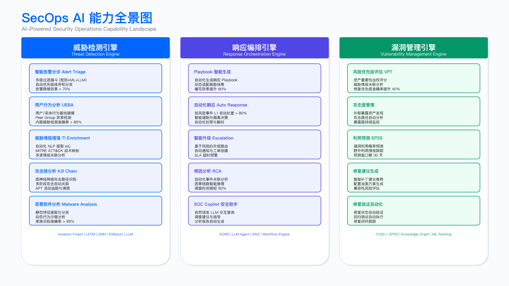
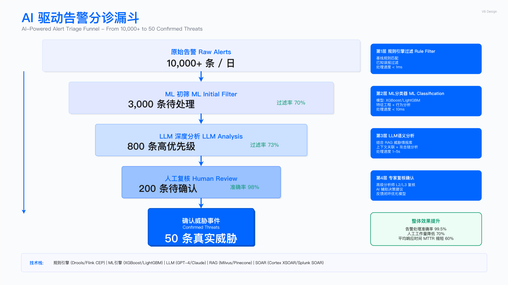

# 14.3 AI for SecOps：安全运营智能化

> **English Title**: AI for Security Operations: Intelligent SOC Transformation
> **目标读者**: SOC Manager, Security Analyst, SecOps Engineer, Detection Engineer

---

## 执行摘要 | Executive Summary

安全运营（SecOps）是企业安全防护的核心战场。面对告警洪流、复杂攻击手法、人才短缺，传统人工 SOC 模式面临效率瓶颈。AI 技术可辅助威胁检测、告警分诊、事件响应、漏洞治理等环节，提升单位人力的处理能力。

本章节阐述 AI 在安全运营中的应用，涵盖 10 大核心场景，遵循"业务需求→架构设计→工程实现→运营度量"的四层框架。

### 核心价值主张

> **说明**：以下为概念性对比，具体提升幅度因企业规模、数据质量、模型成熟度而异。建议通过 PoC 验证实际效果。

| 维度               | 传统 SOC                   | AI-Powered SOC             | 价值提升方向   |
| ------------------ | -------------------------- | -------------------------- | -------------- |
| **告警处理** | 人工逐条分析，日处理量有限 | 智能分诊，处理能力大幅提升 | 效率显著提升   |
| **误报过滤** | 依赖规则，误报率较高       | ML 模型，误报率降低        | 精度提升       |
| **响应时间** | MTTR 数小时                | 自动化响应，MTTR 缩短      | 速度提升       |
| **威胁检测** | 基于已知规则               | 行为基线 + 异常检测        | 覆盖未知威胁   |
| **漏洞修复** | 按 CVSS 排序               | 上下文感知优先级           | 聚焦高风险漏洞 |

---

## 业务需求层 | Business Requirements Layer

### SecOps 核心痛点分析

```
┌─────────────────────────────────────────────────────────────────────────────┐
│                        SecOps 核心痛点与 AI 解决方案映射                       │
├─────────────────────────────────────────────────────────────────────────────┤
│                                                                             │
│  ┌─────────────────┐     ┌─────────────────┐     ┌─────────────────┐       │
│  │   告警疲劳      │     │   响应延迟      │     │   人才短缺      │       │
│  │  Alert Fatigue  │     │  Response Lag   │     │  Talent Gap     │       │
│  ├─────────────────┤     ├─────────────────┤     ├─────────────────┤       │
│  │ • 日均 10K+ 告警│     │ • MTTR 4-8 小时 │     │ • 30% 岗位空缺  │       │
│  │ • 95% 误报率   │     │ • 手工调查取证  │     │ • 高离职率      │       │
│  │ • 关键告警遗漏  │     │ • Playbook 执行慢│     │ • 技能断层      │       │
│  └────────┬────────┘     └────────┬────────┘     └────────┬────────┘       │
│           │                       │                       │                 │
│           ▼                       ▼                       ▼                 │
│  ┌─────────────────────────────────────────────────────────────────────┐   │
│  │                         AI 解决方案矩阵                               │   │
│  ├─────────────────────────────────────────────────────────────────────┤   │
│  │                                                                     │   │
│  │  ┌───────────────┐  ┌───────────────┐  ┌───────────────┐           │   │
│  │  │ 智能告警分诊  │  │ SOAR 自动编排 │  │ AI 安全助手   │           │   │
│  │  │ ML + LLM     │  │ Playbook 自动化│  │ Copilot 增强  │           │   │
│  │  └───────────────┘  └───────────────┘  └───────────────┘           │   │
│  │                                                                     │   │
│  │  ┌───────────────┐  ┌───────────────┐  ┌───────────────┐           │   │
│  │  │ 行为异常检测  │  │ 智能威胁狩猎  │  │ 漏洞优先排序  │           │   │
│  │  │ UEBA/NTA     │  │ Hypothesis Gen │  │ Context-aware │           │   │
│  │  └───────────────┘  └───────────────┘  └───────────────┘           │   │
│  │                                                                     │   │
│  └─────────────────────────────────────────────────────────────────────┘   │
│                                                                             │
└─────────────────────────────────────────────────────────────────────────────┘
```

### 10 大 SecOps AI 场景概览

基于 [AI for SecOps 案例库](../ai_for_secops_cases.md)，本章节覆盖以下核心场景：

> **说明**：「业务价值」列描述预期效果方向，具体数值需根据企业基线数据设定目标。

| 场景编号 | 场景名称                 | 核心能力               | 业务价值（示例目标）       | 成熟度 |
| -------- | ------------------------ | ---------------------- | -------------------------- | ------ |
| S1       | SOC 告警分诊与优先级排序 | ML 分类 + LLM 分析     | 效率显著提升，误报大幅降低 | L4     |
| S2       | 威胁情报自动化运营       | TI 采集 + 关联 + 响应  | 情报时效性提升             | L3     |
| S3       | 安全事件响应编排         | SOAR + Playbook 自动化 | MTTR 显著缩短              | L4     |
| S4       | 威胁狩猎辅助             | 假设生成 + 数据探索    | 发现隐蔽威胁               | L3     |
| S5       | 漏洞优先级智能排序       | 上下文感知 + 风险评分  | 修复效率提升               | L4     |
| S6       | 资产风险评估             | 资产画像 + 风险建模    | 资产可见性提升             | L3     |
| S7       | 攻击面管理               | ASM 发现 + 风险评估    | 暴露面减少                 | L3     |
| S8       | 安全报告自动生成         | LLM 摘要 + 可视化      | 报告效率提升               | L3     |
| S9       | Playbook 自动生成        | 历史学习 + 模板推荐    | Playbook 覆盖率提升        | L2     |
| S10      | 根因分析                 | 因果推理 + 攻击链还原  | 调查效率提升               | L3     |

### ML 算法选择依据

场景与算法的匹配基于实时性、可解释性、数据可用性三个维度的权衡：

| 场景             | 推荐算法              | 选择理由                           | 替代方案                                |
| ---------------- | --------------------- | ---------------------------------- | --------------------------------------- |
| S1 告警分诊      | XGBoost / LightGBM    | 推理延迟 <10ms，支持 SHAP 可解释性 | CatBoost（高基数特征场景）              |
| S2 威胁情报      | SpaCy NER / BERT-base | IOC 实体识别，预训练模型开箱可用   | Flair NER                               |
| S5 漏洞排序      | XGBoost + LambdaRank  | 排序任务，支持 NDCG 优化           | LightGBM Ranker                         |
| S6 资产风险      | GraphSAGE / GAT       | 图结构建模，支持归纳学习           | GCN（小规模图）、Node2Vec（特征预处理） |
| S7 攻击面管理    | HDBSCAN               | 无需预设簇数，支持噪声点识别       | DBSCAN（参数调优简单）                  |
| S9 Playbook 生成 | LLM + RAG             | 基于历史 Playbook 检索增强生成     | Fine-tuned LLM（数据充足时）            |
| S10 根因分析     | DoWhy / CausalNex     | 因果推理框架，支持反事实分析       | 贝叶斯网络                              |

**选择原则**：

- 实时场景（SLA <100ms）：树模型优先，避免深度学习推理开销
- 标注数据 <1000 条：优先无监督方法或预训练模型迁移
- 可解释性要求高：选择支持 SHAP / LIME 的模型，便于 SOC 分析师理解决策依据
- 图结构数据：根据图规模选择 GNN 变体（小图用 GCN，大图用 GraphSAGE）

### 特征工程策略

SecOps AI 的特征工程分为五类，不同场景侧重不同：

| 特征类别       | 典型特征                           | 适用场景     | 工程方法                       |
| -------------- | ---------------------------------- | ------------ | ------------------------------ |
| 告警原生特征   | 严重性、来源、规则 ID、时间戳      | S1 告警分诊  | 归一化、One-Hot 编码           |
| 上下文增强特征 | 资产关键性、所属业务、数据分类     | S1 / S5 / S6 | CMDB Join、实时 API 查询       |
| 时序行为特征   | 告警频率、历史误报率、用户行为基线 | S1 / S4      | 滑动窗口聚合、Z-Score 异常检测 |
| 图结构特征     | 资产连通性、攻击路径跳数、依赖深度 | S6 / S7      | Node2Vec Embedding、PageRank   |
| 威胁情报特征   | IOC 命中、TI 置信度、在野利用状态  | S1 / S2 / S5 | TI API 实时查询、STIX 解析     |

**特征工程流水线示例（S1 告警分诊）**：

```
原始告警 ─┬─► 告警解析（OCSF 归一化）
          ├─► CMDB 查询（资产关键性、所属系统）─────┐
          ├─► UEBA 查询（用户风险分、历史行为）────┼─► 特征向量 → ML 模型
          ├─► TI 查询（IOC 命中、置信度）──────────┤
          └─► 历史统计（同源告警误报率、30 天频率）─┘
```

**关键约束**：

- 特征延迟需控制在告警 SLA 之内（S1 场景：特征增强总耗时 <50ms）
- 特征缺失率 >20% 的字段需设置默认值策略，避免模型输入异常
- 高基数分类特征（如源 IP）需 Hash 编码或 Embedding，避免维度爆炸

### 场景优先级矩阵（ICE 评分）

```
                        业务影响 (Impact)
                    Low          Medium         High
                ┌────────────┬────────────┬────────────┐
           High │    S8      │    S4      │  S1  S3    │
    实施  ──────┼────────────┼────────────┼────────────┤
    信心 Medium │    S9      │  S6  S7    │  S2  S5    │
(Confidence)────┼────────────┼────────────┼────────────┤
           Low  │            │    S10     │            │
                └────────────┴────────────┴────────────┘

推荐实施顺序：
阶段 1（0-6 月）：S1 告警分诊 → S3 SOAR 编排 → S5 漏洞优先级
阶段 2（6-12 月）：S2 威胁情报 → S4 威胁狩猎 → S6 资产风险
阶段 3（12-18 月）：S7 攻击面管理 → S8 报告自动化 → S9 Playbook 生成 → S10 根因分析
```

### 场景实施资源与验收标准

| 场景         | 实施人力                       | 周期   | 验收标准                               | PoC 验证方法                        |
| ------------ | ------------------------------ | ------ | -------------------------------------- | ----------------------------------- |
| S1 告警分诊  | AI 工程师 1-2 + SOC 分析师 2-3 | 3 个月 | 误报率较基线下降（目标通过 PoC 设定）  | 1000 条历史告警回测 + 2 周 A/B 测试 |
| S3 SOAR 编排 | SOAR 工程师 1 + SOC 分析师 1   | 2 个月 | Top 10 Playbook 自动化率 ≥80%         | 模拟事件触发 + 执行成功率统计       |
| S5 漏洞排序  | AI 工程师 1 + 漏洞管理员 1     | 2 个月 | Top 100 高危漏洞与人工排序一致率 ≥85% | 历史漏洞回测 + 红队验证             |
| S2 威胁情报  | 数据工程师 1 + TI 分析师 1     | 3 个月 | 情报入库延迟 <5 分钟，IOC 命中率 ≥95% | 情报源对比 + 告警命中验证           |
| S4 威胁狩猎  | AI 工程师 1 + 高级分析师 1     | 持续   | 季度发现 ≥3 个隐蔽威胁                | 假设生成 → 数据验证 → 规则沉淀    |
| S6 资产风险  | AI 工程师 1 + 资产管理员 1     | 2 个月 | 高风险资产覆盖率 ≥90%                 | CMDB 数据质量校验 + 风险评分抽检    |

**通用验收框架**：

```
阶段 1: PoC（4-6 周）
├── 目标：验证技术可行性
├── 数据：历史样本 ≥1000 条
├── 验收：模型 AUC ≥0.8，延迟达标
└── 产出：技术可行性报告

阶段 2: MVP（6-8 周）
├── 目标：生产环境小流量验证
├── 数据：实时流量 10%
├── 验收：业务指标较基线改善（目标通过 PoC 设定）
└── 产出：A/B 测试报告

阶段 3: 全量上线（4 周）
├── 目标：全量流量切换
├── 验收：SLA 达成率 ≥95%，无 P0 故障
└── 产出：运营手册、监控看板
```

---

## 架构逻辑层 | Architecture Logic Layer

### SecOps AI 能力架构

SecOps AI 能力基于 [14.2 AI 安全中台架构](./14.2_ai_security_platform_architecture.md) 构建，分为三大能力域：

```
┌─────────────────────────────────────────────────────────────────────────────┐
│                        SecOps AI 能力架构                                    │
├─────────────────────────────────────────────────────────────────────────────┤
│                                                                             │
│  ┌─────────────────────────────────────────────────────────────────────┐   │
│  │                     服务接入层 (Service Layer)                        │   │
│  │  ┌─────────┐ ┌─────────┐ ┌─────────┐ ┌─────────┐ ┌─────────┐       │   │
│  │  │  SIEM   │ │   XDR   │ │  SOAR   │ │  ITSM   │ │ ChatOps │       │   │
│  │  │ 集成    │ │  集成   │ │  编排   │ │  工单   │ │  交互   │       │   │
│  │  └─────────┘ └─────────┘ └─────────┘ └─────────┘ └─────────┘       │   │
│  └─────────────────────────────────────────────────────────────────────┘   │
│                                      │                                      │
│  ┌───────────────────────────────────┴───────────────────────────────────┐ │
│  │                     应用层 (Application Layer)                         │ │
│  │                                                                        │ │
│  │  ┌────────────────────┐  ┌────────────────────┐  ┌────────────────┐   │ │
│  │  │   威胁检测引擎     │  │   响应编排引擎     │  │  漏洞治理引擎  │   │ │
│  │  │  Threat Detection  │  │  Response Engine   │  │  Vuln Engine   │   │ │
│  │  ├────────────────────┤  ├────────────────────┤  ├────────────────┤   │ │
│  │  │ • 告警分诊        │  │ • Playbook 执行    │  │ • 优先级排序   │   │ │
│  │  │ • 异常行为检测    │  │ • 自动化响应       │  │ • 补丁推荐     │   │ │
│  │  │ • 威胁情报关联    │  │ • 事件升级         │  │ • 风险评估     │   │ │
│  │  │ • 攻击链识别      │  │ • 根因分析         │  │ • 修复验证     │   │ │
│  │  └────────────────────┘  └────────────────────┘  └────────────────┘   │ │
│  │                                                                        │ │
│  └────────────────────────────────────────────────────────────────────────┘ │
│                                      │                                      │
│  ┌───────────────────────────────────┴───────────────────────────────────┐ │
│  │                     能力层 (Capability Layer)                          │ │
│  │                                                                        │ │
│  │  ┌──────────────┐  ┌──────────────┐  ┌──────────────┐  ┌───────────┐  │ │
│  │  │   ML 模型    │  │   LLM 服务   │  │  规则引擎    │  │ 知识图谱  │  │ │
│  │  │  ML Models   │  │ LLM Service  │  │ Rule Engine  │  │    KG     │  │ │
│  │  ├──────────────┤  ├──────────────┤  ├──────────────┤  ├───────────┤  │ │
│  │  │ • XGBoost    │  │ • GPT-4o     │  │ • Sigma      │  │ • 资产    │  │ │
│  │  │ • Isolation  │  │ • Claude     │  │ • YARA       │  │ • 漏洞    │  │ │
│  │  │   Forest     │  │ • 私有部署   │  │ • Suricata   │  │ • 威胁    │  │ │
│  │  │ • LSTM       │  │              │  │              │  │ • 攻击链  │  │ │
│  │  └──────────────┘  └──────────────┘  └──────────────┘  └───────────┘  │ │
│  │                                                                        │ │
│  └────────────────────────────────────────────────────────────────────────┘ │
│                                      │                                      │
│  ┌───────────────────────────────────┴───────────────────────────────────┐ │
│  │                     基础层 (Infrastructure Layer)                      │ │
│  │                                                                        │ │
│  │  ┌──────────────────────────────────────────────────────────────────┐ │ │
│  │  │                    安全数据湖 (Security Data Lake)                │ │ │
│  │  │  ┌─────────┐ ┌─────────┐ ┌─────────┐ ┌─────────┐ ┌─────────┐   │ │ │
│  │  │  │  日志   │ │  告警   │ │  资产   │ │  漏洞   │ │ 威胁情报│   │ │ │
│  │  │  │  Logs   │ │ Alerts  │ │ Assets  │ │  Vulns  │ │   TI    │   │ │ │
│  │  │  └─────────┘ └─────────┘ └─────────┘ └─────────┘ └─────────┘   │ │ │
│  │  └──────────────────────────────────────────────────────────────────┘ │ │
│  │                                                                        │ │
│  └────────────────────────────────────────────────────────────────────────┘ │
│                                                                             │
└─────────────────────────────────────────────────────────────────────────────┘
```



**图注**：SecOps AI 能力全景图，展示从威胁检测、响应编排到漏洞治理的完整能力矩阵，涵盖服务接入层、应用层、能力层与基础设施层。

### 数据流架构

```
┌─────────────────────────────────────────────────────────────────────────────┐
│                        SecOps AI 数据流架构                                  │
├─────────────────────────────────────────────────────────────────────────────┤
│                                                                             │
│   数据源                  数据处理                  AI 处理                   │
│  ┌─────────┐          ┌─────────────┐          ┌─────────────┐             │
│  │  EDR    │───┐      │             │          │             │             │
│  └─────────┘   │      │   数据采集  │          │   实时推理  │             │
│  ┌─────────┐   │      │   & 归一化  │          │   (< 100ms) │             │
│  │  NDR    │───┼─────▶│   (OCSF)    │─────────▶│   ML 分类   │             │
│  └─────────┘   │      │             │          │             │             │
│  ┌─────────┐   │      └─────────────┘          └──────┬──────┘             │
│  │  SIEM   │───┤              │                       │                     │
│  └─────────┘   │              │                       ▼                     │
│  ┌─────────┐   │              │               ┌─────────────┐               │
│  │  CASB   │───┤              │               │             │               │
│  └─────────┘   │              │               │ 上下文增强  │               │
│  ┌─────────┐   │              │               │  Enrichment │               │
│  │ Cloud   │───┘              │               │             │               │
│  │  Logs   │                  │               └──────┬──────┘               │
│  └─────────┘                  │                      │                      │
│                               │                      ▼                      │
│  ┌─────────┐          ┌──────┴──────┐        ┌─────────────┐               │
│  │  CMDB   │─────────▶│   特征工程  │        │             │               │
│  └─────────┘          │   Feature   │        │  LLM 深度   │               │
│  ┌─────────┐          │  Engineering│───────▶│   分析      │               │
│  │  TI     │─────────▶│             │        │ (1-5s)      │               │
│  └─────────┘          └─────────────┘        │             │               │
│  ┌─────────┐                                 └──────┬──────┘               │
│  │  UEBA   │                                        │                      │
│  └─────────┘                                        ▼                      │
│                                              ┌─────────────┐               │
│                                              │   决策融合  │               │
│                                              │   & 编排    │               │
│                                              │   SOAR      │               │
│                                              └──────┬──────┘               │
│                                                     │                      │
│                    ┌────────────────────────────────┼────────────────┐     │
│                    ▼                    ▼           ▼                ▼     │
│             ┌───────────┐       ┌───────────┐ ┌───────────┐  ┌───────────┐│
│             │  自动响应 │       │  人工审核 │ │  工单创建 │  │  报告生成 ││
│             │Auto Action│       │  Review   │ │  Ticket   │  │  Report   ││
│             └───────────┘       └───────────┘ └───────────┘  └───────────┘│
│                                                                             │
└─────────────────────────────────────────────────────────────────────────────┘
```

---

## 工程技术层 | Engineering Technology Layer

### 核心场景技术实现

#### S1: SOC 告警分诊与优先级排序

**技术方案：多策略融合分诊引擎**

```
┌─────────────────────────────────────────────────────────────────────────────┐
│                        告警分诊引擎架构                                       │
├─────────────────────────────────────────────────────────────────────────────┤
│                                                                             │
│  ┌─────────────────────────────────────────────────────────────────────┐   │
│  │                         多源告警接入                                  │   │
│  │     SIEM ──┬── EDR ──┬── NDR ──┬── WAF ──┬── Cloud ──┬── Custom     │   │
│  └────────────┴─────────┴─────────┴─────────┴───────────┴──────────────┘   │
│                                      │                                      │
│                                      ▼                                      │
│  ┌─────────────────────────────────────────────────────────────────────┐   │
│  │                    告警预处理层 (< 10ms)                              │   │
│  │  ┌───────────────┐  ┌───────────────┐  ┌───────────────┐            │   │
│  │  │   归一化      │  │    去重       │  │   关联聚合    │            │   │
│  │  │  OCSF Schema  │  │  Dedup Hash   │  │  Time Window  │            │   │
│  │  └───────────────┘  └───────────────┘  └───────────────┘            │   │
│  └─────────────────────────────────────────────────────────────────────┘   │
│                                      │                                      │
│                    ┌─────────────────┼─────────────────┐                    │
│                    ▼                 ▼                 ▼                    │
│  ┌──────────────────────┐ ┌──────────────────┐ ┌──────────────────────┐    │
│  │    规则引擎 (1ms)    │ │  ML 分类器 (10ms) │ │  LLM 分析 (1-5s)      │    │
│  │  ┌────────────────┐  │ │  ┌────────────┐  │ │  ┌────────────────┐  │    │
│  │  │ • 白名单过滤   │  │ │  │ XGBoost    │  │ │  │ GPT-4o / Claude│  │    │
│  │  │ • IOC 精确匹配 │  │ │  │ 优先级评分 │  │ │  │ 上下文推理     │  │    │
│  │  │ • Sigma 规则   │  │ │  │ 置信度评估 │  │ │  │ 意图分析       │  │    │
│  │  │ • 已知误报     │  │ │  │ 特征重要性 │  │ │  │ 攻击链识别     │  │    │
│  │  └────────────────┘  │ │  └────────────┘  │ │  └────────────────┘  │    │
│  │  置信度: 确定性      │ │  置信度: 0.7-0.9 │ │  置信度: 0.6-0.85   │    │
│  └──────────────────────┘ └──────────────────┘ └──────────────────────┘    │
│                    │                 │                 │                    │
│                    └─────────────────┼─────────────────┘                    │
│                                      ▼                                      │
│  ┌─────────────────────────────────────────────────────────────────────┐   │
│  │                       决策融合层                                      │   │
│  │  ┌───────────────────────────────────────────────────────────────┐  │   │
│  │  │  Priority = w1*Rule + w2*ML + w3*LLM + Context_Boost          │  │   │
│  │  │                                                               │  │   │
│  │  │  Context_Boost:                                               │  │   │
│  │  │    +20: 关键资产 (Crown Jewels)                               │  │   │
│  │  │    +15: 威胁情报命中                                          │  │   │
│  │  │    +10: 高风险用户 (UEBA score > 80)                          │  │   │
│  │  │    -10: 已知良性行为模式                                      │  │   │
│  │  └───────────────────────────────────────────────────────────────┘  │   │
│  └─────────────────────────────────────────────────────────────────────┘   │
│                                      │                                      │
│         ┌────────────────────────────┼────────────────────────────┐         │
│         ▼                            ▼                            ▼         │
│  ┌─────────────┐            ┌─────────────┐            ┌─────────────┐     │
│  │  Critical   │            │    High     │            │ Medium/Low  │     │
│  │  (90-100)   │            │   (70-89)   │            │   (0-69)    │     │
│  ├─────────────┤            ├─────────────┤            ├─────────────┤     │
│  │ • 立即升级  │            │ • 队列处理  │            │ • 批量审核  │     │
│  │ • 自动响应  │            │ • SLA 4h    │            │ • 自动归档  │     │
│  │ • 通知 oncall│           │ • 人工确认  │            │ • 统计分析  │     │
│  └─────────────┘            └─────────────┘            └─────────────┘     │
│                                                                             │
└─────────────────────────────────────────────────────────────────────────────┘
```



**图注**：告警分诊漏斗模型，展示从原始告警到最终处置的多级过滤过程，包括规则引擎、ML 分类器和 LLM 深度分析三层决策融合。

**关键代码实现**（参考 [ai_for_secops_cases.md](../ai_for_secops_cases.md) 完整实现）：

```python
"""
告警分诊引擎 - 核心接口定义
"""

from dataclasses import dataclass
from enum import Enum
from typing import Optional, List, Dict

class TriageDecision(Enum):
    ESCALATE = "escalate"          # 立即升级
    INVESTIGATE = "investigate"    # 需要调查
    MONITOR = "monitor"            # 持续监控
    SUPPRESS = "suppress"          # 抑制/忽略
    AUTO_CLOSE = "auto_close"      # 自动关闭

@dataclass
class TriageResult:
    """分诊结果"""
    alert_id: str
    decision: TriageDecision
    priority_score: float          # 0-100
    confidence: float              # 0-1
    reasoning: str                 # LLM 生成的分析理由
    recommended_actions: List[str]
    related_alerts: List[str]
    enrichment_data: Dict
    processing_time_ms: float

class AlertTriageEngine:
    """多策略融合分诊引擎"""

    def __init__(self, config: TriageConfig):
        self.rule_engine = RuleEngine(config.sigma_rules)
        self.ml_classifier = MLAlertClassifier(config.model_path)
        self.llm_analyzer = LLMAlertAnalyzer(config.llm_config)
        self.enrichment_service = AlertEnrichmentService(
            cmdb_client=config.cmdb,
            ti_client=config.threat_intel,
            ueba_client=config.ueba
        )

    async def triage(self, alert: Alert) -> TriageResult:
        """执行告警分诊"""

        # 1. 规则快速过滤 (< 1ms)
        rule_result = self.rule_engine.evaluate(alert)
        if rule_result.is_deterministic:
            return self._build_result(alert, rule_result)

        # 2. 并行执行 enrichment 和 ML 分类
        enrichment = await self.enrichment_service.enrich(alert)
        ml_result = self.ml_classifier.predict(alert, enrichment)

        # 3. 高置信度场景直接返回
        if ml_result.confidence > 0.9:
            return self._build_result(alert, ml_result, enrichment)

        # 4. 复杂场景调用 LLM 深度分析
        llm_result = await self.llm_analyzer.analyze(
            alert, enrichment, ml_result
        )

        # 5. 决策融合
        return self._fuse_decisions(
            alert, rule_result, ml_result, llm_result, enrichment
        )
```

#### S2: 威胁情报自动化运营

**技术方案：TI 全生命周期自动化**

```
┌─────────────────────────────────────────────────────────────────────────────┐
│                     威胁情报自动化运营架构                                    │
├─────────────────────────────────────────────────────────────────────────────┤
│                                                                             │
│  ┌─────────────────────────────────────────────────────────────────────┐   │
│  │                         情报采集层                                    │   │
│  │  ┌─────────┐ ┌─────────┐ ┌─────────┐ ┌─────────┐ ┌─────────┐       │   │
│  │  │  OSINT  │ │商业 Feed│ │ ISAC    │ │暗网监控 │ │内部情报 │       │   │
│  │  │  开源   │ │ Paid    │ │行业共享 │ │Dark Web │ │Internal │       │   │
│  │  └────┬────┘ └────┬────┘ └────┬────┘ └────┬────┘ └────┬────┘       │   │
│  │       │           │           │           │           │             │   │
│  │       └───────────┴───────────┼───────────┴───────────┘             │   │
│  │                               ▼                                      │   │
│  └─────────────────────────────────────────────────────────────────────┘   │
│                                  │                                          │
│  ┌───────────────────────────────┴───────────────────────────────────────┐ │
│  │                         情报处理层                                      │ │
│  │                                                                        │ │
│  │  ┌──────────────┐  ┌──────────────┐  ┌──────────────┐                │ │
│  │  │   归一化     │  │   去重融合   │  │   质量评分   │                │ │
│  │  │  STIX 2.1   │  │  Entity Res  │  │  Confidence  │                │ │
│  │  └──────────────┘  └──────────────┘  └──────────────┘                │ │
│  │                               │                                        │ │
│  │                               ▼                                        │ │
│  │  ┌──────────────────────────────────────────────────────────────────┐ │ │
│  │  │                    AI 情报增强                                    │ │ │
│  │  │  ┌────────────────┐  ┌────────────────┐  ┌────────────────┐     │ │ │
│  │  │  │  LLM 情报解读  │  │  关联性分析    │  │  上下文丰富    │     │ │ │
│  │  │  │  • 威胁报告摘要│  │  • 攻击组织关联│  │  • CMDB 资产   │     │ │ │
│  │  │  │  • TTPs 提取   │  │  • 历史事件关联│  │  • 行业上下文  │     │ │ │
│  │  │  │  • 影响评估    │  │  • 攻击链映射  │  │  • 地理因素    │     │ │ │
│  │  │  └────────────────┘  └────────────────┘  └────────────────┘     │ │ │
│  │  └──────────────────────────────────────────────────────────────────┘ │ │
│  │                                                                        │ │
│  └────────────────────────────────────────────────────────────────────────┘ │
│                                  │                                          │
│  ┌───────────────────────────────┴───────────────────────────────────────┐ │
│  │                         情报应用层                                      │ │
│  │                                                                        │ │
│  │  ┌──────────────┐  ┌──────────────┐  ┌──────────────┐  ┌───────────┐ │ │
│  │  │  IOC 分发    │  │  告警增强    │  │  主动防御    │  │ 态势感知  │ │ │
│  │  │  → SIEM/EDR  │  │  → Enrichment│  │  → Block     │  │ → Dashboard│ │ │
│  │  │  → NDR/WAF   │  │  → Context   │  │  → Isolate   │  │ → Report  │ │ │
│  │  └──────────────┘  └──────────────┘  └──────────────┘  └───────────┘ │ │
│  │                                                                        │ │
│  └────────────────────────────────────────────────────────────────────────┘ │
│                                                                             │
└─────────────────────────────────────────────────────────────────────────────┘
```

#### S3: 安全事件响应编排 (SOAR)

**技术方案：智能 Playbook 编排引擎**

```
┌─────────────────────────────────────────────────────────────────────────────┐
│                      SOAR 智能编排架构                                       │
├─────────────────────────────────────────────────────────────────────────────┤
│                                                                             │
│  ┌─────────────────────────────────────────────────────────────────────┐   │
│  │                         事件触发层                                    │   │
│  │                                                                      │   │
│  │     ┌─────────────┐     ┌─────────────┐     ┌─────────────┐        │   │
│  │     │ 高优先级告警│     │  手动触发   │     │  定时任务   │        │   │
│  │     │ Auto-Trigger│     │   Manual    │     │  Scheduled  │        │   │
│  │     └──────┬──────┘     └──────┬──────┘     └──────┬──────┘        │   │
│  │            └──────────────────┬┴──────────────────┘                 │   │
│  │                               ▼                                      │   │
│  └─────────────────────────────────────────────────────────────────────┘   │
│                                  │                                          │
│  ┌───────────────────────────────┴───────────────────────────────────────┐ │
│  │                      Playbook 选择引擎                                  │ │
│  │                                                                        │ │
│  │     ┌───────────────────────────────────────────────────────────┐    │ │
│  │     │              AI Playbook 推荐                              │    │ │
│  │     │  ┌─────────────────────────────────────────────────────┐  │    │ │
│  │     │  │ Input: Alert Type + Context + Historical Success    │  │    │ │
│  │     │  │ Model: XGBoost Playbook Classifier                  │  │    │ │
│  │     │  │ Output: Ranked Playbook List + Confidence           │  │    │ │
│  │     │  └─────────────────────────────────────────────────────┘  │    │ │
│  │     └───────────────────────────────────────────────────────────┘    │ │
│  │                               │                                        │ │
│  │     ┌─────────────────────────┼─────────────────────────┐             │ │
│  │     ▼                         ▼                         ▼             │ │
│  │  ┌─────────────┐      ┌─────────────┐      ┌─────────────┐           │ │
│  │  │ 恶意软件    │      │ 钓鱼攻击    │      │ 账号接管    │           │ │
│  │  │ Playbook    │      │ Playbook    │      │ Playbook    │           │ │
│  │  └─────────────┘      └─────────────┘      └─────────────┘           │ │
│  │                                                                        │ │
│  └────────────────────────────────────────────────────────────────────────┘ │
│                                  │                                          │
│  ┌───────────────────────────────┴───────────────────────────────────────┐ │
│  │                      Playbook 执行引擎                                  │ │
│  │                                                                        │ │
│  │  ┌──────────────────────────────────────────────────────────────────┐ │ │
│  │  │  Step 1        Step 2        Step 3        Step 4       Step N   │ │ │
│  │  │ ┌────────┐   ┌────────┐   ┌────────┐   ┌────────┐   ┌────────┐  │ │ │
│  │  │ │ Enrich │──▶│Validate│──▶│Contain │──▶│Remediate│─▶│ Close  │  │ │ │
│  │  │ │        │   │        │   │        │   │        │   │        │  │ │ │
│  │  │ └────────┘   └────────┘   └────────┘   └────────┘   └────────┘  │ │ │
│  │  │     │            │            │            │            │        │ │ │
│  │  │     ▼            ▼            ▼            ▼            ▼        │ │ │
│  │  │ ┌────────┐   ┌────────┐   ┌────────┐   ┌────────┐   ┌────────┐  │ │ │
│  │  │ │  TI    │   │  LLM   │   │  EDR   │   │  IAM   │   │  ITSM  │  │ │ │
│  │  │ │ Lookup │   │ Verify │   │ Isolate│   │ Reset  │   │ Ticket │  │ │ │
│  │  │ └────────┘   └────────┘   └────────┘   └────────┘   └────────┘  │ │ │
│  │  └──────────────────────────────────────────────────────────────────┘ │ │
│  │                                                                        │ │
│  │  ┌──────────────────────────────────────────────────────────────────┐ │ │
│  │  │                    人机协作决策点                                  │ │ │
│  │  │  ┌────────────────────────────────────────────────────────────┐ │ │ │
│  │  │  │ 自动化边界: 低风险操作自动执行，高风险需人工审批            │ │ │ │
│  │  │  │ • 自动: 查询、enrichment、告警、日志收集                   │ │ │ │
│  │  │  │ • 审批: 隔离设备、禁用账号、阻断网络、删除文件             │ │ │ │
│  │  │  └────────────────────────────────────────────────────────────┘ │ │ │
│  │  └──────────────────────────────────────────────────────────────────┘ │ │
│  │                                                                        │ │
│  └────────────────────────────────────────────────────────────────────────┘ │
│                                                                             │
└─────────────────────────────────────────────────────────────────────────────┘
```

#### S4: 威胁狩猎辅助

**技术方案：AI 驱动的假设生成与验证**

```
┌─────────────────────────────────────────────────────────────────────────────┐
│                      AI 威胁狩猎辅助架构                                      │
├─────────────────────────────────────────────────────────────────────────────┤
│                                                                             │
│  ┌─────────────────────────────────────────────────────────────────────┐   │
│  │                      假设生成引擎 (LLM)                               │   │
│  │                                                                      │   │
│  │  ┌──────────────────────────────────────────────────────────────┐   │   │
│  │  │ 输入：                                                         │   │   │
│  │  │   • 最新威胁情报报告                                          │   │   │
│  │  │   • 企业资产和技术栈                                          │   │   │
│  │  │   • 历史攻击案例                                              │   │   │
│  │  │   • MITRE ATT&CK 框架                                         │   │   │
│  │  │                                                               │   │   │
│  │  │ 输出：                                                         │   │   │
│  │  │   • 结构化狩猎假设                                            │   │   │
│  │  │   • 优先级排序                                                │   │   │
│  │  │   • 检测逻辑建议                                              │   │   │
│  │  └──────────────────────────────────────────────────────────────┘   │   │
│  │                                                                      │   │
│  │  示例假设：                                                           │   │
│  │  ┌──────────────────────────────────────────────────────────────┐   │   │
│  │  │ H1: "攻击者可能通过钓鱼邮件中的恶意 Office 宏，利用企业使用的   │   │   │
│  │  │     Microsoft 365 环境进行初始访问，随后使用 PowerShell 进行     │   │   │
│  │  │     横向移动" (TTPs: T1566.001 → T1059.001 → T1021)           │   │   │
│  │  │                                                               │   │   │
│  │  │ 置信度: 0.78 | 优先级: High | 数据源: Email, EDR, AD          │   │   │
│  │  └──────────────────────────────────────────────────────────────┘   │   │
│  └─────────────────────────────────────────────────────────────────────┘   │
│                                      │                                      │
│                                      ▼                                      │
│  ┌─────────────────────────────────────────────────────────────────────┐   │
│  │                      查询生成引擎                                     │   │
│  │                                                                      │   │
│  │  ┌───────────────┐  ┌───────────────┐  ┌───────────────┐            │   │
│  │  │  KQL 生成     │  │  Sigma 生成   │  │  SPL 生成     │            │   │
│  │  │  (Sentinel)   │  │  (通用)       │  │  (Splunk)     │            │   │
│  │  └───────────────┘  └───────────────┘  └───────────────┘            │   │
│  └─────────────────────────────────────────────────────────────────────┘   │
│                                      │                                      │
│                                      ▼                                      │
│  ┌─────────────────────────────────────────────────────────────────────┐   │
│  │                      数据探索与验证                                   │   │
│  │                                                                      │   │
│  │  ┌──────────────────────────────────────────────────────────────┐   │   │
│  │  │  执行查询 → 结果分析 → AI 辅助解读 → 人工确认 → 知识沉淀     │   │   │
│  │  └──────────────────────────────────────────────────────────────┘   │   │
│  └─────────────────────────────────────────────────────────────────────┘   │
│                                                                             │
└─────────────────────────────────────────────────────────────────────────────┘
```

#### S5: 漏洞优先级智能排序

**技术方案：上下文感知的漏洞风险评分**

```
┌─────────────────────────────────────────────────────────────────────────────┐
│                     漏洞优先级智能排序架构                                    │
├─────────────────────────────────────────────────────────────────────────────┤
│                                                                             │
│  ┌─────────────────────────────────────────────────────────────────────┐   │
│  │                        漏洞数据源                                     │   │
│  │  ┌─────────┐ ┌─────────┐ ┌─────────┐ ┌─────────┐ ┌─────────┐       │   │
│  │  │  NVD    │ │  扫描器 │ │  SAST   │ │  DAST   │ │  SCA    │       │   │
│  │  │  CVE    │ │ Nessus  │ │ Fortify │ │ ZAP     │ │ Snyk    │       │   │
│  │  └────┬────┘ └────┬────┘ └────┬────┘ └────┬────┘ └────┬────┘       │   │
│  │       └───────────┴───────────┼───────────┴───────────┘             │   │
│  │                               ▼                                      │   │
│  └─────────────────────────────────────────────────────────────────────┘   │
│                                  │                                          │
│  ┌───────────────────────────────┴───────────────────────────────────────┐ │
│  │                      多维上下文增强                                     │ │
│  │                                                                        │ │
│  │  ┌──────────────┐  ┌──────────────┐  ┌──────────────┐  ┌───────────┐ │ │
│  │  │   资产上下文  │  │  业务上下文  │  │  威胁上下文  │  │ 技术上下文│ │ │
│  │  ├──────────────┤  ├──────────────┤  ├──────────────┤  ├───────────┤ │ │
│  │  │ • 资产重要性 │  │ • 业务影响   │  │ • 在野利用   │  │ • 可达性  │ │ │
│  │  │ • 互联网暴露 │  │ • 数据分类   │  │ • 武器化程度 │  │ • 补偿控制│ │ │
│  │  │ • 所属系统   │  │ • 合规要求   │  │ • 攻击者兴趣 │  │ • 依赖关系│ │ │
│  │  └──────────────┘  └──────────────┘  └──────────────┘  └───────────┘ │ │
│  │                                                                        │ │
│  └────────────────────────────────────────────────────────────────────────┘ │
│                                  │                                          │
│  ┌───────────────────────────────┴───────────────────────────────────────┐ │
│  │                       AI 风险评分引擎                                   │ │
│  │                                                                        │ │
│  │  ┌──────────────────────────────────────────────────────────────────┐ │ │
│  │  │                                                                  │ │ │
│  │  │  Context_Risk_Score = f(CVSS, EPSS, Asset_Crit, Exposure,        │ │ │
│  │  │                         Threat_Intel, Business_Impact)           │ │ │
│  │  │                                                                  │ │ │
│  │  │  ┌────────────────────────────────────────────────────────────┐ │ │ │
│  │  │  │ 模型输入特征:                                              │ │ │ │
│  │  │  │  • CVSS 基础分 (0-10)                                      │ │ │ │
│  │  │  │  • EPSS 概率分 (0-1)                                       │ │ │ │
│  │  │  │  • 资产关键性 (Critical/High/Medium/Low)                   │ │ │ │
│  │  │  │  • 网络可达性 (Internet/Internal/Isolated)                 │ │ │ │
│  │  │  │  • 威胁情报命中 (Boolean + Severity)                       │ │ │ │
│  │  │  │  • 补偿控制 (WAF/IPS/EDR coverage)                         │ │ │ │
│  │  │  │  • 历史利用成功率 (from red team data)                     │ │ │ │
│  │  │  └────────────────────────────────────────────────────────────┘ │ │ │
│  │  │                                                                  │ │ │
│  │  └──────────────────────────────────────────────────────────────────┘ │ │
│  │                                                                        │ │
│  └────────────────────────────────────────────────────────────────────────┘ │
│                                  │                                          │
│         ┌────────────────────────┼────────────────────────────┐             │
│         ▼                        ▼                            ▼             │
│  ┌─────────────┐         ┌─────────────┐         ┌─────────────┐           │
│  │  Critical   │         │    High     │         │ Medium/Low  │           │
│  │  (90-100)   │         │   (70-89)   │         │   (0-69)    │           │
│  ├─────────────┤         ├─────────────┤         ├─────────────┤           │
│  │ • SLA: 24h  │         │ • SLA: 7d   │         │ • SLA: 30d  │           │
│  │ • 自动工单  │         │ • 批量分配  │         │ • 风险接受  │           │
│  │ • 紧急补丁  │         │ • 计划修复  │         │ • 长期跟踪  │           │
│  └─────────────┘         └─────────────┘         └─────────────┘           │
│                                                                             │
└─────────────────────────────────────────────────────────────────────────────┘
```

### 技术选型矩阵

| 场景             | ML 模型       | LLM           | 规则引擎   | 数据存储      | 实时性要求 |
| ---------------- | ------------- | ------------- | ---------- | ------------- | ---------- |
| S1 告警分诊      | XGBoost       | GPT-4o/Claude | Sigma      | Elasticsearch | < 100ms    |
| S2 威胁情报      | NER/关系抽取  | GPT-4o        | STIX/TAXII | Neo4j         | 分钟级     |
| S3 SOAR          | Playbook 推荐 | 可选          | BPMN       | PostgreSQL    | 秒级       |
| S4 威胁狩猎      | -             | GPT-4o/Claude | -          | SIEM          | 交互式     |
| S5 漏洞排序      | XGBoost/RF    | 可选          | -          | PostgreSQL    | 小时级     |
| S6 资产风险      | GNN           | -             | -          | Neo4j         | 日级       |
| S7 攻击面管理    | Clustering    | GPT-4o        | -          | Elasticsearch | 小时级     |
| S8 报告生成      | -             | GPT-4o/Claude | Jinja2     | -             | 分钟级     |
| S9 Playbook 生成 | Seq2Seq       | GPT-4o        | -          | -             | 分钟级     |
| S10 根因分析     | 因果推理      | GPT-4o        | -          | 时序库        | 分钟级     |

---

## 运营服务层 | Operations Service Layer

### 服务等级协议 (SLA)

| 服务能力     | 可用性 | 响应延迟                 | 处理能力 | 数据保留 |
| ------------ | ------ | ------------------------ | -------- | -------- |
| 告警分诊 API | 99.9%  | P50 < 50ms, P99 < 200ms  | 10K TPS  | 90 天    |
| SOAR 编排    | 99.9%  | P50 < 1s, P99 < 5s       | 1K TPS   | 1 年     |
| 威胁情报查询 | 99.5%  | P50 < 100ms, P99 < 500ms | 5K TPS   | 2 年     |
| LLM 分析     | 99%    | P50 < 3s, P99 < 10s      | 100 TPS  | 30 天    |
| 漏洞评分     | 99.5%  | P50 < 500ms, P99 < 2s    | 1K TPS   | 永久     |

### 运营指标体系

> **说明**：以下指标目标为示例值，需根据企业 SOC 成熟度基线设定。

```
┌─────────────────────────────────────────────────────────────────────────────┐
│                    SecOps AI 运营指标体系（示例目标）                         │
├─────────────────────────────────────────────────────────────────────────────┤
│                                                                             │
│  ┌─────────────────────────────────────────────────────────────────────┐   │
│  │                         效能指标 (Efficiency)                         │   │
│  │  ┌───────────────────┐  ┌───────────────────┐  ┌─────────────────┐   │   │
│  │  │ 告警处理效率      │  │ 自动化比率        │  │ 分析师产能      │   │   │
│  │  │ Alerts/Analyst/Day│  │ Auto-Close Rate   │  │ Cases/Week      │   │   │
│  │  │ 示例: 300-500     │  │ 示例: 60-80%      │  │ 示例: 30-50     │   │   │
│  │  └───────────────────┘  └───────────────────┘  └─────────────────┘   │   │
│  └─────────────────────────────────────────────────────────────────────┘   │
│                                                                             │
│  ┌─────────────────────────────────────────────────────────────────────┐   │
│  │                         质量指标 (Quality)                            │   │
│  │  ┌───────────────────┐  ┌───────────────────┐  ┌─────────────────┐   │   │
│  │  │ 误报率            │  │ 漏报率            │  │ 分诊准确率      │   │   │
│  │  │ False Positive    │  │ False Negative    │  │ Triage Accuracy │   │   │
│  │  │ 示例: < 30%       │  │ 示例: < 5%        │  │ 示例: > 80%     │   │   │
│  │  └───────────────────┘  └───────────────────┘  └─────────────────┘   │   │
│  └─────────────────────────────────────────────────────────────────────┘   │
│                                                                             │
│  ┌─────────────────────────────────────────────────────────────────────┐   │
│  │                         时效指标 (Timeliness)                         │   │
│  │  ┌───────────────────┐  ┌───────────────────┐  ┌─────────────────┐   │   │
│  │  │ 平均检测时间      │  │ 平均响应时间      │  │ 平均修复时间    │   │   │
│  │  │ MTTD              │  │ MTTR              │  │ MTTC            │   │   │
│  │  │ 基于基线设定      │  │ 基于基线设定      │  │ 基于基线设定    │   │   │
│  │  └───────────────────┘  └───────────────────┘  └─────────────────┘   │   │
│  └─────────────────────────────────────────────────────────────────────┘   │
│                                                                             │
│  ┌─────────────────────────────────────────────────────────────────────┐   │
│  │                         业务指标 (Business)                           │   │
│  │  ┌───────────────────┐  ┌───────────────────┐  ┌─────────────────┐   │   │
│  │  │ 事件影响降低      │  │ 合规 SLA 达成     │  │ 成本节约        │   │   │
│  │  │ Impact Reduction  │  │ SLA Achievement   │  │ Cost Savings    │   │   │
│  │  │ 需量化基线后设定  │  │ 示例: > 90%       │  │ 需量化后评估    │   │   │
│  │  └───────────────────┘  └───────────────────┘  └─────────────────┘   │   │
│  └─────────────────────────────────────────────────────────────────────┘   │
│                                                                             │
└─────────────────────────────────────────────────────────────────────────────┘
```

### 实施路线图

```
┌─────────────────────────────────────────────────────────────────────────────┐
│                      SecOps AI 实施路线图                                    │
├─────────────────────────────────────────────────────────────────────────────┤
│                                                                             │
│  阶段 1: 基础能力建设                                                       │
│  ──────────────────────                                                     │
│  ┌─────────────────────────────────────────────────────────────────────┐   │
│  │  月份:    M1        M2        M3        M4        M5        M6      │   │
│  │  ────────────────────────────────────────────────────────────────── │   │
│  │  S1: ████████████████████████████████ 告警分诊 MVP               │   │
│  │  S3: ░░░░░░░░████████████████████████ SOAR 基础编排              │   │
│  │  S5: ░░░░░░░░░░░░░░░░████████████████ 漏洞优先级 V1              │   │
│  │                                                                     │   │
│  │  里程碑（示例目标，需基于基线设定）：                                 │   │
│  │  • M3: 告警分诊引擎上线，误报率较基线降低                           │   │
│  │  • M6: SOAR 集成核心 Playbook，MTTR 较基线缩短                     │   │
│  └─────────────────────────────────────────────────────────────────────┘   │
│                                                                             │
│  阶段 2: 能力深化                                                          │
│  ────────────────────                                                       │
│  ┌─────────────────────────────────────────────────────────────────────┐   │
│  │  月份:    M7        M8        M9        M10       M11       M12     │   │
│  │  ────────────────────────────────────────────────────────────────── │   │
│  │  S2: ████████████████████████ 威胁情报自动化                       │   │
│  │  S4: ░░░░░░░░████████████████ 威胁狩猎辅助                         │   │
│  │  S6: ░░░░░░░░░░░░░░░░████████ 资产风险评估                         │   │
│  │                                                                     │   │
│  │  里程碑：                                                            │   │
│  │  • M9: TI 平台集成 5 个情报源，IOC 自动分发                        │   │
│  │  • M12: 完成首轮 AI 辅助威胁狩猎，发现 3+ 隐蔽威胁                 │   │
│  └─────────────────────────────────────────────────────────────────────┘   │
│                                                                             │
│  阶段 3: 规模化应用                                                        │
│  ──────────────────────                                                     │
│  ┌─────────────────────────────────────────────────────────────────────┐   │
│  │  月份:    M13       M14       M15       M16       M17       M18     │   │
│  │  ────────────────────────────────────────────────────────────────── │   │
│  │  S7: ████████████████ 攻击面管理                                    │   │
│  │  S8: ░░░░████████████ 报告自动化                                    │   │
│  │  S9: ░░░░░░░░████████ Playbook 生成                                 │   │
│  │  S10:░░░░░░░░░░░░████ 根因分析                                      │   │
│  │                                                                     │   │
│  │  里程碑（示例目标）：                                                 │   │
│  │  • M15: 攻击面可见性提升，暴露面持续收敛                            │   │
│  │  • M18: 全场景 AI 能力就绪，进入持续优化阶段                       │   │
│  └─────────────────────────────────────────────────────────────────────┘   │
│                                                                             │
└─────────────────────────────────────────────────────────────────────────────┘
```

### 团队与技能要求

| 角色               | 数量 | 核心技能                    | 职责           |
| ------------------ | ---- | --------------------------- | -------------- |
| AI 安全工程师      | 2-3  | Python, ML, Security Domain | 模型开发与调优 |
| 安全数据工程师     | 1-2  | Spark, Kafka, Elasticsearch | 数据管道建设   |
| SOC 分析师         | 3-5  | 事件响应、威胁分析          | 模型反馈与验证 |
| Detection Engineer | 1-2  | Sigma, YARA, KQL            | 检测规则开发   |
| SOAR 工程师        | 1    | Python, API 集成            | Playbook 开发  |

---

## 与其他章节的关联

| 关联章节                                                                               | 关联内容     | 协同价值                              |
| -------------------------------------------------------------------------------------- | ------------ | ------------------------------------- |
| [14.2 AI 安全中台](./14.2_ai_security_platform_architecture.md)                           | 基础平台能力 | SecOps 能力依赖中台数据湖、MLOps 服务 |
| [14.4 AI for AppSec](./14.4_ai_for_appsec.md)                                             | SDL 漏洞数据 | 漏洞优先级排序与 SDL 漏洞管理集成     |
| [Ch 11 SOC](../../part_04_security_operations_defense_capabilities/chapter_11_soc/)       | SOC 运营     | AI 能力嵌入 SOC 工具链                |
| [Ch 12 红队](../../part_04_security_operations_defense_capabilities/chapter_12_red_team/) | 攻击模拟     | 威胁狩猎与红队演练结合                |

---

## 快速导航

- [返回 Chapter 14 目录](./README.md)
- [14.2 AI 安全中台架构](./14.2_ai_security_platform_architecture.md)
- [14.4 AI for AppSec](./14.4_ai_for_appsec.md)
- [完整案例库：AI for SecOps Cases](../ai_for_secops_cases.md)

---

## 行业实践参考

### Netflix Chaos Engineering → Security Chaos Engineering

Netflix 开创的混沌工程实践已演进为 AI 驱动的安全韧性验证方法论，为 SecOps 自动化提供了重要参考：

**演进历程**

| 阶段 | 工具/平台                       | 能力                                                           |
| ---- | ------------------------------- | -------------------------------------------------------------- |
| 2011 | Chaos Monkey                    | 随机终止生产实例，测试系统韧性                                 |
| 2015 | Simian Army                     | 扩展为多种故障注入工具（Latency Monkey, Conformity Monkey 等） |
| 2020 | ChAP (Chaos Automated Platform) | 专业化实验平台，支持受控爆炸半径                               |
| 2024 | AI-Powered Chaos                | 智能实验设计 + 自动化爆炸半径优化                              |

**AI 增强能力**

| 能力     | 传统方式                 | AI 增强方式                           |
| -------- | ------------------------ | ------------------------------------- |
| 实验设计 | 人工基于经验设计故障场景 | AI 基于系统架构和历史故障模式自动生成 |
| 爆炸半径 | 固定范围，人工控制       | AI 实时风险评估，动态调整范围         |
| 结果分析 | 人工解读日志和指标       | AI 自动关联、根因定位                 |
| 知识沉淀 | 事后手动文档             | 自动生成事件报告和改进建议            |

**Security Chaos Engineering 实践**

传统 Chaos Engineering 聚焦可用性（CIA 三元组中的 A），Security Chaos Engineering 扩展到安全控制韧性验证：

| 测试类型   | 目标                 | 示例场景                        |
| ---------- | -------------------- | ------------------------------- |
| 对抗性混沌 | 模拟真实攻击模式     | 注入 APT 行为模式，验证检测能力 |
| 控制韧性   | 测试安全控制失效场景 | WAF 绕过、EDR 盲区、SIEM 丢失   |
| 合规混沌   | 压力测试合规系统     | 大规模审计请求、证据链断裂      |

**效果验证**

| 指标                     | 数值     | 来源                          |
| ------------------------ | -------- | ----------------------------- |
| Netflix 年度停机时间     | 仅数分钟 | Netflix Engineering           |
| 实施后中断减少           | 平均 35% | Chaos Engineering Survey 2024 |
| MTTR 提升                | 平均 41% | 行业调研                      |
| 安全事件减少（混合方法） | 73%      | Netflix + AWS 结合实践        |

**对 SecOps 的启示**

1. **检测能力验证**：定期注入模拟攻击流量，验证 SIEM/XDR 检测率
2. **响应流程测试**：自动触发事件，验证 SOAR Playbook 执行效果
3. **降级策略验证**：模拟 AI 模型失效，验证规则引擎降级机制
4. **SLA 压测**：模拟告警风暴，验证系统在极端负载下的表现

> **参考来源**：[Netflix Chaos Engineering](https://www.rsystems.com/blogs/what-is-chaos-engineering-and-how-netflix-uses-it-to-make-its-system-more-resilient/)、[Netflix pioneers chaos engineering with AI](https://undergroundreporter.org/news/netflix-pioneers-chaos-engineering-with-ai/)、[Security Chaos Engineering](https://www.mitigant.io/en/blog/demystifying-security-chaos-engineering-part-i)

---

### Microsoft Sentinel + Defender XDR：AI-Ready 统一平台

Microsoft 的安全运营平台是目前最成熟的商业 AI-Ready SIEM+XDR 解决方案：

**核心架构**

| 组件                 | 能力                              | AI 增强                         |
| -------------------- | --------------------------------- | ------------------------------- |
| Sentinel             | 云原生 SIEM + SOAR + UEBA + TI    | 内置 ML 异常检测、自然语言查询  |
| Defender XDR         | 跨端点/身份/邮件/应用统一检测响应 | 自动化事件关联、攻击链重建      |
| Copilot for Security | AI 助手                           | 自然语言事件分析、Playbook 生成 |

**ROI 验证（供应商委托研究）**

- 调研方法：第三方机构采访客户，评估 Sentinel 总体经济影响
- 报告：《The Total Economic Impact™ Of Microsoft Sentinel》（供应商公开资料）

**对 SecOps 建设的启示**

| 维度     | Microsoft 实践             | 参考价值                  |
| -------- | -------------------------- | ------------------------- |
| 数据统一 | 跨产品数据自动汇聚         | 自建平台需实现类似数据湖  |
| AI 原生  | ML 能力内置而非附加        | 检测能力应从设计时考虑 AI |
| 人机协同 | Copilot 辅助而非替代分析师 | AI 定位为增强而非自动化   |

> **参考来源**：[Microsoft Sentinel](https://www.microsoft.com/en-us/security/business/siem-and-xdr/microsoft-sentinel)、[Agentic SOC evolution](https://omdia.tech.informa.com/blogs/2025/nov/the-agentic-soc-secops-evolution-into-agentic-platforms)

---

### CrowdStrike Charlotte AI：Agentic SOC 的先驱实践

CrowdStrike 的 Charlotte AI 是业界首个实现 Agentic SOC 能力的商业产品，代表了 AI 驱动安全运营的前沿方向。

**演进历程**

| 时间    | 里程碑                        | 能力提升                           |
| ------- | ----------------------------- | ---------------------------------- |
| 2023    | Charlotte AI 发布             | 生成式 AI 安全分析师，自然语言查询 |
| 2024    | Promptbooks + 命令行分析      | 可复用的查询模板，增强威胁狩猎     |
| 2025.02 | Charlotte AI Detection Triage | 自动化告警分诊，节省 40+ 小时/周   |
| 2025.04 | Agentic Response & Workflows  | 自主推理与行动，有界自治           |
| 2025.11 | FedRAMP High 授权             | 进入美国联邦政府市场               |

**核心能力与效果**

| 能力         | 技术实现                          | 效果数据                         | 来源           |
| ------------ | --------------------------------- | -------------------------------- | -------------- |
| 自动告警分诊 | 基于百万真实分诊决策训练          | 准确率 >98%，节省 40+ 小时/周    | 官方新闻稿     |
| Agentic 响应 | 自主推理 + 有界自治               | 无需人工 prompt 即可采取行动     | RSA 2025 发布  |
| 威胁检测     | AI 驱动的 IoA（攻击指标）         | 发现 20+ 从未见过的攻击模式      | 全球威胁报告   |
| 身份威胁     | 扩展至 Falcon Identity Protection | 端点 + 身份 + 云统一分诊         | 产品更新公告   |
| MITRE 评估   | 2025 ATT&CK 评估                  | 100% 检测率，100% 防护率，0 误报 | MITRE 官方评估 |

**有界自治（Bounded Autonomy）设计**

Charlotte AI 的关键创新是"有界自治"：

| 设计原则       | 实现方式                     | 价值                   |
| -------------- | ---------------------------- | ---------------------- |
| 客户定义边界   | 组织设置自动化触发条件与范围 | 符合企业风险偏好       |
| 人工保留决策权 | 关键动作仍需分析师确认       | 信任、可追溯、可审计   |
| SOAR 集成      | 与 Falcon Fusion 联动        | 遏制、工单、路由自动化 |

**训练数据优势**

Charlotte AI 的独特优势来自 CrowdStrike 的数据飞轮：

- 数据来源：Falcon Complete MDR 团队的百万级真实分诊决策
- 反馈闭环：威胁猎人、MDR 运营、IR 专家持续改进模型
- 全球视野：每日分析数十亿端点行为

**对 SecOps 建设的启示**

| 维度               | CrowdStrike 实践         | 参考价值                |
| ------------------ | ------------------------ | ----------------------- |
| Agentic vs Copilot | 从"问答式"到"自主行动式" | AI 安全产品的下一代形态 |
| 数据飞轮           | MDR 团队决策反哺模型训练 | 自建平台需建立类似闭环  |
| 有界自治           | 平衡自动化与人工控制     | 企业 AI 落地的信任模型  |
| 跨域整合           | 端点 + 身份 + 云统一     | 打破安全数据孤岛        |

> **参考来源**：[Charlotte AI Detection Triage](https://www.crowdstrike.com/en-us/blog/agentic-ai-innovation-in-cybersecurity-charlotte-ai-detection-triage/)、[RSA 2025 Agentic AI](https://www.crowdstrike.com/en-us/press-releases/crowdstrike-unleashes-agentic-outcome-driven-ai-innovations/)、[VentureBeat: 40 Hours Saved](https://venturebeat.com/security/crowdstrikes-ai-slashes-soc-workloads-over-40-hours-a-week)

---

### Palo Alto Networks Cortex XSIAM：AI 原生 SOC 平台

Palo Alto Networks 的 Cortex XSIAM 是业界首个 AI 原生安全运营平台，整合了 SIEM、XDR、SOAR、TIP 能力，代表了"平台整合"路线的标杆实践。

**产品演进**

| 版本         | 时间    | 核心能力                             |
| ------------ | ------- | ------------------------------------ |
| XSIAM 1.0    | 2022    | 统一 SIEM + XDR + SOAR + TIP         |
| XSIAM 2.0    | 2024.05 | 自定义 ML 模型、第三方 EDR 集成、CDR |
| Cortex Cloud | 2025.02 | 云检测响应 + CNAPP 原生集成          |
| XSIAM 3.0    | 2025.04 | 主动暴露管理 + 高级邮件安全          |
| AgentiX      | 2025.10 | 自主 AI Agent 工作流平台             |

**核心能力与效果**

| 能力维度 | 技术规格                        | 效果数据                               | 来源             |
| -------- | ------------------------------- | -------------------------------------- | ---------------- |
| 检测引擎 | 10,000+ 检测规则，2,400 ML 模型 | MITRE ATT&CK 2024 Round 6：100% 检测率 | MITRE 评估报告   |
| 响应速度 | 自动化工作流                    | MTTR 从 24 小时降至 2 分钟             | Louisiana 州案例 |
| 集成能力 | 1,000+ 开箱即用连接器           | 覆盖主流日志源与安全工具               | 官方产品页       |
| 降噪效果 | Precision AI 精准检测           | 噪音降低 99%                           | XSIAM 3.0 发布   |
| 自动化率 | 智能 Playbook                   | 86% 事件自动解决                       | Louisiana 州案例 |
| 商业验证 | FY25 Q2 累计订单                | 突破 10 亿美元（最快达成里程碑）       | 财报公告         |

**Precision AI 技术架构**

Palo Alto 的 Precision AI 是其 AI 战略的核心：

| 技术层   | 能力                     | 应用场景         |
| -------- | ------------------------ | ---------------- |
| 数据融合 | 云 + 端点 + 网络数据统一 | 全栈可见性       |
| 实时检测 | 精准威胁识别，极低误报   | 减少分析师疲劳   |
| 自动响应 | 实时阻断与修复           | 缩短攻击驻留时间 |

**AgentiX：下一代自主安全运营**

2025 年 10 月发布的 Cortex AgentiX 代表了 AI 安全的未来方向：

| Agent 类型     | 职责           | 自动化能力           |
| -------------- | -------------- | -------------------- |
| 威胁情报 Agent | 情报收集与分析 | 自动关联、优先级排序 |
| 邮件调查 Agent | BEC/钓鱼分析   | 自动取证、隔离       |
| 端点调查 Agent | 恶意行为分析   | 自动遏制、取证       |
| 网络安全 Agent | 网络威胁响应   | 自动阻断、策略更新   |
| 云安全 Agent   | 云工作负载保护 | 自动修复配置         |
| IT Agent       | IT 运营自动化  | 跨安全/IT 编排       |

AgentiX 效果：MTTR 降低 98%，手工工作减少 75%。

**对 SecOps 建设的启示**

| 维度     | Palo Alto 实践           | 参考价值                      |
| -------- | ------------------------ | ----------------------------- |
| 平台整合 | SIEM+XDR+SOAR+TIP 一体化 | 避免工具蔓延，降低 TCO        |
| AI 原生  | 2,400 ML 模型内置        | 检测能力应从架构设计时考虑 AI |
| 主动安全 | 从被动响应到主动暴露管理 | SOC 职责向左移                |
| Agent 化 | 预置专业安全 Agent       | 自主安全运营的实现路径        |

> **参考来源**：[Cortex XSIAM](https://www.paloaltonetworks.com/cortex/cortex-xsiam)、[XSIAM 3.0 发布](https://www.paloaltonetworks.com/company/press/2025/palo-alto-networks-cortex-xsiam-delivers-industry-s-first-ai-driven-secops-platform-to-span-proactive-and-reactive-security)、[Cortex AgentiX](https://www.paloaltonetworks.com/blog/2025/10/agentic-ai-platform-for-agentic-workforce-future/)

---

### Microsoft Security Copilot：生成式 AI 重塑 SOC 效率

Microsoft Security Copilot 是业界首个将生成式 AI 深度集成到安全运营全流程的商业产品，2025 年进一步演进为 Agent 化架构。

**产品演进**

| 时间    | 里程碑                  | 核心能力                             |
| ------- | ----------------------- | ------------------------------------ |
| 2023.03 | Security Copilot 预览   | GPT-4 驱动的安全分析助手             |
| 2024.04 | 正式 GA                 | 集成 Defender XDR、Sentinel、Intune  |
| 2025.03 | Security Copilot Agents | 发布 37+ 安全 Agent                  |
| 2025.05 | Phishing Triage Agent   | 自主钓鱼邮件分诊                     |
| 2025.11 | M365 E5 集成            | 400 SCUs/1000 用户，Agent 内置工作流 |

**核心能力与效果**

| 能力维度 | 技术实现                           | 效果数据                 |
| -------- | ---------------------------------- | ------------------------ |
| 事件响应 | AI 驱动的事件摘要、根因分析        | MTTR 降低 30%            |
| 钓鱼分诊 | Phishing Triage Agent 自主分析     | 检测速度提升 550%        |
| 引导响应 | 分类、遏制、调查、修复建议         | 用户满意度 89%           |
| 威胁情报 | Threat Intelligence Briefing Agent | 自动生成定制情报简报     |
| 告警分诊 | Alert Triage Agents（Purview）     | 自动优先级排序，持续学习 |

**Security Copilot Agent 生态**

2025 年 Microsoft 发布了完整的 Agent 生态系统：

| Agent 类型                         | 来源                   | 能力                                    |
| ---------------------------------- | ---------------------- | --------------------------------------- |
| Phishing Triage Agent              | Microsoft Defender     | 深度语义分析邮件/URL/附件，判定真假阳性 |
| Threat Intelligence Briefing Agent | Security Copilot       | 基于组织特征自动策展威胁情报            |
| Alert Triage Agents                | Microsoft Purview      | DLP 和内部风险告警分诊                  |
| Access Review Agent                | Microsoft Entra        | 访问审查自动化，异常模式识别            |
| SecOps Tooling Agent               | BlueVoyant（合作伙伴） | SOC 控制评估与优化建议                  |
| Task Optimizer Agent               | Fletch（合作伙伴）     | 威胁告警优先级预测，减少告警疲劳        |

**Microsoft AI 安全四层防护模型**

Microsoft 在企业 AI 安全治理方面提出了分层防护架构，应对 Gen AI 时代的新型安全挑战：

```
┌─────────────────────────────────────────────────────────────────────────────┐
│                    Microsoft AI 安全四层防护模型                              │
├─────────────────────────────────────────────────────────────────────────────┤
│                                                                             │
│  ┌─────────────────────────────────────────────────────────────────────┐   │
│  │ 第一层：AI 治理 (AI Governance)                                      │   │
│  │ • AI 安全策略制定与监督                                              │   │
│  │ • AI 风险评估与合规审计                                              │   │
│  │ • AI 使用可见性与审计追踪                                            │   │
│  └─────────────────────────────────────────────────────────────────────┘   │
│                                      │                                      │
│  ┌─────────────────────────────────────────────────────────────────────┐   │
│  │ 第二层：系统安全 (System Security)                                    │   │
│  │ • Azure OpenAI 服务安全架构                                          │   │
│  │ • 模型服务托管与隔离                                                 │   │
│  │ • 端到端加密与密钥管理                                               │   │
│  └─────────────────────────────────────────────────────────────────────┘   │
│                                      │                                      │
│  ┌─────────────────────────────────────────────────────────────────────┐   │
│  │ 第三层：应用访问 (Application Access / IAM)                           │   │
│  │ • Entra ID 条件访问控制 AI 应用                                       │   │
│  │ • AI Agent 身份发现与注册                                            │   │
│  │ • 最小权限与访问治理                                                 │   │
│  └─────────────────────────────────────────────────────────────────────┘   │
│                                      │                                      │
│  ┌─────────────────────────────────────────────────────────────────────┐   │
│  │ 第四层：数据安全 (Data Security)                                      │   │
│  │ • Purview DSPM for AI（数据安全态势管理）                             │   │
│  │ • 敏感数据发现与分类                                                 │   │
│  │ • DLP 策略扩展至 AI 应用                                             │   │
│  └─────────────────────────────────────────────────────────────────────┘   │
│                                                                             │
└─────────────────────────────────────────────────────────────────────────────┘
```

**企业 AI 安全关切与挑战**

行业调研显示企业在 AI 安全方面面临多重挑战：

| 关切领域        | 关注程度 | 具体表现                                  |
| --------------- | -------- | ----------------------------------------- |
| 敏感数据泄露    | 高       | 担心 AI 模型学习或泄露企业机密数据        |
| 输出不准确/幻觉 | 高       | AI 生成错误信息或虚假内容的风险           |
| 监管理解不足    | 中       | 缺乏对 AI 相关法规的清晰认知              |
| 绕过安全指导    | 普遍存在 | 业务技术人员倾向于绕过网络安全指导使用 AI |

**Gen AI 威胁态势**

企业在部署 Gen AI 时需应对的新型攻击向量：

| 威胁类型     | 英文术语                                     | 攻击方式                              |
| ------------ | -------------------------------------------- | ------------------------------------- |
| 直接提示注入 | UPIA (User Prompt Injection Attack)          | 用户直接构造恶意提示绕过安全限制      |
| 间接提示注入 | XPIA (Cross-context Prompt Injection Attack) | 通过外部内容（文档/网页）注入恶意指令 |
| 数据投毒     | Data Poisoning                               | 污染训练数据影响模型行为              |
| 模型窃取     | Model Theft                                  | 通过 API 调用逆向提取模型参数         |
| 越狱攻击     | Jailbreak                                    | 突破模型安全边界获取非授权输出        |
| 敏感数据泄露 | Sensitive Data Leakage                       | AI 输出中包含训练数据中的敏感信息     |

**Microsoft Purview DSPM for AI**

Microsoft 推出 Data Security Posture Management for AI，实现 AI 应用的数据安全态势管理：

| 能力             | 描述                           | 价值                |
| ---------------- | ------------------------------ | ------------------- |
| AI 使用可见性    | 发现企业内所有 AI 应用使用情况 | 消除 Shadow AI 盲区 |
| 敏感数据交互监控 | 追踪与 AI 交互的敏感数据流     | 数据泄露风险预警    |
| 安全态势评估     | AI 应用安全配置检查与建议      | 持续合规监控        |
| 风险评分         | 基于数据敏感度的 AI 风险量化   | 优先级驱动治理      |

**AI Agent 身份治理**

Microsoft Entra 扩展支持 AI Agent 身份全生命周期管理：

| 治理阶段 | 能力              | 实现方式                   |
| -------- | ----------------- | -------------------------- |
| 发现     | AI Agent 自动发现 | 扫描企业环境识别所有 Agent |
| 注册     | Agent 身份注册    | 纳入统一身份目录           |
| 认证     | Agent 身份认证    | 支持 Agent 间安全认证      |
| 授权     | 最小权限访问      | RBAC 控制 Agent 资源访问   |
| 审计     | 行为审计追踪      | 完整 Agent 操作日志        |
| 保护     | 异常行为检测      | 识别 Agent 被劫持或滥用    |

**风险 AI 指标（内部风险管理）**

Microsoft Purview IRM 新增 AI 相关风险指标：

- **异常 AI 使用模式**：检测员工对 AI 工具的异常访问行为
- **敏感数据上传**：监控向 AI 应用上传敏感文件
- **大规模数据提取**：识别通过 AI 批量获取数据的行为
- **非授权 AI 应用**：发现使用未经批准的 AI 工具

**ROI 验证**（供应商公开数据，仅供参考）

| 指标              | 参考数据     | 来源               |
| ----------------- | ------------ | ------------------ |
| Sentinel 三年 ROI | 显著正向     | Forrester TEI 报告 |
| 响应时间改善      | 明显提升     | Microsoft 客户案例 |
| MTTR 降低         | 有效降低     | Microsoft 公开资料 |
| eDiscovery 效率   | 大幅节省时间 | Microsoft 公开资料 |

**对 SecOps 建设的启示**

| 维度           | Microsoft 实践                                      | 参考价值                 |
| -------------- | --------------------------------------------------- | ------------------------ |
| 生态整合       | Defender + Sentinel + Entra + Purview + Intune 统一 | 单一供应商深度集成的优势 |
| Agent 化演进   | 从 Copilot 问答到 Agent 自主行动                    | AI 安全产品的演进方向    |
| 合作伙伴生态   | 30+ 第三方 Agent                                    | 开放生态扩展能力边界     |
| 订阅模式创新   | M365 E5 含 400 SCUs                                 | 降低企业 AI 安全试用门槛 |
| AI 安全治理    | 四层防护模型 + DSPM for AI                          | AI 时代安全架构参考      |
| Agent 身份管理 | Entra ID 扩展支持 Agent 身份                        | 非人类身份治理的先行者   |

> **参考来源**：[Microsoft Security Copilot](https://www.microsoft.com/en-us/security/business/ai-machine-learning/microsoft-security-copilot)、[Security Copilot Agents](https://www.microsoft.com/en-us/security/blog/2025/03/24/microsoft-unveils-microsoft-security-copilot-agents-and-new-protections-for-ai/)、[Ignite 2025 Announcement](https://www.microsoft.com/en-us/security/blog/2025/11/18/agents-built-into-your-workflow-get-security-copilot-with-microsoft-365-e5/)、[微软 AI 安全建设分享](./【202509】微软AI安全建设分享.pdf)

---

### Google Security Operations + Sec-Gemini：AI 原生安全运营

Google 凭借 Mandiant 威胁情报、VirusTotal 数据和 Gemini 大模型，构建了独特的 AI 安全运营能力，在 SIEM 市场具有领先地位。其核心愿景是：**将安全运营从手动、耗时的工作，转变为辅助式、最终实现半自主化的安全能力**。

**产品演进**

| 时间    | 里程碑                     | 核心能力                                    |
| ------- | -------------------------- | ------------------------------------------- |
| 2022    | Chronicle → Google SecOps | 云原生 SIEM 重塑                            |
| 2023    | Gemini 集成                | 自然语言查询、AI 摘要                       |
| 2024    | GTI 整合                   | Mandiant + VirusTotal + Google 威胁情报统一 |
| 2024    | SecLM 架构发布             | 安全专用 AI API                             |
| 2025.04 | Sec-Gemini v1 发布         | 专用安全 AI 模型                            |
| 2025.Q2 | Triage Agent               | AI 驱动告警分诊                             |
| 2025    | 市场领先                   | SIEM 领域头部厂商                           |

**AI 安全运营四级自治模型**

Google 提出了 AI 安全运营的成熟度演进路径，从手动到半自主：

```
┌─────────────────────────────────────────────────────────────────────────────┐
│               Google AI 安全运营四级自治模型 (Four Levels of Autonomy)        │
├─────────────────────────────────────────────────────────────────────────────┤
│                                                                             │
│  Level 1          Level 2           Level 3              Level 4            │
│  ┌─────────┐      ┌─────────┐       ┌─────────────┐      ┌─────────────┐   │
│  │  Manual │ ───▶ │Assisted │ ───▶  │Semi-autonomous│ ─▶ │ Autonomous  │   │
│  │  手动   │      │  辅助   │       │   半自主     │      │   自主      │   │
│  └────┬────┘      └────┬────┘       └──────┬──────┘      └──────┬──────┘   │
│       │                │                   │                    │           │
│  • 人工执行       • AI 提供建议       • AI 自主执行          • 完全自动化   │
│  • 规则驱动       • 人类决策          • 人类监督             • 人类例外处理 │
│  • 高延迟         • 效率提升          • 近实时响应           • 实时响应     │
│  • 依赖专家       • 技能放大          • 规模化运营           • 防守优势     │
│                                                                             │
│  ◀─────────────────── 当前行业重点：L2 → L3 转型 ──────────────────────────▶ │
│                                                                             │
└─────────────────────────────────────────────────────────────────────────────┘
```

| 自治级别                  | 典型场景                         | Google 产品映射     |
| ------------------------- | -------------------------------- | ------------------- |
| Manual（手动）            | 分析师手动查询日志、编写检测规则 | Chronicle 基础查询  |
| Assisted（辅助）          | AI 生成 UDM 查询、提供调查建议   | Gemini in SecOps    |
| Semi-autonomous（半自主） | AI 自动分诊告警、执行 Playbook   | Triage Agent + SOAR |
| Autonomous（自主）        | AI 端到端处理安全事件            | 未来愿景            |

**SecLM：安全专用 AI API 架构**

Google 构建了 SecLM（Security Language Model）作为安全领域专用 AI 服务 API：

```
┌─────────────────────────────────────────────────────────────────────────────┐
│                        SecLM 架构 (Security LLM API)                         │
├─────────────────────────────────────────────────────────────────────────────┤
│                                                                             │
│   ┌─────────────────────────────────────────────────────────────────────┐   │
│   │                     安全产品层 (Security Products)                    │   │
│   │  ┌────────────┐  ┌────────────┐  ┌────────────┐  ┌────────────┐     │   │
│   │  │  Security  │  │  Security  │  │   Threat   │  │  Mandiant  │     │   │
│   │  │ Operations │  │  Command   │  │Intelligence│  │   Hunt     │     │   │
│   │  │            │  │   Center   │  │            │  │            │     │   │
│   │  └─────┬──────┘  └─────┬──────┘  └─────┬──────┘  └─────┬──────┘     │   │
│   └────────┼───────────────┼───────────────┼───────────────┼────────────┘   │
│            │               │               │               │                 │
│            └───────────────┴───────────────┴───────────────┘                 │
│                                    │                                         │
│   ┌────────────────────────────────┴────────────────────────────────────┐   │
│   │                        SecLM API 层                                  │   │
│   │  ┌──────────────────────────────────────────────────────────────┐   │   │
│   │  │ • 任务覆盖与输出质量优化                                       │   │   │
│   │  │ • 安全专用 Grounding（Mandiant + VirusTotal + SafeBrowsing）   │   │   │
│   │  │ • 外部数据源编排（SIEM/SOAR/EDR/NDR 集成）                     │   │   │
│   │  │ • 最小化 Prompt Engineering（开箱即用）                        │   │   │
│   │  └──────────────────────────────────────────────────────────────┘   │   │
│   └─────────────────────────────────────────────────────────────────────┘   │
│                                    │                                         │
│   ┌────────────────────────────────┴────────────────────────────────────┐   │
│   │                        基础模型层 (Foundation Models)                 │   │
│   │  ┌─────────┐  ┌─────────┐  ┌─────────┐  ┌─────────┐  ┌─────────┐   │   │
│   │  │ Gemini  │  │  Code   │  │ Threat  │  │  Vuln   │  │ Malware │   │   │
│   │  │ 通用    │  │ Analysis│  │  Intel  │  │Analysis │  │Analysis │   │   │
│   │  └─────────┘  └─────────┘  └─────────┘  └─────────┘  └─────────┘   │   │
│   └─────────────────────────────────────────────────────────────────────┘   │
│                                    │                                         │
│   ┌────────────────────────────────┴────────────────────────────────────┐   │
│   │                        数据护城河 (Data Moat)                         │   │
│   │  ┌────────────┐  ┌────────────┐  ┌────────────┐  ┌────────────┐    │   │
│   │  │  Mandiant  │  │ VirusTotal │  │    OSV     │  │   Google   │    │   │
│   │  │ 威胁情报   │  │ 恶意样本   │  │ 开源漏洞   │  │  流量洞察  │    │   │
│   │  └────────────┘  └────────────┘  └────────────┘  └────────────┘    │   │
│   └─────────────────────────────────────────────────────────────────────┘   │
│                                                                             │
└─────────────────────────────────────────────────────────────────────────────┘
```

**SecLM 核心能力**

| 能力维度  | 描述                 | 技术实现                                |
| --------- | -------------------- | --------------------------------------- |
| 任务覆盖  | 覆盖安全运营典型任务 | 预训练 + 安全场景微调                   |
| Grounding | 安全专用知识库检索   | Mandiant TI + VirusTotal + SafeBrowsing |
| 编排能力  | 跨数据源协调查询     | 集成 SIEM/SOAR/EDR/NDR                  |
| 低门槛    | 最小化 Prompt 工程   | 安全场景预置模板                        |

**Google SecOps 核心能力**

| 能力维度         | 技术实现                              | 效果数据                  |
| ---------------- | ------------------------------------- | ------------------------- |
| 自然语言搜索     | Gemini 生成 UDM 查询                  | 分析师无需学习查询语法    |
| 事件摘要         | AI 自动生成调查摘要                   | 加速事件理解              |
| 检测能力         | 3,500 单事件规则 + 200 多事件规则     | 复合检测覆盖多阶段攻击    |
| 威胁情报         | GTI（Mandiant + VirusTotal + Google） | 实时 IoC 匹配与优先级排序 |
| Emerging Threats | AI 自动识别检测覆盖缺口               | Gemini 自动生成检测规则   |
| Triage Agent     | AI 告警分诊助手                       | 判定真假阳性，建议下一步  |

**Gemini 在 Google 安全产品中的应用**

| 产品                    | Gemini 能力                          | 场景示例                       |
| ----------------------- | ------------------------------------ | ------------------------------ |
| Security Operations     | 自然语言查询、事件摘要、检测规则生成 | "查找过去 24 小时所有可疑登录" |
| Security Command Center | 云安全态势摘要、攻击路径解释         | "解释这个攻击路径的风险"       |
| Threat Intelligence     | 威胁报告生成、IoC 关联分析           | "Salt Typhoon 的 TTPs 是什么"  |
| VirusTotal Code Insight | 恶意代码行为分析、反混淆             | "这个 PowerShell 脚本做了什么" |

**VirusTotal Code Insight：恶意代码分析增强**

Google 将 Gemini 集成到 VirusTotal，提供恶意代码深度分析能力：

| 能力         | 描述                     | 价值             |
| ------------ | ------------------------ | ---------------- |
| 代码行为摘要 | 自然语言解释恶意代码行为 | 加速分析师理解   |
| 反混淆       | 解码混淆的脚本代码       | 揭示真实意图     |
| 威胁分类     | 自动分类恶意软件家族     | 关联威胁情报     |
| IoC 提取     | 自动识别 C2、域名、IP    | 支持检测规则编写 |

**Sec-Gemini v1：专用安全 AI 模型**

2025 年 4 月发布的 Sec-Gemini v1 是 Google 专为网络安全设计的 AI 模型：

| 能力         | 描述                         | 效果                                       |
| ------------ | ---------------------------- | ------------------------------------------ |
| 威胁分析     | 威胁行为者识别与关联         | 正确识别 Salt Typhoon 并提供 Mandiant 情报 |
| 漏洞分析     | CVE 根因映射与 CWE 分类      | CTI-RCM 基准超越竞品 10.5%                 |
| 恶意代码分析 | 二进制分析、反编译、行为分类 | 支持检测规则编写                           |
| 威胁情报问答 | MITRE TTPs、威胁行为者关联   | CTI-MCQ 基准超越竞品 11%                   |
| 勒索软件检测 | 关键漏洞关联识别             | 94% 识别率（vs 竞品 83%）                  |

**AI 技术栈：超越基础 LLM**

Google 在安全 AI 中综合运用多种技术：

| 技术              | 应用场景                   | 示例            |
| ----------------- | -------------------------- | --------------- |
| 大语言模型（LLM） | 自然语言理解、摘要生成     | Gemini 事件摘要 |
| 图神经网络（GNN） | 实体关系建模、攻击路径分析 | 资产依赖图分析  |
| 时序预测          | 异常检测、趋势预测         | 流量异常预警    |
| 强化学习          | 自适应响应策略             | Playbook 优化   |

**Agentic AI：从辅助到半自主**

Google 正在推进 Agentic 技术，实现 L2 到 L3 的跨越：

| 特性     | 传统 AI 辅助 | Agentic AI             |
| -------- | ------------ | ---------------------- |
| 交互模式 | 问答式、单轮 | 多轮推理、任务分解     |
| 自主程度 | 提供建议     | 自主执行子任务         |
| 工具使用 | 被动响应     | 主动调用工具链         |
| 监督方式 | 人工审批     | 人类例外介入           |
| 典型场景 | 查询生成     | 告警分诊 + 调查 + 响应 |

**数据优势**

Sec-Gemini 的独特价值来自 Google 的数据资产：

- **Mandiant**：全球领先的威胁情报与事件响应经验
- **VirusTotal**：全球最大的恶意样本数据库与分析平台
- **OSV**：开源漏洞数据库
- **Google 内部**：全球最大规模的网络流量洞察
- **SafeBrowsing**：Web 恶意内容检测数据

**ROI 验证**

| 指标              | 数据         | 来源                   |
| ----------------- | ------------ | ---------------------- |
| 三年 ROI          | 240%         | Google SecOps 客户调研 |
| 泄露风险/成本降低 | 70%          | 客户报告               |
| 上手时间缩短      | 70%          | Gemini AI 辅助         |
| 初级分析师效率    | 35% 工作转移 | AI 赋能能力提升        |

**Agentic SOC 愿景**

Google 正在构建 Agentic SOC 愿景：

| 方向         | 实现                  | 价值               |
| ------------ | --------------------- | ------------------ |
| 自主任务处理 | AI Agent 处理常规任务 | 释放分析师精力     |
| 决策增强     | AI 辅助人类决策       | 提升决策质量       |
| 工作流自动化 | 智能编排与响应        | 端到端自动化       |
| 防守优势重构 | AI 缩小攻防差距       | 重新平衡攻防不对称 |

**对 SecOps 建设的启示**

| 维度       | Google 实践                        | 参考价值                       |
| ---------- | ---------------------------------- | ------------------------------ |
| 数据护城河 | Mandiant + VirusTotal + OSV 整合   | 威胁情报是 AI 安全的核心燃料   |
| 专用模型   | Sec-Gemini 专为安全设计            | 通用 LLM vs 专用安全模型的权衡 |
| 自治路径   | 四级自治模型（Manual→Autonomous） | AI 安全成熟度演进参考          |
| SecLM 架构 | 安全专用 API + Grounding           | 企业安全 AI 平台架构参考       |
| 开放研究   | Sec-Gemini 向研究机构开放          | 推动行业安全 AI 发展           |
| 防守优势   | 重新平衡攻防不对称                 | AI 作为防守方的力量倍增器      |

> **参考来源**：[Google Security Operations](https://cloud.google.com/security/products/security-operations)、[Gartner SIEM Leader 2025](https://cloud.google.com/blog/products/identity-security/google-is-named-a-leader-in-the-2025-gartner-magic-quadrant-for-siem)、[Sec-Gemini v1 发布](https://security.googleblog.com/2025/04/google-launches-sec-gemini-v1-new.html)、[Gemini in SecOps](https://docs.cloud.google.com/chronicle/docs/secops/gemini-chronicle)、[Google Cloud AI-Powered Security Vision](./google_cloud_product_vision_ai_powered_security.pdf)

---

## SOC Copilot 通用实现模式

本节基于行业实践，总结企业自建 SOC Copilot 的通用架构模式与关键技术选型，为安全团队提供可落地的实施参考。

### 实现模式分类

根据与现有 SOC 工具栈的集成深度，SOC Copilot 实现可分为三种模式：

```
SOC Copilot 实现模式对比

┌─────────────────────────────────────────────────────────────────────────────┐
│                     模式一：独立问答助手 (Standalone Assistant)               │
├─────────────────────────────────────────────────────────────────────────────┤
│                                                                             │
│    ┌──────────┐     ┌──────────────┐     ┌──────────────┐                  │
│    │  分析师  │────▶│ SOC Copilot  │────▶│   答案/建议   │                  │
│    │  提问    │     │  (RAG + LLM) │     │  (文本输出)  │                  │
│    └──────────┘     └──────────────┘     └──────────────┘                  │
│                            │                                                │
│                            ▼                                                │
│                   ┌──────────────────┐                                      │
│                   │ 安全知识库        │                                      │
│                   │ (SOP/Playbook/TI)│                                      │
│                   └──────────────────┘                                      │
│                                                                             │
│   特点：轻量集成、快速上线、不触及 SIEM/SOAR 数据流                           │
│   适用：PoC 阶段、知识问答、培训辅助                                          │
└─────────────────────────────────────────────────────────────────────────────┘

┌─────────────────────────────────────────────────────────────────────────────┐
│                     模式二：嵌入式增强 (Embedded Copilot)                     │
├─────────────────────────────────────────────────────────────────────────────┤
│                                                                             │
│    ┌──────────────────────────────────────────────────────────────────┐    │
│    │                    SIEM/SOAR 工作台                               │    │
│    │  ┌──────────┐  ┌──────────┐  ┌──────────┐  ┌──────────────────┐  │    │
│    │  │ 告警面板 │  │ 事件详情 │  │ Playbook │  │  Copilot 面板   │  │    │
│    │  │          │  │          │  │ 编辑器   │  │  ┌────────────┐ │  │    │
│    │  │ [AI 分析]│  │ [AI 摘要]│  │ [AI 生成]│  │  │ 自然语言   │ │  │    │
│    │  └──────────┘  └──────────┘  └──────────┘  │  │ 查询框     │ │  │    │
│    │       │             │             │        │  └────────────┘ │  │    │
│    │       └─────────────┴─────────────┴────────┴────────┬────────┘  │    │
│    └───────────────────────────────────────────────────────┼──────────┘    │
│                                                            │               │
│                                          ┌─────────────────▼────────────┐  │
│                                          │        LLM Gateway           │  │
│                                          │  • 上下文组装                 │  │
│                                          │  • 安全过滤                   │  │
│                                          │  • 多模型路由                 │  │
│                                          └──────────────────────────────┘  │
│                                                                             │
│   特点：深度集成 SIEM/SOAR UI、上下文感知、操作触发                           │
│   适用：日常告警分析、事件调查、Playbook 辅助                                 │
└─────────────────────────────────────────────────────────────────────────────┘

┌─────────────────────────────────────────────────────────────────────────────┐
│                     模式三：自主代理 (Agentic SOC)                            │
├─────────────────────────────────────────────────────────────────────────────┤
│                                                                             │
│    ┌──────────────────────────────────────────────────────────────────┐    │
│    │                       SOC Agent Orchestrator                      │    │
│    │  ┌───────────┐  ┌───────────┐  ┌───────────┐  ┌───────────┐      │    │
│    │  │ Triage    │  │ Enrich    │  │ Investigate│  │ Response  │      │    │
│    │  │ Agent     │  │ Agent     │  │ Agent     │  │ Agent     │      │    │
│    │  │           │  │           │  │           │  │           │      │    │
│    │  │ • 告警分类│  │ • 情报关联│  │ • 日志查询│  │ • 遏制执行│      │    │
│    │  │ • 优先级  │  │ • 资产画像│  │ • 时间线  │  │ • 工单创建│      │    │
│    │  │ • 去重    │  │ • 上下文  │  │ • 根因分析│  │ • 通知    │      │    │
│    │  └───────────┘  └───────────┘  └───────────┘  └───────────┘      │    │
│    │        │              │              │              │             │    │
│    │        └──────────────┴──────────────┴──────────────┘             │    │
│    │                              │                                    │    │
│    │                              ▼                                    │    │
│    │              ┌───────────────────────────────┐                   │    │
│    │              │     Human-in-the-Loop         │                   │    │
│    │              │  • 高风险操作审批              │                   │    │
│    │              │  • 决策偏差纠正               │                   │    │
│    │              │  • 持续反馈学习               │                   │    │
│    │              └───────────────────────────────┘                   │    │
│    └──────────────────────────────────────────────────────────────────┘    │
│                                                                             │
│   特点：多 Agent 协作、自主决策、闭环执行、人机协同                           │
│   适用：成熟 SOC、高自动化目标、充足工程资源                                  │
└─────────────────────────────────────────────────────────────────────────────┘
```

### 模式选型决策矩阵

| 评估维度 | 模式一：独立助手 | 模式二：嵌入式 | 模式三：自主代理 |
|----------|-----------------|---------------|-----------------|
| **实施周期** | 1-2 月 | 3-6 月 | 6-12 月 |
| **工程复杂度** | 低 | 中 | 高 |
| **SIEM 集成深度** | 无（仅知识库） | 深度（API/插件） | 全栈（数据+执行） |
| **自动化程度** | 问答辅助 | 分析增强 | 任务自主 |
| **人工依赖** | 高 | 中 | 低（监督式） |
| **风险敞口** | 低（无执行权） | 中（有限执行） | 高（自主执行） |
| **适用成熟度** | SOC 1.0 | SOC 2.0 | SOC 3.0+ |
| **典型场景** | 知识问答、培训 | 告警分析、调查辅助 | 端到端告警处理 |

### 技术架构参考

以下为模式二（嵌入式 Copilot）的典型技术架构：

```
SOC Copilot 技术架构（嵌入式模式）

┌─────────────────────────────────────────────────────────────────────────────┐
│                              用户交互层                                      │
├─────────────────────────────────────────────────────────────────────────────┤
│  ┌────────────────┐  ┌────────────────┐  ┌────────────────┐                │
│  │ SIEM 内嵌面板  │  │ Slack/Teams    │  │ 独立 Web UI   │                │
│  │ (iframe/插件) │  │ Bot 集成       │  │ (管理后台)    │                │
│  └───────┬────────┘  └───────┬────────┘  └───────┬────────┘                │
│          └───────────────────┴───────────────────┘                          │
│                              │                                              │
├──────────────────────────────▼──────────────────────────────────────────────┤
│                           Copilot 服务层                                     │
├─────────────────────────────────────────────────────────────────────────────┤
│  ┌─────────────────────────────────────────────────────────────────────┐   │
│  │                        对话管理 (Session Manager)                    │   │
│  │  • 多轮对话状态维护  • 上下文窗口管理  • 会话持久化                   │   │
│  └─────────────────────────────────────────────────────────────────────┘   │
│                              │                                              │
│  ┌──────────────┐  ┌──────────────┐  ┌──────────────┐  ┌──────────────┐   │
│  │ 意图识别     │  │ 上下文组装   │  │ 工具路由     │  │ 响应生成     │   │
│  │ (NLU)        │  │ (Context     │  │ (Tool        │  │ (Response    │   │
│  │              │  │  Assembly)   │  │  Router)     │  │  Generator)  │   │
│  └──────────────┘  └──────────────┘  └──────────────┘  └──────────────┘   │
│                              │                                              │
├──────────────────────────────▼──────────────────────────────────────────────┤
│                           能力支撑层                                         │
├─────────────────────────────────────────────────────────────────────────────┤
│  ┌─────────────┐  ┌─────────────┐  ┌─────────────┐  ┌─────────────┐        │
│  │ RAG 检索    │  │ 工具调用    │  │ 安全过滤    │  │ 审计日志    │        │
│  │             │  │             │  │             │  │             │        │
│  │ • 知识库检索│  │ • SIEM 查询 │  │ • 输入检测  │  │ • 完整留痕  │        │
│  │ • 情报检索  │  │ • 资产查询  │  │ • 输出过滤  │  │ • 操作追溯  │        │
│  │ • 案例检索  │  │ • TI 查询   │  │ • PII 脱敏  │  │ • 异常告警  │        │
│  └─────────────┘  └─────────────┘  └─────────────┘  └─────────────┘        │
│                              │                                              │
├──────────────────────────────▼──────────────────────────────────────────────┤
│                           基础设施层                                         │
├─────────────────────────────────────────────────────────────────────────────┤
│  ┌─────────────┐  ┌─────────────┐  ┌─────────────┐  ┌─────────────┐        │
│  │ LLM Gateway │  │ 向量数据库  │  │ SIEM API    │  │ SOAR API    │        │
│  │ (多模型路由)│  │ (Milvus)    │  │ (Sentinel/  │  │ (Playbook   │        │
│  │             │  │             │  │  Splunk等)  │  │  触发)      │        │
│  └─────────────┘  └─────────────┘  └─────────────┘  └─────────────┘        │
└─────────────────────────────────────────────────────────────────────────────┘
```

### 核心组件设计

#### 1. 意图识别与分类

SOC Copilot 需识别分析师的意图并路由到对应处理逻辑：

| 意图类别 | 典型问题示例 | 处理逻辑 |
|----------|-------------|----------|
| **告警分析** | "这个告警是真阳性吗？" | 调用 SIEM API 获取告警详情 + RAG 检索相似案例 + LLM 分析 |
| **日志查询** | "查询该 IP 过去 24 小时的所有活动" | 转换为 SPL/KQL 查询 + 执行 + 结果摘要 |
| **情报查询** | "这个域名有威胁情报吗？" | 调用 TI API + IOC 关联 + 风险评估 |
| **SOP 查询** | "钓鱼邮件的处置流程是什么？" | RAG 检索 SOP 文档 + 格式化输出 |
| **报告生成** | "生成这个事件的调查报告" | 聚合事件数据 + 模板填充 + 人工审核 |
| **Playbook 生成** | "为这种攻击创建响应 Playbook" | 分析攻击模式 + 参考模板 + 生成草稿 |

#### 2. 上下文组装策略

```python
# SOC Copilot 上下文组装示例
class SOCContextAssembler:
    """SOC Copilot 上下文组装器"""

    def assemble_context(
        self,
        query: str,
        session: Session,
        current_alert: Optional[Alert] = None
    ) -> str:
        """组装 LLM 上下文"""

        context_parts = []

        # 1. 系统角色定义
        context_parts.append(self._get_system_prompt())

        # 2. 当前告警上下文（如果在告警页面）
        if current_alert:
            context_parts.append(self._format_alert_context(current_alert))
            # 自动补充相关资产信息
            asset_info = self._get_asset_context(current_alert.affected_assets)
            context_parts.append(asset_info)

        # 3. RAG 检索相关知识
        relevant_docs = self._rag_retrieve(query, top_k=5)
        context_parts.append(self._format_rag_results(relevant_docs))

        # 4. 历史对话（保留最近 N 轮）
        context_parts.append(self._get_conversation_history(session, max_turns=5))

        # 5. 可用工具声明
        context_parts.append(self._get_available_tools())

        return "\n\n".join(context_parts)

    def _get_system_prompt(self) -> str:
        return """你是一名资深安全分析师助手，帮助 SOC 团队进行告警分析、威胁调查和事件响应。

核心原则：
1. 所有分析结论必须基于证据，不做无依据推断
2. 对不确定的判断明确标注置信度
3. 高风险操作建议需人工确认
4. 敏感数据（PII、凭据）自动脱敏

可用能力：
- 查询 SIEM 日志和告警
- 查询威胁情报
- 检索安全知识库和历史案例
- 生成调查报告草稿
- 建议响应操作（需人工确认执行）"""

    def _format_alert_context(self, alert: Alert) -> str:
        return f"""当前分析告警：
- 告警 ID: {alert.id}
- 告警名称: {alert.name}
- 严重程度: {alert.severity}
- 触发时间: {alert.timestamp}
- 检测规则: {alert.detection_rule}
- 源 IP: {alert.source_ip}
- 目标 IP: {alert.destination_ip}
- 受影响资产: {', '.join(alert.affected_assets)}
- 原始日志摘要: {self._truncate(alert.raw_log, max_len=500)}"""
```

#### 3. 工具集成设计

| 工具类别 | 工具名称 | 功能描述 | 权限要求 |
|----------|----------|----------|----------|
| **SIEM 查询** | `search_logs` | 执行日志搜索查询 | 读取权限 |
| **SIEM 查询** | `get_alert_details` | 获取告警详情及关联信息 | 读取权限 |
| **威胁情报** | `lookup_ioc` | IOC 情报查询 | 读取权限 |
| **威胁情报** | `get_threat_report` | 获取威胁报告 | 读取权限 |
| **资产管理** | `get_asset_info` | 获取资产详情及风险评分 | 读取权限 |
| **知识库** | `search_kb` | 检索安全知识库 | 读取权限 |
| **知识库** | `search_cases` | 检索历史案例 | 读取权限 |
| **SOAR** | `trigger_playbook` | 触发响应 Playbook | **需人工确认** |
| **SOAR** | `create_ticket` | 创建工单 | 写入权限 |

#### 4. 安全控制要点

| 控制点 | 实施措施 | 验证方法 |
|--------|----------|----------|
| **输入过滤** | Prompt 注入检测、恶意指令拦截 | 红队注入测试 |
| **输出过滤** | PII 脱敏、敏感信息检测 | 敏感数据泄露测试 |
| **权限控制** | 基于角色的工具访问控制 | 越权操作测试 |
| **执行确认** | 高风险操作人工审批 | 功能测试 |
| **审计追溯** | 完整对话日志、工具调用记录 | 日志完整性审查 |
| **速率限制** | 单用户 QPS 限制、日调用配额 | 压力测试 |

### 实施路径建议

| 阶段 | 时间 | 目标 | 交付物 |
|------|------|------|--------|
| **Phase 0: PoC** | 0-1 月 | 验证技术可行性 | 独立问答助手原型 |
| **Phase 1: MVP** | 1-3 月 | 核心功能上线 | 嵌入式 Copilot (只读) |
| **Phase 2: 增强** | 3-6 月 | 工具集成、执行能力 | 完整嵌入式 Copilot |
| **Phase 3: 自主化** | 6-12 月 | 多 Agent 协作 | Agentic SOC (试点) |

### SOC Copilot 成熟度评估

| 成熟度 | 能力描述 | 典型指标 |
|--------|----------|----------|
| **L1 - 初始** | 独立问答助手，知识库查询 | 日活跃用户覆盖率 |
| **L2 - 基础** | SIEM 集成，只读查询能力 | 查询准确率、响应满意度 |
| **L3 - 增强** | 工具集成，辅助执行能力 | 分析师效率提升比例 |
| **L4 - 自动化** | 自动分诊、建议响应 | 自动处置告警占比 |
| **L5 - 自主** | 多 Agent 协作、闭环处理 | 端到端自动化率 |

---

## 参考资料

1. MITRE ATT&CK Framework: https://attack.mitre.org/
2. OCSF Security Schema: https://schema.ocsf.io/
3. Sigma Detection Rules: https://github.com/SigmaHQ/sigma
4. SOAR Playbook Best Practices: SANS Institute
5. EPSS (Exploit Prediction Scoring System): https://www.first.org/epss/
6. Netflix Chaos Engineering: https://netflix.github.io/chaosmonkey/
7. Microsoft Sentinel Documentation: https://docs.microsoft.com/azure/sentinel/
8. CrowdStrike Charlotte AI: https://www.crowdstrike.com/en-us/platform/charlotte-ai/
9. Palo Alto Cortex XSIAM: https://www.paloaltonetworks.com/cortex/cortex-xsiam
10. Palo Alto Precision AI: https://www.paloaltonetworks.com/precision-ai-security
11. Microsoft Security Copilot: https://www.microsoft.com/en-us/security/business/ai-machine-learning/microsoft-security-copilot
12. Microsoft Security Copilot Agents: https://www.microsoft.com/en-us/security/blog/2025/03/24/microsoft-unveils-microsoft-security-copilot-agents-and-new-protections-for-ai/
13. Google Security Operations: https://cloud.google.com/security/products/security-operations
14. Google Sec-Gemini v1: https://security.googleblog.com/2025/04/google-launches-sec-gemini-v1-new.html
15. Gemini in Google SecOps: https://docs.cloud.google.com/chronicle/docs/secops/gemini-chronicle

---

## 导航

**[← 上一节：14.2 AI 安全平台架构](./14.2_ai_security_platform_architecture.md)** | **[返回章节目录](./README.md)** | **[下一节：14.4 AI for AppSec →](./14.4_ai_for_appsec.md)**

---

**© 2025 AI-ESA Project. Licensed under CC BY-NC-SA 4.0**
