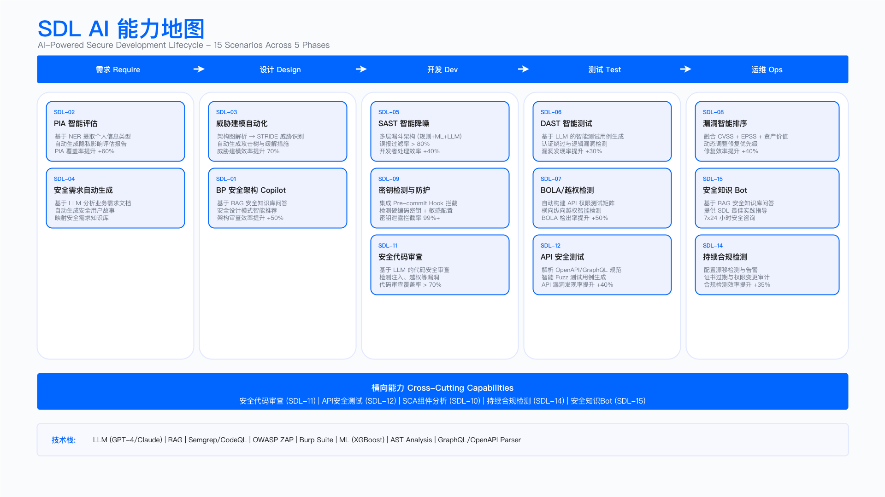
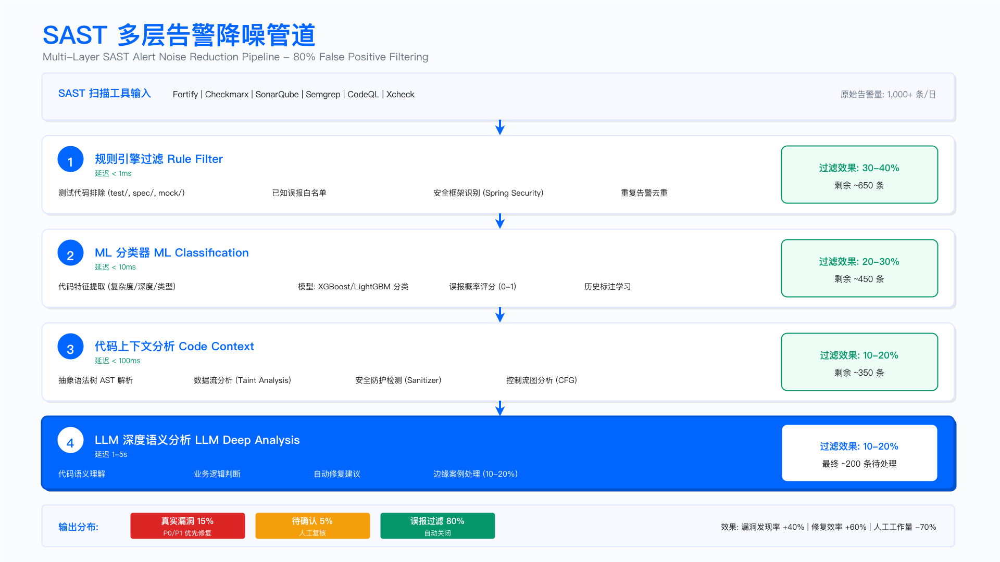

# 14.4 AI for AppSec：应用安全智能化

> **English Title**: AI for Application Security: Intelligent SDL Transformation
> **目标读者**: AppSec Engineer, Security Architect, DevSecOps, SDL Manager

---

## 执行摘要 | Executive Summary

应用安全（AppSec）是企业安全防护的第一道防线。随着开发速度加快、代码规模膨胀、供应链复杂度上升，传统基于规则的安全工具面临覆盖率和精度挑战。AI 技术可辅助安全需求识别、代码审查、漏洞检测、修复建议等环节，提升 AppSec 团队的处理能力。

本章节阐述 AI 在安全开发生命周期（SDL）中的应用，涵盖 15 大核心场景，遵循"业务需求→架构设计→工程实现→运营度量"的四层框架。

### 核心价值主张

> **说明**：以下为概念性对比，具体改进幅度因工具选型、数据质量、业务复杂度而异。

| 维度                | 传统 SDL             | AI-Powered SDL      | 改进方向   |
| ------------------- | -------------------- | ------------------- | ---------- |
| **安全评审**  | 专家人工，覆盖率有限 | AI Copilot 辅助扩展 | 覆盖率提升 |
| **SAST 误报** | 误报率较高           | ML 过滤降低         | 精度提升   |
| **评审耗时**  | 单项目耗时长         | AI 辅助缩短         | 效率提升   |
| **漏洞修复**  | 抽象建议，开发难理解 | 代码级修复建议      | 采纳率提升 |
| **知识复用**  | 经验难沉淀           | 知识库驱动          | 复用率提升 |

---

## 业务需求层 | Business Requirements Layer

### AppSec 核心痛点分析

```
┌─────────────────────────────────────────────────────────────────────────────┐
│                        AppSec 核心痛点与 AI 解决方案映射                      │
├─────────────────────────────────────────────────────────────────────────────┤
│                                                                             │
│  ┌─────────────────┐     ┌─────────────────┐     ┌─────────────────┐       │
│  │   评审瓶颈      │     │   工具噪音      │     │   修复低效      │       │
│  │  Review Gap     │     │  Tool Noise     │     │  Fix Delay      │       │
│  ├─────────────────┤     ├─────────────────┤     ├─────────────────┤       │
│  │ • BP 人力 1:200 │     │ • SAST 误报 80% │     │ • 建议抽象     │       │
│  │ • 覆盖率仅 40%  │     │ • 告警免疫效应  │     │ • 开发不理解   │       │
│  │ • 标准不统一    │     │ • 真漏洞被忽略  │     │ • 修复引入 bug │       │
│  └────────┬────────┘     └────────┬────────┘     └────────┬────────┘       │
│           │                       │                       │                 │
│           ▼                       ▼                       ▼                 │
│  ┌─────────────────────────────────────────────────────────────────────┐   │
│  │                         AI 解决方案矩阵                               │   │
│  ├─────────────────────────────────────────────────────────────────────┤   │
│  │                                                                     │   │
│  │  ┌───────────────┐  ┌───────────────┐  ┌───────────────┐           │   │
│  │  │ 安全BP Copilot│  │ SAST 告警降噪 │  │ 代码级修复    │           │   │
│  │  │ RAG + Review  │  │ ML + LLM 过滤 │  │ LLM + AST     │           │   │
│  │  └───────────────┘  └───────────────┘  └───────────────┘           │   │
│  │                                                                     │   │
│  │  ┌───────────────┐  ┌───────────────┐  ┌───────────────┐           │   │
│  │  │ 威胁建模自动化│  │ SCA 可达分析  │  │ 安全知识 Bot  │           │   │
│  │  │ Multi-Agent   │  │ 上下文感知    │  │ RAG + Chat    │           │   │
│  │  └───────────────┘  └───────────────┘  └───────────────┘           │   │
│  │                                                                     │   │
│  └─────────────────────────────────────────────────────────────────────┘   │
│                                                                             │
└─────────────────────────────────────────────────────────────────────────────┘
```

### 15 大 SDL AI 场景概览

基于 [AI for SDL 案例库](../ai_for_sdl_cases.md)，本章节覆盖以下核心场景：

| 场景编号 | 场景名称               | 核心能力         | 业务价值         | 优先级 |
| -------- | ---------------------- | ---------------- | ---------------- | ------ |
| SDL-01   | 安全 BP 评审 Copilot   | RAG + Copilot    | 评审覆盖率提升   | P0     |
| SDL-02   | 隐私合规风险评估 (PIA) | RAG + Workflow   | 评估周期缩短     | P0     |
| SDL-03   | 威胁建模自动化         | Multi-Agent + KG | STRIDE 自动生成  | P1     |
| SDL-04   | 安全需求自动生成       | RAG + Template   | 需求遗漏减少     | P1     |
| SDL-05   | SAST 告警复核降噪      | ML + LLM         | 误报率显著降低   | P0     |
| SDL-06   | DAST 逻辑漏洞检测      | LLM + 变异测试   | 检测逻辑漏洞     | P0     |
| SDL-07   | BOLA/IDOR 漏洞检测     | LLM + API 分析   | API 授权漏洞检测 | P0     |
| SDL-08   | SCA 组件风险分析       | ML + 可达分析    | 有效漏洞识别     | P1     |
| SDL-09   | 密钥/凭据泄露检测      | ML + LLM         | 上下文精准检测   | P1     |
| SDL-10   | POC/检测规则生成       | LLM + 代码生成   | 规则生成周期缩短 | P1     |
| SDL-11   | 代码级修复报告         | LLM + 代码理解   | 修复采纳率提升   | P0     |
| SDL-12   | API 安全测试增强       | LLM + Fuzzing    | API 测试覆盖提升 | P1     |
| SDL-13   | 安全代码审查辅助       | LLM + AST        | 人工审查效率提升 | P2     |
| SDL-14   | 安全培训出题系统       | RAG + 生成       | 培训针对性提升   | P2     |
| SDL-15   | 安全知识问答 Bot       | RAG + Chatbot    | 咨询效率提升     | P1     |

### 场景优先级矩阵（ICE 评分）

```
                        业务影响 (Impact)
                    Low          Medium         High
                ┌────────────┬────────────┬────────────┐
           High │  SDL-14    │  SDL-04    │SDL-01 SDL-05│
    实施  ──────┼────────────┼────────────┼────────────┤
    信心 Medium │  SDL-13    │SDL-08 SDL-09│SDL-02 SDL-11│
(Confidence)────┼────────────┼────────────┼────────────┤
           Low  │            │  SDL-10    │SDL-06 SDL-07│
                └────────────┴────────────┴────────────┘

推荐实施顺序：
阶段 1（0-6 月）：SDL-01 评审 Copilot → SDL-05 SAST 降噪 → SDL-11 代码修复
阶段 2（6-12 月）：SDL-02 PIA 自动化 → SDL-06/07 逻辑漏洞 → SDL-08 SCA 分析
阶段 3（12-18 月）：SDL-03 威胁建模 → SDL-09 密钥检测 → SDL-15 知识 Bot
```

---

## 架构逻辑层 | Architecture Logic Layer

### AppSec AI 能力架构

AppSec AI 能力基于 [14.2 AI 安全中台架构](./14.2_ai_security_platform_architecture.md) 构建，分为三大能力域：

```
┌─────────────────────────────────────────────────────────────────────────────┐
│                        AppSec AI 能力架构                                    │
├─────────────────────────────────────────────────────────────────────────────┤
│                                                                             │
│  ┌─────────────────────────────────────────────────────────────────────┐   │
│  │                     服务接入层 (Service Layer)                        │   │
│  │  ┌─────────┐ ┌─────────┐ ┌─────────┐ ┌─────────┐ ┌─────────┐       │   │
│  │  │ CI/CD   │ │  IDE    │ │  JIRA   │ │  飞书   │ │ ChatOps │       │   │
│  │  │ 流水线  │ │  插件   │ │  工单   │ │  通知   │ │  交互   │       │   │
│  │  └─────────┘ └─────────┘ └─────────┘ └─────────┘ └─────────┘       │   │
│  └─────────────────────────────────────────────────────────────────────┘   │
│                                      │                                      │
│  ┌───────────────────────────────────┴───────────────────────────────────┐ │
│  │                     应用层 (Application Layer)                         │ │
│  │                                                                        │ │
│  │  ┌────────────────────┐  ┌────────────────────┐  ┌────────────────┐   │ │
│  │  │   安全评审引擎     │  │   漏洞检测引擎     │  │  修复建议引擎  │   │ │
│  │  │  Review Engine     │  │  Detection Engine  │  │  Fix Engine    │   │ │
│  │  ├────────────────────┤  ├────────────────────┤  ├────────────────┤   │ │
│  │  │ • BP Copilot       │  │ • SAST 降噪        │  │ • 代码修复     │   │ │
│  │  │ • PIA 自动化       │  │ • DAST 逻辑漏洞    │  │ • 修复验证     │   │ │
│  │  │ • 威胁建模         │  │ • BOLA/IDOR        │  │ • 方案对比     │   │ │
│  │  │ • 安全需求         │  │ • 密钥泄露         │  │ • 回归检测     │   │ │
│  │  └────────────────────┘  └────────────────────┘  └────────────────┘   │ │
│  │                                                                        │ │
│  └────────────────────────────────────────────────────────────────────────┘ │
│                                      │                                      │
│  ┌───────────────────────────────────┴───────────────────────────────────┐ │
│  │                     能力层 (Capability Layer)                          │ │
│  │                                                                        │ │
│  │  ┌──────────────┐  ┌──────────────┐  ┌──────────────┐  ┌───────────┐  │ │
│  │  │   代码理解   │  │   LLM 服务   │  │   RAG 检索   │  │ 知识图谱  │  │ │
│  │  │ Code Models  │  │ LLM Service  │  │ RAG Engine   │  │    KG     │  │ │
│  │  ├──────────────┤  ├──────────────┤  ├──────────────┤  ├───────────┤  │ │
│  │  │ • CodeBERT   │  │ • GPT-4o     │  │ • 安全基线   │  │ • 漏洞库  │  │ │
│  │  │ • GraphCode  │  │ • Claude     │  │ • 历史案例   │  │ • 攻击链  │  │ │
│  │  │   BERT       │  │ • Code Llama │  │ • 合规要求   │  │ • 组件    │  │ │
│  │  │ • AST 分析   │  │              │  │ • 修复模式   │  │ • 依赖    │  │ │
│  │  └──────────────┘  └──────────────┘  └──────────────┘  └───────────┘  │ │
│  │                                                                        │ │
│  └────────────────────────────────────────────────────────────────────────┘ │
│                                      │                                      │
│  ┌───────────────────────────────────┴───────────────────────────────────┐ │
│  │                     基础层 (Infrastructure Layer)                      │ │
│  │                                                                        │ │
│  │  ┌──────────────────────────────────────────────────────────────────┐ │ │
│  │  │                    代码安全数据湖                                  │ │ │
│  │  │  ┌─────────┐ ┌─────────┐ ┌─────────┐ ┌─────────┐ ┌─────────┐   │ │ │
│  │  │  │ 代码库  │ │SAST结果 │ │SCA 依赖 │ │ 历史告警│ │ 修复记录│   │ │ │
│  │  │  │  Code   │ │ Findings│ │  SBOM   │ │ History │ │  Fixes  │   │ │ │
│  │  │  └─────────┘ └─────────┘ └─────────┘ └─────────┘ └─────────┘   │ │ │
│  │  └──────────────────────────────────────────────────────────────────┘ │ │
│  │                                                                        │ │
│  └────────────────────────────────────────────────────────────────────────┘ │
│                                                                             │
└─────────────────────────────────────────────────────────────────────────────┘
```



**图注**：SDL AI 能力全景图，展示从安全评审、漏洞检测到修复建议的完整能力矩阵，涵盖 15 大核心场景与对应的技术实现。

### 数据流架构

```
┌─────────────────────────────────────────────────────────────────────────────┐
│                        AppSec AI 数据流架构                                  │
├─────────────────────────────────────────────────────────────────────────────┤
│                                                                             │
│   开发阶段              安全分析              AI 增强                        │
│  ┌─────────┐          ┌─────────────┐          ┌─────────────┐             │
│  │ 需求    │───┐      │             │          │             │             │
│  │ PRD     │   │      │   安全需求  │          │   AI 评审   │             │
│  └─────────┘   │      │   识别引擎  │          │   Copilot   │             │
│  ┌─────────┐   │      │             │          │             │             │
│  │ 设计    │───┼─────▶│   (SDL-01)  │─────────▶│   (RAG)     │             │
│  │ 架构图  │   │      │             │          │             │             │
│  └─────────┘   │      └─────────────┘          └──────┬──────┘             │
│  ┌─────────┐   │              │                       │                     │
│  │ 代码    │───┤              │                       ▼                     │
│  │ Commit  │   │              │               ┌─────────────┐               │
│  └─────────┘   │              │               │             │               │
│  ┌─────────┐   │              │               │ 安全需求    │               │
│  │ CI/CD   │───┘              │               │ 评审结论    │               │
│  │ 触发    │                  │               │             │               │
│  └─────────┘                  │               └──────┬──────┘               │
│                               │                      │                      │
│       代码扫描                │                      ▼                      │
│  ┌─────────┐          ┌──────┴──────┐        ┌─────────────┐               │
│  │  SAST   │─────────▶│   代码分析  │        │             │               │
│  └─────────┘          │   Pipeline  │        │  ML 告警    │               │
│  ┌─────────┐          │             │───────▶│   过滤      │               │
│  │  SCA    │─────────▶│  (SDL-05)   │        │ (XGBoost)   │               │
│  └─────────┘          └─────────────┘        │             │               │
│  ┌─────────┐                                 └──────┬──────┘               │
│  │  DAST   │                                        │                      │
│  └─────────┘                                        ▼                      │
│                                              ┌─────────────┐               │
│                                              │   LLM 深度  │               │
│                                              │   分析      │               │
│                                              │ (上下文理解)│               │
│                                              └──────┬──────┘               │
│                                                     │                      │
│                    ┌────────────────────────────────┼────────────────┐     │
│                    ▼                    ▼           ▼                ▼     │
│             ┌───────────┐       ┌───────────┐ ┌───────────┐  ┌───────────┐│
│             │ 代码修复  │       │ 开发通知  │ │ JIRA 工单 │  │ 安全评审  ││
│             │  建议     │       │ IDE 提示  │ │  创建     │  │  报告     ││
│             └───────────┘       └───────────┘ └───────────┘  └───────────┘│
│                                                                             │
└─────────────────────────────────────────────────────────────────────────────┘
```

---

## 工程技术层 | Engineering Technology Layer

### 核心场景技术实现

#### SDL-01: 安全 BP 评审 Copilot

**技术方案：RAG + Checklist + LLM 评审**

```
┌─────────────────────────────────────────────────────────────────────────────┐
│                      安全 BP 评审 Copilot 架构                               │
├─────────────────────────────────────────────────────────────────────────────┤
│                                                                             │
│  ┌─────────────────────────────────────────────────────────────────────┐   │
│  │                         项目输入解析                                  │   │
│  │  ┌─────────┐ ┌─────────┐ ┌─────────┐ ┌─────────┐ ┌─────────┐       │   │
│  │  │  PRD    │ │ 技术方案│ │ 架构图  │ │ API 文档│ │ 数据流图│       │   │
│  │  │  需求   │ │  设计   │ │ Draw.io │ │ OpenAPI │ │   DFD   │       │   │
│  │  └────┬────┘ └────┬────┘ └────┬────┘ └────┬────┘ └────┬────┘       │   │
│  │       └───────────┴───────────┼───────────┴───────────┘             │   │
│  │                               ▼                                      │   │
│  │  ┌─────────────────────────────────────────────────────────────┐    │   │
│  │  │  文档解析引擎                                                 │    │   │
│  │  │  • 文档类型识别                                               │    │   │
│  │  │  • 关键信息提取（技术栈/数据类型/部署环境）                    │    │   │
│  │  │  • 项目风险特征识别                                           │    │   │
│  │  └─────────────────────────────────────────────────────────────┘    │   │
│  └─────────────────────────────────────────────────────────────────────┘   │
│                                      │                                      │
│  ┌───────────────────────────────────┴───────────────────────────────────┐ │
│  │                      上下文组装层 (Context Engineering)                 │ │
│  │                                                                        │ │
│  │  ┌──────────────────────────────────────────────────────────────────┐ │ │
│  │  │  RAG 检索内容：                                                    │ │ │
│  │  │  ┌────────────────┐  ┌────────────────┐  ┌────────────────┐     │ │ │
│  │  │  │ 公司安全基线   │  │ 历史类似项目   │  │ 行业漏洞案例   │     │ │ │
│  │  │  │ 标准要求       │  │ 风险与经验     │  │ OWASP TOP 10   │     │ │ │
│  │  │  └────────────────┘  └────────────────┘  └────────────────┘     │ │ │
│  │  │  ┌────────────────┐  ┌────────────────┐                         │ │ │
│  │  │  │ 合规要求映射   │  │ 修复方案模板   │                         │ │ │
│  │  │  │ PCI/GDPR/等保  │  │ 最佳实践       │                         │ │ │
│  │  │  └────────────────┘  └────────────────┘                         │ │ │
│  │  └──────────────────────────────────────────────────────────────────┘ │ │
│  │                                                                        │ │
│  └────────────────────────────────────────────────────────────────────────┘ │
│                                      │                                      │
│  ┌───────────────────────────────────┴───────────────────────────────────┐ │
│  │                      LLM 评审生成层                                     │ │
│  │                                                                        │ │
│  │  ┌──────────────────────────────────────────────────────────────────┐ │ │
│  │  │  评审维度：                                                        │ │ │
│  │  │  ┌────────────────┐  ┌────────────────┐  ┌────────────────┐     │ │ │
│  │  │  │ STRIDE 威胁    │  │ 数据安全评估   │  │ 合规差距分析   │     │ │ │
│  │  │  │ 身份/篡改/泄露 │  │ 分级/存储/传输 │  │ PCI/GDPR/等保  │     │ │ │
│  │  │  └────────────────┘  └────────────────┘  └────────────────┘     │ │ │
│  │  │  ┌────────────────┐  ┌────────────────┐                         │ │ │
│  │  │  │ 架构风险识别   │  │ 安全需求生成   │                         │ │ │
│  │  │  │ 信任边界/攻击面│  │ 可执行 Checklist│                         │ │ │
│  │  │  └────────────────┘  └────────────────┘                         │ │ │
│  │  └──────────────────────────────────────────────────────────────────┘ │ │
│  │                                                                        │ │
│  └────────────────────────────────────────────────────────────────────────┘ │
│                                      │                                      │
│         ┌────────────────────────────┼────────────────────────────┐         │
│         ▼                            ▼                            ▼         │
│  ┌─────────────┐            ┌─────────────┐            ┌─────────────┐     │
│  │  评审报告   │            │  JIRA Issue │            │  飞书通知   │     │
│  │  Markdown   │            │  自动创建   │            │  消息推送   │     │
│  └─────────────┘            └─────────────┘            └─────────────┘     │
│                                                                             │
└─────────────────────────────────────────────────────────────────────────────┘
```

**关键代码实现**（参考 [ai_for_sdl_cases.md](../ai_for_sdl_cases.md) 完整实现）：

```python
"""
安全 BP 评审 Copilot - 核心接口定义
"""

from dataclasses import dataclass
from typing import List, Dict

@dataclass
class ReviewResult:
    """评审结果"""
    risk_level: str                 # HIGH/MEDIUM/LOW
    data_sensitivity: str           # L1-L4
    exposure: str                   # 内网/外网/第三方
    risks: List[RiskItem]           # 风险清单
    requirements: List[Requirement] # 安全需求清单
    questions: List[str]            # 待澄清问题
    checklist: List[CheckItem]      # 验收 Checklist

class SecurityBPCopilot:
    """安全 BP 评审智能助手"""

    def __init__(self):
        self.doc_parser = ProjectDocParser()
        self.rag_engine = SecurityRAGEngine()
        self.llm = LLMClient()
        self.checklist_engine = ChecklistEngine()

    async def review_project(self, project: ProjectInfo) -> ReviewResult:
        """执行项目安全评审"""

        # 1. 解析项目文档
        parsed_info = await self.doc_parser.parse(project.documents)

        # 2. 识别数据分类和风险特征
        risk_profile = await self.analyze_risk_profile(parsed_info)

        # 3. 检索相关安全知识
        context = await self.rag_engine.retrieve(
            queries=[
                f"技术栈 {parsed_info.tech_stack} 常见安全风险",
                f"数据类型 {risk_profile.data_types} 安全要求",
                f"部署环境 {parsed_info.deployment} 安全基线"
            ],
            filters={
                "doc_type": ["baseline", "case", "compliance"],
                "relevance_threshold": 0.7
            }
        )

        # 4. 检索历史类似项目
        similar_projects = await self.rag_engine.search_similar_projects(
            tech_stack=parsed_info.tech_stack,
            business_type=parsed_info.business_type,
            limit=5
        )

        # 5. LLM 生成评审结果
        review = await self.llm.generate(
            system_prompt=self.get_review_prompt(),
            user_prompt=self.build_context(
                parsed_info, risk_profile, context, similar_projects
            )
        )

        return ReviewResult(
            risk_level=review.risk_level,
            data_sensitivity=risk_profile.data_classification,
            exposure=risk_profile.exposure,
            risks=review.risks,
            requirements=review.requirements,
            questions=review.questions,
            checklist=self.checklist_engine.generate(review)
        )
```

**质量指标**：

| 指标           | 目标值   | 测量方法     |
| -------------- | -------- | ------------ |
| 风险识别覆盖率 | > 90%    | 对比专家评审 |
| 误报率         | < 15%    | 开发反馈统计 |
| 用户采纳率     | > 85%    | 需求实施跟踪 |
| 评审一致性     | κ > 0.8 | 多评审员对比 |

#### SDL-05: SAST 告警复核降噪

**技术方案：多层过滤 + 上下文分析**

```
┌─────────────────────────────────────────────────────────────────────────────┐
│                      SAST 告警降噪引擎架构                                   │
├─────────────────────────────────────────────────────────────────────────────┤
│                                                                             │
│  ┌─────────────────────────────────────────────────────────────────────┐   │
│  │                         SAST 告警输入                                 │   │
│  │     Fortify ──┬── Checkmarx ──┬── SonarQube ──┬── Semgrep           │   │
│  └────────────────┴──────────────┴───────────────┴──────────────────────┘   │
│                                      │                                      │
│                                      ▼                                      │
│  ┌─────────────────────────────────────────────────────────────────────┐   │
│  │                    第一层：规则过滤 (< 1ms)                            │   │
│  │  ┌───────────────────────────────────────────────────────────────┐  │   │
│  │  │  • 测试文件排除（test_*.py, *_test.go）                         │  │   │
│  │  │  • 已知误报模式（历史标注学习）                                  │  │   │
│  │  │  • 框架保护识别（Django ORM, MyBatis PreparedStatement）        │  │   │
│  │  └───────────────────────────────────────────────────────────────┘  │   │
│  │  过滤率: 30-40%                                                      │   │
│  └─────────────────────────────────────────────────────────────────────┘   │
│                                      │                                      │
│                                      ▼                                      │
│  ┌─────────────────────────────────────────────────────────────────────┐   │
│  │                    第二层：ML 分类 (< 10ms)                           │   │
│  │  ┌───────────────────────────────────────────────────────────────┐  │   │
│  │  │  特征工程：                                                     │  │   │
│  │  │  • 告警类型（SQL注入/XSS/路径遍历...）                         │  │   │
│  │  │  • 代码位置（生产代码/配置文件/脚本）                           │  │   │
│  │  │  • 开发者历史修复率                                            │  │   │
│  │  │  • 同类告警累计次数                                            │  │   │
│  │  │  • 代码变更频率                                                │  │   │
│  │  │                                                               │  │   │
│  │  │  模型：XGBoost / LightGBM                                     │  │   │
│  │  │  输出：误报概率（0-1）                                         │  │   │
│  │  └───────────────────────────────────────────────────────────────┘  │   │
│  │  过滤率: 20-30% (概率 > 0.8 标记为误报)                              │   │
│  └─────────────────────────────────────────────────────────────────────┘   │
│                                      │                                      │
│                                      ▼                                      │
│  ┌─────────────────────────────────────────────────────────────────────┐   │
│  │                    第三层：代码上下文分析 (< 100ms)                    │   │
│  │  ┌───────────────────────────────────────────────────────────────┐  │   │
│  │  │  AST + 数据流分析：                                             │  │   │
│  │  │  ┌─────────────────────────────────────────────────────────┐  │  │   │
│  │  │  │  1. 提取用户输入源（request.args, request.body）          │  │  │   │
│  │  │  │  2. 追踪数据流路径至敏感函数（execute, eval, open）       │  │  │   │
│  │  │  │  3. 识别路径中的净化/验证函数                            │  │  │   │
│  │  │  │  4. 判定是否存在有效防护                                 │  │  │   │
│  │  │  └─────────────────────────────────────────────────────────┘  │  │   │
│  │  └───────────────────────────────────────────────────────────────┘  │   │
│  │  过滤率: 10-20%                                                      │   │
│  └─────────────────────────────────────────────────────────────────────┘   │
│                                      │                                      │
│                                      ▼                                      │
│  ┌─────────────────────────────────────────────────────────────────────┐   │
│  │                    第四层：LLM 深度分析 (1-5s)                        │   │
│  │  ┌───────────────────────────────────────────────────────────────┐  │   │
│  │  │  仅对置信度 0.4-0.8 的告警调用 LLM：                            │  │   │
│  │  │  • 提供完整代码上下文（函数 + 调用链）                         │  │   │
│  │  │  • 询问漏洞是否真实可利用                                      │  │   │
│  │  │  • 生成分析理由（供人工复核）                                  │  │   │
│  │  └───────────────────────────────────────────────────────────────┘  │   │
│  │  处理比例: 10-20% 告警需要 LLM 分析                                  │   │
│  └─────────────────────────────────────────────────────────────────────┘   │
│                                      │                                      │
│         ┌────────────────────────────┼────────────────────────────┐         │
│         ▼                            ▼                            ▼         │
│  ┌─────────────┐            ┌─────────────┐            ┌─────────────┐     │
│  │  真实漏洞   │            │  疑似漏洞   │            │  已过滤     │     │
│  │ (P0/P1)     │            │  需人工确认 │            │  (误报)     │     │
│  │  15-20%     │            │   5-10%     │            │  70-80%     │     │
│  └─────────────┘            └─────────────┘            └─────────────┘     │
│                                                                             │
└─────────────────────────────────────────────────────────────────────────────┘
```



**图注**：SAST 告警降噪管道四层架构，展示从规则过滤、ML 分类、代码上下文分析到 LLM 深度分析的多级过滤流程，实现误报率从 80% 降至 15-20%。

**关键代码实现**：

```python
"""
SAST 告警降噪引擎
"""

class SASTNoiseReductionEngine:
    """多层告警过滤引擎"""

    def __init__(self, config: NoiseReductionConfig):
        self.rule_filter = RuleBasedFilter(config.rules)
        self.ml_classifier = MLAlertClassifier(config.model_path)
        self.ast_analyzer = ASTDataFlowAnalyzer()
        self.llm_analyzer = LLMVulnAnalyzer(config.llm_config)

    async def filter_alerts(
        self, alerts: List[SASTAlert]
    ) -> FilterResult:
        """执行多层告警过滤"""

        results = FilterResult()

        for alert in alerts:
            # 层1：规则快速过滤
            if self.rule_filter.should_filter(alert):
                results.add_filtered(alert, reason="rule_match")
                continue

            # 层2：ML 分类
            ml_score = self.ml_classifier.predict_false_positive(alert)
            if ml_score > 0.85:
                results.add_filtered(alert, reason="ml_high_fp")
                continue

            # 层3：代码上下文分析
            if await self._has_effective_protection(alert):
                results.add_filtered(alert, reason="protected")
                continue

            # 层4：不确定告警调用 LLM
            if 0.4 < ml_score < 0.8:
                llm_result = await self.llm_analyzer.analyze(alert)
                if llm_result.is_false_positive:
                    results.add_filtered(alert, reason="llm_fp")
                    continue

            # 通过所有过滤层的告警
            results.add_valid(alert, confidence=1 - ml_score)

        return results

    async def _has_effective_protection(self, alert: SASTAlert) -> bool:
        """检查代码是否有有效防护"""

        # 解析 AST 和数据流
        code_context = await self.ast_analyzer.get_context(
            file_path=alert.file_path,
            line_number=alert.line_number
        )

        # 检查数据流路径中的净化函数
        data_flow = await self.ast_analyzer.trace_data_flow(
            source=code_context.user_inputs,
            sink=code_context.vulnerable_call
        )

        return data_flow.has_sanitization or data_flow.has_parameterization
```

#### SDL-06/07: BOLA/IDOR 与逻辑漏洞检测

**技术方案：LLM + API 语义分析**

```
┌─────────────────────────────────────────────────────────────────────────────┐
│                      API 逻辑漏洞检测架构                                     │
├─────────────────────────────────────────────────────────────────────────────┤
│                                                                             │
│  ┌─────────────────────────────────────────────────────────────────────┐   │
│  │                         API 定义输入                                  │   │
│  │  ┌─────────┐ ┌─────────┐ ┌─────────┐ ┌─────────┐                    │   │
│  │  │ OpenAPI │ │  代码   │ │ 流量    │ │  日志   │                    │   │
│  │  │  Spec   │ │  路由   │ │  录制   │ │  分析   │                    │   │
│  │  └────┬────┘ └────┬────┘ └────┬────┘ └────┬────┘                    │   │
│  │       └───────────┴───────────┼───────────┘                          │   │
│  │                               ▼                                      │   │
│  │  ┌─────────────────────────────────────────────────────────────┐    │   │
│  │  │  API 语义理解                                                 │    │   │
│  │  │  • 资源识别（用户/订单/文件）                                  │    │   │
│  │  │  • 操作类型（CRUD）                                            │    │   │
│  │  │  • 参数语义（ID/Token/Filter）                                 │    │   │
│  │  │  • 权限模型推断（RBAC/ABAC/ACL）                               │    │   │
│  │  └─────────────────────────────────────────────────────────────┘    │   │
│  └─────────────────────────────────────────────────────────────────────┘   │
│                                      │                                      │
│  ┌───────────────────────────────────┴───────────────────────────────────┐ │
│  │                      漏洞检测引擎                                       │ │
│  │                                                                        │ │
│  │  ┌──────────────────────────────────────────────────────────────────┐ │ │
│  │  │                    BOLA/IDOR 检测                                 │ │ │
│  │  │  ┌────────────────────────────────────────────────────────────┐ │ │ │
│  │  │  │  │  检测逻辑：                                                  │ │ │ │
│  │  │  │  1. 识别资源 ID 参数（path: /users/{id}, query: ?order_id） │ │ │ │
│  │  │  │  2. 分析授权检查点（代码审计 / 流量分析）                   │ │ │ │
│  │  │  │  3. 生成测试用例：替换 ID 为其他用户资源                   │ │ │ │
│  │  │  │  4. 执行测试并验证响应                                     │ │ │ │
│  │  │  └────────────────────────────────────────────────────────────┘ │ │ │
│  │  └──────────────────────────────────────────────────────────────────┘ │ │
│  │                                                                        │ │
│  │  ┌──────────────────────────────────────────────────────────────────┐ │ │
│  │  │                    业务逻辑漏洞检测                               │ │ │
│  │  │  ┌────────────────────────────────────────────────────────────┐ │ │ │
│  │  │  │  常见模式：                                                  │ │ │ │
│  │  │  │  • 价格篡改（修改购物车金额）                               │ │ │ │
│  │  │  │  • 数量篡改（负数/超大值）                                  │ │ │ │
│  │  │  │  • 状态跳跃（跳过支付步骤）                                 │ │ │ │
│  │  │  │  • 竞态条件（重复领券）                                     │ │ │ │
│  │  │  │  • 权限升级（普通用户访问管理接口）                         │ │ │ │
│  │  │  └────────────────────────────────────────────────────────────┘ │ │ │
│  │  └──────────────────────────────────────────────────────────────────┘ │ │
│  │                                                                        │ │
│  └────────────────────────────────────────────────────────────────────────┘ │
│                                      │                                      │
│  ┌───────────────────────────────────┴───────────────────────────────────┐ │
│  │                      LLM 测试用例生成                                   │ │
│  │  ┌──────────────────────────────────────────────────────────────────┐ │ │
│  │  │  Prompt：                                                          │ │ │
│  │  │  """                                                              │ │ │
│  │  │  分析以下 API 定义，生成 BOLA 测试用例：                           │ │ │
│  │  │                                                                   │ │ │
│  │  │  API: GET /api/v1/orders/{order_id}                               │ │ │
│  │  │  Auth: Bearer Token (user_id in JWT)                             │ │ │
│  │  │                                                                   │ │ │
│  │  │  生成测试：                                                        │ │ │
│  │  │  1. 用 User A 的 Token 访问 User B 的 order_id                   │ │ │
│  │  │  2. 验证是否返回 403 或 404                                      │ │ │
│  │  │  3. 如果返回 200，则存在 BOLA 漏洞                               │ │ │
│  │  │  """                                                              │ │ │
│  │  └──────────────────────────────────────────────────────────────────┘ │ │
│  │                                                                        │ │
│  └────────────────────────────────────────────────────────────────────────┘ │
│                                                                             │
└─────────────────────────────────────────────────────────────────────────────┘
```

#### SDL-08: SCA 组件风险分析

**技术方案：可达性分析 + 上下文评估**

```
┌─────────────────────────────────────────────────────────────────────────────┐
│                      SCA 智能风险分析架构                                    │
├─────────────────────────────────────────────────────────────────────────────┤
│                                                                             │
│  ┌─────────────────────────────────────────────────────────────────────┐   │
│  │                         依赖扫描输入                                  │   │
│  │  ┌─────────┐ ┌─────────┐ ┌─────────┐ ┌─────────┐                    │   │
│  │  │  SBOM   │ │package  │ │ go.mod  │ │ pom.xml │                    │   │
│  │  │         │ │  .json  │ │         │ │         │                    │   │
│  │  └────┬────┘ └────┬────┘ └────┬────┘ └────┬────┘                    │   │
│  │       └───────────┴───────────┼───────────┘                          │   │
│  │                               ▼                                      │   │
│  │  ┌─────────────────────────────────────────────────────────────┐    │   │
│  │  │  CVE 匹配（传统 SCA）                                          │    │   │
│  │  │  • lodash 4.17.20 → CVE-2021-23337（High）                    │    │   │
│  │  │  • 结果：200+ CVE 告警                                        │    │   │
│  │  └─────────────────────────────────────────────────────────────┘    │   │
│  └─────────────────────────────────────────────────────────────────────┘   │
│                                      │                                      │
│  ┌───────────────────────────────────┴───────────────────────────────────┐ │
│  │                      AI 可达性分析                                      │ │
│  │                                                                        │ │
│  │  ┌──────────────────────────────────────────────────────────────────┐ │ │
│  │  │  步骤 1：构建函数调用图                                           │ │ │
│  │  │  ┌────────────────────────────────────────────────────────────┐ │ │ │
│  │  │  │  项目代码 AST → 依赖库 AST → 完整调用图                     │ │ │ │
│  │  │  │  标注：项目入口 → ... → 漏洞函数                            │ │ │ │
│  │  │  └────────────────────────────────────────────────────────────┘ │ │ │
│  │  │                                                                  │ │ │
│  │  │  步骤 2：漏洞函数可达性判定                                       │ │ │
│  │  │  ┌────────────────────────────────────────────────────────────┐ │ │ │
│  │  │  │  CVE-2021-23337 影响函数：lodash.template                   │ │ │ │
│  │  │  │  项目调用：lodash.merge, lodash.cloneDeep                   │ │ │ │
│  │  │  │  结果：lodash.template 不可达 → 标记为 "不可达漏洞"         │ │ │ │
│  │  │  └────────────────────────────────────────────────────────────┘ │ │ │
│  │  │                                                                  │ │ │
│  │  │  步骤 3：过滤结果                                                │ │ │
│  │  │  ┌────────────────────────────────────────────────────────────┐ │ │ │
│  │  │  │  原始：200+ CVE                                             │ │ │ │
│  │  │  │  可达：30 CVE（15%）                                         │ │ │ │
│  │  │  │  需修复：30 CVE（优先级已排序）                              │ │ │ │
│  │  │  └────────────────────────────────────────────────────────────┘ │ │ │
│  │  └──────────────────────────────────────────────────────────────────┘ │ │
│  │                                                                        │ │
│  └────────────────────────────────────────────────────────────────────────┘ │
│                                      │                                      │
│  ┌───────────────────────────────────┴───────────────────────────────────┐ │
│  │                      上下文风险评估                                     │ │
│  │                                                                        │ │
│  │  ┌──────────────┐  ┌──────────────┐  ┌──────────────┐  ┌───────────┐ │ │
│  │  │   EPSS 分数  │  │  资产关键性  │  │  网络暴露    │  │ 补偿控制  │ │ │
│  │  │ 利用概率    │  │  Crown Jewel │  │  Internet?   │  │ WAF/IPS   │ │ │
│  │  └──────────────┘  └──────────────┘  └──────────────┘  └───────────┘ │ │
│  │                                                                        │ │
│  │  Context_Risk = f(CVSS, EPSS, Reachability, Asset_Crit, Exposure)     │ │
│  │                                                                        │ │
│  └────────────────────────────────────────────────────────────────────────┘ │
│                                                                             │
└─────────────────────────────────────────────────────────────────────────────┘
```

#### SDL-11: 代码级修复报告

**技术方案：LLM + 代码理解 + 多方案生成**

```
┌─────────────────────────────────────────────────────────────────────────────┐
│                      代码级修复建议架构                                       │
├─────────────────────────────────────────────────────────────────────────────┤
│                                                                             │
│  ┌─────────────────────────────────────────────────────────────────────┐   │
│  │                         漏洞信息输入                                  │   │
│  │  ┌─────────────────────────────────────────────────────────────┐    │   │
│  │  │  漏洞类型：SQL Injection                                      │    │   │
│  │  │  文件：src/api/users.py:42                                    │    │   │
│  │  │  代码：                                                        │    │   │
│  │  │  ```python                                                    │    │   │
│  │  │  def get_user(user_id):                                       │    │   │
│  │  │      query = f"SELECT * FROM users WHERE id = {user_id}"      │    │   │
│  │  │      return db.execute(query)                                 │    │   │
│  │  │  ```                                                          │    │   │
│  │  └─────────────────────────────────────────────────────────────┘    │   │
│  └─────────────────────────────────────────────────────────────────────┘   │
│                                      │                                      │
│  ┌───────────────────────────────────┴───────────────────────────────────┐ │
│  │                      LLM 多方案生成                                     │ │
│  │                                                                        │ │
│  │  ┌──────────────────────────────────────────────────────────────────┐ │ │
│  │  │  方案 1：快速修复（5-15 分钟）                                     │ │ │
│  │  │  ┌────────────────────────────────────────────────────────────┐ │ │ │
│  │  │  │  ```python                                                  │ │ │ │
│  │  │  │  def get_user(user_id):                                     │ │ │ │
│  │  │  │      if not user_id.isdigit():                              │ │ │ │
│  │  │  │          raise ValueError("Invalid user_id")               │ │ │ │
│  │  │  │      query = f"SELECT * FROM users WHERE id = {user_id}"    │ │ │ │
│  │  │  │      return db.execute(query)                               │ │ │ │
│  │  │  │  ```                                                        │ │ │ │
│  │  │  │  风险：仅适用于整数 ID，其他类型可能绕过                    │ │ │ │
│  │  │  └────────────────────────────────────────────────────────────┘ │ │ │
│  │  └──────────────────────────────────────────────────────────────────┘ │ │
│  │                                                                        │ │
│  │  ┌──────────────────────────────────────────────────────────────────┐ │ │
│  │  │  方案 2：标准修复（1-2 小时）✓ 推荐                               │ │ │
│  │  │  ┌────────────────────────────────────────────────────────────┐ │ │ │
│  │  │  │  ```python                                                  │ │ │ │
│  │  │  │  def get_user(user_id):                                     │ │ │ │
│  │  │  │      query = "SELECT * FROM users WHERE id = %s"            │ │ │ │
│  │  │  │      return db.execute(query, (user_id,))                   │ │ │ │
│  │  │  │  ```                                                        │ │ │ │
│  │  │  │  说明：使用参数化查询，遵循 OWASP 最佳实践                  │ │ │ │
│  │  │  └────────────────────────────────────────────────────────────┘ │ │ │
│  │  └──────────────────────────────────────────────────────────────────┘ │ │
│  │                                                                        │ │
│  │  ┌──────────────────────────────────────────────────────────────────┐ │ │
│  │  │  方案 3：架构重构（1-2 天）                                        │ │ │
│  │  │  ┌────────────────────────────────────────────────────────────┐ │ │ │
│  │  │  │  ```python                                                  │ │ │ │
│  │  │  │  # 使用 ORM 替代原始 SQL                                    │ │ │ │
│  │  │  │  from models import User                                    │ │ │ │
│  │  │  │                                                             │ │ │ │
│  │  │  │  def get_user(user_id: int):                                │ │ │ │
│  │  │  │      return User.query.get(user_id)                         │ │ │ │
│  │  │  │  ```                                                        │ │ │ │
│  │  │  │  说明：从根本上消除 SQL 注入风险                            │ │ │ │
│  │  │  └────────────────────────────────────────────────────────────┘ │ │ │
│  │  └──────────────────────────────────────────────────────────────────┘ │ │
│  │                                                                        │ │
│  └────────────────────────────────────────────────────────────────────────┘ │
│                                      │                                      │
│  ┌───────────────────────────────────┴───────────────────────────────────┐ │
│  │                      修复验证                                           │ │
│  │  ┌──────────────────────────────────────────────────────────────────┐ │ │
│  │  │  • 静态分析验证：修复后代码不触发 SAST 告警                       │ │ │
│  │  │  • 功能测试验证：生成单元测试确保功能不变                         │ │ │
│  │  │  • 安全测试验证：生成 SQL 注入测试用例验证修复有效               │ │ │
│  │  └──────────────────────────────────────────────────────────────────┘ │ │
│  │                                                                        │ │
│  └────────────────────────────────────────────────────────────────────────┘ │
│                                                                             │
└─────────────────────────────────────────────────────────────────────────────┘
```

### 技术选型矩阵

| 场景                | 代码模型      | LLM           | 传统工具  | 数据依赖   | 实时性 |
| ------------------- | ------------- | ------------- | --------- | ---------- | ------ |
| SDL-01 评审 Copilot | -             | GPT-4o/Claude | -         | RAG 知识库 | 分钟级 |
| SDL-05 SAST 降噪    | CodeBERT      | GPT-4o        | SAST 工具 | 历史告警   | 秒级   |
| SDL-06 逻辑漏洞     | -             | GPT-4o/Claude | DAST      | API 定义   | 分钟级 |
| SDL-07 BOLA 检测    | -             | GPT-4o        | -         | OpenAPI    | 分钟级 |
| SDL-08 SCA 分析     | GraphCodeBERT | 可选          | SCA 工具  | SBOM       | 分钟级 |
| SDL-09 密钥检测     | -             | GPT-4o        | Gitleaks  | 代码库     | 秒级   |
| SDL-11 代码修复     | CodeGen       | GPT-4o/Claude | -         | 漏洞上下文 | 秒级   |
| SDL-15 知识 Bot     | -             | GPT-4o/Claude | -         | RAG 知识库 | 秒级   |

---

## 运营服务层 | Operations Service Layer

### 服务等级协议 (SLA)

| 服务能力         | 可用性 | 响应延迟                 | 处理能力 | 数据保留 |
| ---------------- | ------ | ------------------------ | -------- | -------- |
| 评审 Copilot API | 99.5%  | P50 < 5s, P99 < 30s      | 100 TPS  | 1 年     |
| SAST 降噪 API    | 99.9%  | P50 < 100ms, P99 < 500ms | 1K TPS   | 90 天    |
| 代码修复 API     | 99%    | P50 < 3s, P99 < 10s      | 100 TPS  | 30 天    |
| 安全知识 Bot     | 99.5%  | P50 < 2s, P99 < 8s       | 500 TPS  | 永久     |

### 运营指标体系

```
┌─────────────────────────────────────────────────────────────────────────────┐
│                        AppSec AI 运营指标体系                                │
├─────────────────────────────────────────────────────────────────────────────┤
│                                                                             │
│  ┌─────────────────────────────────────────────────────────────────────┐   │
│  │                         效能指标 (Efficiency)                         │   │
│  │  ┌───────────────────┐  ┌───────────────────┐  ┌─────────────────┐   │   │
│  │  │ 评审覆盖率        │  │ 告警降噪率        │  │ 修复采纳率      │   │   │
│  │  │ Review Coverage   │  │ Alert Reduction   │  │ Fix Adoption    │   │   │
│  │  │ Target: 95%+      │  │ Target: 80%+      │  │ Target: 60%+    │   │   │
│  │  └───────────────────┘  └───────────────────┘  └─────────────────┘   │   │
│  └─────────────────────────────────────────────────────────────────────┘   │
│                                                                             │
│  ┌─────────────────────────────────────────────────────────────────────┐   │
│  │                         质量指标 (Quality)                            │   │
│  │  ┌───────────────────┐  ┌───────────────────┐  ┌─────────────────┐   │   │
│  │  │ 风险识别准确率    │  │ 误报率            │  │ 修复回归率      │   │   │
│  │  │ Risk Precision    │  │ False Positive    │  │ Fix Regression  │   │   │
│  │  │ Target: > 90%     │  │ Target: < 15%     │  │ Target: < 3%    │   │   │
│  │  └───────────────────┘  └───────────────────┘  └─────────────────┘   │   │
│  └─────────────────────────────────────────────────────────────────────┘   │
│                                                                             │
│  ┌─────────────────────────────────────────────────────────────────────┐   │
│  │                         时效指标 (Timeliness)                         │   │
│  │  ┌───────────────────┐  ┌───────────────────┐  ┌─────────────────┐   │   │
│  │  │ 评审周期          │  │ 漏洞修复周期      │  │ CI 扫描耗时     │   │   │
│  │  │ Review Cycle      │  │ Fix Cycle         │  │ Scan Duration   │   │   │
│  │  │ Target: < 4h      │  │ Target: P0 < 24h  │  │ Target: < 5min  │   │   │
│  │  └───────────────────┘  └───────────────────┘  └─────────────────┘   │   │
│  └─────────────────────────────────────────────────────────────────────┘   │
│                                                                             │
│  ┌─────────────────────────────────────────────────────────────────────┐   │
│  │                         开发者体验 (Developer Experience)             │   │
│  │  ┌───────────────────┐  ┌───────────────────┐  ┌─────────────────┐   │   │
│  │  │ 开发者满意度      │  │ 安全知识采纳率    │  │ 自助解决率      │   │   │
│  │  │ Dev Satisfaction  │  │ Knowledge Adopt   │  │ Self-Service    │   │   │
│  │  │ Target: NPS > 40  │  │ Target: > 70%     │  │ Target: > 80%   │   │   │
│  │  └───────────────────┘  └───────────────────┘  └─────────────────┘   │   │
│  └─────────────────────────────────────────────────────────────────────┘   │
│                                                                             │
└─────────────────────────────────────────────────────────────────────────────┘
```

### 实施路线图

```
┌─────────────────────────────────────────────────────────────────────────────┐
│                      AppSec AI 实施路线图                                    │
├─────────────────────────────────────────────────────────────────────────────┤
│                                                                             │
│  阶段 1: 快速见效                                                          │
│  ──────────────────                                                         │
│  ┌─────────────────────────────────────────────────────────────────────┐   │
│  │  月份：    M1        M2        M3        M4        M5        M6      │   │
│  │  ────────────────────────────────────────────────────────────────── │   │
│  │  SDL-01：████████████████████████████████ 评审 Copilot MVP          │   │
│  │  SDL-05：░░░░░░░░████████████████████████ SAST 降噪上线             │   │
│  │  SDL-11：░░░░░░░░░░░░░░░░████████████████ 代码修复建议              │   │
│  │                                                                     │   │
│  │  里程碑（示例目标，需基于基线设定）：                                 │   │
│  │  • M3：评审 Copilot 上线，覆盖率较基线提升                          │   │
│  │  • M6：SAST 误报率较基线降低，开发者满意度提升                      │   │
│  └─────────────────────────────────────────────────────────────────────┘   │
│                                                                             │
│  阶段 2: 能力深化                                                          │
│  ────────────────────                                                       │
│  ┌─────────────────────────────────────────────────────────────────────┐   │
│  │  月份：    M7        M8        M9        M10       M11       M12     │   │
│  │  ────────────────────────────────────────────────────────────────── │   │
│  │  SDL-02：████████████████████████ PIA 自动化                        │   │
│  │  SDL-06：░░░░░░░░████████████████ 逻辑漏洞检测                      │   │
│  │  SDL-08：░░░░░░░░░░░░░░░░████████ SCA 可达分析                      │   │
│  │                                                                     │   │
│  │  里程碑：                                                            │   │
│  │  • M9：PIA 评估周期从 3 天缩短至 4 小时                            │   │
│  │  • M12：API 逻辑漏洞检测能力上线，发现 BOLA 类漏洞                 │   │
│  └─────────────────────────────────────────────────────────────────────┘   │
│                                                                             │
│  阶段 3: 生态完善                                                          │
│  ──────────────────────                                                     │
│  ┌─────────────────────────────────────────────────────────────────────┐   │
│  │  月份：    M13       M14       M15       M16       M17       M18     │   │
│  │  ────────────────────────────────────────────────────────────────── │   │
│  │  SDL-03：████████████████ 威胁建模自动化                             │   │
│  │  SDL-09：░░░░████████████ 密钥检测增强                               │   │
│  │  SDL-15：░░░░░░░░████████ 安全知识 Bot                               │   │
│  │  SDL-14：░░░░░░░░░░░░████ 培训出题系统                               │   │
│  │                                                                     │   │
│  │  里程碑：                                                            │   │
│  │  • M15：威胁建模自动生成 STRIDE 分析                               │   │
│  │  • M18：全场景 AI 能力就绪，开发者自助安全覆盖率 > 80%             │   │
│  └─────────────────────────────────────────────────────────────────────┘   │
│                                                                             │
└─────────────────────────────────────────────────────────────────────────────┘
```

### 团队与技能要求

| 角色             | 数量 | 核心技能             | 职责             |
| ---------------- | ---- | -------------------- | ---------------- |
| AppSec AI 工程师 | 2-3  | Python, ML, 代码分析 | 模型开发与调优   |
| SDL 工具工程师   | 1-2  | CI/CD, SAST/SCA 集成 | 工具链建设       |
| 安全架构师       | 1    | 威胁建模、安全设计   | 知识库建设与评审 |
| 安全 BP          | 2-3  | 安全评审、业务理解   | 模型反馈与验证   |

---

## 与其他章节的关联

| 关联章节                                                                                                                 | 关联内容     | 协同价值                            |
| ------------------------------------------------------------------------------------------------------------------------ | ------------ | ----------------------------------- |
| [14.2 AI 安全中台](./14.2_ai_security_platform_architecture.md)                                                             | 基础平台能力 | AppSec 能力依赖中台 RAG、MLOps 服务 |
| [14.3 AI for SecOps](./14.3_ai_for_secops.md)                                                                               | 漏洞管理集成 | SAST/SCA 漏洞流转至 SecOps 漏洞治理 |
| [Ch 6 应用安全](../../part_02_technical_architecture_infrastructure_security/chapter_06_application_security_architecture/) | SDL 流程     | AI 能力嵌入现有 SDL 流程            |
| [Ch 7 供应链安全](../../part_02_technical_architecture_infrastructure_security/chapter_07_supply_chain_security/)           | SCA 集成     | 组件风险与供应链安全联动            |

---

## 快速导航

- [返回 Chapter 14 目录](./README.md)
- [14.2 AI 安全中台架构](./14.2_ai_security_platform_architecture.md)
- [14.3 AI for SecOps](./14.3_ai_for_secops.md)
- [完整案例库：AI for SDL Cases](../ai_for_sdl_cases.md)

---

## 行业实践参考

### GitHub Copilot 安全代码审查：AI 辅助 SDL 的现实与边界

GitHub Copilot 是目前最广泛使用的 AI 代码辅助工具，其安全能力的实践和研究为企业 AI for AppSec 建设提供了重要参考。

**安全审查能力**

| 能力            | 实现方式                                         | 适用场景           |
| --------------- | ------------------------------------------------ | ------------------ |
| Prompt 驱动审查 | 结构化安全 Prompt 库，在 SDLC 中主动发现漏洞     | 代码提交前安全自检 |
| 自定义指令      | `.github/copilot-instructions.md` 配置审查规则 | 团队规范统一执行   |
| 静态分析联动    | Copilot Chat + SAST 工具警告联动修复             | 漏洞修复建议生成   |

**效果验证（学术研究）**

| 维度           | 数据                                            | 来源           |
| -------------- | ----------------------------------------------- | -------------- |
| 漏洞修复率     | 结合静态分析警告，可修复高达 55.5% 安全问题     | ACM TOSEM 2024 |
| 代码安全问题率 | 32.8% Python、24.5% JavaScript 片段存在安全问题 | arXiv 2024     |
| CWE 覆盖       | 涵盖 43 个 CWE 类别，8 个属于 CWE Top-25        | Security研究   |

**局限性与风险**

研究发现 Copilot 在严重漏洞检测上存在明显不足。

| 漏洞类型       | 检测表现           | 风险等级 |
| -------------- | ------------------ | -------- |
| SQL 注入       | 经常无法识别或标记 | 严重     |
| XSS 跨站脚本   | 检测不稳定         | 高       |
| 不安全反序列化 | 几乎不能检测       | 严重     |
| 内存损坏       | 无法有效识别       | 严重     |

Copilot Code Review 能可靠识别拼写错误和编码最佳实践问题，但对严重安全漏洞的检测能力有限。

**对 AppSec 建设的启示**

| 维度     | Copilot 现状         | 企业建设建议                                |
| -------- | -------------------- | ------------------------------------------- |
| 定位     | 辅助工具，非安全门禁 | AI 代码审查应作为增强层，不能替代 SAST/DAST |
| 规则定制 | 支持自定义指令       | 需建立企业安全规则库 + 定制 Prompt          |
| 人工复核 | 仍需安全专家验证     | 人机协同流程不可省略                        |
| 持续改进 | 模型能力持续迭代     | 需建立效果评估机制，跟踪漏报/误报           |

**最佳实践：企业级 Copilot 安全集成**

```yaml
# .github/copilot-instructions.md 示例
security_review:
  enabled: true
  rules:
    - "检查所有用户输入是否经过验证和转义"
    - "识别 SQL 拼接，建议使用参数化查询"
    - "检测硬编码凭据和密钥"
    - "验证 API 端点是否有适当的认证和授权"
    - "检查加密算法是否符合企业安全标准"
  severity_threshold: medium
  auto_suggest_fix: true
```

> **参考来源**：[Secure Code Reviews with GitHub Copilot](https://techcommunity.microsoft.com/blog/azuredevcommunityblog/secure-code-reviews-with-github-copilot-a-prompt-driven-approach/4413227)、[Security Weaknesses of Copilot Generated Code](https://arxiv.org/html/2310.02059v2)、[GitHub&#39;s Copilot Code Review: Can AI Spot Security Flaws?](https://arxiv.org/html/2509.13650v1)

---

### Fortinet FortiSOAR + FortiAI：商业 SOAR 的 AI 演进

Fortinet 在 2024 年 KuppingerCole SOAR 领导者评估中排名第一，其 AI 集成方案值得参考。

**核心能力**

| 组件             | 能力                            | 与 AppSec 关联         |
| ---------------- | ------------------------------- | ---------------------- |
| FortiAI          | 自然语言 + 生成式 AI 引导分析师 | 漏洞调查、修复建议生成 |
| Playbook Builder | AI 辅助 Playbook 构建           | 自动化漏洞工单流转     |
| 威胁调查         | AI 驱动威胁分析                 | 漏洞利用风险评估       |

**对 DevSecOps 自动化的启示**

- 安全编排不仅限于 SOC，可扩展至 SDL 流程自动化
- AI 可简化复杂的多系统联动逻辑
- 自然语言接口降低安全自动化的使用门槛

> **参考来源**：[FortiSOAR](https://www.fortinet.com/products/fortisoar)

---

### AI for 软件供应链安全（SCA）

软件供应链安全是 AppSec 的重要组成部分，AI 在该领域已有成熟落地场景。本节与 [Chapter 7 供应链安全](../../part_02_technical_architecture_infrastructure_security/chapter_07_supply_chain_security/README.md) 形成呼应。

**AI 赋能 SCA 的核心场景**

| 场景           | AI 技术                 | 成熟度         | 典型产品            |
| -------------- | ----------------------- | -------------- | ------------------- |
| 漏洞优先级排序 | ML 预测可利用性（EPSS） | **成熟** | FIRST EPSS、Snyk    |
| 恶意包检测     | 行为分析 + 代码模式识别 | **成熟** | Socket.dev、Phylum  |
| 许可证合规     | NLP 解析许可证条款      | 中等           | FOSSA、Black Duck   |
| SBOM 智能分析  | 依赖图分析 + 风险评估   | 成熟           | Syft、Trivy、Grype  |
| 维护者风险评估 | 活跃度预测 + 项目健康度 | 早期           | deps.dev、Scorecard |

**场景 1：EPSS 漏洞优先级排序**

FIRST EPSS（Exploit Prediction Scoring System）是目前最成熟的 AI 漏洞优先级方案。

| 维度   | 说明                                                                     |
| ------ | ------------------------------------------------------------------------ |
| 原理   | 机器学习模型预测漏洞在未来 30 天内被利用的概率                           |
| 数据源 | CVE 特征、漏洞描述、历史利用数据、威胁情报、攻击观测                     |
| 输出   | 0-1 概率分数，可与 CVSS 结合使用                                         |
| 效果   | EPSS > 0.6 可覆盖约 60% 已知被利用漏洞，效率达 80%（Cyentia/FIRST 研究） |

**EPSS + CVSS 联合决策矩阵**

| CVSS             | EPSS > 0.7            | EPSS 0.3-0.7  | EPSS < 0.3    |
| ---------------- | --------------------- | ------------- | ------------- |
| Critical (9.0+)  | **P0 立即修复** | P1 本周修复   | P2 计划修复   |
| High (7.0-8.9)   | P1 本周修复           | P2 计划修复   | P3 评估后决定 |
| Medium (4.0-6.9) | P2 计划修复           | P3 评估后决定 | 可接受风险    |

> **参考来源**：[FIRST EPSS](https://www.first.org/epss/)

**场景 2：恶意开源包检测**

近年来供应链攻击激增，AI 驱动的恶意包检测成为关键防线。

| 产品                 | 技术方案               | 检测能力                                                                 |
| -------------------- | ---------------------- | ------------------------------------------------------------------------ |
| **Socket.dev** | 静态分析 + 行为分析    | 检测 npm/PyPI 恶意包，识别网络请求、文件系统访问、环境变量读取等可疑行为 |
| **Phylum**     | ML 模型 + 作者行为分析 | 识别 typosquatting、依赖混淆、恶意代码注入                               |
| **Snyk**       | 漏洞数据库 + AI 优先级 | 已知漏洞检测 + 可达性分析                                                |

**恶意包检测信号**

| 信号类型   | 具体指标                                   | 风险等级 |
| ---------- | ------------------------------------------ | -------- |
| 安装时行为 | postinstall 脚本执行网络请求、读取环境变量 | 高       |
| 代码混淆   | Base64 编码、eval() 调用、动态 require     | 高       |
| 作者异常   | 新注册账号、包名 typosquatting             | 中       |
| 依赖异常   | 无关依赖、依赖链突变                       | 中       |

> **参考来源**：[Socket.dev](https://socket.dev/)、[Phylum](https://www.phylum.io/)

**场景 3：SBOM 智能分析**

SBOM（Software Bill of Materials）是供应链安全的基础，AI 可增强 SBOM 的分析价值。

| 能力         | AI 增强                        | 工具          |
| ------------ | ------------------------------ | ------------- |
| SBOM 生成    | 自动识别依赖、解析锁文件       | Syft、Trivy   |
| 漏洞匹配     | 模糊匹配 + 版本范围推断        | Grype、OSV    |
| 可达性分析   | 静态分析判断漏洞代码是否被调用 | Snyk、Semgrep |
| 传递依赖风险 | 依赖图遍历 + 风险传播建模      | deps.dev      |

**场景 4：依赖项目健康度评估**

评估开源项目的长期维护风险。

| 评估维度   | 指标                                   | 来源              |
| ---------- | -------------------------------------- | ----------------- |
| 维护活跃度 | 最近提交时间、Issue 响应速度、发布频率 | GitHub API        |
| 社区健康   | 贡献者数量、Bus Factor、Star/Fork 趋势 | OpenSSF Scorecard |
| 安全实践   | 分支保护、签名提交、CI/CD 集成         | Scorecard Checks  |
| 漏洞历史   | 历史 CVE 数量、修复速度                | OSV、NVD          |

> **参考来源**：[OpenSSF Scorecard](https://securityscorecards.dev/)、[deps.dev](https://deps.dev/)

**企业 SCA AI 集成建议**

| 阶段   | 工具链                       | AI 增强点            |
| ------ | ---------------------------- | -------------------- |
| 开发时 | IDE 插件（Snyk、Socket）     | 实时恶意包告警       |
| 提交时 | CI 集成（Trivy、Grype）      | SBOM 生成 + 漏洞扫描 |
| 构建时 | 镜像扫描（Trivy、Snyk）      | 容器依赖分析         |
| 运行时 | SCA 监控（Snyk、Dependabot） | 新漏洞自动告警 + PR  |
| 决策时 | 漏洞管理平台                 | EPSS 优先级排序      |

**与 Chapter 7 供应链安全的关系**

| Chapter 7（战略与治理） | 14.4 SCA（AI 技术实现） |
| ----------------------- | ----------------------- |
| 供应链风险治理框架      | AI 风险评估模型         |
| 供应商安全评估流程      | ML 驱动的健康度评分     |
| SBOM 管理策略           | SBOM 自动生成与分析     |
| 漏洞响应 SLA            | EPSS 优先级自动化       |

---

## 参考资料

1. OWASP ASVS (Application Security Verification Standard): https://owasp.org/www-project-application-security-verification-standard/
2. OWASP API Security Top 10: https://owasp.org/www-project-api-security/
3. CodeQL: https://codeql.github.com/
4. Semgrep: https://semgrep.dev/
5. NIST SSDF (Secure Software Development Framework): https://csrc.nist.gov/projects/ssdf
6. GitHub Copilot Security: https://docs.github.com/copilot
7. Copilot Security Research (ACM TOSEM): https://dl.acm.org/doi/10.1145/3716848

---

## 导航

**[← 上一节：14.3 AI for SecOps](./14.3_ai_for_secops.md)** | **[返回章节目录](./README.md)** | **[下一节：14.5 AI for GRC →](./14.5_ai_for_grc.md)**

---

**© 2025 AI-ESA Project. Licensed under CC BY-NC-SA 4.0**
