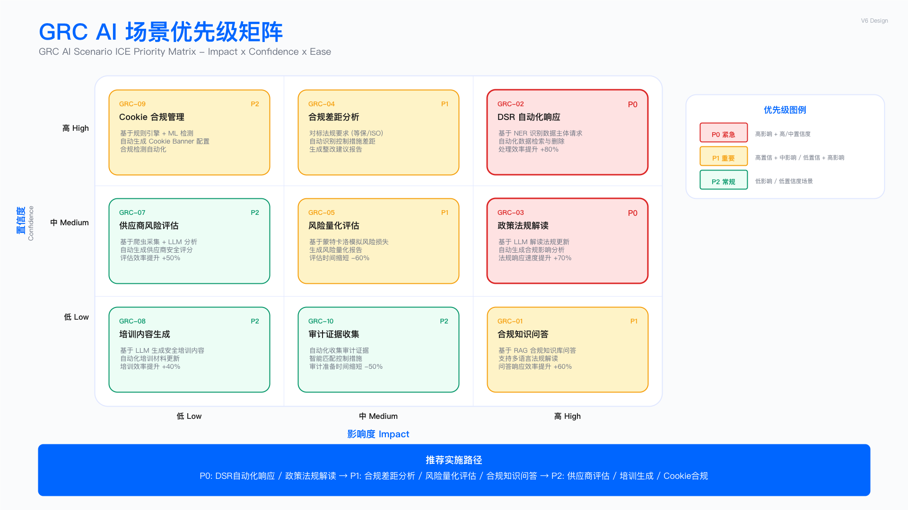

# 14.5 AI for GRC：治理风险合规智能化

> **English Title**: AI for Governance, Risk & Compliance: Intelligent GRC Transformation
> **目标读者**: GRC Manager, Compliance Officer, DPO, Risk Manager, Internal Audit

## 执行摘要 | Executive Summary

治理、风险与合规（GRC）是企业安全治理的核心支柱。面对复杂监管环境、频繁更新的法规要求、海量合规证据收集工作，传统人工 GRC 模式面临效率和一致性挑战。AI 技术可辅助法规解读、风险评估、合规检查、证据收集等环节。

本章节阐述 AI 在 GRC 中的应用，涵盖 10 大核心场景，遵循"业务需求→架构设计→工程实现→运营度量"的四层框架。

### 核心价值主张

> **说明**：以下为概念性对比，具体提升幅度因企业 GRC 成熟度、数据质量而异。

| 维度               | 传统 GRC         | AI-Powered GRC  | 价值提升方向             |
| ------------------ | ---------------- | --------------- | ------------------------ |
| **法规解读** | 外部律师数天     | AI 顾问辅助加速 | 周期缩短（仍需人工审核） |
| **DSR 处理** | 人工处理周期长   | 智能分类辅助    | 效率提升                 |
| **合规检查** | 人工抽检覆盖有限 | 自动化扩展覆盖  | 覆盖率提升               |
| **证据收集** | 分散收集周期长   | 自动汇聚加速    | 效率提升（视系统集成度） |
| **风险评估** | 季度报告         | 近实时监控      | 时效性提升               |

---

## 业务需求层 | Business Requirements Layer

### GRC 核心痛点分析

```
┌─────────────────────────────────────────────────────────────────────────────┐
│                        GRC 核心痛点与 AI 解决方案映射                         │
├─────────────────────────────────────────────────────────────────────────────┤
│                                                                             │
│  ┌─────────────────┐     ┌─────────────────┐     ┌─────────────────┐       │
│  │   法规复杂      │     │   证据分散      │     │   人力短缺      │       │
│  │ Reg Complexity  │     │  Evidence Gap   │     │  Talent Gap     │       │
│  ├─────────────────┤     ├─────────────────┤     ├─────────────────┤       │
│  │ • 多法域监管    │     │ • 系统孤岛      │     │ • GRC 专家稀缺  │       │
│  │ • 法规频繁更新  │     │ • 证据格式不一  │     │ • 咨询费用高    │       │
│  │ • 解读成本高    │     │ • 收集周期长    │     │ • 响应延迟      │       │
│  └────────┬────────┘     └────────┬────────┘     └────────┬────────┘       │
│           │                       │                       │                 │
│           ▼                       ▼                       ▼                 │
│  ┌─────────────────────────────────────────────────────────────────────┐   │
│  │                         AI 解决方案矩阵                               │   │
│  ├─────────────────────────────────────────────────────────────────────┤   │
│  │                                                                     │   │
│  │  ┌───────────────┐  ┌───────────────┐  ┌───────────────┐           │   │
│  │  │ 法规智能解读  │  │ 证据自动收集  │  │ 合规 AI 助手  │           │   │
│  │  │ RAG + 问答    │  │ 系统集成 + LLM│  │ Copilot      │           │   │
│  │  └───────────────┘  └───────────────┘  └───────────────┘           │   │
│  │                                                                     │   │
│  │  ┌───────────────┐  ┌───────────────┐  ┌───────────────┐           │   │
│  │  │ DSR 自动处理  │  │ 合规差距分析  │  │ 风险智能评估  │           │   │
│  │  │ NLP + 工作流  │  │ KG + 映射     │  │ ML + 预测     │           │   │
│  │  └───────────────┘  └───────────────┘  └───────────────┘           │   │
│  │                                                                     │   │
│  └─────────────────────────────────────────────────────────────────────┘   │
│                                                                             │
└─────────────────────────────────────────────────────────────────────────────┘
```

### 10 大 GRC AI 场景概览

基于 [AI for GRC 案例库](../ai_for_grc_cases.md)，本章节覆盖以下核心场景：

| 场景编号 | 场景名称         | 核心能力           | 业务价值           | 优先级 |
| -------- | ---------------- | ------------------ | ------------------ | ------ |
| GRC-01   | 隐私政策智能解读 | RAG + 问答         | 解读时间 3d→30min | P1     |
| GRC-02   | DSR 邮箱自动运营 | NLP 分类 + 工作流  | 响应时间 15d→3d   | P0     |
| GRC-03   | 供应商举证自动化 | 文档理解 + KG      | 评估周期缩短 70%   | P0     |
| GRC-04   | 合规差距分析     | KG + RAG           | 多框架自动映射     | P1     |
| GRC-05   | 审计证据收集     | 系统集成 + LLM     | 收集效率显著提升   | P1     |
| GRC-06   | 等保合规检查     | Checklist + 自动化 | 检查覆盖率 95%     | P1     |
| GRC-07   | 政策文档生成     | RAG + 生成         | 编写效率提升 5x    | P2     |
| GRC-08   | 合同安全条款审查 | NLP + 规则         | 审查效率提升 10x   | P2     |
| GRC-09   | Cookie 合规检查  | 爬虫 + 分析        | 自动化检测         | P2     |
| GRC-10   | 风险评估报告生成 | RAG + 模板         | 报告效率提升 5x    | P1     |

### 场景优先级矩阵（ICE 评分）

```
                        业务影响 (Impact)
                    Low          Medium         High
                ┌────────────┬────────────┬────────────┐
           High │  GRC-07    │  GRC-04    │GRC-02 GRC-03│
    实施  ──────┼────────────┼────────────┼────────────┤
    信心 Medium │  GRC-08    │GRC-05 GRC-06│  GRC-01    │
(Confidence)────┼────────────┼────────────┼────────────┤
           Low  │  GRC-09    │  GRC-10    │            │
                └────────────┴────────────┴────────────┘

推荐实施顺序：
阶段 1（0-6 月）：GRC-02 DSR 自动化 → GRC-03 供应商举证 → GRC-01 法规解读
阶段 2（6-12 月）：GRC-04 合规差距 → GRC-05 证据收集 → GRC-06 等保检查
阶段 3（12-18 月）：GRC-07 政策生成 → GRC-08 合同审查 → GRC-10 风险报告
```

---

## 架构逻辑层 | Architecture Logic Layer

### GRC AI 能力架构

```
┌─────────────────────────────────────────────────────────────────────────────┐
│                        GRC AI 能力架构                                       │
├─────────────────────────────────────────────────────────────────────────────┤
│                                                                             │
│  ┌─────────────────────────────────────────────────────────────────────┐   │
│  │                     服务接入层 (Service Layer)                        │   │
│  │  ┌─────────┐ ┌─────────┐ ┌─────────┐ ┌─────────┐ ┌─────────┐       │   │
│  │  │ 飞书Bot │ │ 邮件    │ │  Web    │ │  API    │ │ ChatOps │       │   │
│  │  │  问答   │ │  监听   │ │  Portal │ │  集成   │ │  交互   │       │   │
│  │  └─────────┘ └─────────┘ └─────────┘ └─────────┘ └─────────┘       │   │
│  └─────────────────────────────────────────────────────────────────────┘   │
│                                      │                                      │
│  ┌───────────────────────────────────┴───────────────────────────────────┐ │
│  │                     应用层 (Application Layer)                         │ │
│  │                                                                        │ │
│  │  ┌────────────────────┐  ┌────────────────────┐  ┌────────────────┐   │ │
│  │  │   合规管理引擎     │  │   隐私运营引擎     │  │  风险评估引擎  │   │ │
│  │  │  Compliance Engine │  │  Privacy Engine    │  │  Risk Engine   │   │ │
│  │  ├────────────────────┤  ├────────────────────┤  ├────────────────┤   │ │
│  │  │ • 法规解读        │  │ • DSR 自动处理     │  │ • 风险识别     │   │ │
│  │  │ • 合规差距分析    │  │ • PIA 自动化       │  │ • 风险量化     │   │ │
│  │  │ • 证据收集        │  │ • Cookie 检查      │  │ • 风险监控     │   │ │
│  │  │ • 等保检查        │  │ • 隐私政策管理     │  │ • 报告生成     │   │ │
│  │  └────────────────────┘  └────────────────────┘  └────────────────┘   │ │
│  │                                                                        │ │
│  └────────────────────────────────────────────────────────────────────────┘ │
│                                      │                                      │
│  ┌───────────────────────────────────┴───────────────────────────────────┐ │
│  │                     能力层 (Capability Layer)                          │ │
│  │                                                                        │ │
│  │  ┌──────────────┐  ┌──────────────┐  ┌──────────────┐  ┌───────────┐  │ │
│  │  │  文档理解    │  │   LLM 服务   │  │   RAG 检索   │  │ 知识图谱  │  │ │
│  │  │ Doc Analysis │  │ LLM Service  │  │ RAG Engine   │  │    KG     │  │ │
│  │  ├──────────────┤  ├──────────────┤  ├──────────────┤  ├───────────┤  │ │
│  │  │ • 合同解析   │  │ • GPT-4o     │  │ • 法规库     │  │ • 法规    │  │ │
│  │  │ • 政策理解   │  │ • Claude     │  │ • 案例库     │  │ • 控制    │  │ │
│  │  │ • 证据提取   │  │ • 私有部署   │  │ • 政策库     │  │ • 映射    │  │ │
│  │  └──────────────┘  └──────────────┘  └──────────────┘  └───────────┘  │ │
│  │                                                                        │ │
│  └────────────────────────────────────────────────────────────────────────┘ │
│                                      │                                      │
│  ┌───────────────────────────────────┴───────────────────────────────────┐ │
│  │                     基础层 (Infrastructure Layer)                      │ │
│  │                                                                        │ │
│  │  ┌──────────────────────────────────────────────────────────────────┐ │ │
│  │  │                    GRC 数据湖                                     │ │ │
│  │  │  ┌─────────┐ ┌─────────┐ ┌─────────┐ ┌─────────┐ ┌─────────┐   │ │ │
│  │  │  │  法规   │ │  政策   │ │  证据   │ │ 供应商  │ │ 风险库  │   │ │ │
│  │  │  │  库     │ │  库     │ │  库     │ │  档案   │ │         │   │ │ │
│  │  │  └─────────┘ └─────────┘ └─────────┘ └─────────┘ └─────────┘   │ │ │
│  │  └──────────────────────────────────────────────────────────────────┘ │ │
│  │                                                                        │ │
│  └────────────────────────────────────────────────────────────────────────┘ │
│                                                                             │
└─────────────────────────────────────────────────────────────────────────────┘
```



**图注**：GRC AI 场景矩阵图，展示治理、风险与合规三大领域的 10 大核心场景及其对应的 AI 技术实现方案。

---

## 工程技术层 | Engineering Technology Layer

### 核心场景技术实现

#### GRC-01: 隐私政策智能解读

**技术方案：多法规 RAG + 法律问答**

```
┌─────────────────────────────────────────────────────────────────────────────┐
│                      隐私政策智能解读系统                                    │
├─────────────────────────────────────────────────────────────────────────────┤
│                                                                             │
│  ┌─────────────────────────────────────────────────────────────────────┐   │
│  │                         知识库层                                      │   │
│  │  ┌─────────────┐ ┌─────────────┐ ┌─────────────┐ ┌─────────────┐   │   │
│  │  │ 法规原文    │ │ 监管指南    │ │ 案例判例    │ │ 内部政策    │   │   │
│  │  │ (多语言)    │ │ (官方FAQ)   │ │ (处罚案例)  │ │ (公司SOP)   │   │   │
│  │  └─────────────┘ └─────────────┘ └─────────────┘ └─────────────┘   │   │
│  │                                                                      │   │
│  │  支持法规: GDPR | CCPA/CPRA | PIPL | LGPD | POPIA | PDPA            │   │
│  │           HIPAA | PCI-DSS | SOX | 等保2.0 | 网络安全法               │   │
│  └─────────────────────────────────────────────────────────────────────┘   │
│                                      │                                      │
│  ┌───────────────────────────────────┴───────────────────────────────────┐ │
│  │                      RAG 检索增强层                                     │ │
│  │                                                                        │ │
│  │  ┌──────────────┐  ┌──────────────┐  ┌──────────────┐                │ │
│  │  │  语义检索    │  │  关键词检索  │  │  知识图谱    │                │ │
│  │  │ 向量相似度   │  │   BM25       │  │  条款关联    │                │ │
│  │  └──────────────┘  └──────────────┘  └──────────────┘                │ │
│  │                                                                        │ │
│  │  检索策略: Hybrid Search (语义 0.7 + 关键词 0.3)                       │ │
│  └────────────────────────────────────────────────────────────────────────┘ │
│                                      │                                      │
│  ┌───────────────────────────────────┴───────────────────────────────────┐ │
│  │                      LLM 解读生成层                                     │ │
│  │                                                                        │ │
│  │  ┌──────────────────────────────────────────────────────────────────┐ │ │
│  │  │  System Prompt (法律顾问角色):                                    │ │ │
│  │  │  • 基于检索内容准确回答                                           │ │ │
│  │  │  • 明确引用法规条款                                               │ │ │
│  │  │  • 区分合规要求与最佳实践                                         │ │ │
│  │  │  • 提供实操建议                                                   │ │ │
│  │  └──────────────────────────────────────────────────────────────────┘ │ │
│  │                                                                        │ │
│  └────────────────────────────────────────────────────────────────────────┘ │
│                                      │                                      │
│         ┌────────────────────────────┼────────────────────────────┐         │
│         ▼                            ▼                            ▼         │
│  ┌─────────────┐            ┌─────────────┐            ┌─────────────┐     │
│  │  飞书 Bot   │            │  Slack Bot  │            │  Web Portal │     │
│  └─────────────┘            └─────────────┘            └─────────────┘     │
│                                                                             │
└─────────────────────────────────────────────────────────────────────────────┘
```

#### GRC-02: DSR 邮箱自动运营

**技术方案：邮件分类 + 自动化工作流**

```
┌─────────────────────────────────────────────────────────────────────────────┐
│                      DSR 智能运营系统                                        │
├─────────────────────────────────────────────────────────────────────────────┤
│                                                                             │
│  ┌─────────────────────────────────────────────────────────────────────┐   │
│  │                         邮件接收与解析                                │   │
│  │  ┌───────────────────────────────────────────────────────────────┐  │   │
│  │  │  专用邮箱监听: privacy@company.com                             │  │   │
│  │  │  • 邮件元数据提取 (发件人、主题、时间)                        │  │   │
│  │  │  • 正文内容解析 (多语言)                                      │  │   │
│  │  │  • 附件处理 (身份证明文件 OCR)                                │  │   │
│  │  └───────────────────────────────────────────────────────────────┘  │   │
│  └─────────────────────────────────────────────────────────────────────┘   │
│                                      │                                      │
│  ┌───────────────────────────────────┴───────────────────────────────────┐ │
│  │                      智能分类层 (ML + LLM)                              │ │
│  │                                                                        │ │
│  │  ┌──────────────────────────────────────────────────────────────────┐ │ │
│  │  │  分类维度:                                                        │ │ │
│  │  │  ┌────────────────┐  ┌────────────────┐  ┌────────────────┐     │ │ │
│  │  │  │ 请求类型       │  │ 管辖权         │  │ 紧急程度       │     │ │ │
│  │  │  │ • ACCESS       │  │ • GDPR (EU)    │  │ • 高 (法院)    │     │ │ │
│  │  │  │ • ERASURE      │  │ • CCPA (CA)    │  │ • 中 (标准)    │     │ │ │
│  │  │  │ • RECTIFICATION│  │ • PIPL (CN)    │  │ • 低 (询问)    │     │ │ │
│  │  │  │ • PORTABILITY  │  │ • LGPD (BR)    │  │                │     │ │ │
│  │  │  │ • OBJECTION    │  │                │  │                │     │ │ │
│  │  │  └────────────────┘  └────────────────┘  └────────────────┘     │ │ │
│  │  └──────────────────────────────────────────────────────────────────┘ │ │
│  │                                                                        │ │
│  │  分类准确率: 目标值（示例）| 人工复核率: 根据风险设定                   │ │
│  └────────────────────────────────────────────────────────────────────────┘ │
│                                      │                                      │
│  ┌───────────────────────────────────┴───────────────────────────────────┐ │
│  │                      自动化工作流                                       │ │
│  │                                                                        │ │
│  │  ┌────────┐   ┌────────┐   ┌────────┐   ┌────────┐   ┌────────┐      │ │
│  │  │ 身份   │──▶│ 数据   │──▶│ 数据   │──▶│ 响应   │──▶│ 归档   │      │ │
│  │  │ 验证   │   │ 查询   │   │ 操作   │   │ 生成   │   │ 审计   │      │ │
│  │  └────────┘   └────────┘   └────────┘   └────────┘   └────────┘      │ │
│  │                                                                        │ │
│  │  ┌──────────────────────────────────────────────────────────────────┐ │ │
│  │  │  人机协作节点:                                                    │ │ │
│  │  │  • 高风险请求 → 强制人工审核                                     │ │ │
│  │  │  • 身份验证失败 → 额外验证流程                                   │ │ │
│  │  │  • 复杂请求 → 升级至 DPO                                         │ │ │
│  │  └──────────────────────────────────────────────────────────────────┘ │ │
│  │                                                                        │ │
│  └────────────────────────────────────────────────────────────────────────┘ │
│                                                                             │
└─────────────────────────────────────────────────────────────────────────────┘
```

**示例代码**：

```python
"""
DSR 智能处理系统 - 核心接口定义
"""

from dataclasses import dataclass
from enum import Enum
from typing import List, Optional
from datetime import datetime, timedelta

class DSRType(Enum):
    ACCESS = "access"           # 数据访问权
    ERASURE = "erasure"         # 删除权
    RECTIFICATION = "rectification"  # 更正权
    PORTABILITY = "portability"      # 可携权
    OBJECTION = "objection"          # 反对权

class Jurisdiction(Enum):
    GDPR = "gdpr"    # 欧盟
    CCPA = "ccpa"    # 加州
    PIPL = "pipl"    # 中国
    LGPD = "lgpd"    # 巴西

@dataclass
class DSRCase:
    """DSR 案例"""
    case_id: str
    email: str
    request_type: DSRType
    jurisdiction: Jurisdiction
    deadline: datetime
    priority: str
    status: str
    data_subject: Optional[str] = None
    verification_status: str = "pending"

class DSRProcessor:
    """DSR 智能处理系统"""

    def __init__(self):
        self.classifier = DSRClassifier()
        self.verifier = IdentityVerifier()
        self.data_ops = MultiSystemDataOperator()
        self.response_gen = DSRResponseGenerator()

    async def process(self, email: IncomingEmail) -> DSRCase:
        """处理 DSR 请求"""

        # 1. 智能分类
        classification = await self.classifier.classify(email)

        # 2. 创建案例
        case = DSRCase(
            case_id=self.generate_case_id(),
            email=email.sender,
            request_type=classification.type,
            jurisdiction=classification.jurisdiction,
            deadline=self.calculate_deadline(classification),
            priority=classification.priority,
            status="received"
        )

        # 3. 身份验证
        verification = await self.verifier.verify(email)
        if not verification.passed:
            return await self.request_additional_verification(case)

        case.verification_status = "verified"
        case.data_subject = verification.data_subject_id

        # 4. 根据类型处理
        handlers = {
            DSRType.ACCESS: self.handle_access,
            DSRType.ERASURE: self.handle_erasure,
            DSRType.RECTIFICATION: self.handle_rectification,
            DSRType.PORTABILITY: self.handle_portability,
            DSRType.OBJECTION: self.handle_objection
        }

        return await handlers[classification.type](case)

    def calculate_deadline(self, classification) -> datetime:
        """根据管辖权计算截止日期"""
        deadlines = {
            Jurisdiction.GDPR: 30,   # 30 天
            Jurisdiction.CCPA: 45,   # 45 天
            Jurisdiction.PIPL: 30,   # 30 天
            Jurisdiction.LGPD: 15,   # 15 天
        }
        days = deadlines.get(classification.jurisdiction, 30)
        return datetime.now() + timedelta(days=days)
```

#### GRC-03: 供应商安全评估自动化

**技术方案：文档理解 + 知识图谱 + 证据核验**

```
┌─────────────────────────────────────────────────────────────────────────────┐
│                      供应商安全评估自动化系统                                │
├─────────────────────────────────────────────────────────────────────────────┤
│                                                                             │
│  ┌─────────────────────────────────────────────────────────────────────┐   │
│  │                         证据收集层                                    │   │
│  │  ┌─────────────┐ ┌─────────────┐ ┌─────────────┐ ┌─────────────┐   │   │
│  │  │ SOC 2 报告  │ │ ISO 27001   │ │ 渗透测试    │ │ 安全问卷    │   │   │
│  │  │  Type II    │ │  证书       │ │  报告       │ │  回复       │   │   │
│  │  └─────────────┘ └─────────────┘ └─────────────┘ └─────────────┘   │   │
│  └─────────────────────────────────────────────────────────────────────┘   │
│                                      │                                      │
│  ┌───────────────────────────────────┴───────────────────────────────────┐ │
│  │                      文档理解层 (LLM)                                   │ │
│  │                                                                        │ │
│  │  ┌──────────────────────────────────────────────────────────────────┐ │ │
│  │  │  证据提取:                                                        │ │ │
│  │  │  • 控制措施识别 (SOC 2 控制点)                                   │ │ │
│  │  │  • 认证范围解析 (ISO 证书覆盖范围)                               │ │ │
│  │  │  • 漏洞发现提取 (渗透测试结论)                                   │ │ │
│  │  │  • 问卷答案结构化                                                │ │ │
│  │  └──────────────────────────────────────────────────────────────────┘ │ │
│  │                                                                        │ │
│  └────────────────────────────────────────────────────────────────────────┘ │
│                                      │                                      │
│  ┌───────────────────────────────────┴───────────────────────────────────┐ │
│  │                      风险评估层                                         │ │
│  │                                                                        │ │
│  │  ┌──────────────────────────────────────────────────────────────────┐ │ │
│  │  │  评估维度:                                                        │ │ │
│  │  │  ┌────────────┐ ┌────────────┐ ┌────────────┐ ┌────────────┐    │ │ │
│  │  │  │ 数据安全   │ │ 访问控制   │ │ 加密措施   │ │ 事件响应   │    │ │ │
│  │  │  │ 40%        │ │ 20%        │ │ 20%        │ │ 20%        │    │ │ │
│  │  │  └────────────┘ └────────────┘ └────────────┘ └────────────┘    │ │ │
│  │  │                                                                  │ │ │
│  │  │  风险等级: Critical | High | Medium | Low | Minimal              │ │ │
│  │  └──────────────────────────────────────────────────────────────────┘ │ │
│  │                                                                        │ │
│  └────────────────────────────────────────────────────────────────────────┘ │
│                                      │                                      │
│  ┌───────────────────────────────────┴───────────────────────────────────┐ │
│  │                      输出层                                             │ │
│  │                                                                        │ │
│  │  ┌──────────────┐  ┌──────────────┐  ┌──────────────┐                │ │
│  │  │  风险评估    │  │  差距清单    │  │  整改建议    │                │ │
│  │  │   报告       │  │   生成       │  │   跟踪       │                │ │
│  │  └──────────────┘  └──────────────┘  └──────────────┘                │ │
│  │                                                                        │ │
│  └────────────────────────────────────────────────────────────────────────┘ │
│                                                                             │
└─────────────────────────────────────────────────────────────────────────────┘
```

#### GRC-04: 合规差距分析

**技术方案：多框架映射 + 知识图谱**

```
┌─────────────────────────────────────────────────────────────────────────────┐
│                      合规差距分析系统                                        │
├─────────────────────────────────────────────────────────────────────────────┤
│                                                                             │
│  ┌─────────────────────────────────────────────────────────────────────┐   │
│  │                         合规框架知识图谱                              │   │
│  │                                                                      │   │
│  │     ┌─────────────────────────────────────────────────────────┐     │   │
│  │     │                    Control Mapping                       │     │   │
│  │     │                                                          │     │   │
│  │     │   ISO 27001 ◀───────▶ NIST CSF ◀───────▶ SOC 2           │     │   │
│  │     │       ▲                   ▲                  ▲            │     │   │
│  │     │       │                   │                  │            │     │   │
│  │     │       ▼                   ▼                  ▼            │     │   │
│  │     │    等保2.0 ◀───────▶  PCI-DSS  ◀───────▶ GDPR            │     │   │
│  │     │                                                          │     │   │
│  │     └─────────────────────────────────────────────────────────┘     │   │
│  │                                                                      │   │
│  └─────────────────────────────────────────────────────────────────────┘   │
│                                      │                                      │
│  ┌───────────────────────────────────┴───────────────────────────────────┐ │
│  │                      自动映射引擎                                       │ │
│  │                                                                        │ │
│  │  ┌──────────────────────────────────────────────────────────────────┐ │ │
│  │  │  输入: 现有控制措施清单                                           │ │ │
│  │  │  输出: 多框架合规覆盖率 + 差距清单                                │ │ │
│  │  │                                                                  │ │ │
│  │  │  示例:                                                           │ │ │
│  │  │  ┌─────────────────────────────────────────────────────────────┐│ │ │
│  │  │  │ 控制: MFA 多因素认证                                        ││ │ │
│  │  │  │ 覆盖:                                                       ││ │ │
│  │  │  │   ✓ ISO 27001 A.9.4.2 安全登录程序                         ││ │ │
│  │  │  │   ✓ NIST CSF PR.AC-7 认证机制                              ││ │ │
│  │  │  │   ✓ SOC 2 CC6.1 逻辑访问控制                               ││ │ │
│  │  │  │   ✓ PCI-DSS 8.3 多因素认证                                 ││ │ │
│  │  │  │   ✓ 等保2.0 8.1.3.1 身份鉴别                               ││ │ │
│  │  │  └─────────────────────────────────────────────────────────────┘│ │ │
│  │  └──────────────────────────────────────────────────────────────────┘ │ │
│  │                                                                        │ │
│  └────────────────────────────────────────────────────────────────────────┘ │
│                                      │                                      │
│  ┌───────────────────────────────────┴───────────────────────────────────┐ │
│  │                      差距分析报告                                       │ │
│  │                                                                        │ │
│  │  ┌──────────────────────────────────────────────────────────────────┐ │ │
│  │  │  框架      | 覆盖率 | 差距数 | 关键差距                          │ │ │
│  │  │  ─────────────────────────────────────────────────────────────  │ │ │
│  │  │  ISO 27001 | 85%    | 12     | A.12.4 日志与监控                 │ │ │
│  │  │  NIST CSF  | 78%    | 18     | DE.CM 安全持续监控                │ │ │
│  │  │  SOC 2     | 92%    | 5      | CC7.2 系统操作                    │ │ │
│  │  │  PCI-DSS   | 88%    | 8      | Req 11 渗透测试                   │ │ │
│  │  └──────────────────────────────────────────────────────────────────┘ │ │
│  │                                                                        │ │
│  └────────────────────────────────────────────────────────────────────────┘ │
│                                                                             │
└─────────────────────────────────────────────────────────────────────────────┘
```

### 技术选型矩阵

| 场景              | LLM           | RAG       | NLP/ML   | 知识图谱   | 实时性 |
| ----------------- | ------------- | --------- | -------- | ---------- | ------ |
| GRC-01 法规解读   | GPT-4o/Claude | 法规库    | -        | 条款关联   | 秒级   |
| GRC-02 DSR 处理   | GPT-4o        | 模板库    | 分类器   | -          | 分钟级 |
| GRC-03 供应商评估 | GPT-4o/Claude | 评估标准  | 文档解析 | 供应商档案 | 小时级 |
| GRC-04 差距分析   | 可选          | 控制库    | -        | 框架映射   | 分钟级 |
| GRC-05 证据收集   | GPT-4o        | 证据模板  | -        | -          | 小时级 |
| GRC-06 等保检查   | 可选          | Checklist | 自动化   | -          | 分钟级 |
| GRC-10 风险报告   | GPT-4o/Claude | 报告模板  | -        | -          | 分钟级 |

---

## 运营服务层 | Operations Service Layer

### 服务等级协议 (SLA)

| 服务能力     | 可用性 | 响应延迟                | 处理能力 |
| ------------ | ------ | ----------------------- | -------- |
| 法规问答 API | 99.5%  | P50 < 5s, P99 < 20s     | 100 TPS  |
| DSR 分类 API | 99.9%  | P50 < 2s, P99 < 10s     | 50 TPS   |
| 供应商评估   | 99%    | P50 < 5min, P99 < 30min | 10/hour  |
| 差距分析     | 99%    | P50 < 1min, P99 < 5min  | 20/hour  |

### 运营指标体系

> **说明**：以下目标值为示例，需根据企业 GRC 成熟度基线设定。

| 指标类型 | 指标名称       | 目标值（示例）       | 测量方法 |
| -------- | -------------- | -------------------- | -------- |
| 效能     | DSR SLA 达标率 | 目标 > 95%           | 系统监控 |
| 效能     | 供应商评估周期 | 较基线缩短           | 流程跟踪 |
| 质量     | 法规解读准确率 | 目标值需法务审核确定 | 法务审核 |
| 质量     | DSR 分类准确率 | 目标值需人工抽检验证 | 人工抽检 |
| 成本     | 外部法律咨询费 | 较基线降低           | 财务统计 |
| 成本     | GRC 人力投入   | 较基线降低           | 工时统计 |

---

## 与其他章节的关联

| 关联章节                                                                                      | 关联内容     | 协同价值                       |
| --------------------------------------------------------------------------------------------- | ------------ | ------------------------------ |
| [14.2 AI 安全中台](./14.2_ai_security_platform_architecture.md)                                  | 基础平台能力 | GRC 能力依赖中台 RAG、LLM 服务 |
| [14.6 AI for DataSec](./14.6_ai_for_datasec.md)                                                  | 数据安全集成 | DSR 处理与数据分类分级联动     |
| [Ch 2 GRC](../../part_01_foundation_strategic_governance/chapter_02_governance_risk_compliance/) | GRC 框架     | AI 能力嵌入现有 GRC 流程       |
| [Ch 9 隐私合规](../../part_03_data_security_privacy/chapter_09_privacy_compliance/)              | 隐私管理     | DSR 处理与隐私合规联动         |

---

## 导航

**[← 上一节：14.4 AI for AppSec](./14.4_ai_for_appsec.md)** | **[返回章节目录](./README.md)** | **[下一节：14.6 AI for DataSec →](./14.6_ai_for_datasec.md)**

---

**© 2025 AI-ESA Project. Licensed under CC BY-NC-SA 4.0**
