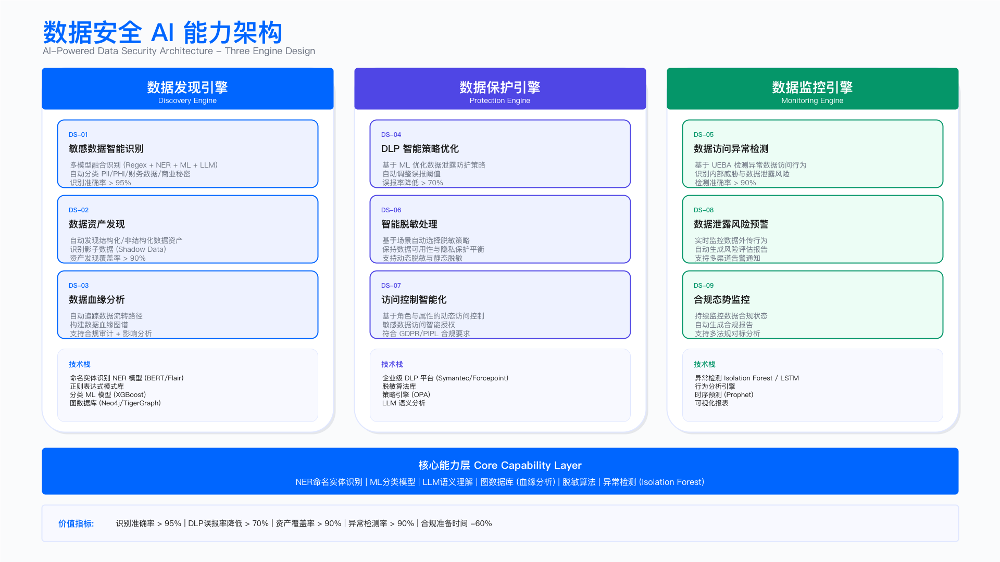

# 14.6 AI for DataSec：数据安全智能化

> **English Title**: AI for Data Security: Intelligent Data Protection
> **目标读者**: Data Security Manager, DLP Engineer, Data Governance, Privacy Engineer

## 执行摘要 | Executive Summary

数据安全是企业资产保护的核心防线。面对海量数据资产、复杂数据流转、日益严格的监管要求，传统人工数据安全管理模式面临规模和效率挑战。AI 技术可辅助数据发现、分类分级、访问监控、泄露防护等环节，提升数据资产管理能力。

本章节阐述 AI 在数据安全中的应用，涵盖 8 大核心场景，遵循"业务需求→架构设计→工程实现→运营度量"的四层框架。

### 核心价值主张

> **说明**：以下为概念性对比，具体提升幅度因数据规模、质量、工具成熟度而异。

| 维度                 | 传统方式         | AI-Powered   | 价值提升方向 |
| -------------------- | ---------------- | ------------ | ------------ |
| **数据分类**   | 人工处理效率有限 | 智能批量处理 | 效率提升     |
| **敏感发现**   | 定期盘点覆盖有限 | 实时发现扩展 | 覆盖率提升   |
| **DLP 误报**   | 误报率较高       | AI 过滤降低  | 精度提升     |
| **异常检测**   | 规则覆盖有限     | 行为分析扩展 | 覆盖率提升   |
| **分类一致性** | 人工一致性有限   | AI 标准化    | 一致性提升   |

---

## 业务需求层 | Business Requirements Layer

### 数据安全核心痛点分析

```
┌─────────────────────────────────────────────────────────────────────────────┐
│                      数据安全核心痛点与 AI 解决方案映射                       │
├─────────────────────────────────────────────────────────────────────────────┤
│                                                                             │
│  ┌─────────────────┐     ┌─────────────────┐     ┌─────────────────┐       │
│  │   数据不可见    │     │   保护不精准    │     │   响应不及时    │       │
│  │ Data Blindness  │     │ Protection Gap  │     │  Response Lag   │       │
│  ├─────────────────┤     ├─────────────────┤     ├─────────────────┤       │
│  │ • 敏感数据位置  │     │ • DLP 误报多    │     │ • 泄露发现滞后  │       │
│  │   不清楚        │     │ • 规则难维护    │     │ • 异常检测慢    │       │
│  │ • 分类不一致    │     │ • 覆盖不全面    │     │ • 响应周期长    │       │
│  └────────┬────────┘     └────────┬────────┘     └────────┬────────┘       │
│           │                       │                       │                 │
│           ▼                       ▼                       ▼                 │
│  ┌─────────────────────────────────────────────────────────────────────┐   │
│  │                         AI 解决方案矩阵                               │   │
│  ├─────────────────────────────────────────────────────────────────────┤   │
│  │                                                                     │   │
│  │  ┌───────────────┐  ┌───────────────┐  ┌───────────────┐           │   │
│  │  │ 智能数据发现  │  │ DLP 告警降噪  │  │ 访问异常检测  │           │   │
│  │  │ NER + ML      │  │ ML + LLM      │  │ UEBA + ML     │           │   │
│  │  └───────────────┘  └───────────────┘  └───────────────┘           │   │
│  │                                                                     │   │
│  │  ┌───────────────┐  ┌───────────────┐  ┌───────────────┐           │   │
│  │  │ 分类分级打标  │  │ 数据血缘分析  │  │ 跨境合规分析  │           │   │
│  │  │ 多策略融合    │  │ 图分析 + LLM  │  │ KG + RAG      │           │   │
│  │  └───────────────┘  └───────────────┘  └───────────────┘           │   │
│  │                                                                     │   │
│  └─────────────────────────────────────────────────────────────────────┘   │
│                                                                             │
└─────────────────────────────────────────────────────────────────────────────┘
```

### 8 大数据安全 AI 场景概览

基于 [AI for 数据安全案例库](../ai_for_data_security_cases.md)，本章节覆盖以下核心场景：

| 场景编号 | 场景名称         | 核心能力        | 业务价值         | 优先级 |
| -------- | ---------------- | --------------- | ---------------- | ------ |
| DS-01    | 数据分类分级打标 | NLP + ML 分类器 | 效率提升 100x    | P0     |
| DS-02    | 敏感数据自动发现 | 正则 + NER + ML | 覆盖率 40%→95%  | P0     |
| DS-03    | 数据血缘分析     | 图分析 + LLM    | 数据流向可视化   | P1     |
| DS-04    | DLP 告警分析     | ML + LLM        | 误报率 60%→15%  | P1     |
| DS-05    | 数据访问异常检测 | UEBA + ML       | 异常检测覆盖 90% | P1     |
| DS-06    | 数据脱敏策略生成 | 规则引擎 + LLM  | 策略生成自动化   | P2     |
| DS-07    | 跨境数据合规分析 | 知识图谱 + RAG  | 合规路径自动推荐 | P1     |
| DS-08    | 数据泄露检测     | 爬虫 + ML       | 外部泄露早期发现 | P2     |

### 场景优先级矩阵

```
                        业务影响 (Impact)
                    Low          Medium         High
                ┌────────────┬────────────┬────────────┐
           High │  DS-06     │  DS-03     │DS-01 DS-02 │
    实施  ──────┼────────────┼────────────┼────────────┤
    信心 Medium │  DS-08     │  DS-05     │DS-04 DS-07 │
(Confidence)────┼────────────┼────────────┼────────────┤
           Low  │            │            │            │
                └────────────┴────────────┴────────────┘

推荐实施顺序：
阶段 1（0-6 月）：DS-01 分类分级 → DS-02 敏感发现 → DS-04 DLP 降噪
阶段 2（6-12 月）：DS-03 数据血缘 → DS-05 异常检测 → DS-07 跨境合规
阶段 3（12-18 月）：DS-06 脱敏策略 → DS-08 泄露检测
```

---

## 架构逻辑层 | Architecture Logic Layer

### 数据安全 AI 能力架构

```
┌─────────────────────────────────────────────────────────────────────────────┐
│                        数据安全 AI 能力架构                                  │
├─────────────────────────────────────────────────────────────────────────────┤
│                                                                             │
│  ┌─────────────────────────────────────────────────────────────────────┐   │
│  │                     服务接入层 (Service Layer)                        │   │
│  │  ┌─────────┐ ┌─────────┐ ┌─────────┐ ┌─────────┐ ┌─────────┐       │   │
│  │  │ 数据目录│ │  DLP    │ │  CASB   │ │ 数据湖  │ │ 审计    │       │   │
│  │  │  集成   │ │  集成   │ │  集成   │ │  集成   │ │ 日志    │       │   │
│  │  └─────────┘ └─────────┘ └─────────┘ └─────────┘ └─────────┘       │   │
│  └─────────────────────────────────────────────────────────────────────┘   │
│                                      │                                      │
│  ┌───────────────────────────────────┴───────────────────────────────────┐ │
│  │                     应用层 (Application Layer)                         │ │
│  │                                                                        │ │
│  │  ┌────────────────────┐  ┌────────────────────┐  ┌────────────────┐   │ │
│  │  │   数据发现引擎     │  │   数据保护引擎     │  │  监控分析引擎  │   │ │
│  │  │  Discovery Engine  │  │  Protection Engine │  │ Monitor Engine │   │ │
│  │  ├────────────────────┤  ├────────────────────┤  ├────────────────┤   │ │
│  │  │ • 分类分级        │  │ • DLP 告警分析     │  │ • 访问异常     │   │ │
│  │  │ • 敏感数据发现    │  │ • 脱敏策略生成     │  │ • 行为分析     │   │ │
│  │  │ • 数据血缘        │  │ • 跨境合规         │  │ • 泄露检测     │   │ │
│  │  └────────────────────┘  └────────────────────┘  └────────────────┘   │ │
│  │                                                                        │ │
│  └────────────────────────────────────────────────────────────────────────┘ │
│                                      │                                      │
│  ┌───────────────────────────────────┴───────────────────────────────────┐ │
│  │                     能力层 (Capability Layer)                          │ │
│  │                                                                        │ │
│  │  ┌──────────────┐  ┌──────────────┐  ┌──────────────┐  ┌───────────┐  │ │
│  │  │   NER 识别   │  │   ML 分类    │  │   LLM 理解   │  │ 图分析    │  │ │
│  │  │ Named Entity │  │ ML Classify  │  │ LLM Analysis │  │  Graph    │  │ │
│  │  ├──────────────┤  ├──────────────┤  ├──────────────┤  ├───────────┤  │ │
│  │  │ • 姓名识别   │  │ • XGBoost    │  │ • GPT-4o     │  │ • 血缘图  │  │ │
│  │  │ • 地址识别   │  │ • BERT       │  │ • Claude     │  │ • 访问图  │  │ │
│  │  │ • 实体识别   │  │ • 语义分类   │  │ • 上下文     │  │ • 风险图  │  │ │
│  │  └──────────────┘  └──────────────┘  └──────────────┘  └───────────┘  │ │
│  │                                                                        │ │
│  └────────────────────────────────────────────────────────────────────────┘ │
│                                      │                                      │
│  ┌───────────────────────────────────┴───────────────────────────────────┐ │
│  │                     基础层 (Infrastructure Layer)                      │ │
│  │                                                                        │ │
│  │  ┌──────────────────────────────────────────────────────────────────┐ │ │
│  │  │                    数据安全数据湖                                  │ │ │
│  │  │  ┌─────────┐ ┌─────────┐ ┌─────────┐ ┌─────────┐ ┌─────────┐   │ │ │
│  │  │  │ 元数据  │ │ 分类标签│ │ 访问日志│ │ DLP 事件 │ │ 血缘关系│   │ │ │
│  │  │  │Metadata │ │  Tags   │ │ Access  │ │  DLP    │ │ Lineage │   │ │ │
│  │  │  └─────────┘ └─────────┘ └─────────┘ └─────────┘ └─────────┘   │ │ │
│  │  └──────────────────────────────────────────────────────────────────┘ │ │
│  │                                                                        │ │
│  └────────────────────────────────────────────────────────────────────────┘ │
│                                                                             │
└─────────────────────────────────────────────────────────────────────────────┘
```



**图注**：数据安全 AI 能力架构图，展示从数据发现、数据保护到监控分析的三大引擎及其底层能力支撑。

---

## 工程技术层 | Engineering Technology Layer

### 核心场景技术实现

#### DS-01: 数据分类分级智能打标

**技术方案：多策略融合分类引擎**

```
┌─────────────────────────────────────────────────────────────────────────────┐
│                      数据分类分级自动化系统                                  │
├─────────────────────────────────────────────────────────────────────────────┤
│                                                                             │
│  ┌─────────────────────────────────────────────────────────────────────┐   │
│  │                         数据源接入                                    │   │
│  │  ┌─────────┐ ┌─────────┐ ┌─────────┐ ┌─────────┐ ┌─────────┐       │   │
│  │  │ MySQL   │ │ Hive    │ │  S3     │ │ MongoDB │ │ Kafka   │       │   │
│  │  │ PostgreS│ │ClickHous│ │  OSS    │ │   ES    │ │ MQ      │       │   │
│  │  └────┬────┘ └────┬────┘ └────┬────┘ └────┬────┘ └────┬────┘       │   │
│  │       └───────────┴───────────┼───────────┴───────────┘             │   │
│  │                               ▼                                      │   │
│  │  ┌─────────────────────────────────────────────────────────────┐    │   │
│  │  │  元数据采集: Schema + 字段名 + 注释 + 数据样本 + 统计信息    │    │   │
│  │  └─────────────────────────────────────────────────────────────┘    │   │
│  └─────────────────────────────────────────────────────────────────────┘   │
│                                      │                                      │
│  ┌───────────────────────────────────┴───────────────────────────────────┐ │
│  │                      多策略分类引擎                                     │ │
│  │                                                                        │ │
│  │  ┌──────────────────────────────────────────────────────────────────┐ │ │
│  │  │  策略 1: 正则匹配 (高精度)                                        │ │ │
│  │  │  ┌────────────────────────────────────────────────────────────┐ │ │ │
│  │  │  │  • 身份证: ^\d{17}[\dXx]$                                   │ │ │ │
│  │  │  │  • 手机号: ^1[3-9]\d{9}$                                    │ │ │ │
│  │  │  │  • 银行卡: ^\d{16,19}$                                      │ │ │ │
│  │  │  │  • 邮箱:   ^[\w.-]+@[\w.-]+\.\w+$                           │ │ │ │
│  │  │  │  置信度: 0.95                                               │ │ │ │
│  │  │  └────────────────────────────────────────────────────────────┘ │ │ │
│  │  └──────────────────────────────────────────────────────────────────┘ │ │
│  │                                                                        │ │
│  │  ┌──────────────────────────────────────────────────────────────────┐ │ │
│  │  │  策略 2: NER 实体识别 (姓名/地址)                                 │ │ │
│  │  │  ┌────────────────────────────────────────────────────────────┐ │ │ │
│  │  │  │  模型: BERT-NER / 自训练模型                                │ │ │ │
│  │  │  │  实体: PERSON | LOCATION | ORGANIZATION                     │ │ │ │
│  │  │  │  置信度: 0.85                                               │ │ │ │
│  │  │  └────────────────────────────────────────────────────────────┘ │ │ │
│  │  └──────────────────────────────────────────────────────────────────┘ │ │
│  │                                                                        │ │
│  │  ┌──────────────────────────────────────────────────────────────────┐ │ │
│  │  │  策略 3: ML 语义分类 (字段名)                                     │ │ │
│  │  │  ┌────────────────────────────────────────────────────────────┐ │ │ │
│  │  │  │  特征: 字段名 + 表名 + 注释 + 数据类型                      │ │ │ │
│  │  │  │  模型: XGBoost / BERT Classifier                            │ │ │ │
│  │  │  │  置信度: 0.75                                               │ │ │ │
│  │  │  └────────────────────────────────────────────────────────────┘ │ │ │
│  │  └──────────────────────────────────────────────────────────────────┘ │ │
│  │                                                                        │ │
│  │  ┌──────────────────────────────────────────────────────────────────┐ │ │
│  │  │  策略 4: LLM 深度理解 (复杂场景)                                  │ │ │
│  │  │  ┌────────────────────────────────────────────────────────────┐ │ │ │
│  │  │  │  触发: 低置信度场景 (<0.7) 或 复杂字段                      │ │ │ │
│  │  │  │  输入: 字段 + 样本 + 表上下文                               │ │ │ │
│  │  │  │  置信度: 0.80                                               │ │ │ │
│  │  │  └────────────────────────────────────────────────────────────┘ │ │ │
│  │  └──────────────────────────────────────────────────────────────────┘ │ │
│  │                                                                        │ │
│  └────────────────────────────────────────────────────────────────────────┘ │
│                                      │                                      │
│  ┌───────────────────────────────────┴───────────────────────────────────┐ │
│  │                      结果融合与输出                                     │ │
│  │                                                                        │ │
│  │  ┌──────────────────────────────────────────────────────────────────┐ │ │
│  │  │  融合策略: 加权投票                                               │ │ │
│  │  │  权重: REGEX(0.95) > NER(0.85) > LLM(0.80) > ML(0.75)            │ │ │
│  │  │                                                                  │ │ │
│  │  │  输出:                                                           │ │ │
│  │  │  • 分类类型 (ID_CARD/PHONE/EMAIL/NAME/...)                       │ │ │
│  │  │  • 敏感等级 (L1/L2/L3/L4)                                        │ │ │
│  │  │  • 置信度 (0-1)                                                  │ │ │
│  │  │  • 是否需要人工复核 (confidence < 0.8)                           │ │ │
│  │  └──────────────────────────────────────────────────────────────────┘ │ │
│  │                                                                        │ │
│  └────────────────────────────────────────────────────────────────────────┘ │
│                                                                             │
└─────────────────────────────────────────────────────────────────────────────┘
```

**敏感数据分类体系**：

| 分类     | 类型代码   | 示例                | 敏感等级 |
| -------- | ---------- | ------------------- | -------- |
| 身份证号 | ID_CARD    | 110101199001011234  | L1 绝密  |
| 银行卡号 | BANK_CARD  | 6222021234567890123 | L1 绝密  |
| 手机号   | PHONE      | 13812345678         | L2 机密  |
| 邮箱     | EMAIL      | user@example.com    | L3 内部  |
| 姓名     | NAME       | 张三                | L2 机密  |
| 地址     | ADDRESS    | 北京市朝阳区...     | L2 机密  |
| 健康信息 | HEALTH     | 血型、病历          | L1 绝密  |
| 财务信息 | FINANCIAL  | 工资、账单          | L2 机密  |
| 密码凭据 | CREDENTIAL | password、token     | L1 绝密  |

**关键代码实现**：

```python
"""
数据分类分级引擎 - 多策略融合
"""

from dataclasses import dataclass
from typing import List, Dict
from enum import Enum

class SensitivityLevel(Enum):
    L1_SECRET = "L1"      # 绝密
    L2_CONFIDENTIAL = "L2" # 机密
    L3_INTERNAL = "L3"     # 内部
    L4_PUBLIC = "L4"       # 公开

@dataclass
class ClassificationResult:
    """分类结果"""
    field_name: str
    data_type: str              # ID_CARD, PHONE, EMAIL, etc.
    sensitivity_level: SensitivityLevel
    confidence: float           # 0-1
    sources: List[str]          # REGEX, NER, ML, LLM
    needs_review: bool

class DataClassificationEngine:
    """数据分类分级引擎"""

    def __init__(self):
        self.regex_classifier = RegexClassifier()
        self.ner_classifier = NERClassifier()
        self.ml_classifier = MLClassifier()
        self.llm_classifier = LLMClassifier()

    async def classify_field(
        self,
        field: FieldMetadata,
        samples: List[str]
    ) -> ClassificationResult:
        """对字段进行分类"""

        results = []

        # 策略 1: 正则匹配
        regex_result = self.regex_classifier.classify(samples)
        if regex_result.matched:
            results.append({
                "source": "REGEX",
                "type": regex_result.type,
                "confidence": 0.95
            })

        # 策略 2: NER 实体识别
        ner_result = await self.ner_classifier.classify(samples)
        if ner_result.entities:
            results.append({
                "source": "NER",
                "type": ner_result.dominant_type,
                "confidence": ner_result.confidence
            })

        # 策略 3: ML 语义分类
        ml_result = self.ml_classifier.predict(
            field_name=field.name,
            field_comment=field.comment,
            table_name=field.table_name
        )
        results.append({
            "source": "ML",
            "type": ml_result.type,
            "confidence": ml_result.confidence
        })

        # 策略 4: LLM 深度理解（低置信度时触发）
        if self._needs_llm_analysis(results):
            llm_result = await self.llm_classifier.classify(
                field=field,
                samples=samples
            )
            results.append({
                "source": "LLM",
                "type": llm_result.type,
                "confidence": llm_result.confidence
            })

        # 结果融合
        return self._fuse_results(field.name, results)

    def _fuse_results(
        self, field_name: str, results: List[Dict]
    ) -> ClassificationResult:
        """多策略结果融合"""

        weights = {"REGEX": 0.95, "NER": 0.85, "LLM": 0.80, "ML": 0.75}

        type_scores = {}
        for result in results:
            weight = weights[result["source"]]
            score = result["confidence"] * weight
            data_type = result["type"]
            if data_type not in type_scores:
                type_scores[data_type] = {"score": 0, "sources": []}
            type_scores[data_type]["score"] += score
            type_scores[data_type]["sources"].append(result["source"])

        # 选择最高分
        best_type = max(type_scores, key=lambda x: type_scores[x]["score"])
        best = type_scores[best_type]

        # 归一化置信度
        total = sum(t["score"] for t in type_scores.values())
        confidence = best["score"] / total if total > 0 else 0

        return ClassificationResult(
            field_name=field_name,
            data_type=best_type,
            sensitivity_level=self._get_sensitivity(best_type),
            confidence=confidence,
            sources=best["sources"],
            needs_review=confidence < 0.8
        )
```

#### DS-04: DLP 告警智能分析

**技术方案：ML 过滤 + LLM 上下文分析**

```
┌─────────────────────────────────────────────────────────────────────────────┐
│                      DLP 告警智能分析系统                                    │
├─────────────────────────────────────────────────────────────────────────────┤
│                                                                             │
│  ┌─────────────────────────────────────────────────────────────────────┐   │
│  │                         DLP 告警接入                                  │   │
│  │  ┌─────────────┐ ┌─────────────┐ ┌─────────────┐ ┌─────────────┐   │   │
│  │  │ 邮件 DLP    │ │ 终端 DLP    │ │ 云 DLP      │ │ 网络 DLP    │   │   │
│  │  │ (Purview)   │ │ (Endpoint)  │ │ (CASB)      │ │ (Network)   │   │   │
│  │  └─────────────┘ └─────────────┘ └─────────────┘ └─────────────┘   │   │
│  └─────────────────────────────────────────────────────────────────────┘   │
│                                      │                                      │
│  ┌───────────────────────────────────┴───────────────────────────────────┐ │
│  │                      ML 快速过滤层                                      │ │
│  │                                                                        │ │
│  │  ┌──────────────────────────────────────────────────────────────────┐ │ │
│  │  │  特征工程:                                                        │ │ │
│  │  │  • 告警类型 (PII 泄露/敏感文档外发/...)                           │ │ │
│  │  │  • 数据量级 (文件大小/记录数)                                    │ │ │
│  │  │  • 接收方 (内部/外部/已知合作伙伴)                               │ │ │
│  │  │  • 发送方历史 (历史违规次数/部门)                                │ │ │
│  │  │  • 时间特征 (工作时间/非工作时间)                                │ │ │
│  │  │  • 内容特征 (敏感词匹配数/加密状态)                              │ │ │
│  │  │                                                                  │ │ │
│  │  │  模型: XGBoost 二分类 (误报/真实)                                │ │ │
│  │  │  输出: 误报概率 (0-1)                                            │ │ │
│  │  └──────────────────────────────────────────────────────────────────┘ │ │
│  │                                                                        │ │
│  │  误报概率 > 0.85 → 自动关闭 (60% 告警)                                │ │
│  │  误报概率 < 0.3  → 高风险告警 (10% 告警)                              │ │
│  │  其他 → 进入 LLM 分析 (30% 告警)                                      │ │
│  └────────────────────────────────────────────────────────────────────────┘ │
│                                      │                                      │
│  ┌───────────────────────────────────┴───────────────────────────────────┐ │
│  │                      LLM 上下文分析层                                   │ │
│  │                                                                        │ │
│  │  ┌──────────────────────────────────────────────────────────────────┐ │ │
│  │  │  分析维度:                                                        │ │ │
│  │  │  • 业务合理性 (是否正常业务需求)                                 │ │ │
│  │  │  • 数据敏感度 (实际敏感程度评估)                                 │ │ │
│  │  │  • 行为异常度 (对比用户历史行为)                                 │ │ │
│  │  │  • 风险程度 (综合风险评估)                                       │ │ │
│  │  │                                                                  │ │ │
│  │  │  输出:                                                           │ │ │
│  │  │  • 风险等级 (Critical/High/Medium/Low)                           │ │ │
│  │  │  • 分析理由 (供人工审核)                                         │ │ │
│  │  │  • 建议动作 (阻断/告警/放行)                                     │ │ │
│  │  └──────────────────────────────────────────────────────────────────┘ │ │
│  │                                                                        │ │
│  └────────────────────────────────────────────────────────────────────────┘ │
│                                      │                                      │
│         ┌────────────────────────────┼────────────────────────────┐         │
│         ▼                            ▼                            ▼         │
│  ┌─────────────┐            ┌─────────────┐            ┌─────────────┐     │
│  │  自动阻断   │            │  人工审核   │            │  自动放行   │     │
│  │  (Critical) │            │  (Medium)   │            │  (Low FP)   │     │
│  └─────────────┘            └─────────────┘            └─────────────┘     │
│                                                                             │
└─────────────────────────────────────────────────────────────────────────────┘
```

#### DS-05: 数据访问异常检测

**技术方案：UEBA + 行为基线**

```
┌─────────────────────────────────────────────────────────────────────────────┐
│                      数据访问异常检测系统                                    │
├─────────────────────────────────────────────────────────────────────────────┤
│                                                                             │
│  ┌─────────────────────────────────────────────────────────────────────┐   │
│  │                         数据访问日志采集                              │   │
│  │  ┌─────────────┐ ┌─────────────┐ ┌─────────────┐ ┌─────────────┐   │   │
│  │  │ 数据库日志  │ │ 文件访问    │ │ API 调用    │ │ 云存储日志  │   │   │
│  │  │ Query Log   │ │ File Access │ │ API Logs    │ │ Cloud Audit │   │   │
│  │  └─────────────┘ └─────────────┘ └─────────────┘ └─────────────┘   │   │
│  └─────────────────────────────────────────────────────────────────────┘   │
│                                      │                                      │
│  ┌───────────────────────────────────┴───────────────────────────────────┐ │
│  │                      用户行为基线构建                                   │ │
│  │                                                                        │ │
│  │  ┌──────────────────────────────────────────────────────────────────┐ │ │
│  │  │  基线维度:                                                        │ │ │
│  │  │  • 访问时间 (工作时间分布)                                       │ │ │
│  │  │  • 访问频率 (日均查询次数)                                       │ │ │
│  │  │  • 访问数据量 (日均下载量)                                       │ │ │
│  │  │  • 访问范围 (常访问表/字段)                                      │ │ │
│  │  │  • 访问来源 (常用 IP/设备)                                       │ │ │
│  │  │  • 访问模式 (查询模式/Join 模式)                                 │ │ │
│  │  │                                                                  │ │ │
│  │  │  基线周期: 30 天滚动窗口                                         │ │ │
│  │  └──────────────────────────────────────────────────────────────────┘ │ │
│  │                                                                        │ │
│  └────────────────────────────────────────────────────────────────────────┘ │
│                                      │                                      │
│  ┌───────────────────────────────────┴───────────────────────────────────┐ │
│  │                      异常检测引擎                                       │ │
│  │                                                                        │ │
│  │  ┌──────────────────────────────────────────────────────────────────┐ │ │
│  │  │  检测类型:                                                        │ │ │
│  │  │  ┌────────────────┐  ┌────────────────┐  ┌────────────────┐     │ │ │
│  │  │  │ 大量数据下载   │  │ 异常时间访问   │  │ 敏感表批量查询 │     │ │ │
│  │  │  │ 超出基线 3σ    │  │ 凌晨/节假日    │  │ 核心数据异常   │     │ │ │
│  │  │  └────────────────┘  └────────────────┘  └────────────────┘     │ │ │
│  │  │  ┌────────────────┐  ┌────────────────┐  ┌────────────────┐     │ │ │
│  │  │  │ 首次访问敏感表 │  │ 权限变更后访问 │  │ 离职前异常     │     │ │ │
│  │  │  │ 新表/新字段    │  │ 权限升级利用   │  │ 批量导出       │     │ │ │
│  │  │  └────────────────┘  └────────────────┘  └────────────────┘     │ │ │
│  │  │                                                                  │ │ │
│  │  │  算法: Isolation Forest + LSTM 序列异常                          │ │ │
│  │  └──────────────────────────────────────────────────────────────────┘ │ │
│  │                                                                        │ │
│  └────────────────────────────────────────────────────────────────────────┘ │
│                                      │                                      │
│  ┌───────────────────────────────────┴───────────────────────────────────┐ │
│  │                      风险评分与响应                                     │ │
│  │                                                                        │ │
│  │  风险分 = 异常程度 × 数据敏感度 × 用户风险系数                         │ │
│  │                                                                        │ │
│  │  风险分 > 90 → 实时阻断 + 安全告警                                     │ │
│  │  风险分 > 70 → 告警 + 人工审核                                         │ │
│  │  风险分 > 50 → 记录 + 周报汇总                                         │ │
│  │                                                                        │ │
│  └────────────────────────────────────────────────────────────────────────┘ │
│                                                                             │
└─────────────────────────────────────────────────────────────────────────────┘
```

### 技术选型矩阵

| 场景           | NER/正则   | ML 模型          | LLM    | 图分析   | 实时性 |
| -------------- | ---------- | ---------------- | ------ | -------- | ------ |
| DS-01 分类分级 | 正则 + NER | XGBoost          | GPT-4o | -        | 分钟级 |
| DS-02 敏感发现 | 正则 + NER | BERT             | GPT-4o | -        | 小时级 |
| DS-03 数据血缘 | -          | -                | GPT-4o | Neo4j    | 日级   |
| DS-04 DLP 分析 | -          | XGBoost          | GPT-4o | -        | 秒级   |
| DS-05 异常检测 | -          | Isolation Forest | -      | 访问图   | 实时   |
| DS-06 脱敏策略 | 正则       | -                | GPT-4o | -        | 分钟级 |
| DS-07 跨境合规 | -          | -                | GPT-4o | 法规图谱 | 分钟级 |

---

## 运营服务层 | Operations Service Layer

### 服务等级协议 (SLA)

| 服务能力     | 可用性 | 响应延迟                 | 处理能力        |
| ------------ | ------ | ------------------------ | --------------- |
| 分类分级 API | 99.9%  | P50 < 100ms, P99 < 500ms | 10K TPS         |
| DLP 分析 API | 99.9%  | P50 < 1s, P99 < 5s       | 1K TPS          |
| 异常检测     | 99.9%  | P50 < 100ms, P99 < 500ms | 10K TPS         |
| 敏感发现扫描 | 99%    | 批量任务                 | 100 万字段/小时 |

### 运营指标体系

| 指标类型 | 指标名称       | 目标值          | 测量方法 |
| -------- | -------------- | --------------- | -------- |
| 效能     | 分类效率       | > 10K 字段/小时 | 系统监控 |
| 效能     | 敏感数据覆盖率 | > 95%           | 人工抽检 |
| 质量     | 分类准确率     | > 95%           | 人工复核 |
| 质量     | DLP 误报率     | < 15%           | 统计分析 |
| 质量     | 异常检测精确率 | > 85%           | 事后验证 |

---

## 与其他章节的关联

| 关联章节                                                                              | 关联内容     | 协同价值                 |
| ------------------------------------------------------------------------------------- | ------------ | ------------------------ |
| [14.2 AI 安全中台](./14.2_ai_security_platform_architecture.md)                          | 基础平台能力 | 数据安全能力依赖中台服务 |
| [14.5 AI for GRC](./14.5_ai_for_grc.md)                                                  | 隐私合规     | 数据分类与 DSR 处理联动  |
| [Ch 8 数据安全](../../part_03_data_security_privacy/chapter_08_data_security/)           | 数据安全框架 | AI 能力嵌入数据安全体系  |
| [Ch 10 信息保护](../../part_03_data_security_privacy/chapter_10_information_protection/) | DLP 集成     | AI 增强 DLP 效果         |

---

## 导航

**[← 上一节：14.5 AI for GRC](./14.5_ai_for_grc.md)** | **[返回章节目录](./README.md)** | **[下一节：14.7 AI for Business Security →](./14.7_ai_for_business_security.md)**

---

**© 2025 AI-ESA Project. Licensed under CC BY-NC-SA 4.0**
