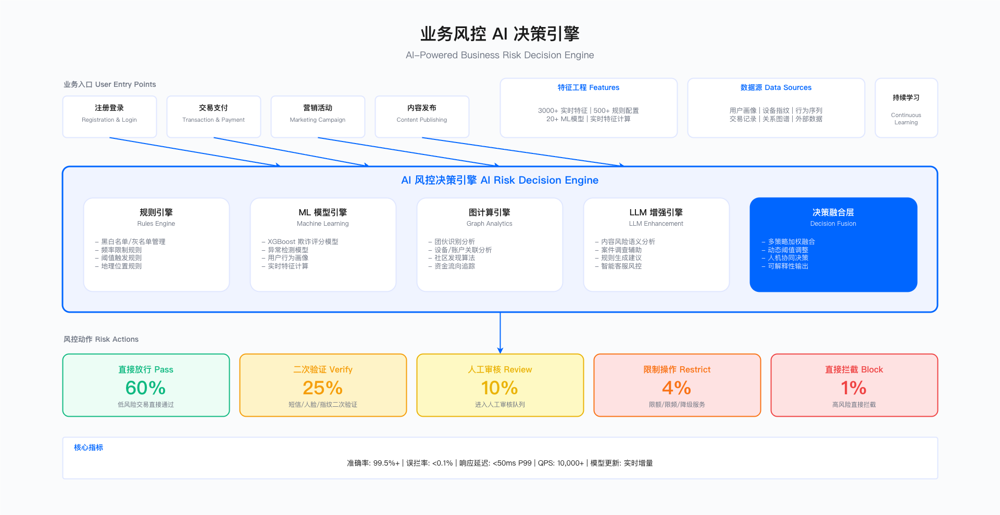
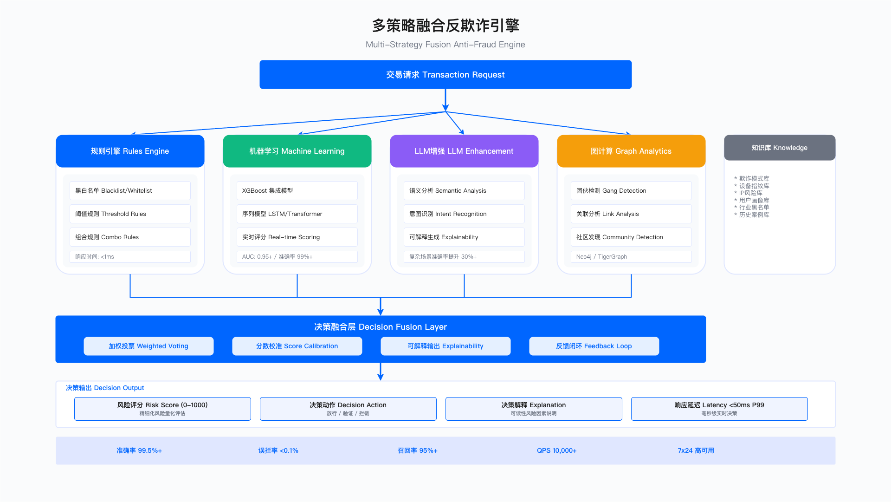

# 14.7 AI for 业务安全

> 业务安全是企业数字化运营的核心防线，AI 技术通过实时风险评估、多维度特征融合和智能决策，在保护业务资产的同时平衡用户体验。本节覆盖反欺诈、账号安全、营销反作弊、内容审核等核心业务安全场景。

## 执行摘要

### 业务安全 AI 化的核心价值

| 价值维度 | 传统方式 | AI 增强方式 | 改进方向 |
|---------|---------|-----------|---------|
| 欺诈损失 | 规则滞后、漏报多 | 实时检测、自适应 | 损失降低 |
| 误伤率 | 简单阈值、误拦高 | 多策略融合、精准 | 误伤降低 |
| 响应速度 | 人工审核、延迟高 | 毫秒级决策 | 响应加速 |
| 运营成本 | 大量人工值守 | 自动化处理 | 人力节省 |
| 团伙识别 | 单点分析、难发现 | 图关联、社区发现 | 识别能力提升 |

> **注**：具体改进幅度需通过 PoC 验证，受业务场景、数据质量、黑产对抗强度等因素影响。参考 14.9 案例，初期效果可能与预期有差距，需持续迭代优化。

### 场景覆盖与 ICE 优先级矩阵

| 场景 | Impact | Confidence | Ease | ICE 分 | 推荐阶段 |
|------|--------|------------|------|-------|---------|
| 交易反欺诈检测 | 10 | 9 | 7 | 630 | P0-立即 |
| 账号安全防护（ATO）| 9 | 9 | 8 | 648 | P0-立即 |
| 营销反作弊（反羊毛）| 8 | 8 | 8 | 512 | P1-短期 |
| 内容安全审核 | 9 | 8 | 7 | 504 | P1-短期 |
| 业务风控决策引擎 | 9 | 7 | 6 | 378 | P1-短期 |
| API 安全智能防护 | 8 | 7 | 7 | 392 | P2-中期 |
| 信用评估与授信 | 7 | 7 | 6 | 294 | P2-中期 |
| 商户/渠道风控 | 7 | 7 | 6 | 294 | P2-中期 |

---

## 业务需求层：痛点与场景概览

### 业务安全面临的核心挑战

```
┌─────────────────────────────────────────────────────────────────────────┐
│                        业务安全核心挑战                                   │
├─────────────────────────────────────────────────────────────────────────┤
│                                                                         │
│  ┌─────────────────┐  ┌─────────────────┐  ┌─────────────────┐         │
│  │    规则滞后     │  │    黑产进化     │  │   体验冲突     │         │
│  │  ┌───────────┐ │  │  ┌───────────┐ │  │  ┌───────────┐ │         │
│  │  │静态规则    │ │  │  │工具升级快 │ │  │  │验证打扰  │ │         │
│  │  │无法应对   │ │  │  │对抗周期短 │ │  │  │用户流失  │ │         │
│  │  │新型攻击   │ │  │  │规模化作案 │ │  │  │转化下降  │ │         │
│  │  └───────────┘ │  │  └───────────┘ │  │  └───────────┘ │         │
│  └─────────────────┘  └─────────────────┘  └─────────────────┘         │
│                                                                         │
│  ┌─────────────────┐  ┌─────────────────┐  ┌─────────────────┐         │
│  │    数据孤岛     │  │    识别困难     │  │   成本压力     │         │
│  │  ┌───────────┐ │  │  ┌───────────┐ │  │  ┌───────────┐ │         │
│  │  │多系统分散 │ │  │  │团伙隐蔽   │ │  │  │人工成本高 │ │         │
│  │  │无法关联   │ │  │  │变体识别难 │ │  │  │响应不及时 │ │         │
│  │  │全局视图缺 │ │  │  │意图判断难 │ │  │  │规模受限  │ │         │
│  │  └───────────┘ │  │  └───────────┘ │  │  └───────────┘ │         │
│  └─────────────────┘  └─────────────────┘  └─────────────────┘         │
│                                                                         │
└─────────────────────────────────────────────────────────────────────────┘
```

### 业务安全场景全景图

```
┌─────────────────────────────────────────────────────────────────────────┐
│                        业务安全 AI 场景全景                              │
├─────────────────────────────────────────────────────────────────────────┤
│                                                                         │
│  用户入口层                                                              │
│  ┌──────────┐  ┌──────────┐  ┌──────────┐  ┌──────────┐               │
│  │ 注册登录  │  │ 交易支付  │  │ 营销活动  │  │ 内容发布  │               │
│  └─────┬────┘  └─────┬────┘  └─────┬────┘  └─────┬────┘               │
│        │             │             │             │                      │
│        ▼             ▼             ▼             ▼                      │
│  ┌─────────────────────────────────────────────────────────────────┐   │
│  │                      AI 风控决策引擎                              │   │
│  │  ┌─────────┐ ┌─────────┐ ┌─────────┐ ┌─────────┐ ┌─────────┐  │   │
│  │  │ 规则层  │ │ ML 模型 │ │ 图分析  │ │ LLM 增强│ │ 决策融合 │  │   │
│  │  └─────────┘ └─────────┘ └─────────┘ └─────────┘ └─────────┘  │   │
│  └─────────────────────────────────────────────────────────────────┘   │
│        │                                                                │
│        ▼                                                                │
│  ┌─────────────────────────────────────────────────────────────────┐   │
│  │                      响应执行层                                   │   │
│  │  ┌────────┐ ┌────────┐ ┌────────┐ ┌────────┐ ┌────────┐       │   │
│  │  │ 直接放行│ │二次验证 │ │ 人工复核│ │ 限制操作│ │ 封禁拉黑│       │   │
│  │  └────────┘ └────────┘ └────────┘ └────────┘ └────────┘       │   │
│  └─────────────────────────────────────────────────────────────────┘   │
│                                                                         │
└─────────────────────────────────────────────────────────────────────────┘
```

---

## 架构逻辑层：业务安全 AI 能力架构

### 统一业务风控平台架构

```
┌─────────────────────────────────────────────────────────────────────────┐
│                      业务安全 AI 平台架构                                  │
├─────────────────────────────────────────────────────────────────────────┤
│                                                                         │
│  ┌─────────────────────────────────────────────────────────────────┐   │
│  │                      业务接入层                                   │   │
│  │  ┌──────────┐ ┌──────────┐ ┌──────────┐ ┌──────────┐           │   │
│  │  │ 交易风控  │ │ 登录风控  │ │ 营销风控  │ │ 内容风控  │           │   │
│  │  │   API    │ │   API    │ │   API    │ │   API    │           │   │
│  │  └──────────┘ └──────────┘ └──────────┘ └──────────┘           │   │
│  └─────────────────────────────────────────────────────────────────┘   │
│                              │                                          │
│                              ▼                                          │
│  ┌─────────────────────────────────────────────────────────────────┐   │
│  │                      数据采集层                                   │   │
│  │  ┌───────────────────────────────────────────────────────────┐  │   │
│  │  │                     设备指纹SDK                             │  │   │
│  │  │  Canvas │ WebGL │ Audio │ Font │ Screen │ 传感器           │  │   │
│  │  └───────────────────────────────────────────────────────────┘  │   │
│  │  ┌───────────────────────────────────────────────────────────┐  │   │
│  │  │                     行为数据采集                            │  │   │
│  │  │  点击轨迹 │ 键盘动力学 │ 鼠标模式 │ 滑动特征 │ 页面路径     │  │   │
│  │  └───────────────────────────────────────────────────────────┘  │   │
│  └─────────────────────────────────────────────────────────────────┘   │
│                              │                                          │
│                              ▼                                          │
│  ┌─────────────────────────────────────────────────────────────────┐   │
│  │                      特征工程层                                   │   │
│  │  ┌───────────┐  ┌───────────┐  ┌───────────┐  ┌───────────┐    │   │
│  │  │  实时特征  │  │  离线特征  │  │  图特征   │  │  衍生特征  │    │   │
│  │  │ • 速率统计 │  │ • 用户画像 │  │ • 设备图  │  │ • 偏离度  │    │   │
│  │  │ • 时间窗口 │  │ • 历史行为 │  │ • IP网络  │  │ • 异常分  │    │   │
│  │  │ • 实时聚合 │  │ • 风险标签 │  │ • 关系链  │  │ • 趋势变化 │    │   │
│  │  └───────────┘  └───────────┘  └───────────┘  └───────────┘    │   │
│  └─────────────────────────────────────────────────────────────────┘   │
│                              │                                          │
│                              ▼                                          │
│  ┌─────────────────────────────────────────────────────────────────┐   │
│  │                      模型决策层                                   │   │
│  │                                                                   │   │
│  │   ┌───────────┐    ┌───────────┐    ┌───────────┐               │   │
│  │   │  规则引擎  │    │  ML模型   │    │  图计算   │               │   │
│  │   │ • DSL规则 │    │ • XGBoost │    │ • 社区发现│               │   │
│  │   │ • 决策表  │    │ • 深度学习│    │ • 路径分析│               │   │
│  │   │ • 黑白名单│    │ • 实时学习│    │ • 关联分析│               │   │
│  │   └─────┬─────┘    └─────┬─────┘    └─────┬─────┘               │   │
│  │         │                │                │                       │   │
│  │         ▼                ▼                ▼                       │   │
│  │   ┌─────────────────────────────────────────────────────────┐   │   │
│  │   │                    决策融合引擎                          │   │   │
│  │   │  最终分数 = w₁×规则分 + w₂×模型分 + w₃×图分析分          │   │   │
│  │   └─────────────────────────────────────────────────────────┘   │   │
│  │                              │                                   │   │
│  │                              ▼                                   │   │
│  │   ┌─────────────────────────────────────────────────────────┐   │   │
│  │   │                    LLM深度分析                           │   │   │
│  │   │        (复杂case / 高风险case / 可解释性生成)            │   │   │
│  │   └─────────────────────────────────────────────────────────┘   │   │
│  └─────────────────────────────────────────────────────────────────┘   │
│                              │                                          │
│                              ▼                                          │
│  ┌─────────────────────────────────────────────────────────────────┐   │
│  │                      响应执行层                                   │   │
│  │  ┌──────────┐ ┌──────────┐ ┌──────────┐ ┌──────────┐           │   │
│  │  │ 直接放行  │ │ 二次验证  │ │ 人工审核  │ │ 直接拦截  │           │   │
│  │  │ 分数<30  │ │30≤分数<70│ │70≤分数<90│ │ 分数≥90  │           │   │
│  │  └──────────┘ └──────────┘ └──────────┘ └──────────┘           │   │
│  └─────────────────────────────────────────────────────────────────┘   │
│                                                                         │
└─────────────────────────────────────────────────────────────────────────┘
```



**图注**：业务风险决策引擎架构图，展示从数据采集、特征工程、模型决策到响应执行的完整处理流程，支持规则引擎、ML 模型与图分析的多策略融合。

---

## 工程技术层：核心场景实现

### 场景1：交易反欺诈检测

#### 技术架构

```
┌─────────────────────────────────────────────────────────────────────┐
│                      交易反欺诈 AI 系统架构                            │
├─────────────────────────────────────────────────────────────────────┤
│                                                                     │
│  ┌─────────────────────────────────────────────────────────────┐   │
│  │                      数据采集层                               │   │
│  │  ┌──────────┐ ┌──────────┐ ┌──────────┐ ┌──────────┐       │   │
│  │  │ 交易数据  │ │ 用户行为  │ │ 设备指纹  │ │ 外部数据  │       │   │
│  │  │ 金额/时间 │ │ 点击/浏览 │ │Canvas/GPU│ │ 黑名单/IP │       │   │
│  │  └────┬─────┘ └────┬─────┘ └────┬─────┘ └────┬─────┘       │   │
│  └───────┼────────────┼────────────┼────────────┼───────────────┘   │
│          ▼            ▼            ▼            ▼                   │
│  ┌─────────────────────────────────────────────────────────────┐   │
│  │                      特征工程层                               │   │
│  │  ┌────────────────────────────────────────────────────────┐ │   │
│  │  │  实时特征              │  离线特征           │ 图特征   │ │   │
│  │  │  - 交易金额偏离度      │  - 历史欺诈率       │ - 设备图 │ │   │
│  │  │  - 时间窗口统计        │  - 用户画像标签     │ - IP图   │ │   │
│  │  │  - 设备变化检测        │  - 商户风险等级     │ - 地址图 │ │   │
│  │  │  - 地理位置跳跃        │  - 行业欺诈基准     │ - 关系图 │ │   │
│  │  └────────────────────────────────────────────────────────┘ │   │
│  └─────────────────────────────────────────────────────────────┘   │
│                              │                                      │
│                              ▼                                      │
│  ┌─────────────────────────────────────────────────────────────┐   │
│  │                       模型决策层                              │   │
│  │   ┌───────────┐    ┌───────────┐    ┌───────────┐           │   │
│  │   │ ML评分模型 │───▶│ 规则引擎  │───▶│ LLM分析   │           │   │
│  │   │ XGBoost   │    │ 业务规则  │    │ 复杂case  │           │   │
│  │   │ <10ms     │    │ 黑白名单  │    │ 深度分析  │           │   │
│  │   └───────────┘    └───────────┘    └───────────┘           │   │
│  │         │                │                │                   │   │
│  │         ▼                ▼                ▼                   │   │
│  │   ┌─────────────────────────────────────────────────────┐   │   │
│  │   │              决策融合引擎                             │   │   │
│  │   │  风险分数 = 0.5×ML分 + 0.3×规则分 + 0.2×图分析分     │   │   │
│  │   └─────────────────────────────────────────────────────┘   │   │
│  └─────────────────────────────────────────────────────────────┘   │
│                                                                     │
└─────────────────────────────────────────────────────────────────────┘
```



**图注**：多策略欺诈检测系统架构，展示 ML 评分模型、规则引擎与 LLM 深度分析的协同决策流程，实现毫秒级实时风控。

#### 核心代码实现

```python
"""
交易反欺诈检测引擎
多策略融合：ML 模型 + 规则引擎 + 图分析 + LLM 深度分析
"""

from dataclasses import dataclass, field
from typing import Dict, List, Optional, Tuple
from enum import Enum
from datetime import datetime
import asyncio


class RiskLevel(Enum):
    LOW = "low"           # 低风险，直接放行
    MEDIUM = "medium"     # 中风险，二次验证
    HIGH = "high"         # 高风险，人工审核
    CRITICAL = "critical" # 极高风险，直接拦截


class DecisionAction(Enum):
    APPROVE = "approve"     # 放行
    CHALLENGE = "challenge" # 二次验证
    REVIEW = "review"       # 人工审核
    REJECT = "reject"       # 拒绝


@dataclass
class Transaction:
    """交易信息"""
    transaction_id: str
    user_id: str
    merchant_id: str
    amount: float
    currency: str
    payment_method: str
    timestamp: datetime
    device_fingerprint: str
    ip_address: str
    location: Dict[str, float]  # lat, lng


@dataclass
class RiskFeatures:
    """风险特征"""
    # 交易特征
    amount_deviation: float          # 金额偏离度
    velocity_1h: int                 # 1小时内交易次数
    velocity_24h: int                # 24小时内交易次数

    # 设备特征
    device_age_hours: float          # 设备首次使用距今小时数
    device_user_count: int           # 设备关联用户数
    is_emulator: bool                # 是否模拟器

    # 地理特征
    location_jump_km: float          # 位置跳跃距离
    is_vpn: bool                     # 是否VPN

    # 关联特征
    graph_community_risk: float      # 图社区风险分


@dataclass
class FraudDecision:
    """欺诈决策结果"""
    transaction_id: str
    risk_score: float
    risk_level: RiskLevel
    action: DecisionAction
    ml_score: float
    rule_score: float
    graph_score: float
    triggered_rules: List[str]
    risk_factors: List[str]
    processing_time_ms: float
    explanation: str


class TransactionFraudEngine:
    """交易反欺诈引擎"""

    def __init__(self):
        self.decision_weights = {"ml": 0.5, "rule": 0.3, "graph": 0.2}
        self.thresholds = {"low": 30, "medium": 70, "high": 90}

    async def evaluate(
        self,
        transaction: Transaction,
        user_profile: Dict
    ) -> FraudDecision:
        """多策略融合评估交易风险"""
        start_time = datetime.now()

        # Step 1: 特征提取
        features = await self._extract_features(transaction, user_profile)

        # Step 2: 多模型并行评分
        ml_score, rule_result, graph_score = await asyncio.gather(
            self._ml_scoring(features),
            self._rule_evaluation(transaction, features),
            self._graph_analysis(transaction)
        )

        rule_score, triggered_rules = rule_result

        # Step 3: 分数融合
        final_score = self._fuse_scores(ml_score, rule_score, graph_score)

        # Step 4: 风险等级判定
        risk_level = self._determine_risk_level(final_score)

        # Step 5: 决策生成
        action = self._determine_action(risk_level, user_profile)

        # Step 6: 风险因素分析
        risk_factors = self._analyze_risk_factors(features, triggered_rules)

        # Step 7: 高风险case使用LLM深度分析
        explanation = ""
        if risk_level in [RiskLevel.HIGH, RiskLevel.CRITICAL]:
            explanation = await self._llm_deep_analysis(
                transaction, features, risk_factors
            )

        processing_time = (datetime.now() - start_time).total_seconds() * 1000

        return FraudDecision(
            transaction_id=transaction.transaction_id,
            risk_score=final_score,
            risk_level=risk_level,
            action=action,
            ml_score=ml_score,
            rule_score=rule_score,
            graph_score=graph_score,
            triggered_rules=triggered_rules,
            risk_factors=risk_factors,
            processing_time_ms=processing_time,
            explanation=explanation
        )

    async def _ml_scoring(self, features: RiskFeatures) -> float:
        """ML模型评分"""
        # 构建特征向量并调用ML模型
        # 实际实现: return self.ml_model.predict_proba([features])[0][1] * 100
        return 35.0  # 示例

    async def _rule_evaluation(
        self,
        transaction: Transaction,
        features: RiskFeatures
    ) -> Tuple[float, List[str]]:
        """规则引擎评估"""
        triggered_rules = []
        total_score = 0

        # 规则1: 新设备大额交易
        if features.device_age_hours < 24 and transaction.amount > 5000:
            triggered_rules.append("NEW_DEVICE_HIGH_AMOUNT")
            total_score += 30

        # 规则2: 高速交易
        if features.velocity_1h > 10:
            triggered_rules.append("HIGH_VELOCITY")
            total_score += 25

        # 规则3: 位置跳跃
        if features.location_jump_km > 500:
            triggered_rules.append("LOCATION_JUMP")
            total_score += 35

        # 规则4: 代理网络
        if features.is_vpn:
            triggered_rules.append("ANONYMOUS_NETWORK")
            total_score += 20

        # 规则5: 模拟器/Root设备
        if features.is_emulator:
            triggered_rules.append("SUSPICIOUS_DEVICE")
            total_score += 25

        # 规则6: 设备关联多用户
        if features.device_user_count > 5:
            triggered_rules.append("DEVICE_MULTI_USER")
            total_score += 30

        return min(total_score, 100), triggered_rules

    async def _graph_analysis(self, transaction: Transaction) -> float:
        """图分析评分"""
        # 构建关联查询，分析社区风险
        # 实际实现: return self.graph_analyzer.analyze_community(query) * 100
        return 25.0  # 示例

    def _fuse_scores(self, ml: float, rule: float, graph: float) -> float:
        """融合多模型分数"""
        return min(
            self.decision_weights["ml"] * ml +
            self.decision_weights["rule"] * rule +
            self.decision_weights["graph"] * graph,
            100
        )

    def _determine_risk_level(self, score: float) -> RiskLevel:
        """判定风险等级"""
        if score < self.thresholds["low"]:
            return RiskLevel.LOW
        elif score < self.thresholds["medium"]:
            return RiskLevel.MEDIUM
        elif score < self.thresholds["high"]:
            return RiskLevel.HIGH
        else:
            return RiskLevel.CRITICAL

    def _determine_action(
        self,
        risk_level: RiskLevel,
        user_profile: Dict
    ) -> DecisionAction:
        """决定处置动作"""
        # 信任用户放宽阈值
        if user_profile.get("verified_identity") and risk_level == RiskLevel.MEDIUM:
            return DecisionAction.APPROVE

        action_map = {
            RiskLevel.LOW: DecisionAction.APPROVE,
            RiskLevel.MEDIUM: DecisionAction.CHALLENGE,
            RiskLevel.HIGH: DecisionAction.REVIEW,
            RiskLevel.CRITICAL: DecisionAction.REJECT
        }
        return action_map[risk_level]

    def _analyze_risk_factors(
        self,
        features: RiskFeatures,
        triggered_rules: List[str]
    ) -> List[str]:
        """分析风险因素"""
        factors = []
        if features.amount_deviation > 3:
            factors.append(f"交易金额异常偏高（偏离度：{features.amount_deviation:.1f}x）")
        if features.velocity_1h > 5:
            factors.append(f"交易频率异常（1小时内 {features.velocity_1h} 笔）")
        if features.device_age_hours < 24:
            factors.append("使用新设备")
        if features.is_vpn:
            factors.append("使用代理网络")
        if features.location_jump_km > 100:
            factors.append(f"地理位置异常跳跃（{features.location_jump_km:.0f}km）")
        return factors

    async def _llm_deep_analysis(
        self,
        transaction: Transaction,
        features: RiskFeatures,
        risk_factors: List[str]
    ) -> str:
        """LLM深度分析"""
        prompt = f"""作为交易反欺诈专家，请分析以下高风险交易：

## 交易信息
- 交易ID: {transaction.transaction_id}
- 交易金额: {transaction.currency} {transaction.amount}
- 支付方式: {transaction.payment_method}

## 风险特征
- 金额偏离度: {features.amount_deviation:.2f}
- 1小时交易次数: {features.velocity_1h}
- 设备使用时长: {features.device_age_hours:.1f} 小时
- 位置跳跃距离: {features.location_jump_km:.0f} km

## 已识别风险因素
{chr(10).join(f'- {f}' for f in risk_factors)}

请提供：
1. 风险评估总结
2. 最可能的欺诈类型
3. 建议的处置措施"""

        # response = await self.llm_client.generate(prompt)
        return "基于多维度风险分析，该交易具有盗卡欺诈特征..."

    async def _extract_features(self, tx: Transaction, profile: Dict) -> RiskFeatures:
        """提取风险特征（示例）"""
        return RiskFeatures(
            amount_deviation=2.5,
            velocity_1h=3,
            velocity_24h=8,
            device_age_hours=48,
            device_user_count=1,
            is_emulator=False,
            location_jump_km=50,
            is_vpn=False,
            graph_community_risk=0.2
        )
```

### 场景 2：账号安全防护（ATO 防护）

#### 技术架构

```
┌─────────────────────────────────────────────────────────────────────┐
│                      账号安全防护系统架构                             │
├─────────────────────────────────────────────────────────────────────┤
│                                                                     │
│  ┌─────────────────────────────────────────────────────────────┐   │
│  │                      登录请求入口                             │   │
│  │  ┌──────────┐ ┌──────────┐ ┌──────────┐ ┌──────────┐       │   │
│  │  │   Web    │ │   APP    │ │   API    │ │  小程序   │       │   │
│  │  └──────────┘ └──────────┘ └──────────┘ └──────────┘       │   │
│  └─────────────────────────────────────────────────────────────┘   │
│                              │                                      │
│                              ▼                                      │
│  ┌─────────────────────────────────────────────────────────────┐   │
│  │                     风险感知层                                │   │
│  │  ┌───────────────────────────────────────────────────────┐  │   │
│  │  │                  设备指纹采集                           │  │   │
│  │  │  Canvas │ WebGL │ Audio │ Font │ Screen │ Timezone   │  │   │
│  │  └───────────────────────────────────────────────────────┘  │   │
│  │  ┌───────────────────────────────────────────────────────┐  │   │
│  │  │                  行为数据采集                           │  │   │
│  │  │  键盘动力学 │ 鼠标轨迹 │ 触摸模式 │ 输入节奏          │  │   │
│  │  └───────────────────────────────────────────────────────┘  │   │
│  └─────────────────────────────────────────────────────────────┘   │
│                              │                                      │
│                              ▼                                      │
│  ┌─────────────────────────────────────────────────────────────┐   │
│  │                     风险分析层                                │   │
│  │  ┌─────────────┐  ┌─────────────┐  ┌─────────────┐          │   │
│  │  │  撞库检测   │  │ 行为建模    │  │ 设备风险    │          │   │
│  │  │  IP频率    │  │ 用户习惯    │  │ 指纹匹配    │          │   │
│  │  │  账号枚举  │  │ 异常检测    │  │ 设备信誉    │          │   │
│  │  │  密码喷洒  │  │ 时序分析    │  │ 环境检测    │          │   │
│  │  └─────────────┘  └─────────────┘  └─────────────┘          │   │
│  │                              │                                │   │
│  │                              ▼                                │   │
│  │   ┌─────────────────────────────────────────────────────┐   │   │
│  │   │              风险评分融合引擎                        │   │   │
│  │   │  综合风险分 = Σ(wᵢ × scoreᵢ)                        │   │   │
│  │   └─────────────────────────────────────────────────────┘   │   │
│  └─────────────────────────────────────────────────────────────┘   │
│                              │                                      │
│                              ▼                                      │
│  ┌─────────────────────────────────────────────────────────────┐   │
│  │                     决策响应层                                │   │
│  │   ┌────────┐    ┌───────────┐    ┌──────────────┐           │   │
│  │   │ 低风险 │───▶│  直接放行  │───▶│    无感登录   │           │   │
│  │   ├────────┤    ├───────────┤    ├──────────────┤           │   │
│  │   │ 中风险 │───▶│ 滑块验证码 │───▶│   轻度打扰    │           │   │
│  │   ├────────┤    ├───────────┤    ├──────────────┤           │   │
│  │   │ 高风险 │───▶│ 短信/邮件  │───▶│   中度打扰    │           │   │
│  │   ├────────┤    ├───────────┤    ├──────────────┤           │   │
│  │   │极高风险│───▶│ 人脸/客服  │───▶│   重度打扰    │           │   │
│  │   └────────┘    └───────────┘    └──────────────┘           │   │
│  └─────────────────────────────────────────────────────────────┘   │
│                                                                     │
└─────────────────────────────────────────────────────────────────────┘
```

#### 核心代码实现

```python
"""
账号安全防护系统（ATO Prevention）
功能：登录风险评估、撞库检测、行为分析、自适应验证
"""

from dataclasses import dataclass
from typing import Dict, List, Optional, Tuple
from enum import Enum
from datetime import datetime
import asyncio


class LoginRiskLevel(Enum):
    TRUSTED = "trusted"       # 信任，无感登录
    LOW = "low"               # 低风险，直接放行
    MEDIUM = "medium"         # 中风险，滑块验证
    HIGH = "high"             # 高风险，短信验证
    CRITICAL = "critical"     # 极高风险，人脸/客服


class ChallengeType(Enum):
    NONE = "none"
    SLIDER_CAPTCHA = "slider_captcha"
    SMS_OTP = "sms_otp"
    EMAIL_OTP = "email_otp"
    FACE_VERIFY = "face_verify"


class AttackType(Enum):
    CREDENTIAL_STUFFING = "credential_stuffing"  # 撞库
    PASSWORD_SPRAYING = "password_spraying"       # 密码喷洒
    BRUTE_FORCE = "brute_force"                  # 暴力破解


@dataclass
class LoginRequest:
    """登录请求"""
    request_id: str
    username: str
    timestamp: datetime
    client_ip: str
    device_fingerprint: str
    behavior_data: Optional[Dict] = None


@dataclass
class LoginRiskAssessment:
    """登录风险评估结果"""
    request_id: str
    risk_score: float
    risk_level: LoginRiskLevel
    challenge_type: ChallengeType
    attack_type: Optional[AttackType]
    risk_factors: List[str]
    is_credential_stuffing: bool
    processing_time_ms: float


class AccountSecuritySystem:
    """账号安全防护系统"""

    def __init__(self):
        self.weights = {"ip": 0.25, "device": 0.30, "behavior": 0.25, "account": 0.20}
        self.thresholds = {"trusted": 15, "low": 35, "medium": 60, "high": 85}
        self.stuffing_thresholds = {
            "ip_login_rate_1m": 10,
            "ip_fail_rate_1m": 5,
            "username_fail_rate_1h": 5,
        }

    async def assess_login_risk(
        self,
        request: LoginRequest,
        user_profile: Optional[Dict] = None
    ) -> LoginRiskAssessment:
        """评估登录风险"""
        start_time = datetime.now()

        # Step 1: 并行执行各维度风险评估
        (
            ip_result,
            device_result,
            behavior_result,
            stuffing_result
        ) = await asyncio.gather(
            self._assess_ip_risk(request),
            self._assess_device_risk(request),
            self._assess_behavior_risk(request, user_profile),
            self._detect_credential_stuffing(request)
        )

        ip_score, ip_factors = ip_result
        device_score, device_factors = device_result
        behavior_score, behavior_factors = behavior_result
        is_stuffing, attack_type = stuffing_result

        # Step 2: 账号维度风险评估
        account_score, account_factors = await self._assess_account_risk(
            request, user_profile
        )

        # Step 3: 融合风险分数
        risk_score = self._fuse_risk_scores(
            ip_score, device_score, behavior_score, account_score
        )

        # 撞库攻击加重处理
        if is_stuffing:
            risk_score = min(risk_score * 1.5, 100)

        # Step 4: 判定风险等级
        risk_level = self._determine_risk_level(risk_score, user_profile)

        # Step 5: 决定验证方式
        challenge_type = self._determine_challenge(risk_level, user_profile)

        # Step 6: 汇总风险因素
        risk_factors = ip_factors + device_factors + behavior_factors + account_factors

        processing_time = (datetime.now() - start_time).total_seconds() * 1000

        return LoginRiskAssessment(
            request_id=request.request_id,
            risk_score=risk_score,
            risk_level=risk_level,
            challenge_type=challenge_type,
            attack_type=attack_type,
            risk_factors=risk_factors,
            is_credential_stuffing=is_stuffing,
            processing_time_ms=processing_time
        )

    async def _assess_ip_risk(self, request: LoginRequest) -> Tuple[float, List[str]]:
        """评估IP风险"""
        factors = []
        score = 0

        # IP信誉、代理检测、地理位置检测等
        # 实际实现调用IP服务
        return score, factors

    async def _assess_device_risk(self, request: LoginRequest) -> Tuple[float, List[str]]:
        """评估设备风险"""
        factors = []
        score = 0

        # 设备指纹、模拟器检测、关联账号数等
        return score, factors

    async def _assess_behavior_risk(
        self,
        request: LoginRequest,
        user_profile: Optional[Dict]
    ) -> Tuple[float, List[str]]:
        """评估行为风险"""
        factors = []
        score = 0

        if not request.behavior_data:
            return 30, ["无行为数据"]

        # 输入速度、鼠标行为、键盘动力学分析
        typing_speed = request.behavior_data.get("typing_speed", 0)
        if typing_speed > 15:
            score += 25
            factors.append("输入速度异常快（疑似自动填充）")

        mouse_score = request.behavior_data.get("mouse_naturalness_score", 1.0)
        if mouse_score < 0.3:
            score += 30
            factors.append("鼠标行为不自然（疑似机器人）")

        return min(score, 100), factors

    async def _assess_account_risk(
        self,
        request: LoginRequest,
        user_profile: Optional[Dict]
    ) -> Tuple[float, List[str]]:
        """评估账号风险"""
        factors = []
        score = 0

        if not user_profile:
            return 20, ["无法获取用户画像"]

        # 登录失败次数
        failed_count = user_profile.get("failed_login_count_24h", 0)
        if failed_count > 3:
            score += 20
            factors.append(f"24小时内登录失败{failed_count}次")

        # 设备变化
        if request.device_fingerprint not in user_profile.get("usual_devices", []):
            score += 20
            factors.append("使用非常用设备")

        return min(score, 100), factors

    async def _detect_credential_stuffing(
        self,
        request: LoginRequest
    ) -> Tuple[bool, Optional[AttackType]]:
        """检测撞库攻击"""
        # 检查IP级别的异常
        ip_stats = await self._get_ip_login_stats(request.client_ip)

        if ip_stats.get("login_count_1m", 0) > self.stuffing_thresholds["ip_login_rate_1m"]:
            return True, AttackType.CREDENTIAL_STUFFING

        if ip_stats.get("fail_count_1m", 0) > self.stuffing_thresholds["ip_fail_rate_1m"]:
            return True, AttackType.CREDENTIAL_STUFFING

        return False, None

    def _fuse_risk_scores(
        self,
        ip: float, device: float, behavior: float, account: float
    ) -> float:
        """融合风险分数"""
        return min(
            self.weights["ip"] * ip +
            self.weights["device"] * device +
            self.weights["behavior"] * behavior +
            self.weights["account"] * account,
            100
        )

    def _determine_risk_level(
        self,
        score: float,
        user_profile: Optional[Dict]
    ) -> LoginRiskLevel:
        """判定风险等级"""
        # 老用户适当放宽
        adjustment = 0
        if user_profile and user_profile.get("account_age_days", 0) > 365:
            adjustment = -5

        adjusted_score = score + adjustment

        if adjusted_score < self.thresholds["trusted"]:
            return LoginRiskLevel.TRUSTED
        elif adjusted_score < self.thresholds["low"]:
            return LoginRiskLevel.LOW
        elif adjusted_score < self.thresholds["medium"]:
            return LoginRiskLevel.MEDIUM
        elif adjusted_score < self.thresholds["high"]:
            return LoginRiskLevel.HIGH
        else:
            return LoginRiskLevel.CRITICAL

    def _determine_challenge(
        self,
        risk_level: LoginRiskLevel,
        user_profile: Optional[Dict]
    ) -> ChallengeType:
        """决定验证方式"""
        challenge_map = {
            LoginRiskLevel.TRUSTED: ChallengeType.NONE,
            LoginRiskLevel.LOW: ChallengeType.NONE,
            LoginRiskLevel.MEDIUM: ChallengeType.SLIDER_CAPTCHA,
            LoginRiskLevel.HIGH: ChallengeType.SMS_OTP,
            LoginRiskLevel.CRITICAL: ChallengeType.FACE_VERIFY
        }
        return challenge_map.get(risk_level, ChallengeType.SLIDER_CAPTCHA)

    async def _get_ip_login_stats(self, ip: str) -> Dict:
        """获取IP登录统计"""
        return {"login_count_1m": 2, "fail_count_1m": 0}
```

### 场景 3：营销反作弊（反羊毛）

#### 技术架构

```
┌─────────────────────────────────────────────────────────────────────┐
│                      营销反作弊系统架构                              │
├─────────────────────────────────────────────────────────────────────┤
│                                                                     │
│  ┌─────────────────────────────────────────────────────────────┐   │
│  │                      活动参与入口                             │   │
│  │  ┌──────────┐ ┌──────────┐ ┌──────────┐ ┌──────────┐       │   │
│  │  │ 领券入口  │ │ 抽奖入口  │ │ 秒杀入口  │ │ 拼团入口  │       │   │
│  │  └──────────┘ └──────────┘ └──────────┘ └──────────┘       │   │
│  └─────────────────────────────────────────────────────────────┘   │
│                              │                                      │
│                              ▼                                      │
│  ┌─────────────────────────────────────────────────────────────┐   │
│  │                     风险分析层                                │   │
│  │   ┌───────────────┐  ┌───────────────┐  ┌───────────────┐   │   │
│  │   │   设备风险    │  │   账号风险     │  │   行为风险    │   │   │
│  │   │  ┌─────────┐ │  │  ┌─────────┐  │  │  ┌─────────┐  │   │   │
│  │   │  │模拟器检测│ │  │  │批量注册 │  │  │  │机器行为 │  │   │   │
│  │   │  │群控检测 │ │  │  │养号特征 │  │  │  │秒杀模式 │  │   │   │
│  │   │  │改机检测 │ │  │  │小号关联 │  │  │  │异常频率 │  │   │   │
│  │   │  └─────────┘ │  │  └─────────┘  │  │  └─────────┘  │   │   │
│  │   └───────────────┘  └───────────────┘  └───────────────┘   │   │
│  │                              │                                │   │
│  │                              ▼                                │   │
│  │   ┌─────────────────────────────────────────────────────┐   │   │
│  │   │                    图关联分析                        │   │   │
│  │   │  ┌─────────┐  ┌─────────┐  ┌─────────┐             │   │   │
│  │   │  │ 设备图  │──│  IP图   │──│ 手机号图 │             │   │   │
│  │   │  └─────────┘  └─────────┘  └─────────┘             │   │   │
│  │   │                    │                                │   │   │
│  │   │            团伙识别 & 社区发现                       │   │   │
│  │   └─────────────────────────────────────────────────────┘   │   │
│  └─────────────────────────────────────────────────────────────┘   │
│                              │                                      │
│                              ▼                                      │
│  ┌─────────────────────────────────────────────────────────────┐   │
│  │                     决策执行层                                │   │
│  │  ┌──────────┐ ┌──────────┐ ┌──────────┐ ┌──────────┐       │   │
│  │  │ 正常放行  │ │ 限量发放  │ │ 验证拦截  │ │ 直接拒绝  │       │   │
│  │  │ 风险<20  │ │20≤风险<50│ │50≤风险<80│ │ 风险≥80  │       │   │
│  │  └──────────┘ └──────────┘ └──────────┘ └──────────┘       │   │
│  └─────────────────────────────────────────────────────────────┘   │
│                                                                     │
└─────────────────────────────────────────────────────────────────────┘
```

#### 核心代码实现

```python
"""
营销反作弊系统（反羊毛）
功能：设备指纹分析、羊毛党识别、团伙关联、实时拦截
"""

from dataclasses import dataclass, field
from typing import Dict, List, Optional, Tuple
from enum import Enum
from datetime import datetime
import asyncio


class PromoRiskLevel(Enum):
    SAFE = "safe"           # 安全用户
    LOW = "low"             # 低风险
    MEDIUM = "medium"       # 中风险
    HIGH = "high"           # 高风险
    BLOCKED = "blocked"     # 黑名单


class PromoAction(Enum):
    ALLOW = "allow"         # 正常发放
    LIMIT = "limit"         # 限量发放
    CHALLENGE = "challenge" # 验证后发放
    REJECT = "reject"       # 拒绝发放


class WoolPartyType(Enum):
    SCRIPT_BOT = "script_bot"         # 脚本机器人
    DEVICE_FARM = "device_farm"       # 设备农场/群控
    FAKE_ACCOUNT = "fake_account"     # 虚假账号
    ORGANIZED_GANG = "organized_gang" # 有组织团伙


@dataclass
class PromoParticipation:
    """活动参与请求"""
    request_id: str
    promo_id: str
    promo_type: str  # coupon, lottery, flash_sale
    user_id: str
    device_fingerprint: str
    ip_address: str
    timestamp: datetime
    behavior_data: Optional[Dict] = None


@dataclass
class AntiWoolDecision:
    """反羊毛决策结果"""
    request_id: str
    risk_score: float
    risk_level: PromoRiskLevel
    action: PromoAction
    wool_party_type: Optional[WoolPartyType]
    risk_factors: List[str]
    gang_info: Optional[Dict]
    processing_time_ms: float


class AntiWoolSystem:
    """营销反作弊系统"""

    def __init__(self):
        self.weights = {"device": 0.35, "account": 0.25, "behavior": 0.20, "graph": 0.20}
        self.thresholds = {"safe": 20, "low": 40, "medium": 60, "high": 80}

    async def evaluate(
        self,
        participation: PromoParticipation,
        user_profile: Optional[Dict] = None
    ) -> AntiWoolDecision:
        """评估活动参与风险"""
        start_time = datetime.now()

        # 并行执行各维度风险评估
        (
            device_result,
            account_result,
            behavior_result,
            graph_result
        ) = await asyncio.gather(
            self._assess_device_risk(participation),
            self._assess_account_risk(participation, user_profile),
            self._assess_behavior_risk(participation),
            self._assess_graph_risk(participation)
        )

        device_score, device_factors = device_result
        account_score, account_factors = account_result
        behavior_score, behavior_factors = behavior_result
        graph_score, graph_factors, gang_info = graph_result

        # 融合分数
        risk_score = self._fuse_scores(
            device_score, account_score, behavior_score, graph_score
        )

        # 判定羊毛党类型
        all_factors = device_factors + account_factors + behavior_factors + graph_factors
        wool_party_type = self._identify_wool_party_type(all_factors, gang_info)

        # 判定风险等级和动作
        risk_level = self._determine_risk_level(risk_score, participation.promo_type)
        action = self._determine_action(risk_level, user_profile)

        processing_time = (datetime.now() - start_time).total_seconds() * 1000

        return AntiWoolDecision(
            request_id=participation.request_id,
            risk_score=risk_score,
            risk_level=risk_level,
            action=action,
            wool_party_type=wool_party_type,
            risk_factors=all_factors,
            gang_info=gang_info,
            processing_time_ms=processing_time
        )

    async def _assess_device_risk(
        self,
        participation: PromoParticipation
    ) -> Tuple[float, List[str]]:
        """评估设备风险"""
        factors = []
        score = 0

        device = await self._get_device_profile(participation.device_fingerprint)

        if device is None:
            score += 20
            factors.append("新设备首次参与活动")
        else:
            if device.get("is_emulator"):
                score += 40
                factors.append("检测到模拟器")
            if device.get("is_group_control"):
                score += 50
                factors.append("疑似群控设备")
            if device.get("is_fake_device"):
                score += 45
                factors.append("检测到设备信息伪造")
            if device.get("associated_accounts", 0) > 3:
                score += 20
                factors.append(f"设备关联{device['associated_accounts']}个账号")

        return min(score, 100), factors

    async def _assess_account_risk(
        self,
        participation: PromoParticipation,
        user_profile: Optional[Dict]
    ) -> Tuple[float, List[str]]:
        """评估账号风险"""
        factors = []
        score = 0

        if not user_profile:
            return 15, ["无法获取用户画像"]

        # 新账号
        if user_profile.get("account_age_days", 0) < 7:
            score += 25
            factors.append("新注册账号")

        # 活动参与频率异常
        if user_profile.get("promo_count_30d", 0) > 30:
            score += 30
            factors.append(f"30天参与{user_profile['promo_count_30d']}次活动")

        # 优惠券使用率低
        if user_profile.get("coupon_use_rate", 1) < 0.1:
            score += 25
            factors.append("优惠券使用率极低")

        return min(score, 100), factors

    async def _assess_behavior_risk(
        self,
        participation: PromoParticipation
    ) -> Tuple[float, List[str]]:
        """评估行为风险"""
        factors = []
        score = 0

        if not participation.behavior_data:
            return 20, ["无行为数据"]

        behavior = participation.behavior_data

        # 操作速度异常
        if behavior.get("action_speed", 0) > 10:
            score += 30
            factors.append("操作速度异常快（疑似脚本）")

        # 页面停留时间异常
        if behavior.get("page_stay_seconds", 100) < 2:
            score += 25
            factors.append("页面停留时间过短")

        # 点击轨迹异常
        if behavior.get("click_pattern_score", 1) < 0.3:
            score += 30
            factors.append("点击轨迹不自然")

        # 秒杀场景特殊检测
        if participation.promo_type == "flash_sale":
            reaction_time = behavior.get("reaction_time_ms", 1000)
            if reaction_time < 100:
                score += 40
                factors.append(f"反应时间异常（{reaction_time}ms）")

        return min(score, 100), factors

    async def _assess_graph_risk(
        self,
        participation: PromoParticipation
    ) -> Tuple[float, List[str], Optional[Dict]]:
        """图关联分析"""
        factors = []
        score = 0
        gang_info = None

        graph_result = await self._execute_graph_analysis({
            "user_id": participation.user_id,
            "device_fp": participation.device_fingerprint,
            "ip": participation.ip_address
        })

        if graph_result.get("community_risk", 0) > 0.7:
            score += 35
            factors.append("属于高风险社区")

        if graph_result.get("gang_detected"):
            score += 45
            factors.append("检测到关联团伙")
            gang_info = {
                "gang_id": graph_result.get("gang_id"),
                "gang_size": graph_result.get("gang_size")
            }

        return min(score, 100), factors, gang_info

    def _fuse_scores(self, device: float, account: float, behavior: float, graph: float) -> float:
        """融合分数"""
        fused = (
            self.weights["device"] * device +
            self.weights["account"] * account +
            self.weights["behavior"] * behavior +
            self.weights["graph"] * graph
        )
        # 任一维度极高风险时提升总分
        max_score = max(device, account, behavior, graph)
        if max_score > 80:
            fused = max(fused, max_score * 0.9)
        return min(fused, 100)

    def _identify_wool_party_type(
        self,
        risk_factors: List[str],
        gang_info: Optional[Dict]
    ) -> Optional[WoolPartyType]:
        """识别羊毛党类型"""
        if gang_info and gang_info.get("gang_size", 0) > 5:
            return WoolPartyType.ORGANIZED_GANG
        if any("群控" in f for f in risk_factors):
            return WoolPartyType.DEVICE_FARM
        if any(k in "".join(risk_factors) for k in ["脚本", "操作速度异常"]):
            return WoolPartyType.SCRIPT_BOT
        if any(k in "".join(risk_factors) for k in ["批量注册", "新注册账号"]):
            return WoolPartyType.FAKE_ACCOUNT
        return None

    def _determine_risk_level(self, score: float, promo_type: str) -> PromoRiskLevel:
        """判定风险等级"""
        # 高价值活动使用更严格阈值
        if promo_type in ["flash_sale", "high_value_coupon"]:
            thresholds = {"safe": 15, "low": 35, "medium": 55, "high": 75}
        else:
            thresholds = self.thresholds

        if score < thresholds["safe"]:
            return PromoRiskLevel.SAFE
        elif score < thresholds["low"]:
            return PromoRiskLevel.LOW
        elif score < thresholds["medium"]:
            return PromoRiskLevel.MEDIUM
        elif score < thresholds["high"]:
            return PromoRiskLevel.HIGH
        else:
            return PromoRiskLevel.BLOCKED

    def _determine_action(
        self,
        risk_level: PromoRiskLevel,
        user_profile: Optional[Dict]
    ) -> PromoAction:
        """决定处置动作"""
        action_map = {
            PromoRiskLevel.SAFE: PromoAction.ALLOW,
            PromoRiskLevel.LOW: PromoAction.ALLOW,
            PromoRiskLevel.MEDIUM: PromoAction.LIMIT,
            PromoRiskLevel.HIGH: PromoAction.REJECT,
            PromoRiskLevel.BLOCKED: PromoAction.REJECT
        }
        return action_map.get(risk_level, PromoAction.CHALLENGE)

    async def _get_device_profile(self, fp: str) -> Optional[Dict]:
        return {"is_emulator": False, "associated_accounts": 2}

    async def _execute_graph_analysis(self, query: Dict) -> Dict:
        return {"community_risk": 0.3, "gang_detected": False}
```

### 场景 4：内容安全审核

#### 技术架构

```
┌─────────────────────────────────────────────────────────────────────┐
│                      内容安全审核系统架构                             │
├─────────────────────────────────────────────────────────────────────┤
│                                                                     │
│  ┌─────────────────────────────────────────────────────────────┐   │
│  │                      内容来源                                 │   │
│  │  ┌──────────┐ ┌──────────┐ ┌──────────┐ ┌──────────┐       │   │
│  │  │ 文本发布  │ │ 图片上传  │ │ 视频上传  │ │ 直播流   │       │   │
│  │  └──────────┘ └──────────┘ └──────────┘ └──────────┘       │   │
│  └─────────────────────────────────────────────────────────────┘   │
│                              │                                      │
│                              ▼                                      │
│  ┌─────────────────────────────────────────────────────────────┐   │
│  │                     预处理层                                  │   │
│  │  ┌───────────────────────────────────────────────────────┐  │   │
│  │  │  文本预处理         │  图像预处理        │  视频预处理   │  │   │
│  │  │  - 分词/NER        │  - 缩放/归一化    │  - 关键帧    │  │   │
│  │  │  - 谐音还原        │  - OCR提取       │  - 音频提取   │  │   │
│  │  │  - 火星文转换      │  - 人脸检测       │  - 场景分割   │  │   │
│  │  └───────────────────────────────────────────────────────┘  │   │
│  └─────────────────────────────────────────────────────────────┘   │
│                              │                                      │
│                              ▼                                      │
│  ┌─────────────────────────────────────────────────────────────┐   │
│  │                     AI审核层                                  │   │
│  │  ┌─────────────┐  ┌─────────────┐  ┌─────────────┐          │   │
│  │  │  文本审核   │  │  图像审核    │  │  视频审核    │          │   │
│  │  │  涉政/涉黄  │  │  色情/暴恐  │  │  暴力/色情  │          │   │
│  │  │  暴恐/辱骂  │  │  违禁/敏感  │  │  违禁/敏感  │          │   │
│  │  └─────────────┘  └─────────────┘  └─────────────┘          │   │
│  │                              │                                │   │
│  │                              ▼                                │   │
│  │  ┌─────────────────────────────────────────────────────┐    │   │
│  │  │              多模态融合 + LLM增强                     │    │   │
│  │  │  图文一致性检查 │ 上下文语义理解 │ 讽刺/隐喻识别       │    │   │
│  │  └─────────────────────────────────────────────────────┘    │   │
│  └─────────────────────────────────────────────────────────────┘   │
│                              │                                      │
│                              ▼                                      │
│  ┌─────────────────────────────────────────────────────────────┐   │
│  │                     决策执行层                                │   │
│  │  ┌──────────┐ ┌──────────┐ ┌──────────┐ ┌──────────┐       │   │
│  │  │ 直接通过  │ │ 机器复核  │ │ 人工复核  │ │ 直接删除  │       │   │
│  │  │置信>0.95 │ │0.8<置信≤0.95│ │0.5<置信≤0.8│ │ 置信≤0.5 │       │   │
│  │  └──────────┘ └──────────┘ └──────────┘ └──────────┘       │   │
│  └─────────────────────────────────────────────────────────────┘   │
│                                                                     │
└─────────────────────────────────────────────────────────────────────┘
```

#### 核心代码实现

```python
"""
内容安全审核系统
功能：多模态内容审核、违规检测、LLM语义理解增强
"""

from dataclasses import dataclass, field
from typing import Dict, List, Optional, Tuple
from enum import Enum
from datetime import datetime
import asyncio


class ContentType(Enum):
    TEXT = "text"
    IMAGE = "image"
    VIDEO = "video"


class ViolationType(Enum):
    PORN = "porn"               # 色情
    VIOLENCE = "violence"       # 暴力
    TERRORISM = "terrorism"     # 暴恐
    POLITICAL = "political"     # 涉政
    ABUSE = "abuse"             # 辱骂
    SPAM = "spam"               # 垃圾广告


class ModerationAction(Enum):
    PASS = "pass"                   # 通过
    MACHINE_REVIEW = "machine_review"  # 机器复核
    HUMAN_REVIEW = "human_review"   # 人工复核
    DELETE = "delete"               # 删除


@dataclass
class ContentItem:
    """待审核内容"""
    content_id: str
    content_type: ContentType
    user_id: str
    text_content: Optional[str] = None
    image_urls: List[str] = field(default_factory=list)
    video_url: Optional[str] = None


@dataclass
class ViolationDetail:
    """违规详情"""
    violation_type: ViolationType
    confidence: float
    evidence: str
    keywords: List[str] = field(default_factory=list)


@dataclass
class ModerationResult:
    """审核结果"""
    content_id: str
    action: ModerationAction
    is_violation: bool
    violations: List[ViolationDetail]
    text_score: float
    image_score: float
    confidence: float
    processing_time_ms: float
    llm_analysis: Optional[str] = None


class ContentModerationSystem:
    """内容审核系统"""

    def __init__(self):
        self.thresholds = {
            "auto_pass": 0.95,
            "machine_review": 0.80,
            "human_review": 0.50,
        }

    async def moderate(self, content: ContentItem) -> ModerationResult:
        """审核内容"""
        start_time = datetime.now()

        # 并行执行各模态审核
        tasks = []
        if content.text_content:
            tasks.append(self._moderate_text(content.text_content))
        else:
            tasks.append(self._empty_result())

        if content.image_urls:
            tasks.append(self._moderate_images(content.image_urls))
        else:
            tasks.append(self._empty_result())

        (
            (text_score, text_violations),
            (image_score, image_violations)
        ) = await asyncio.gather(*tasks)

        # 合并违规
        all_violations = text_violations + image_violations

        # 计算综合分数
        final_score = max(text_score, image_score)

        # 多模态融合分析
        if content.text_content and content.image_urls:
            multimodal_score = await self._multimodal_analysis(content)
            final_score = max(final_score, multimodal_score)

        # 判定动作
        action = self._determine_action(final_score, all_violations)

        # 高风险case使用LLM深度分析
        llm_analysis = None
        if action == ModerationAction.HUMAN_REVIEW:
            llm_analysis = await self._llm_deep_analysis(content, all_violations)

        processing_time = (datetime.now() - start_time).total_seconds() * 1000

        return ModerationResult(
            content_id=content.content_id,
            action=action,
            is_violation=len(all_violations) > 0 and final_score > 0.5,
            violations=all_violations,
            text_score=text_score,
            image_score=image_score,
            confidence=self._calculate_confidence(all_violations),
            processing_time_ms=processing_time,
            llm_analysis=llm_analysis
        )

    async def _moderate_text(self, text: str) -> Tuple[float, List[ViolationDetail]]:
        """文本审核"""
        violations = []
        max_score = 0.0

        # 1. 预处理：谐音还原、火星文转换
        normalized_text = await self._normalize_text(text)

        # 2. 关键词检测
        keyword_results = await self._keyword_detection(normalized_text)
        for result in keyword_results:
            if result["score"] > 0.5:
                violations.append(ViolationDetail(
                    violation_type=ViolationType(result["type"]),
                    confidence=result["score"],
                    evidence=result["matched_text"],
                    keywords=result["keywords"]
                ))
                max_score = max(max_score, result["score"])

        # 3. 模型检测
        model_results = await self._text_model_detection(normalized_text)
        for result in model_results:
            if result["score"] > 0.5:
                violations.append(ViolationDetail(
                    violation_type=ViolationType(result["type"]),
                    confidence=result["score"],
                    evidence=text[:100]
                ))
                max_score = max(max_score, result["score"])

        # 4. 语义理解（LLM）- 处理隐喻、讽刺
        if max_score < 0.8:
            semantic_result = await self._semantic_analysis(text)
            if semantic_result["score"] > 0.5:
                violations.append(ViolationDetail(
                    violation_type=ViolationType(semantic_result["type"]),
                    confidence=semantic_result["score"],
                    evidence=semantic_result["explanation"]
                ))
                max_score = max(max_score, semantic_result["score"])

        return max_score, violations

    async def _moderate_images(
        self,
        image_urls: List[str]
    ) -> Tuple[float, List[ViolationDetail]]:
        """图片审核"""
        violations = []
        max_score = 0.0

        for url in image_urls:
            # 图片分类检测
            results = await self._image_classification(url)
            for result in results:
                if result["score"] > 0.5:
                    violations.append(ViolationDetail(
                        violation_type=ViolationType(result["type"]),
                        confidence=result["score"],
                        evidence=f"图片: {url}"
                    ))
                    max_score = max(max_score, result["score"])

            # OCR文字提取并审核
            ocr_text = await self._extract_ocr_text(url)
            if ocr_text:
                text_score, text_violations = await self._moderate_text(ocr_text)
                for v in text_violations:
                    v.evidence = f"图片OCR: {v.evidence}"
                violations.extend(text_violations)
                max_score = max(max_score, text_score)

        return max_score, violations

    async def _multimodal_analysis(self, content: ContentItem) -> float:
        """多模态融合分析"""
        # 检查图文一致性，不一致可能是误导内容
        consistency_score = await self._check_text_image_consistency(
            content.text_content,
            content.image_urls
        )
        return 0.6 if consistency_score < 0.3 else 0.0

    async def _llm_deep_analysis(
        self,
        content: ContentItem,
        violations: List[ViolationDetail]
    ) -> str:
        """LLM深度分析"""
        violation_desc = "\n".join([
            f"- {v.violation_type.value}：{v.evidence} (置信度：{v.confidence:.2f})"
            for v in violations
        ])

        prompt = f"""请对以下内容进行深度审核分析：

## 内容类型
{content.content_type.value}

## 文本内容
{content.text_content or '无'}

## 初步检测到的违规
{violation_desc or '无明显违规'}

请分析：
1. 内容的真实意图和上下文
2. 是否存在隐性违规（谐音、隐喻、暗示等）
3. 误判可能性评估
4. 建议的处理方式"""

        # response = await self.llm_client.generate(prompt)
        return "经LLM深度分析，该内容需要人工进一步确认..."

    def _determine_action(
        self,
        score: float,
        violations: List[ViolationDetail]
    ) -> ModerationAction:
        """决定审核动作"""
        if not violations and score < 0.05:
            return ModerationAction.PASS

        if score < (1 - self.thresholds["auto_pass"]):
            return ModerationAction.PASS

        if score > 0.5:
            return ModerationAction.DELETE

        if score > (1 - self.thresholds["human_review"]):
            return ModerationAction.HUMAN_REVIEW

        return ModerationAction.MACHINE_REVIEW

    def _calculate_confidence(self, violations: List[ViolationDetail]) -> float:
        """计算置信度"""
        if not violations:
            return 0.95
        scores = [v.confidence for v in violations]
        return sum(scores) / len(scores)

    async def _empty_result(self) -> Tuple[float, List[ViolationDetail]]:
        return 0.0, []

    async def _normalize_text(self, text: str) -> str:
        return text

    async def _keyword_detection(self, text: str) -> List[Dict]:
        return []

    async def _text_model_detection(self, text: str) -> List[Dict]:
        return []

    async def _semantic_analysis(self, text: str) -> Dict:
        return {"is_violation": False, "type": "none", "score": 0.1, "explanation": ""}

    async def _image_classification(self, url: str) -> List[Dict]:
        return []

    async def _extract_ocr_text(self, url: str) -> str:
        return ""

    async def _check_text_image_consistency(self, text: str, images: List[str]) -> float:
        return 0.8
```

---

## 运营服务层：SLA与度量体系

### 业务安全 AI 服务 SLA 标准（示例）

> **说明**：以下为行业实践参考值，实际 SLA 需根据业务场景、用户容忍度、技术能力综合设定。误伤率阈值需与业务团队共同确定——过低可能导致漏报增加，过高则影响用户体验。

| 场景 | 响应时间 | 可用性 | 准确率（示例） | 误伤率（示例） |
|-----|---------|-------|--------------|--------------|
| 交易反欺诈 | P99<50ms | 99.99% | 目标 ≥85% | 目标 ≤0.5%* |
| 账号安全防护 | P99<30ms | 99.99% | 目标 ≥90% | 目标 ≤0.3%* |
| 营销反作弊 | P99<100ms | 99.9% | 目标 ≥90% | 目标 ≤0.5% |
| 内容审核 | P99<1s | 99.9% | 目标 ≥95% | 目标 ≤2% |
| 风控决策引擎 | P99<20ms | 99.99% | 目标 ≥85% | 目标 ≤1% |

> **\*** 误伤率 ≤0.5% 是理想目标。实际项目中（如 14.9 案例所示），初期误伤率可能达 1-3%，需通过持续优化逐步降低。若业务对误伤敏感（如支付场景），建议初期目标设为 ≤1%，验证后再收紧。

### 核心监控指标

```
┌─────────────────────────────────────────────────────────────────────┐
│                    业务安全 AI 监控指标体系                            │
├─────────────────────────────────────────────────────────────────────┤
│                                                                     │
│  效果指标（示例目标，需根据业务实际调整）                               │
│  ┌────────────┐ ┌────────────┐ ┌────────────┐ ┌────────────┐      │
│  │ 欺诈识别率  │ │  误伤率    │ │ 召回率     │ │ 精确率     │      │
│  │ TP/(TP+FN) │ │ FP/(FP+TN) │ │ TP/(TP+FN) │ │ TP/(TP+FP) │      │
│  │ 示例≥85%  │ │ 示例≤1%   │ │ 示例≥85%  │ │ 示例≥80%  │      │
│  └────────────┘ └────────────┘ └────────────┘ └────────────┘      │
│                                                                     │
│  业务指标（示例目标）                                                  │
│  ┌────────────┐ ┌────────────┐ ┌────────────┐ ┌────────────┐      │
│  │ 欺诈损失率  │ │ 用户投诉率 │ │ 自动化率   │ │ 人工审核量 │      │
│  │ 损失/交易额│ │ 投诉/总用户│ │ 自动/总量  │ │ 需人工数量 │      │
│  │ 按业务设定 │ │ 持续下降  │ │ 示例≥90%  │ │ 示例≤5%   │      │
│  └────────────┘ └────────────┘ └────────────┘ └────────────┘      │
│                                                                     │
│  技术指标                                                            │
│  ┌────────────┐ ┌────────────┐ ┌────────────┐ ┌────────────┐      │
│  │ 响应时间   │ │ 系统可用性 │ │ 模型漂移   │ │ 规则命中率 │      │
│  │ P99延迟   │ │ 服务SLA   │ │ PSI指标   │ │ 触发/总量  │      │
│  │ 目标<50ms │ │ 目标99.99%│ │ 目标≤0.1  │ │ 持续监控   │      │
│  └────────────┘ └────────────┘ └────────────┘ └────────────┘      │
│                                                                     │
└─────────────────────────────────────────────────────────────────────┘
```

### 实施路线图（示例）

| 阶段 | 时间 | 目标 | 关键里程碑（示例） |
|-----|------|-----|-------------------|
| P0 基础建设 | Q1 | 统一风控平台 | 完成决策引擎、规则引擎、ML 模型框架 |
| P1 核心场景 | Q2 | 交易+登录风控 | 欺诈损失显著降低，误伤率控制在业务可接受范围 |
| P2 场景扩展 | Q3 | 营销+内容审核 | 营销作弊拦截能力上线，内容审核自动化率提升 |
| P3 智能升级 | Q4 | 图分析+LLM增强 | 团伙识别能力上线，决策可解释性增强 |

> **注**：具体量化目标需根据企业基线数据设定。建议 P1 阶段先验证核心场景效果，再设定 P2/P3 的量化目标。

---

## 行业实践参考

### 蚂蚁集团：全球领先的 AI + 安全一体化实践

蚂蚁集团是国内最早布局"AI + 安全"一体化能力矩阵的企业，其实践在 2024 年世界互联网大会上获评精品案例。

**2024 世界互联网大会案例：跨境支付风控**

| 维度 | 效果数据 | 业务价值 |
|------|----------|----------|
| 商户入驻效率 | 10 秒完成开户入驻 | 极大提升商户体验 |
| 入驻成功率 | 一次性成功率 > 60% | 减少人工审核成本 |
| 支付审核效率 | 90% 订单秒级审核通过 | 不影响交易体验 |
| 欺诈风险率 | < 万分之一 | 极低风险损失 |
| 运营成本 | 笔均降低 50% | 显著成本节约 |

**AI + 安全能力矩阵**

蚂蚁的 AI + 安全已覆盖多个核心场景：

| 场景类别 | 具体应用 | 技术特点 |
|----------|----------|----------|
| 反欺诈 | 交易欺诈检测、信用欺诈识别 | 多模态数据融合、实时决策 |
| 反洗钱 | AML 交易监控、可疑报告生成 | 图分析、知识图谱 |
| 反赌博 | 赌博行为识别、资金链追踪 | 行为建模、资金网络分析 |
| 企业风控 | 联合建模、隐私计算风控 | 联邦学习、MPC |
| 反黄牛 | 营销活动反作弊 | 设备指纹、团伙识别 |
| 数据隐私 | PII 识别与保护 | NLP、敏感数据发现 |
| 内容安全 | 违规内容审核 | 多模态理解、LLM |
| 网络安全 | 入侵检测、漏洞分析 | 异常检测、威胁情报 |
| 智能客服 | 安全问答、诈骗预警 | RAG、对话理解 |
| AI 可信 | 模型安全、偏见检测 | 对抗测试、公平性评估 |

**市场份额与行业认可**

| 维度 | 数据 | 来源 |
|------|------|------|
| 零售信贷智能风控市场份额 | 国内领先 | [公开资料](https://www.cfbond.com/2025/05/15/wap_991087373.html) |
| 银行客户覆盖 | 100% 国有/股份制银行，>60% 地方银行 | 公开资料 |
| 亚太区反欺诈排名 | 亚太区领先 | 行业评估 |

**"倚天鉴"AI 安全解决方案**

蚂蚁推出的 AI 安全评估方案，核心是"蓝军"测评机制：

| 评估维度 | 测评内容 | 目标 |
|----------|----------|------|
| 鲁棒性 | 对抗样本攻击、边界测试 | 模型稳定性验证 |
| 可解释性 | 决策因素分析、归因解释 | 合规审计支持 |
| 公平性 | 偏见检测、群体差异分析 | 防止歧视性决策 |
| 框架安全 | 第三方插件、依赖漏洞 | 供应链安全 |
| 代码安全 | 模型代码审计 | 防止恶意注入 |

**对业务安全建设的启示**

| 维度 | 蚂蚁实践 | 参考价值 |
|------|----------|----------|
| 能力中台化 | 统一 AI + 安全能力矩阵，跨场景复用 | 避免烟囱式建设 |
| 隐私计算 | 联邦学习支持多方数据联合建模 | 数据不出域的风控能力 |
| 实时性 | 秒级甚至毫秒级决策 | 不牺牲用户体验 |
| AI 治理 | 建立 AI 安全评估标准化流程 | 可信 AI 落地实践 |

> **参考来源**：[蚂蚁集团安全风控案例入选世界互联网大会](https://finance.sina.com.cn/tech/roll/2024-11-20/doc-incwspwu2233013.shtml)、[蚂蚁数科国内市场份额第一](https://www.cfbond.com/2025/05/15/wap_991087373.html)

---

### 行业威胁趋势（2024-2025）

业务安全 AI 建设需关注以下威胁演变：

| 威胁类型 | 趋势数据 | 来源 |
|----------|----------|------|
| 深伪换脸攻击 | 生物识别验证攻击激增 704%（H1 → H2 2023）| iProov Threat Intelligence Report 2023 |
| AI 生成钓鱼邮件 | 占 BEC 商业欺诈邮件的 40% | VIPRE Q2 2024 Email Threat Report |
| AI 服务流量增长 | 企业 AI 服务流量同比增长 250% | Cloudflare 2024 |
| 账号接管（ATO） | 持续增长，成为主要攻击向量 | 行业报告 |
| 有组织羊毛党 | 工具化、平台化、产业化 | 风控行业洞察 |

**技术应对趋势**

| 应对方向 | 技术演进 | 成熟度 |
|----------|----------|--------|
| 行为生物识别 | 从静态特征到动态行为 | 成熟应用 |
| 图神经网络 | 团伙识别、关联分析 | 快速发展 |
| 联邦学习 | 隐私保护下的多方协作 | 规模落地 |
| LLM 增强 | 语义理解、可解释决策 | 早期探索 |
| 实时对抗 | 模型持续更新、自适应 | 关键方向 |

---

## 本章小结

业务安全 AI 化的核心在于**多策略融合决策**——将规则引擎的确定性、ML 模型的泛化能力、图分析的关联发现和 LLM 的语义理解有机结合，实现从"人工驱动"到"智能驱动"的转型。

**关键成功要素：**

1. **实时性优先**：毫秒级决策响应，不影响用户体验
2. **多策略融合**：规则+ML+图+LLM，取长补短
3. **自适应对抗**：持续学习，应对黑产进化
4. **可解释决策**：满足合规审计需求
5. **体验平衡**：风险控制与用户体验的动态平衡

---

## 参考资料

1. 蚂蚁集团安全风控案例：https://finance.sina.com.cn/tech/roll/2024-11-20/doc-incwspwu2233013.shtml
2. 蚂蚁数科市场份额公开报道：https://www.cfbond.com/2025/05/15/wap_991087373.html
3. iProov 生物识别攻击趋势报告 2023
4. Cloudflare AI 安全观察报告 2024
5. FIRST.org EPSS 漏洞预测系统

---

## 导航

**[← 上一节：14.6 AI for DataSec](./14.6_ai_for_datasec.md)** | **[返回章节目录](./README.md)** | **[下一节：14.8 AI 安全实施路径 →](./14.8_ai_for_security_implementation.md)**

---

**© 2025 AI-ESA Project. Licensed under CC BY-NC-SA 4.0**
