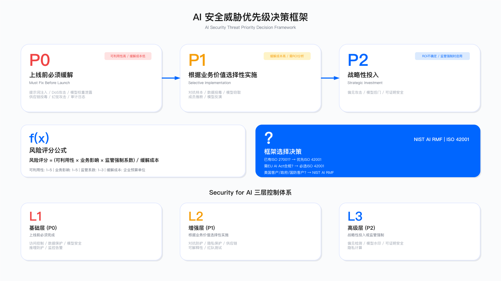
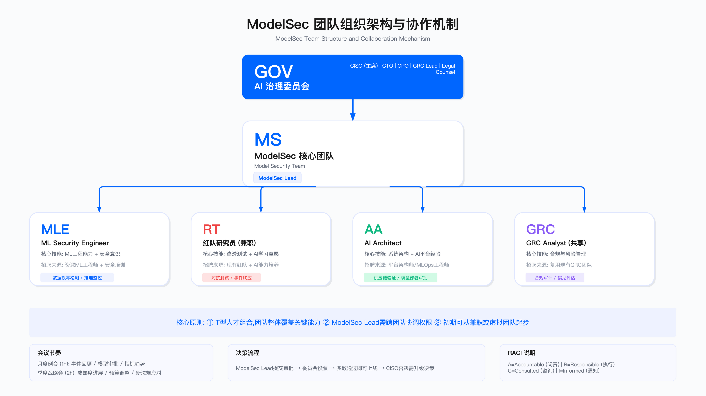

# 15.1 Security for AI 治理框架

## 引言：为何需要独立的 AI 安全治理

决策层常见的第一个质疑："既然已有 ISO 27001 和 SOC 2 等认证，为何 AI 安全需要单独的治理框架？"

这一质疑有其合理性。传统安全框架确实覆盖了访问控制，加密，日志审计等基础控制，但它们在设计时并未考虑 AI 系统的三类独特风险：

| 风险类型 | 攻击特征 | 传统安全工具的局限 | 典型场景 |
|---------|---------|------------------|---------|
| 数学层攻击 | 输入在业务逻辑层完全合法 | WAF 无法检测 | 对抗样本，模型窃取 |
| 训练时攻击 | 影响周期可长达数月 | EDR/IDS 实时检测无效 | 数据投毒，后门植入 |
| 推理时隐私泄漏 | 通过模型"记忆"机制泄露 | 传统 DLP 无法覆盖 | 训练数据提取，成员推断 |

向非技术背景决策者说明差异的类比：传统安全保护的是"门锁和围墙"，而 AI 安全需要防止"通过催眠术泄露秘密"，防护逻辑根本不同。


本节围绕三个核心决策问题展开：

1. 风险分层决策：哪些风险必须立即缓解？哪些可以延后？判断依据是什么？
2. 投入产出平衡：如何评估治理投入的合理性？何时应该拒绝安全需求？
3. 组织落地路径：如何设计 ModelSec 团队？如何实现 GRC、法务与业务部门的协同？

---

## 15.1.1 AI 安全威胁的决策视角

### 从攻击矩阵到风险分级

MITRE ATLAS 提供了完整的 AI 攻击分类体系，但对决策者而言，更关键的是确定威胁缓解的优先级。以下风险决策框架将威胁按紧迫程度分为三级。



#### P0 级威胁：上线前必须缓解

P0 威胁的判定标准是：可利用性高，业务影响严重，缓解成本相对可控。若 P0 威胁未处置便上线，等同于接受了不可控的系统性风险。

| 威胁类型 | 业务影响 | 可利用性 | 缓解成本 | 决策依据 |
| --- | --- | --- | --- | --- |
| 提示词注入 | LLM 行为完全劫持 | 极高 | 低 | 公开 PoC 广泛可用，输入过滤可快速实施 |
| DoS 攻击 | 服务不可用 | 高 | 低 | 速率限制等标准防护即可应对 |
| 模型权重泄露 | 核心 IP 损失 | 中 | 低 | 访问控制与加密存储为成熟实践 |
| 供应链投毒 | 系统完全沦陷 | 中 | 低 | SBOM 与依赖扫描工具已商业化成熟 |
| 幻觉攻击 | 法律/声誉风险 | 高 | 中 | 金融/医疗场景必须防护，通用场景可降级 |

适用边界：P0 标准适用于面向外部用户或处理敏感数据的 AI 系统。内部工具类应用可根据数据敏感度适当调整。

常见误区：将审计日志列为 P1，结果事故后无法追溯操作链，日志应归入 P0。另一个常见误区是认为"内部系统不会被攻击"，从而忽视内部员工滥用或凭证泄露风险。

#### P1 级威胁：根据业务价值选择性实施

P1 威胁的特点是缓解成本较高，需要根据具体业务场景的风险敞口进行投入产出分析。

| 威胁类型 | 业务影响 | 可利用性 | 缓解成本 | 决策依据 |
| --- | --- | --- | --- | --- |
| 对抗样本 | 模型误判 | 中 | 高 | 对抗训练需要专业能力与算力投入，ROI 取决于误判成本 |
| 数据投毒 | 模型长期性能退化 | 低 | 高 | 检测需统计分析基础设施，但影响存在潜伏期 |
| 模型窃取 | 知识产权损失 | 中 | 中 | 查询频率分析与水印技术仅适用高价值模型 |
| 成员推断 | 隐私合规风险 | 低 | 高 | 差分隐私会牺牲模型精度，需权衡业务接受度 |
| 模型反演 | 训练数据泄露 | 低 | 极高 | 同态加密/联邦学习成本高昂，仅强制合规场景启用 |

适用边界：P1 适用于已完成 P0 控制，有明确合规要求或高价值决策场景的系统。

关键约束：对抗训练会影响模型原有精度，需与业务部门协商可接受的精度损失范围。差分隐私的隐私预算（ε 值）设置需平衡隐私保护强度与模型可用性。联邦学习需要参与方间的协调成本，适用于明确的跨机构协作场景。

#### P2 级威胁：战略性投入

P2 威胁的缓解成本极高且 ROI 不确定，除非监管强制或战略定位需要，否则不建议优先投入。

| 威胁类型 | 业务影响 | 可利用性 | 缓解成本 | 决策依据 |
| --- | --- | --- | --- | --- |
| 偏见攻击 | 声誉/法律风险 | 中 | 极高 | 公平性验证需模型重训，仅监管强制时启用 |
| 模型后门 | APT 级威胁 | 极低 | 极高 | 形式化验证适用面窄，仅国防/关基场景 |
| 可证明安全 | 未来合规要求 | 未知 | 极高 | 属于研究投入，当前实用性有限 |

常见误区：过早投入 P2 级控制会挤占 P0/P1 资源。另一个误区是将 P2 能力作为"技术亮点"向管理层汇报，导致预期与实际能力错配。

### 威胁优先级评估方法

在预算评审时，使用以下公式对 AI 安全需求进行排序：

```
风险评分 = (可利用性 × 业务影响 × 监管强制系数) / 缓解成本
```

评分维度定义：

| 维度 | 评分 | 定义 | 示例 |
|-----|-----|-----|-----|
| 可利用性 | 1 | 理论可行，需深度专业知识 | 形式化验证绕过 |
| | 3 | 有学术 PoC，需定制开发 | 对抗样本生成 |
| | 5 | 公开工具可直接利用 | Prompt Injection |
| 业务影响 | 1 | 功能受损，可快速恢复 | 模型性能下降 |
| | 3 | 数据泄露或服务中断 | PII 泄露 |
| | 5 | 系统瘫痪或重大法律责任 | 全量客户数据泄露 |
| 监管强制 | 1 | 无明确要求 | 内部工具 |
| | 2 | 行业最佳实践建议 | ISO 42001 |
| | 3 | 强制合规 | EU AI Act 高风险类别 |

验证方法：
- 每季度复核评分结果与实际威胁情报，事件数据的吻合度
- 跟踪被拒绝需求在后续是否因风险实现而被重新提出

运营指标：

| 指标 | 定义 | 参考阈值 | 超阈值动作 |
|-----|-----|---------|-----------|
| 需求拒绝合理率 | 被拒绝的安全需求在 12 个月内因风险实现而重新提出的比例 | < 10% | 审查评分方法 |
| 风险评分校准度 | 评分与实际事件严重程度的相关性 | > 0.7 | 校准评分权重 |

---

## 15.1.2 治理框架的实战选择

### NIST AI RMF 与 ISO 42001 的选择逻辑

当前市场存在两个主流 AI 治理框架，选择取决于组织的首要合规目标。

| 维度 | NIST AI RMF 1.0 | ISO/IEC 42001:2023 |
|-----|----------------|-------------------|
| 发布时间 | 2023 年 1 月 | 2023 年 12 月 |
| 强制性 | 美国政府采购/国防强制 | EU AI Act 认可框架 |
| 认证要求 | 无第三方认证要求 | 需第三方认证审计 |
| 实施周期 | 3-6 个月（基础实施） | 6-12 个月（含认证） |
| 典型成本 | 内部人力为主 | 认证费 + 顾问费 + 内部人力 |
| 与现有体系集成 | 与 NIST CSF 无缝衔接 | 与 ISO 27001 无缝衔接 |

#### NIST AI RMF 1.0（2023）

适用场景：美国政府采购或国防承包商（强制要求），需要快速启动治理的组织（框架相对轻量），团队已熟悉 NIST CSF 体系。

实践特点：四大职能（GOVERN/MAP/MEASURE/MANAGE）结构直观，便于向决策层汇报。框架不要求第三方认证，可灵活裁剪。缺乏详细控制清单，需自行补充具体措施，在第三方审计时的说服力不如 ISO 认证。

需要补充的内容示例：

1. GV-5（AI 系统清单）详细化：
```yaml
AI_Inventory_Template:
  model_id: "gpt-4-turbo-prod"
  risk_tier: HIGH  # 依据 EU AI Act 分类标准
  data_sources: ["customer_support_logs", "knowledge_base"]
  pii_exposure: TRUE
  deployment_env: "AWS us-east-1"
  owner: "product-team@company.com"
  last_review: "2024-11-15"
  compliance_flags: ["GDPR", "CCPA"]
```

2. MS-2（AI 风险跟踪）量化指标：对抗样本检出率（需设定组织基线），模型性能漂移阈值（准确率变化触发告警的百分点），推理延迟 P99（防止资源耗尽型攻击）。

#### ISO/IEC 42001:2023 AI 管理体系

适用场景：需满足 EU AI Act 合规要求（ISO 42001 是官方认可框架），客户或投标要求第三方认证，已有 ISO 27001 认证，希望扩展到 AI 领域。

实践特点：完整的管理体系，审计友好，与 ISO 27001 可无缝集成，降低边际合规成本。但认证周期较长，实施成本较高，需要专职 GRC 资源支持。

#### 框架选择决策矩阵

| 组织现状 | 合规需求 | 建议框架 | 理由 |
|---------|---------|---------|-----|
| 已有 ISO 27001 | EU AI Act 高风险 | ISO 42001 | 边际成本最低，认证互认 |
| 已有 ISO 27001 | 无强制要求 | ISO 42001 或 NIST | 根据客户要求选择 |
| 已有 NIST CSF | 美国政府/国防 | NIST AI RMF | 强制要求，体系一致 |
| 无现有体系 | EU AI Act 高风险 | ISO 42001 | 满足合规刚需 |
| 无现有体系 | 无强制要求 | NIST AI RMF | 启动成本低，可快速见效 |
| 跨国企业 | 多地区合规 | 双框架并行 | 不同市场需求不同 |

关键约束：

| 约束类型 | 说明 | 应对策略 |
|---------|-----|---------|
| 框架兼容性 | 两个框架并非互斥 | 大型跨国企业可能需同时满足，控制项可复用 |
| 实施能力 | 框架选择后的实施能力比框架本身更重要 | 缺乏经验的组织建议引入外部顾问 |
| 时间约束 | 认证周期可能与业务节奏冲突 | 分阶段实施，先基础控制后正式认证 |

### Security for AI 三层控制的投入分析

将所有控制无差别堆叠是常见的治理误区。正确的做法是基于业务风险分层投入。

#### 基础层（P0）：上线前必须完成

| 控制域 | 关键控制 | 阻断风险 | 决策依据 |
| --- | --- | --- | --- |
| 访问控制 | 最小权限，MFA，审计日志 | 内部滥用，模型泄露 | 控制缺失将直接导致事故 |
| 数据保护 | 加密，脱敏，数据验证 | 训练数据泄露 | GDPR 等法规硬性要求 |
| 模型安全 | 签名验证，版本控制 | 供应链投毒 | 避免模型被篡改后无法检测 |
| 推理防护 | 输入验证，速率限制 | 提示词注入，DoS | 面向外部的服务基本要求 |
| 监控告警 | 异常检测，性能监控 | 模型漂移，攻击未被发现 | 运营可见性的基础 |

验证方法：内部红队执行基础渗透测试（覆盖提示词注入，模型泄露，DoS），并检查审计日志是否可追溯完整操作链。

运行指标：访问控制覆盖率（启用 MFA 的模型访问入口占比），日志完整性（关键操作的日志记录完整率），告警响应时间（从异常发生到告警触发的时间）。

#### 增强层（P1）：根据业务价值选择性实施

| 控制域 | 关键控制 | 适用场景 | 关键约束 |
| --- | --- | --- | --- |
| 对抗防护 | 对抗训练，集成方法 | 高价值决策模型 | 需评估精度损失的业务接受度 |
| 隐私保护 | 差分隐私，联邦学习 | GDPR 强制场景 | 隐私预算设置影响模型可用性 |
| 供应链 | SBOM，依赖扫描 | 使用开源模型的场景 | 需建立持续更新机制 |
| 可解释性 | LIME/SHAP | 监管要求场景 | 可解释性与模型复杂度存在张力 |
| 红队测试 | 对抗攻击模拟 | 生产环境 AI | 需要专业红队能力 |

决策公式参考：
```
是否投入 = (预期损失 × 发生概率) > (实施成本 × 安全系数)
```
安全系数通常取 2-3，体现实施成本通常会超出初始估算的经验规律。

常见误区：

| 误区 | 表现 | 识别信号 | 纠正方法 |
|-----|-----|---------|---------|
| 过度防护 | 对内部工具实施与外部服务同等强度控制 | 内部工具的安全预算占比过高 | 按数据敏感度和暴露面分级 |
| 精度预期错配 | 未与业务部门对齐精度损失预期 | 安全控制上线后被绕过或关闭 | 控制上线前签署业务确认 |
| 忽视运营成本 | 只算实施成本，忽略持续运营投入 | 控制上线后因人力不足而失效 | TCO 评估需包含 3 年运营成本 |

#### 高级层（P2）：战略性投入或监管强制

| 控制域 | 关键控制 | 投入条件 | 风险提示 |
| --- | --- | --- | --- |
| 偏见检测 | 公平性评估 | 金融/招聘等高风险场景 | 公平性定义本身存在争议 |
| 模型水印 | 版权保护 | 高价值商业模型 | 水印可能被对抗性攻击移除 |
| 可证明安全 | 形式化验证 | 国防/关基场景 | 当前仅适用简单模型 |
| 隐私计算 | 安全多方计算 | 跨机构数据协作 | 计算开销显著 |

适用边界：除非满足以下条件，否则建议暂缓 P2 投入：

| 启动条件 | 说明 | 验证方法 |
|---------|-----|---------|
| 监管强制 | EU AI Act 将系统分类为"高风险 AI" | 法务确认分类结果 |
| 竞争定位 | 希望通过认证建立市场差异化 | 销售团队确认客户需求 |
| 客户要求 | 合同明确要求相关能力 | 合同条款审查 |

#### 控制层级选择决策树

```
                        ┌─────────────────────┐
                        │  AI 系统上线评估     │
                        └──────────┬──────────┘
                                   │
                        ┌──────────▼──────────┐
                        │ 是否面向外部用户？   │
                        └──────────┬──────────┘
                                   │
                    ┌──────────────┴──────────────┐
                    │ 是                          │ 否
                    ▼                             ▼
        ┌───────────────────┐         ┌───────────────────┐
        │ P0 基础层必须完成   │         │ 是否处理敏感数据？ │
        │ + 输入验证         │         └─────────┬─────────┘
        │ + 输出过滤         │                   │
        │ + 速率限制         │         ┌─────────┴─────────┐
        └─────────┬─────────┘         │ 是               │ 否
                  │                   ▼                  ▼
        ┌─────────▼─────────┐  ┌───────────┐    ┌───────────┐
        │ 是否高价值决策场景？│  │ P0 必须    │    │ 基础访问   │
        └─────────┬─────────┘  │ + 数据加密 │    │ 控制即可   │
                  │            │ + 脱敏     │    └───────────┘
        ┌─────────┴─────────┐  └───────────┘
        │ 是               │ 否
        ▼                  ▼
┌───────────────┐  ┌───────────────┐
│ P1 增强层      │  │ P0 基础层     │
│ + 对抗训练    │  │ 持续监控     │
│ + 红队测试    │  └───────────────┘
└───────┬───────┘
        │
┌───────▼───────────┐
│ 是否监管强制场景？  │
└───────┬───────────┘
        │
┌───────┴───────┐
│ 是           │ 否
▼              ▼
┌──────────┐  ┌──────────┐
│ P2 高级层 │  │ P1 已足够 │
│ + 偏见检测│  └──────────┘
│ + 可解释性│
└──────────┘
```

---

## 15.1.3 AI 安全成熟度的实战路径

### 成熟度级别定义

多数企业的现实目标应定位在 L3（定义级）。L4/L5 的边际收益递减，除非 AI 是公司核心产品，否则投入难以获得批准。

| 成熟度 | 核心特征 | 典型投入 | 适用场景 |
|-------|---------|---------|---------|
| L1 初始级 | 无专门 AI 安全措施 | 无 | 早期探索阶段 |
| L2 可重复级 | 基础控制已实施 | 1-2 人兼职 | AI 应用进入生产 |
| L3 定义级 | 流程标准化，主动防御 | 专职团队 3-5 人 | 多数企业的合理目标 |
| L4 量化级 | 风险量化，自动化决策 | 专职团队 5-10 人 | AI 是核心产品 |
| L5 优化级 | 持续优化，行业领先 | 专职团队 10+ 人 | 头部 AI 公司 |

#### L1 → L2：从基础缺失到达到及格线

L1 典型特征：AI 模型作为普通软件部署，无特殊安全措施。数据科学家直接在生产环境调试模型，无模型版本控制，无法回滚。出现问题时无法追溯操作者与变更内容。

快速提升路径：

| 阶段 | 任务 | 关键交付物 | 验收标准 |
|-----|-----|-----------|---------|
| 第 1 阶段 | 建立 AI 资产清单 | 模型清单表（含所有者，数据源，PII 标识，部署环境） | 覆盖率 100% |
| 第 2 阶段 | 实施基础访问控制 | 权重加密，只读生产访问，审计日志 | 日志可追溯完整操作链 |
| 第 3 阶段 | 数据脱敏管道 | 训练数据脱敏流程，推理日志脱敏 | PII 检测准确率 > 95% |
| 第 4 阶段 | 推理环境加固 | 输入验证，速率限制，异常检测 | 通过基础渗透测试 |

AI 资产清单示例：
```
Model Name | Owner | Data Sources | PII | Deployment | Last Audit
fraud-det  | john  | transactions | YES | Prod       | 2024-10-01
chatbot-v2 | jane  | support_logs | YES | Test       | Never
```

验收标准：通过内部红队基础渗透测试（覆盖提示词注入，模型泄露，DoS）。

#### L2 → L3：从合规到主动防御

L3 核心特征：不仅防止被攻击，而是主动发现威胁并快速响应。

关键里程碑：

| 里程碑 | 核心任务 | 交付物 | 验收标准 |
|-------|---------|-------|---------|
| 建立 ModelSec 团队 | 组建专职团队 | 团队章程，职责矩阵 | ModelSec Lead 到位 |
| 实施 NIST AI RMF | GV-5 清单自动化，MS-2 监控，MG-4 响应手册 | 框架合规报告 | 通过内部评估 |
| 引入对抗测试 | 使用 ART 工具测试关键模型 | 鲁棒性基线报告 | 建立改进目标 |
| 供应链验证 | SBOM 生成，依赖扫描，签名验证 | 供应链安全流程 | 覆盖所有开源模型 |

验收标准：通过外部红队演练，模型性能漂移在设定时间窗口内被检测到，符合 NIST AI RMF 的 GOVERN/MAP/MEASURE 三大职能。

#### L3 → L4：量化管理

L4 标志：所有 AI 风险都有量化指标和自动化决策支持。

| 能力域 | L3 水平 | L4 水平 | 差距弥补方法 |
|-------|--------|--------|------------|
| 风险度量 | 定性评估 | 量化指标 + 基准对比 | 建立风险量化看板 |
| 合规检查 | 手工检查 | 每次部署自动运行 | CI/CD 集成检查项 |
| 红队演练 | 按需执行 | 定期化 + 自动化 | 季度演练计划 |
| 决策支持 | 人工判断 | 自动化建议 | 风险评分自动化 |

适用边界：

| 启动 L4 的条件 | 说明 |
|--------------|-----|
| AI 是核心产品 | AI 能力直接影响公司营收和竞争力 |
| 监管强制要求 | EU AI Act 高风险类别，金融监管要求 |
| 重大事故后 | 经历过 AI 安全事故，需系统性提升 |

不满足上述条件时，L3 是多数企业的合理终点。

---

## 15.1.4 治理组织的实战设计

### ModelSec 团队组建



#### 常见误区：追求"全能型"人才

初期招聘时常见的 JD 问题是要求候选人同时具备机器学习开发能力（PyTorch/TensorFlow），对抗攻击知识（FGSM/PGD/C&W），渗透测试经验，以及隐私增强技术理解（差分隐私，联邦学习）。这类复合型人才在市场上极为稀缺，且多被头部 AI 公司吸引。

| 误区 | 表现 | 后果 | 替代方案 |
|-----|-----|-----|---------|
| 追求全能型人才 | JD 要求 ML + 安全 + 隐私全精通 | 招聘周期 6+ 个月仍空缺 | T 型人才组合 |
| 从零组建团队 | 全部外部招聘 | 成本高，融入慢 | 内部转岗 + 针对性培训 |
| 忽视协调能力 | 只看技术能力 | 跨团队推动受阻 | Lead 需有跨部门经验 |

#### 可行方案：T 型人才组合

| 角色 | 核心技能 | 招聘来源 | 培养周期 |
| --- | --- | --- | --- |
| **ModelSec Lead** | AppSec 经验 + ML 基础 | 内部 AppSec 转岗 | 3-6 个月 ML 培训 |
| **ML Security Engineer** | ML 工程能力 + 安全意识 | 资深 ML 工程师 + 安全培训 | 2-3 个月安全培训 |
| **红队研究员（兼职）**  | 渗透测试 + AI 学习意愿 | 现有红队 + AI 能力培养 | 持续学习 |
| **GRC Analyst（共享）**  | 合规与风险管理 | 复用现有 GRC 团队 | AI 法规培训 |

关键约束：

| 约束 | 说明 | 应对策略 |
|-----|-----|---------|
| 能力覆盖 | 确保团队整体覆盖所有关键能力 | 技能矩阵定期评估 |
| 协调权限 | ModelSec Lead 需跨团队协调权限 | CISO 授权 + 委员会背书 |
| 起步方式 | 初期资源有限 | 可从兼职或虚拟团队起步 |

### 治理委员会的实际运作

避免委员会沦为"季度汇报会"的关键是建立清晰的决策机制。

#### 委员会组成

| 角色 | 代表部门 | 主要职责 |
| --- | --- | --- |
| CISO（主席） | 安全部 | 总体风险决策，一票否决权 |
| CTO | 技术部 | 技术可行性评估 |
| CPO | 产品部 | 业务影响评估 |
| GRC Lead | 合规部 | 监管要求解读 |
| Legal Counsel | 法务部 | 法律风险评估（重大决策参与） |
| ModelSec Lead | 安全部 | 技术细节支持 |

#### 会议节奏与决策机制

| 会议类型 | 频率 | 时长 | 核心议题 | 产出 |
|---------|-----|-----|---------|-----|
| 月度例会 | 每月 | 1 小时 | 事件回顾，模型审批，指标趋势 | 审批决议，行动项 |
| 季度战略会 | 每季 | 2 小时 | 成熟度进展，预算调整，监管应对 | 战略调整建议 |
| 紧急会议 | 按需 | 30 分钟 | 重大事件，紧急审批 | 应急决策 |

决策流程：
```
ModelSec Lead 提交审批 → 委员会投票 → 多数通过即可上线
如 CISO 否决 → 需提交更高层级决策
```

#### 审批案例：高风险 AI 模型

背景：产品团队希望上线基于 LLM 的客户服务 AI，计划使用原始客户对话记录训练（含大量 PII）。

审批流程：

| 阶段 | 执行者 | 内容 | 结论 |
|-----|-------|-----|-----|
| 风险评估 | ModelSec | 数据投毒风险中，隐私泄漏风险高，提示词注入风险高 | 建议不批准 |
| 委员会投票 | 全体委员 | CISO 否决，CTO 要求改进，CPO 接受延期，GRC/Legal 指出合规问题 | 驳回 |
| 整改要求 | ModelSec | PII 脱敏 + 提示词注入防护 | 重新提交 |

验证方法：整改完成后由 ModelSec 执行红队测试，验证脱敏有效性与注入防护效果。

### 关键角色 RACI 矩阵

| 活动 | ModelSec Lead | AI Architect | Data Scientist | GRC | Legal |
| --- | --- | --- | --- | --- | --- |
| **AI 安全策略制定** | A | R | C | C | C |
| **模型风险评估** | A/R | R | C | C | I |
| **对抗测试** | A/R | C | I | I | I |
| **数据投毒检测** | A | C | R | I | I |
| **供应链验证** | R | A | I | C | I |
| **模型部署审批** | A | R | C | C | I |
| **推理监控** | C | C | I | I | I |
| **合规审计** | R | C | I | A | R |
| **事件响应** | A/R | C | C | C | C |
| **偏见评估** | R | C | A | R | R |

RACI 定义：

| 标识 | 含义 | 说明 |
|-----|-----|-----|
| A | Accountable | 出事时向管理层问责的角色 |
| R | Responsible | 实际执行工作的角色 |
| C | Consulted | 决策前必须征求意见的角色 |
| I | Informed | 决策后通知即可的角色 |

常见误区：

| 误区 | 表现 | 后果 | 纠正方法 |
|-----|-----|-----|---------|
| Legal 过度参与 | 所有活动都设为 C | 审批周期 2-3 倍延长 | 仅重大合规决策深度参与 |
| 责任不清 | 同一活动多个 A | 出事时互相推诿 | 每活动仅一个 A |
| 遗漏关键角色 | 数据隐私问题未咨询 Legal | 合规风险暴露 | 定期审查矩阵覆盖度 |

---

## 15.1.5 向决策层汇报的结构

### 季度 AI 安全汇报模板

决策层时间有限，汇报需要高度结构化。

| 汇报模块 | 时长 | 核心内容 | 决策层关注点 |
|---------|-----|---------|------------|
| 风险态势 | 2 分钟 | AI 资产分布，重点风险 | 整体风险可控性 |
| 关键指标 | 3 分钟 | 安全指标与趋势 | 投入是否有效 |
| 投资回报 | 5 分钟 | 本季投入与避免损失 | ROI 是否合理 |
| 下季计划 | 3 分钟 | 重点项目与风险 | 资源需求预判 |
| 决策事项 | 2 分钟 | 需要批准的事项 | 需要做什么决策 |

#### 1. 风险态势（2 分钟）

```
当前 AI 资产：XX 个模型
├─ 高风险：X 个（涉及 PII/金融决策）
├─ 中风险：XX 个
└─ 低风险：XX 个

重点风险：
- 客服 AI：提示词注入风险（已缓解）
- 信贷评分模型：潜在偏见（评估中）
```

#### 2. 关键指标（3 分钟）

| 指标 | 当前值 | 目标 | 趋势 | 说明 |
| --- | --- | --- | --- | --- |
| 对抗样本鲁棒性 | XX% | > 目标值 | ↗ | 对抗训练项目进行中 |
| 模型漂移检出时间 | < Xh | < 目标值 | → | 已达设定基线 |
| 供应链扫描覆盖率 | XX% | 100% | ↗ | 计划时间完成全覆盖 |

#### 3. 投资回报分析（5 分钟）

```
本季度投入：$XXK
├─ 对抗训练：$XXK（鲁棒性提升 XX%）
├─ 供应链工具：$XXK（覆盖率提升 XX%）
├─ 红队演练：$XXK（发现 X 个高危漏洞）
└─ 培训：$XXK（全员 AI 安全意识）

避免损失（风险缓解价值）：
- 红队发现的提示词注入漏洞，若被利用可导致数据泄露
- 供应链扫描拦截的恶意依赖
```

#### 4. 下季度计划（3 分钟）

```
重点项目：
1. [P0] 完成 ISO 42001 认证
   - 目标：满足 EU AI Act 合规要求
   - 风险：如不完成，影响欧盟市场客户签约

2. [P1] 信贷模型偏见评估
   - 目标：满足监管要求
   - 风险：若发现显著偏见，需重新训练
```

#### 5. 需要决策的事项（2 分钟）

向决策层呈现选项时，应提供明确的选项与各自的成本，风险权衡，而非开放式问题。

示例：
> "信贷评分模型对特定群体的批准率存在差异。法务部建议暂停模型使用，但会影响业务目标。
>
> 方案 A：继续使用现有模型，但人工复审所有拒绝案例
> 方案 B：暂停模型使用，启动重新训练项目
>
> 请决策层选择方案并授权在发现严重偏见时的应急处置权限。"

---

## 15.1.6 落地时的阻力与应对

### 阻力类型汇总

| 阻力 | 来源 | 本质 | 应对策略 |
|-----|-----|-----|---------|
| "已有 ISO 27001" | 财务，业务部门 | 未理解 AI 威胁差异 | 对比演示 |
| "会影响模型精度" | 产品，数据科学 | 业务与安全指标权衡 | 呈现选项 |
| "认证周期太长" | 销售，业务拓展 | 合规与商业周期冲突 | 分阶段策略 |

### 阻力一："已有 ISO 27001，为何还需要 AI 安全治理？"

应对方法：使用对比演示说明传统安全与 AI 安全的本质差异。

| 攻击类型 | 传统安全 | AI 安全 | 差异 |
|---------|---------|--------|-----|
| 注入攻击 | SQL 注入使用非法字符，WAF 可检测 | 提示词注入使用合法自然语言 | 传统工具无法识别 |
| 数据泄露 | 需攻击者访问数据库 | 模型推理时可输出训练数据 | 数据库加密无效 |

### 阻力二："安全控制会影响模型精度"

应对方法：呈现选项而非对抗。

| 方案 | 模型精度 | 攻击成功率 | 缓解措施 |
|-----|---------|-----------|---------|
| 不实施对抗训练 | 维持当前 | 较高 | 网络保险 + 免责条款 |
| 实施对抗训练 | 可能下降（需测试） | 显著降低 | 无需额外缓解 |

关键原则：安全部门的职责是呈现选项和风险，让有权限的角色做出决策。"不做"也是合理决策，前提是风险被明确记录。

### 阻力三："认证周期与业务周期不匹配"

应对方法：分阶段策略。

| 阶段 | 内容 | 客户沟通要点 |
|-----|-----|------------|
| 快速实施 | 基础控制上线 | 通过尽调基本要求 |
| 差距分析 | 准备差距分析报告 | 承诺认证时间表 |
| 正式认证 | 并行推进认证流程 | 定期更新进度 |

关键谈判点：说服客户接受"认证进行中"状态。

---

## 本节小结

AI 安全治理的核心价值不是"消除所有风险"，而是让每一个风险决策都被记录，评估并由合适层级的角色批准。

治理有效性检验标准：

| 检验维度 | 达标标准 | 验证方法 |
|---------|---------|---------|
| 决策记录 | 所有风险决策可追溯 | 审查会议记录/风险登记册 |
| 权限匹配 | 重大风险由 C-level 批准 | 审批记录审查 |
| 理解验证 | 决策者看到演示或证据 | 会议记录中有演示记录 |
| 应急预案 | 每个已接受风险有预案 | 预案覆盖率检查 |

治理框架的有效性体现在能够在"业务速度"与"安全刚性"之间找到可持续的平衡点。

---

## 导航

**[← 上一节：15.0 执行摘要](./15.0_executive_summary.md)** | **[返回章节目录](./README.md)** | **[下一节：15.2 AI 安全架构设计 →](./15.2_security_for_ai_architecture.md)**

---

**© 2025 AI-ESA Project. Licensed under CC BY-NC-SA 4.0**
