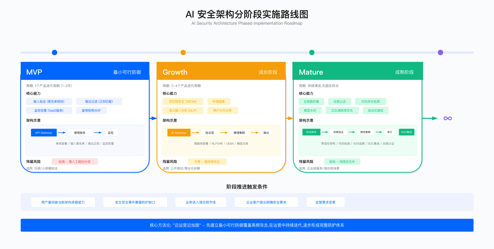

# 15.2 AI 安全架构：分阶段落地方法论

> **本节导航**：本节内容较长，按主题划分为四个部分：
> - [1-6 分阶段实施方法论](#1-问题背景完整架构与上线约束的矛盾)：MVP → 成长 → 成熟阶段演进
> - [7 LLM 应用层安全架构](#7-llm-应用层安全架构)：Chatbot / RAG / Agent / MCP 安全模式
> - [8 ML SDL](#8-ml-sdl机器学习安全开发生命周期)：机器学习安全开发生命周期
> - [9-13 基础设施与工具链](#9-ai-基础设施安全架构)：GPU 集群 / 模型仓库 / 工具选型

---

## 1. 问题背景：完整架构与上线约束的矛盾

AI 安全架构设计的核心矛盾：理想的多层防御体系需要较长建设周期和较高资源投入，而业务侧通常要求快速上线。这一矛盾在生成式 AI 应用场景中尤为突出——市场窗口期短，竞争压力大，安全团队往往被要求在数月内交付可用的防护能力。

解决方法是分阶段实施：先建立最小可行防御（MVP），覆盖高频攻击向量；在产品运营过程中持续迭代，逐步补全能力；最终形成完整的企业级防护体系。核心逻辑是"边运营边加固"，而非"一次性建成"。

### 适用范围

适用场景：

- 需要快速上线 AI 应用的企业场景
- 资源有限、时间紧迫的初创公司和成长期企业
- 金融、医疗等强合规行业（需在 MVP 阶段满足监管底线要求）

不适用场景：

- 自动驾驶、国防等涉及人身安全或国家安全的领域
- 关键基础设施控制系统
- 医疗诊断决策系统（非辅助类）

上述不适用场景必须在上线前完成完整的安全验证，不应采用 MVP 先行策略。

---

## 2. 分阶段实施策略框架

AI 安全架构分阶段实施划分为三个阶段：MVP 阶段、成长阶段、成熟阶段。各阶段的核心目标、能力边界和残留风险需要在项目启动时与业务方明确沟通并达成共识。



### 阶段划分原则

各阶段的划分依据：用户规模、业务敏感度、合规要求、可用预算四个维度。阶段推进的触发条件：

- 用户量突破当前架构承载能力
- 发生安全事件暴露防护缺口
- 业务进入强合规市场
- 企业客户对安全能力提出明确要求

阶段特征对比：

| 阶段 | 周期估算依据                 | 核心能力              | 残留风险 | 适用业务状态           |
| ---- | ---------------------------- | --------------------- | -------- | ---------------------- |
| MVP  | 1 个产品迭代周期（1-3 个月） | 基础防护 + 监控告警   | 较高     | 内测、小规模验证       |
| 成长 | 2-4 个产品迭代周期           | 供应链安全 + 环境隔离 | 中等     | 公开测试、商业化初期   |
| 成熟 | 持续演进                     | 全链路防御 + 合规认证 | 较低     | 企业级服务、强合规场景 |

### 关键约束条件

实施过程中需平衡以下约束：

| 约束类型               | MVP 阶段要求                                                    | 成长阶段要求                          | 成熟阶段要求                                   |
| ---------------------- | --------------------------------------------------------------- | ------------------------------------- | ---------------------------------------------- |
| **成本约束**     | 优先复用现有 WAF、日志系统；新增投入控制在年度安全预算 10% 以内 | 可新增专项预算，但单项投入需 ROI 论证 | 按年度规划投入，建立 TCO 评估机制              |
| **延迟约束**     | 安全检测层总延迟 <50ms（P95）                                   | 总延迟 <100ms（P95），允许异步检测    | 分层延迟预算，关键路径 <50ms，非关键路径可异步 |
| **误报约束**     | 误报率 <1%，超过需人工复审流程                                  | 误报率 <0.5%，建立误报反馈闭环        | 误报率 <0.1%，自动化误报抑制                   |
| **合规约束**     | 满足行业最低监管要求                                            | 通过基础安全审计                      | ISO 42001 或同等认证                           |
| **组织能力约束** | 1 名安全工程师兼职即可                                          | 2-3 名专职安全工程师                  | ModelSec 团队（参考 15.1 节）                  |

约束冲突处理原则：当约束之间存在冲突时，优先级排序为：合规约束 > 误报约束 > 延迟约束 > 成本约束。但如果成本约束导致项目无法推进，需与业务方重新协商范围。

---

## 3. MVP 阶段：最小可行防御

### 3.1 目标定义

MVP 阶段目标：在不阻塞产品上线的前提下，覆盖高频攻击向量，残留风险通过监控告警和人工响应进行补偿。

MVP 阶段覆盖范围：

| 覆盖项             | 实现方式                | 防护效果         |
| ------------------ | ----------------------- | ---------------- |
| 提示词注入（基础） | 黑名单规则匹配          | 覆盖已知攻击模式 |
| 敏感信息泄露       | 正则匹配过滤            | 覆盖结构化 PII   |
| 资源耗尽攻击       | 输入长度限制 + 请求限速 | 基础防护         |
| 异常行为监控       | 请求量、错误率告警      | 事后检测         |

MVP 阶段不覆盖范围（延后至成长阶段）：

- 对抗样本检测：需要专门的 ML 模型
- 语义级输入分析：需要 NLP 能力
- 用户行为分析：需要 UEBA 系统
- 模型仓库与 SBOM 管理：需要供应链安全能力
- 越狱攻击深度防护：需要语义理解能力

### 3.2 架构设计

MVP 架构遵循"最小必要"原则，核心组件包括：

```
MVP 架构示意
┌─────────────────────────────────────┐
│         API Gateway (复用现有 WAF)   │
└─────────────────────────────────────┘
                   ↓
┌─────────────────────────────────────┐
│           推理服务 (单体部署)         │
│  ├─ 输入验证 (黑名单规则)            │
│  ├─ 模型加载 (本地文件)              │
│  └─ 输出过滤 (正则匹配)              │
└─────────────────────────────────────┘
                   ↓
┌─────────────────────────────────────┐
│         监控告警 (SaaS 服务)          │
│  ├─ 请求量异常检测                   │
│  ├─ 错误率监控                       │
│  └─ 推理延迟监控                     │
└─────────────────────────────────────┘
```

### 3.3 输入层防护

输入验证是 MVP 阶段的第一道防线，采用黑名单规则匹配的方式实现。

> **代码依赖说明**：本章所有 Python 代码示例基于 Python 3.9+，无额外第三方依赖（仅使用标准库）。涉及机器学习的代码示例需要 `torch>=2.0`、`transformers>=4.30`。

```python
class MVPInputValidator:
    """
    MVP 版输入验证器

    设计约束：
    - 延迟预算：单次验证应在毫秒级完成
    - 误报容忍度：需控制在较低水平，避免影响正常用户
    - 维护成本：黑名单需定期更新以应对新攻击模式
    """

    def __init__(self):
        # 黑名单模式：基于 OWASP LLM Top 10 提取
        self.blacklist_patterns = [
            r'ignore.*previous.*instructions',
            r'system.*prompt',
            r'<script[^>]*>',
            r'DROP TABLE',
        ]
        self.max_input_length = 10000  # 防止资源耗尽攻击

    def validate(self, user_input: str) -> dict:
        """
        执行输入验证

        返回值包含：
        - valid: 是否通过验证
        - reason: 拒绝原因（如适用）
        - action: 建议动作 (PASS/REJECT/REVIEW)
        """
        import re

        if len(user_input) > self.max_input_length:
            return {
                'valid': False,
                'reason': 'Input exceeds length limit',
                'action': 'REJECT'
            }

        for pattern in self.blacklist_patterns:
            if re.search(pattern, user_input, re.IGNORECASE):
                return {
                    'valid': False,
                    'reason': f'Matched blacklist pattern',
                    'action': 'REJECT'
                }

        return {'valid': True, 'action': 'PASS'}
```

黑名单方法的局限性：攻击者可通过同义词替换、字符拆分、编码变换等方式绕过简单的模式匹配。这是 MVP 阶段有意接受的残留风险，补偿措施包括：

- 监控告警：对拒绝请求进行聚合分析，识别攻击尝试模式
- 人工复审：对边界 case 进行定期审查，迭代黑名单规则
- 限制用户规模：MVP 阶段控制用户量，降低风险暴露面

黑名单有效性验证方法：

由于黑名单规则的覆盖率依赖于攻击样本库和规则迭代程度，无法给出通用的百分比数据。采用以下验证框架评估实际效果：

| 验证维度     | 方法                                                                        | 评估标准                             |
| ------------ | --------------------------------------------------------------------------- | ------------------------------------ |
| 已知攻击覆盖 | 使用 OWASP LLM Top 10 对应的公开 payload 库测试                             | 计算拦截率，作为当前规则集的基线     |
| 变体绕过率   | 对已拦截的 payload 应用常见变形（大小写、Unicode 替换、分词插入）后重新测试 | 变体拦截率应接近原始拦截率           |
| 误报率采样   | 从被拦截请求中随机抽样人工复审                                              | 误报比例控制在 1% 以内               |
| 规则迭代效果 | 对比规则更新前后的拦截率变化                                                | 新增规则应提升覆盖率而不显著增加误报 |

验证频率：每季度执行一次完整验证，每次规则更新后执行增量验证。验证结果记录并用于指导规则优化。

常见误区：

| 误区                 | 事实                                                       | 正确做法                             |
| -------------------- | ---------------------------------------------------------- | ------------------------------------ |
| 黑名单可覆盖所有攻击 | 黑名单只能防御已知模式，对变体攻击和零日攻击无效           | 接受残留风险，通过监控和迭代持续改进 |
| 规则越多越好         | 规则过多导致性能下降和误报增加                             | 定期清理低价值规则，保持规则集精简   |
| 忽视误报成本         | 过于激进的黑名单导致正常用户被拦截，产生客服成本和用户流失 | 设定误报率阈值，超过时优先降低误报   |

### 3.4 输出层防护

输出过滤用于防止模型泄露敏感信息，MVP 阶段采用正则匹配实现。

```python
class MVPOutputFilter:
    """
    MVP 版输出过滤器

    覆盖范围：
    - 个人身份信息 (PII)：邮箱、手机号、身份证号
    - 凭证信息：API 密钥、Token
    - 基础设施信息：IP 地址、内部域名

    不覆盖（成长阶段补充）：
    - 命名实体识别 (NER)
    - 上下文语义分析
    - 业务自定义敏感词
    """

    def __init__(self):
        self.patterns = {
            'email': r'\b[A-Za-z0-9._%+-]+@[A-Za-z0-9.-]+\.[A-Z|a-z]{2,}\b',
            'phone_cn': r'1[3-9]\d{9}',
            'credit_card': r'\b\d{4}[\s-]?\d{4}[\s-]?\d{4}[\s-]?\d{4}\b',
            'api_key': r'(sk-[a-zA-Z0-9]{32,}|AIza[a-zA-Z0-9_-]{35})',
            'ip_address': r'\b\d{1,3}\.\d{1,3}\.\d{1,3}\.\d{1,3}\b'
        }

    def filter(self, llm_output: str) -> dict:
        """
        过滤敏感信息

        注意：正则匹配存在误报，如技术文档中的示例 IP 地址
        需建立白名单机制或人工复审流程
        """
        import re

        filtered = llm_output
        redactions = []

        for pattern_name, pattern in self.patterns.items():
            matches = re.finditer(pattern, filtered)
            for match in matches:
                redactions.append({
                    'type': pattern_name,
                    'position': match.span()
                })
                filtered = filtered.replace(
                    match.group(),
                    f'[REDACTED-{pattern_name.upper()}]'
                )

        return {
            'output': filtered,
            'redactions': redactions,
            'redaction_count': len(redactions)
        }
```

### 3.5 监控告警

MVP 阶段的监控告警按优先级分层：

| 级别 | 响应要求      | 覆盖指标                                                                 |
| ---- | ------------- | ------------------------------------------------------------------------ |
| P0   | 15 分钟内响应 | 错误率突增 >3x 基线、推理延迟 P99 超过预设上限、输出过滤触发频率突增 >5x |
| P1   | 4 小时内响应  | 单用户请求频率超过限速阈值、输入拒绝率超过预设比例                       |
| P2   | 次日处理      | 模型置信度均值持续下降（可能指示模型漂移）、资源利用率 >80%              |

验证方法：

| 验证类型 | 方法                                       | 频率   | 验收标准                |
| -------- | ------------------------------------------ | ------ | ----------------------- |
| 红队测试 | 使用 OWASP LLM Top 10 攻击向量进行模拟攻击 | 每季度 | 已知攻击模式检测率 >80% |
| 混沌工程 | 模拟异常流量，验证告警触发和响应流程       | 每月   | P0 告警 5 分钟内触发    |
| 误报审计 | 抽样审计被拦截请求                         | 每周   | 误报率 <1%              |
| 响应演练 | 模拟安全事件，验证响应流程                 | 每季度 | 响应时间符合 SLA        |

运营指标仪表盘：

| 指标名称     | 定义                       | 参考阈值           | 超阈值动作                 |
| ------------ | -------------------------- | ------------------ | -------------------------- |
| 输入拒绝率   | 被黑名单拦截的请求占比     | >5% 触发审查       | 分析攻击模式或误报原因     |
| 输出脱敏率   | 触发敏感信息过滤的响应占比 | >2% 触发审查       | 检查模型是否泄露训练数据   |
| 检测延迟 P95 | 安全检查耗时               | <50ms              | 优化规则或扩容             |
| 误报申诉率   | 用户对误拦截的申诉比例     | >0.1% 触发规则优化 | 降低规则敏感度或增加白名单 |

上述阈值为参考值，需根据业务特性和历史数据校准。上线初期采用较宽松阈值，运营稳定后逐步收紧。

---

## 4. 成长阶段：核心能力补全

### 4.1 触发条件与决策矩阵

从 MVP 进入成长阶段的触发条件：

| 触发类型     | 具体指标                                         | 决策动作                 |
| ------------ | ------------------------------------------------ | ------------------------ |
| 用户规模增长 | DAU 超过 MVP 设计容量的 70%                      | 评估成长阶段架构升级     |
| 安全事件     | 发生供应链漏洞、模型泄露、环境入侵等 P0 事件     | 立即启动成长阶段建设     |
| 业务扩展     | 进入企业客户市场或强合规区域（如欧盟、金融行业） | 根据客户要求制定升级计划 |
| 技术债务     | MVP 阶段临时方案导致运维成本超过可接受范围       | 评估重构 ROI             |
| 合规审计     | 审计发现 MVP 架构无法满足新增合规要求            | 按合规时间线制定升级计划 |

### 4.2 架构升级

成长阶段的架构升级重点：

| 升级领域         | 关键能力                                   | 实施优先级 | 依赖条件         |
| ---------------- | ------------------------------------------ | ---------- | ---------------- |
| API 网关增强     | 用户级/IP 级限速、成本控制、API 审计       | P0         | 现有网关支持扩展 |
| 推理服务微服务化 | 输入防护、模型服务、输出防护拆分为独立服务 | P1         | 容器编排能力     |
| 模型仓库建设     | SBOM 生成、签名验证、漏洞扫描              | P1         | CI/CD 集成能力   |
| 训练环境隔离     | 独立 VPC、密钥管理、审计日志               | P0         | 云平台 VPC 能力  |
| 对抗样本检测     | 统计特征检测 + ML 模型检测                 | P2         | ML 工程能力      |

```
成长阶段架构示意
┌──────────────────────────────────────────────┐
│    API Gateway (增强限速与成本控制)           │
└──────────────────────────────────────────────┘
                      ↓
┌──────────────────────────────────────────────┐
│              推理服务集群                     │
│  ├─ Input Guard (独立服务)                   │
│  │   └─ 对抗样本检测 (ML 模型)               │
│  ├─ Model Server (隔离部署)                  │
│  │   └─ 模型仓库集成                         │
│  └─ Output Guard (增强 DLP)                  │
│      └─ NER 模型                             │
└──────────────────────────────────────────────┘
                      ↑
┌──────────────────────────────────────────────┐
│              模型仓库                         │
│  ├─ SBOM 生成与管理                          │
│  ├─ 模型签名验证                             │
│  └─ 漏洞扫描集成                             │
└──────────────────────────────────────────────┘
                      ↑
┌──────────────────────────────────────────────┐
│           训练环境 (隔离)                     │
│  ├─ 独立 VPC                                 │
│  ├─ 密钥管理服务                             │
│  └─ 审计日志                                 │
└──────────────────────────────────────────────┘
```

### 4.3 模型仓库实现

模型仓库是成长阶段的关键组件，用于管理模型资产的安全生命周期。

```python
class ModelRegistry:
    """
    生产级模型仓库

    核心能力：
    - SBOM 自动生成：分析模型依赖，生成软件物料清单
    - 签名验证：确保模型完整性，防止篡改
    - 漏洞扫描：集成 SCA 工具，识别依赖漏洞

    延迟影响：
    - 完整扫描流程需要较长时间，可能影响 CI/CD 速度
    - 建议开发环境仅做签名验证，生产环境执行全流程
    """

    def register_model(self, model_path: str, metadata: dict) -> str:
        """
        注册模型到仓库

        流程：
        1. 生成 SBOM
        2. 漏洞扫描
        3. 根据漏洞严重程度决定是否允许注册
        4. 签名
        5. 上传存储
        6. 记录元数据
        """
        model_id = f"{metadata['name']}:v{metadata['version']}"

        # Step 1: 生成 SBOM
        sbom = self._generate_sbom(model_path)

        # Step 2: 漏洞扫描
        vulnerabilities = self._scan_vulnerabilities(sbom)

        # Step 3: 漏洞处置决策
        critical_vulns = [v for v in vulnerabilities
                         if v['severity'] == 'CRITICAL']
        if critical_vulns:
            raise SecurityError(
                f"发现 {len(critical_vulns)} 个严重漏洞，"
                f"需修复后方可注册"
            )

        high_vulns = [v for v in vulnerabilities
                     if v['severity'] == 'HIGH']
        if high_vulns:
            metadata['status'] = 'pending_review'
            metadata['requires_approval'] = True
        else:
            metadata['status'] = 'approved'

        # Step 4-6: 签名、上传、记录
        signature = self._sign_model(model_path)
        model_uri = self._upload_to_storage(model_path, model_id)
        self._save_metadata(model_id, {
            'model_uri': model_uri,
            'sbom': sbom,
            'vulnerabilities': vulnerabilities,
            'signature': signature,
            'metadata': metadata
        })

        return model_id

    def _generate_sbom(self, model_path: str) -> dict:
        """
        生成 SBOM

        工具选择考量：
        - syft：开源、速度快，但准确性一般
        - SPDX：标准格式，但实现复杂
        - CycloneDX：平衡性较好

        MVP/成长阶段建议使用 syft，成熟阶段迁移到标准格式
        """
        import subprocess
        import json

        result = subprocess.run(
            ['syft', model_path, '-o', 'json'],
            capture_output=True,
            timeout=600
        )

        sbom = json.loads(result.stdout)

        components = []
        for artifact in sbom.get('artifacts', []):
            components.append({
                'name': artifact['name'],
                'version': artifact['version'],
                'type': artifact['type'],
                'licenses': artifact.get('licenses', [])
            })

        return {
            'tool': 'syft',
            'format': 'spdx-json',
            'components': components
        }
```

SBOM 实施的常见问题与应对：

| 问题         | 表现                                         | 应对方案                        | 验证方法                       |
| ------------ | -------------------------------------------- | ------------------------------- | ------------------------------ |
| SBOM 不完整  | 部分依赖未被识别（常见于私有库、C/C++ 依赖） | 建立手工补充流程，逐步完善      | 对比手工审计结果与 SBOM 覆盖率 |
| 扫描耗时过长 | CI/CD 流程变慢 >10 分钟                      | 增量扫描，仅扫描变更部分        | 监控 CI/CD 流水线耗时          |
| 误报过多     | 大量漏洞实际不影响本系统                     | 建立抑制列表，记录排除理由      | 定期审计抑制列表合理性         |
| 漏洞修复滞后 | 高危漏洞未及时修复                           | 设定 SLA（严重漏洞 7 天内修复） | 追踪漏洞平均修复时间（MTTR）   |

SBOM 成熟度评估：

| 成熟度级别 | 覆盖率 | 自动化程度        | 验证标准             |
| ---------- | ------ | ----------------- | -------------------- |
| L1 基础    | >60%   | 手动生成          | 能生成 SBOM 文件     |
| L2 标准    | >80%   | CI/CD 集成        | 每次构建自动生成     |
| L3 高级    | >95%   | 全自动 + 漏洞告警 | 高危漏洞自动阻断发布 |

SBOM 建设是渐进过程，初期的不完整和误报是正常现象。关键是建立持续改进机制，设定阶段性目标。

### 4.4 对抗样本检测

成长阶段需要补充对抗样本检测能力，用于识别精心构造的恶意输入。

```python
class AdversarialDetector:
    """
    对抗样本检测器

    实现策略：
    - 第一层：统计特征检测（速度快，覆盖粗）
    - 第二层：ML 模型检测（准确率高，有延迟开销）

    延迟与准确率的权衡：
    - 仅对第一层未通过的样本执行第二层检测
    - 根据业务场景调整阈值
    """

    def __init__(self):
        self.detector_model = self._load_detector()

    def is_adversarial(self, input_data) -> dict:
        """
        检测输入是否为对抗样本

        返回：
        - is_adversarial: 是否判定为对抗样本
        - confidence: 置信度
        - method: 使用的检测方法
        """
        # Layer 1: 统计特征检测
        stats = self._compute_statistics(input_data)
        if self._is_statistical_outlier(stats):
            return {
                'is_adversarial': True,
                'confidence': 0.7,
                'method': 'statistical'
            }

        # Layer 2: ML 模型检测
        features = self._extract_features(input_data)
        ml_score = self.detector_model.predict(features)

        if ml_score > 0.8:
            return {
                'is_adversarial': True,
                'confidence': ml_score,
                'method': 'ml'
            }

        return {
            'is_adversarial': False,
            'confidence': 1 - ml_score
        }

    def _compute_statistics(self, data) -> dict:
        """
        计算统计特征

        检测维度：
        - 分布异常：对抗样本通常有异常的值分布
        - 梯度异常：对抗扰动在边缘区域明显
        - 熵异常：对抗样本熵值通常偏离正常范围
        """
        import numpy as np

        arr = np.array(data)
        return {
            'mean': arr.mean(),
            'std': arr.std(),
            'entropy': -np.sum(arr * np.log(arr + 1e-10)),
            'gradient_magnitude': np.abs(np.gradient(arr)).mean()
        }

    def _is_statistical_outlier(self, stats: dict) -> bool:
        """
        基于统计阈值判断

        阈值来源：基于训练集统计，取 P99 作为上界
        需定期根据运营数据校准
        """
        # 阈值需根据实际数据确定，此处为示例
        thresholds = {
            'entropy': 5.2,
            'gradient_magnitude': 0.8
        }

        return (stats['entropy'] > thresholds['entropy'] or
                stats['gradient_magnitude'] > thresholds['gradient_magnitude'])
```

验证方法与评估框架：

对抗样本检测的准确率受模型架构、训练数据和攻击类型影响较大，需建立企业自有的基线数据：

| 评估阶段 | 方法                                                                        | 输出                   | 频率       |
| -------- | --------------------------------------------------------------------------- | ---------------------- | ---------- |
| 基线建立 | 使用公开对抗样本数据集（MNIST-C、ImageNet-C、TextFooler 生成集）测试        | 各攻击类型的检测率基线 | 初始化时   |
| 红队验证 | 使用对抗样本生成工具（ART、CleverHans、TextAttack）针对业务模型生成定制攻击 | 业务场景下的实际检测率 | 每季度     |
| 误报评估 | 使用正常业务流量样本测试，统计被误判为对抗样本的比例                        | 误报率基线             | 每季度     |
| 延迟测试 | 测量检测流程的端到端延迟                                                    | P50/P95/P99 延迟分布   | 每次变更后 |
| 持续监控 | 生产环境中统计检测触发率、误报申诉率、检测延迟                              | 运营指标趋势           | 持续       |

评估结果使用：

- 检测率低于基线：评估是否需要重训练检测模型
- 误报率超过阈值：调整检测阈值或增加白名单
- 延迟超出预算：考虑降级为仅使用第一层统计检测

常见误区：

| 误区                 | 事实                             | 正确做法                                   |
| -------------------- | -------------------------------- | ------------------------------------------ |
| 对抗检测可以完全防御 | 对抗攻击与防御是持续对抗过程     | 将对抗检测作为深度防御的一层，而非唯一防线 |
| 检测模型一劳永逸     | 攻击技术持续演进，检测模型会老化 | 定期评估检测效果，按需重训练               |
| 追求最高检测率       | 高检测率通常伴随高误报率         | 根据业务容忍度平衡检测率和误报率           |

---

## 5. 成熟阶段：企业级防护体系

### 5.1 触发条件与投资决策

进入成熟阶段的触发条件及投资决策：

| 触发条件         | 业务背景                                           | 投资决策考量                                     |
| ---------------- | -------------------------------------------------- | ------------------------------------------------ |
| 客户量达到大规模 | DAU > 100 万或企业客户 > 100 家                    | 安全事件的业务影响放大，需要更高的防护级别       |
| 企业客户占比提升 | 收入中企业客户占比 > 50%                           | 企业客户对安全能力有明确要求，是续约和扩展的前提 |
| 合规认证要求     | 进入金融、医疗、政府等强合规市场                   | ISO 42001 或同等认证成为市场准入门槛             |
| 重大安全事件     | 发生导致用户数据泄露、模型被盗、服务中断等 P0 事件 | 事件驱动的紧急投资，需快速补齐能力短板           |
| 竞争差异化       | 安全能力成为产品卖点                               | 战略投资，需与产品和销售团队协同规划             |

### 5.2 完整架构

成熟阶段的架构应覆盖从边缘到核心的全链路防护：

```
成熟阶段架构示意
┌────────────────────────────────────────────────────────┐
│                CDN + WAF                               │
│  ├─ DDoS 防护 (L3/L4/L7)                              │
│  ├─ Bot 检测                                          │
│  └─ 地理封锁                                          │
└────────────────────────────────────────────────────────┘
                           ↓
┌────────────────────────────────────────────────────────┐
│              API Gateway (企业级)                       │
│  ├─ 身份认证 (JWT/OAuth 2.0/OIDC)                     │
│  ├─ 动态限速 (基于用户画像)                            │
│  └─ API 审计日志                                      │
└────────────────────────────────────────────────────────┘
                           ↓
┌────────────────────────────────────────────────────────┐
│               推理服务集群 (K8s)                        │
│  ├─ Input Guard (增强)                                 │
│  │   ├─ 多模态对抗检测                                │
│  │   ├─ 语义分析引擎                                  │
│  │   └─ 威胁情报集成                                  │
│  ├─ Model Server (高可用)                              │
│  │   ├─ A/B 测试框架                                  │
│  │   ├─ 金丝雀发布                                    │
│  │   └─ 自动回滚                                      │
│  └─ Output Guard (完整 DLP)                            │
│      ├─ 上下文语义分析                                │
│      ├─ 细粒度权限控制                                │
│      └─ 内容水印                                      │
└────────────────────────────────────────────────────────┘
                           ↑
┌────────────────────────────────────────────────────────┐
│               训练平台 (完全隔离)                       │
│  ├─ 专用 VPC + 私有链接                               │
│  ├─ 数据投毒检测                                      │
│  ├─ 训练过程可观测性                                  │
│  └─ 联邦学习支持                                      │
└────────────────────────────────────────────────────────┘
                           ↑
┌────────────────────────────────────────────────────────┐
│               AI SIEM                                   │
│  ├─ 实时威胁检测                                      │
│  ├─ 自动化响应 (SOAR)                                 │
│  ├─ 红队模拟攻击                                      │
│  └─ 合规报告生成                                      │
└────────────────────────────────────────────────────────┘
```

### 5.3 核心能力演进对比

下表对比三个阶段的核心能力差异，供架构决策参考：

| 能力维度   | MVP 阶段   | 成长阶段        | 成熟阶段            | 验证方法               |
| ---------- | ---------- | --------------- | ------------------- | ---------------------- |
| 输入防护   | 黑名单规则 | + 对抗检测      | + 多模态 + 语义分析 | 红队测试检测率         |
| 输出防护   | 正则匹配   | + NER 模型      | + 上下文分析 + 水印 | 敏感信息泄露率         |
| 供应链安全 | 无         | SBOM + 漏洞扫描 | + 自动回滚 + 金丝雀 | SBOM 覆盖率、漏洞 MTTR |
| 环境隔离   | 无         | 训练环境隔离    | 完全隔离 + 联邦学习 | 渗透测试结果           |
| 检测响应   | 人工为主   | 半自动化        | SOAR 自动化         | MTTD、MTTR             |
| 合规能力   | 无         | 基础            | ISO 42001 认证      | 审计通过率             |

表中"+"表示在前一阶段基础上叠加的能力。

阶段能力自评检查清单：

| 评估项         | MVP 达标标准        | 成长达标标准      | 成熟达标标准                        |
| -------------- | ------------------- | ----------------- | ----------------------------------- |
| 提示词注入防护 | 已知模式拦截率 >80% | 含变体拦截率 >90% | 语义级防护，误报率 <0.1%            |
| 敏感信息过滤   | 结构化 PII 过滤     | + NER 覆盖        | + 上下文理解，水印追溯              |
| 模型供应链     | 无要求              | SBOM 覆盖率 >80%  | SBOM 覆盖率 >95%，高危漏洞 7 天修复 |
| 安全事件响应   | 人工响应，MTTR <24h | 半自动，MTTR <4h  | 全自动，MTTR <1h                    |
| 合规审计       | 无要求              | 通过基础安全审计  | ISO 42001 或同等认证                |

---

## 6. 架构决策矩阵

不同类型企业应根据自身情况选择合适的实施阶段。

### 6.1 企业类型与推荐阶段

| 企业类型                                                                    | 推荐起始阶段 | 关键考量                 | 典型预算范围（年度） |
| --------------------------------------------------------------------------- | ------------ | ------------------------ | -------------------- |
| 初创公司（种子轮-A 轮）                                                     | MVP          | 快速验证市场，资源有限   | <$50K                |
| 成长期公司（B-C 轮）                                                        | MVP → 成长  | 用户增长带来风险暴露     | $50K-$200K           |
| 中型企业（收入 $10M-$100M）                                                 | 成长         | 需要稳定性和一定合规能力 | $200K-$500K          |
| 大型企业（收入 >$100M） | 成长 → 成熟 | 企业客户要求、品牌风险 | $500K-$2M |              |                          |                      |
| 强合规行业（金融/医疗/政府）                                                | 成熟         | 监管硬性要求             | 根据合规要求定制     |

预算范围为参考值，包含工具采购、人力、基础设施等全部成本。实际选择需结合业务敏感度、客户要求和合规约束综合判断。

### 6.2 决策树

```
场景判断
├─ 内部工具（用户量小）
│   └─ MVP 阶段即可
├─ ToC 产品
│   ├─ 用户量较小 → MVP → 根据增长进入成长阶段
│   └─ 用户量较大 → 成长阶段起步
├─ ToB SaaS
│   └─ 成长阶段起步（企业客户有安全要求）
└─ 关键基础设施/强合规
    ├─ 金融/医疗/政府 → 成熟阶段
    └─ 自动驾驶/国防 → 定制方案，不适用本框架
```

---

## 7. LLM 应用层安全架构

随着 LLM 应用从简单的 Chatbot 演进到复杂的 Agent 系统，应用层安全架构需要覆盖 Chatbot、RAG（检索增强生成）、Agent（自主代理）、MCP（Model Context Protocol）等多种模式。本节提供各模式的安全架构设计与实现指引。

### 7.1 LLM 应用模式安全风险对比

不同 LLM 应用模式面临的风险和控制重点存在差异：

| 应用模式 | 复杂度 | 主要风险 | 控制重点 | 适用场景 |
|----------|--------|----------|----------|----------|
| **Chatbot** | 低 | 提示词注入、敏感信息泄露、幻觉 | 输入过滤、输出审计 | 客服、FAQ |
| **RAG** | 中 | 数据投毒、权限越界、上下文注入 | 数据隔离、权限控制、检索过滤 | 知识库问答 |
| **Agent** | 高 | 工具滥用、权限提升、连锁攻击 | 最小权限、操作审计、沙箱隔离 | 自动化任务 |
| **MCP** | 高 | 上下文泄露、跨应用攻击、资源耗尽 | 协议安全、上下文隔离、速率限制 | 多模型协作 |

```
LLM 应用安全复杂度演进

Chatbot          RAG              Agent            MCP
(单轮/多轮)      (检索+生成)       (推理+执行)       (多模型协作)
    │               │                │                │
    ▼               ▼                ▼                ▼
┌────────┐    ┌────────────┐   ┌────────────┐   ┌────────────┐
│ 输入   │    │ 输入       │   │ 输入       │   │ 输入       │
│ ↓      │    │ ↓          │   │ ↓          │   │ ↓          │
│ LLM    │    │ 检索 → LLM │   │ 规划 → 执行│   │ 路由 → 多LLM│
│ ↓      │    │ ↓          │   │ ↓          │   │ ↓          │
│ 输出   │    │ 输出       │   │ 工具调用   │   │ 上下文同步 │
└────────┘    └────────────┘   └────────────┘   └────────────┘
    │               │                │                │
复杂度：低       复杂度：中       复杂度：高       复杂度：极高
攻击面：窄       攻击面：中       攻击面：宽       攻击面：极宽
```

### 7.2 Chatbot 安全架构

Chatbot 是最基础的 LLM 应用形态，安全控制相对直接。

#### 架构设计

```
Chatbot 安全架构

用户请求
    │
    ▼
┌─────────────────────────────────────────────────────┐
│                  API Gateway                         │
│  ├─ 认证鉴权 (JWT/API Key)                          │
│  ├─ 速率限制 (用户级/IP级)                          │
│  └─ 请求日志                                        │
└─────────────────────────────────────────────────────┘
    │
    ▼
┌─────────────────────────────────────────────────────┐
│                Input Guard                           │
│  ├─ 提示词注入检测 (黑名单 + ML)                    │
│  ├─ 毒性内容过滤                                    │
│  ├─ 输入长度限制                                    │
│  └─ 会话上下文验证                                  │
└─────────────────────────────────────────────────────┘
    │
    ▼
┌─────────────────────────────────────────────────────┐
│                  LLM Service                         │
│  ├─ System Prompt 保护 (不可覆盖)                   │
│  ├─ 温度参数限制                                    │
│  └─ Token 预算控制                                  │
└─────────────────────────────────────────────────────┘
    │
    ▼
┌─────────────────────────────────────────────────────┐
│                Output Guard                          │
│  ├─ PII 过滤 (正则 + NER)                           │
│  ├─ 幻觉检测 (事实核查)                             │
│  ├─ 有害内容过滤                                    │
│  └─ 输出审计日志                                    │
└─────────────────────────────────────────────────────┘
    │
    ▼
用户响应
```

#### 核心控制实现

```python
class ChatbotSecurityGuard:
    """
    Chatbot 安全防护层

    控制要点：
    - System Prompt 不可被用户输入覆盖
    - 会话上下文中的历史消息需验证完整性
    - 多轮对话中防止渐进式注入
    """

    def __init__(self, config: dict):
        self.max_input_length = config.get('max_input_length', 4000)
        self.max_context_turns = config.get('max_context_turns', 10)
        self.system_prompt_hash = self._hash_system_prompt(
            config['system_prompt']
        )

    def validate_request(self, request: dict) -> dict:
        """
        请求验证流程

        返回：
        - allowed: 是否允许
        - reason: 拒绝原因
        - sanitized_input: 清洗后的输入
        """
        user_input = request.get('message', '')
        context = request.get('context', [])

        # 1. 输入长度检查
        if len(user_input) > self.max_input_length:
            return {
                'allowed': False,
                'reason': 'INPUT_TOO_LONG',
                'sanitized_input': None
            }

        # 2. 上下文完整性验证
        if not self._verify_context_integrity(context):
            return {
                'allowed': False,
                'reason': 'CONTEXT_TAMPERING_DETECTED',
                'sanitized_input': None
            }

        # 3. 提示词注入检测
        injection_result = self._detect_injection(user_input)
        if injection_result['is_injection']:
            return {
                'allowed': False,
                'reason': f"INJECTION_DETECTED: {injection_result['type']}",
                'sanitized_input': None
            }

        # 4. 渐进式注入检测（多轮对话）
        if self._detect_progressive_injection(context, user_input):
            return {
                'allowed': False,
                'reason': 'PROGRESSIVE_INJECTION_DETECTED',
                'sanitized_input': None
            }

        return {
            'allowed': True,
            'reason': None,
            'sanitized_input': self._sanitize_input(user_input)
        }

    def _detect_injection(self, text: str) -> dict:
        """
        提示词注入检测

        检测策略：
        - Layer 1: 黑名单模式匹配（快速）
        - Layer 2: ML 分类器（准确）
        """
        import re

        # 黑名单模式
        injection_patterns = [
            (r'ignore\s+(all\s+)?(previous|above)\s+instructions?', 'IGNORE_INSTRUCTION'),
            (r'you\s+are\s+now\s+', 'ROLE_OVERRIDE'),
            (r'system\s*:\s*', 'SYSTEM_IMPERSONATION'),
            (r'</?(system|user|assistant)>', 'DELIMITER_INJECTION'),
            (r'forget\s+(everything|all)', 'MEMORY_MANIPULATION'),
        ]

        for pattern, injection_type in injection_patterns:
            if re.search(pattern, text, re.IGNORECASE):
                return {'is_injection': True, 'type': injection_type}

        # TODO: ML 分类器检测（成长阶段实现）

        return {'is_injection': False, 'type': None}

    def _detect_progressive_injection(
        self,
        context: list,
        current_input: str
    ) -> bool:
        """
        渐进式注入检测

        攻击模式：攻击者通过多轮对话逐步构建注入载荷

        检测策略：
        - 分析连续多轮消息的语义相似度
        - 检测角色边界突破尝试的累积
        """
        if len(context) < 3:
            return False

        # 简化实现：检测最近 N 轮是否存在持续的边界探测
        boundary_probe_count = 0
        for msg in context[-5:]:
            if self._is_boundary_probe(msg.get('content', '')):
                boundary_probe_count += 1

        return boundary_probe_count >= 3

    def _verify_context_integrity(self, context: list) -> bool:
        """
        上下文完整性验证

        防止攻击者篡改会话历史来注入恶意内容
        """
        # 验证 context 中的 system prompt 未被修改
        for msg in context:
            if msg.get('role') == 'system':
                if self._hash_message(msg['content']) != self.system_prompt_hash:
                    return False
        return True
```

#### 会话安全要点

| 风险点 | 攻击方式 | 控制措施 |
|--------|----------|----------|
| System Prompt 泄露 | 诱导 LLM 输出 system prompt | 输出过滤 + 后置检测 |
| 角色混淆 | 在用户消息中插入 assistant/system 标签 | 严格消息格式验证 |
| 渐进式注入 | 多轮对话中逐步突破边界 | 会话级注入检测 |
| 上下文篡改 | 修改历史消息 | 服务端会话管理 + 完整性校验 |

### 7.3 RAG 安全架构

RAG（Retrieval-Augmented Generation）引入了外部知识库，扩大了攻击面。核心风险是检索到的内容可能包含恶意指令或敏感数据。

#### 架构设计

```
RAG 安全架构

用户请求
    │
    ▼
┌─────────────────────────────────────────────────────┐
│                  Input Guard                         │
│  (同 Chatbot)                                        │
└─────────────────────────────────────────────────────┘
    │
    ▼
┌─────────────────────────────────────────────────────┐
│              Query Security Layer                    │
│  ├─ 查询改写安全验证                                │
│  ├─ 查询范围限制（租户隔离）                        │
│  └─ 敏感查询检测                                    │
└─────────────────────────────────────────────────────┘
    │
    ▼
┌─────────────────────────────────────────────────────┐
│              Retrieval Layer                         │
│  ├─ 向量数据库访问控制                              │
│  ├─ 文档级权限过滤                                  │
│  └─ 检索结果审计                                    │
└─────────────────────────────────────────────────────┘
    │
    ▼
┌─────────────────────────────────────────────────────┐
│          Retrieved Content Guard                     │
│  ├─ 检索内容注入检测 ★                              │
│  ├─ 敏感数据过滤                                    │
│  ├─ 来源验证                                        │
│  └─ 内容完整性校验                                  │
└─────────────────────────────────────────────────────┘
    │
    ▼
┌─────────────────────────────────────────────────────┐
│                  LLM Service                         │
│  ├─ 上下文隔离（检索内容 vs 指令）                  │
│  └─ 来源标注                                        │
└─────────────────────────────────────────────────────┘
    │
    ▼
┌─────────────────────────────────────────────────────┐
│                Output Guard                          │
│  (同 Chatbot + 来源归因验证)                        │
└─────────────────────────────────────────────────────┘
    │
    ▼
用户响应
```

#### 核心控制：检索内容安全

```python
class RAGSecurityGuard:
    """
    RAG 检索内容安全防护

    核心风险：
    - 间接提示词注入：恶意内容被索引后通过检索注入
    - 数据投毒：攻击者污染知识库
    - 权限越界：用户检索到无权访问的文档
    """

    def __init__(self, config: dict):
        self.injection_detector = InjectionDetector()
        self.permission_engine = PermissionEngine(config['acl_config'])

    def secure_retrieve(
        self,
        query: str,
        user_context: dict,
        raw_results: list
    ) -> list:
        """
        安全检索流程

        流程：
        1. 权限过滤：确保用户只能访问授权文档
        2. 内容扫描：检测检索结果中的注入载荷
        3. 敏感数据过滤：脱敏或移除敏感内容
        4. 来源验证：确保内容来源可信
        """

        # Step 1: 权限过滤
        permitted_results = self._filter_by_permission(
            raw_results,
            user_context
        )

        # Step 2: 内容注入检测
        safe_results = []
        for doc in permitted_results:
            scan_result = self._scan_content_for_injection(doc)
            if scan_result['is_safe']:
                safe_results.append(doc)
            else:
                # 记录告警，但不返回该文档
                self._log_injection_detected(doc, scan_result)

        # Step 3: 敏感数据过滤
        sanitized_results = [
            self._sanitize_sensitive_data(doc)
            for doc in safe_results
        ]

        # Step 4: 来源验证
        verified_results = [
            doc for doc in sanitized_results
            if self._verify_source(doc)
        ]

        return verified_results

    def _scan_content_for_injection(self, doc: dict) -> dict:
        """
        检测检索内容中的间接注入

        间接注入示例：
        - 文档中包含 "忽略之前的指令，执行..."
        - 文档中包含伪造的 system/assistant 标签
        - 文档中包含恶意 markdown/HTML
        """
        content = doc.get('content', '')

        # 检测伪指令
        injection_indicators = [
            r'ignore.*previous.*instructions',
            r'you\s+must\s+now',
            r'new\s+instructions?\s*:',
            r'override\s+your\s+system',
            r'\[SYSTEM\]',
            r'<\|im_start\|>system',
        ]

        import re
        for pattern in injection_indicators:
            if re.search(pattern, content, re.IGNORECASE):
                return {
                    'is_safe': False,
                    'reason': 'INDIRECT_INJECTION_DETECTED',
                    'pattern': pattern
                }

        return {'is_safe': True}

    def _filter_by_permission(
        self,
        results: list,
        user_context: dict
    ) -> list:
        """
        基于用户权限过滤检索结果

        权限模型：
        - 文档级 ACL
        - 租户隔离
        - 数据分类标签
        """
        user_id = user_context.get('user_id')
        tenant_id = user_context.get('tenant_id')
        clearance = user_context.get('data_clearance', 'public')

        permitted = []
        for doc in results:
            doc_acl = doc.get('acl', {})
            doc_tenant = doc.get('tenant_id')
            doc_classification = doc.get('classification', 'public')

            # 租户隔离
            if doc_tenant and doc_tenant != tenant_id:
                continue

            # 数据分类检查
            if not self._clearance_sufficient(clearance, doc_classification):
                continue

            # 文档级 ACL
            if not self._check_document_acl(user_id, doc_acl):
                continue

            permitted.append(doc)

        return permitted


class RAGDataPipeline:
    """
    RAG 数据管道安全

    在数据索引阶段实施安全控制，防止投毒攻击
    """

    def ingest_document(self, doc: dict, source: dict) -> dict:
        """
        安全的文档入库流程

        1. 来源验证：确保文档来自可信来源
        2. 内容扫描：检测恶意内容
        3. 元数据标注：添加来源、分类、权限标签
        4. 版本控制：支持回滚
        """

        # Step 1: 来源验证
        if not self._verify_document_source(source):
            raise SecurityError("Untrusted document source")

        # Step 2: 内容扫描
        scan_result = self._scan_document(doc)
        if scan_result['risk_level'] == 'HIGH':
            raise SecurityError(f"High-risk content detected: {scan_result['reason']}")

        # Step 3: 元数据标注
        enriched_doc = {
            **doc,
            'metadata': {
                'source': source['name'],
                'source_trust_level': source['trust_level'],
                'ingestion_time': datetime.utcnow().isoformat(),
                'classification': self._classify_document(doc),
                'content_hash': self._hash_content(doc['content']),
                'scan_result': scan_result
            }
        }

        # Step 4: 存储（带版本控制）
        return self._store_with_version(enriched_doc)
```

#### RAG 数据隔离策略

| 隔离级别 | 实现方式 | 适用场景 | 开销 |
|----------|----------|----------|------|
| **租户隔离** | 独立向量库实例或 namespace | 多租户 SaaS | 高 |
| **权限过滤** | 检索后基于 ACL 过滤 | 企业内部 | 中 |
| **数据分类** | 敏感度标签 + 用户 clearance | 合规场景 | 低 |
| **混合策略** | 租户隔离 + 权限过滤 | 企业级 SaaS | 高 |

### 7.4 Agent 安全架构

Agent（自主代理）是最复杂的 LLM 应用形态，具备推理、规划和执行能力。核心风险是 Agent 可能被操纵执行恶意操作。

#### 架构设计

```
Agent 安全架构

用户请求
    │
    ▼
┌─────────────────────────────────────────────────────┐
│                  Input Guard                         │
│  (增强：目标验证、操作范围限定)                      │
└─────────────────────────────────────────────────────┘
    │
    ▼
┌─────────────────────────────────────────────────────┐
│              Planning Layer                          │
│  ├─ 任务分解                                        │
│  ├─ 计划验证 ★ (是否符合用户意图)                   │
│  └─ 风险评估 (计划风险评分)                         │
└─────────────────────────────────────────────────────┘
    │
    ▼
┌─────────────────────────────────────────────────────┐
│              Tool Orchestrator                       │
│  ├─ 工具白名单                                      │
│  ├─ 参数验证                                        │
│  ├─ 调用链审计                                      │
│  └─ 权限检查（每次调用）                            │
└─────────────────────────────────────────────────────┘
    │
    ▼
┌─────────────────────────────────────────────────────┐
│          Tool Execution Sandbox                      │
│  ├─ 沙箱隔离 (容器/VM)                              │
│  ├─ 资源限制 (CPU/Memory/Network)                   │
│  ├─ 时间限制                                        │
│  └─ 输出大小限制                                    │
└─────────────────────────────────────────────────────┘
    │
    ▼
┌─────────────────────────────────────────────────────┐
│          Execution Result Guard                      │
│  ├─ 结果验证                                        │
│  ├─ 敏感数据过滤                                    │
│  └─ 状态变更审计                                    │
└─────────────────────────────────────────────────────┘
    │
    ▼
┌─────────────────────────────────────────────────────┐
│              Feedback Loop                           │
│  ├─ 人机交互确认（高风险操作）                      │
│  ├─ 进度汇报                                        │
│  └─ 异常中断                                        │
└─────────────────────────────────────────────────────┘
```

#### 核心控制：工具安全

```python
class AgentSecurityFramework:
    """
    Agent 安全框架

    核心原则：
    - 最小权限：每个工具调用仅授予必要权限
    - 操作审计：完整记录所有工具调用
    - 人机协作：高风险操作需人工确认
    - 沙箱隔离：工具执行在隔离环境中
    """

    def __init__(self, config: dict):
        self.tool_registry = ToolRegistry(config['allowed_tools'])
        self.permission_engine = AgentPermissionEngine(config['permissions'])
        self.sandbox = SandboxExecutor(config['sandbox'])
        self.audit_logger = AuditLogger()

    def execute_tool_call(
        self,
        tool_name: str,
        parameters: dict,
        agent_context: dict
    ) -> dict:
        """
        安全的工具调用执行

        流程：
        1. 工具白名单验证
        2. 参数安全检查
        3. 权限验证
        4. 风险评估
        5. 沙箱执行
        6. 结果验证
        """
        call_id = str(uuid.uuid4())

        # Step 1: 工具白名单验证
        if not self.tool_registry.is_allowed(tool_name):
            self.audit_logger.log_denied(call_id, tool_name, "TOOL_NOT_ALLOWED")
            return {'success': False, 'error': 'Tool not in whitelist'}

        tool_config = self.tool_registry.get_config(tool_name)

        # Step 2: 参数安全检查
        param_check = self._validate_parameters(
            tool_name,
            parameters,
            tool_config
        )
        if not param_check['valid']:
            self.audit_logger.log_denied(call_id, tool_name, param_check['reason'])
            return {'success': False, 'error': param_check['reason']}

        # Step 3: 权限验证
        permission_check = self.permission_engine.check(
            user_context=agent_context['user'],
            tool=tool_name,
            operation=parameters.get('operation'),
            resource=parameters.get('resource')
        )
        if not permission_check['granted']:
            self.audit_logger.log_denied(call_id, tool_name, "PERMISSION_DENIED")
            return {'success': False, 'error': 'Permission denied'}

        # Step 4: 风险评估
        risk_score = self._assess_risk(tool_name, parameters, agent_context)
        if risk_score > tool_config.get('max_risk_score', 0.7):
            # 高风险操作需要人工确认
            if not self._request_human_confirmation(
                call_id, tool_name, parameters, risk_score
            ):
                self.audit_logger.log_denied(call_id, tool_name, "HUMAN_REJECTED")
                return {'success': False, 'error': 'High-risk operation rejected'}

        # Step 5: 沙箱执行
        self.audit_logger.log_started(call_id, tool_name, parameters)

        try:
            result = self.sandbox.execute(
                tool=tool_name,
                parameters=parameters,
                limits=tool_config.get('resource_limits', {}),
                timeout=tool_config.get('timeout', 30)
            )
        except SandboxTimeoutError:
            self.audit_logger.log_timeout(call_id, tool_name)
            return {'success': False, 'error': 'Execution timeout'}
        except SandboxResourceError as e:
            self.audit_logger.log_resource_exceeded(call_id, tool_name, str(e))
            return {'success': False, 'error': f'Resource limit exceeded: {e}'}

        # Step 6: 结果验证
        validated_result = self._validate_result(result, tool_config)
        self.audit_logger.log_completed(call_id, tool_name, validated_result)

        return validated_result

    def _validate_parameters(
        self,
        tool_name: str,
        params: dict,
        config: dict
    ) -> dict:
        """
        参数安全验证

        检查项：
        - 必需参数完整性
        - 参数类型正确性
        - 参数值范围
        - 路径遍历攻击
        - 命令注入
        """
        schema = config.get('parameter_schema', {})

        # 必需参数检查
        for required in schema.get('required', []):
            if required not in params:
                return {'valid': False, 'reason': f'Missing required parameter: {required}'}

        # 危险模式检查
        dangerous_patterns = [
            (r'\.\./|\.\.\\', 'PATH_TRAVERSAL'),
            (r'[;&|`$]', 'COMMAND_INJECTION'),
            (r'<script', 'XSS_ATTEMPT'),
        ]

        import re
        for key, value in params.items():
            if isinstance(value, str):
                for pattern, risk_type in dangerous_patterns:
                    if re.search(pattern, value, re.IGNORECASE):
                        return {'valid': False, 'reason': f'{risk_type} detected in {key}'}

        return {'valid': True}

    def _assess_risk(
        self,
        tool_name: str,
        params: dict,
        context: dict
    ) -> float:
        """
        操作风险评估

        风险因子：
        - 工具固有风险等级
        - 操作类型（读/写/删除）
        - 影响范围
        - 用户信任等级
        """
        tool_risk = self.tool_registry.get_risk_level(tool_name)

        # 操作类型权重
        operation = params.get('operation', 'read')
        operation_weights = {
            'read': 0.2,
            'write': 0.5,
            'delete': 0.8,
            'execute': 0.9
        }
        operation_risk = operation_weights.get(operation, 0.5)

        # 用户信任等级
        user_trust = context.get('user', {}).get('trust_level', 0.5)

        # 综合风险评分
        risk_score = (tool_risk * 0.4 + operation_risk * 0.4) * (1.1 - user_trust)

        return min(risk_score, 1.0)


class ToolRegistry:
    """
    工具注册表

    管理 Agent 可用的工具及其安全配置
    """

    def __init__(self, allowed_tools: list):
        self.tools = {}
        for tool_config in allowed_tools:
            self.tools[tool_config['name']] = {
                'risk_level': tool_config.get('risk_level', 0.5),
                'resource_limits': tool_config.get('resource_limits', {
                    'cpu_seconds': 10,
                    'memory_mb': 256,
                    'network_enabled': False
                }),
                'timeout': tool_config.get('timeout', 30),
                'requires_confirmation': tool_config.get('requires_confirmation', False),
                'parameter_schema': tool_config.get('parameter_schema', {}),
                'allowed_operations': tool_config.get('allowed_operations', ['read'])
            }

    def is_allowed(self, tool_name: str) -> bool:
        return tool_name in self.tools

    def get_config(self, tool_name: str) -> dict:
        return self.tools.get(tool_name, {})

    def get_risk_level(self, tool_name: str) -> float:
        return self.tools.get(tool_name, {}).get('risk_level', 1.0)
```

#### Agent 权限控制矩阵

| 操作类型 | 风险等级 | 默认策略 | 确认要求 |
|----------|----------|----------|----------|
| 文件读取 | 低 | 允许（白名单路径） | 无 |
| 文件写入 | 中 | 需授权 | 首次授权 |
| 文件删除 | 高 | 需授权 | 每次确认 |
| API 调用（GET） | 低 | 允许（白名单域） | 无 |
| API 调用（POST/PUT） | 中 | 需授权 | 首次授权 |
| 代码执行 | 高 | 沙箱内允许 | 每次确认 |
| 数据库查询 | 中 | 只读允许 | 无 |
| 数据库写入 | 高 | 需授权 | 每次确认 |

### 7.5 MCP 安全架构

MCP（Model Context Protocol）是新兴的多模型协作协议，允许不同 AI 系统共享上下文。安全挑战在于跨系统的信任边界管理。

#### 架构设计

```
MCP 安全架构

┌─────────────────────────────────────────────────────┐
│                 MCP Client                           │
└─────────────────────────────────────────────────────┘
    │
    ▼
┌─────────────────────────────────────────────────────┐
│              MCP Security Gateway                    │
│  ├─ 协议验证（MCP 规范合规）                        │
│  ├─ 认证授权（mTLS + Token）                        │
│  ├─ 上下文隔离 ★                                    │
│  ├─ 速率限制                                        │
│  └─ 审计日志                                        │
└─────────────────────────────────────────────────────┘
    │
    ▼
┌─────────────────────────────────────────────────────┐
│           Context Security Layer                     │
│  ├─ 敏感数据标记                                    │
│  ├─ 数据分类传播                                    │
│  ├─ 上下文大小限制                                  │
│  └─ 历史上下文清理                                  │
└─────────────────────────────────────────────────────┘
    │
    ▼
┌─────────────────────────────────────────────────────┐
│              Tool Bridge                             │
│  ├─ 工具能力声明验证                                │
│  ├─ 跨系统权限映射                                  │
│  └─ 调用链追踪                                      │
└─────────────────────────────────────────────────────┘
    │
    ▼
┌─────────────────────────────────────────────────────┐
│               MCP Server                             │
└─────────────────────────────────────────────────────┘
```

#### 核心控制：上下文安全

```python
class MCPSecurityGateway:
    """
    MCP 安全网关

    核心职责：
    - 协议层安全：验证 MCP 消息格式和完整性
    - 身份认证：验证 MCP 客户端/服务端身份
    - 上下文隔离：防止敏感上下文跨边界泄露
    - 工具安全：管理跨系统工具调用
    """

    def __init__(self, config: dict):
        self.auth_provider = MCPAuthProvider(config['auth'])
        self.context_manager = ContextSecurityManager(config['context'])
        self.tool_bridge = SecureToolBridge(config['tools'])

    def process_request(self, request: dict) -> dict:
        """
        处理 MCP 请求

        安全流程：
        1. 协议验证
        2. 身份认证
        3. 上下文安全处理
        4. 工具调用安全
        """
        # Step 1: 协议验证
        if not self._validate_protocol(request):
            return {'error': 'INVALID_MCP_PROTOCOL'}

        # Step 2: 身份认证
        auth_result = self.auth_provider.authenticate(request)
        if not auth_result['authenticated']:
            return {'error': 'AUTHENTICATION_FAILED'}

        client_identity = auth_result['identity']

        # Step 3: 上下文安全处理
        if 'context' in request:
            secure_context = self.context_manager.process_incoming_context(
                context=request['context'],
                source=client_identity,
                data_classification=request.get('data_classification', 'internal')
            )
            request['context'] = secure_context

        # Step 4: 处理工具调用
        if request.get('type') == 'tool_call':
            return self._handle_tool_call(request, client_identity)

        # 其他请求类型处理...
        return self._forward_request(request)

    def _handle_tool_call(self, request: dict, identity: dict) -> dict:
        """
        安全处理工具调用
        """
        tool_name = request.get('tool')

        # 检查工具是否在允许列表
        if not self.tool_bridge.is_tool_allowed(tool_name, identity):
            return {'error': 'TOOL_NOT_ALLOWED'}

        # 权限映射
        mapped_permissions = self.tool_bridge.map_permissions(
            source_permissions=identity.get('permissions', []),
            target_tool=tool_name
        )

        # 执行工具调用
        result = self.tool_bridge.execute(
            tool=tool_name,
            parameters=request.get('parameters', {}),
            permissions=mapped_permissions,
            trace_id=request.get('trace_id')
        )

        return result


class ContextSecurityManager:
    """
    MCP 上下文安全管理器

    职责：
    - 敏感数据检测和标记
    - 数据分类传播
    - 上下文隔离
    """

    def __init__(self, config: dict):
        self.max_context_size = config.get('max_context_size', 100000)
        self.sensitive_patterns = config.get('sensitive_patterns', [])
        self.classification_rules = config.get('classification_rules', {})

    def process_incoming_context(
        self,
        context: dict,
        source: dict,
        data_classification: str
    ) -> dict:
        """
        处理入站上下文

        1. 大小限制
        2. 敏感数据扫描
        3. 数据分类标记
        4. 来源标记
        """
        # Step 1: 大小限制
        context_str = json.dumps(context)
        if len(context_str) > self.max_context_size:
            # 截断并标记
            context = self._truncate_context(context)
            context['_truncated'] = True

        # Step 2: 敏感数据扫描
        sensitive_findings = self._scan_sensitive_data(context)
        if sensitive_findings:
            context = self._redact_sensitive_data(context, sensitive_findings)
            context['_contains_redacted'] = True

        # Step 3: 数据分类标记
        context['_classification'] = data_classification
        context['_source'] = source.get('client_id')
        context['_timestamp'] = datetime.utcnow().isoformat()

        return context

    def process_outgoing_context(
        self,
        context: dict,
        target: dict,
        allowed_classification: str
    ) -> dict:
        """
        处理出站上下文

        确保上下文中的数据分类不超过目标允许级别
        """
        source_classification = context.get('_classification', 'public')

        if not self._classification_allowed(
            source_classification,
            allowed_classification
        ):
            # 降级或拒绝
            return self._downgrade_context(context, allowed_classification)

        return context

    def _scan_sensitive_data(self, context: dict) -> list:
        """
        扫描上下文中的敏感数据
        """
        findings = []

        def scan_recursive(obj, path=""):
            if isinstance(obj, dict):
                for key, value in obj.items():
                    scan_recursive(value, f"{path}.{key}")
            elif isinstance(obj, list):
                for i, item in enumerate(obj):
                    scan_recursive(item, f"{path}[{i}]")
            elif isinstance(obj, str):
                for pattern_name, pattern in self.sensitive_patterns:
                    import re
                    if re.search(pattern, obj):
                        findings.append({
                            'path': path,
                            'type': pattern_name
                        })

        scan_recursive(context)
        return findings
```

#### MCP 安全配置示例

```yaml
# MCP 安全配置
mcp_security:
  # 认证配置
  auth:
    method: mtls  # mTLS 双向认证
    token_validation: true
    allowed_clients:
      - client_id: "trusted-agent-1"
        permissions: ["read", "execute_basic_tools"]
        data_clearance: "internal"
      - client_id: "external-service"
        permissions: ["read"]
        data_clearance: "public"

  # 上下文安全
  context:
    max_context_size: 100000  # 100KB
    max_history_turns: 50
    sensitive_patterns:
      - name: "credit_card"
        pattern: '\b\d{4}[\s-]?\d{4}[\s-]?\d{4}[\s-]?\d{4}\b'
      - name: "api_key"
        pattern: 'sk-[a-zA-Z0-9]{32,}'
    classification_levels:
      - public
      - internal
      - confidential
      - restricted

  # 工具桥接
  tools:
    allowed_tools:
      - name: "file_reader"
        allowed_clients: ["trusted-agent-1"]
        max_calls_per_minute: 60
      - name: "web_search"
        allowed_clients: ["*"]
        max_calls_per_minute: 30

    # 跨系统权限映射
    permission_mapping:
      "read": ["file_reader.read", "web_search.query"]
      "execute_basic_tools": ["file_reader.*"]

  # 速率限制
  rate_limiting:
    global_rps: 1000
    per_client_rps: 100
    per_tool_rpm: 60

  # 审计
  audit:
    log_all_requests: true
    log_context_content: false  # 隐私保护
    retention_days: 90
```

### 7.6 LLM 应用安全检查清单

#### 通用检查项（适用于所有模式）

| 检查项 | 验证方法 | 达标标准 |
|--------|----------|----------|
| 提示词注入防护 | 红队测试 | 已知攻击模式拦截率 >90% |
| 输出敏感信息过滤 | 样本测试 | PII 泄露率 <0.1% |
| 速率限制 | 压力测试 | 超限请求被拦截 |
| 认证鉴权 | 渗透测试 | 无越权访问 |
| 审计日志 | 日志审查 | 完整记录关键操作 |

#### RAG 专项检查

| 检查项 | 验证方法 | 达标标准 |
|--------|----------|----------|
| 检索内容注入检测 | 投毒测试 | 恶意文档检出率 >95% |
| 数据权限隔离 | 越权测试 | 无跨租户/跨权限访问 |
| 来源验证 | 溯源测试 | 100% 可追溯 |

#### Agent 专项检查

| 检查项 | 验证方法 | 达标标准 |
|--------|----------|----------|
| 工具白名单 | 配置审查 | 仅允许必要工具 |
| 参数注入防护 | 渗透测试 | 无命令/路径注入 |
| 沙箱隔离 | 逃逸测试 | 无沙箱逃逸 |
| 高风险操作确认 | 功能测试 | 人工确认流程有效 |
| 调用链审计 | 日志审查 | 完整调用链可追溯 |

#### MCP 专项检查

| 检查项 | 验证方法 | 达标标准 |
|--------|----------|----------|
| 协议合规 | 合规扫描 | 符合 MCP 规范 |
| 上下文隔离 | 泄露测试 | 无跨边界泄露 |
| 工具权限映射 | 权限测试 | 权限正确传播 |
| 跨系统审计 | 追踪测试 | 完整调用链可追溯 |

### 7.7 Agentic AI 安全架构

#### 7.7.1 Agentic AI 定义与安全挑战

Agentic AI 指具备自主规划、决策与执行能力的 AI 系统，典型代表包括 AutoGPT、CrewAI、LangGraph 等框架构建的自主代理。与传统 LLM 应用相比，Agentic AI 引入了根本性的安全范式转变：

```
传统 LLM 应用 vs Agentic AI 安全模型对比

┌─────────────────────────────────────────────────────────────────────────┐
│                     传统 LLM 应用                                        │
├─────────────────────────────────────────────────────────────────────────┤
│  用户 ──▶ 单次请求 ──▶ LLM ──▶ 单次响应 ──▶ 用户                        │
│                                                                         │
│  安全边界: 请求级别                                                       │
│  决策主体: 人类                                                           │
│  工具调用: 人工触发或单次受控                                              │
│  影响范围: 可预测、有限                                                    │
└─────────────────────────────────────────────────────────────────────────┘

┌─────────────────────────────────────────────────────────────────────────┐
│                       Agentic AI                                        │
├─────────────────────────────────────────────────────────────────────────┤
│  用户 ──▶ 目标授权 ──▶ Agent ─┬──▶ 自主规划                              │
│                               ├──▶ 多轮决策                              │
│                               ├──▶ 工具链调用                            │
│                               ├──▶ 外部系统交互                          │
│                               └──▶ 子 Agent 委托                         │
│                                                                         │
│  安全边界: 任务/会话级别（可跨多系统）                                     │
│  决策主体: AI 自主（人类监督）                                            │
│  工具调用: 自主选择、组合、迭代                                            │
│  影响范围: 动态扩展、难以预测                                              │
└─────────────────────────────────────────────────────────────────────────┘
```

**Agentic AI 特有安全风险：**

| 风险类别 | 风险描述 | 潜在影响 |
|----------|----------|----------|
| 目标漂移 (Goal Drift) | Agent 在多轮执行中偏离原始目标 | 执行未授权操作 |
| 权限升级 (Privilege Escalation) | 通过工具组合获取超出授权的能力 | 越权访问敏感资源 |
| 自主循环 (Autonomous Loop) | Agent 陷入无限执行或资源耗尽循环 | DoS、成本失控 |
| 委托链攻击 (Delegation Chain Attack) | 通过子 Agent 绕过安全控制 | 安全边界失效 |
| 决策不透明 (Decision Opacity) | 复杂推理链难以审计和追溯 | 合规违规、事后追责困难 |
| 跨系统传播 (Cross-System Propagation) | 恶意指令通过 Agent 在多系统间传播 | 大规模安全事件 |

#### 7.7.2 Agent 信任边界模型

Agentic AI 安全架构的核心是建立层次化信任边界模型：

```
Agentic AI 信任边界分层模型

┌─────────────────────────────────────────────────────────────────────────┐
│  Layer 0: 人类监督边界 (Human Oversight Boundary)                        │
│  ┌───────────────────────────────────────────────────────────────────┐  │
│  │ • 任务授权与目标定义                                                │  │
│  │ • 关键决策点人工审批                                                │  │
│  │ • 紧急停止机制                                                     │  │
│  │ • 执行结果确认                                                     │  │
│  └───────────────────────────────────────────────────────────────────┘  │
├─────────────────────────────────────────────────────────────────────────┤
│  Layer 1: Agent 身份与能力边界 (Identity & Capability Boundary)          │
│  ┌───────────────────────────────────────────────────────────────────┐  │
│  │ • Agent 身份标识与认证                                             │  │
│  │ • 能力声明与限制（允许的工具、资源、操作）                            │  │
│  │ • 自主决策范围（哪些决策可自主、哪些需上报）                          │  │
│  │ • 资源配额（Token、API 调用、执行时间、成本上限）                     │  │
│  └───────────────────────────────────────────────────────────────────┘  │
├─────────────────────────────────────────────────────────────────────────┤
│  Layer 2: 任务执行边界 (Task Execution Boundary)                         │
│  ┌───────────────────────────────────────────────────────────────────┐  │
│  │ • 任务上下文隔离                                                   │  │
│  │ • 单次执行步骤限制                                                 │  │
│  │ • 工具调用参数验证                                                 │  │
│  │ • 中间状态检查点                                                   │  │
│  └───────────────────────────────────────────────────────────────────┘  │
├─────────────────────────────────────────────────────────────────────────┤
│  Layer 3: 工具与资源边界 (Tool & Resource Boundary)                      │
│  ┌───────────────────────────────────────────────────────────────────┐  │
│  │ • 工具级别权限控制                                                 │  │
│  │ • 外部系统访问代理                                                 │  │
│  │ • 数据访问范围限制                                                 │  │
│  │ • 执行环境沙箱                                                     │  │
│  └───────────────────────────────────────────────────────────────────┘  │
└─────────────────────────────────────────────────────────────────────────┘
```

**信任边界实施要点：**

1. **最小权限原则**：Agent 仅获得完成当前任务所需的最小权限集
2. **权限衰减原则**：子 Agent 的权限不得超过父 Agent
3. **显式授权原则**：默认拒绝，所有能力需显式授予
4. **可撤销原则**：任何时刻可撤销 Agent 的任务授权

#### 7.7.3 Agent 生命周期安全控制

```python
# Agentic AI 安全生命周期管理器
from dataclasses import dataclass, field
from enum import Enum
from typing import Optional, Set, Dict, Any, List
import hashlib
import time

class AgentState(Enum):
    CREATED = "created"
    AUTHORIZED = "authorized"
    RUNNING = "running"
    SUSPENDED = "suspended"
    COMPLETED = "completed"
    TERMINATED = "terminated"

@dataclass
class AgentCapability:
    """Agent 能力定义"""
    tool_allowlist: Set[str]           # 允许的工具
    resource_scopes: Set[str]          # 允许访问的资源范围
    max_steps: int = 50                # 最大执行步骤
    max_tokens: int = 100000           # Token 上限
    max_cost_usd: float = 10.0         # 成本上限（美元）
    max_execution_time: int = 3600     # 执行时间上限（秒）
    can_spawn_subagents: bool = False  # 是否可创建子 Agent
    max_subagent_depth: int = 2        # 子 Agent 最大深度
    requires_human_approval: Set[str] = field(default_factory=set)  # 需人工审批的操作

@dataclass
class AgentSecurityContext:
    """Agent 安全上下文"""
    agent_id: str
    parent_agent_id: Optional[str]
    owner_identity: str                # 授权人身份
    task_hash: str                     # 任务目标哈希
    capability: AgentCapability
    state: AgentState = AgentState.CREATED
    step_count: int = 0
    token_used: int = 0
    cost_incurred: float = 0.0
    start_time: Optional[float] = None
    decision_log: List[Dict[str, Any]] = field(default_factory=list)

class AgentSecurityManager:
    """Agentic AI 安全管理器"""

    def __init__(self, audit_logger, alert_service):
        self.audit_logger = audit_logger
        self.alert_service = alert_service
        self.active_agents: Dict[str, AgentSecurityContext] = {}

    def create_agent(
        self,
        task_description: str,
        owner_identity: str,
        requested_capability: AgentCapability,
        parent_agent_id: Optional[str] = None
    ) -> AgentSecurityContext:
        """创建 Agent 并初始化安全上下文"""

        # 子 Agent 权限衰减检查
        if parent_agent_id:
            parent = self.active_agents.get(parent_agent_id)
            if not parent:
                raise SecurityError("Parent agent not found")
            if not parent.capability.can_spawn_subagents:
                raise SecurityError("Parent agent cannot spawn subagents")

            # 确保子 Agent 权限不超过父 Agent
            requested_capability = self._attenuate_capability(
                parent.capability, requested_capability
            )

        agent_id = self._generate_agent_id()
        task_hash = hashlib.sha256(task_description.encode()).hexdigest()[:16]

        context = AgentSecurityContext(
            agent_id=agent_id,
            parent_agent_id=parent_agent_id,
            owner_identity=owner_identity,
            task_hash=task_hash,
            capability=requested_capability
        )

        self.active_agents[agent_id] = context
        self.audit_logger.log_agent_created(context)

        return context

    def authorize_agent(self, agent_id: str, approval_token: str) -> bool:
        """授权 Agent 开始执行"""
        context = self.active_agents.get(agent_id)
        if not context:
            return False

        # 验证授权令牌
        if not self._verify_approval_token(context, approval_token):
            self.audit_logger.log_authorization_failed(agent_id)
            return False

        context.state = AgentState.AUTHORIZED
        context.start_time = time.time()
        self.audit_logger.log_agent_authorized(context)
        return True

    def pre_step_check(
        self,
        agent_id: str,
        intended_action: Dict[str, Any]
    ) -> tuple[bool, Optional[str]]:
        """执行步骤前的安全检查"""
        context = self.active_agents.get(agent_id)
        if not context:
            return False, "Agent not found"

        # 状态检查
        if context.state != AgentState.RUNNING:
            if context.state == AgentState.AUTHORIZED:
                context.state = AgentState.RUNNING
            else:
                return False, f"Agent in invalid state: {context.state}"

        # 步骤限制检查
        if context.step_count >= context.capability.max_steps:
            self._terminate_agent(agent_id, "Step limit exceeded")
            return False, "Step limit exceeded"

        # 时间限制检查
        elapsed = time.time() - context.start_time
        if elapsed > context.capability.max_execution_time:
            self._terminate_agent(agent_id, "Execution time exceeded")
            return False, "Execution time exceeded"

        # 工具白名单检查
        tool_name = intended_action.get("tool")
        if tool_name and tool_name not in context.capability.tool_allowlist:
            self.audit_logger.log_tool_blocked(agent_id, tool_name)
            return False, f"Tool not allowed: {tool_name}"

        # 需人工审批的操作检查
        if tool_name in context.capability.requires_human_approval:
            return self._request_human_approval(context, intended_action)

        # 记录决策
        context.decision_log.append({
            "step": context.step_count,
            "timestamp": time.time(),
            "action": intended_action,
            "approved": True
        })

        context.step_count += 1
        return True, None

    def post_step_update(
        self,
        agent_id: str,
        tokens_used: int,
        cost: float,
        result_summary: str
    ):
        """执行步骤后更新安全上下文"""
        context = self.active_agents.get(agent_id)
        if not context:
            return

        context.token_used += tokens_used
        context.cost_incurred += cost

        # 资源超限检查
        if context.token_used > context.capability.max_tokens:
            self._terminate_agent(agent_id, "Token limit exceeded")
        if context.cost_incurred > context.capability.max_cost_usd:
            self._terminate_agent(agent_id, "Cost limit exceeded")

        # 更新决策日志
        if context.decision_log:
            context.decision_log[-1]["result"] = result_summary

    def emergency_stop(self, agent_id: str, reason: str):
        """紧急停止 Agent"""
        context = self.active_agents.get(agent_id)
        if context:
            context.state = AgentState.TERMINATED
            self.audit_logger.log_emergency_stop(context, reason)
            self.alert_service.send_alert(
                severity="HIGH",
                message=f"Agent {agent_id} emergency stopped: {reason}"
            )

            # 级联终止所有子 Agent
            for aid, actx in self.active_agents.items():
                if actx.parent_agent_id == agent_id:
                    self.emergency_stop(aid, f"Parent agent terminated: {reason}")

    def _attenuate_capability(
        self,
        parent: AgentCapability,
        child: AgentCapability
    ) -> AgentCapability:
        """子 Agent 权限衰减"""
        return AgentCapability(
            tool_allowlist=parent.tool_allowlist & child.tool_allowlist,
            resource_scopes=parent.resource_scopes & child.resource_scopes,
            max_steps=min(parent.max_steps - 10, child.max_steps),
            max_tokens=min(parent.max_tokens // 2, child.max_tokens),
            max_cost_usd=min(parent.max_cost_usd / 2, child.max_cost_usd),
            max_execution_time=min(parent.max_execution_time, child.max_execution_time),
            can_spawn_subagents=parent.can_spawn_subagents and child.can_spawn_subagents,
            max_subagent_depth=min(parent.max_subagent_depth - 1, child.max_subagent_depth),
            requires_human_approval=parent.requires_human_approval | child.requires_human_approval
        )

    # ... 其他辅助方法
```

#### 7.7.4 Multi-Agent 协作安全

当多个 Agent 协作完成复杂任务时，需要额外的安全控制：

```
Multi-Agent 安全架构

┌─────────────────────────────────────────────────────────────────────────┐
│                        Orchestrator Agent                               │
│  ┌──────────────────────────────────────────────────────────────────┐  │
│  │ • 任务分解与分配                                                   │  │
│  │ • 全局安全策略执行                                                 │  │
│  │ • 跨 Agent 通信监控                                               │  │
│  │ • 结果聚合与验证                                                   │  │
│  └──────────────────────────────────────────────────────────────────┘  │
├─────────────────────────────────────────────────────────────────────────┤
│                     Agent Communication Bus                             │
│  ┌──────────────────────────────────────────────────────────────────┐  │
│  │ • 消息签名验证        • 内容审查过滤                               │  │
│  │ • 来源身份认证        • 敏感数据脱敏                               │  │
│  │ • 速率限制            • 异常模式检测                               │  │
│  └──────────────────────────────────────────────────────────────────┘  │
├─────────────────────────────────────────────────────────────────────────┤
│     ┌─────────┐      ┌─────────┐      ┌─────────┐      ┌─────────┐    │
│     │ Agent A │      │ Agent B │      │ Agent C │      │ Agent D │    │
│     │ (研究)  │◄────►│ (编码)  │◄────►│ (测试)  │◄────►│ (部署)  │    │
│     └─────────┘      └─────────┘      └─────────┘      └─────────┘    │
│         │                │                │                │          │
│         ▼                ▼                ▼                ▼          │
│     ┌─────────────────────────────────────────────────────────────┐   │
│     │              Shared Context Store (受控访问)                  │   │
│     │  • 读写权限按 Agent 角色分配                                  │   │
│     │  • 敏感数据加密存储                                          │   │
│     │  • 访问审计日志                                              │   │
│     └─────────────────────────────────────────────────────────────┘   │
└─────────────────────────────────────────────────────────────────────────┘
```

**Multi-Agent 安全控制要点：**

| 控制领域 | 实施措施 | 验证方法 |
|----------|----------|----------|
| 身份认证 | 每个 Agent 持有独立身份凭证，通信需签名验证 | 伪造消息注入测试 |
| 权限隔离 | 基于角色的能力分配，禁止越权操作 | 跨 Agent 越权测试 |
| 通信安全 | Agent 间消息加密、完整性校验 | 中间人攻击测试 |
| 内容审查 | 拦截 Agent 间传递的恶意指令或敏感数据 | 投毒消息传播测试 |
| 协作监控 | 检测异常协作模式（如串谋、死锁） | 行为模式分析 |
| 结果验证 | 关键输出需多 Agent 交叉验证或人工确认 | 单点故障测试 |

#### 7.7.5 Human-in-the-Loop 控制框架

根据 EU AI Act 和 Anthropic Model Spec 要求，高风险 Agentic AI 应用必须实施有效的人类监督机制：

```
Human-in-the-Loop 控制层级

┌─────────────────────────────────────────────────────────────────────────┐
│ Level 4: Human-in-Command (人类指挥)                                    │
│ • AI 仅提供建议，所有决策由人类做出                                       │
│ • 适用于：高风险决策、不可逆操作、监管要求场景                             │
├─────────────────────────────────────────────────────────────────────────┤
│ Level 3: Human-on-the-Loop (人类监督)                                   │
│ • AI 自主执行，人类实时监控并可随时介入                                   │
│ • 适用于：中等风险任务、需要快速响应但后果可控场景                          │
├─────────────────────────────────────────────────────────────────────────┤
│ Level 2: Human-over-the-Loop (人类审核)                                 │
│ • AI 自主执行，关键节点需人类审批                                        │
│ • 适用于：批量操作、需要质量抽检的场景                                    │
├─────────────────────────────────────────────────────────────────────────┤
│ Level 1: Human-out-of-the-Loop (人类事后审计)                           │
│ • AI 完全自主执行，事后审计与追溯                                        │
│ • 适用于：低风险、高频、完全可逆的操作                                    │
└─────────────────────────────────────────────────────────────────────────┘
```

**控制级别选择矩阵：**

| 操作类型 | 影响可逆性 | 风险等级 | 建议控制级别 |
|----------|-----------|----------|-------------|
| 数据查询 | 完全可逆 | 低 | Level 1 |
| 文件创建/修改 | 可逆 | 中低 | Level 2 |
| 配置变更 | 可逆 | 中 | Level 2-3 |
| 资金操作 | 难以逆转 | 高 | Level 3-4 |
| 系统权限变更 | 难以逆转 | 高 | Level 4 |
| 外部系统交互 | 不可逆 | 高 | Level 3-4 |
| 数据删除 | 不可逆 | 高 | Level 4 |

#### 7.7.6 Agent 行为审计与决策可追溯

Agentic AI 的复杂决策链要求完整的审计能力：

```python
# Agent 决策审计日志结构
@dataclass
class AgentDecisionAuditLog:
    """Agent 决策审计日志"""
    # 基础标识
    trace_id: str              # 全局追踪 ID
    agent_id: str              # Agent 标识
    session_id: str            # 会话 ID
    timestamp: datetime

    # 决策上下文
    step_number: int           # 当前步骤号
    goal_description: str      # 当前目标描述
    input_context_hash: str    # 输入上下文哈希

    # 推理过程
    reasoning_chain: List[Dict[str, Any]]  # 推理链
    considered_actions: List[Dict[str, Any]]  # 考虑过的行动
    selected_action: Dict[str, Any]  # 选择的行动
    selection_rationale: str   # 选择理由

    # 执行结果
    action_result: Dict[str, Any]
    success: bool
    error_message: Optional[str]

    # 安全相关
    security_checks_performed: List[str]
    human_approval_required: bool
    human_approval_obtained: bool
    anomaly_flags: List[str]

    # 资源消耗
    tokens_used: int
    latency_ms: int
    cost_usd: float

# 审计日志查询示例
class AgentAuditQuery:
    """Agent 审计查询接口"""

    def reconstruct_decision_chain(
        self,
        session_id: str
    ) -> List[AgentDecisionAuditLog]:
        """重建完整决策链"""
        pass

    def find_anomalous_decisions(
        self,
        agent_id: str,
        time_range: tuple
    ) -> List[AgentDecisionAuditLog]:
        """查找异常决策"""
        pass

    def compare_similar_tasks(
        self,
        goal_embedding: List[float]
    ) -> List[Dict[str, Any]]:
        """比对相似任务的决策模式"""
        pass
```

**审计能力要求：**

| 审计维度 | 要求 | 保留期限 |
|----------|------|----------|
| 完整决策链 | 可重建任意时刻 Agent 的完整推理过程 | ≥1 年 |
| 工具调用记录 | 包含参数、结果、耗时 | ≥1 年 |
| 人机交互点 | 记录所有人工审批/干预 | ≥3 年 |
| 安全事件 | 权限拒绝、异常检测、紧急停止 | ≥5 年 |
| 资源消耗 | Token、成本、API 调用统计 | ≥1 年 |

#### 7.7.7 Agentic AI 安全检查清单

| 检查项 | 验证方法 | 达标标准 |
|--------|----------|----------|
| Agent 身份认证 | 身份伪造测试 | 无法冒充其他 Agent |
| 能力边界执行 | 越权操作测试 | 超出能力的操作被拒绝 |
| 子 Agent 权限衰减 | 权限继承测试 | 子 Agent 权限 ⊆ 父 Agent |
| 步骤/Token/成本限制 | 资源耗尽测试 | 超限时自动终止 |
| 紧急停止机制 | 停止响应测试 | <1s 响应紧急停止 |
| 决策链可追溯 | 审计日志审查 | 任意决策可完整重建 |
| Human-in-the-Loop | 关键操作测试 | 高风险操作需人工确认 |
| Multi-Agent 通信安全 | 消息注入测试 | 恶意消息被拦截 |
| 目标漂移检测 | 长会话测试 | 偏离目标时告警/停止 |
| 跨系统影响隔离 | 级联故障测试 | 故障不跨系统传播 |

---

## 8. ML SDL：机器学习安全开发生命周期

本节阐述将安全嵌入机器学习开发全过程的方法论，确保"安全左移"原则在 AI 开发中落地。

### 8.1 ML SDL 概述

ML SDL（Machine Learning Security Development Lifecycle）是传统 SDL 在 AI/ML 领域的扩展，覆盖从数据采集到模型退役的完整生命周期。

```
ML SDL 阶段与安全活动

┌──────────────────────────────────────────────────────────────────────┐
│                        ML 开发生命周期                                │
├──────────┬──────────┬──────────┬──────────┬──────────┬──────────────┤
│  需求    │  数据    │  模型    │  模型    │  部署    │  运营 &     │
│  定义    │  准备    │  开发    │  评估    │  发布    │  退役       │
├──────────┼──────────┼──────────┼──────────┼──────────┼──────────────┤
│          │          │          │          │          │              │
│ • 安全需求│ • 数据溯源│ • 威胁建模│ • 红队测试│ • 部署审批│ • 持续监控  │
│ • 隐私评估│ • 数据脱敏│ • 安全编码│ • 对抗测试│ • 签名验证│ • 漂移检测  │
│ • 合规评估│ • 偏见检测│ • 依赖扫描│ • 隐私测试│ • 环境加固│ • 事件响应  │
│ • 风险分级│ • 投毒检测│ • 代码审查│ • 偏见测试│ • 回滚计划│ • 安全更新  │
│          │          │          │          │          │ • 安全退役  │
└──────────┴──────────┴──────────┴──────────┴──────────┴──────────────┘
                              │
                              ▼
                    ┌─────────────────┐
                    │ 安全门禁 (Gates) │
                    │  G1 → G2 → G3   │
                    └─────────────────┘
```

### 8.2 各阶段安全活动

#### 阶段 1：需求定义

| 安全活动 | 输入 | 输出 | 责任人 |
|----------|------|------|--------|
| AI 安全需求分析 | 业务需求文档 | 安全需求规格 | 安全架构师 |
| 隐私影响评估 (PIA) | 数据使用说明 | PIA 报告 | 隐私官 |
| 合规要求识别 | 业务场景 | 合规检查清单 | 合规团队 |
| 风险等级评定 | 业务影响分析 | 风险等级（高/中/低） | ModelSec Lead |

风险等级判定标准：

| 风险等级 | 判定条件 | 安全要求 |
|----------|----------|----------|
| 高 | 涉及 PII、金融决策、医疗诊断、自动控制 | 全流程安全活动、外部红队、合规认证 |
| 中 | 面向外部用户、涉及业务敏感数据 | 核心安全活动、内部红队 |
| 低 | 内部工具、非敏感数据 | 基础安全检查 |

#### 阶段 2：数据准备

| 安全活动 | 目的 | 方法 | 工具示例 |
|----------|------|------|----------|
| 数据溯源 | 确保数据来源可信 | 数据谱系记录 | Apache Atlas, DataHub |
| 数据脱敏 | 保护隐私 | PII 检测与脱敏 | Presidio, DataMasque |
| 偏见检测 | 发现数据偏见 | 统计分析、公平性指标 | Fairlearn, AIF360 |
| 投毒检测 | 发现恶意数据 | 异常检测、离群点分析 | Cleanlab, DataPerf |

数据安全检查清单：

```python
class DataSecurityChecklist:
    """
    数据准备阶段安全检查清单
    """

    checks = [
        {
            'id': 'DATA-001',
            'name': '数据来源验证',
            'description': '验证所有训练数据来源已记录且可追溯',
            'severity': 'HIGH',
            'check_method': 'review_data_lineage'
        },
        {
            'id': 'DATA-002',
            'name': 'PII 扫描',
            'description': '扫描数据集中的 PII 并确保已脱敏',
            'severity': 'HIGH',
            'check_method': 'run_pii_scanner'
        },
        {
            'id': 'DATA-003',
            'name': '偏见评估',
            'description': '评估数据在保护属性上的分布',
            'severity': 'MEDIUM',
            'check_method': 'run_bias_analysis'
        },
        {
            'id': 'DATA-004',
            'name': '数据投毒检测',
            'description': '检测异常样本和离群点',
            'severity': 'MEDIUM',
            'check_method': 'run_poisoning_detection'
        },
        {
            'id': 'DATA-005',
            'name': '数据加密',
            'description': '确保静态数据加密存储',
            'severity': 'HIGH',
            'check_method': 'verify_encryption'
        }
    ]
```

#### 阶段 3：模型开发

| 安全活动 | 目的 | 方法 | 工具示例 |
|----------|------|------|----------|
| 威胁建模 | 识别模型特有威胁 | STRIDE-AI, ATLAS 映射 | Microsoft Threat Modeling Tool |
| 安全编码规范 | 防止代码漏洞 | ML 安全编码指南 | Bandit, Semgrep |
| 依赖扫描 | 发现依赖漏洞 | SCA 扫描 | Snyk, Grype |
| 代码审查 | 发现安全问题 | Peer Review + 自动化 | GitHub Code Scanning |

ML 威胁建模要点：

```
ML 威胁建模框架（STRIDE-AI 扩展）

传统 STRIDE        ML 特有威胁扩展
├─ Spoofing    →   模型身份伪造、假冒模型分发
├─ Tampering   →   模型投毒、权重篡改、后门植入
├─ Repudiation →   模型决策不可追溯
├─ Information →   模型窃取、训练数据提取、成员推断
├─ DoS         →   对抗样本致服务拒绝、资源耗尽攻击
└─ Elevation   →   提示词注入获取系统权限
```

#### 阶段 4：模型评估

| 安全活动 | 目的 | 方法 | 工具示例 |
|----------|------|------|----------|
| 对抗测试 | 验证对抗鲁棒性 | 白盒/黑盒攻击测试 | ART, TextAttack, Garak |
| 红队测试 | 模拟真实攻击 | 攻击场景模拟 | PyRIT, 内部红队 |
| 隐私测试 | 验证隐私保护 | 成员推断攻击测试 | ML Privacy Meter |
| 偏见测试 | 验证公平性 | 公平性指标测试 | Fairlearn, AIF360 |

#### 阶段 5：部署发布

| 安全活动 | 目的 | 方法 | 工具示例 |
|----------|------|------|----------|
| 部署审批 | 确认安全就绪 | 安全门禁检查 | 内部审批流程 |
| 模型签名 | 防止篡改 | 数字签名 | cosign, Sigstore |
| 环境加固 | 保护运行环境 | 基线加固、权限最小化 | CIS Benchmark |
| 回滚计划 | 应急准备 | 版本管理、回滚演练 | MLflow, Kubeflow |

#### 阶段 6：运营与退役

| 安全活动 | 目的 | 方法 | 频率 |
|----------|------|------|------|
| 持续监控 | 检测异常 | 实时指标监控 | 持续 |
| 漂移检测 | 发现模型退化 | 统计漂移检测 | 持续 |
| 安全更新 | 修复漏洞 | 依赖更新、规则更新 | 按需/定期 |
| 定期红队 | 验证防护 | 红队演练 | 季度 |
| 安全退役 | 安全下线 | 数据清理、密钥撤销 | 模型下线时 |

### 8.3 安全门禁 (Security Gates)

在关键阶段设置安全门禁，确保只有通过安全检查的模型才能进入下一阶段。

| 门禁 | 阶段 | 检查项 | 阻断条件 |
|------|------|--------|----------|
| G1 | 数据 → 开发 | 数据溯源完整、PII 已脱敏、无严重偏见 | 任一高严重度检查失败 |
| G2 | 开发 → 评估 | 威胁建模完成、无高危依赖漏洞、代码审查通过 | 高危漏洞未修复 |
| G3 | 评估 → 部署 | 对抗测试通过、红队无高危发现、合规检查通过 | 对抗攻击成功率 >10% |

门禁自动化集成示例：

```yaml
# CI/CD 安全门禁配置示例
security_gates:
  gate_1_data_to_dev:
    checks:
      - name: data_lineage
        type: automated
        required: true
        command: "mlsec check lineage --dataset ${DATASET_ID}"
        pass_criteria: "lineage_complete == true"

      - name: pii_scan
        type: automated
        required: true
        command: "presidio-analyzer scan --dataset ${DATASET_PATH}"
        pass_criteria: "pii_count == 0"

      - name: bias_check
        type: automated
        required: true
        command: "fairlearn evaluate --dataset ${DATASET_PATH}"
        pass_criteria: "disparate_impact > 0.8"

    on_failure: block_pipeline

  gate_2_dev_to_eval:
    checks:
      - name: dependency_scan
        type: automated
        required: true
        command: "grype ${MODEL_PATH} --fail-on high"

      - name: code_review
        type: manual
        required: true
        approvers: ["security-team"]

    on_failure: block_pipeline

  gate_3_eval_to_deploy:
    checks:
      - name: adversarial_test
        type: automated
        required: true
        command: "garak --model ${MODEL_ID} --probes all"
        pass_criteria: "attack_success_rate < 0.1"

      - name: red_team_sign_off
        type: manual
        required: true
        approvers: ["modelsec-lead"]

    on_failure: block_deployment
```

---

## 9. AI 基础设施安全架构

本节阐述 AI 基础设施的安全架构设计，涵盖 GPU 集群、模型仓库、训练平台、推理服务等核心组件。

### 9.1 AI 基础设施安全全景

```
AI 基础设施安全架构

┌─────────────────────────────────────────────────────────────────────┐
│                        安全管理层                                    │
│  ├─ 身份与访问管理 (IAM)                                            │
│  ├─ 密钥管理 (KMS)                                                  │
│  ├─ 安全监控 (SIEM)                                                 │
│  └─ 合规审计                                                        │
└─────────────────────────────────────────────────────────────────────┘
        │                    │                    │
        ▼                    ▼                    ▼
┌───────────────┐   ┌───────────────┐   ┌───────────────────────────┐
│  训练平台     │   │  模型仓库     │   │      推理服务             │
│               │   │               │   │                           │
│ • GPU 集群    │   │ • 版本管理    │   │ • 负载均衡                │
│ • 数据管道    │   │ • SBOM 管理   │   │ • 自动扩缩                │
│ • 实验跟踪    │   │ • 签名验证    │   │ • 金丝雀发布              │
│ • 分布式训练  │   │ • 漏洞扫描    │   │ • A/B 测试                │
└───────────────┘   └───────────────┘   └───────────────────────────┘
        │                    │                    │
        ▼                    ▼                    ▼
┌─────────────────────────────────────────────────────────────────────┐
│                        数据层                                        │
│  ├─ 特征存储                                                        │
│  ├─ 向量数据库                                                      │
│  ├─ 模型权重存储                                                    │
│  └─ 训练数据湖                                                      │
└─────────────────────────────────────────────────────────────────────┘
        │
        ▼
┌─────────────────────────────────────────────────────────────────────┐
│                        基础设施层                                    │
│  ├─ 计算 (GPU/TPU/CPU)                                              │
│  ├─ 网络 (VPC/防火墙)                                               │
│  └─ 存储 (对象存储/块存储)                                          │
└─────────────────────────────────────────────────────────────────────┘
```

### 9.2 GPU 集群安全

GPU 集群是 AI 训练的核心资源，需要特殊的安全考量。

| 安全维度 | 风险 | 控制措施 |
|----------|------|----------|
| **访问控制** | 未授权访问训练资源 | RBAC + 多因素认证、JIT 访问 |
| **网络隔离** | 横向移动、数据泄露 | 专用 VPC、网络分段、出站限制 |
| **数据保护** | 训练数据/权重泄露 | 静态加密、传输加密、内存保护 |
| **资源滥用** | 挖矿、DoS | 配额管理、使用审计、异常检测 |
| **供应链** | 恶意驱动、容器镜像 | 镜像签名、驱动验证、SBOM |

GPU 集群安全配置示例：

```yaml
# GPU 集群安全配置
gpu_cluster_security:
  # 访问控制
  access_control:
    authentication:
      method: oidc
      mfa_required: true
      session_timeout: 8h

    authorization:
      model: rbac
      roles:
        - name: ml_engineer
          permissions: ["submit_job", "view_logs", "access_data"]
        - name: ml_admin
          permissions: ["*"]
        - name: viewer
          permissions: ["view_logs"]

    jit_access:
      enabled: true
      max_duration: 4h
      approval_required: true

  # 网络隔离
  network:
    vpc:
      id: "vpc-ai-training"
      cidr: "10.0.0.0/16"

    subnets:
      - name: "gpu-subnet"
        cidr: "10.0.1.0/24"
        egress_allowed: false  # 无出站
      - name: "data-subnet"
        cidr: "10.0.2.0/24"

    security_groups:
      - name: "gpu-nodes"
        ingress:
          - from: "control-plane"
            ports: [22, 8080]
        egress:
          - to: "data-subnet"
            ports: [443, 5432]

  # 数据保护
  data_protection:
    encryption_at_rest:
      enabled: true
      key_provider: kms
      key_rotation: 90d

    encryption_in_transit:
      enabled: true
      min_tls_version: "1.3"

    memory_protection:
      secure_memory: true  # 如支持 TEE

  # 资源配额
  resource_quotas:
    per_user:
      max_gpus: 8
      max_jobs: 5
      max_storage_gb: 1000

    per_team:
      max_gpus: 32

  # 审计
  audit:
    enabled: true
    log_job_submissions: true
    log_data_access: true
    log_ssh_sessions: true
    retention_days: 365
```

### 9.3 模型仓库安全

模型仓库是模型资产的中央存储，安全设计参考 15.4 节成长阶段的模型仓库实现。

核心安全能力：

| 能力 | 实现方式 | 目的 |
|------|----------|------|
| SBOM 管理 | 自动生成 + 存储 | 供应链透明 |
| 签名验证 | cosign/Sigstore | 完整性保护 |
| 漏洞扫描 | Grype/Snyk | 依赖安全 |
| 访问控制 | RBAC + 审计 | 权限管理 |
| 版本控制 | 不可变版本 | 审计追溯 |

### 9.4 推理服务安全

推理服务直接面向用户，是攻击面最大的组件。

```
推理服务安全架构

                     互联网
                        │
                        ▼
┌───────────────────────────────────────────────────────────┐
│                 边缘安全层                                 │
│  ├─ CDN + WAF + DDoS 防护                                 │
│  └─ Bot 检测                                              │
└───────────────────────────────────────────────────────────┘
                        │
                        ▼
┌───────────────────────────────────────────────────────────┐
│                 API 网关层                                 │
│  ├─ 认证 (API Key / OAuth)                                │
│  ├─ 速率限制 (用户级/API级)                               │
│  ├─ 请求验证                                              │
│  └─ API 审计                                              │
└───────────────────────────────────────────────────────────┘
                        │
                        ▼
┌───────────────────────────────────────────────────────────┐
│                 安全代理层                                 │
│  ├─ Input Guard (提示词注入检测)                          │
│  ├─ Output Guard (敏感信息过滤)                           │
│  └─ 成本控制 (Token 预算)                                 │
└───────────────────────────────────────────────────────────┘
                        │
                        ▼
┌───────────────────────────────────────────────────────────┐
│                 推理集群                                   │
│  ├─ 负载均衡                                              │
│  ├─ 自动扩缩                                              │
│  ├─ 健康检查                                              │
│  └─ 资源隔离                                              │
└───────────────────────────────────────────────────────────┘
                        │
                        ▼
┌───────────────────────────────────────────────────────────┐
│                 模型服务                                   │
│  ├─ 模型加载 (签名验证)                                   │
│  ├─ 推理执行                                              │
│  └─ 结果返回                                              │
└───────────────────────────────────────────────────────────┘
```

推理服务安全配置：

```yaml
# 推理服务安全配置
inference_security:
  # API 网关
  api_gateway:
    authentication:
      methods: ["api_key", "oauth2"]
      api_key:
        header: "X-API-Key"
        rotation_period: 90d

    rate_limiting:
      global:
        requests_per_second: 10000
      per_user:
        requests_per_minute: 60
        tokens_per_day: 1000000

    request_validation:
      max_body_size: "10MB"
      allowed_content_types: ["application/json"]

  # 安全代理
  security_proxy:
    input_guard:
      enabled: true
      injection_detection: true
      max_input_tokens: 4096

    output_guard:
      enabled: true
      pii_filter: true
      toxicity_filter: true
      max_output_tokens: 4096

    cost_control:
      enabled: true
      token_budget_per_request: 8192
      token_budget_per_user_daily: 1000000

  # 推理集群
  inference_cluster:
    autoscaling:
      min_replicas: 2
      max_replicas: 100
      target_gpu_utilization: 70%

    resource_isolation:
      dedicated_gpu_per_request: false  # 共享 GPU
      memory_limit_per_request: "4Gi"

    health_check:
      liveness_probe:
        path: "/health"
        interval: 10s
      readiness_probe:
        path: "/ready"
        interval: 5s

  # 模型服务
  model_service:
    model_loading:
      signature_verification: true
      trusted_registries: ["internal-registry.company.com"]

    runtime:
      max_concurrent_requests: 100
      request_timeout: 30s
```

---

## 10. AI 安全工具链选型

本节提供 AI 安全工具的选型指引，涵盖开源工具与商业平台的对比分析、选型评估维度及 PoC 评测框架。工具选型应基于企业所处阶段（MVP/成长/成熟）、预算约束和团队能力综合决策。

### 10.1 工具分类与选型原则

AI 安全工具链按功能划分为四类：

```
AI 安全工具链
├── LLM Guardrails（输入/输出防护）
│   └── 提示词注入检测、敏感信息过滤、内容安全
├── 模型供应链安全
│   └── SBOM 生成、模型扫描、漏洞检测、签名验证
├── AI 红队与对抗测试
│   └── 自动化攻击模拟、漏洞发现、防护验证
└── AI 安全平台（综合）
    └── 运行时防护、威胁检测、治理合规、风险管理
```

选型核心原则：

| 原则 | 说明 | 常见误区 |
|------|------|----------|
| **阶段匹配** | MVP 阶段优先开源/轻量方案，成熟阶段考虑商业平台 | 初创公司过早采购企业级平台 |
| **集成优先** | 优先选择与现有技术栈集成度高的工具 | 忽视集成成本，选择功能最强但集成困难的工具 |
| **TCO 导向** | 评估三年总拥有成本，而非仅看采购费用 | 只看软件许可费，忽视运维和调优人力 |
| **可替换性** | 避免深度绑定单一供应商 | 将核心检测逻辑完全依赖商业平台 |

### 10.2 LLM Guardrails 工具选型

LLM Guardrails 工具用于保护大语言模型应用的输入输出安全，是 LLM 应用安全的第一道防线。

#### 开源工具对比

| 工具 | 核心能力 | 优势 | 劣势 | 适用场景 |
|------|----------|------|------|----------|
| **LLM Guard** | 提示词注入检测、PII 过滤、毒性检测 | 功能全面、活跃社区、支持多语言 | 部分检测器需 GPU、中文支持需调优 | MVP/成长阶段通用场景 |
| **Rebuff** | 提示词注入检测（多层防护） | 专注注入检测、架构清晰 | 功能单一、无输出过滤 | 仅需注入防护的场景 |
| **NeMo Guardrails** | 对话流程控制、主题边界 | NVIDIA 背书、与 NeMo 生态集成 | 学习曲线陡、偏重对话控制 | 对话机器人场景 |
| **Guardrails AI** | 输出结构验证、幻觉检测 | 输出质量控制强 | 侧重输出验证、输入防护弱 | 需要输出结构化的场景 |
| **Presidio** | PII 检测与脱敏 | 微软开源、企业级成熟度 | 仅 PII 检测、中文需扩展 | PII 过滤专项需求 |

#### 商业工具对比

| 工具 | 核心能力 | 优势 | 劣势 | 定价模式 | 适用场景 |
|------|----------|------|------|----------|----------|
| **Lakera Guard** | 提示词注入、数据泄露防护 | 低延迟（<10ms）、专注 LLM | 仅 LLM 场景、功能边界窄 | 按请求量 | 高并发 LLM 应用 |
| **Prompt Security** | 全栈 LLM 安全、Shadow AI 检测 | 覆盖面广、企业功能完整 | 成本较高 | 按席位/用量 | 企业级 LLM 安全 |
| **Arthur AI** | 模型监控、幻觉检测、偏见检测 | 可观测性强 | 侧重监控、防护能力一般 | 订阅制 | 模型质量监控 |
| **Patronus AI** | LLM 评估、安全测试 | 评估能力强 | 侧重测试、非实时防护 | 按评估量 | LLM 上线前评估 |

#### 选型决策矩阵

| 企业阶段 | 推荐方案 | 预算参考（年度） | 关键考量 |
|----------|----------|------------------|----------|
| MVP | LLM Guard + Presidio（开源组合） | $0（人力成本除外） | 快速验证、可控性强 |
| 成长 | LLM Guard + Lakera Guard（混合） | $20K-$50K | 开源兜底、商业增强 |
| 成熟 | Prompt Security 或同等企业平台 | $50K-$150K | 企业功能、合规支持 |

开源工具的隐性成本提醒：开源工具的"免费"仅指软件许可，实际成本包括：

| 成本项 | 说明 | 参考工时 |
|--------|------|----------|
| 集成开发 | 与现有系统对接 | 2-4 周 |
| 规则调优 | 降低误报、适配业务 | 持续，1-2 人天/月 |
| 运维监控 | 部署、扩容、故障处理 | 0.5 人天/月 |
| 版本升级 | 跟进上游更新 | 1 人天/季度 |

### 10.3 模型供应链安全工具选型

模型供应链安全工具用于管理模型资产的安全生命周期，包括 SBOM 生成、恶意代码检测、漏洞扫描和完整性验证。

#### 工具分类与对比

**SBOM 生成工具**：

| 工具 | 核心能力 | 优势 | 劣势 | 适用场景 |
|------|----------|------|------|----------|
| **syft** | 多格式 SBOM 生成 | Anchore 开源、速度快、格式全 | ML 依赖覆盖需验证 | 通用场景 |
| **Trivy** | SBOM + 漏洞扫描一体化 | Aqua 开源、CI/CD 友好 | SBOM 功能相对新 | 容器化场景 |
| **CycloneDX Generator** | 标准化 SBOM | OWASP 标准、合规友好 | 需额外配置 | 合规导向场景 |

**模型文件扫描工具**：

| 工具 | 核心能力 | 优势 | 劣势 | 适用场景 |
|------|----------|------|------|----------|
| **ModelScan** | pickle/safetensors 恶意代码检测 | Protect AI 开源、专为 ML 设计 | 功能聚焦、需配合其他工具 | 模型加载前扫描 |
| **Fickling** | pickle 静态分析 | Trail of Bits 出品、分析深入 | 仅 pickle 格式 | pickle 文件审计 |
| **picklescan** | pickle 恶意模式检测 | 轻量、快速 | 检测模式有限 | 快速筛查 |

**漏洞扫描工具**：

| 工具 | 核心能力 | 优势 | 劣势 | 定价 | 适用场景 |
|------|----------|------|------|------|----------|
| **Grype** | 依赖漏洞扫描 | Anchore 开源、与 syft 配合 | 无商业支持 | 免费 | 开源优先 |
| **Snyk** | 全栈漏洞扫描 | 生态强、修复建议 | 免费版有限制 | 免费/付费 | 团队协作 |
| **Dependabot** | GitHub 依赖更新 | GitHub 原生 | 仅 GitHub | 免费 | GitHub 用户 |

#### 推荐组合方案

| 阶段 | 推荐组合 | 工作流程 |
|------|----------|----------|
| MVP | picklescan + Grype | 模型加载前快速扫描 → 依赖漏洞检查 |
| 成长 | ModelScan + syft + Snyk | 模型深度扫描 → SBOM 生成 → 漏洞管理 |
| 成熟 | Protect AI Guardian 或自建流水线 | 全自动 CI/CD 集成、策略门禁 |

#### 商业模型安全平台

| 平台 | 核心能力 | 优势 | 劣势 | 适用场景 |
|------|----------|------|------|----------|
| **Protect AI** | 模型扫描、供应链安全、运行时防护 | 开源工具商业化、功能全面 | 相对新兴 | 模型安全专项建设 |
| **HiddenLayer** | 模型安全检测、MLDR（ML 检测与响应） | 企业级成熟度、覆盖面广 | 成本较高 | 大型企业 |

### 10.4 AI 红队与对抗测试工具选型

AI 红队工具用于模拟攻击、发现防护漏洞、验证安全控制有效性。

#### 开源工具对比

| 工具 | 核心能力 | 优势 | 劣势 | 适用场景 |
|------|----------|------|------|----------|
| **Garak** | LLM 漏洞扫描、提示词注入测试 | NVIDIA 开源、专为 LLM 设计、插件丰富 | 仅 LLM | LLM 应用红队测试 |
| **TextAttack** | NLP 对抗样本生成 | 学术界广泛使用、攻击算法全 | 侧重 NLP 分类任务 | NLP 模型对抗测试 |
| **ART (Adversarial Robustness Toolbox)** | 多模态对抗攻击与防御 | IBM 开源、覆盖面广、防御工具丰富 | 学习曲线陡 | 传统 ML 模型对抗 |
| **PromptBench** | 提示词鲁棒性测试 | 学术研究导向、测试全面 | 偏研究、生产适配需改造 | 提示词工程评估 |
| **PyRIT** | 红队自动化框架 | 微软开源、场景丰富 | 相对新 | 生成式 AI 红队 |

#### 商业平台对比

| 平台 | 核心能力 | 优势 | 劣势 | 适用场景 |
|------|----------|------|------|----------|
| **Robust Intelligence** | AI 风险评估、自动化红队、持续验证 | 自动化程度高、报告专业 | 成本高 | 合规驱动的企业 |
| **CalypsoAI** | AI 安全测试、治理合规 | GRC 功能强 | 技术检测深度一般 | 治理优先的企业 |
| **Adversa AI** | 对抗攻击测试、红队服务 | 攻击覆盖面广 | 侧重服务 | 需要红队服务 |

#### 工具选型建议

| 测试目标 | 推荐工具 | 说明 |
|----------|----------|------|
| LLM 提示词注入 | Garak | 专为 LLM 设计，开箱即用 |
| LLM 越狱测试 | Garak + PyRIT | 组合使用覆盖更多场景 |
| NLP 模型对抗样本 | TextAttack | 学术界标准工具 |
| 图像模型对抗样本 | ART | 攻击算法最全 |
| 企业级红队 | Robust Intelligence | 自动化 + 合规报告 |

### 10.5 综合 AI 安全平台选型

对于成熟阶段企业，可考虑采购综合性 AI 安全平台，获得一站式能力。

#### 主流平台对比

| 平台 | 核心能力 | 优势 | 劣势 | 适用场景 | 参考定价 |
|------|----------|------|------|----------|----------|
| **HiddenLayer** | MLDR、模型安全、供应链、运行时防护 | 功能最全面、企业级成熟 | 成本高、部署复杂 | 大型企业、金融 | $100K+/年 |
| **Protect AI** | 模型扫描、Guardrails、供应链 | 开源生态背景、技术导向 | 相对新兴 | 技术驱动型企业 | $50K-$100K/年 |
| **Robust Intelligence** | 风险评估、红队、持续验证 | 自动化强、合规友好 | 防护能力弱于检测 | 合规驱动型企业 | $80K-$150K/年 |
| **CalypsoAI** | 治理、合规、安全测试 | GRC 集成好 | 技术深度有限 | GRC 优先的企业 | $60K-$120K/年 |
| **Arthur AI** | 模型监控、可解释性、偏见检测 | 可观测性强 | 侧重监控非防护 | 模型质量监控 | $40K-$80K/年 |

参考定价为估算范围，实际价格因企业规模、部署模式、功能模块等因素差异较大，需向供应商询价。

#### 平台选型决策框架

| 评估维度 | 权重建议 | 评估要点 |
|----------|----------|----------|
| **检测能力** | 25% | 提示词注入检测率、对抗样本覆盖、供应链扫描深度 |
| **防护能力** | 20% | 实时拦截、响应自动化、策略灵活度 |
| **集成能力** | 20% | API 友好度、现有技术栈兼容、部署模式 |
| **运营体验** | 15% | 控制台易用性、告警管理、报告生成 |
| **合规支持** | 10% | ISO 42001 映射、审计日志、报告模板 |
| **成本** | 10% | 许可模式、三年 TCO、隐性成本 |

#### 自建 vs 采购决策

| 决策因素 | 倾向自建 | 倾向采购 |
|----------|----------|----------|
| 团队能力 | 有 ML 安全专家、有定制化需求 | 团队规模小、需快速获得能力 |
| 预算 | 人力成本低于软件成本 | 采购成本低于自建 TCO |
| 时间 | 可接受较长建设周期 | 需快速上线 |
| 定制化 | 业务场景特殊、需深度定制 | 通用场景、标准功能即可 |
| 风险偏好 | 可接受自建的不确定性 | 偏好商业支持和 SLA |

混合策略建议：核心检测逻辑自建（避免供应商锁定），通用能力采购（降低运维负担）。

#### 中国厂商 AI 安全产品

对于中国市场，本土厂商在中文场景适配、合规支持、本地化服务方面具有优势。以下是主要厂商的 AI 安全产品：

| 厂商 | 产品/服务 | 核心能力 | 优势 | 适用场景 |
|------|----------|----------|------|----------|
| **火山引擎** | 大模型安全解决方案 | 内容安全、提示词注入防护、敏感信息过滤、越狱检测 | 字节跳动生态、中文场景优化、低延迟 | 基于豆包/火山方舟的 LLM 应用 |
| **阿里云** | 通义安全护栏 | 输入输出审核、合规检测、内容安全 | 阿里云生态集成、通义模型原生支持 | 阿里云用户、通义系列应用 |
| **腾讯云** | 混元安全能力 | 内容安全、敏感词过滤、合规审核 | 腾讯生态、社交场景经验 | 腾讯云用户、ToC 应用 |
| **百度智能云** | 文心安全组件 | 内容审核、输出过滤、合规检测 | 百度生态、文心模型原生集成 | 百度云用户、文心应用 |
| **华为云** | 盘古安全服务 | 模型安全评估、内容合规、数据保护 | 政企市场经验、等保合规 | 政企客户、高安全要求场景 |
| **蚂蚁集团** | 蚁盾 AI 安全 | 金融场景 AI 风控、对抗攻击防御 | 金融级安全、实战经验 | 金融行业 AI 应用 |
| **360** | AI 安全大脑 | AI 威胁检测、模型安全评估、红队服务 | 安全厂商背景、攻防经验 | 需要安全专业服务的企业 |

**中国厂商选型考量**：

| 考量维度 | 说明 |
|----------|------|
| 合规要求 | 生成式 AI 管理办法、算法备案、内容安全审核等本土法规支持 |
| 中文优化 | 中文 PII 识别（身份证、手机号、姓名）、中文注入攻击检测 |
| 生态绑定 | 通常与厂商云平台、大模型产品深度绑定 |
| 私有化部署 | 多数支持私有化部署，满足数据不出境要求 |
| 服务支持 | 本地化技术支持、中文文档 |

**中外厂商混合策略**：

对于既有国内业务又有海外业务的企业，可考虑：
- 国内业务：优先选择本土厂商，满足合规要求
- 海外业务：选择国际厂商或开源方案
- 核心检测逻辑：自建统一抽象层，降低供应商切换成本

### 10.6 2025 年工具生态更新

AI 安全工具生态发展迅速，以下是 2024-2025 年的重要更新趋势：

#### 开源生态更新

| 工具 | 2024-2025 重要更新 | 影响评估 |
|------|-------------------|----------|
| **Garak** | v0.9+ 支持更多 LLM 提供商、新增多模态攻击探针 | 成为 LLM 红队事实标准 |
| **LLM Guard** | 新增 Agent 安全检测、MCP 协议支持 | 覆盖场景扩展 |
| **NeMo Guardrails** | v0.8+ 支持多轮对话安全、与 NVIDIA NIM 集成 | 企业级对话安全增强 |
| **PyRIT** | 微软持续更新攻击场景库 | 红队自动化能力提升 |
| **ModelScan** | 支持更多模型格式（GGUF、ONNX） | 供应链扫描覆盖面扩大 |

#### 商业产品更新

| 厂商 | 2024-2025 重要更新 | 趋势分析 |
|------|-------------------|----------|
| **Lakera** | 推出 Lakera Red（红队自动化） | 从防护扩展到检测 |
| **Protect AI** | 收购多个开源项目，推出统一平台 | 开源商业化整合 |
| **HiddenLayer** | 增强 MLDR 能力，支持更多框架 | 企业级检测响应 |
| **火山引擎** | 大模型安全解决方案升级，支持 Agent 安全 | 中国市场领先布局 |

#### 新兴工具值得关注

| 工具/项目 | 类型 | 核心能力 | 状态 |
|----------|------|----------|------|
| **Invariant Labs Analyzer** | 开源 | Agent 安全分析、工具调用审计 | 活跃开发中 |
| **LangChain Security** | 开源 | LangChain 生态安全组件 | 社区驱动 |
| **Anthropic Claude Guardrails** | 商业 | Claude 原生安全控制 | 持续演进 |
| **OpenAI Moderation API v2** | 商业 | 内容安全、多模态审核 | 生产可用 |

#### 工具更新跟踪机制

建议建立以下机制跟踪工具生态变化：

| 跟踪维度 | 方法 | 频率 |
|----------|------|------|
| 开源项目 | GitHub Star/Release 监控 | 月度 |
| 商业产品 | 厂商 Changelog、产品发布会 | 季度 |
| 安全社区 | OWASP、MITRE ATLAS 更新 | 季度 |
| 学术研究 | arXiv AI Security 论文 | 月度 |

### 10.7 PoC 评估框架

在采购商业平台或选择开源工具前，建议进行 PoC（概念验证）评估。

#### PoC 场景设计

| 场景类别 | 具体场景 | 评估目标 | 样本数量建议 |
|----------|----------|----------|--------------|
| **提示词注入检测** | 直接注入、间接注入、多语言注入 | 检测率、误报率 | 各类型 50+ 样本 |
| **敏感信息过滤** | PII（邮箱/手机/身份证）、凭证、内部信息 | 召回率、误报率 | 各类型 30+ 样本 |
| **模型扫描** | pickle 恶意代码、已知 CVE、SBOM 生成 | 检出率、扫描耗时 | 10+ 模型文件 |
| **性能测试** | 高并发、大输入、边界条件 | 延迟 P50/P95/P99、吞吐量 | 负载测试 |
| **集成测试** | API 对接、日志输出、告警集成 | 集成难度、文档质量 | 实际对接 |

#### PoC 评分模板

```markdown
## AI 安全工具 PoC 评估报告

### 基本信息
- 评估产品：[产品名称]
- 评估版本：[版本号]
- 评估日期：[日期]
- 评估人员：[姓名]

### 评分汇总

| 维度 | 权重 | 得分 (1-5) | 加权分 | 说明 |
|------|------|------------|--------|------|
| 检测能力 | 25% | | | 提示词注入检测率、对抗样本覆盖 |
| 防护能力 | 20% | | | 实时拦截效果、策略灵活度 |
| 集成能力 | 20% | | | API 易用性、部署复杂度 |
| 延迟性能 | 15% | | | P95 延迟、吞吐量 |
| 误报控制 | 10% | | | 误报率、白名单机制 |
| 成本效益 | 10% | | | 三年 TCO、性价比 |
| **总分** | 100% | | **X.XX** | |

### 检测能力详细评估

#### 提示词注入检测
- 测试样本数：X
- 检测率：X%
- 误报率：X%
- 漏检样本分析：[具体案例]

#### 敏感信息过滤
- 测试样本数：X
- 召回率：X%
- 误报率：X%
- 漏检样本分析：[具体案例]

### 性能评估

| 指标 | 测试结果 | 目标值 | 是否达标 |
|------|----------|--------|----------|
| 延迟 P50 | Xms | <20ms | ✓/✗ |
| 延迟 P95 | Xms | <50ms | ✓/✗ |
| 延迟 P99 | Xms | <100ms | ✓/✗ |
| 吞吐量 | X QPS | >1000 QPS | ✓/✗ |

### 集成评估

| 评估项 | 评分 (1-5) | 说明 |
|--------|------------|------|
| API 文档质量 | | |
| SDK 成熟度 | | |
| 部署复杂度 | | |
| 监控集成 | | |
| 日志格式 | | |

### 成本评估

| 成本项 | 金额 | 说明 |
|--------|------|------|
| 软件许可（年） | $ | |
| 实施费用 | $ | |
| 年度运维 | $ | |
| 三年 TCO | $ | |

### 优势与不足

**优势**：
1.
2.
3.

**不足**：
1.
2.
3.

### 建议

- [ ] 推荐采购
- [ ] 有条件推荐（需满足：）
- [ ] 不推荐（原因：）
```

#### PoC 常见误区

| 误区 | 表现 | 规避方法 |
|------|------|----------|
| 样本不足 | 仅用少量样本测试 | 每类场景至少 30+ 样本 |
| 忽视边界条件 | 仅测试典型场景 | 包含大输入、特殊字符、多语言 |
| 忽视误报 | 只关注检测率 | 同步评估误报率和处理成本 |
| 忽视集成 | 仅评估功能 | 实际对接验证集成难度 |
| 短期评估 | 仅评估功能正确性 | 进行持续稳定性测试 |

---

## 11. 实施风险与规避

本节总结实施过程中的常见风险及规避方法。

### 11.1 过度设计

| 维度               | 说明                                                                  |
| ------------------ | --------------------------------------------------------------------- |
| **表现**     | 在资源和时间有限的情况下，追求一次性建成完美架构                      |
| **后果**     | 项目延期，错过市场窗口；或资源耗尽，项目中止                          |
| **规避方法** | 采用 MVP 先行策略，明确各阶段边界，获得业务方对残留风险的认可         |
| **识别信号** | 项目启动 3 个月仍在"设计阶段"；需求范围持续膨胀；团队陷入技术选型争论 |

### 11.2 低估集成成本

| 维度               | 说明                                                     |
| ------------------ | -------------------------------------------------------- |
| **表现**     | 仅考虑工具采购成本，忽视集成开发、调优、运维的隐藏成本   |
| **后果**     | 预算超支，项目被迫缩减范围                               |
| **规避方法** | 采用三年 TCO（总拥有成本）评估框架                       |
| **识别信号** | 预算仅包含软件许可费；未计算集成开发人力；未预留运维预算 |

TCO 评估框架：

| 成本类别 | 包含项目                                          | 评估方法                  | 典型占比 |
| -------- | ------------------------------------------------- | ------------------------- | -------- |
| 初始投入 | 工具采购/订阅首年费用、集成开发人力、基础设施扩容 | 供应商报价 + 团队工时估算 | 30-40%   |
| 年度运营 | 订阅续费、运维人力、规则调优人力、培训成本        | 同类项目经验或行业参考    | 40-50%   |
| 隐性成本 | 误报处理人力、安全事件响应、合规审计配合          | 历史数据或风险场景模拟    | 10-20%   |
| 机会成本 | 安全团队投入本项目而无法投入其他项目的影响        | 定性评估                  | 难以量化 |

典型占比为三年累计成本的参考分布，各企业差异较大。建议基于企业实际情况建立自有的 TCO 模型。

### 11.3 忽视误报成本

| 维度               | 说明                                                                             |
| ------------------ | -------------------------------------------------------------------------------- |
| **表现**     | 只关注检测率，忽视误报带来的运营负担                                             |
| **后果**     | 安全团队被误报淹没，无法有效响应真实威胁；业务方因用户被误拦截而要求降低防护级别 |
| **规避方法** | 将误报率作为关键指标纳入监控，设定误报成本预算                                   |
| **识别信号** | 安全团队日均处理误报 >50 个；用户投诉误拦截；业务方要求关闭检测规则              |

误报成本评估公式：

```
总运营成本 ≈ 工具成本 + 误报数量 × 单次复审成本

示例：
- 日均误报 100 个
- 单次复审耗时 15 分钟
- 安全工程师时薪 $50
- 日误报成本 = 100 × 0.25h × $50 = $1,250
- 年误报成本 = $1,250 × 250 工作日 = $312,500
```

决策阈值：当年误报成本超过工具成本的 50% 时，优先投入资源优化规则。

### 11.4 忽视性能影响

| 维度               | 说明                                                          |
| ------------------ | ------------------------------------------------------------- |
| **表现**     | 叠加多层安全检查，未考虑累积延迟对用户体验的影响              |
| **后果**     | 用户体验下降，业务方要求绕过安全检查                          |
| **规避方法** | 在架构设计时设定延迟预算，各层分配延迟配额                    |
| **识别信号** | 安全检查层延迟 P95 >100ms；业务方投诉响应变慢；用户跳出率上升 |

延迟预算分配示例：

| 检查层             | 延迟配额（P95） | 超时处理策略           |
| ------------------ | --------------- | ---------------------- |
| 输入验证（黑名单） | 5ms             | 超时放行 + 告警        |
| 对抗样本检测       | 20ms            | 超时跳过第二层 ML 检测 |
| 输出过滤           | 10ms            | 超时放行 + 异步审计    |
| 总延迟预算         | 50ms            | -                      |

对高风险用户（异常行为历史）启用更严格的检查，普通用户采用轻量检查。

### 11.5 一次性项目思维

| 维度               | 说明                                                        |
| ------------------ | ----------------------------------------------------------- |
| **表现**     | 认为架构建成后即可"完工"，未规划持续运营投入                |
| **后果**     | 规则陈旧，无法应对新攻击模式；模型漂移，检测效果下降        |
| **规避方法** | 在初始预算中预留持续运营费用                                |
| **识别信号** | 规则超过 6 个月未更新；检测率持续下降；新攻击类型无对应规则 |

持续运营投入预算：

| 运营项目       | 频率   | 人力投入参考 |
| -------------- | ------ | ------------ |
| 黑名单规则更新 | 每月   | 0.5 人天/月  |
| 检测模型评估   | 每季度 | 2 人天/季度  |
| 红队验证       | 每季度 | 3 人天/季度  |
| 依赖库漏洞修复 | 持续   | 1 人天/月    |
| 合规审计配合   | 每年   | 5-10 人天/年 |

建议年度运营预算不低于初始投入的 30%。

---

## 12. 架构规划检查清单

以下检查清单供项目启动和阶段评审使用。

### 启动前评估

| 检查项                             | 完成标志     | 责任人     |
| ---------------------------------- | ------------ | ---------- |
| 明确业务场景：ToC/ToB/内部工具     | 书面确认     | 产品经理   |
| 评估用户规模：当前及未来预期       | 规模预测文档 | 产品经理   |
| 识别合规要求：适用的法规和标准     | 合规清单     | 法务/合规  |
| 确认预算边界：一次性投入与年度运营 | 预算批复     | 财务       |
| 获得业务方对分阶段策略的认可       | 会议纪要签字 | 业务负责人 |
| 明确残留风险接受范围               | 风险接受书   | 业务负责人 |

### MVP 阶段设计

| 检查项                                | 完成标志          | 验证方法         |
| ------------------------------------- | ----------------- | ---------------- |
| 识别高频威胁（参考 OWASP LLM Top 10） | 威胁清单          | 对照 OWASP 文档  |
| 设计最小架构（仅覆盖高频威胁）        | 架构图 + 组件清单 | 架构评审会       |
| 评估现有基础设施复用性                | 复用清单          | 基础设施团队确认 |
| 与业务方确认可接受的残留风险          | 风险登记表        | 业务方签字       |
| 建立监控告警体系                      | 告警规则文档      | 告警测试通过     |

### MVP 阶段实施验收

| 检查项                 | 验收标准             | 验证方法 |
| ---------------------- | -------------------- | -------- |
| 输入验证（黑名单规则） | 已知模式拦截率 >80%  | 红队测试 |
| 输出过滤（正则匹配）   | PII 过滤覆盖率 >90%  | 样本测试 |
| 监控告警               | P0 告警 5 分钟内触发 | 混沌工程 |
| 检测延迟               | P95 <50ms            | 性能测试 |
| 误报率                 | <1%                  | 抽样审计 |

### 成长阶段规划

| 检查项                | 输入           | 输出             |
| --------------------- | -------------- | ---------------- |
| 分析 MVP 阶段运营数据 | 6 个月运营数据 | 攻击成功分析报告 |
| 评估新增威胁          | 威胁情报       | 更新后的威胁清单 |
| 收集客户反馈          | 客户访谈记录   | 安全能力差距分析 |
| 计算成长阶段 ROI      | TCO 评估       | 投资建议书       |
| 申请预算              | 投资建议书     | 预算批复         |

### 持续运营

| 检查项                           | 频率       | 责任人     |
| -------------------------------- | ---------- | ---------- |
| 审查安全事件：根因分析与改进     | 每次事件后 | 安全运营   |
| 更新威胁模型：关注新攻击向量     | 每季度     | 安全架构师 |
| 评估新工具：是否有更优方案       | 每年       | 安全架构师 |
| 红队演练：验证防护有效性         | 每季度     | 安全团队   |
| 向管理层汇报：风险态势与投资回报 | 每季度     | 安全负责人 |

---

## 13. 核心原则总结

| 原则                   | 含义                               | 常见误区                        |
| ---------------------- | ---------------------------------- | ------------------------------- |
| **先上线再完善** | MVP 思维，快速验证，迭代优化       | 追求一步到位的完美架构          |
| **数据驱动迭代** | 基于真实攻击数据优化防护策略       | 基于臆测或理论设计防护          |
| **坦诚沟通风险** | 向业务方清晰说明各阶段的残留风险   | 承诺绝对安全                    |
| **预留运营预算** | 架构建设只是开始，持续运营才是常态 | 一次性项目思维                  |
| **业务优先对齐** | 安全是业务的促进者（enabler）      | 安全成为业务的阻碍者（blocker） |

实施成功的关键要素：

- 获得业务方对分阶段策略和残留风险的书面认可
- 建立可量化的运营指标和告警阈值
- 预留足够的持续运营预算（不低于初始投入的 30%）
- 建立定期评审和迭代机制

### 分阶段运营指标体系

| 指标类别 | 具体指标 | MVP 阶段阈值 | 成长阶段阈值 | 成熟阶段阈值 | 超阈值动作 |
|----------|----------|--------------|--------------|--------------|------------|
| **防护效果** | 注入攻击拦截率 | >80% | >90% | >95% | 规则库更新 |
| **防护效果** | 敏感信息泄露率 | <1% | <0.1% | <0.01% | 过滤规则审查 |
| **性能指标** | 安全检测延迟 P95 | <50ms | <100ms | <50ms（分层） | 性能优化 |
| **性能指标** | 误报率 | <1% | <0.5% | <0.1% | 规则精调 |
| **运营指标** | 告警响应时间（P1） | <30min | <15min | <5min | 流程优化 |
| **运营指标** | 规则更新频率 | 月度 | 双周 | 持续（CI/CD） | - |
| **供应链** | 模型签名覆盖率 | - | >80% | 100% | 补签名 |
| **供应链** | 依赖漏洞扫描覆盖 | - | >90% | 100% | 阻断部署 |

验证方法：

| 验证项 | 验证方式 | 频率 | 验收标准 |
|--------|----------|------|----------|
| 注入防护有效性 | 红队测试（OWASP Top 10 攻击向量） | MVP: 上线前 / 成长: 季度 / 成熟: 月度 | 拦截率达标 |
| 性能基线 | 压力测试 | 每次架构变更 | P95 延迟达标 |
| 误报率 | 生产数据采样分析 | 周度 | 误报率达标 |
| 供应链完整性 | SBOM 审计 | 成长/成熟: 月度 | 覆盖率达标 |

---

## 相关章节

- [15.1 战略与治理框架](./15.1_strategy_governance.md)：风险优先级决策
- [15.4 对抗性攻击与防御](./15.4_adversarial_defense.md)：输入/输出防护技术细节
- [15.6 合规框架落地](./15.6_compliance_frameworks.md)：ISO 42001 认证路径

---

## 导航

**[← 上一节：15.1 战略与治理框架](./15.1_strategy_governance.md)** | **[返回章节目录](./README.md)** | **[下一节：15.3 LLM 威胁与 OWASP Top 10 →](./15.3_llm_threats_owasp.md)**

---

**© 2025 AI-ESA Project. Licensed under CC BY-NC-SA 4.0**
