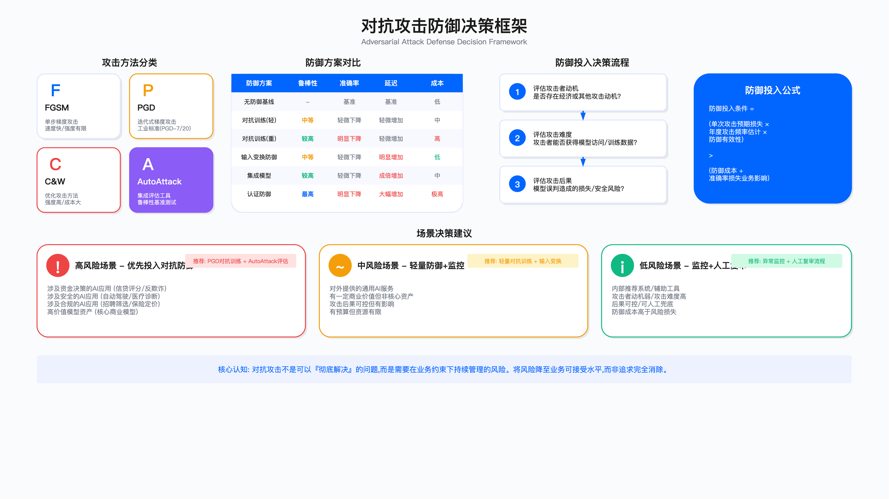

# 15.3 对抗性攻击与防御

## 核心问题

对抗样本（adversarial examples）的存在具有数学必然性：对于任何连续分类器，理论上都存在能够欺骗它的输入扰动。这意味着对抗攻击不是可以"彻底解决"的工程问题，而是需要在业务约束下持续管理的风险。

本节讨论的核心决策点在于：如何在模型准确率、推理延迟、防御成本与鲁棒性之间做出合理权衡，将对抗攻击风险降至业务可接受水平。

---

## 一、对抗攻击的基本原理与威胁模型

### 1.1 问题背景

机器学习模型对输入数据的微小扰动通常表现出脆弱性。攻击者可通过添加人眼难以察觉的噪声，使分类模型产生错误输出。这类攻击在图像识别、文本分类、语音识别等场景均已被验证有效。

典型攻击场景包括：在简历筛选系统中添加不可见文本干扰评分、在人脸识别系统中通过特殊图案绕过身份验证、在恶意软件检测中修改文件特征规避分类器等。

### 1.2 攻击分类

| 分类维度 | 类型 | 说明 | 攻击难度 |
|---------|-----|-----|---------|
| 知识水平 | 白盒攻击 | 攻击者掌握模型结构与参数 | 低 |
| | 黑盒攻击 | 仅能查询模型输出 | 高 |
| | 灰盒攻击 | 了解部分信息如模型架构 | 中 |
| 攻击目标 | 无目标攻击 | 使模型输出任意错误结果 | 低 |
| | 有目标攻击 | 使模型输出攻击者指定的特定类别 | 高 |
| 扰动范围 | 全局扰动 | 对整个输入添加噪声 | 低 |
| | 局部扰动 | 仅修改输入的特定区域（如对抗补丁） | 中 |

### 1.3 主要攻击方法

| 攻击方法 | 原理 | 攻击强度 | 计算开销 | 典型用途 |
|---------|-----|---------|---------|---------|
| FGSM | 单步梯度攻击，沿梯度符号方向添加扰动 | 有限 | 低 | 快速测试、对抗训练 |
| PGD | 迭代式梯度攻击，多次迭代并投影到范围内 | 较高 | 中 | 工业标准评估（PGD-7/20） |
| C&W | 基于优化生成最小扰动的对抗样本 | 高 | 高 | 研究评估、高精度攻击 |
| AutoAttack | 集成 APGD-CE、APGD-DLR、FAB、Square Attack | 最高 | 高 | 模型鲁棒性基准测试 |

### 1.4 适用边界与威胁评估

对抗攻击防御的投入应基于威胁模型评估：

| 评估维度 | 评估要点 | 决策影响 |
|---------|---------|---------|
| 攻击者动机 | 是否存在明确的经济或其他动机 | 动机强则提升防御优先级 |
| 攻击难度 | 能否获得模型访问、训练数据、足够查询次数 | 难度低则需重点防御 |
| 攻击后果 | 误判造成的业务损失、安全风险、合规影响 | 后果严重则必须投入 |
| 防御成本 | 计算资源、准确率下降、推理延迟增加 | 成本需与风险匹配 |

对于攻击者动机弱、攻击难度高、后果可控的场景，可优先通过监控与人工复审管理风险，而非投入高成本防御。

---

## 二、防御策略选型与权衡分析

### 2.1 防御方案分类

对抗性攻击防御可分为三类：对抗训练、输入变换防御、认证防御。各方案在鲁棒性、准确率损失、推理延迟、实施成本方面存在显著差异。

方案比较框架：

| 防御类型         | 鲁棒性提升         | 准确率影响 | 延迟影响 | 实施复杂度 |
| ---------------- | ------------------ | ---------- | -------- | ---------- |
| 无防御基线       | -                  | 基准       | 基准     | 低         |
| 对抗训练（轻量） | 中等               | 下降可控   | 轻微增加 | 中         |
| 对抗训练（重度） | 较高               | 明显下降   | 轻微增加 | 高         |
| 输入变换防御     | 中等               | 轻微下降   | 明显增加 | 低         |
| 集成模型         | 较高               | 轻微下降   | 成倍增加 | 中         |
| 认证防御         | 最高（有理论保证） | 明显下降   | 大幅增加 | 高         |

选择防御方案时，需结合业务对准确率的容忍度、延迟要求、可用预算综合决策。

### 2.2 决策框架

防御投入决策可参考以下逻辑：

```
防御投入条件 = (单次攻击预期损失 × 年度攻击频率估计 × 防御有效性) > (防御成本 + 准确率损失造成的业务影响)
```

对于高风险场景（如涉及资金、安全、合规的 AI 应用），应优先投入对抗防御；对于攻击动机弱、后果可控的场景（如内部推荐系统），可通过监控与人工复审管理残留风险。

### 2.3 关键约束

| 约束类型 | 评估要点 | 典型阈值 | 超阈值影响 |
|---------|---------|---------|-----------|
| 准确率底线 | 业务能接受的准确率下降幅度 | 通常 <5% | 方案不可行 |
| 延迟预算 | 推理延迟增加对用户体验/SLA 的影响 | 通常 <2x | 需简化防御 |
| 计算资源 | 对抗训练所需 GPU 资源与时间 | 视预算而定 | 选择轻量方案 |
| 团队能力 | 是否有 ML 安全专业人员支持 | - | 考虑外部服务 |
| 更新频率 | 防御方案能否跟上模型迭代 | - | 需自动化流程 |

---

## 三、对抗训练：实施要点与常见陷阱

### 3.1 基本原理

对抗训练（adversarial training）的核心思想是：在模型训练过程中，同时使用原始样本与对抗样本进行训练，使模型学习到对扰动的鲁棒性。

训练流程概述：每个训练迭代中，先针对当前模型生成对抗样本，再用原始样本与对抗样本联合计算损失并更新模型参数。

### 3.2 生产环境实施要点

以下代码展示了生产环境对抗训练的关键结构与注意事项：

```python
class ProductionAdversarialTraining:
    """
    生产环境对抗训练实现框架

    关键决策点：
    1. epsilon 选择：扰动幅度过小防御无效，过大准确率下降严重
    2. 攻击方法选择：FGSM 训练的模型可能对 PGD 仍脆弱
    3. 训练资源规划：对抗样本生成显著增加训练时间
    4. 监控指标：需同时监控正常准确率与对抗准确率
    """

    def __init__(self, model, epsilon, alpha, attack_steps):
        """
        Args:
            epsilon：扰动幅度上限，需根据数据特性调整
            alpha：PGD 攻击步长，通常设为 epsilon/attack_steps
            attack_steps：迭代次数，工业界常用 7-10 步
        """
        self.model = model
        self.epsilon = epsilon
        self.alpha = alpha
        self.attack_steps = attack_steps

        # 监控指标
        self.metrics = {
            'clean_acc': [],      # 正常样本准确率
            'adv_acc': [],        # 对抗样本准确率
            'training_time': []   # 训练耗时
        }

    def train_epoch(self, train_loader, optimizer):
        """
        单轮训练

        注意事项：
        - 训练初期准确率可能大幅下降，属正常现象
        - 需提前与业务方沟通准确率变化预期
        - 建议保存多个 checkpoint 以便回退
        """
        self.model.train()

        for x, y in train_loader:
            # 生成对抗样本
            x_adv = self._generate_pgd_attack(x, y)

            # 联合训练：正常样本与对抗样本按比例混合
            optimizer.zero_grad()

            loss_clean = compute_loss(self.model(x), y)
            loss_adv = compute_loss(self.model(x_adv), y)

            # 损失权重可根据实际需求调整
            loss = 0.5 * loss_clean + 0.5 * loss_adv

            loss.backward()
            optimizer.step()

    def _generate_pgd_attack(self, x, y):
        """
        PGD 攻击生成对抗样本

        选择 PGD 而非 FGSM 的原因：
        - FGSM 攻击强度有限，模型可能过拟合到 FGSM 但对 PGD 仍脆弱
        - PGD 是更强的攻击，用 PGD 训练的模型通常对多种攻击更鲁棒
        """
        x_adv = x.clone().detach()

        for _ in range(self.attack_steps):
            x_adv.requires_grad = True
            loss = compute_loss(self.model(x_adv), y)
            grad = torch.autograd.grad(loss, x_adv)[0]

            # 沿梯度方向更新
            x_adv = x_adv.detach() + self.alpha * grad.sign()

            # 投影到 epsilon 球内
            delta = torch.clamp(x_adv - x, -self.epsilon, self.epsilon)
            x_adv = torch.clamp(x + delta, 0, 1).detach()

        return x_adv

    def validate(self, val_loader):
        """
        验证阶段：必须同时评估正常与对抗准确率

        常见错误：仅测试正常准确率，忽略对抗鲁棒性评估
        """
        self.model.eval()

        # 测试正常样本
        clean_acc = evaluate_accuracy(self.model, val_loader, attack=None)

        # 测试 FGSM 攻击
        fgsm_acc = evaluate_accuracy(self.model, val_loader, attack='fgsm')

        # 测试 PGD 攻击
        pgd_acc = evaluate_accuracy(self.model, val_loader, attack='pgd')

        return {
            'clean_acc': clean_acc,
            'fgsm_acc': fgsm_acc,
            'pgd_acc': pgd_acc
        }
```

### 3.3 常见误区与应对

| 误区 | 问题表现 | 识别信号 | 应对方法 |
|-----|---------|---------|---------|
| epsilon 选择不当 | 扰动过小防御无效，过大准确率下降 | 鲁棒性或准确率异常 | 网格搜索，图像常用 2/255 至 16/255 |
| 标签泄露 | 生成对抗样本时使用真实标签 | 评估与实际效果差距大 | 使用 untargeted 攻击或预测标签 |
| 梯度掩码假鲁棒 | 梯度失效导致攻击无法生效 | 仅对梯度攻击有效 | 使用 BPDA 或 AutoAttack 验证 |
| 单一攻击过拟合 | 仅对训练时使用的攻击鲁棒 | 对其他攻击仍脆弱 | 混合多种攻击或使用 TRADES |
| 类别不平衡 | 少数类对抗鲁棒性不足 | 少数类攻击成功率高 | 类别加权损失或过采样 |

### 3.4 验证方法

| 验证类型 | 方法 | 通过标准 | 频率 |
|---------|-----|---------|-----|
| 多攻击评估 | FGSM、PGD-20、C&W、AutoAttack | 各攻击鲁棒性达标 | 每次训练后 |
| 迁移攻击测试 | 使用其他模型生成的对抗样本 | 迁移攻击成功率可控 | 季度 |
| 扰动强度测试 | 不同 epsilon 值下的表现曲线 | 曲线符合预期 | 每次训练后 |
| 业务场景模拟 | 针对实际攻击向量设计测试 | 覆盖主要攻击场景 | 季度 |

### 3.5 运行指标

对抗训练模型上线后应持续监控以下指标：

| 指标               | 说明                       | 告警条件建议     |
| ------------------ | -------------------------- | ---------------- |
| 正常样本准确率     | 不应因防御导致过度下降     | 低于业务设定阈值 |
| 对抗鲁棒性评估分数 | 定期用攻击工具评估         | 较基线显著下降   |
| 高置信度预测比例   | 对抗攻击常导致异常高置信度 | 比例突然升高     |
| 模型预测分布       | 监控各类别预测频率         | 分布异常偏移     |
| 输入异常检测告警   | 识别疑似对抗样本           | 告警数量突增     |

### 3.6 对抗训练失败诊断

| 失败现象 | 可能原因 | 诊断方法 | 修复措施 |
|----------|----------|----------|----------|
| 准确率持续下降 | epsilon 过大或学习率过高 | 检查训练曲线、验证集表现 | 降低 epsilon、使用学习率衰减 |
| 鲁棒性无提升 | epsilon 过小或训练轮数不足 | 用 PGD-20 评估不同 checkpoint | 增大 epsilon、延长训练 |
| 对特定类别失效 | 类别不平衡或该类别边界复杂 | 分类别评估鲁棒性 | 类别加权、增加该类样本 |
| 评估与实战差距大 | 评估攻击与实际攻击不一致 | 模拟真实攻击场景测试 | 扩展评估攻击类型 |
| 训练不收敛 | 模型容量不足或对抗样本过强 | 检查损失曲线、梯度范数 | 增加模型容量、减少攻击步数 |

---

## 四、输入变换防御：低成本方案与局限

### 4.1 基本原理

输入变换防御通过对输入数据进行预处理来破坏对抗扰动，其优势在于无需重新训练模型即可部署。常用技术包括 JPEG 压缩、位深度降低、随机缩放、高斯模糊等。

### 4.2 实施示例

```python
class InputDefensePipeline:
    """
    输入变换防御管道

    适用场景：
    - 无法重新训练模型的情况
    - 作为对抗训练的补充层
    - 快速部署的临时防护

    限制条件：
    - 会导致一定的准确率损失
    - 存在自适应攻击风险（攻击者可针对防御设计攻击）
    - 推理延迟会增加
    """

    def __init__(self, jpeg_quality=85, bit_depth=6, resize_prob=0.0):
        """
        Args:
            jpeg_quality：JPEG 压缩质量，越低防御越强但质量损失越大
            bit_depth：位深度，原始为 8，降低可破坏低位扰动
            resize_prob：随机缩放概率，非零会导致推理不确定性
        """
        self.jpeg_quality = jpeg_quality
        self.bit_depth = bit_depth
        self.resize_prob = resize_prob

    def defend(self, image):
        """
        多层防御管道

        处理顺序设计依据：
        1. JPEG 压缩：破坏高频扰动成分
        2. 位深度降低：量化消除低位扰动
        3. 随机缩放：增加攻击难度（可选）
        """
        defended = self._jpeg_compression(image)
        defended = self._bit_depth_reduction(defended)

        if self.resize_prob > 0 and random.random() < self.resize_prob:
            defended = self._random_resize(defended)

        return defended

    def _jpeg_compression(self, image):
        """
        JPEG 压缩防御

        原理：DCT 变换破坏对抗扰动的高频成分

        参数选择建议：
        - quality=90-95：防御效果弱但质量损失小
        - quality=75-85：平衡选择
        - quality<70：防御较强但图像质量明显下降
        """
        # 实现略
        pass

    def _bit_depth_reduction(self, image):
        """
        位深度降低

        原理：对抗扰动通常在低位 bit，量化可消除

        参数选择建议：
        - bits=7：防御效果弱
        - bits=6：平衡选择
        - bits=5：防御较强但可能影响细节
        - bits<5：准确率损失通常不可接受
        """
        # 量化到指定位深度
        quantized = torch.round(image * (2**self.bit_depth - 1))
        quantized = quantized / (2**self.bit_depth - 1)
        return quantized
```

### 4.3 适用边界

| 适用场景 | 不适用场景 |
|---------|-----------|
| 模型已部署且无法重新训练 | 攻击者了解防御机制并可自适应攻击 |
| 作为对抗训练的额外防御层 | 对准确率要求极高 |
| 需要快速部署的临时防护 | 实时性要求高且无法承受额外延迟 |
| 攻击者能力有限 | 需要确定性输出 |

### 4.4 常见误区

| 误区 | 问题 | 识别信号 | 应对方法 |
|-----|-----|---------|---------|
| 持久防护假设 | 攻击者可训练"抗压缩"对抗样本绕过 | 自适应攻击成功 | 作为组合防御的一层，定期调整参数 |
| 忽略随机不确定性 | 同一输入多次推理结果不同 | 业务可测试性下降 | 固定随机种子或关闭随机化 |
| 参数选择盲目 | 参数过激导致准确率下降 | 正常样本准确率异常 | 在验证集上测试参数组合 |

### 4.5 验证方法

| 验证项 | 方法 | 通过标准 |
|-------|-----|---------|
| 鲁棒性提升 | 使用 FGSM、PGD 测试 | 较基线有显著提升 |
| 自适应攻击 | 在防御后的图像上生成对抗样本 | 了解防御上限 |
| 准确率损失 | 验证集测试 | 在可接受范围内 |
| 延迟增加 | 性能测试 | 符合 SLA 要求 |

---

## 五、认证防御：理论保证与实践权衡

### 5.1 基本原理

认证防御（certified defense）通过数学方法证明模型在特定扰动范围内的输出不变性。与经验性防御（仅测试有限攻击样本）不同，认证防御提供理论保证。

Randomized Smoothing 是目前可扩展性最好的认证防御方法。其原理是对输入添加高斯噪声并进行多次预测，取多数投票结果。通过统计方法可证明：若多数票超过一定阈值，则在给定扰动半径内预测结果保持不变。

### 5.2 实施要点

```python
class CertifiedDefense:
    """
    认证防御实现框架（Randomized Smoothing）

    核心权衡：
    - 采样次数 n_samples：越多认证越可靠，但推理越慢
    - 噪声标准差 sigma：越大认证半径越大，但准确率越低
    - 置信水平 alpha：越小保证越强，但认证半径越小
    """

    def __init__(self, model, sigma=0.25, n_samples=100, alpha=0.001):
        """
        Args:
            sigma：高斯噪声标准差，需根据认证半径需求选择
            n_samples：采样次数，影响推理时间与统计可靠性
            alpha：置信水平参数
        """
        self.model = model
        self.sigma = sigma
        self.n_samples = n_samples
        self.alpha = alpha

    def predict_with_certificate(self, x):
        """
        带认证的预测

        返回：
            prediction：预测类别（若无法认证则返回 ABSTAIN）
            radius：认证半径（在此 L2 范围内预测保证不变）

        推理时间：约为普通推理的 n_samples 倍
        """
        # 多次噪声采样
        counts = self._sample_predictions(x)

        # 计算多数类与认证半径
        top_class, radius = self._compute_certificate(counts)

        return top_class, radius

    def _sample_predictions(self, x):
        """对输入添加噪声并收集预测分布"""
        counts = {}
        for _ in range(self.n_samples):
            noisy_x = x + torch.randn_like(x) * self.sigma
            pred = self.model(noisy_x).argmax().item()
            counts[pred] = counts.get(pred, 0) + 1
        return counts

    def _compute_certificate(self, counts):
        """根据投票分布计算认证半径"""
        # 具体实现涉及统计置信区间计算
        # 返回多数类与可证明的鲁棒半径
        pass
```

### 5.3 适用边界

| 适用场景 | 不适用场景 |
|---------|-----------|
| 安全关键应用（自动驾驶、医疗、金融大额） | 对延迟敏感的实时应用 |
| 需向监管方证明模型鲁棒性 | 成本敏感且攻击风险可控 |
| 愿意接受显著代价换取理论保证 | 准确率要求极高 |

### 5.4 关键约束

| 代价类型 | 说明 | 典型影响 |
|---------|-----|---------|
| 推理延迟 | 需多次采样预测 | 增加数十倍至上百倍 |
| 准确率下降 | 噪声注入降低分类准确率 | 下降 5-15% |
| 计算资源 | GPU 需求与采样次数成正比 | 成本成倍增加 |
| 认证半径 | 可认证的扰动范围有限 | 需权衡准确率 |

### 5.5 验证方法

| 验证项 | 方法 | 输出 |
|-------|-----|-----|
| 认证准确率 | 测试集上给定半径内预测正确比例 | 认证准确率指标 |
| 半径-准确率曲线 | 评估不同安全级别下的性能 | 权衡曲线 |
| 对比经验防御 | 相同攻击强度下性能对比 | 方案选择依据 |

---

## 六、场景化决策指南



### 6.1 按风险等级选择防御方案

| 风险等级 | 典型场景 | 推荐方案 | 验收标准 | 残留风险处理 |
|---------|---------|---------|---------|------------|
| 高风险 | 金融风控、自动驾驶、医疗诊断 | 对抗训练 + 集成 + 输入变换 + 考虑认证防御 | 主流攻击防御率达标，红队评估通过 | 关键决策人工复核 |
| 中等风险 | 简历筛选、内容审核、客服机器人 | 对抗训练（轻量）+ 输入变换 | 鲁棒性较基线显著提升 | 异常检测 + 抽样审核 |
| 低风险 | 内部推荐、辅助分析工具 | 监控为主，必要时输入变换 | 异常检测告警机制建立 | 业务流程兜底 |

### 6.2 决策检查清单

在决定是否投入对抗防御时，可参考以下检查项：

| 评估项                                 | 若为"是"则需重点关注                     |
| -------------------------------------- | ---------------------------------------- |
| 模型用于高风险场景（安全/金融/医疗）？ | 必须投入防御，考虑认证防御               |
| 攻击者有明确经济或其他动机？           | 提升防御优先级                           |
| 模型输出直接驱动自动化决策？           | 防御更为关键，需保留人工复核             |
| 业务可接受准确率下降？                 | 评估下降幅度，与业务方确认               |
| 业务可接受推理延迟增加？               | 确定延迟预算，选择相应方案               |
| 有 ML 安全专业人员支持？               | 若无，考虑采购第三方服务或从简单方案起步 |
| 已有人工复审流程？                     | 可适当降低技术防御要求                   |

---

## 七、持续运营与迭代

### 7.1 对抗防御不是一次性工程

对抗攻击与防御是持续博弈过程。攻击技术不断演进，防御策略需要定期更新：新攻击方法不断涌现，需定期评估模型对新攻击的脆弱性；攻击者可能针对已知防御机制设计自适应攻击绕过方法；模型更新、数据分布变化可能影响防御效果。

### 7.2 运营机制建议

| 机制 | 内容 | 频率 | 责任方 |
|-----|-----|-----|-------|
| 定期评估 | 使用标准攻击工具集评估鲁棒性，与基线对比 | 季度或模型更新后 | ModelSec |
| 监控告警 | 输入异常检测，监控异常高置信度等特征 | 实时 | 安全运营 |
| 应急响应 | 临时降级策略、人工复核流程 | 按需 | 安全 + 业务 |
| 防御更新 | 根据威胁情报调整防御参数或方法 | 季度 | ModelSec |

### 7.3 与业务方的沟通要点

| 沟通主题 | 沟通内容 | 预期输出 |
|---------|---------|---------|
| 准确率 vs 鲁棒性 | 防御投入带来的准确率变化 | 业务方确认阈值 |
| 残留风险 | 无法完全消除的技术限制 | 补偿控制措施共识 |
| 成本效益 | 防御收益与残留损失预期 | 预算批准 |

### 7.4 残留风险管理

| 控制措施 | 说明 | 适用场景 |
|---------|-----|---------|
| 异常检测 | 输入特征异常检测，标记疑似对抗样本 | 所有场景 |
| 多因素验证 | 高风险决策引入多重验证机制 | 高风险场景 |
| 业务流程兜底 | 关键决策保留人工复核 | 中高风险场景 |
| 持续监控 | 模型行为监控，发现异常模式 | 所有场景 |

---

## 八、多模态对抗攻击

### 8.1 问题背景

随着多模态模型（图像 + 文本、视频 + 音频等）的广泛应用，对抗攻击的攻击面也随之扩大。攻击者可能通过在一个模态中嵌入对抗扰动，影响整个多模态系统的输出。

典型场景包括：在图像中嵌入对抗补丁（adversarial patch）影响图像-文本理解系统；通过音频对抗样本干扰语音识别与后续处理；在视频帧中植入对抗扰动影响视频分析系统。

### 8.2 防御要点

| 防御措施 | 说明 | 实施复杂度 |
|---------|-----|-----------|
| 跨模态一致性检验 | 检查不同模态输入之间的语义一致性 | 高 |
| 独立模态验证 | 对各模态分别进行安全检查 | 中 |
| 对抗补丁检测 | 针对局部可见的对抗补丁专门检测 | 中 |
| 融合策略审查 | 评估融合机制是否易被单一模态攻击影响 | 高 |

### 8.3 适用边界

| 重点关注场景 | 风险说明 |
|------------|---------|
| 图像 + 文本智能审核 | 攻击者可通过图像绕过文本过滤 |
| 多模态身份验证 | 单一模态攻击可能影响整体验证 |
| 自动驾驶多传感器 | 传感器融合漏洞可能导致安全事故 |

---

## 相关章节

- [15.3 LLM 威胁与 OWASP Top 10](./15.3_llm_threats_owasp.md) — 大语言模型特有的安全风险
- [15.2 AI 安全架构设计](./15.2_security_for_ai_architecture.md) — 从架构层面设计防御机制
- [15.6 合规框架落地](./15.6_compliance_frameworks.md) — 对抗鲁棒性的合规审计要求

---

## 导航

**[← 上一节：15.3 LLM 威胁与 OWASP Top 10](./15.3_llm_threats_owasp.md)** | **[返回章节目录](./README.md)** | **[下一节：15.5 数据安全与隐私 →](./15.5_data_privacy.md)**

---

**© 2025 AI-ESA Project. Licensed under CC BY-NC-SA 4.0**

