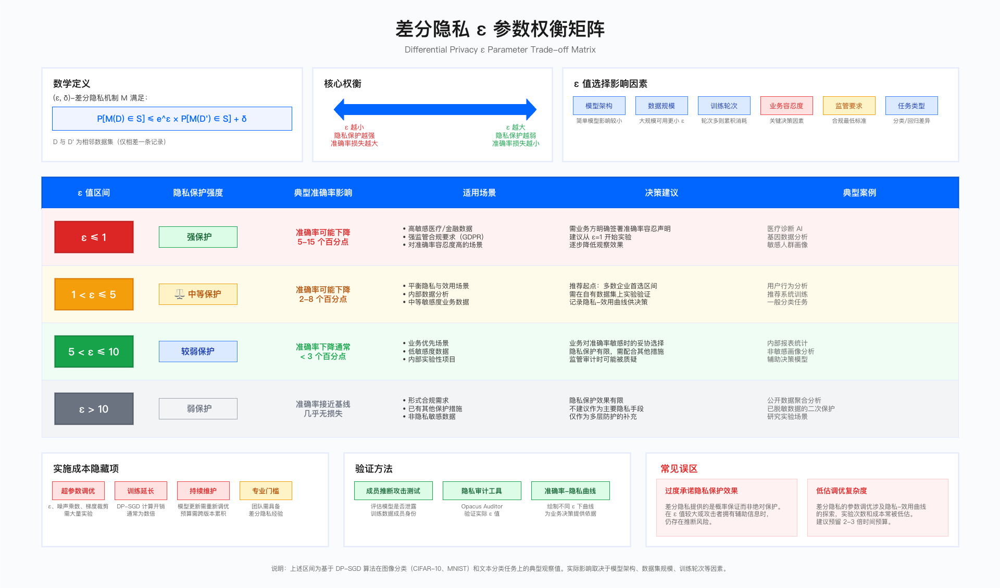
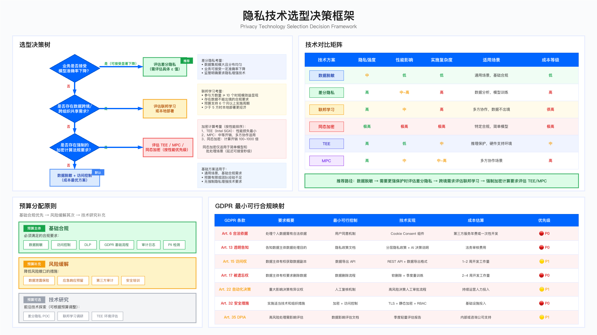

# 15.5 AI 数据安全与隐私

AI 系统的数据安全与隐私保护是 security for AI 体系的核心支柱。训练数据的合规性直接决定 AI 系统能否通过监管审计，而隐私增强技术的选型则涉及准确率、成本与合规要求之间的多维权衡。本节从数据生命周期管理、隐私增强技术选型、合规实施路径三个维度，阐述企业如何在有限预算下构建可落地的 AI 数据安全体系。

### 与第9章的定位区分

本节聚焦 **AI/ML 系统特有的数据隐私挑战**，与 [第9章 隐私合规](../../part_03_data_security_privacy/chapter_09_privacy_compliance/README.md) 形成互补而非重叠：

| 维度 | 第9章（通用隐私工程） | 15.5（AI 数据隐私） |
|------|----------------------|---------------------|
| **聚焦对象** | 任意数据处理系统 | AI/ML 训练与推理系统 |
| **差分隐私** | 作为 PETs 技术选项介绍 | 聚焦 DP-SGD 算法、ε-准确率权衡曲线 |
| **联邦学习** | Level 4 成熟度的技术标志 | AI 训练场景的特有约束（参与方数量、模型架构变更等） |
| **核心风险** | K-匿名性、假名化密钥泄露 | 模型记忆攻击、训练数据逆向、梯度泄露 |
| **合规焦点** | GDPR Art.25 隐私设计原则 | AI 训练数据来源授权、模型输出 PII 泄露 |

**阅读建议**：
- 若需了解通用隐私工程方法论（Privacy by Design、匿名化技术、DPIA 流程），请参阅 [9.5 隐私工程实践](../../part_03_data_security_privacy/chapter_09_privacy_compliance/9.5_privacy_engineering.md)
- 本节内容假设读者已具备基础隐私概念，重点阐述 AI 系统的特有约束与权衡

---

## 15.5.1 AI 数据生命周期安全管理

### 问题背景

AI 系统的数据安全问题通常在审计阶段才暴露。典型场景包括：训练数据来源缺乏授权凭证、第三方爬取数据违反隐私法规、模型输出泄露训练集中的个人信息。这类问题的补救成本远高于事前预防，事后整改通常涉及法务介入、数据清洗、模型重训练，以及业务上线延迟带来的间接损失。

### 数据合规的分阶段投入策略

企业在 AI 数据合规方面的投入需要与业务阶段和风险敞口匹配。初创阶段应优先建立基础的数据清洗与 PII 检测能力；规模扩张阶段则需要完善访问控制与审计日志；进入强监管市场（如欧盟、金融、医疗）时，需评估是否引入联邦学习或差分隐私等技术手段。

关键决策点如下：

1. 数据清洗与 PII 检测：这是最低成本且必须优先实施的控制项。无论后续采用何种隐私增强技术，未经授权的外部数据（如未经同意爬取的社交网络数据）必须在训练前移除。
2. 访问控制与审计日志：建立基于角色的访问控制（RBAC），确保训练数据、模型权重、推理日志的访问可追溯。这是满足 GDPR Art. 32（安全措施）的基础要求。
3. 输出过滤与 DLP：在模型推理环节部署数据泄露防护（DLP）机制，防止模型输出中包含训练数据中的个人信息或敏感业务数据。

### 适用边界

适用边界：本节方法论适用于所有处理个人数据或敏感业务数据的 AI 系统，以及需要通过 GDPR、PIPL、HIPAA 等合规审计的场景。不适用于纯内部实验性模型且不涉及个人数据的场景，以及使用完全公开且无版权争议的数据集进行学术研究的场景。

### 关键约束

| 约束类型 | 具体内容                                                | 影响范围            |
| -------- | ------------------------------------------------------- | ------------------- |
| 成本约束 | 数据清洗与 PII 检测开发成本可控，误报处理需持续人力投入 | 运营预算、人员配置  |
| 延迟约束 | PII 检测增加管道延迟，批处理可接受，实时场景需评估      | 系统架构、SLA 承诺  |
| 组织能力 | 安全与数据工程团队协作，需明确数据所有权与审核责任      | 流程设计、RACI 定义 |

### 常见误区

| 误区                       | 识别信号                       | 后果                   | 纠正方法                                  |
| -------------------------- | ------------------------------ | ---------------------- | ----------------------------------------- |
| "开源数据"等于"可自由使用" | 直接使用公开数据集未经法务审核 | 版权纠纷、隐私法规违规 | 所有外部数据入库前法务审核                |
| PII 检测等同合规达成       | 仅部署检测工具未配合流程建设   | 审计失败、数据主体投诉 | 检测 + 处理依据 + 告知 + 权利响应完整链条 |

---

## 15.5.2 差分隐私：技术原理与工程权衡

### 技术原理

差分隐私（differential privacy）通过在数据或模型训练过程中引入可控噪声，保证单条记录的存在与否不会显著影响模型输出，从而在数学上限制攻击者推断个体信息的能力。其核心参数为隐私预算 ε（epsilon）：ε 值越小，隐私保护越强，但模型准确率下降越明显。

差分隐私的数学定义：

```
对于相邻数据集 D 和 D'（仅相差一条记录），机制 M 满足（ε, δ）-差分隐私，当且仅当：
P[M(D) ∈ S] ≤ e^ε × P[M(D') ∈ S] + δ
```

### 工程权衡的核心矛盾

差分隐私在实际部署中面临隐私保护强度与模型性能之间的权衡。这一权衡在金融风控、医疗诊断等对准确率敏感的场景尤为突出。



隐私-效用权衡的技术规律

根据差分隐私的理论特性和工程实践，ε 值与模型性能之间存在以下一般规律（具体数值因模型复杂度、数据规模、任务类型而异，以下为典型区间供参考）：

| ε 值区间    | 隐私保护强度 | 典型准确率影响                | 适用场景参考           |
| ------------ | ------------ | ----------------------------- | ---------------------- |
| ε ≤ 1      | 强           | 准确率可能下降 5-15 个百分点  | 高敏感数据，强监管要求 |
| 1 < ε ≤ 5  | 中等         | 准确率可能下降 2-8 个百分点   | 平衡场景，需业务评估   |
| 5 < ε ≤ 10 | 较弱         | 准确率下降通常小于 3 个百分点 | 业务优先，隐私为辅     |
| ε > 10      | 弱           | 准确率接近基线                | 形式合规，保护有限     |

> 说明：上述区间为基于 DP-SGD 算法在图像分类（如 CIFAR-10、MNIST）和文本分类任务上的典型观察值。实际影响取决于模型架构（简单模型影响较小）、数据集规模（大规模数据集可使用更小 ε）、训练轮次等因素。企业应在自有数据集上进行实验验证后确定具体阈值。

业务决策的关键考量

- ε 值选择：ε=1 提供较强的隐私保护，但在复杂模型上可能导致显著准确率下降；ε=10 提供较弱的保护，准确率损失相对可控。
- 业务接受度：业务方通常对准确率下降的容忍度有限。当准确率下降超过业务设定的阈值时，差分隐私方案可能被否决。建议在项目启动前与业务方明确准确率容忍边界（如：最多接受 3 个百分点下降）。

### 实施成本的隐藏项

| 成本项       | 内容说明                                   | 典型影响                       |
| ------------ | ------------------------------------------ | ------------------------------ |
| 超参数调优   | ε、噪声乘数、梯度裁剪阈值等参数需大量实验 | 训练时间和 GPU 成本增加 2-5 倍 |
| 训练时间延长 | DP-SGD 计算开销通常是普通训练的数倍        | 项目周期延长、资源占用增加     |
| 持续维护     | 模型更新需重新调优，隐私预算跨版本累积     | 运维复杂度提升、版本管理成本   |

### 适用边界

| 维度       | 适用条件                 | 不适用条件                       |
| ---------- | ------------------------ | -------------------------------- |
| 数据规模   | 数据集规模大且分布均匀   | 数据集规模小（噪声相对影响大）   |
| 业务容忍度 | 可接受一定程度准确率下降 | 极度敏感（如反欺诈需极低漏检率） |
| 监管要求   | 明确要求隐私增强技术     | 无强制要求且成本敏感             |
| 团队能力   | 具备差分隐私工程经验     | 团队缺乏相关经验                 |

### 常见误区

| 误区                 | 识别信号                       | 后果               | 纠正方法                          |
| -------------------- | ------------------------------ | ------------------ | --------------------------------- |
| 过度承诺隐私保护效果 | 宣称"绝对安全"、忽略 ε 值限制 | 审计质疑、法务风险 | 明确说明概率保证性质和 ε 值含义  |
| 低估调优复杂度       | 项目计划仅预留 1-2 周调优时间  | 进度延误、预算超支 | 预留 4-6 周实验周期，预算增加 50% |

### 验证方法

| 验证方法         | 验证目标                     | 工具/手段                 | 判定标准                    |
| ---------------- | ---------------------------- | ------------------------- | --------------------------- |
| 成员推断攻击测试 | 评估训练数据成员身份泄露风险 | Shadow Model Attack 框架  | 攻击成功率 ≤ 随机猜测 + 5% |
| 隐私审计         | 验证实际 ε 值符合设计预期   | Opacus Auditor、DP-Sniper | 实测 ε ≤ 设计 ε × 1.1   |
| 准确率-隐私曲线  | 为业务决策提供量化依据       | 多组 ε 值对比实验        | 曲线拐点识别、ROI 分析      |

### 运行指标

| 指标名称           | 采集方式             | 阈值表达                     | 触发动作           |
| ------------------ | -------------------- | ---------------------------- | ------------------ |
| 实际隐私预算 ε    | 隐私审计工具自动采集 | 实测 ε > 设计目标 × 1.2    | 触发复核、暂停部署 |
| 模型准确率降幅     | A/B 测试对比         | 降幅 > 业务阈值（如 5%）     | 业务评估、ε 调整  |
| 成员推断攻击成功率 | 红队测试             | 成功率 > 55%（随机基线 50%） | 加固措施、增加噪声 |

---

## 15.5.3 生产级 PII 检测与脱敏

### 适用边界

PII 检测与脱敏适用于所有涉及个人数据处理的 AI 系统，尤其是训练数据清洗、推理输入预处理、输出内容审查等环节。不适用于纯内部测试数据（无真实个人信息）或已通过其他手段（如数据合成）完全规避个人数据使用的场景。

### 实施路径

| 阶段     | 任务              | 关键考量                                  | 交付物               |
| -------- | ----------------- | ----------------------------------------- | -------------------- |
| 工具选型 | 评估开源/商业方案 | Presidio 免费但需定制；Macie 托管但成本高 | 选型报告、POC 结果   |
| 中文扩展 | 定制中文 PII 规则 | 开源工具中文支持有限，需自定义正则或 NER  | 中文规则库、NER 模型 |
| 误报调优 | 根据业务反馈迭代  | 姓名/地址等模糊实体误报率高               | 白名单、调优后的阈值 |
| 生产部署 | 集成到数据管道    | 批处理 vs 实时场景的架构差异              | 部署文档、监控看板   |

### 示例实现

以下代码展示了基于 Presidio 的 PII 检测基础框架，包含中文规则扩展：

```python
class PIIDetector:
    """
    PII 检测与脱敏基础实现。

    设计考量：
    - 使用开源 Presidio 作为基础引擎
    - 扩展中文 PII 模式（手机号、身份证号、银行卡号）
    - 检测与脱敏一步完成，减少处理延迟
    """

    def __init__(self):
        from presidio_analyzer import AnalyzerEngine
        from presidio_anonymizer import AnonymizerEngine

        self.analyzer = AnalyzerEngine()
        self.anonymizer = AnonymizerEngine()

        # 中文 PII 正则模式
        self.cn_patterns = {
            'PHONE_CN': r'1[3-9]\d{9}',
            'ID_CARD_CN': r'\d{17}[\dXx]',
            'BANK_CARD_CN': r'\d{16,19}'
        }

    def detect_and_mask(self, text: str) -> str:
        """
        执行 PII 检测与脱敏。

        返回脱敏后的文本，原始 PII 被替换为占位符。
        """
        import re

        # 英文 PII 检测
        results = self.analyzer.analyze(text=text, language='en')

        # 中文 PII 检测
        for pii_type, pattern in self.cn_patterns.items():
            for match in re.finditer(pattern, text):
                results.append({
                    'entity_type': pii_type,
                    'start': match.start(),
                    'end': match.end(),
                    'score': 0.95
                })

        # 执行脱敏
        anonymized = self.anonymizer.anonymize(text, results)
        return anonymized.text
```

### 常见问题与应对

| 问题             | 表现                              | 应对措施                       |
| ---------------- | --------------------------------- | ------------------------------ |
| 高频姓名误报     | "王伟"、"李娜" 等常见姓名被误标记 | 建立高频姓名白名单             |
| 分隔符手机号漏检 | "138-0013-8000" 未被识别          | 增强正则表达式，支持多种分隔符 |
| 大规模处理 OOM   | 处理百万级记录时内存溢出          | 引入 checkpoint 机制，分批处理 |

### 关键约束

| 约束类型   | 批处理场景     | 实时场景            | 建议阈值                   |
| ---------- | -------------- | ------------------- | -------------------------- |
| 延迟约束   | 秒级可接受     | 需控制在 100ms 以内 | P99 延迟作为 SLA           |
| 误报成本   | 批量复核可承受 | 高频误报不可接受    | 误报率 < 5%                |
| 召回率权衡 | 可接受较高召回 | 需平衡用户体验      | 召回率 > 95%、精确率 > 90% |

### 验证方法

| 验证方法       | 验证目标           | 实施方式                 | 判定标准                     |
| -------------- | ------------------ | ------------------------ | ---------------------------- |
| 标注数据集测试 | 评估召回率和精确率 | 使用已知 PII 的测试集    | 召回率 ≥ 95%、精确率 ≥ 90% |
| 误报率监控     | 跟踪误报变化趋势   | 业务反馈统计、周报       | 误报率连续下降或稳定         |
| 对抗样本测试   | 变体格式检测能力   | 空格分隔、全角数字等变体 | 变体覆盖率 ≥ 80%            |

### 常见误区

| 误区                     | 识别信号                           | 后果                 | 纠正方法                           |
| ------------------------ | ---------------------------------- | -------------------- | ---------------------------------- |
| 依赖单一正则模式         | 仅使用基础正则，未考虑变体格式     | 漏检率高             | 组合正则 + NER 模型，覆盖多种变体  |
| 忽视上下文语义           | 仅做模式匹配，未考虑上下文         | 高频姓名误报         | 引入上下文分析，结合白名单机制     |
| 一次部署后不再迭代       | 部署后无业务反馈闭环               | 误报/漏检逐渐累积    | 建立持续监控和定期调优机制         |
| 实时场景直接复用批处理逻辑 | 未针对延迟要求优化                 | P99 延迟超标         | 实时场景采用轻量规则或预计算缓存   |

### 运行指标

| 指标名称         | 采集方式         | 阈值表达                     | 触发动作             |
| ---------------- | ---------------- | ---------------------------- | -------------------- |
| PII 检测召回率   | 标注样本定期测试 | 召回率 < 95%                 | 规则调优、模型升级   |
| PII 检测精确率   | 业务反馈统计     | 精确率 < 90%                 | 白名单扩充、阈值调整 |
| 检测延迟 P99     | APM 监控         | P99 > SLA 阈值               | 架构优化、规则精简   |
| 误报工单数量     | 工单系统统计     | 周环比上升 > 20%             | 触发规则复核         |

---

## 15.5.4 联邦学习：适用条件与成本分析

### 技术原理

联邦学习（federated learning）允许多个数据持有方在不共享原始数据的情况下协作训练模型。各参与方在本地训练模型，仅将模型更新（梯度或参数）发送给中央服务器进行聚合。这种架构解决了数据不能出境或不能出数据中心的合规要求。

### 适用条件与规模效应

联邦学习的 ROI 依赖于规模效应——参与方数量和单方数据量直接影响投资回报。以下为适用条件分析：

规模效应的经济学逻辑

联邦学习需要显著的基础设施投入（聚合服务器、通信加密、容错机制等），这些固定成本需要通过多个参与方分摊。当参与方较少时，平均成本高于替代方案（如本地部署）：

| 参与方数量 | 固定成本分摊效果 | 典型场景                         | 建议方案                 |
| ---------- | ---------------- | -------------------------------- | ------------------------ |
| 1-3 个     | 低，单方成本高   | 单一客户或少量合作方             | 本地部署或客户端微调     |
| 4-9 个     | 中等             | 中型联盟                         | 需评估 vs 本地部署的 TCO |
| 10+ 个     | 高，规模经济显现 | 跨机构协作（医疗联盟、金融同业） | 联邦学习适用             |
| 100+ 个    | 成本优势明显     | 移动设备场景（如键盘预测）       | 联邦学习为首选           |

> 说明：上述阈值为基于行业实践的经验判断。Google 在 Gboard 键盘预测场景中使用联邦学习，参与设备达百万级；医疗领域的联邦学习联盟（如 TriNetX）通常涉及数十家机构。企业应根据自身场景进行成本建模。

适用条件清单

1. 数据源数量：参与方数量应足够多以分摊基础设施和协调成本。少于 5 个参与方时，本地部署方案通常更经济。
2. 单方数据量：每个参与方的本地数据量应足够支撑有意义的本地训练。数据量过小时，本地训练质量差，联邦聚合效果有限。
3. 法规强制要求：存在数据不能出境或集中存储的硬性合规要求（如 GDPR 跨境传输限制、行业数据本地化规定）。
4. 预算与时间：需要较长的实施周期（通常 6 个月以上）和持续的维护投入。

### 隐藏成本

| 成本项       | 内容说明                           | 影响程度                 | 缓解措施               |
| ------------ | ---------------------------------- | ------------------------ | ---------------------- |
| 通信开销     | 模型参数多轮传输带来带宽成本和延迟 | 高：训练周期延长 3-10 倍 | 梯度压缩、异步聚合     |
| 异构设备适配 | 参与方计算资源差异显著             | 中：需开发自适应策略     | 分层聚合、设备分组     |
| 容错机制     | 网络中断或设备故障处理             | 中：系统复杂度增加       | 检查点机制、掉线重连   |
| 远程调试困难 | 本地训练问题调试能力受限           | 高：问题定位耗时长       | 本地日志收集、模拟环境 |

### 替代方案

| 方案         | 适用条件               | 优势                   | 劣势             |
| ------------ | ---------------------- | ---------------------- | ---------------- |
| 本地部署     | 参与方少、单方数据量大 | 避免数据传输、架构简单 | 需在客户环境部署 |
| 客户端微调   | 预训练模型可用         | 协作复杂度低           | 模型定制能力有限 |
| 安全多方计算 | 强隐私要求、低延迟     | 隐私保护强             | 计算开销仍较高   |

### 联邦学习不适用场景

| 场景特征 | 原因 | 替代方案 |
|----------|------|----------|
| 参与方少于 5 个 | 基础设施成本无法分摊，ROI 为负 | 本地部署或数据合成 |
| 单方数据量极小（<1000 条） | 本地训练质量差，聚合效果有限 | 数据共享协议或集中训练 |
| 实时性要求高（秒级响应） | 联邦训练周期长，无法满足实时需求 | 预训练模型 + 本地微调 |
| 参与方技术能力差异大 | 协调成本高，弱方成为瓶颈 | 分层联邦或 hub 模式 |
| 无明确数据隔离法规要求 | 联邦复杂度高于收益 | 传统集中式训练 |
| 模型结构需频繁变更 | 联邦架构难以适应快速迭代 | 本地实验 + 定期同步 |

### 常见误区

| 误区             | 识别信号                       | 后果                 | 纠正方法                 |
| ---------------- | ------------------------------ | -------------------- | ------------------------ |
| 低估协调成本     | 未预留参与方对齐时间           | 项目延期、参与方退出 | 预留 2-3 个月协调期      |
| 忽视隐私泄露风险 | 仅依赖联邦架构，未配合安全聚合 | 梯度泄露攻击成功     | 配合安全聚合或差分隐私   |
| 高估规模效应     | 3 方以下强推联邦学习           | ROI 为负、资源浪费   | 5 方以下优先评估本地部署 |

---

## 15.5.5 同态加密推理：技术限制与场景边界

### 技术原理

同态加密（homomorphic encryption）允许在加密数据上直接执行计算，计算结果解密后与在明文上计算的结果一致。理论上，这可以实现"数据使用方看不到原始数据"的隐私保护目标。

### 当前技术限制

同态加密在 AI 推理场景的实际应用面临严峻的性能挑战。以下数据基于主流同态加密库的公开基准测试和学术文献：

性能开销参考

| 性能维度 | 典型开销           | 参考基准                 |
| -------- | ------------------ | ------------------------ |
| 计算时间 | 明文的 100-1000 倍 | 取决于电路深度和加密参数 |
| 内存占用 | 明文的 10-100 倍   | 密文扩展因子因方案而异   |
| 模型限制 | 仅支持加法和乘法   | 非线性函数需多项式近似   |

> 基准测试参考：Microsoft SEAL 库在逻辑回归推理任务上的开销约为明文的 100-500 倍；IBM HELib 在简单神经网络上的开销可达 1000 倍以上。深度学习模型（如 ResNet）的同态推理在当前硬件条件下通常需要数分钟至数小时，不适用于实时场景。具体性能应参考各加密库的官方基准测试文档。

主要限制项

1. 计算开销：加密域运算的时间开销通常是明文运算的两个数量级以上，具体倍数取决于加密参数、电路深度和硬件配置。
2. 内存占用：密文体积远大于明文，内存占用可达明文的数十倍，对 GPU 显存提出更高要求。
3. 运算限制：主流同态加密方案（如 CKKS、BFV）仅高效支持加法和乘法运算；ReLU、Softmax 等非线性激活函数需要多项式近似，引入精度损失（通常 1-5 个百分点）。
4. 调试困难：中间结果均为密文，无法直接观察，问题定位困难。

### 适用边界

适用边界：同态加密适用于批处理场景且延迟要求宽松（秒级以上可接受）、模型结构简单（线性模型、逻辑回归）、存在强制的数据隔离法规要求的场景。不适用于实时推理场景（延迟要求毫秒级）、复杂深度学习模型、预算有限或团队缺乏密码学专业知识的场景。

### 关键约束

| 约束类型   | 具体内容                                         | 影响范围             |
| ---------- | ------------------------------------------------ | -------------------- |
| 性能约束   | 计算时间和内存占用数量级增加                     | 架构设计、硬件成本   |
| 精度约束   | 非线性函数多项式近似引入精度损失                 | 模型效果、业务验收   |
| 人才约束   | 需要密码学专业背景，团队能力门槛高               | 人员配置、外包依赖   |
| 调试约束   | 中间结果为密文，问题定位困难                     | 开发效率、运维复杂度 |

### 替代方案

| 方案                 | 性能开销      | 隐私强度 | 适用场景               | 实施复杂度 |
| -------------------- | ------------- | -------- | ---------------------- | ---------- |
| TEE（SGX/TrustZone） | 低（1.1-2x）  | 高       | 推理保护、硬件支持环境 | 中         |
| 安全多方计算 MPC     | 中（10-100x） | 高       | 多方协作场景           | 高         |
| 数据脱敏 + 本地推理  | 低            | 中       | 脱敏可接受的场景       | 低         |

### 常见误区

| 误区             | 识别信号             | 后果               | 纠正方法                     |
| ---------------- | -------------------- | ------------------ | ---------------------------- |
| 视为通用解决方案 | 未评估性能影响即选型 | 项目失败、技术回退 | 先进行 POC，明确性能边界     |
| 忽视精度损失     | 多项式近似未验证     | 模型效果显著下降   | 对比测试、精度-隐私曲线      |
| 低估工程复杂度   | 未引入密码学专家     | 实现错误、安全漏洞 | 团队具备密码学背景或外部支持 |

---

## 15.5.6 GDPR 合规：最小可行方案

### 核心条款与控制映射

GDPR 对 AI 系统的数据处理提出了明确要求。以下为核心条款与最小可行控制措施的映射：

| GDPR 条款          | 要求概要                         | 最小可行控制                      | 示例成本区间*              |
| ------------------ | -------------------------------- | --------------------------------- | -------------------------- |
| Art. 6 合法依据    | 处理个人数据需有合法依据         | 用户同意机制（如 Cookie Consent） | 第三方服务年费或一次性开发 |
| Art. 13 透明告知   | 告知数据主体数据处理目的         | 隐私政策文档                      | 法务审核费用               |
| Art. 15 访问权     | 数据主体有权获取其数据副本       | 数据导出 API                      | 1-2 周开发工作量           |
| Art. 17 被遗忘权   | 数据主体有权要求删除其数据       | 数据删除流程                      | 2-4 周开发工作量           |
| Art. 22 自动化决策 | 对重大影响的自动化决策有异议权   | 人工复核机制                      | 持续运营人力投入           |
| Art. 32 安全措施   | 实施适当的技术和组织措施         | 加密 + 访问控制                   | 基础设施投入               |
| Art. 35 DPIA       | 高风险处理需进行数据保护影响评估 | 数据影响评估文档                  | 内部或咨询公司支持         |

> **\*成本说明（示例口径）** ：上述成本区间为中型企业（50-200 人技术团队）的参考范围，实际成本因企业规模、现有基础设施、地区人力成本而异。建议企业根据自身情况进行成本建模，而非直接套用行业数字。典型中型企业的 GDPR AI 合规基础建设（覆盖上述 P0 级要求）总投入通常在数十万元人民币至百万元人民币区间，具体取决于现有能力差距。

### Art. 17 被遗忘权的工程实现

被遗忘权要求在数据主体请求时删除其个人数据，并消除该数据对 AI 模型的影响。理想方案是机器遗忘（machine unlearning），但其工程复杂度和成本较高。务实的替代方案包括：软删除加定期重训练（将被遗忘请求标记为"已删除"，在下次模型重训练时排除这些数据，适用于遗忘请求量较小的场景）、紧急重训练触发（当累积的遗忘请求超过阈值时触发模型重训练，确保及时响应）、审计日志（记录遗忘请求的接收时间、处理时间、处理结果，以备审计）。

```python
class GDPRErasureHandler:
    """
    GDPR Art. 17 被遗忘权处理实现。

    采用软删除 + 定期重训练的务实方案，平衡合规要求与实施成本。
    """

    def __init__(self, emergency_threshold: int = 20):
        self.emergency_threshold = emergency_threshold

    def process_erasure_request(self, user_id: str) -> dict:
        """
        处理数据删除请求。

        1. 标记用户数据为已删除
        2. 检查是否触发紧急重训练
        3. 记录审计日志
        """
        # 软删除用户数据
        self._mark_as_deleted(user_id)

        # 检查累积删除量
        deleted_count = self._count_deleted_since_last_retrain()

        if deleted_count >= self.emergency_threshold:
            self._trigger_emergency_retrain()
            return {"status": "deleted", "retrain": "triggered"}

        return {
            "status": "deleted",
            "retrain": "pending_quarterly",
            "message": f"数据已标记删除，将在下次重训练时生效"
        }

    def _mark_as_deleted(self, user_id: str):
        """标记用户数据为已删除状态"""
        pass  # 实现数据库更新逻辑

    def _count_deleted_since_last_retrain(self) -> int:
        """统计自上次重训练以来的删除请求数量"""
        pass  # 实现统计逻辑

    def _trigger_emergency_retrain(self):
        """触发紧急模型重训练"""
        pass  # 实现重训练触发逻辑
```

### 验证方法

| 验证方法         | 验证目标             | 实施方式                 | 判定标准             |
| ---------------- | -------------------- | ------------------------ | -------------------- |
| 合规审计模拟     | 控制措施有效性       | 内部模拟审计、第三方预审 | 无重大缺陷项         |
| 数据主体权利测试 | 响应流程和时效       | 测试访问权、删除权请求   | 30 天内完成响应      |
| 审计日志检查     | 日志完整性和可追溯性 | 日志采样、链路验证       | 关键操作 100% 可追溯 |

### 运行指标

| 指标名称           | 采集方式     | 阈值表达        | 触发动作           |
| ------------------ | ------------ | --------------- | ------------------ |
| 遗忘请求响应时间   | 工单系统统计 | 平均 > 7 天     | 流程优化、人力补充 |
| 累积待处理遗忘请求 | 数据库查询   | 累积 > 紧急阈值 | 触发重训练         |
| 审计日志覆盖率     | 日志采样验证 | < 99%           | 日志采集排查       |

---

## 15.5.7 隐私技术选型决策框架



### 选型决策树

隐私技术的选型应基于业务需求、技术约束和成本预算进行综合评估：

```
1. 业务是否接受模型准确率下降？
   ├─ 是（可接受显著下降）→ 评估差分隐私（需评估具体 ε 值）
   └─ 否 → 进入下一问题

2. 是否存在数据跨境 / 跨组织共享需求？
   ├─ 是 → 评估联邦学习或本地部署
   └─ 否 → 进入下一问题

3. 是否存在强制的加密计算法规要求？
   ├─ 是 → 评估 TEE / MPC / 同态加密（按性能优先级）
   └─ 否 → 数据脱敏 + 访问控制（成本最优方案）
```

### 技术对比矩阵

| 技术方案 | 隐私保护强度 | 性能影响 | 实施复杂度 | 适用场景               |
| -------- | ------------ | -------- | ---------- | ---------------------- |
| 数据脱敏 | 中           | 低       | 低         | 通用场景，基础合规     |
| 差分隐私 | 高           | 中-高    | 高         | 数据分析，模型训练     |
| 联邦学习 | 高           | 中       | 高         | 多方协作，数据不出境   |
| 同态加密 | 极高         | 极高     | 极高       | 特定合规场景，简单模型 |
| TEE      | 高           | 低       | 中         | 推理保护，硬件支持环境 |

### 预算分配原则

| 优先级 | 类别     | 覆盖内容                                     | 预算占比参考 |
| ------ | -------- | -------------------------------------------- | ------------ |
| P0     | 基础合规 | 数据脱敏、访问控制、DLP、GDPR 流程、审计日志 | 60-70%       |
| P1     | 风险缓解 | 数据泄露保险、应急响应预留、第三方审计       | 20-30%       |
| P2     | 技术研究 | 差分隐私 POC、联邦学习调研                   | 5-15%        |

---

## 15.5.8 常见实施错误与规避

| 错误类型               | 问题表现                               | 识别信号                         | 风险后果                       | 规避措施                             |
| ---------------------- | -------------------------------------- | -------------------------------- | ------------------------------ | ------------------------------------ |
| 外部数据合法性审核缺失 | 爬取公开网站数据用于训练，未经法务审核 | 数据源无授权凭证、无使用条款确认 | 法务纠纷、数据删除、模型重训练 | 所有外部数据入训练管道前必须法务审核 |
| 隐私技术选型与业务脱节 | 追求技术先进性选择差分隐私或同态加密   | 业务方未参与选型决策             | 准确率/延迟不可接受，项目叫停  | 选型前明确业务容忍边界               |
| 忽视数据地理位置合规   | 训练数据存储在境外云区域               | 跨境传输未评估合规机制           | 违反 GDPR/PIPL 跨境规定        | 架构阶段明确存储位置和传输合规       |
| 低估 PII 检测运维成本  | 部署后未持续跟踪误报和漏检             | 无定期调优机制、无业务反馈闭环   | 误报积累、漏检风险             | 建立持续监控和调优机制               |

---

## 本节小结

AI 数据安全与隐私保护的核心在于务实的成本-收益权衡，而非追求技术完美。本节的关键结论如下：

1. 数据清洗与 PII 检测是基础能力：无论后续采用何种隐私增强技术，移除未授权数据和检测个人信息是必须优先完成的工作。
2. 差分隐私的适用性取决于业务容忍度：准确率下降的业务接受度是决定差分隐私是否可行的关键因素。
3. 联邦学习的 ROI 依赖规模效应：参与方数量少时，本地部署方案通常更经济。
4. 同态加密的生产应用受限于性能：当前技术条件下，同态加密仅适用于特定场景，不应作为通用方案。
5. GDPR 合规可通过务实方案达成：软删除 + 定期重训练可满足被遗忘权要求，无需追求机器遗忘的完美方案。

---

## 导航

**[← 上一节：15.4 对抗性攻击与防御](./15.4_adversarial_defense.md)** | **[返回章节目录](./README.md)** | **[下一节：15.6 合规框架落地 →](./15.6_compliance_frameworks.md)**

---

**© 2025 AI-ESA Project. Licensed under CC BY-NC-SA 4.0**
