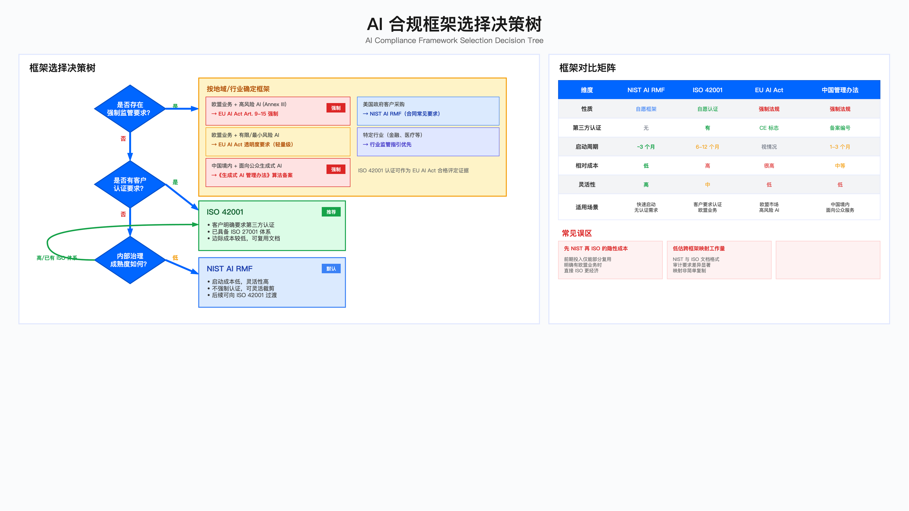

# 15.6 AI 治理与合规落地

---

## 引言：合规框架选择的决策逻辑

AI 合规面临的核心矛盾在于: 监管要求收紧速度与企业资源投入能力之间的不匹配。业务部门对"不直接产生收益的合规投资"天然存在抵触，而合规失败的代价——无论是客户流失、监管罚款还是合同取消——往往在事后才显现。

本节从框架选择、分阶段实施、成本控制三个维度，提供 AI 合规落地的工程化路径。核心原则是: 基于监管强制性与业务风险分级，分阶段投入，避免追求"一步到位完美合规"。

---

## 15.6.1 合规框架的选择决策



### 框架选择决策树

选择 NIST AI RMF、ISO 42001 还是 EU AI Act 合规路径，取决于业务压力点而非技术偏好。

决策逻辑如下:

第一层判断: 是否存在强制监管要求？

若存在强制监管，则按地域和行业确定框架:
- 欧盟业务且涉及高风险 AI（EU AI Act Annex III 定义）→ EU AI Act Article 9-15 强制合规，ISO 42001 认证可作为合格评定证据
- 欧盟业务但属有限/最小风险 AI → EU AI Act 透明度要求（轻量级）
- 中国境内面向公众的生成式 AI 服务 → 《生成式 AI 管理办法》算法备案（强制）
- 美国政府客户采购 → NIST AI RMF（采购合同常见要求）
- 特定行业（金融、医疗等）→ 行业监管指引优先

第二层判断: 若无强制监管，是否有客户认证要求？

- 客户明确要求第三方认证 → ISO 42001（全球认可度较高）
- 已具备 ISO 27001 体系 → ISO 42001 边际成本较低，可复用文档和流程
- 客户不要求认证，内部治理成熟度低 → NIST AI RMF（启动成本低，灵活性高）

### 适用边界与常见误区

适用边界: NIST AI RMF 适用于快速启动、无认证要求、美国市场为主、需要灵活裁剪的场景；ISO 42001 适用于需第三方认证、欧盟客户、已有 ISO 体系基础、品牌定位需求的场景；EU AI Act 强制合规适用于在欧盟提供高风险 AI 系统的场景，无选择余地。

常见误区:

| 误区 | 识别信号 | 后果 | 纠正方法 |
|-----|---------|-----|---------|
| "先 NIST 再过渡 ISO"的隐性成本 | 明确有欧盟业务却选择 NIST 起步 | NIST 工作仅部分复用，重复投资 | 明确有欧盟业务直接启动 ISO 42001 |
| 低估跨框架映射工作量 | 计划一周完成框架映射 | 文档格式、审计要求差异导致返工 | 预留 4-6 周映射与调整周期 |
| 忽视"影子 AI" | AI 资产清单仅含 IT 采购项目 | 业务自行采购 SaaS AI 成合规盲区 | 清单覆盖业务部门采购的所有 AI 工具 |

---

## 15.6.2 NIST AI RMF 快速实施指南

### 为何选择 NIST 作为起点

| 特点 | 说明 | 对比 ISO 42001 |
|-----|-----|---------------|
| 轻量级 | 不强制认证，可灵活裁剪 | ISO 需第三方认证审计 |
| 启动快 | 基础实施周期约 3 个月 | ISO 认证周期通常 6-12 个月 |
| 向上兼容 | 后续可向 ISO 42001 过渡 | 部分工作可复用 |

关键约束: NIST AI RMF 不提供第三方认证，若客户明确要求"通过认证"的书面证明，需评估是否直接采用 ISO 42001。

### 90 天实施计划

#### 阶段 1: 建立治理基础（第 1-4 周）

目标: 启动治理机制，完成 AI 资产盘点

关键任务:

| 任务 | 工作量 | 交付物 | 关键约束 |
|------|--------|--------|----------|
| 在现有安全委员会下设 AI 专题 | 1 周 | 委员会章程 | 避免单独建立"AI 治理委员会"——易被边缘化 |
| AI 系统清单盘点 | 2 周 | 资产清单 | 须包括业务部门自行采购的 SaaS AI 工具 |
| 风险分级 | 1 周 | 高/中/低风险分类 | 建议采用 EU AI Act 分类标准，便于后续对接 |
| AI 使用政策草案 | 2 周 | 核心政策文档 | 首版控制在 10 页以内，避免冗长文档导致落地困难 |

验证方法: AI 资产清单覆盖率检查抽查 3-5 个业务部门，验证是否存在遗漏的 AI 工具；委员会首次会议完成决策记录。

常见失败点: 前两周陷入"谁主导 AI 治理"的组织争论。建议明确: GRC 团队主导（熟悉合规流程），安全团队提供技术支持，AI 团队作为利益相关方参与。

#### 阶段 2: 风险映射（第 5-8 周）

目标: 对高风险 AI 系统完成威胁映射

关键任务:

1. 识别高优先级 AI 系统（建议选取 3-5 个）:
   - 优先级判定可参考公式: 业务影响 × PII 敏感度 × 监管强制系数 / 现有控制成熟度
   - 示例: 招聘 AI（影响就业决策，涉及个人敏感信息，监管关注度高）通常为高优先级

2. MITRE ATLAS 威胁映射（仅针对高优先级系统）:
   - 重点关注三类战术: Initial Access（提示词注入、API 滥用）、ML Attack Staging（对抗样本、数据投毒）、Exfiltration（模型窃取、训练数据泄露）
   - 不建议一次性映射全部 14 个战术——工作量过大且边际效用递减

3. 影响评估（AIIA）简化模板:
   - 核心字段: 系统名称、用途、影响人群、潜在危害、缓解措施、风险等级、审批人
   - 控制在 1 页以内，便于跨部门协作

验证方法: 高风险 AI 的风险评估报告通过委员会评审，评估报告包含可验证的缓解措施。

关键约束: 影响评估需跨部门协作（法务 + 伦理 + AI 团队），实际工作量通常超出预期。

#### 阶段 3: 建立度量体系（第 9-12 周）

目标: 上线 AI 安全监控能力

优先监控指标（建议首批选取 5 个以内）:

| 指标类别 | 具体指标 | 数据源 | 告警触发条件 |
|----------|----------|--------|--------------|
| 性能监控 | 模型准确率、推理延迟 | 推理日志 | 准确率低于基线或延迟超出 SLA |
| 安全监控 | 对抗样本检测 | WAF + 自定义规则 | 日检出次数超出阈值 |
| 隐私监控 | PII 泄漏检测 | DLP 工具 | 任何 PII 泄漏 |
| 合规监控 | 模型审计覆盖率 | 内部系统 | 覆盖率低于目标值 |
| 运营监控 | AI 事件响应时间 | 工单系统 | 超出响应 SLA |

常见误区: 一开始就追求"偏见检测"（复杂度高、见效慢，建议后期再引入），应先做"性能漂移检测"（实现成本低、效果可见）。

验证方法: 仪表盘可正常展示实时数据，至少完成一次告警触发与响应演练。

#### 阶段 4: 风险管理（持续）

目标: 建立 AI 事件响应流程

事件分级建议:

| 级别 | 定义 | 响应 SLA | 决策层级 |
|------|------|----------|----------|
| P0 | 数据泄露、模型被攻陷、监管违规 | 1 小时内启动 | CISO 必须参与 |
| P1 | 性能严重退化、对抗攻击成功、偏见投诉 | 4 小时内启动 | 安全负责人 |
| P2 | 性能轻微漂移、日志异常 | 24 小时内评估 | 值班分析师 |

响应流程核心步骤: 检测 → 分类 → 遏制（暂停模型/回滚版本）→ 调查 → 恢复 → 复盘

验证方法: 完成至少一次桌面演练，响应流程文档经相关团队签字确认。

---

## 15.6.3 ISO 42001 认证实战经验

### 适用场景判断

| 场景 | 建议选择 ISO 42001 | 原因 |
|-----|-------------------|-----|
| 欧盟业务占比较高 | 是 | EU AI Act 认可 ISO 42001 作为合格评定证据 |
| 客户合同明确要求认证 | 是 | 金融、医疗行业常见要求 |
| 已有 ISO 27001 体系 | 是 | 可复用文档和流程，边际成本较低 |
| 需快速通过客户尽调 | 否 | 认证周期较长，不适合快速响应 |

关键约束: ISO 42001 认证周期较长、成本较高（含认证机构费用、内部人力、培训等）。认证周期受组织规模、AI 系统数量、现有体系基础等因素影响，建议在差距分析完成后再评估具体时间表。

### 认证路线图

以下路线图为参考框架，实际周期因组织情况而异。建议各组织根据差距分析结果制定内部时间表。

#### 阶段一：差距分析

目标: 评估当前 AI 管理体系（AIMS）成熟度，识别差距

建议做法: 聘请具有 AI 行业经验的认证咨询顾问（仅有 ISO 27001 经验的顾问可能缺乏 AI 特定场景理解）；推荐选择有 ISO 42001 认证经验的机构（如 BSI、TÜV SÜD、LRQA 等）。

差距分析重点（ISO 42001 核心条款）:

| 条款 | 要求 | 常见差距 |
|------|------|----------|
| 4.3 | AIMS 范围定义 | AI 系统清单不完整 |
| 5.2 | AI 政策 | 有草案但未正式发布 |
| 6.1 | 风险评估 | 缺少"机会"维度（ISO 要求双向评估）|
| 8.2 | AI 影响评估（AIIA）| 覆盖范围不足 |
| 8.3 | 生命周期管理 | 缺乏变更管理流程 |
| 9.1 | 监控度量 | 缺少偏见相关指标 |
| 9.2 | 内部审核 | 缺乏 AIMS 审核经验 |

常见失败点: 低估 AIIA（影响评估）的工作量——每个 AIIA 需跨部门协作，实际耗时通常超出预期。

#### 阶段二：体系建设

关键里程碑:

1. AI 政策正式发布: 董事会审批时重点关注"风险容忍度"条款定义

2. 完成所有 AIIA:
   - 建议制作 3-4 个 AIIA 模板（如客服 AI、推荐系统、分析工具），其他系统可基于模板填写
   - 模板化可显著压缩工作周期

3. 变更管理流程上线:
   - 避免流程过重（如"每次模型更新都要委员会审批"）——会导致 AI 团队抵制
   - 建议区分: 重大变更（如切换底层模型）需审批；参数微调仅需记录

4. 内部审核:
   - 培训 ISO 27001 内审员转型为 ISO 42001 审核员，成本低于外聘
   - 首次内审通常发现 10-15 个不符合项，多为文档完整性问题

#### 阶段三：认证审核

阶段一审核（文档审核）:
- 审核方式: 远程
- 周期: 2-3 天
- 重点: AIMS 文档完整性
- 常见问题: AI 系统清单遗漏外部 API 调用的 AI 服务；风险评估未覆盖供应链风险

阶段二审核（现场审核）:
- 周期: 2-4 天
- 审核员典型问题:
  - "展示一个 AIIA 的完整审批流程"（会随机抽取 1-2 个系统深入验证）
  - "如果模型出现偏见，你们如何响应？"（需演示事件响应流程）
  - "证明 KPI/KRI 仪表盘是实时的"（现场登录系统验证）

审核准备检查清单: 打印所有 AIMS 文档（审核员偏好纸质版）、准备证据包（每个条款对应的证据文件分类归档）、预演审核（让内审员模拟审核员提问）、确保被访谈人员在场。

#### 阶段四：纠正措施与证书颁发

典型不符合项示例:

| 不符合项 | 严重程度 | 整改方向 |
|----------|----------|----------|
| 生命周期管理流程未涵盖模型退役 | 次要 | 补充退役检查清单 |
| 内部审核未覆盖第三方 AI 供应商 | 次要 | 增加供应商审核条款 |
| 部分 AI 系统缺少 AIIA | 严重 | 补做 AIIA |

整改提交后，认证机构将安排远程复审确认整改有效性。证书有效期 3 年，期间需接受年度监督审核。

运行指标: 年度监督审核通过率、不符合项关闭周期、内审发现问题数量趋势。

---

## 15.6.4 EU AI Act 合规实战指南

### High-Risk AI 的强制要求

EU AI Act Annex III 定义了"高风险 AI"类别，包括影响就业决策的 AI 系统（如招聘 AI）。高风险 AI 必须满足 Article 9-15 的全部要求。

#### Article 9: 风险管理系统

监管要求: 建立、实施和维护持续的风险管理流程

实施要点:

| 交付物 | 页数建议 | 核心内容 | 审核重点 |
|-------|---------|---------|---------|
| 风险管理计划 | 15-20 页 | 风险容忍度定义、评估频率 | 可操作性——发现风险后如何处置 |
| 风险评估报告 | 每系统一份 | FMEA 分析、关键风险场景 | P0/P1 风险识别完整性 |
| 上市后监控计划 | 5-10 页 | 公平性指标、投诉分析、重训练 | 持续监控机制 |

常见误区:

| 误区 | 识别信号 | 后果 | 纠正方法 |
|-----|---------|-----|---------|
| 风险管理计划过于冗长 | 超过 50 页 | 审核员无法有效评审 | 控制在 20 页以内，重点放在可操作性 |
| 风险评估缺少处置方案 | 只列风险不列缓解措施 | 审核员质疑有效性 | 每项风险配对应缓解措施 |

#### Article 10: 数据治理

监管要求: 训练数据应"相关、代表性、无错误、完整"

关键合规风险: 训练数据来源的合法性。未经授权使用的数据（如未获用户授权的社交媒体爬虫数据）可能导致 AI 系统禁止上市以及监管罚款。

实施要点:

1. 数据来源审查: 验证数据获取的授权协议、确认遵守 robots.txt 及网站服务条款、社交媒体数据需用户明确同意（符合 GDPR Article 6）。

2. 数据质量审计: 数据代表性（是否覆盖各年龄/性别/种族群体）、数据准确性、数据多样性。

3. 数据溯源系统: 每条训练数据记录来源、授权、采集时间。

关键约束: 预防性数据合规审查的成本远低于事后补救。若在上线后发现数据来源问题，可能需要重新训练模型，导致精度下降和业务影响。

#### Article 13: 透明度义务

监管要求: 向用户提供"清晰、充分"的信息

招聘 AI 场景示例——必须告知候选人的信息包括: 简历将由 AI 系统初筛、AI 评分在最终决策中的权重、AI 使用的评估标准及其权重、人工复审申请渠道、AI 评分理由查询权利。

可解释性实施:
- 使用 SHAP 等工具生成评分解释
- 输出示例: "您的评分为 75 分。主要因素: Python 技能（+20 分）、5 年经验（+15 分）。缺少机器学习项目经验（-10 分）。"

#### Article 14: 人工监督

监管要求: 高风险 AI 必须设计为"可被人工有效监督"

三道防线设计:

| 防线 | 时机 | 措施 | 触发条件 |
|-----|-----|-----|---------|
| 部署前监督 | 上线前 | 偏见/鲁棒性测试，公平性指标达标 | 必须通过门槛 |
| 运行时监督 | 推理时 | 低置信度预测人工复审 | 置信度 < 阈值或用户申诉 |
| 事后审计 | 定期 | 随机抽查 AI 决策，人工验证 | 人机不一致率超阈值暂停模型 |

Override 机制:

| 机制 | 实现 | 记录要求 | 运营用途 |
|-----|-----|---------|---------|
| 人工推翻 | 允许人工推翻 AI 决策 | 记录推翻理由 | 监控推翻率趋势 |
| 模型优化 | 基于推翻数据改进模型 | 推翻案例标注 | 再训练数据集 |

#### Article 64: EU 数据库注册

监管要求: 高风险 AI 上市前必须在 EU 数据库注册

注册流程:

1. 准备注册材料: AI 系统信息、提供商信息、合格评定机构信息、CE 标志、技术文档摘要

2. 通过 EU AI Office 官网提交

3. 持续更新义务: 重大变更须 30 天内更新注册；严重事故须 15 天内报告

---

## 15.6.5 中国《生成式 AI 管理办法》合规要点

### 算法备案流程

在中国境内提供面向公众的生成式 AI 服务，须向国家网信办备案。

#### 备案材料准备

基本信息:
- 营业执照、法定代表人身份证
- 服务器部署在中国境内的证明（如云服务商合同）

算法信息:
- 算法名称、类型、应用场景
- 技术原理、训练数据来源、数据规模、模型参数量

安全自评估报告（重点，通常 20-30 页）:
- 内容安全: 如何防止生成违法有害内容（敏感词库 + 内容分类模型 + 人工复审）
- 数据安全: 训练数据合法性（公开数据集 + 内部数据授权 + 隐私脱敏）
- 算法安全: 如何防止被恶意利用（输入验证 + 速率限制 + 滥用检测）

安全措施证明:
- 实名认证截图、"AI 生成"标识截图
- 内容审核系统架构图、应急响应预案

#### 审查重点与常见补充要求

审查重点: 内容安全最严格（审查员会测试系统能否生成敏感内容）、数据来源合法性（使用爬虫数据需证明遵守 robots.txt）、实名认证落实（需演示用户注册流程）。

常见补充要求: 提供内容审核模型的准确率测试报告、说明如何处理政治敏感内容、补充应急响应演练记录。

关键约束: 不得在备案期间上线服务（否则属于"未备案擅自提供服务"，面临行政处罚）；审查周期因材料完整性和服务类型而异，建议提前与当地网信办沟通了解流程预期；备案通过后获得备案编号，须在服务页面显著位置公示。

#### 备案豁免条件

以下场景通常不需要进行算法备案（需法务确认具体适用性）：

| 场景 | 豁免依据 | 注意事项 |
|------|----------|----------|
| 仅供企业内部使用 | 非"面向公众提供服务" | 需确保无外部用户访问入口 |
| 研发测试阶段 | 非正式对外服务 | 测试用户需为内部员工或签约测试者 |
| 调用第三方已备案服务 | 服务提供方已完成备案 | 需确认第三方备案有效性 |
| B2B 定制服务 | 非面向公众 | 需有明确的企业客户合同 |
| 纯分析型 AI（非生成式） | 不属于生成式 AI 范畴 | 需确认不具备内容生成能力 |

**不可豁免的边界条件**：
- 即使内部使用，若涉及向政府机构提供服务仍需评估
- "测试阶段"不能无限期延长，需有明确的测试计划和结束时间
- B2B 服务若客户再向公众提供，仍需评估责任归属

---

## 15.6.6 合规失败案例与教训

| 案例 | 背景 | 根因 | 教训/措施 |
|-----|-----|-----|---------|
| 认证承诺未兑现 | 承诺期限内通过 ISO 42001，实际超期，客户取消订单 | AIIA 工作量低估；内审发现严重不符合项；认证机构排期延期 | 预留 30%-50% 缓冲；提前锁定认证机构；差距分析后再承诺时间表 |
| 训练数据来源不合法 | 招聘 AI 使用未授权社交媒体爬虫数据，被监管审查 | 数据来源合法性审核缺失 | 所有数据需合法来源证明；遵守 robots.txt；社交媒体数据需用户同意 |
| 算法备案被拒 | AI 写作助手因"内容审核措施不足"被拒 | 敏感词库不完善；人工复审覆盖不足 | 升级敏感词库；高风险内容 100% 人工复审；建立应急响应机制 |

---

## 15.6.7 合规投资决策框架

### ROI 评估方法

合规投资决策应基于量化分析而非直觉判断。

评估公式:

ROI = (避免损失 + 业务机会) / 合规成本

其中:
- 避免损失 = 监管罚款风险 + 客户取消合同风险 + 声誉损失
- 业务机会 = 新客户获取 + 溢价能力

决策逻辑: ROI 超过组织设定的投资门槛时，应投入合规建设。

关键约束: 罚款风险评估需结合发生概率（而非仅看最高罚款额度）、业务机会评估需考虑市场认可度的实际影响、成本评估须包含持续维护费用（如年度监督审核）。

### 分阶段合规路径

| 阶段 | 目标 | 方案 | 适用场景 | 典型周期 |
|-----|-----|-----|---------|---------|
| 阶段 1: 合规 MVP | 通过客户尽调 | NIST AI RMF 快速实施 | 初创公司、无强制监管 | 3 个月 |
| 阶段 2: 认证落地 | 获得第三方认证 | ISO 42001 认证 | 有欧盟业务、客户要求认证 | 6-12 个月 |
| 阶段 3: 深度合规 | 满足高风险 AI 监管要求 | EU AI Act 全面实施 | 招聘/信贷/医疗等高风险 AI | 12-18 个月 |

### 验证方法

| 验证方法 | 验证目标 | 实施方式 | 判定标准 |
|---------|---------|---------|---------|
| 客户尽调通过率 | 合规 MVP 有效性 | 跟踪尽调结果 | 通过率 ≥ 90% |
| 认证审核一次通过率 | 体系建设充分性 | 认证审核结果 | 无严重不符合项 |
| 监管检查结果 | 合规要求满足度 | 监管检查报告 | 无重大不符合项 |

### 运行指标

| 指标名称 | 采集方式 | 阈值表达 | 触发动作 |
|---------|---------|---------|---------|
| 合规覆盖率 | AI 系统清单统计 | < 80% | 加速未覆盖系统合规 |
| 不符合项关闭周期 | 工单系统 | 平均 > 30 天 | 资源调配、流程优化 |
| 年度合规维护成本 | 财务系统 | 超预算 20% | 成本复盘、预算调整 |
| 合规相关投诉 | 投诉系统 | 季度 > 5 起 | 根因分析、改进措施 |

---

## 15.6.8 监管演进趋势（2025-2027）

AI 监管正在从"原则性框架"向"强制执法"快速演进。本节提供 2025-2027 年关键监管里程碑的预测分析，帮助企业提前规划合规投资节奏。

### EU AI Act 分阶段实施时间线

EU AI Act 于 2024 年 8 月正式生效，采用分阶段实施策略。企业需根据自身 AI 系统类型，匹配对应的合规截止日期。

#### 实施时间线全景图

```
2024.08 ─────────────────────────────────────────────────────────────────────────────────────────> 2027+
    │
    ├─ 2024.08.01: EU AI Act 正式生效
    │
    ├─ 2025.02.02: 禁止条款生效 (Article 5)
    │   ├─ 社会评分系统禁止
    │   ├─ 公共场所实时生物识别（执法例外）禁止
    │   ├─ 情感识别（工作场所/教育）禁止
    │   └─ 认知行为操控禁止
    │
    ├─ 2025.08.02: AI 素养与通用 AI 规则生效
    │   ├─ Article 4: AI 素养培训义务
    │   ├─ Article 50: GPAI 模型透明度要求
    │   └─ Article 51-52: 系统性风险 GPAI 模型义务
    │
    ├─ 2026.08.02: 高风险 AI 系统全面合规
    │   ├─ Annex III 定义的高风险系统须满足 Article 9-15
    │   ├─ CE 标志强制要求
    │   ├─ EU 数据库注册强制要求
    │   └─ 合格评定程序完成
    │
    └─ 2027.08.02: 嵌入式高风险 AI 合规
        └─ 作为产品安全组件的 AI 系统（如医疗器械 AI、汽车 AI）
```

#### 合规优先级决策矩阵

| 时间窗口 | 影响范围 | 紧迫度 | 建议行动 |
|---------|---------|--------|---------|
| 2025.02 禁止条款 | 使用禁止类 AI 的企业 | 极高 | 立即审计并停用违规系统 |
| 2025.08 AI 素养 | 所有 AI 开发/部署企业 | 高 | 启动全员 AI 素养培训计划 |
| 2025.08 GPAI 透明度 | 通用 AI 模型提供商 | 高 | 准备技术文档与模型卡 |
| 2026.08 高风险合规 | 高风险 AI 系统运营商 | 中 | 启动 Article 9-15 合规建设 |
| 2027.08 嵌入式 AI | 产品安全组件 AI | 中 | 协调产品合规与 AI 合规 |

#### 关键合规准备任务清单

**2025 年 Q1 必须完成**（禁止条款生效前）：

- [ ] 完成 AI 系统清单全面盘点
- [ ] 识别并标记可能触及禁止条款的系统
- [ ] 对高风险禁止边界案例获取法务意见
- [ ] 制定禁止系统替代方案或退役计划
- [ ] 更新 AI 采购政策，禁止采购违规工具

**2025 年 Q2 必须启动**（AI 素养义务生效前）：

- [ ] 设计 AI 素养培训课程（覆盖 AI 用户与开发者）
- [ ] 建立培训记录与证书管理系统
- [ ] GPAI 模型提供商：准备技术文档与透明度报告

**2025 年 Q4 至 2026 年 Q2**（高风险合规准备期）：

- [ ] 对高风险 AI 系统完成 AIIA（影响评估）
- [ ] 建立符合 Article 9 的风险管理系统
- [ ] 实施 Article 10 数据治理要求
- [ ] 部署 Article 13 透明度与 Article 14 人工监督机制
- [ ] 选择合格评定机构并启动评定流程

### ISO 42001 认证实践演进

#### 认证生态成熟度预测

| 时间节点 | 认证机构状态 | 企业认证趋势 | 市场认可度 |
|---------|-------------|-------------|-----------|
| 2025 H1 | 主流机构完成审核员培训，审核能力仍受限 | 先行者（金融、医疗、跨国企业）启动认证 | 欧盟客户开始询问认证状态 |
| 2025 H2 | 审核能力扩展，排期竞争激烈 | 第二批企业（科技、零售）跟进 | ISO 42001 成为 RFP 常见要求 |
| 2026 | 认证审核常态化，审核周期可预期 | 规模化认证阶段 | 未获认证可能导致商业机会丧失 |
| 2027+ | 监督审核与再认证成熟 | 持续改进阶段 | ISO 42001 成为行业准入门槛 |

#### ISO 42001 与 EU AI Act 协同策略

EU AI Act Article 41 明确：符合欧盟协调标准或通用规范的高风险 AI 系统，可推定符合相应要求。ISO 42001 预期将被纳入欧盟协调标准体系。

**协同实施路径**：

```
                           ┌─────────────────────────┐
                           │   ISO 42001 认证体系    │
                           │   (AI 管理体系基础)     │
                           └───────────┬─────────────┘
                                       │
                    ┌──────────────────┼──────────────────┐
                    ▼                  ▼                  ▼
          ┌─────────────────┐ ┌─────────────────┐ ┌─────────────────┐
          │ 风险管理流程    │ │ 数据治理机制    │ │ 生命周期管理    │
          │ (复用于 Art.9)  │ │ (复用于 Art.10) │ │ (复用于 Art.15) │
          └─────────────────┘ └─────────────────┘ └─────────────────┘
                    │                  │                  │
                    └──────────────────┼──────────────────┘
                                       ▼
                           ┌─────────────────────────┐
                           │   EU AI Act 合规评定    │
                           │   (Art. 41 推定合规)    │
                           └─────────────────────────┘
```

**投资复用建议**：

| ISO 42001 条款 | EU AI Act 对应条款 | 复用程度 | 增量工作 |
|---------------|-------------------|---------|---------|
| 6.1 风险评估 | Article 9 | 高（80%） | 补充欧盟特定风险场景 |
| 8.2 影响评估 | Article 9(2) | 高（85%） | 格式对齐 |
| 6.1.3 数据管理 | Article 10 | 中（60%） | 补充数据代表性证明 |
| 8.3 生命周期 | Article 15 | 中（70%） | 补充退役处置 |
| 9.1 监控度量 | Article 9(4) | 高（75%） | 补充上市后监控 |

### 全球监管格局演进

#### 主要司法管辖区监管对比（2025-2027）

| 地区 | 监管框架 | 2025 关键节点 | 2026-2027 趋势 | 对中国出海企业影响 |
|-----|---------|--------------|---------------|------------------|
| **欧盟** | EU AI Act | 禁止条款生效、GPAI 规则生效 | 高风险 AI 全面执法、罚款案例出现 | 欧盟市场准入强制门槛 |
| **美国** | NIST AI RMF（自愿）、州级立法 | 科罗拉多州 AI 法生效（2026.02）、各州跟进 | 联邦立法可能性增加、行业监管收紧 | 州级合规碎片化风险 |
| **英国** | 原则导向监管 | 行业监管机构发布 AI 指引 | 可能引入立法框架 | 相对灵活的监管环境 |
| **中国** | 《生成式 AI 办法》+ 行业监管 | 备案执法趋严、行业细则出台 | 监管覆盖范围扩大 | 境内服务强制合规 |
| **新加坡** | AI Verify（自愿） | 金融业 AI 监管收紧 | 可能引入强制框架 | 东南亚区域合规标杆 |
| **日本** | AI 治理指引（自愿） | 行业自律深化 | 强制立法可能性低 | 相对宽松环境 |

#### 美国州级 AI 立法追踪

美国缺乏联邦级 AI 综合立法，但州级立法正在快速演进。企业需特别关注科罗拉多州立法（对高风险 AI 设定强制义务）。

**科罗拉多州 AI 法案（SB 21-169 后续）关键要求**（2026.02.01 生效）：

- 高影响 AI 系统须完成影响评估
- 消费者告知义务
- 偏见风险管理
- 监管报告义务

**预测：2025-2027 年可能跟进立法的州**：

- 加利福尼亚州（全球最严隐私监管传统）
- 纽约州（金融与就业 AI 监管先行）
- 伊利诺伊州（生物识别 AI 监管）
- 华盛顿州（科技产业密集）

**应对建议**：建立"最严标准"合规策略——以最严格州的要求为基线，避免多套合规体系的维护成本。

#### 中国监管深化预测

| 维度 | 2025 趋势 | 2026-2027 预测 |
|-----|---------|---------------|
| **备案执法** | 执法案例增加，未备案处罚 | 常态化执法，跨部门联动 |
| **行业细则** | 金融、医疗、教育行业细则出台 | 覆盖更多行业 |
| **数据安全** | 训练数据合规审查趋严 | 数据来源溯源强制 |
| **内容安全** | 深度合成标识强制 | 生成内容可追溯要求 |
| **跨境监管** | 出境数据评估 | 跨境 AI 服务监管 |

### 合规规划建议

#### 时间窗口利用策略

```
2025 Q1    Q2       Q3       Q4    2026 Q1    Q2       Q3       Q4    2027
  │         │        │        │        │        │        │        │        │
  │ ┌───────────────┐│        │        │        │        │        │        │
  │ │禁止系统退役   ││        │        │        │        │        │        │
  │ └───────────────┘│        │        │        │        │        │        │
  │         │ ┌─────────────────────┐  │        │        │        │        │
  │         │ │AI 素养培训体系建设  │  │        │        │        │        │
  │         │ └─────────────────────┘  │        │        │        │        │
  │         │        │ ┌───────────────────────────────────┐       │        │
  │         │        │ │ISO 42001 认证 (建议提前于 EU 强制)│       │        │
  │         │        │ └───────────────────────────────────┘       │        │
  │         │        │        │ ┌──────────────────────────────────────────┐│
  │         │        │        │ │高风险 AI 系统 Article 9-15 合规建设      ││
  │         │        │        │ └──────────────────────────────────────────┘│
  │         │        │        │        │        │        │ ┌────────────────┤
  │         │        │        │        │        │        │ │合格评定完成    │
  │         │        │        │        │        │        │ └────────────────┤
  ▼         ▼        ▼        ▼        ▼        ▼        ▼        ▼        ▼
```

#### 资源投入节奏建议

| 时间段 | 重点投入领域 | 预算占比建议 | 关键交付物 |
|-------|-------------|-------------|-----------|
| 2025 H1 | 禁止系统审计、AI 素养基础 | 20% | 禁止系统清单、培训计划 |
| 2025 H2 | AI 素养落地、ISO 42001 启动 | 25% | 培训完成率 >80%、差距分析报告 |
| 2026 H1 | ISO 42001 体系建设、高风险评估 | 30% | AIMS 体系文档、AIIA 完成 |
| 2026 H2 | ISO 42001 认证、合格评定启动 | 25% | 认证证书、评定机构选定 |

#### 监管不确定性应对

| 不确定性来源 | 应对策略 | 具体措施 |
|-------------|---------|---------|
| 执法力度未知 | 保守合规 | 以最严解释为基准 |
| 协调标准未定稿 | 灵活体系 | 基于 ISO 42001 构建可适应框架 |
| 美国联邦立法走向 | 双轨准备 | 同时满足欧盟强制 + 美国自愿框架 |
| 中国细则演进 | 提前沟通 | 与监管机构保持沟通渠道 |

### 监管情报机制建设

建议企业建立系统性的监管情报追踪机制：

**情报来源层次**：

| 层次 | 来源 | 更新频率 | 价值 |
|-----|-----|---------|-----|
| 一级 | 官方公报（EU Official Journal、国家法规库） | 实时 | 最权威 |
| 二级 | 监管机构指引（AI Office、网信办） | 月度 | 解释执法口径 |
| 三级 | 行业协会解读（ISACA、CSA） | 季度 | 实践指导 |
| 四级 | 专业咨询机构（律所、咨询公司） | 按需 | 定制分析 |

**建议流程**：

1. 指定合规情报责任人（可由 GRC 团队承担）
2. 订阅关键监管机构更新
3. 季度监管演进分析报告
4. 年度合规路线图更新

---

## 本节要点

合规不是一次性工程，而是与业务发展匹配的动态投资过程。在"快速上市"与"完美合规"之间找到平衡点，需要安全团队与业务部门的持续对话，以及基于数据的投资决策。

> **注**：AI 安全服务目录与事件响应 Playbook 已独立为 [15.7 AI 安全运营](./15.7_ai_security_operations.md)，实现合规治理与运营服务的职责分离。

---

## 导航

**[← 上一节：15.5 数据安全与隐私](./15.5_data_privacy.md)** | **[返回章节目录](./README.md)** | **[下一节：15.7 AI 安全运营 →](./15.7_ai_security_operations.md)**

---

**© 2025 AI-ESA Project. Licensed under CC BY-NC-SA 4.0**

