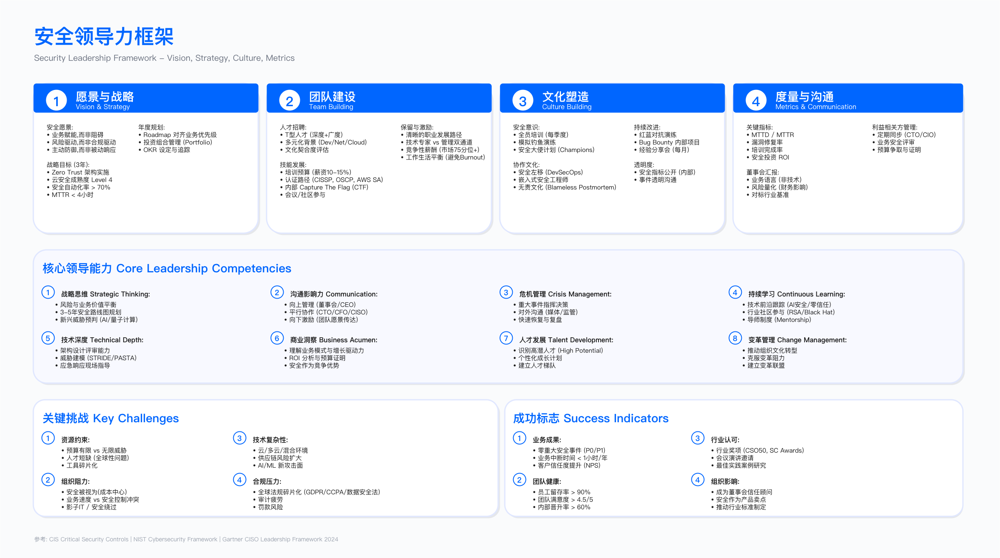
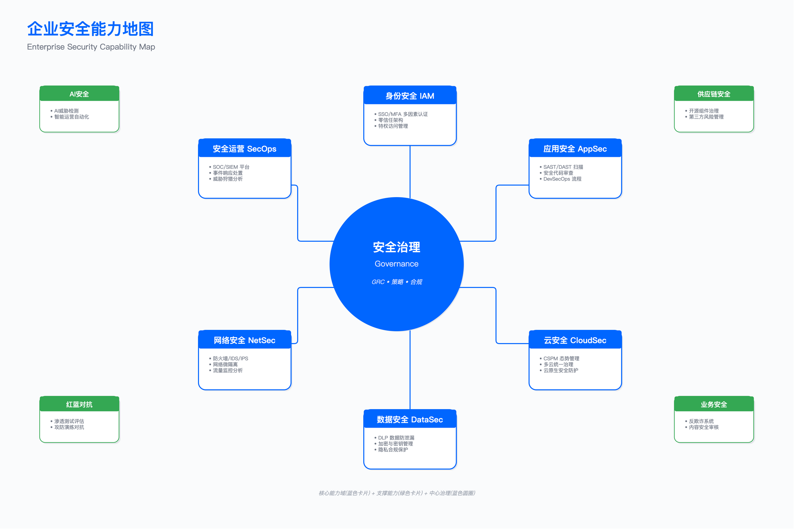

# 执行摘要 (Executive Summary)

> **本节目标**：阐述安全领导力与组织建设的核心问题域、组织模式选型逻辑、人才战略设计要点与文化建设路径，为后续章节建立决策框架。

---

## 安全组织面临的结构性矛盾

企业安全组织建设的核心挑战不在技术层面，而在于组织、人才和文化三个维度的结构性矛盾。理解这些矛盾的本质，是设计有效组织架构的前提。

安全组织与业务组织的根本差异在于：业务组织的产出是可见的产品和服务，而安全组织的产出是"未发生的事件"。这一特性导致安全团队在资源争夺中处于天然劣势——成功的安全工作是无形的，而失败则会被放大。CISO 需要认识到这一结构性困境，并在组织设计中预先考虑如何让安全价值可见化。

### 业务速度与安全质量的矛盾

敏捷开发和 DevOps 模式将产品发布周期从季度级压缩至周级甚至日级。但多数企业的安全审查流程仍采用串行模式：提交申请、排队等待、人工审查、反馈修改、再审查。这一流程通常需要一周或更长时间。

当产品发布窗口与安全审查周期产生冲突时，实际结果往往是安全审查被跳过或降级。这种"变通"操作并非产品团队有意绕过安全，而是组织机制未能适应业务节奏的必然结果。

一个常见的场景是：产品团队在周五下午提交发布申请，要求下周一上线。安全团队的审查排期已满，且周末无人值班。产品经理面临客户承诺的压力，向上级申请"特批"。最终结果是：要么安全审查被跳过，要么高级管理层被迫在没有充分信息的情况下做风险决策。这一模式反复出现，说明问题根源在机制而非个别人员的判断失误。

适用边界：该矛盾在以下场景尤为突出——多产品线并行发布、安全团队人员配置不足、缺乏自动化安全门禁的组织。

关键约束：

- 安全审查产能与发布需求的供需比通常低于 1:1
- 人工审查的边际成本不随规模下降
- 被绕过的安全流程会产生"合规假象"，实际风险敞口完全暴露

常见误区：

1. 试图通过增加人力解决产能不足——人工审查的线性扩展模式无法匹配指数级增长的发布需求
2. 将安全审查简化为检查清单——形式化的检查无法发现设计层面的安全缺陷

验证方法：

- 统计安全审查实际完成率与跳过率
- 对比审查覆盖版本与未覆盖版本的线上漏洞密度
- 回溯安全事件，分析其对应版本是否经过完整审查

运行指标：

- 安全审查完成率（目标触发条件：低于某一组织设定阈值时预警）
- 审查等待时间中位数
- 跳过审查的版本占比

### 人才短缺与技能演进的矛盾

安全人才市场长期处于供不应求状态，高级安全岗位的招聘周期普遍较长。更深层的问题在于技能要求的快速演进：五年前属于"可选技能"的云安全、容器安全，已成为多数岗位的必备要求；供应链安全、AI 安全等新兴领域的人才储备几乎为零。

这意味着企业不仅需要在竞争激烈的市场中招聘，还必须接受一个现实：当前招聘到的人员，其技能在一定周期后可能无法满足新的威胁与技术要求。

这一矛盾的实际表现是：当企业启动云迁移项目时，发现现有安全团队缺乏云安全能力；当 AI 应用开始部署时，发现没有人了解 AI 安全的评估方法；当 Kubernetes 成为主流容器编排平台时，发现团队仍在使用传统虚拟机的思维模式进行安全管控。每一次技术转型都会暴露安全团队的能力缺口，而填补这些缺口的周期往往长于业务期望。

适用边界：该矛盾在技术迭代快、业务增长快的组织中更为显著。传统行业因技术栈稳定，技能演进压力相对较小。

关键约束：

- 招聘周期与岗位空缺造成的产能损失
- 新员工培养周期内的效率折损
- 成熟工程师承担额外负荷导致的疲劳与流失

常见误区：

1. 过度依赖外部招聘而忽视内部培养——招聘成本高且周期长，内部培养是可持续的能力建设路径
2. 追求"全栈安全人才"——T 型人才模型比全栈模型更具可行性

验证方法：

- 定期进行技能差距评估（对照新兴威胁与技术要求）
- 追踪培训投入与能力提升的相关性
- 分析离职人员的技能分布与在岗时长

运行指标：

- 关键岗位填充周期
- 年度流失率（分职级统计）
- 人均培训时长与认证获取率

### 孤岛式运作与跨职能协作的矛盾

安全工作需要与开发、运维、产品、合规、法务等多个部门协作。但传统的组织结构和绩效考核机制往往制造协作壁垒。

典型场景是 DevSecOps 落地困难：开发团队考核功能交付速度，安全团队考核漏洞修复率和合规达成，运维团队考核系统稳定性。当新版本发布时，三方的目标冲突导致拉锯。缺乏协调机制时，结果要么是业务压力迫使安全妥协，要么是安全坚持导致业务延期。

一个具体的例子：安全扫描发现某个开源组件存在高危漏洞，需要升级到新版本。开发团队评估后发现升级需要修改大量代码并重新测试，可能影响发布计划。运维团队担心新版本可能带来兼容性问题，增加运维风险。三方在会议上各执己见，最终问题升级到 VP 层面。VP 缺乏技术背景，无法做出专业判断，只能凭直觉决策。这一场景在缺乏跨职能治理机制的组织中反复上演。

适用边界：该矛盾在多部门串行审批的组织中尤为突出。已建立跨职能治理机制的组织可有效缓解。

关键约束：

- KPI 不一致导致的激励冲突
- 缺乏共同目标的跨部门协作难以持续
- 串行审批模式的时间成本随参与部门数量线性增长

常见误区：

1. 认为协作问题是"态度问题"——实际上多数是机制问题，KPI 不一致时团队再尽职也会陷入内耗
2. 试图通过增加沟通频次解决协作问题——机制不变，沟通越多内耗越大

验证方法：

- 对比串行与并行审批模式下的审批时效
- 追踪跨部门协作中的需求冲突频次与解决路径
- 评估跨职能治理机制（如安全委员会）的实际决策效力

运行指标：

- 跨部门审批时效
- 需求冲突上升到高层的频次
- 安全委员会决策的执行率

---

## 安全组织成熟度与业务影响

安全组织的成熟度直接影响业务敏捷性、风险水平、运营成本、人才吸引力和客户信任度。以下从多个维度分析成熟组织与传统组织的差异。

### 业务敏捷性：从瓶颈到支撑

成熟安全组织的特征是将安全能力嵌入 CI/CD 流程，通过自动化扫描覆盖多数检查项，仅保留必要的人工审查。这一模式下，安全审查不再是发布瓶颈。开发人员在提交代码时即可获得安全反馈，无需等待排队审查。自动化门禁可以在构建阶段拦截高风险变更，同时放行符合安全基线的常规变更。人工专家仅介入复杂场景，如新架构引入、敏感数据处理逻辑变更、权限模型调整等。

传统安全组织的特征是人工串行审查，周期长、产能有限。当审查成为瓶颈时，产品团队倾向于绕过或降级安全要求。安全团队的审查能力是固定的，而业务的发布需求是增长的，这一供需失衡在业务快速扩张期尤为突出。

验证方法：

- 对比安全审查时效与产品发布周期的匹配度
- 统计因安全审查导致的发布延期比例

### 风险降低：从被动修复到主动防御

成熟安全组织建立了漏洞管理流程、自动化跟踪、优先级排序、SLA 考核机制，高危漏洞修复周期可控。漏洞从发现到修复的全流程透明可追踪，责任明确，升级路径清晰。高危漏洞触发自动告警并进入加急处理通道，修复状态实时同步给相关干系人。

传统安全组织的漏洞管理依赖人工催促，缺乏强制 SLA，修复周期长且不可预期。安全团队发现漏洞后，需要反复与开发团队沟通确认修复排期，进展取决于对方的配合意愿。当漏洞积压到一定数量时，安全团队陷入"催促疲劳"，开发团队产生"狼来了"心理，双方信任逐渐消耗。

验证方法：

- 追踪高危漏洞从发现到修复的时间分布
- 对比安全事件的检测时间与遏制时间

### 成本优化：从人海战术到效率提升

成熟安全组织通过自动化降低重复性人工工作，安全工程师专注于复杂问题。同样的人员配置可支撑更大的业务规模。自动化不仅体现在扫描工具上，还包括工单流转、报告生成、状态追踪、指标统计等全流程环节。一名资深安全工程师的时间应该用于威胁建模、架构评审、复杂漏洞分析，而非手工整理扫描报告或催促开发团队。

传统安全组织自动化率低，大量时间消耗在手工扫描报告查看、日志分析、进度跟踪和报告撰写上。安全工程师的日常工作被低价值活动占据，无法投入到真正需要专业判断的场景中。高薪聘请的安全专家如果大部分时间在做表格和催进度，是对人才的严重浪费。

验证方法：

- 统计安全流程的自动化覆盖率
- 对比人均负责系统数与事件处理量

### 人才吸引：技术栈与成长空间的影响

成熟安全组织的技术栈现代化、成长空间明确，对优秀候选人具有吸引力。招聘周期短，流失率低。优秀的安全人才在面试时会评估团队的技术深度、工具链成熟度、职业发展空间。一个拥有完整 DevSecOps 工具链、清晰双轨职业路径、定期培训预算的团队，在人才市场上具有显著竞争优势。

传统安全组织技术栈陈旧、流程落后，难以吸引和保留高水平人才。当候选人发现团队仍在使用过时的扫描工具、依赖人工报告、缺乏自动化流程时，即使薪资有吸引力，也会担忧技能退化风险。入职后如果发现与预期不符，试用期离职的概率会显著上升。

验证方法：

- 追踪 Offer 接受率与入职后一年内流失率
- 分析候选人拒绝 Offer 的原因分布

### 客户信任：认证与评估通过率

对 ToB 业务，客户的安全尽职调查是销售流程的关键环节。成熟安全组织具备完整的认证体系和 GRC 能力，客户安全评估通过率高。当客户发送安全问卷时，成熟团队可以快速响应，提供完整的合规认证、安全白皮书、渗透测试报告等标准化材料。销售团队无需反复协调内部资源，客户体验也更加专业。

传统安全组织缺乏体系化建设，客户评估成为销售障碍。每次客户问卷都需要临时组织人员填写，信息不一致、响应慢、证据材料不完整。销售人员抱怨安全团队拖慢了交易进度，安全团队则疲于应付重复性工作。更严重的情况是：因无法通过客户安全评估而丢单，但这一损失往往不会被归因到安全能力不足。

验证方法：

- 统计客户安全评估的通过率与首次通过率
- 追踪因安全评估未通过导致的丢单比例

---

## 章节目标

本章提供构建高效安全组织的框架与方法，涵盖以下核心领域：

### 组织战略与架构

- 安全组织的使命定位与战略对齐
- 组织架构模式选型（集中式、分布式、混合式、Hub & Spoke）
- 组织成熟度评估与演进路径
- 10 大安全职能域与 RACI 矩阵

### 人才体系

- T 型人才能力模型与能力矩阵
- 招聘策略与评估框架
- 职业发展路径（IC Track 与 Management Track）
- 绩效评估与激励机制

### 文化建设

- Security Champions 计划设计与运营
- 安全培训体系（分层、分角色）
- 安全文化成熟度评估

### 预算与协作

- 预算编制方法与行业基准
- ROI 量化与向上沟通
- DevSecOps 协作机制
- BISO 协作模式与安全委员会

---

## 核心概念与框架

### 安全组织战略（16.1 节）

安全组织战略的核心问题是：安全团队在企业中扮演什么角色？这一定位决定了组织架构设计、人员招聘标准、绩效考核方式以及与其他部门的协作模式。

传统安全使命与现代安全使命的对比

传统安全使命聚焦于系统与数据保护，定位为风险控制者，使用技术术语沟通，以合规达成和无事故作为衡量标准。这种模式下，安全团队是"守门人"，职责是阻止不安全的行为发生。问题在于：守门人天然与业务发展存在张力，当安全成为速度的阻碍时，业务会寻找绕过守门人的方法。

现代安全使命聚焦于业务支持与创新，定位为业务支持者，使用业务语言沟通，以业务韧性、创新速度和客户信任作为衡量标准。这种模式下，安全团队是"赋能者"，职责是帮助业务在可接受的风险范围内快速前进。安全团队不仅要说"这样不行"，更要说"换成这样做可以"。

安全组织成熟度模型（五级）

成熟度模型的价值在于提供一个自我诊断和目标设定的框架。需要注意的是，多数企业处于级别 2 到级别 3 之间，能够达到级别 4 的企业已属少数，级别 5 更是行业标杆水平。

- 级别 1（被动响应）：事后修复，缺乏规划，依赖外部。安全被视为成本中心。组织特征：没有专职安全人员，安全工作由 IT 运维兼任，出事后临时找外部服务商处理。
- 级别 2（合规驱动）：满足合规要求，建立基础流程，部署基本工具。安全被视为合规职能。组织特征：有专职安全人员但规模小，工作重心是应对审计和合规检查，缺乏主动发现问题的能力。
- 级别 3（主动防御）：引入威胁情报、SDL、SOC，实现部分自动化。安全被视为风险管理职能。组织特征：建立了完整的安全团队，具备主动发现和处置威胁的能力，但安全与业务的协同仍有改进空间。
- 级别 4（业务支持）：DevSecOps、BISO 模式运作，安全能力产品化。安全被视为业务加速器。组织特征：安全深度嵌入业务流程，不再是发布瓶颈；安全能力以服务形式提供给内部客户。
- 级别 5（战略领先）：行业引领，持续创新，安全文化深入组织。安全被视为竞争优势。组织特征：安全成为企业对外品牌的一部分，在行业会议上分享实践，吸引顶尖人才加入。

适用边界：成熟度评估适用于自我诊断和目标设定，但不同行业、不同规模的组织对各级别的定义可能存在差异。

常见误区：

1. 试图跳级演进——每一级别的能力是上一级别的基础，跳级会导致能力空心化
2. 将成熟度等同于人员规模——成熟度的核心是能力质量而非数量

### 安全组织架构模式（16.2 节）

组织架构模式的选择是 CISO 上任后需要回答的关键问题之一。没有一种架构模式是普遍适用的，选择取决于企业规模、业务特点、组织文化和现有人员能力。错误的架构选择会导致协作低效、责任不清、资源浪费。

四大架构模式

集中式架构：所有安全职能集中于 CISO 下属团队。优点是标准统一、资源集中、技术深度强、规模效应明显。缺点是响应慢、业务理解不足、容易成为瓶颈。适用于中小规模企业、强监管行业、技术债务高的组织。在这种模式下，业务线需要安全服务时，向中央安全团队提交请求，排队等待处理。

分布式架构（BISO 模式）：安全人员嵌入各业务线，中央团队仅保留策略制定职能。优点是业务理解深、响应快、可定制化。缺点是标准分散、资源重复、技术深度不足。适用于大型多业务线企业、快速创新型组织。在这种模式下，BISO 与业务线 GM 一起工作，深度参与产品规划和技术决策，安全需求被"内化"而非"外加"。

混合式架构：中央团队负责策略、架构和专家支持，业务线配置 BISO，开发团队配置 Security Champions。兼顾中央控制与业务敏捷。缺点是复杂度高、协调成本高。适用于大型企业、DevSecOps 成熟的组织。这种模式需要清晰的职责边界定义和高效的协调机制，否则容易出现责任推诿或重复工作。

Hub & Spoke（中心辐射式）：中央设置专家团队（Hub），各业务线配置 BISO（Spoke），开发团队配置 Champions。在规模化与可持续性方面达到较好平衡。适用于大型企业、多业务线、DevSecOps 成熟的组织。Hub 提供专业深度和标准化能力，Spoke 提供业务理解和快速响应，Champions 提供一线触点和文化渗透。

架构选型决策逻辑：

- 企业规模较小（如员工数少于某一阈值）时，集中式架构是合理选择
- 业务线数量较多时，需要考虑混合式或 Hub & Spoke 模式
- 架构选型需综合考虑企业规模、业务复杂度、组织文化和现有人员能力

关键约束：

- 架构模式选择受限于企业整体组织架构风格
- BISO 模式需要具备复合能力（技术 + 业务）的人才，市场供给有限
- 架构过渡需要设计迁移路径，避免组织动荡

常见误区：

1. 照搬行业标杆组织架构——不同企业的业务特点、组织文化、人员能力存在差异
2. 架构设计过于理想化——未考虑现有人员能力与过渡成本

### 安全团队职能划分（16.3 节）

职能划分的目的是明确"谁负责什么"，避免责任真空或重叠。小型团队可能由少数人覆盖多个职能域，大型团队则需要专业化分工。无论规模如何，职能域的完整覆盖是安全能力建设的基础。

10 大核心职能域

1. 战略与架构：安全战略、架构设计、标准制定。该职能域定义"做什么"和"怎么做"的蓝图。
2. GRC：治理、风险管理、合规、政策。该职能域确保安全工作符合法规要求和企业风险偏好。
3. 应用安全：SDL、代码审查、漏洞扫描、渗透测试。该职能域保障软件产品的安全性。
4. 基础设施安全：网络安全、云安全、端点安全。该职能域保护底层平台和基础设施。
5. 安全运营（SOC）：监控、检测、响应、威胁情报。该职能域发现和处置实时威胁。
6. 身份与访问：IAM、特权管理、SSO、MFA。该职能域控制"谁可以访问什么"。
7. 数据安全：数据分类、加密、DLP、隐私。该职能域保护企业核心数据资产。
8. 事件响应：IR、取证、业务连续性。该职能域处置安全事件并恢复业务。
9. 安全工程：工具开发、自动化、集成。该职能域构建和维护安全技术平台。
10. 安全意识：培训、Champions、文化建设。该职能域提升全员安全意识和行为。

适用边界：职能划分需根据组织规模调整。小型团队可能由少数人员覆盖多个职能域；大型团队则需要专业化分工。

验证方法：

- 使用 RACI 矩阵明确各活动的职责分配
- 定期审视职责边界，识别责任真空或重叠

### 安全能力模型（16.4 节）

安全能力模型解决的问题是：如何定义和评估安全人员的能力？如何设计职业发展路径？如何平衡专业深度与知识广度？

T 型人才模型

T 型人才模型是安全领域广泛认可的能力模型。它承认一个现实：安全领域过于庞大，没有人能在所有方向都达到专家水平。合理的策略是：在多个领域具备基础理解（横向），同时在一两个领域达到专家水平（纵向）。

横向技能（广度）：了解多个安全领域（云安全、容器安全、AI 安全、DevOps、合规、GRC 等）。横向技能使安全人员能够理解不同领域的挑战和术语，与跨领域同事有效协作，识别问题何时需要升级给其他领域的专家。

纵向技能（深度）：在一到两个领域达到专家级水平。纵向技能是个人的核心竞争力，是解决复杂问题和提供专业判断的基础。

职业发展路径（双轨制）

双轨制解决的问题是：优秀的技术专家不一定适合做管理，但如果只有管理路径才能晋升和加薪，技术专家要么被迫转管理（可能导致管理岗位不匹配和技术能力流失），要么离开寻找更好的发展空间。

IC Track（个人贡献者路径）：从初级工程师逐步发展为 Staff、Principal、Distinguished 等高级技术角色。IC Track 的高层级人员是技术决策者，负责解决最复杂的技术问题、定义技术标准、指导其他工程师。

Management Track（管理路径）：从 Team Lead 发展为 Manager、Director、VP、CISO。Management Track 的职责重心是人员管理、资源调配、跨部门协调和战略规划。

转换机制：中层级可在两条路径间转换，高层级转换难度较大。一名 Senior Engineer 可以选择继续 IC 路径晋升为 Staff Engineer，也可以转向 Management 路径成为 Team Lead。但一旦达到 Principal 或 Director 级别，跨轨道转换需要重新积累对应路径的经验。

适用边界：双轨制适用于规模较大、职级体系完善的组织。小型团队可能无法提供完整的双轨发展空间。

常见误区：

1. 只有管理路径——技术专家被迫转管理，导致技术能力流失和管理岗位不匹配
2. 双轨制形同虚设——IC Track 的薪酬和晋升空间不如 Management Track，实际上仍是单轨

### 安全人才招聘与发展（16.5 节）

安全人才招聘的挑战在于：市场供给不足、评估难度大、文化匹配难以判断。一个通过技术面试的候选人，入职后可能因为无法与开发团队有效协作而产出不佳。招聘评估需要覆盖技术能力、实战经验、协作能力和文化匹配等多个维度。

招聘评估框架（以 application security engineer 为例）

技术基础评估：OWASP Top 10 深度理解、SAST/DAST 工具使用、编程能力、SDL 流程经验。这一维度评估候选人是否具备岗位所需的基础知识。

实战能力评估：威胁建模演练、渗透测试场景、事件响应设计。这一维度评估候选人能否将知识应用于实际问题。面试中可以给出一个系统架构图，让候选人进行威胁建模；或者给出一段有漏洞的代码，让候选人识别问题并提出修复建议。

业务理解与协作评估：场景题（如何处理开发团队对安全审查效率的质疑）、沟通能力（如何向非技术人员解释技术风险）、优先级判断（资源有限时的漏洞修复排序）。这一维度评估候选人能否在复杂的组织环境中有效工作。技术能力强但协作能力弱的候选人，往往无法发挥其技术价值。

文化匹配评估：价值观、职业规划、学习动力。这一维度评估候选人是否能融入团队并长期发展。可以询问候选人对安全工作意义的理解、过去如何处理与同事的分歧、未来的职业发展期望等。

Onboarding 设计要点

新员工 Onboarding 的质量直接影响其后续的产出效率和留存率。设计良好的 Onboarding 计划可以缩短新员工的爬坡周期，降低早期离职风险。

第一阶段（适应期）：熟悉环境，包括团队介绍、工具访问、文档学习、跟随老员工观察工作流程。这一阶段的目标是让新员工了解"这里怎么做事"。常见问题是：文档缺失或过时、Mentor 因工作繁忙无暇指导、新员工感到被冷落。

第二阶段（成长期）：独立工作，在 Mentor 指导下完成任务，逐步承担责任。这一阶段的目标是让新员工开始产出价值。任务难度应逐步递增，从低风险任务开始，积累信心后再接手复杂任务。

第三阶段（融入期）：融入团队，独立负责产品线或职能，分享学习成果。这一阶段的标志是新员工能够独立处理日常工作，并开始为团队贡献新视角和新想法。

验证方法：

- 追踪新员工在各阶段的任务完成情况
- 收集 Mentor 和新员工的反馈
- 评估新员工在试用期结束时的独立工作能力

### 安全文化建设（16.6 节）

安全文化建设解决的问题是：如何让安全不仅仅是安全团队的事，而成为全员的共同责任？技术手段和流程制度可以解决"能不能"的问题，但文化建设解决的是"想不想"的问题。当员工主动思考安全、主动上报问题、主动寻求安全团队帮助时，整个组织的安全态势会有质的提升。

Security Champions 计划

Security Champions 计划是规模化推动安全文化的有效机制。安全团队的人数有限，无法深入每一个开发团队。Champions 作为安全团队在一线的"代言人"，弥补了这一覆盖缺口。

定义：在开发或产品团队中培养安全倡导者，推动安全左移与文化变革。Champions 不是专职安全人员，而是对安全有兴趣、愿意投入额外时间学习和推广安全实践的开发者或技术人员。

选拔标准：自愿参与、具备技术能力（高级开发者或架构师）、在团队内有影响力、愿意投入时间学习安全。

培训体系：启动阶段进行集中培训（安全基础知识），深化阶段进行月度技术分享，实践阶段参与漏洞修复、安全审查等实际工作。

职责：团队内安全宣传、SDL 流程支持、漏洞修复协调、向安全团队反馈痛点和建议。

激励机制：内部认可（表彰、证书）、成长机会（优先参加培训和会议）、职业发展考量、年度奖励。

安全文化成熟度模型（五级）

安全文化的演进是一个长期过程。从级别 1 提升到级别 3 可能需要数年时间，从级别 3 提升到级别 5 则需要持续的投入和高层的坚定支持。

- 级别 1（被动抵抗）：安全被视为阻碍，能绕过就绕过。组织表现：员工抱怨安全流程繁琐，安全团队被视为"麻烦制造者"，绕过安全控制的行为普遍存在且不受惩罚。
- 级别 2（被动接受）：满足最低安全要求，有要求就做，没有就不做。组织表现：员工完成规定的安全培训，但不会主动学习；安全问题被视为安全团队的责任，与自己无关。
- 级别 3（主动参与）：主动学习安全，嵌入日常流程。组织表现：开发人员在设计时考虑安全，主动向安全团队咨询；安全问题被视为产品质量的一部分。
- 级别 4（安全优先）：安全作为产品质量标准，不安全的代码不发布。组织表现：安全门禁集成到 CI/CD，未通过安全检查的代码无法合并；安全问题与功能缺陷同等对待。
- 级别 5（安全文化）：安全深入组织 DNA，持续创新。组织表现：员工自发识别和上报安全风险，内部 Bug Bounty 计划活跃，安全改进建议来自全组织各个角落。

验证方法：

- 追踪 Champions 覆盖率和活跃度
- 统计团队主动发现并修复的安全问题数量变化
- 监控"紧急审查请求"（临发布前才发现高危问题）的频次变化

运行指标：

- Champions 覆盖率（目标：开发者与 Champion 比例达到组织设定阈值）
- Champions 月度活跃率
- 团队安全漏洞密度变化趋势

### 安全预算与投资（16.7 节）

安全预算编制的挑战在于：如何量化安全投资的回报？与业务投资不同，安全投资的"回报"往往是"未发生的损失"——数据泄露未发生、系统未被入侵、合规罚款未产生。这种"未发生"的事件难以用传统的 ROI 计算方法衡量，也难以向非安全背景的管理层解释。

预算编制方法

自下而上：各职能域提交预算需求，安全团队汇总、优先级排序，向管理层申请。优点是详细、合理，能够反映实际需求。缺点是耗时，且最终预算可能被削减，导致各职能域的需求无法全部满足。

自上而下：基于行业基准确定总预算，分配给各职能域。优点是快速、符合战略方向。缺点是可能不匹配实际需求，某些职能域预算过剩而另一些严重不足。

混合方法：基于行业基准确定总预算框架，自下而上细化分配，按优先级排序。这是多数成熟组织采用的方法，兼顾了效率和准确性。

ROI 论证框架

ROI 论证的关键是选择财务部门能够认可的计算方法。效率提升类指标因其可量化、可验证，是最容易获得认可的。风险降低和避免损失类指标需要借助行业基准和对标数据来增强说服力。

效率提升（可量化）：自动化节省的人力成本、审查时间缩短带来的业务价值、漏洞修复周期缩短减少的风险暴露窗口。例如：通过引入自动化扫描工具，每周节省安全工程师若干工时；或者通过优化审查流程，将平均审查时间从 X 天缩短到 Y 天。

风险降低（部分可量化）：漏洞密度降低减少的修复成本、安全事件减少降低的响应成本。例如：通过加强 SDL 实践，生产环境漏洞密度从 X 降低到 Y，每个漏洞的平均修复成本可参照历史数据计算。

避免损失（难以直接证明）：数据泄露避免、合规罚款避免、业务中断避免。由于无法证明"未发生的事件"，在与财务沟通时需采用保守估计或对标行业基准。可以引用同行业数据泄露事件的损失规模作为参照，但需谨慎使用，避免被视为"恐吓营销"。

与财务沟通要点：

- 提前对齐 ROI 计算方法
- 使用行业基准建立参照
- 分层叙述投资用途（必要支出、效率提升项目、长期能力建设）
- 分阶段申请，逐步展示价值

适用边界：ROI 量化适用于效率提升类项目。对于合规驱动或风险缓释类投资，需采用不同的论证逻辑。

关键约束：

- 安全投资回报难以直接量化
- 预算周期与安全项目周期可能不匹配
- 与其他 IT 项目竞争预算资源

常见误区：

1. 仅强调"避免损失"——无法证明未发生的事件，难以获得财务认可
2. 一次性申请大额预算——分阶段申请，每阶段展示 ROI，更易获得持续支持

### 安全协作与沟通（16.8 节）

安全工作的跨职能特性决定了协作能力是安全团队成功的关键因素。一个技术能力强但协作能力弱的安全团队，其实际价值会大打折扣。CISO 需要认识到：协作不是"软技能"，而是"硬能力"。

DevSecOps 协作原则

DevSecOps 不仅仅是一套工具或流程，更是一种协作理念的变革。传统模式下，安全是开发流程的最后一道门，DevSecOps 模式下，安全贯穿于整个开发生命周期。

安全左移：将安全嵌入开发早期（需求、设计、编码阶段）。在需求阶段考虑安全需求，在设计阶段进行威胁建模，在编码阶段使用安全编码规范。越早发现问题，修复成本越低。

自动化优先：减少人工审查，提升速度和一致性。自动化扫描可以覆盖大量常规检查，释放安全专家的时间用于处理复杂问题。自动化还消除了人工审查的主观性和不一致性。

反馈循环：快速反馈，持续改进。编码时反馈（IDE 提示）、构建时反馈（CI 失败）、发布后反馈（监控与检测）。反馈越快，开发者越容易理解问题并修复，学习效果也越好。

BISO 协作模式

BISO（Business Information Security Officer）是连接安全团队与业务团队的桥梁。成功的 BISO 需要同时具备安全专业能力和业务理解能力，能够将安全需求翻译成业务语言，也能够将业务需求翻译成安全需求。

双汇报关系：虚线向业务线负责人汇报（日常工作、优先级），实线向 CISO 汇报（绩效、晋升、专业发展）。这种设计确保 BISO 既能深度融入业务团队，又能保持安全专业性和独立性。

职责边界：BISO 负责业务安全需求转化、风险评估、安全审查、合规支持；中央团队负责安全策略、架构设计、工具平台、专家支持。BISO 是业务团队的"内部安全顾问"，而非"外部监管者"。

协作机制：周会与业务线同步，月会与中央团队同步，季度会全体安全团队对齐。定期的同步机制确保 BISO 既了解业务动态，又与中央团队保持一致。

与高管沟通要点

与高管沟通的核心原则是：使用对方能够理解的语言。不同角色关注的问题不同，使用的术语不同，评估价值的维度也不同。CISO 需要具备"语言切换"能力，根据沟通对象调整表达方式。

与 CEO 沟通（战略层面）：使用业务风险、客户信任、竞争优势、战略投资等语言。CEO 关心的是安全对企业整体战略的影响，而非技术细节。例如："加强安全能力可以帮助我们赢得更多对安全敏感的客户"比"我们需要部署 SIEM 系统"更容易引起 CEO 的共鸣。

与 CFO 沟通（财务层面）：使用 ROI、成本优化、预算分配、风险量化等语言。CFO 关心的是投资回报和成本控制。需要准备详细的数据支撑，展示安全投资的可量化价值。

与 CTO 沟通（技术层面）：使用技术债务、架构风险、工具选型、技术创新等语言。CTO 通常理解技术语言，但更关注安全如何与整体技术战略对齐，以及如何在不影响开发效率的前提下提升安全水平。

与业务负责人沟通（业务层面）：使用业务影响、上市时间、客户信任、合规要求等语言。业务负责人关心的是安全如何支持业务目标，而非安全本身。需要说明安全投资如何帮助业务更快、更稳定地发展。

---

## 关键成功要素

### 高管赞助与战略对齐

- CISO 向 CEO 汇报有助于提升安全战略地位
- 高风险企业需建立董事会级安全汇报机制
- 安全 OKR 与业务 OKR 深度绑定

### 组织设计与职责清晰

- 根据企业规模和业务复杂度选择适合的架构模式
- 使用 RACI 矩阵明确职责边界，避免责任真空或重叠
- 大型企业推行 BISO 模式，深度嵌入业务

### 人才战略与文化建设

- 培养 T 型人才（一专多能）而非追求全栈
- 提供 IC 与 Management 双轨职业路径
- 规模化部署 Security Champions
- 文化建设需要持续投入，从被动接受提升至安全优先需要多年时间

### 工具与自动化

- 工具覆盖核心职能域
- 追求流程自动化而非工具堆砌
- 优先构建安全工具平台而非采购孤立工具

### 跨职能协作与沟通

- DevSecOps 落地需要机制保障而非仅靠倡导
- 安全委员会作为跨职能治理机构
- 技术语言向业务语言转换是与高管沟通的核心能力

---

## 常见陷阱

| 陷阱         | 描述                             | 规避方法                                   |
| ------------ | -------------------------------- | ------------------------------------------ |
| 安全 = 说不  | 安全团队只会拒绝，不提供替代方案 | 转变为"支持者"，提供安全方案而非单纯否决   |
| 孤岛运作     | 安全团队与业务、开发隔离         | BISO 嵌入、Champions 计划、DevSecOps 机制  |
| 工具堆砌     | 采购多个工具但不集成             | 工具平台化、集成优先、控制工具数量         |
| 忽视软技能   | 只关注技术能力，忽视沟通与协作   | 招聘和晋升时评估软技能，提供沟通培训       |
| 单轨职业路径 | 只有管理路径，技术专家被迫转管理 | 建立 IC 与 Management 双轨制并确保实质等价 |
| 缺乏度量     | 无法量化安全价值                 | 建立 KPI 体系，追踪可量化指标              |
| 文化忽视     | 只关注技术和流程，忽视文化建设   | Champions 计划、培训体系、文化成熟度度量   |
| 架构错配     | 架构选择不匹配企业阶段           | 根据企业规模、成熟度选择架构，设计过渡路径 |

---

## 衡量成功

### 领先指标（预防性）

- 组织成熟度评估分数
- 安全人员配置比例
- Champions 覆盖率
- 全员安全培训覆盖率
- 安全流程自动化率

### 滞后指标（检测性）

- 安全岗位招聘周期
- 安全团队年流失率
- 平均安全审查时间
- 生产环境漏洞密度
- 年度安全事件数

### 业务成果

- 业务敏捷性：安全审查不再是发布瓶颈
- 风险降低：高危漏洞修复周期可控，安全事件数量呈下降趋势
- 成本优化：自动化提升人均产出
- 客户信任：客户安全评估通过率高，ToB 销售周期缩短
- 认证与合规：通过所需认证，合规审计无重大发现

---

## 本节小结

### 核心要点

1. 安全组织建设的核心挑战是业务速度与安全质量、人才短缺与技能演进、孤岛运作与跨职能协作三个结构性矛盾
2. 组织架构模式选型需综合考虑企业规模、业务复杂度和组织文化，没有普适的最优解
3. T 型人才模型与双轨职业路径是人才战略的基础
4. Security Champions 是规模化推动安全文化的有效机制
5. 与财务沟通 ROI 时，效率提升类指标比"避免损失"更易获得认可
6. 跨职能协作的障碍多数是机制问题而非态度问题

### 验收要点

- 能够使用成熟度模型评估当前组织状态
- 能够根据企业特点选择适合的架构模式
- 能够设计职能划分与 RACI 矩阵
- 能够制定人才培养与 Champions 计划
- 能够编制预算并进行 ROI 论证
- 能够设计跨职能协作机制

---

## 导航

**[返回章节目录](./README.md)** | **[下一节：16.1 安全组织战略 →](./16.1_security_organization_strategy.md)**

---

**© 2025 AI-ESA Project. Licensed under CC BY-NC-SA 4.0**
